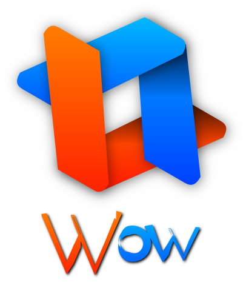
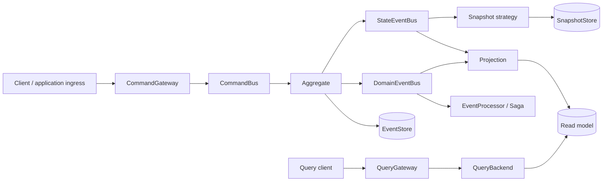

<p align="center" style="text-align:center;">
  
</p>

<h1 align="center">Wow</h1>

<p align="center"><strong>Domain Model as a Service</strong></p>

<p align="center">A reactive CQRS and Event Sourcing framework for explicit, testable, and traceable domain decisions.</p>

<p align="center">
  <a href="https://www.kaicode.org/2026.html"></a><br/>
  <strong>KaiCode’26 Excellent Award</strong>
</p>

<p align="center">
  <a href="https://github.com/Ahoo-Wang/Wow/blob/main/LICENSE"></a>
  <a href="https://github.com/Ahoo-Wang/Wow/releases"></a>
  <a href="https://central.sonatype.com/artifact/me.ahoo.wow/wow-core"></a>
  <a href="https://app.codacy.com/gh/Ahoo-Wang/Wow/dashboard"></a>
  <a href="https://codecov.io/gh/Ahoo-Wang/Wow"></a>
  <a href="https://github.com/Ahoo-Wang/Wow/actions/workflows/integration-test.yml"></a>
  <a href="https://kotlin.link/"></a>
  <a href="https://deepwiki.com/Ahoo-Wang/Wow"></a>
</p>

<p align="center">
  <strong>Domain-Driven</strong> &middot; <strong>Event-Driven</strong> &middot; <strong>Test-Driven</strong> &middot; <strong>Declarative</strong> &middot; <strong>Reactive</strong>
</p>

<p align="center">
  <a href="https://wow.ahoo.me/">English documentation</a> &middot; <a href="https://wow.ahoo.me/zh/">中文文档</a>
</p>

---

## What Wow Gives You

Wow turns each write into an observable domain flow:

```text
HTTP command → aggregate decision → domain event → sourced state → projection / saga
```

You define commands, events, aggregate rules, and sourcing handlers. Wow supplies the reactive command pipeline, event persistence, snapshots, wait stages, projections, sagas, generated metadata, WebFlux routes, and a Given → When → Expect test DSL.

This is most useful when business rules, state history, multiple read models, or cross-aggregate workflows justify Event Sourcing. For simple CRUD where one database transaction already expresses the whole problem, the added event-evolution and eventual-consistency costs may not pay off.

## 30-Minute First-Slice Target

[](https://github.com/new?template_name=wow-project-template&template_owner=Ahoo-Wang)

1. Create or clone the [Wow Project Template](https://github.com/Ahoo-Wang/wow-project-template).
2. Run `./gradlew :domain:check`, then start `./gradlew :server:run` with the documented in-memory configuration.
3. Follow [Getting Started](documentation/docs/en/guide/getting-started.md) to send a real `CreateDemo` command, wait for `SNAPSHOT`, and read state at aggregate version `1`.

That path proves the domain test, generated route, command pipeline, event sourcing, snapshot wait, and versioned state read. The 30-minute duration is a target: the functional path has been exercised, but a first-time developer's wall-clock completion has not been measured. If you are adding Wow to an existing service, use [Add Wow to an Existing Project](documentation/docs/en/guide/existing-project.md).

## Evidence in This Repository

| Capability | What to inspect |
| --- | --- |
| Aggregate decisions and event-sourced state | [Order and cart example](example/example-domain/src/main/kotlin/me/ahoo/wow/example/domain) and its [domain specifications](example/example-domain/src/test/kotlin/me/ahoo/wow/example/domain) |
| Command dispatch, event persistence, projections, and sagas | [wow-core](wow-core/src/main/kotlin/me/ahoo/wow) |
| Given → When → Expect verification | [wow-test](test/wow-test/src/main/kotlin/me/ahoo/wow/test) |
| Generated HTTP command and state routes | [wow-webflux](wow-webflux/src/main/kotlin/me/ahoo/wow/webflux/route) |
| Optional storage, messaging, security, and telemetry integrations | [wow-spring-boot-starter feature capabilities](wow-spring-boot-starter/build.gradle.kts) |
| Compensation and recovery operations | [Compensation domain](compensation) and [control plane](documentation/docs/en/reference/example/compensation.md#compensation-control-plane) |


```mermaid
flowchart LR
    Client[Client / application ingress] --> CommandGateway[CommandGateway]
    CommandGateway --> CommandBus[CommandBus]
    CommandBus --> Aggregate[Aggregate]
    Aggregate --> EventStore[(EventStore)]
    Aggregate --> DomainBus[DomainEventBus]
    Aggregate --> StateBus[StateEventBus]
    DomainBus --> Processor[EventProcessor / Saga]
    DomainBus --> Projection[Projection]
    StateBus --> Projection
    StateBus --> Snapshot[Snapshot strategy]
    Snapshot --> SnapshotStore[(SnapshotStore)]
    Projection --> ReadModel[(Read model)]
    QueryClient[Query client] --> QueryGateway[QueryGateway]
    QueryGateway --> QueryBackend[QueryBackend]
    QueryBackend --> ReadModel
```

## Compatibility Baseline

The current source tree declares:

| Component | Baseline |
| --- | --- |
| Wow | `9.0.0` |
| Java | 17+ |
| Spring Boot | `4.1.1` |
| Kotlin | `2.4.10` |
| KSP | `2.3.11` |

The project template evolves independently. The tutorial records the exact template commit and its pinned Wow version; inspect its [`gradle/libs.versions.toml`](https://github.com/Ahoo-Wang/wow-project-template/blob/main/gradle/libs.versions.toml) before starting. For another framework line, pin the exact [release](https://github.com/Ahoo-Wang/Wow/releases) and inspect that tag: for example, [`v6.20.16`](https://github.com/Ahoo-Wang/Wow/blob/v6.20.16/gradle/libs.versions.toml) declares Wow `6.20.16` and Spring Boot `3.5.11`.

Source, binary, and wire compatibility are separate concerns. Validate the one your upgrade requires, especially persisted events and generated HTTP contracts.

## Continue

- Start with the [Introduction](documentation/docs/en/guide/introduction.md), [Core Concepts](documentation/docs/en/guide/core-concepts.md), and [documentation map](documentation/docs/en/guide/index.md).
- Read the Kotlin [Order Service](example) or Java [Bank Transfer](example/transfer) example.
- Explore processing stages in [Command Completion](documentation/docs/en/guide/command/completion.md), read models in [Projection](documentation/docs/en/guide/projection.md), and recovery in [Event Compensation](documentation/docs/en/guide/event/compensation.md).
- Review [Contributing](CONTRIBUTING.md), the [Code of Conduct](CODE_OF_CONDUCT.md), and the [Security Policy](SECURITY.md).
- Wow received the [KaiCode’26 Excellent Award](https://www.kaicode.org/2026.html) for evidence including its modular design, review discipline, testing, static analysis, bilingual documentation, and Maven Central release history.

Related projects: [CosId](https://github.com/Ahoo-Wang/CosId), [CoSec](https://github.com/Ahoo-Wang/CoSec), [CoCache](https://github.com/Ahoo-Wang/CoCache), [Simba](https://github.com/Ahoo-Wang/Simba), [CoSky](https://github.com/Ahoo-Wang/CoSky), [CoApi](https://github.com/Ahoo-Wang/CoApi), and [FluentAssert](https://github.com/Ahoo-Wang/FluentAssert).

## License

Wow is released under the [Apache 2.0 License](LICENSE).
