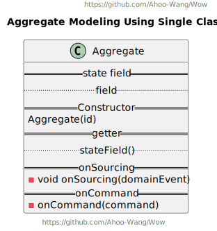
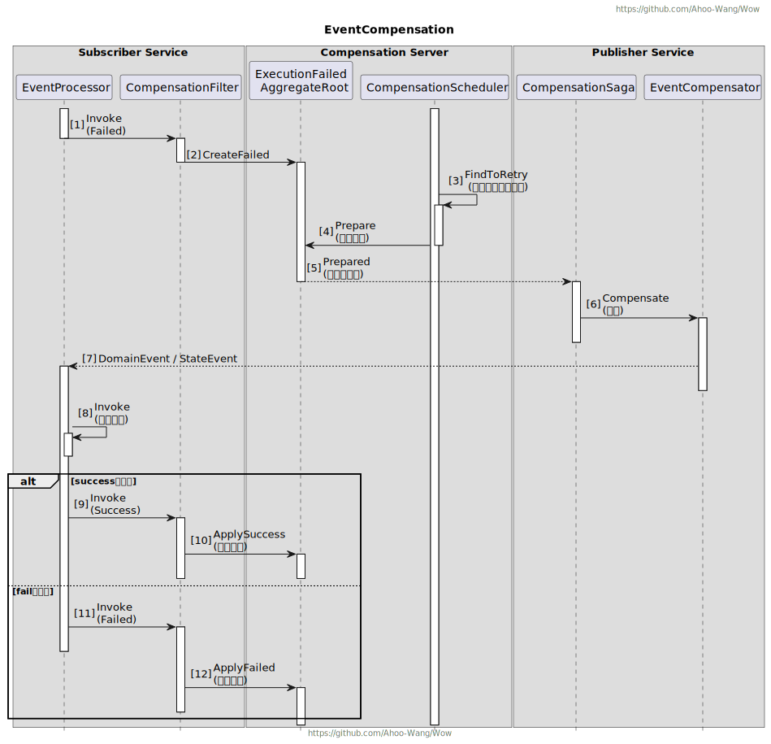

<p align="center" style="text-align:center;">
  
</p>

# Wow : Modern Reactive CQRS Architecture Microservice development framework based on DDD and EventSourcing

> [中文文档](https://wow.ahoo.me/)

[](https://github.com/Ahoo-Wang/Wow/blob/main/LICENSE)
[](https://github.com/Ahoo-Wang/Wow/releases)
[](https://maven-badges.herokuapp.com/maven-central/me.ahoo.wow/wow-core)
[](https://app.codacy.com/gh/Ahoo-Wang/Wow/dashboard?utm_source=gh&utm_medium=referral&utm_content=&utm_campaign=Badge_grade)
[](https://codecov.io/gh/Ahoo-Wang/Wow)
[](https://github.com/Ahoo-Wang/Wow)
[](https://github.com/KotlinBy/awesome-kotlin)
[](https://deepwiki.com/Ahoo-Wang/Wow)

**Domain-Driven** | **Event-Driven** | **Test-Driven** | **Declarative-Design** | **Reactive Programming** | **Command Query Responsibility Segregation** | **Event Sourcing**

## Quick Start

Use [Wow Project Template](https://github.com/Ahoo-Wang/wow-project-template) to quickly create a DDD project based on the Wow framework.

## Features Overview

<p align="center" style="text-align:center">
  
</p>

## Architecture

<p align="center" style="text-align:center">
  
</p>

### Command Processing Propagation Chain


## Performance Test (Example)

- Test Code: [Example](./example)
- Test Case: Add To Shopping Cart / Create Order
- Command `WaitStrategy`: `SENT`、`PROCESSED`

### Deployment

- [Redis](deploy/example/perf/redis.yaml)
- [MongoDB](deploy/example/perf/mongo.yaml)
- [Kafka](deploy/example/perf/kafka.yaml)
- [Application-Config](deploy/example/perf/config/mongo_kafka_redis.yaml)
- [Application-Deployment](deploy/example/perf/deployment.yaml)

### Test Report

#### Add To Shopping Cart

- [Request](deploy/example/request/AddCartItem.http)
- [Detailed Report(PDF)-SENT](./document/example/perf/Example.Cart.Add@SENT.pdf)
- [Detailed Report(PDF)-PROCESSED](./document/example/perf/Example.Cart.Add@PROCESSED.pdf)

> `WaitStrategy`:`SENT` Mode, The `AddCartItem` command write request API After 2 minutes of stress testing, the average TPS was *59625*, the peak was *82312*, and the average response time was *29* ms.

<p align="center" style="text-align:center">
  
</p>

> `WaitStrategy`:`PROCESSED` Mode, The `AddCartItem` command write request API After 2 minutes of stress testing, the average TPS was *18696*, the peak was *24141*, and the average response time was *239* ms.

<p align="center" style="text-align:center">
  
</p>

#### Create Order

- [Request](deploy/example/request/CreateOrder.http)
- [Detailed Report(PDF)-SENT](./document/example/perf/Example.Order.Create@SENT.pdf)
- [Detailed Report(PDF)-PROCESSED](./document/example/perf/Example.Order.Create@PROCESSED.pdf)

> `WaitStrategy`:`SENT` Mode, The `CreateOrder` command write request API After 2 minutes of stress testing, the average TPS was *47838*, the peak was *86200*, and the average response time was *217* ms.

<p align="center" style="text-align:center">
  
</p>

> `WaitStrategy`:`PROCESSED` Mode, The `CreateOrder` command write request API After 2 minutes of stress testing, the average TPS was *18230*, the peak was *25506*, and the average response time was *268* ms.

<p align="center" style="text-align:center">
  
</p>

## Event Sourcing

<p align="center" style="text-align:center">
  
</p>

## Observability

<p align="center" style="text-align:center">
  
</p>

## OpenAPI (Spring WebFlux Integration)

> Automatically register the `Command` routing processing function (`HandlerFunction`), and developers only need to
> write the domain model to complete the service development.

<p align="center" style="text-align:center">
  
</p>

## Test suite: 80%+ test coverage is very easy

> Given -> When -> Expect .

<p align="center" style="text-align:center">
  
</p>

## Preconditions

- Understanding **Domain Driven Design**：《Implementing Domain-Driven Design》,《Domain-Driven Design: Tackling Complexity
  in the Heart of Software》
- Understanding **Command Query Responsibility Segregation**(CQRS)
- Understanding **EventSourcing**
- Understanding **Reactive Programming**

### Order Service（Kotlin）

[Example-Order](./example)

### Transfer（JAVA）

[Example-Transfer](./example/transfer)

## Unit Test Suite

### 80%+ test coverage is very easy.


> Given -> When -> Expect .

### Aggregate Unit Test (`AggregateVerifier`)

[Aggregate Test](./example/example-domain/src/test/kotlin/me/ahoo/wow/example/domain/order/OrderTest.kt)

```kotlin
class CartSpec : AggregateSpec<Cart, CartState>({
  on {
    val ownerId = generateGlobalId()
    val addCartItem = AddCartItem(
      productId = "productId",
      quantity = 1,
    )
    givenOwnerId(ownerId)
    whenCommand(addCartItem) {
      expectNoError()
      expectEventType(CartItemAdded::class)
      expectState {
        items.assert().hasSize(1)
      }
      expectStateAggregate {
        ownerId.assert().isEqualTo(ownerId)
      }
      fork {
        val removeCartItem = RemoveCartItem(
          productIds = setOf(addCartItem.productId),
        )
        whenCommand(removeCartItem) {
          expectEventType(CartItemRemoved::class)
        }
      }
      fork {
        whenCommand(DefaultDeleteAggregate) {
          expectEventType(DefaultAggregateDeleted::class)
          expectStateAggregate {
            deleted.assert().isTrue()
          }

          fork {
            whenCommand(DefaultDeleteAggregate) {
              expectErrorType(IllegalAccessDeletedAggregateException::class)
            }
          }
          fork {
            whenCommand(DefaultRecoverAggregate) {
              expectNoError()
              expectStateAggregate {
                deleted.assert().isFalse()
              }
              fork {
                whenCommand(DefaultRecoverAggregate) {
                  expectErrorType(IllegalStateException::class)
                }
              }
            }
          }
        }
      }
    }
  }
}
)
```

### Saga Unit Test (`SagaVerifier`)

[Saga Test](./example/example-domain/src/test/kotlin/me/ahoo/wow/example/domain/cart/CartSagaTest.kt)

```kotlin
class CartSagaSpec : SagaSpec<CartSaga>({
  on {
    val ownerId = generateGlobalId()
    val orderItem = OrderItem(
      id = generateGlobalId(),
      productId = generateGlobalId(),
      price = BigDecimal.valueOf(10),
      quantity = 10,
    )
    whenEvent(
      event = mockk<OrderCreated> {
        every {
          items
        } returns listOf(orderItem)
        every {
          fromCart
        } returns true
      },
      ownerId = ownerId
    ) {
      expectCommandType(RemoveCartItem::class)
      expectCommand<RemoveCartItem> {
        aggregateId.id.assert().isEqualTo(ownerId)
        body.productIds.assert().hasSize(1)
        body.productIds.assert().first().isEqualTo(orderItem.productId)
      }
    }
  }
  on {
    name("NotFromCart")
    val orderItem = OrderItem(
      id = generateGlobalId(),
      productId = generateGlobalId(),
      price = BigDecimal.valueOf(10),
      quantity = 10,
    )
    whenEvent(
      event = mockk<OrderCreated> {
        every {
          items
        } returns listOf(orderItem)
        every {
          fromCart
        } returns false
      },
      ownerId = generateGlobalId()
    ) {
      expectNoCommand()
    }
  }
})
```

## Design

### Modeling

| **Single Class**                                                                       | **Inheritance Pattern**                                                                     | **Aggregation Pattern**                                                                     |
|----------------------------------------------------------------------------------------|---------------------------------------------------------------------------------------------|:--------------------------------------------------------------------------------------------|
|  |  |  |

### Load Aggregate

<p align="center" style="text-align:center">
  
</p>

### Aggregate State Flow

<p align="center" style="text-align:center">
  
</p>

### Send Command

<p align="center" style="text-align:center">
  
</p>

### Command And Event Flow

<p align="center" style="text-align:center">
  
</p>

## Event Compensation

### Use Case

<p align="center" style="text-align:center">
  
</p>

### Execution Sequence Diagram

<p align="center" style="text-align:center">
  
</p>

### Dashboard

<p align="center" style="text-align:center">
  
</p>

<p align="center" style="text-align:center">
  
</p>

<p align="center" style="text-align:center">
  
</p>

<p align="center" style="text-align:center">
  
</p>

