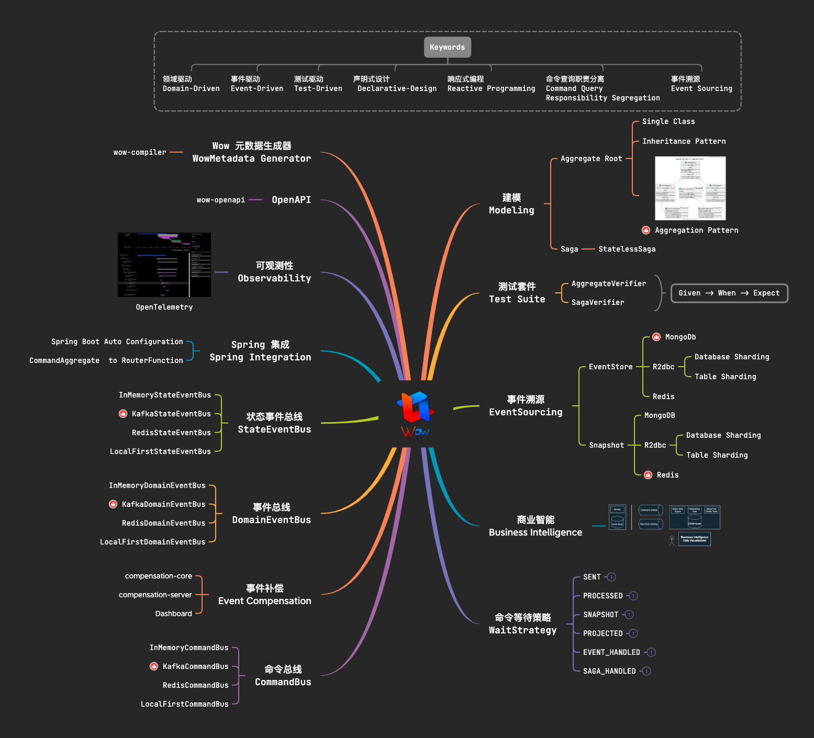
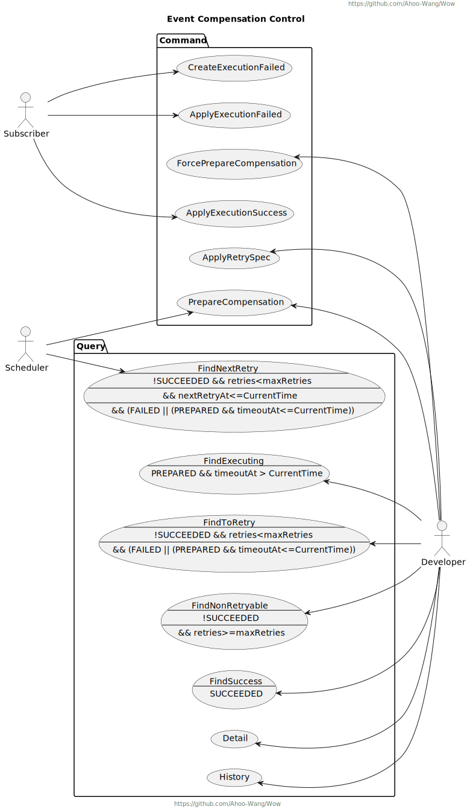

<p align="center" style="text-align:center;">
  
</p>

# Wow : Modern Reactive CQRS Architecture Microservice development framework based on DDD and EventSourcing

> [中文文档](https://ahoowang.gitee.io/wow/)

[](https://github.com/Ahoo-Wang/Wow/blob/mvp/LICENSE)
[](https://github.com/Ahoo-Wang/Wow/releases)
[](https://maven-badges.herokuapp.com/maven-central/me.ahoo.wow/wow-core)
[](https://app.codacy.com/gh/Ahoo-Wang/Wow/dashboard?utm_source=gh&utm_medium=referral&utm_content=&utm_campaign=Badge_grade)
[](https://codecov.io/gh/Ahoo-Wang/Wow)
[](https://github.com/Ahoo-Wang/Wow)
[](https://github.com/KotlinBy/awesome-kotlin)

**Domain-Driven** | **Event-Driven** | **Test-Driven** | **Declarative-Design** | **Reactive Programming** | **Command Query Responsibility Segregation** | **Event Sourcing**

## Quick Start

Use [Wow Project Template](https://github.com/Ahoo-Wang/wow-project-template) to quickly create a DDD project based on the Wow framework.

## Features Overview

<p align="center" style="text-align:center">
  
</p>

## Architecture

<p align="center" style="text-align:center">
  
</p>

## Performance Test (Example)

- Test Code: [Example](./example)
- Test Case: Add To Shopping Cart / Create Order
- Command `WaitStrategy`: `SENT`、`PROCESSED`

### Deployment

- [Redis](deploy/example/perf/redis.yaml)
- [MongoDB](deploy/example/perf/mongo.yaml)
- [Kafka](deploy/example/perf/kafka.yaml)
- [Application-Config](deploy/example/perf/config/mongo_kafka_redis.yaml)
- [Application-Deployment](deploy/example/perf/deployment.yaml)

### Test Report

#### Add To Shopping Cart

- [Request](deploy/example/request/AddCartItem.http)
- [Detailed Report(PDF)-SENT](./document/example/perf/Example.Cart.Add@SENT.pdf)
- [Detailed Report(PDF)-PROCESSED](./document/example/perf/Example.Cart.Add@PROCESSED.pdf)

> `WaitStrategy`:`SENT` Mode, The `AddCartItem` command write request API After 2 minutes of stress testing, the average TPS was *59625*, the peak was *82312*, and the average response time was *29* ms.

<p align="center" style="text-align:center">
  
</p>

> `WaitStrategy`:`PROCESSED` Mode, The `AddCartItem` command write request API After 2 minutes of stress testing, the average TPS was *18696*, the peak was *24141*, and the average response time was *239* ms.

<p align="center" style="text-align:center">
  
</p>

#### Create Order

- [Request](deploy/example/request/CreateOrder.http)
- [Detailed Report(PDF)-SENT](./document/example/perf/Example.Order.Create@SENT.pdf)
- [Detailed Report(PDF)-PROCESSED](./document/example/perf/Example.Order.Create@PROCESSED.pdf)

> `WaitStrategy`:`SENT` Mode, The `CreateOrder` command write request API After 2 minutes of stress testing, the average TPS was *47838*, the peak was *86200*, and the average response time was *217* ms.

<p align="center" style="text-align:center">
  
</p>

> `WaitStrategy`:`PROCESSED` Mode, The `CreateOrder` command write request API After 2 minutes of stress testing, the average TPS was *18230*, the peak was *25506*, and the average response time was *268* ms.

<p align="center" style="text-align:center">
  
</p>

## Event Sourcing

<p align="center" style="text-align:center">
  
</p>

## Observability

<p align="center" style="text-align:center">
  
</p>

## OpenAPI (Spring WebFlux Integration)

> Automatically register the `Command` routing processing function (`HandlerFunction`), and developers only need to
> write the domain model to complete the service development.

<p align="center" style="text-align:center">
  
</p>

## Test suite: 80%+ test coverage is very easy

> Given -> When -> Expect .

<p align="center" style="text-align:center">
  
</p>

## Preconditions

- Understanding **Domain Driven Design**：《Implementing Domain-Driven Design》,《Domain-Driven Design: Tackling Complexity
  in the Heart of Software》
- Understanding **Command Query Responsibility Segregation**(CQRS)
- Understanding **EventSourcing**
- Understanding **Reactive Programming**

### Order Service（Kotlin）

[Example-Order](./example)

### Transfer（JAVA）

[Example-Transfer](./example/transfer)

## Unit Test Suite

### 80%+ test coverage is very easy.


> Given -> When -> Expect .

### Aggregate Unit Test (`AggregateVerifier`)

[Aggregate Test](./example/example-domain/src/test/kotlin/me/ahoo/wow/example/domain/order/OrderTest.kt)

```kotlin
internal class OrderTest {

    @Test
    private fun createOrder() {
        val tenantId = GlobalIdGenerator.generateAsString()
        val customerId = GlobalIdGenerator.generateAsString()

        val orderItem = OrderItem(
            GlobalIdGenerator.generateAsString(),
            GlobalIdGenerator.generateAsString(),
            BigDecimal.valueOf(10),
            10,
        )
        val orderItems = listOf(orderItem)
        val inventoryService = object : InventoryService {
            override fun getInventory(productId: String): Mono<Int> {
                return orderItems.filter { it.productId == productId }.map { it.quantity }.first().toMono()
            }
        }
        val pricingService = object : PricingService {
            override fun getProductPrice(productId: String): Mono<BigDecimal> {
                return orderItems.filter { it.productId == productId }.map { it.price }.first().toMono()
            }
        }
        aggregateVerifier<Order, OrderState>(tenantId = tenantId)
            .inject(DefaultCreateOrderSpec(inventoryService, pricingService))
            .given()
            .`when`(CreateOrder(customerId, orderItems, SHIPPING_ADDRESS, false))
            .expectEventCount(1)
            .expectEventType(OrderCreated::class.java)
            .expectStateAggregate {
                assertThat(it.aggregateId.tenantId, equalTo(tenantId))
            }
            .expectState {
                assertThat(it.id, notNullValue())
                assertThat(it.customerId, equalTo(customerId))
                assertThat(it.address, equalTo(SHIPPING_ADDRESS))
                assertThat(it.items, equalTo(orderItems))
                assertThat(it.status, equalTo(OrderStatus.CREATED))
            }
            .verify()
    }

    @Test
    fun createOrderGivenEmptyItems() {
        val customerId = GlobalIdGenerator.generateAsString()
        aggregateVerifier<Order, OrderState>()
            .inject(mockk<CreateOrderSpec>(), "createOrderSpec")
            .given()
            .`when`(CreateOrder(customerId, listOf(), SHIPPING_ADDRESS, false))
            .expectErrorType(IllegalArgumentException::class.java)
            .expectStateAggregate {
                /*
                 * 该聚合对象处于未初始化状态，即该聚合未创建成功.
                 */
                assertThat(it.initialized, equalTo(false))
            }.verify()
    }

    /**
     * 创建订单-库存不足
     */
    @Test
    fun createOrderWhenInventoryShortage() {
        val customerId = GlobalIdGenerator.generateAsString()
        val orderItem = OrderItem(
            GlobalIdGenerator.generateAsString(),
            GlobalIdGenerator.generateAsString(),
            BigDecimal.valueOf(10),
            10,
        )
        val orderItems = listOf(orderItem)
        val inventoryService = object : InventoryService {
            override fun getInventory(productId: String): Mono<Int> {
                return orderItems.filter { it.productId == productId }
                    /*
                     * 模拟库存不足
                     */
                    .map { it.quantity - 1 }.first().toMono()
            }
        }
        val pricingService = object : PricingService {
            override fun getProductPrice(productId: String): Mono<BigDecimal> {
                return orderItems.filter { it.productId == productId }.map { it.price }.first().toMono()
            }
        }

        aggregateVerifier<Order, OrderState>()
            .inject(DefaultCreateOrderSpec(inventoryService, pricingService))
            .given()
            .`when`(CreateOrder(customerId, orderItems, SHIPPING_ADDRESS, false))
            /*
             * 期望：库存不足异常.
             */
            .expectErrorType(InventoryShortageException::class.java)
            .expectStateAggregate {
                /*
                 * 该聚合对象处于未初始化状态，即该聚合未创建成功.
                 */
                assertThat(it.initialized, equalTo(false))
            }.verify()
    }
}
```

### Saga Unit Test (`SagaVerifier`)

[Saga Test](./example/example-domain/src/test/kotlin/me/ahoo/wow/example/domain/cart/CartSagaTest.kt)

```kotlin
class CartSagaTest {

    @Test
    fun onOrderCreated() {
        val orderItem = OrderItem(
            GlobalIdGenerator.generateAsString(),
            GlobalIdGenerator.generateAsString(),
            BigDecimal.valueOf(10),
            10,
        )
        sagaVerifier<CartSaga>()
            .`when`(
                mockk<OrderCreated> {
                    every {
                        customerId
                    } returns "customerId"
                    every {
                        items
                    } returns listOf(orderItem)
                    every {
                        fromCart
                    } returns true
                },
            )
            .expectCommandBody<RemoveCartItem> {
                assertThat(it.id, equalTo("customerId"))
                assertThat(it.productIds, hasSize(1))
                assertThat(it.productIds.first(), equalTo(orderItem.productId))
            }
            .verify()
    }
}
```

## Design

### Modeling

| **Single Class**                                                                       | **Inheritance Pattern**                                                                     | **Aggregation Pattern**                                                                     |
|----------------------------------------------------------------------------------------|---------------------------------------------------------------------------------------------|:--------------------------------------------------------------------------------------------|
|  |  |  |

### Load Aggregate

<p align="center" style="text-align:center">
  
</p>

### Aggregate State Flow

<p align="center" style="text-align:center">
  
</p>

### Send Command

<p align="center" style="text-align:center">
  
</p>

### Command And Event Flow

<p align="center" style="text-align:center">
  
</p>

## Event Compensation

### Use Case

<p align="center" style="text-align:center">
  
</p>

### Execution Sequence Diagram

<p align="center" style="text-align:center">
  
</p>

### Dashboard

<p align="center" style="text-align:center">
  
</p>

<p align="center" style="text-align:center">
  
</p>

<p align="center" style="text-align:center">
  
</p>

<p align="center" style="text-align:center">
  
</p>

