<p align="center" style="text-align:center;">
  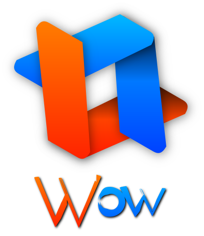
</p>

<h1 align="center">Wow</h1>

<p align="center"><strong>领域模型即服务</strong></p>

<p align="center">基于 DDD & Event Sourcing 的现代响应式 CQRS 架构微服务开发框架</p>

<p align="center">
  <a href="https://www.kaicode.org/2026.html"></a><br/>
  <strong>KaiCode’26 Excellent Award</strong>
</p>

<p align="center">
  <a href="https://github.com/Ahoo-Wang/Wow/blob/main/LICENSE"></a>
  <a href="https://github.com/Ahoo-Wang/Wow/releases"></a>
  <a href="https://central.sonatype.com/artifact/me.ahoo.wow/wow-core"></a>
  <a href="https://app.codacy.com/gh/Ahoo-Wang/Wow/dashboard"></a>
  <a href="https://codecov.io/gh/Ahoo-Wang/Wow"></a>
  <a href="https://github.com/Ahoo-Wang/Wow/actions/workflows/integration-test.yml"></a>
  <a href="https://kotlin.link/"></a>
  <a href="https://deepwiki.com/Ahoo-Wang/Wow"></a>
</p>

<p align="center">
  <strong>领域驱动</strong> &middot; <strong>事件驱动</strong> &middot; <strong>测试驱动</strong> &middot; <strong>声明式设计</strong> &middot; <strong>响应式</strong> &middot; <strong>CQRS</strong> &middot; <strong>事件溯源</strong>
</p>

<p align="center">
  <a href="https://wow.ahoo.me/">English</a> &middot; <a href="https://wow.ahoo.me/zh/">中文</a>
</p>

---

## 荣誉

Wow 荣获 [KaiCode’26 Excellent Award](https://www.kaicode.org/2026.html)。官方结果页重点提及了项目的模块化 DDD/CQRS 设计、规范且由多位评审者参与的代码审查、基于 Testcontainers 的集成测试、强制执行的测试覆盖率阈值、Detekt 静态分析、双语文档，以及长期的 Maven Central 语义化版本发布记录。

## 快速开始

[](https://github.com/new?template_name=wow-project-template&template_owner=Ahoo-Wang)

点击上方按钮，从 [Wow 项目模板](https://github.com/Ahoo-Wang/wow-project-template) 创建你自己的项目仓库，然后克隆到本地，开始编写领域模型。

> **Wow 8.x** 支持 Spring Boot 4.x，基于 Java 17+
>
> **Wow 6.x** 支持 Spring Boot 3.x，基于 Java 17+

## 为什么选择 Wow？

随着业务复杂度的增长，传统 CRUD 架构逐渐暴露瓶颈 — 纠缠不清的数据库模式、痛苦的分库分表、脆弱的分布式事务。*领域驱动设计* 和 *事件溯源* 能够解决这些问题，但往往伴随着陡峭的学习曲线和沉重的实践成本。

Wow 正是为改变这一现状而生。历经多年生产环境验证，将 DDD + ES 凝练为对开发者友好的框架 — 你只需专注领域模型，其余的交给 Wow。

**对开发者：**
- **聚焦业务，而非基础设施** — 只需编写领域模型，Wow 自动生成 OpenAPI 接口
- **轻松测试** — Given→When→Expect 模式让 85%+ 的单元测试覆盖率成为常态，而非奢望
- **优雅的读写分离** — 等待 `PROJECTED` 信号而非猜测同步延迟，告别"等 1 秒再刷新"
- **无感水平扩容** — 无需分片规则，业务代码无需任何变更即可横向扩展

**对企业：**
- **商业智能** — 状态事件和命令作为丰富的实时数据源，将 ETL 简化为一条 SQL 脚本
- **操作审计** — 每条命令及其产生的领域事件均被记录，具备清晰的业务语义
- **工程质量** — 在 API 测试中，基于 Wow 的项目缺陷数仅为同等研发水平传统架构项目的 **1/3**

> 值得一提的是，领域驱动设计和事件溯源并非微服务架构的专属，_Wow_ 框架不仅适用于微服务开发，同样也可用于构建基于领域驱动设计的单体应用程序。

## 特性一览

<p align="center">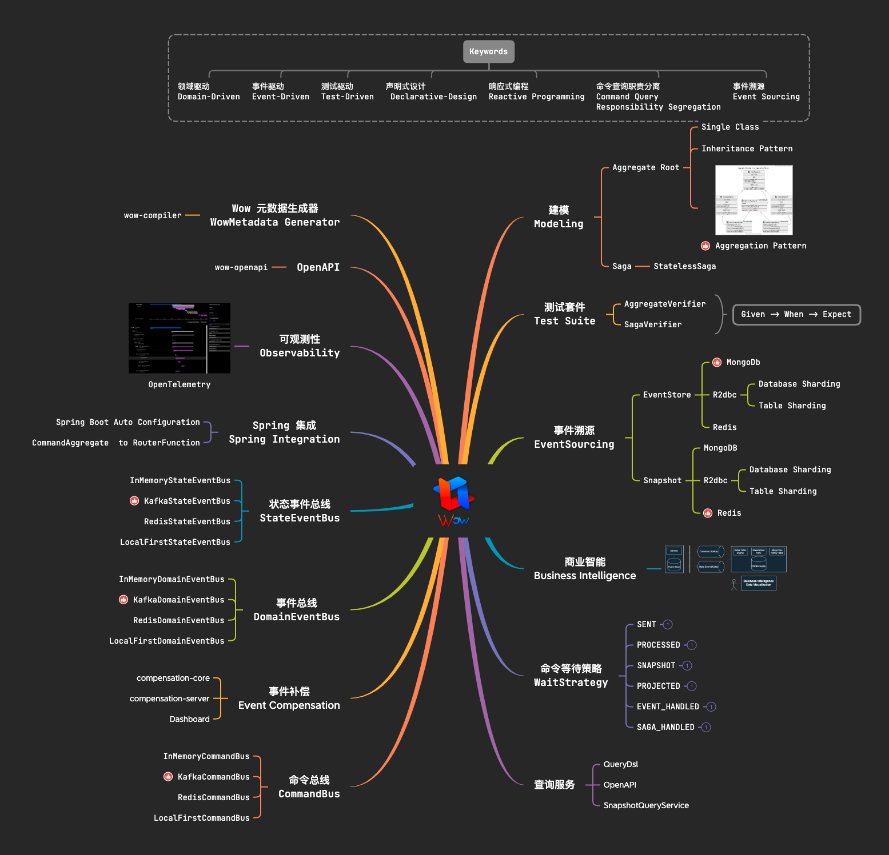</p>

| 特性 | 说明 |
|------|------|
| **领域模型即服务** | 仅需编写领域模型，Wow 自动生成 OpenAPI 接口 — 无需编写 Controller 样板代码 |
| **测试套件** | Given→When→Expect 模式（`AggregateSpec` / `SagaSpec`），轻松实现 80%+ 覆盖率 |
| **高性能** | 写操作仅需 AppendOnly 写入事件存储，读操作利用面向查询的搜索引擎 — 压测 TPS 高达 59k+ |
| **水平伸缩** | 无需考虑分片规则，业务代码无需变更即可水平扩展 |
| **分布式事务** | Saga 编排模式，精细管理复杂多服务间事务 |
| **事件补偿** | 可视化控制台 + 可配置 `RetrySpec` 的自动补偿机制，确保最终一致性 |
| **读写分离** | `SENT` / `PROCESSED` / `PROJECTED` 等待计划，彻底告别同步延迟猜测 |
| **可观测性** | 集成 OpenTelemetry，实现端到端追踪、指标和调试 |
| **响应式** | 全栈基于 Project Reactor 的非阻塞异步消息通信 |
| **事件溯源** | 通过事件回放完整还原状态历史，支持强大的审计和时间旅行调试 |
| **商业智能** | 丰富的事件溯源数据源，实时同步至数据仓库，极低 ETL 成本 |

## 架构

<p align="center"></p>

### 命令处理传播链

<p align="center"></p>

## 性能测试

示例应用压力测试（2 分钟）：

| 操作 | 等待计划 | 平均 TPS | 峰值 TPS | 平均延迟 |
|------|---------|---------|---------|---------|
| 加入购物车 | `SENT` | 59,625 | 82,312 | 29 ms |
| 加入购物车 | `PROCESSED` | 18,696 | 24,141 | 239 ms |
| 创建订单 | `SENT` | 47,838 | 86,200 | 217 ms |
| 创建订单 | `PROCESSED` | 18,230 | 25,506 | 268 ms |

<details>
<summary>性能详情与部署</summary>

- 测试代码：[Example](./example)
- 部署配置：[Redis](deploy/example/perf/redis.yaml) / [MongoDB](deploy/example/perf/mongo.yaml) / [Kafka](deploy/example/perf/kafka.yaml)

<p align="center">
  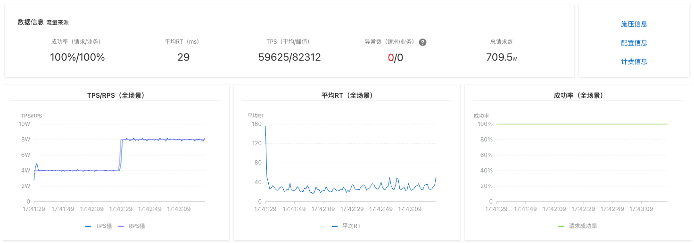
</p>

<p align="center">
  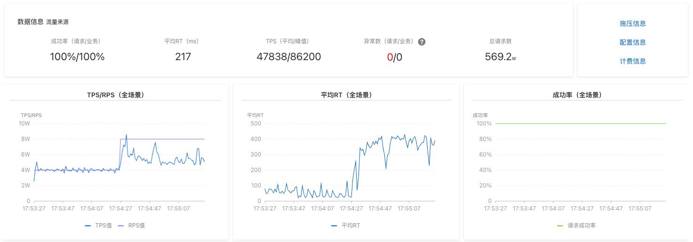
</p>

</details>

## 测试套件

> Given → When → Expect

<p align="center">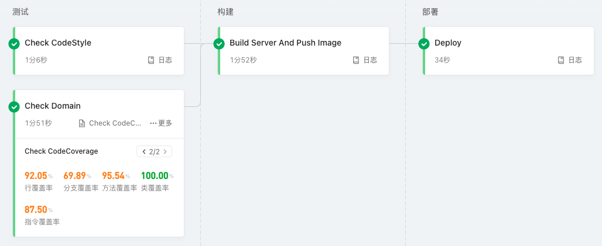</p>

### 聚合根测试（`AggregateVerifier`）

```kotlin
class CartSpec : AggregateSpec<Cart, CartState>({
  on {
    whenCommand(AddCartItem(productId = "productId", quantity = 1)) {
      expectNoError()
      expectEventType(CartItemAdded::class)
      expectState {
        items.assert().hasSize(1)
      }
    }
  }
})
```

### Saga 测试（`SagaVerifier`）

```kotlin
class CartSagaSpec : SagaSpec<CartSaga>({
  on {
    whenEvent(event = mockk<OrderCreated> {
      every { items } returns listOf(orderItem)
      every { fromCart } returns true
    }, ownerId = ownerId) {
      expectCommandType(RemoveCartItem::class)
    }
  }
})
```

## 设计

### 建模范式

| 单一类 | 继承模式 | 聚合模式 |
|:---:|:---:|:---:|
| 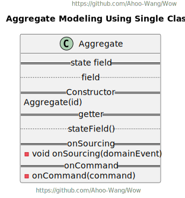 | 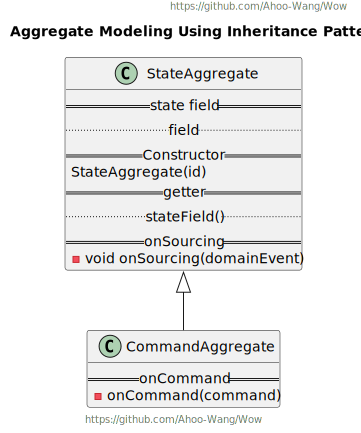 | 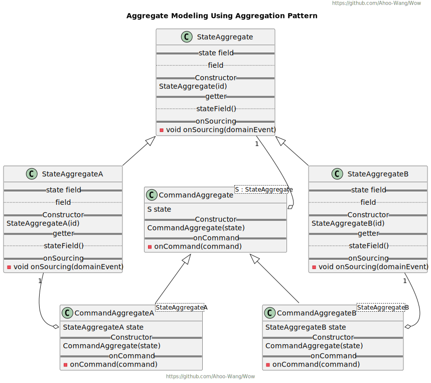 |

### 核心流程

<p align="center">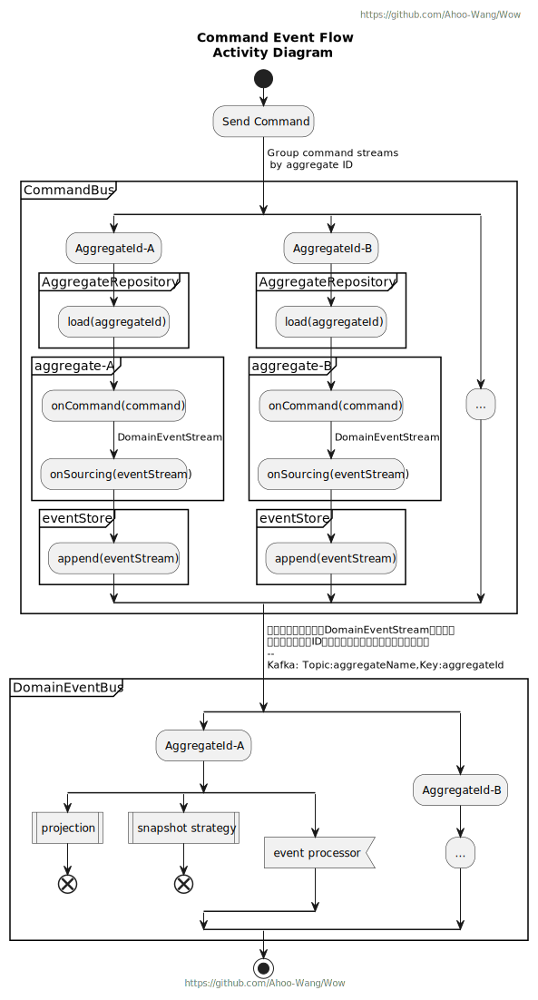</p>

<p align="center"></p>

<details>
<summary>更多设计图</summary>

**加载聚合根**

<p align="center">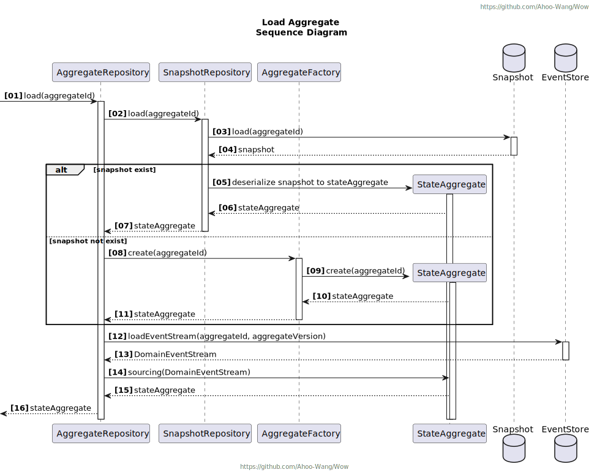</p>

**聚合状态流转**

<p align="center">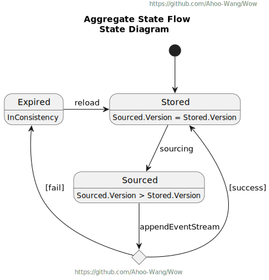</p>

**发送命令**

<p align="center"></p>

**可观测性**

<p align="center">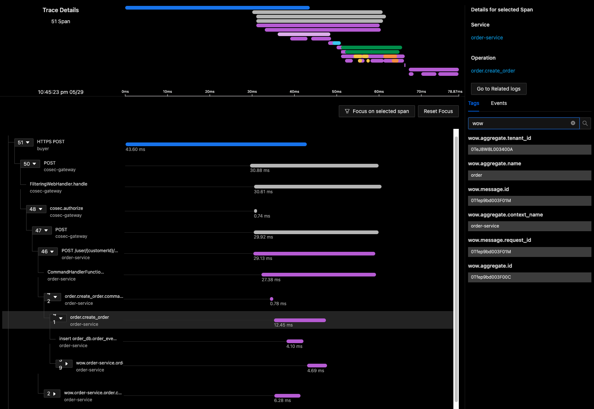</p>

</details>

## 事件补偿

<p align="center">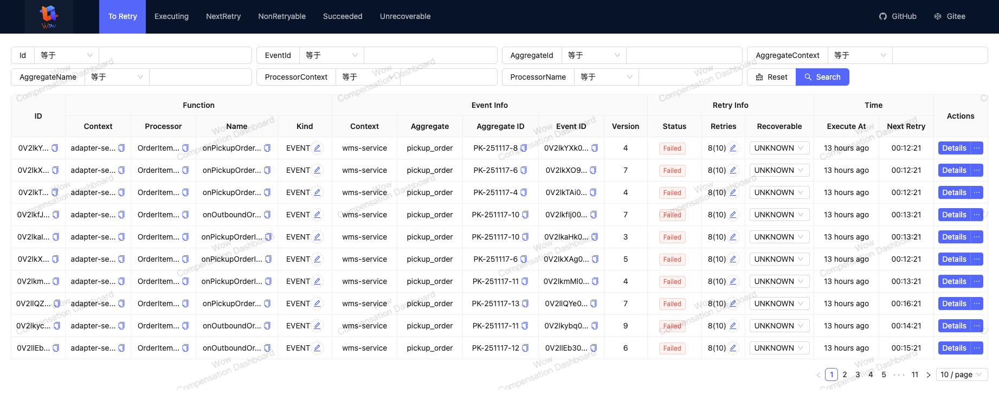</p>

<details>
<summary>补偿详情</summary>

<p align="center">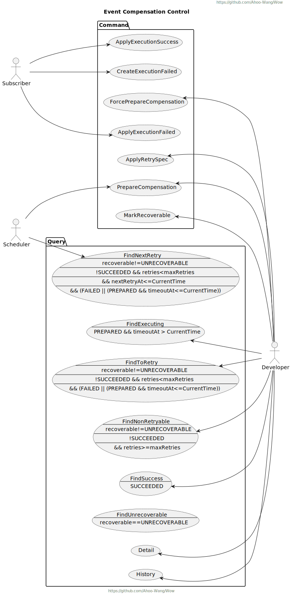</p>

<p align="center">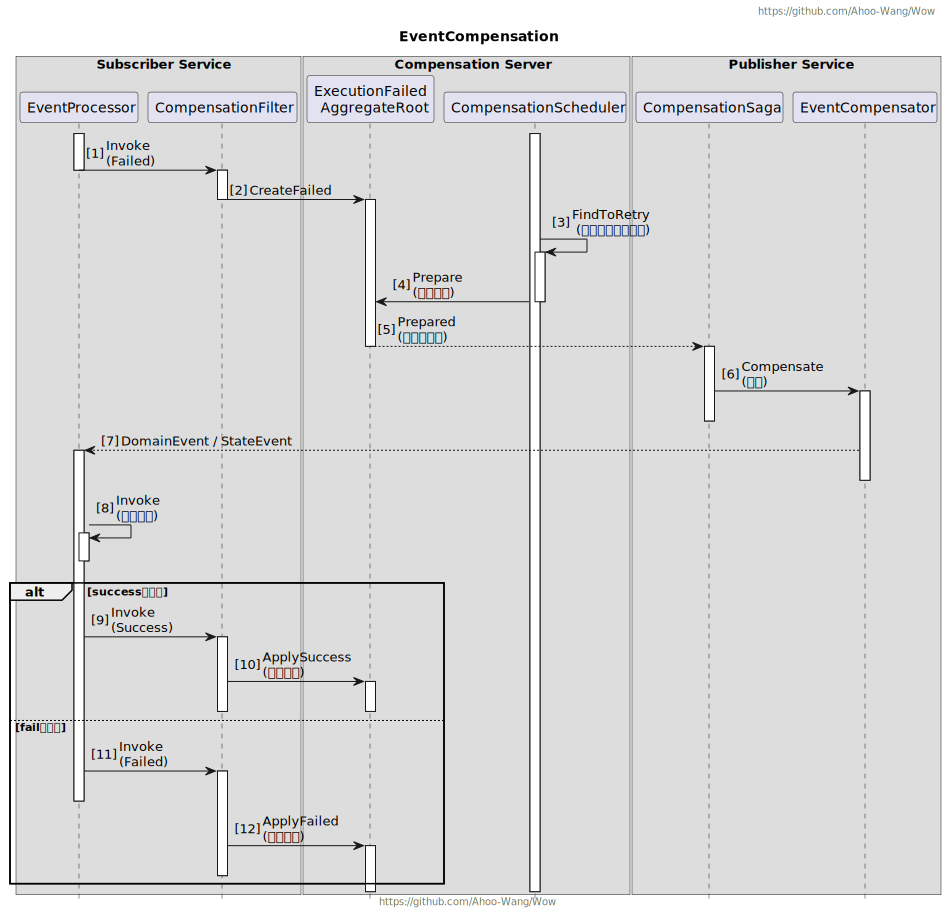</p>

<p align="center">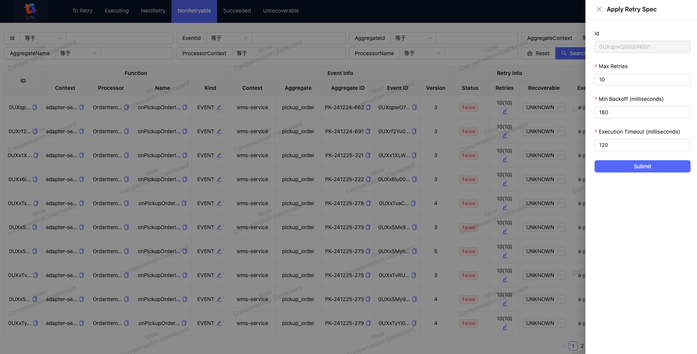</p>

<p align="center">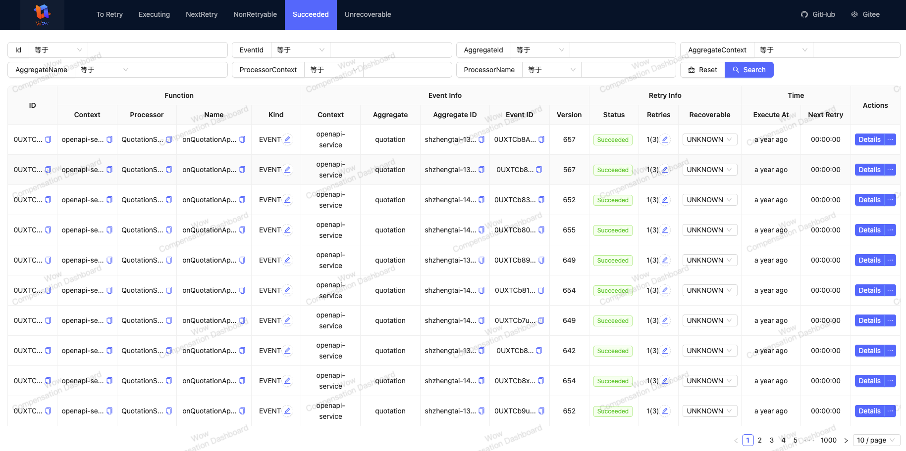</p>

</details>

## 生态

| 项目 | 说明 |
|------|------|
| [CosId](https://github.com/Ahoo-Wang/CosId) | 通用、灵活、高性能的分布式 ID 生成器 |
| [CoSec](https://github.com/Ahoo-Wang/CoSec) | 基于策略和 RBAC 的多租户响应式安全框架 |
| [CoCache](https://github.com/Ahoo-Wang/CoCache) | 分布式一致性二级缓存框架 |
| [Simba](https://github.com/Ahoo-Wang/Simba) | 易用、灵活的分布式锁服务 |
| [CoSky](https://github.com/Ahoo-Wang/CoSky) | 高性能、低成本的微服务治理平台 |
| [CoApi](https://github.com/Ahoo-Wang/CoApi) | Spring 6 零样板 HTTP 客户端自动配置 |
| [FluentAssert](https://github.com/Ahoo-Wang/FluentAssert) | Kotlin 流式断言库，让测试更简洁优雅 |

## 示例

| 示例 | 语言 | 说明 |
|------|------|------|
| [订单服务](./example) | Kotlin | 聚合根、Saga、投影 — 完整 DDD 示例 |
| [银行转账](./example/transfer) | Java | 简单事件溯源示例 |

## 社区

- [贡献指南](CONTRIBUTING.md)
- [行为准则](CODE_OF_CONDUCT.md)
- [安全策略](SECURITY.md)

## License

Wow 基于 [Apache 2.0](LICENSE) 协议开源。
