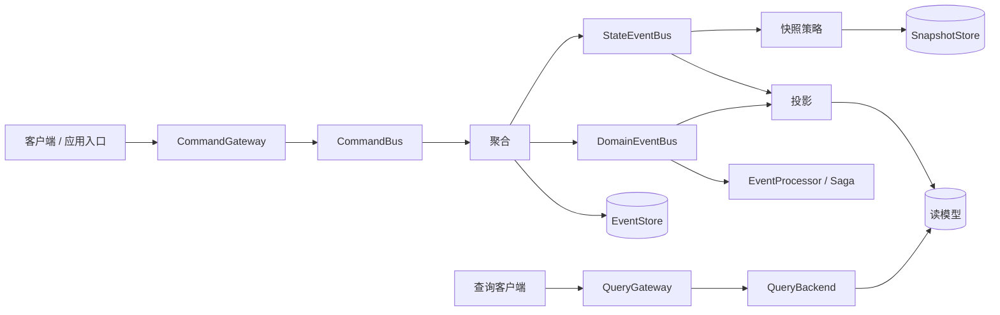

<p align="center" style="text-align:center;">
  
</p>

<h1 align="center">Wow</h1>

<p align="center"><strong>领域模型即服务</strong></p>

<p align="center">让领域决策显式、可测试、可追溯的响应式 CQRS 与事件溯源框架。</p>

<p align="center">
  <a href="https://www.kaicode.org/2026.html"></a><br/>
  <strong>KaiCode’26 Excellent Award</strong>
</p>

<p align="center">
  <a href="https://github.com/Ahoo-Wang/Wow/blob/main/LICENSE"></a>
  <a href="https://github.com/Ahoo-Wang/Wow/releases"></a>
  <a href="https://central.sonatype.com/artifact/me.ahoo.wow/wow-core"></a>
  <a href="https://app.codacy.com/gh/Ahoo-Wang/Wow/dashboard"></a>
  <a href="https://codecov.io/gh/Ahoo-Wang/Wow"></a>
  <a href="https://github.com/Ahoo-Wang/Wow/actions/workflows/integration-test.yml"></a>
  <a href="https://kotlin.link/"></a>
  <a href="https://deepwiki.com/Ahoo-Wang/Wow"></a>
</p>

<p align="center">
  <strong>领域驱动</strong> &middot; <strong>事件驱动</strong> &middot; <strong>测试驱动</strong> &middot; <strong>声明式设计</strong> &middot; <strong>响应式</strong>
</p>

<p align="center">
  <a href="https://wow.ahoo.me/">English documentation</a> &middot; <a href="https://wow.ahoo.me/zh/">中文文档</a>
</p>

---

## Wow 提供什么

Wow 把每次写入变成可观察的领域链路：

```text
HTTP 命令 → 聚合决策 → 领域事件 → 溯源状态 → 投影 / Saga
```

你负责定义命令、事件、聚合规则和溯源函数；Wow 提供响应式命令管道、事件持久化、快照、等待阶段、投影、Saga、元数据生成、WebFlux 路由和 Given → When → Expect 测试 DSL。

当业务规则复杂，需要状态历史、多种读模型或跨聚合流程时，这套模型更有价值。若问题只是简单 CRUD，且一个数据库事务已经能完整表达需求，引入事件演进和最终一致性的成本可能得不偿失。

## 30 分钟首条链路目标

[](https://github.com/new?template_name=wow-project-template&template_owner=Ahoo-Wang)

1. 从 [Wow 项目模板](https://github.com/Ahoo-Wang/wow-project-template)创建或克隆仓库。
2. 运行 `./gradlew :domain:check`，再以文档中的内存配置启动 `./gradlew :server:run`。
3. 按[快速上手](documentation/docs/zh/guide/getting-started.md)发送真实 `CreateDemo` 命令，等待 `SNAPSHOT`，并读取聚合版本 `1` 的状态。

这条路径会同时证明领域测试、生成路由、命令管道、事件溯源、快照等待和版本化状态读取。30 分钟是目标时长：功能链路已经过演练，但尚未测量新开发者首次完成的墙钟时间。若要在已有服务中接入，请改走[接入现有项目](documentation/docs/zh/guide/existing-project.md)。

## 仓库内的能力证据

| 能力 | 可检查的实现与测试 |
| --- | --- |
| 聚合决策与事件溯源状态 | [订单与购物车示例](example/example-domain/src/main/kotlin/me/ahoo/wow/example/domain)及其[领域规约](example/example-domain/src/test/kotlin/me/ahoo/wow/example/domain) |
| 命令调度、事件持久化、投影与 Saga | [wow-core](wow-core/src/main/kotlin/me/ahoo/wow) |
| Given → When → Expect 验证 | [wow-test](test/wow-test/src/main/kotlin/me/ahoo/wow/test) |
| 生成的 HTTP 命令与状态路由 | [wow-webflux](wow-webflux/src/main/kotlin/me/ahoo/wow/webflux/route) |
| 可选存储、消息、安全与可观测集成 | [wow-spring-boot-starter Feature Capabilities](wow-spring-boot-starter/build.gradle.kts) |
| 补偿与恢复操作 | [补偿领域](compensation)与[补偿控制面](documentation/docs/zh/reference/example/compensation.md#补偿控制面) |


```mermaid
flowchart LR
    Client[客户端 / 应用入口] --> CommandGateway[CommandGateway]
    CommandGateway --> CommandBus[CommandBus]
    CommandBus --> Aggregate[聚合]
    Aggregate --> EventStore[(EventStore)]
    Aggregate --> DomainBus[DomainEventBus]
    Aggregate --> StateBus[StateEventBus]
    DomainBus --> Processor[EventProcessor / Saga]
    DomainBus --> Projection[投影]
    StateBus --> Projection
    StateBus --> Snapshot[快照策略]
    Snapshot --> SnapshotStore[(SnapshotStore)]
    Projection --> ReadModel[(读模型)]
    QueryClient[查询客户端] --> QueryGateway[QueryGateway]
    QueryGateway --> QueryBackend[QueryBackend]
    QueryBackend --> ReadModel
```

## 兼容性基线

当前源码声明：

| 组件 | 基线 |
| --- | --- |
| Wow | `9.0.2` |
| Java | 17+ |
| Spring Boot | `4.1.1` |
| Kotlin | `2.4.10` |
| KSP | `2.3.11` |

项目模板独立演进。教程会记录实际验证的模板提交与其固定的 Wow 版本；开始前仍应检查模板的 [`gradle/libs.versions.toml`](https://github.com/Ahoo-Wang/wow-project-template/blob/main/gradle/libs.versions.toml)。使用其他框架版本时，先固定精确 [Release](https://github.com/Ahoo-Wang/Wow/releases) 再查看对应 tag：例如 [`v6.20.16`](https://github.com/Ahoo-Wang/Wow/blob/v6.20.16/gradle/libs.versions.toml) 声明 Wow `6.20.16` 与 Spring Boot `3.5.11`。

源码、二进制和线协议兼容是三个不同范围。升级时只验证真正需要的范围，并重点检查持久化事件与生成的 HTTP 契约。

## 继续阅读

- 从[简介](documentation/docs/zh/guide/introduction.md)、[核心概念](documentation/docs/zh/guide/core-concepts.md)和[文档导览](documentation/docs/zh/guide/index.md)开始。
- 阅读 Kotlin [订单服务](example)或 Java [银行转账](example/transfer)示例。
- 在[命令完成语义](documentation/docs/zh/guide/command/completion.md)中理解处理阶段，在[投影](documentation/docs/zh/guide/projection.md)建立读模型，在[事件补偿](documentation/docs/zh/guide/event/compensation.md)了解恢复边界。
- 查看[贡献指南](CONTRIBUTING.md)、[行为准则](CODE_OF_CONDUCT.md)和[安全策略](SECURITY.md)。
- Wow 荣获 [KaiCode’26 Excellent Award](https://www.kaicode.org/2026.html)；官方结果给出的证据包括模块化设计、代码评审、测试、静态分析、双语文档和 Maven Central 发布历史。

相关项目：[CosId](https://github.com/Ahoo-Wang/CosId)、[CoSec](https://github.com/Ahoo-Wang/CoSec)、[CoCache](https://github.com/Ahoo-Wang/CoCache)、[Simba](https://github.com/Ahoo-Wang/Simba)、[CoSky](https://github.com/Ahoo-Wang/CoSky)、[CoApi](https://github.com/Ahoo-Wang/CoApi)和 [FluentAssert](https://github.com/Ahoo-Wang/FluentAssert)。

## License

Wow 基于 [Apache 2.0](LICENSE) 协议开源。
