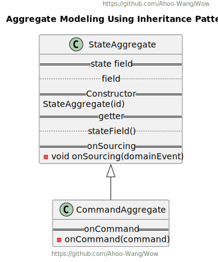

# Wow

基于 DDD、EventSourcing 的现代响应式 CQRS 架构微服务开发框架。

[](https://github.com/Ahoo-Wang/Wow/blob/mvp/LICENSE)
[](https://github.com/Ahoo-Wang/Wow/releases)
[](https://maven-badges.herokuapp.com/maven-central/me.ahoo.wow/wow-core)
[](https://codecov.io/gh/Ahoo-Wang/Wow)
[](https://github.com/Ahoo-Wang/Wow)

Domain-Driven | Event-Driven | Test-Driven | Annotation-Driven | Declarative-Design ｜ Reactor-First

## 架构图

<p align="center" style="text-align:center">
  
</p>

### 事件源

<p align="center" style="text-align:center">
  
</p>

## 前置条件

- 理解 **领域驱动设计**：《实现领域驱动设计》、《领域驱动设计：软件核心复杂性应对之道》
- 理解 **命令查询职责分离**（CQRS）
- 理解 **事件源架构**
- 理解 **响应式编程**

## 特性

- [x] Aggregate Modeling
    - [x] Single Class
    - [x] Inheritance Pattern
    - [x] Aggregation Pattern
- [ ] Saga Modeling
    - [x] `StatelessSaga`
    - [ ] `StatefulSaga`
- [x] Test Suite
    - [x] Test Specification
    - [x] `AggregateVerifier`
    - [x] `StatelessSagaVerifier`
- [x] EventSourcing
    - EventStream
        - [x] MongoDB (Recommend)
        - [x] R2dbc
            - [x] Database Sharding
            - [x] Table Sharding
    - Snapshot
        - [x] MongoDB (Recommend)
        - [x] R2dbc
            - [x] Database Sharding
            - [x] Table Sharding
        - [x] ElasticSearch
- [x] Kafka 集成
    - [x] `CommandBus`
    - [x] `DomainEventBus`
- [x] Spring 集成
    - [x] Spring Boot Auto Configuration
    - [x] Automatically register `CommandAggregate` to `RouterFunction`
- [x] 可观测性
    - [x] OpenTelemetry
- [x] OpenApi
- [x] `WowMetadata` Generator
    - [x] `wow-compiler`

## Example

[Example](./example)

## 测试套件

### 80%+ 的测试覆盖率轻而易举。


> Given -> When -> Expect .

```kotlin
internal class OrderTest {

    companion object {
        val SHIPPING_ADDRESS = ShippingAddress("China", "ShangHai", "ShangHai", "HuangPu", "001")
    }

    private fun mockCreateOrder(): VerifiedStage<OrderState> {
        val tenantId = GlobalIdGenerator.generateAsString()
        val customerId = GlobalIdGenerator.generateAsString()

        val orderItem = OrderItem(
            GlobalIdGenerator.generateAsString(),
            GlobalIdGenerator.generateAsString(),
            BigDecimal.valueOf(10),
            10
        )
        val orderItems = listOf(orderItem)
        val inventoryService = object : InventoryService {
            override fun getInventory(productId: String): Mono<Int> {
                return orderItems.toFlux().filter { it.productId == productId }.map { it.quantity }.last()
            }
        }
        val pricingService = object : PricingService {
            override fun getProductPrice(productId: String): Mono<BigDecimal> {
                return orderItems.toFlux().filter { it.productId == productId }.map { it.price }.last()
            }
        }
        return aggregateVerifier<Order, OrderState>(tenantId = tenantId)
            .inject(DefaultCreateOrderSpec(inventoryService, pricingService))
            .given()
            .`when`(CreateOrder(customerId, orderItems, SHIPPING_ADDRESS))
            .expectEventCount(1)
            .expectEventType(OrderCreated::class.java)
            .expectStateAggregate {
                assertThat(it.aggregateId.tenantId, equalTo(tenantId))
            }
            .expectState {
                assertThat(it.id, notNullValue())
                assertThat(it.customerId, equalTo(customerId))
                assertThat(it.address, equalTo(SHIPPING_ADDRESS))
                assertThat(it.items, equalTo(orderItems))
                assertThat(it.status, equalTo(OrderStatus.CREATED))
            }
            .verify()
    }

    /**
     * 创建订单
     */
    @Test
    fun createOrder() {
        mockCreateOrder()
    }

    /**
     * 创建订单-库存不足
     */
    @Test
    fun createOrderWhenInventoryShortage() {
        val customerId = GlobalIdGenerator.generateAsString()
        val orderItem = OrderItem(
            GlobalIdGenerator.generateAsString(),
            GlobalIdGenerator.generateAsString(),
            BigDecimal.valueOf(10),
            10
        )
        val orderItems = listOf(orderItem)
        val inventoryService = object : InventoryService {
            override fun getInventory(productId: String): Mono<Int> {
                return orderItems.toFlux().filter { it.productId == productId }
                    /*
                     * 模拟库存不足
                     */
                    .map { it.quantity - 1 }.last()
            }
        }
        val pricingService = object : PricingService {
            override fun getProductPrice(productId: String): Mono<BigDecimal> {
                return orderItems.toFlux().filter { it.productId == productId }.map { it.price }.last()
            }
        }

        aggregateVerifier<Order, OrderState>()
            .inject(DefaultCreateOrderSpec(inventoryService, pricingService))
            .given()
            .`when`(CreateOrder(customerId, orderItems, SHIPPING_ADDRESS))
            /*
             * 期望：库存不足异常.
             */
            .expectErrorType(InventoryShortageException::class.java)
            .expectStateAggregate {
                /*
                 * 该聚合对象处于未初始化状态，即该聚合未创建成功.
                 */
                assertThat(it.initialized, equalTo(false))
            }.verify()
    }

    /**
     * 创建订单-下单价格与当前价格不一致
     */
    @Test
    fun createOrderWhenPriceInconsistency() {
        val customerId = GlobalIdGenerator.generateAsString()
        val orderItem = OrderItem(
            GlobalIdGenerator.generateAsString(),
            GlobalIdGenerator.generateAsString(),
            BigDecimal.valueOf(10),
            10
        )
        val orderItems = listOf(orderItem)
        val inventoryService = object : InventoryService {
            override fun getInventory(productId: String): Mono<Int> {
                return orderItems.toFlux().filter { it.productId == productId }.map { it.quantity }.last()
            }
        }
        val pricingService = object : PricingService {
            override fun getProductPrice(productId: String): Mono<BigDecimal> {
                return orderItems.toFlux().filter { it.productId == productId }
                    /*
                     * 模拟下单价格、商品定价不一致
                     */
                    .map { it.price.plus(BigDecimal.valueOf(1)) }.last()
            }
        }
        aggregateVerifier<Order, OrderState>()
            .inject(DefaultCreateOrderSpec(inventoryService, pricingService))
            .given()
            .`when`(CreateOrder(customerId, orderItems, SHIPPING_ADDRESS))
            /*
             * 期望：价格不一致异常.
             */
            .expectErrorType(PriceInconsistencyException::class.java).verify()
    }

    private fun mockPayOrder(): VerifiedStage<OrderState> {
        val verifiedStageAfterCreateOrder = mockCreateOrder()
        val previousState = verifiedStageAfterCreateOrder.stateRoot
        val payOrder = PayOrder(
            previousState.id,
            GlobalIdGenerator.generateAsString(),
            previousState.totalAmount
        )

        return verifiedStageAfterCreateOrder
            .then()
            .given()
            /*
             * 2. 当接收到命令
             */
            .`when`(payOrder)
            /*
             * 3.1 期望将会产生1个事件
             */
            .expectEventCount(1)
            /*
             * 3.2 期望将会产生一个 OrderPaid 事件 (3.1 可以不需要)
             */
            .expectEventType(OrderPaid::class.java)
            /*
             * 3.3 期望产生的事件状态
             */
            .expectEventBody<OrderPaid> {
                assertThat(it.amount, equalTo(payOrder.amount))
            }
            /*
             * 4. 期望当前聚合状态
             */
            .expectState {
                assertThat(it.address, equalTo(SHIPPING_ADDRESS))
                assertThat(it.paidAmount, equalTo(payOrder.amount))
                assertThat(it.status, equalTo(OrderStatus.PAID))
            }
            /*
             * 完成测试编排后，验证期望.
             */
            .verify()
    }

    /**
     * 支付订单
     */
    @Test
    fun payOrder() {
        mockPayOrder()
    }

    /**
     * 支付订单-超付
     */
    @Test
    fun payOrderWhenOverPay() {
        val verifiedStageAfterCreateOrder = mockCreateOrder()
        val previousState = verifiedStageAfterCreateOrder.stateRoot
        val payOrder = PayOrder(
            previousState.id,
            GlobalIdGenerator.generateAsString(),
            previousState.totalAmount.plus(
                BigDecimal.valueOf(1)
            )
        )
        verifiedStageAfterCreateOrder
            .then()
            .given()
            /*
             * 2. 处理 PayOrder 命令
             */
            .`when`(payOrder)
            /*
             * 3.1 期望将会产生俩个事件分别是： OrderPaid、OrderOverPaid
             */
            .expectEventType(OrderPaid::class.java, OrderOverPaid::class.java)
            /*
             * 3.2 期望产生的事件状态
             */
            .expectEventStream {
                val itr = it.iterator()
                /*
                 * OrderPaid
                 */
                val orderPaid = itr.next().body as OrderPaid
                assertThat(orderPaid.paid, equalTo(true))
                /*
                 * OrderOverPaid
                 */
                val orderOverPaid = itr.next().body as OrderOverPaid
                assertThat(
                    orderOverPaid.overPay,
                    equalTo(payOrder.amount.minus(previousState.totalAmount))
                )
            }
            /*
             * 4. 期望当前聚合状态
             */
            .expectState {
                assertThat(it.paidAmount, equalTo(previousState.totalAmount))
                assertThat(it.status, equalTo(OrderStatus.PAID))
            }
            .verify()
    }

    /**
     * 发货
     */
    @Test
    fun ship() {
        val verifiedStageAfterPayOrder = mockPayOrder()
        val shipOrder = ShipOrder(verifiedStageAfterPayOrder.stateRoot.id)
        verifiedStageAfterPayOrder
            .then().given()
            .`when`(shipOrder)
            .expectEventType(OrderShipped::class.java)
            /*
             * 4. 期望当前聚合状态
             */
            .expectState {
                assertThat(it.status, equalTo(OrderStatus.SHIPPED))
            }
            .verify()
    }

    @Test
    fun shipGivenUnpaid() {
        val verifiedStageAfterCreateOrder = mockCreateOrder()
        val shipOrder = ShipOrder(verifiedStageAfterCreateOrder.stateRoot.id)
        verifiedStageAfterCreateOrder.then().given()
            .`when`(shipOrder)
            .expectErrorType(IllegalStateException::class.java)
            .expectState {
                /*
                 * 验证聚合状态[未]发生变更.
                 */
                assertThat(it.paidAmount, equalTo(BigDecimal.ZERO))
                assertThat(it.status, equalTo(OrderStatus.CREATED))
            }
            .verify()
    }

    private fun mockDeleteOrder(): VerifiedStage<OrderState> {
        val verifiedStageAfterCreateOrder = mockCreateOrder()
        return verifiedStageAfterCreateOrder.then().given()
            .`when`(DeleteAggregate)
            .expectEventType(AggregateDeleted::class.java)
            .expectStateAggregate {
                assertThat(it.deleted, equalTo(true))
            }
            .verify()
    }

    @Test
    fun deleteOrder() {
        mockDeleteOrder()
    }

    @Test
    fun deleteGivenDeleted() {
        val verifiedStageAfterDelete = mockDeleteOrder()
        verifiedStageAfterDelete.then().given()
            .`when`(DeleteAggregate)
            .expectErrorType(IllegalAccessDeletedAggregateException::class.java)
            .expectError<IllegalAccessDeletedAggregateException> {
                assertThat(it.aggregateId, equalTo(verifiedStageAfterDelete.stateAggregate.aggregateId))
            }.expectStateAggregate {
                assertThat(it.deleted, equalTo(true))
            }
            .verify()
    }
}
```

## 设计

### 聚合建模

| **Single Class**                                                                       | **Inheritance Pattern**                                                                     | **Aggregation Pattern**                                                                     |
|----------------------------------------------------------------------------------------|---------------------------------------------------------------------------------------------|:--------------------------------------------------------------------------------------------|
|  |  |  |

### 加载聚合


### 聚合状态流


### 发送命令


### 命令与事件流


### Saga - OrderProcessManager (Demo)


