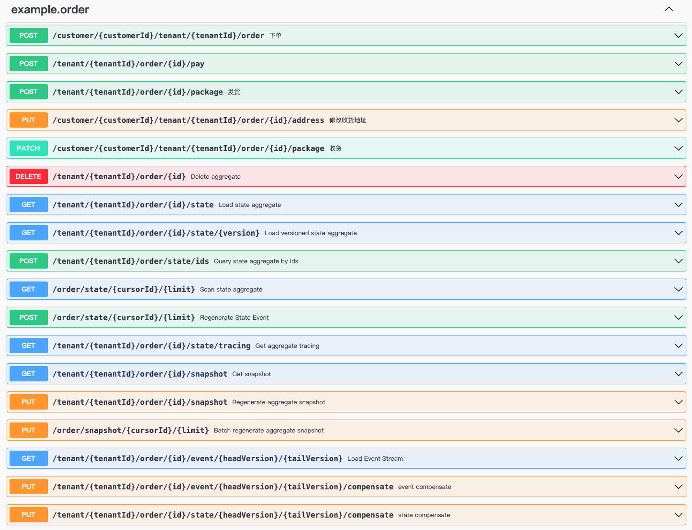
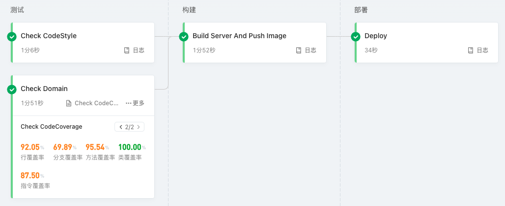
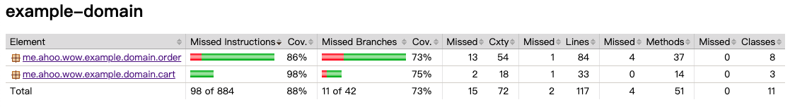
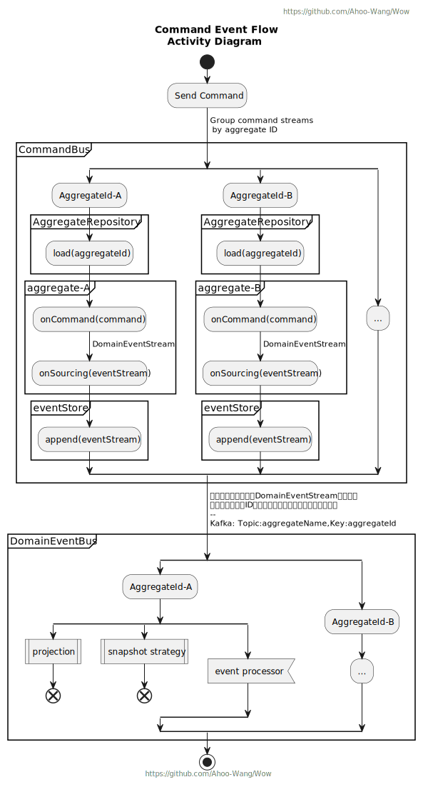

<p align="center" style="text-align:center;">
  
</p>

# Wow : 基于 DDD、EventSourcing 的现代响应式 CQRS 架构微服务开发框架

> [English Document](https://github.com/Ahoo-Wang/Wow/blob/main/README.md)

[](https://github.com/Ahoo-Wang/Wow/blob/mvp/LICENSE)
[](https://github.com/Ahoo-Wang/Wow/releases)
[](https://maven-badges.herokuapp.com/maven-central/me.ahoo.wow/wow-core)
[](https://app.codacy.com/gh/Ahoo-Wang/Wow/dashboard?utm_source=gh&utm_medium=referral&utm_content=&utm_campaign=Badge_grade)
[](https://codecov.io/gh/Ahoo-Wang/Wow)
[](https://github.com/Ahoo-Wang/Wow)
[](https://github.com/KotlinBy/awesome-kotlin)

**领域驱动** | **事件驱动** | **测试驱动** | **声明式设计** | **响应式编程** | **命令查询职责分离** | **事件溯源**

## 快速开始

使用[Wow 项目模板](https://gitee.com/AhooWang/wow-project-template)快速创建基于 Wow 框架的 DDD 项目。

## 架构图

<p align="center" style="text-align:center">
  
</p>

## 性能测试 (Example)

- 测试代码：[Example](./example)
- 测试场景：加入购物车、下单
- 命令发送等待模式（`WaitStrategy`）：`SENT`、`PROCESSED`

### 部署

- [Redis](deploy/example/perf/redis.yaml)
- [MongoDB](deploy/example/perf/mongo.yaml)
- [Kafka](deploy/example/perf/kafka.yaml)
- [Application-Config](deploy/example/perf/config/mongo_kafka_redis.yaml)
- [Application-Deployment](deploy/example/perf/deployment.yaml)

### 测试报告

#### 加入购物车

- [请求](deploy/example/request/AddCartItem.http)
- [详细报告(PDF)-SENT](./document/example/perf/Example.Cart.Add@SENT.pdf)
- [详细报告(PDF)-PROCESSED](./document/example/perf/Example.Cart.Add@PROCESSED.pdf)

> `WaitStrategy`: `SENT`


> `WaitStrategy`: `PROCESSED`

 
#### 下单

- [请求](deploy/example/request/CreateOrder.http)
- [详细报告(PDF)-SENT](./document/example/perf/Example.Order.Create@SENT.pdf)
- [详细报告(PDF)-PROCESSED](./document/example/perf/Example.Order.Create@PROCESSED.pdf)

> `WaitStrategy`: `SENT`


> `WaitStrategy`: `PROCESSED`


## 事件源

<p align="center" style="text-align:center">
  
</p>

## 可观测性

<p align="center" style="text-align:center">
  
</p>

## OpenAPI (Spring WebFlux 集成)

> 自动注册 **命令** 路由处理函数(`HandlerFunction`) ，开发人员仅需编写领域模型，即可完成服务开发。

<p align="center" style="text-align:center">
  
</p>

## 测试套件：80%+ 的测试覆盖率轻而易举

> Given -> When -> Expect .

<p align="center" style="text-align:center">
  
</p>

## 前置条件

- 理解 **领域驱动设计**：《实现领域驱动设计》、《领域驱动设计：软件核心复杂性应对之道》
- 理解 **命令查询职责分离**（CQRS）
- 理解 **事件源架构**
- 理解 **响应式编程**

## 特性

- [x] Aggregate Modeling
    - [x] Single Class
    - [x] Inheritance Pattern
    - [x] Aggregation Pattern
- [x] Saga Modeling
    - [x] `StatelessSaga`
- [x] Test Suite
    - [x] 兼容性测试规范（TCK）
    - [x] `AggregateVerifier`
    - [x] `SagaVerifier`
- [x] EventSourcing
    - EventStore
        - [x] MongoDB (Recommend)
        - [x] R2dbc
            - [x] Database Sharding
            - [x] Table Sharding
        - [x] Redis
    - Snapshot
        - [x] MongoDB
        - [x] R2dbc
            - [x] Database Sharding
            - [x] Table Sharding
        - [x] ElasticSearch
        - [x] Redis (Recommend)
- [x] 命令等待策略（`WaitStrategy`）
    - [x] `SENT` : 命令发送成功后发送完成信号
    - [x] `PROCESSED` : 命令处理完成后发送完成信号
    - [x] `SNAPSHOT` : 快照生成完成后发送完成信号
    - [x] `PROJECTED` : 命令产生的事件被投影后发送完成信号
- [x] CommandBus
    - [x] `InMemoryCommandBus`
    - [x] `KafkaCommandBus` (Recommend)
    - [x] `RedisCommandBus`
    - [x] `LocalFirstCommandBus`
- [x] DomainEventBus
    - [x] `InMemoryDomainEventBus` 
    - [x] `KafkaDomainEventBus` (Recommend)
    - [x] `RedisDomainEventBus`
    - [x] `LocalFirstDomainEventBus`
- [x] StateEventBus
    - [x] `InMemoryStateEventBus` 
    - [x] `KafkaStateEventBus` (Recommend)
    - [x] `RedisStateEventBus`
    - [x] `LocalFirstStateEventBus`
- [x] Spring 集成
    - [x] Spring Boot Auto Configuration
    - [x] Automatically register `CommandAggregate` to `RouterFunction`
- [x] 可观测性
    - [x] OpenTelemetry
- [x] OpenAPI
- [x] `WowMetadata` Generator
    - [x] `wow-compiler`

## Example

### 订单服务（Kotlin）

[Example-Order](./example)

### 银行转账（JAVA）

[Example-Transfer](./example/transfer)

## 单元测试套件

### 80%+ 的测试覆盖率轻而易举。



> Given -> When -> Expect .

### Aggregate Unit Test (`AggregateVerifier`)

[Aggregate Test](./example/example-domain/src/test/kotlin/me/ahoo/wow/example/domain/order/OrderTest.kt)

```kotlin
internal class OrderTest {

    @Test
    private fun createOrder() {
        val tenantId = GlobalIdGenerator.generateAsString()
        val customerId = GlobalIdGenerator.generateAsString()

        val orderItem = OrderItem(
            GlobalIdGenerator.generateAsString(),
            GlobalIdGenerator.generateAsString(),
            BigDecimal.valueOf(10),
            10,
        )
        val orderItems = listOf(orderItem)
        val inventoryService = object : InventoryService {
            override fun getInventory(productId: String): Mono<Int> {
                return orderItems.filter { it.productId == productId }.map { it.quantity }.first().toMono()
            }
        }
        val pricingService = object : PricingService {
            override fun getProductPrice(productId: String): Mono<BigDecimal> {
                return orderItems.filter { it.productId == productId }.map { it.price }.first().toMono()
            }
        }
        aggregateVerifier<Order, OrderState>(tenantId = tenantId)
            .inject(DefaultCreateOrderSpec(inventoryService, pricingService))
            .given()
            .`when`(CreateOrder(customerId, orderItems, SHIPPING_ADDRESS, false))
            .expectEventCount(1)
            .expectEventType(OrderCreated::class.java)
            .expectStateAggregate {
                assertThat(it.aggregateId.tenantId, equalTo(tenantId))
            }
            .expectState {
                assertThat(it.id, notNullValue())
                assertThat(it.customerId, equalTo(customerId))
                assertThat(it.address, equalTo(SHIPPING_ADDRESS))
                assertThat(it.items, equalTo(orderItems))
                assertThat(it.status, equalTo(OrderStatus.CREATED))
            }
            .verify()
    }

    @Test
    fun createOrderGivenEmptyItems() {
        val customerId = GlobalIdGenerator.generateAsString()
        aggregateVerifier<Order, OrderState>()
            .inject(mockk<CreateOrderSpec>(), "createOrderSpec")
            .given()
            .`when`(CreateOrder(customerId, listOf(), SHIPPING_ADDRESS, false))
            .expectErrorType(IllegalArgumentException::class.java)
            .expectStateAggregate {
                /*
                 * 该聚合对象处于未初始化状态，即该聚合未创建成功.
                 */
                assertThat(it.initialized, equalTo(false))
            }.verify()
    }

    /**
     * 创建订单-库存不足
     */
    @Test
    fun createOrderWhenInventoryShortage() {
        val customerId = GlobalIdGenerator.generateAsString()
        val orderItem = OrderItem(
            GlobalIdGenerator.generateAsString(),
            GlobalIdGenerator.generateAsString(),
            BigDecimal.valueOf(10),
            10,
        )
        val orderItems = listOf(orderItem)
        val inventoryService = object : InventoryService {
            override fun getInventory(productId: String): Mono<Int> {
                return orderItems.filter { it.productId == productId }
                    /*
                     * 模拟库存不足
                     */
                    .map { it.quantity - 1 }.first().toMono()
            }
        }
        val pricingService = object : PricingService {
            override fun getProductPrice(productId: String): Mono<BigDecimal> {
                return orderItems.filter { it.productId == productId }.map { it.price }.first().toMono()
            }
        }

        aggregateVerifier<Order, OrderState>()
            .inject(DefaultCreateOrderSpec(inventoryService, pricingService))
            .given()
            .`when`(CreateOrder(customerId, orderItems, SHIPPING_ADDRESS, false))
            /*
             * 期望：库存不足异常.
             */
            .expectErrorType(InventoryShortageException::class.java)
            .expectStateAggregate {
                /*
                 * 该聚合对象处于未初始化状态，即该聚合未创建成功.
                 */
                assertThat(it.initialized, equalTo(false))
            }.verify()
    }
}
```

### Saga Unit Test (`SagaVerifier`)

[Saga Test](./example/example-domain/src/test/kotlin/me/ahoo/wow/example/domain/cart/CartSagaTest.kt)

```kotlin
class CartSagaTest {

    @Test
    fun onOrderCreated() {
        val orderItem = OrderItem(
            GlobalIdGenerator.generateAsString(),
            GlobalIdGenerator.generateAsString(),
            BigDecimal.valueOf(10),
            10,
        )
        sagaVerifier<CartSaga>()
            .`when`(
                mockk<OrderCreated> {
                    every {
                        customerId
                    } returns "customerId"
                    every {
                        items
                    } returns listOf(orderItem)
                    every {
                        fromCart
                    } returns true
                },
            )
            .expectCommandBody<RemoveCartItem> {
                assertThat(it.id, equalTo("customerId"))
                assertThat(it.productIds, hasSize(1))
                assertThat(it.productIds.first(), equalTo(orderItem.productId))
            }
            .verify()
    }
}
```

## 设计

### 聚合建模

| **Single Class**                                                                       | **Inheritance Pattern**                                                                     | **Aggregation Pattern**                                                                     |
|----------------------------------------------------------------------------------------|---------------------------------------------------------------------------------------------|:--------------------------------------------------------------------------------------------|
|  |  |  |

### 加载聚合

<p align="center" style="text-align:center">
  
</p>

### 聚合状态流

<p align="center" style="text-align:center">
  
</p>

### 发送命令

<p align="center" style="text-align:center">
  
</p>

### 命令与事件流

<p align="center" style="text-align:center">
  
</p>

### Saga - OrderProcessManager (Demo)

<p align="center" style="text-align:center">
  
</p>
