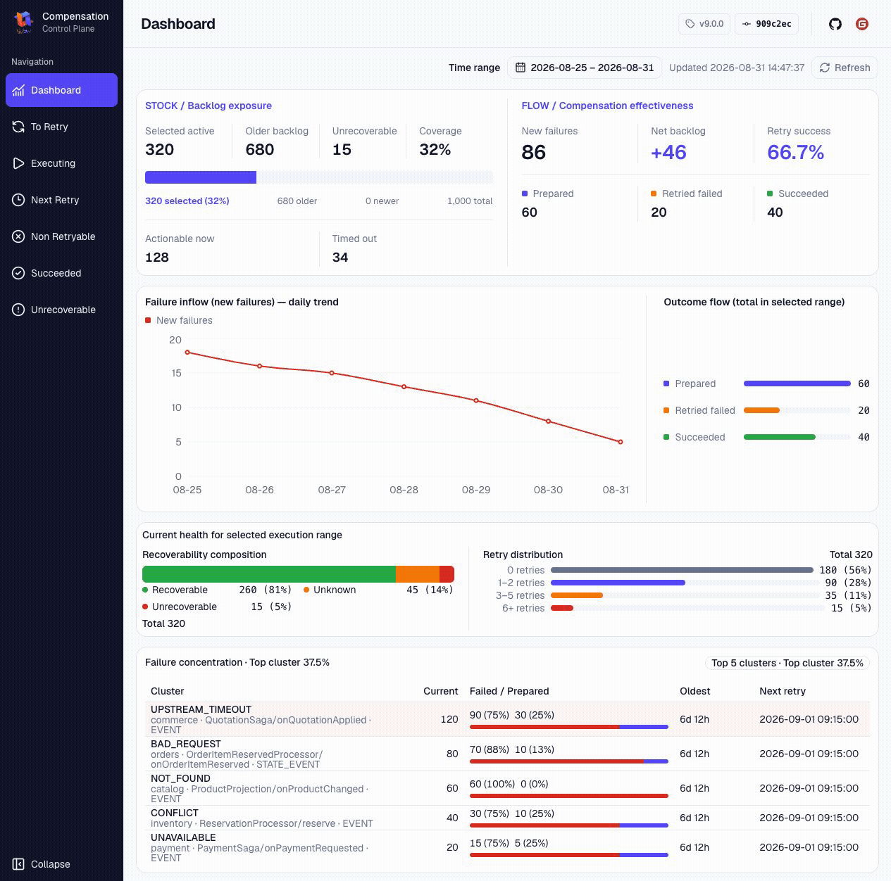

# Wow 事件补偿

`compensation` 记录事件处理函数的失败，由自动调度或人工操作重新投递原事件。它不回滚数据库、不撤销已提交事件，也不会自动生成业务反向操作。

## 模块与职责

| 模块 | 职责 |
| --- | --- |
| [`wow-compensation-api`](wow-compensation-api/) | `ExecutionFailed` 的命令、事件、状态与重试规格 |
| [`wow-compensation-core`](wow-compensation-core/) | 捕获处理失败，创建/更新失败记录，重新投递原事件 |
| [`wow-compensation-domain`](wow-compensation-domain/) | `ExecutionFailed` 聚合、状态机、重试阈值与退避计算 |
| [`wow-compensation-server`](wow-compensation-server/) | 查询待处理记录，运行调度、OpenAPI、通知和 Dashboard 静态资源 |
| [`dashboard`](dashboard/) | 查看失败队列与历史，应用重试规格，发起准备/强制准备 |

Dashboard 是运营客户端；按钮状态只是交互提示，最终是否允许重试由服务端聚合状态机决定。

## 本地入口

验证领域状态机与失败处理链：

```shell
./gradlew :wow-compensation-domain:check :wow-compensation-core:check
pnpm --dir compensation/dashboard exec vitest run
```

Dashboard 的安装、开发、构建和生成客户端命令见 [`dashboard/README.md`](dashboard/README.md)。

如需启动服务，使用[补偿参考案例](../documentation/docs/zh/reference/example/compensation.md#本地服务启动、健康与路由验证)中已验证的 distribution + 直接 `java` 路径。不要把当前 Gradle `run` 作为默认本地入口：它的默认 JVM 参数会开启未认证、未启用 TLS 的 JMX 5555。参考案例中的本地命令只绑定 `127.0.0.1:18083`，将企业微信 WebHook 设为 `false`，且不继承这些 JMX 参数。

## 恢复所有权

| 对象 | 所有者必须证明的事 |
| --- | --- |
| 业务 Handler 与外部副作用 | 重复执行安全，并用幂等键与业务对账处理已发生的支付、通知等副作用 |
| Compensation 状态 | 分别保留 `ExecutionFailedStatus` 和 `RecoverableType`，不从任一维度推断另一维度 |
| 调度与运营操作 | 核对重试条件、既有副作用、权限、审计与最终状态；通知不是业务一致性证据 |
| 存储与消息基础设施 | 备份、恢复、位点、索引/绑定、切换与回滚边界 |

规范与运行细节由以下文档统一维护，本 README 不复制配置表：

- [事件补偿指南](../documentation/docs/zh/guide/event/compensation.md)
- [补偿控制面](../documentation/docs/zh/reference/example/compensation.md#补偿控制面)
- [事件补偿配置](../documentation/docs/zh/reference/config/compensation.md)
- [备份、恢复与重放](../documentation/docs/zh/guide/recovery.md)
- [故障排查](../documentation/docs/zh/guide/troubleshooting.md)


