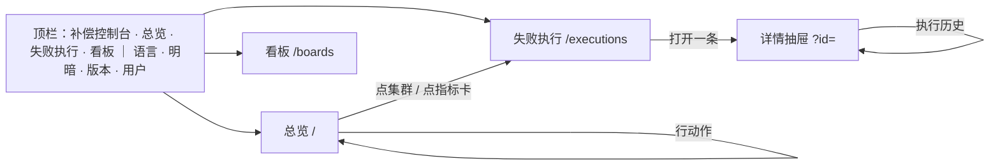

# 方案：以视图引擎为基础重写补偿控制台

**状态**：用户已审并确认（2026-09-26），Q1～Q5 全部已定（第 11 节）。用户定：以现有视图引擎为基础重写，不再为适配旧形态而适配；设计由协调会话写，重写在首发前完成。按第 9 节分批动手。

**取代**：[view-engine-rebuild.md](view-engine-rebuild.md) 第 2 节及以后（逐页映射、分批、判据）。它的第 1 节（谁在用、要完成什么、「增强」E1～E6）仍然成立，本文引用它，不重写。

## 0 结论先行

- **控制台是视图引擎的一个标准宿主**：页面从运维的任务推出来，不从旧页面映射过来；读法（列表、条件、详情、分析、看板）全交给引擎，宿主只留领域的那一半（命令、可操作性、详情里的表单、鉴权）。
- **顶部导航，三个去处**：总览、失败执行、看板。左侧只有引擎工作台自己的视图列表——今天的「两条竖栏」（W15）与「七个队列跳转」都消失。
- **主题按宿主指南接入**：`<html>` 上写预设、明暗跟随系统（可手动切换），W14 不再存在；不用 `shadcn-bridge`，控制台自己的外壳也读引擎的角色。
- **总览的「趋势」先用引擎现有的能力回答**：每日新增失败 × 每日恢复成功两条线。N7（指标条件里的元素匹配）是否还需要，由第 11 节 Q2 决定，不预设。
- **不保留旧形态，旧地址也不兼容**（用户 2026-09-26：「这个兼容不是必须的」）：`/to-retry` 等队列路由、`/events`、`?cluster=`、`?start&end` 随重写一并去掉；新地址只有第 4、5 节列出的那些。

## 1 为什么重写，不再适配

原方案逐页把旧控制台换成引擎部件，旧的信息架构原样留下，于是出现一串「为适配而适配」：

| 症状 | 根因 |
| --- | --- |
| 左侧导航 + 工作台视图列表 = 两条竖栏（W15） | 旧外壳的侧栏留着，引擎又带一条 |
| 七个队列各有一个路由，只为跳进同一个工作台 | 旧的「一个队列一页」 |
| 系统深色时控制台仍是浅色（W14） | 主题从 shadcn 变量桥接进来，而不是宿主直接接引擎 |
| 为了把四张结局卡画成一张图，要先给后端加查询能力（N7） | 旧首页的「流入与结局」区域原样搬过来 |
| 首页指标卡被裁、滚动提示压在走势线上（第二轮审查 R3-P1-1） | 板的布局沿用旧首页的格子 |
| sonner 注入样式，严格 CSP 下不干净（R3-P1-4） | 旧外壳的提示组件留着 |

重写的问题换成：**一个值班的人每天要完成哪几件事，怎样最快完成**。

## 2 用户与任务

角色与路径见 [view-engine-rebuild.md](view-engine-rebuild.md) §1.1：值班研发／SRE、处理器的研发、平台负责人；共同路径是**发现 → 分诊 → 诊断 → 处置 → 确认**。每一步落到一个去处、一个判据：

| 步骤 | 问题 | 去处 | 判据（第 10 节量） |
| --- | --- | --- | --- |
| 发现 | 现在有什么要我处理？在变好还是变坏？ | 总览 | 打开首页第一屏就读到：可立即处理几条、已超时几条、今天新增几条、最近 14 天两条走势 |
| 分诊 | 集中在哪个错误、哪个处理器？ | 总览 → 失败执行 | 点一个集群，一步进到只含这一组的列表 |
| 诊断 | 这一条为什么失败？ | 失败执行的详情 | 一个抽屉里读全：错误、堆栈、执行上下文、执行历史 |
| 处置 | 重试、强制重试、标记不可恢复 | 失败执行（行、成批、详情） | 勾选一批同因的，一次处置，失败的写出原因、仍勾着 |
| 确认 | 处置后成功了吗？ | 失败执行（「已成功」视图）／总览 | 处置后列表与总览自己刷新，不用手动 |

平台负责人的「看趋势、带走数据」由**看板**（可自建的板）与引擎的导出承担。

## 3 设计原则

1. **一个任务一个去处**：导航只列去处，不列视图；视图（队列）是工作台里的事。
2. **读法交给引擎，领域留给宿主**：宿主只写命令、可操作性判断、详情里的表单与堆栈、鉴权；不写列表、表格、图、条件、看板。
3. **只用引擎的公开面**：`@ahoo-wang/wow-view-engine`、`/react`、`/ui` 与 CSS 入口；不伸进内部、不改引擎的 DOM 与类名。控制台就是公开面够不够的验证。
4. **主题只有一个真相源**：引擎的预设与角色（theme-architecture.md）；控制台外壳读同一组 `--fve-*`。
5. **不保留旧形态**，旧地址也不做跳转：没有真实消费者就不做兼容。
6. **严格 CSP 下干净**：不用注入 `<style>` 的组件；引擎的拖拽样式用宿主给的 nonce（CSP 道）。

## 4 信息架构

- **顶栏**：左边产品名与三个去处；右边语言、明暗（跟随系统／亮／暗）、版本（链到提交）、当前用户。390 宽下三个去处收进一个菜单按钮。
- **没有左侧导航**。失败执行、看板两页的左侧是引擎工作台自己的视图列表。
- **「执行事件」不再是一个去处**：它回答的是「这一条经历了什么」，属于详情（执行历史）；按事件的统计进看板（第 11 节 Q1）。

## 5 页面

### 5.1 总览 `/`

一块代码声明的系统板，`EmbeddedDashboard` 的 `interactive` 档铺满（看、筛、点，不存）；「在看板中打开」进看板页。自上而下回答三个问题：

| 问题 | 面板 | 数据 |
| --- | --- | --- |
| 现在要处理什么？ | 四张指标卡：可立即处理、已超时、不可恢复（存量）、今日新增 | 快照；「可立即处理」「已超时」用相对此刻的条件（N6 已有） |
| 在变好还是变坏？ | 一张走势图，两条线：每日新增失败、每日恢复成功（近 14 个完整日 + 今天标「未结束」，D53／R2-P1-7 的规则） | 快照：新增按 `executeAt` 分日计数；恢复成功按成功时刻分日计数（状态 SUCCEEDED）。**不需要 N7**；若 Q2 要四种结局，再议 |
| 从哪里下手？ | 集群表：错误码 × 处理器 × 函数，前 10 组，按状态拆开；点一组「查看这些记录」进失败执行，带着这一组的条件 | 快照 |
| （紧接着就能动手） | 「最需要处理的」记录面板：到点待重试，按下次重试时刻升序，行上可准备／强制准备 | 快照；行动作同失败执行 |

板的筛选：首次失败时间（缺省近 14 天）、处理器、错误码。可恢复性构成、重试次数分布这类「结构」问题不上首页，放进看板页的系统板「补偿分析」。

### 5.2 失败执行 `/executions`

一个 `DataWorkbench` 打开定义 `execution-failed`：

- **视图列表（工作台左侧）**：系统视图对应今天的七个队列——可立即处理、执行中、已到重试时间、不可重试、不可恢复、已成功、全部；用户可存自己的视图（「我的处理器」），阶段 6 前存本机。
- **条件、搜索、列、排序、分页、卡片、导出、自动刷新**：全是引擎的。
- **行动作**：准备、强制准备、「⋯」（标记可恢复性），可用性由宿主按行算，不可用时说原因。**成批**：勾选后同样三种，确认一次，逐条报进度，失败的仍勾着并写出原因（`useBulkCommand`）。
- **详情抽屉**（`?id=`，与地址同步）：引擎的分组读法 + 宿主节：执行上下文（重试规格、目标函数的表单）、错误堆栈、执行历史（`EmbeddedView`，作用域为这一条）。
- **地址**：`?view=` 选视图，`?id=` 开详情；从总览点一个集群或指标卡进来时，条件经引擎的作用域带入（`setScopeFilter`），不另设 `?cluster=` 这类专用参数。

### 5.3 看板 `/boards`

`DashboardWorkbench`：系统板「补偿概览」（首页那块）与「补偿分析」（可恢复性构成、重试次数分布、按处理器的失败、按事件名的每日事件数），加用户自建的板（本机）。

## 6 外壳与主题

- **预设**：`porcelain`（原生桌面感：系统字体、12px 圆角、柔和阴影；用户 2026-09-26 定），经 `<html data-fve-preset="porcelain">`；品牌色走 `--fve-brand`（Wow 的品牌蓝）。
- **明暗**：`<html class="dark">` 由控制台写：缺省跟随系统（`prefers-color-scheme`），顶栏可钉亮或暗，记在本机。
- **外壳组件**：shadcn 的按钮、菜单等照用，但它们的变量指向引擎的角色（控制台自己写一小段映射），不再经 `shadcn-bridge.css` 反向读 shadcn——真相源只有一个。
- **提示**：不用 sonner。命令结果就地说：行与成批用引擎的 `BulkStatus`，详情表单在表单下方写结果；没有飘出来的 toast。严格 CSP 下干净。
- **错误与权限**：数据源的 `FORBIDDEN` 由引擎按服务端原因说；外壳只管登录态。

## 7 数据与命令（沿用，不重写）

- 快照定义 `execution-failed`、事件流定义、系统视图的条件：沿用 `src/views/`，按第 5 节调整视图集合与板。
- 服务：`src/services/`（查询、事件流、命令客户端，CoSec 拦截器）原样。
- 可操作性：`compensationCapabilities.ts` 原样（它是领域规则）。

## 8 删什么、留什么

- **删**：`App.tsx` 的侧栏外壳、旧路由结构（七个队列路由、`QueueRedirect`、`/events`、`/dashboard`、`/analytics` 的跳转）、`EventsPage`、sonner 与 `components/ui/sonner.tsx`、`shadcn-bridge` 的引入、为旧首页格子写的板布局。
- **留**：`services/`、`views/` 的定义与视图、`features/Executions` 里的命令与表单、`features/Failed` 的可操作性与命令错误、生成的客户端。
- **新写**：顶栏外壳、主题与明暗的接入、总览板、看板页的系统板、e2e（按第 2 节的任务写）。

## 9 分批

一次替换整个控制台（它不发 npm，随服务端镜像部署），在分支上按批合进 main，每批都能跑：

| 批 | 内容 | 判据 |
| --- | --- | --- |
| 1 | 顶栏外壳、三个去处、主题与明暗（跟随系统） | 390 与 1440；系统深色即深色；只有新地址 |
| 2 | 失败执行：视图集合、行与成批动作、详情抽屉与宿主节、地址同步 | 第 2 节「分诊／诊断／处置／确认」四行 |
| 3 | 总览板（第 5.1 节）与看板页的两块系统板 | 第 2 节「发现」一行；指标卡不裁（D56） |
| 4 | 删旧代码、去 sonner、严格 CSP e2e、axe（含 WCAG 2.2 的 `target-size`）、真服务验证 | 第 10 节全部 |

## 10 验收

- 第 2 节每个任务按判据在真浏览器里走一遍（e2e 桩服务 + 一次真服务），1440 与 390，中英，亮暗。
- axe 在每页干净，含 `target-size`；严格 CSP 响应头下无违规。
- 只用引擎公开面（加一条测试：`src/` 不从引擎的内部路径导入）。

## 11 已定与待定

用户 2026-09-26 回复：

- **Q1 已定**：顶部三个去处——总览、失败执行、看板；「执行事件」并入详情与看板；旧地址不做兼容（「旧地址契约不是必须的，保持架构清洁」）。
- **Q2 已定**：总览的趋势用两条线（每日新增失败、每日恢复成功），首发前不做 N7。**首发后再议**（用户要求记下、不要遗漏）：值班是否需要看四种结局（新增失败、准备重试、重试失败、重试成功）的此消彼长，需要就做 N7；记在查询设计 §14 与视图引擎 todo.md「首发后再议」。
- **Q3 已定**：预设用 `porcelain`（第 6 节）。
- **Q4 已定**：去掉 toast，命令结果就地说。
- **Q5 已定**：阶段 6 前用户视图与自建板只存本机。
