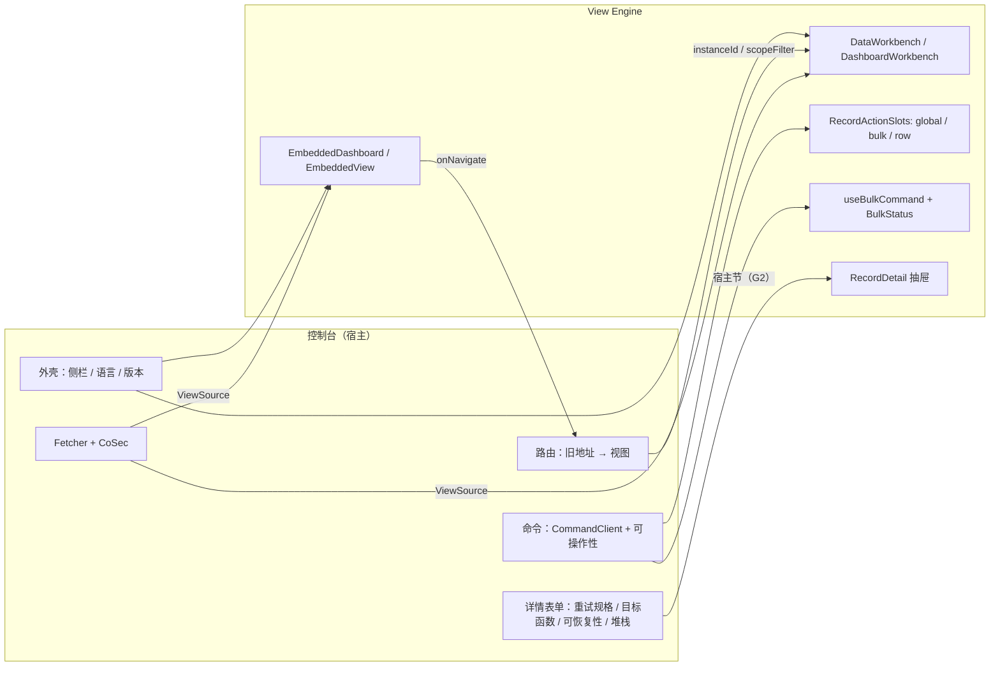

# 方案：用 View Engine 重构补偿控制台

**状态**：第 7 节五问已定（2026-09-25，按推荐），按第 5 节分批动手：批 0～4 在首发前的全面审查之前做。

**来由**：用户 TODO「使用新的视图引擎重构补偿控制台。目标：1. 增强补偿控制台 2. 验证真实场景下的视图引擎」。

**读法**：第 1 节说为谁、增强到什么程度；第 2 节逐页说哪块交给引擎、哪块留给宿主；第 3 节列引擎缺口及处置；第 4 节讲保存；第 5 节分批；第 6 节是验收判据；第 7 节是已定的问题。引擎的设计以 [view-engine docs/design](../../../../typescript/wow-view-engine/docs/design/README.md) 为准，本页只写控制台这一侧。

**依据**（续写前读过）：控制台源码（`src/features/**`、`src/routes/**`、`src/services/**`、`e2e/dashboard.spec.ts`）；补偿领域（`wow-compensation-api`、`wow-compensation-domain`、`wow-compensation-server`）；引擎的 [management.md](../../../../typescript/wow-view-engine/docs/design/management.md)、[ui/record.md](../../../../typescript/wow-view-engine/docs/design/ui/record.md)、[ui/embed.md](../../../../typescript/wow-view-engine/docs/design/ui/embed.md)、[decisions.md](../../../../typescript/wow-view-engine/docs/design/decisions.md) 的 D36（嵌入一律不写）、D37（导出缺省中和公式）与在飞 PR #3400 的 D38（分析能力）；Storybook 的 [scenarios.md](../../../../typescript/storybook/docs/scenarios.md) §4.2、§6.4；Storybook 里已经连真服务的补偿场景（`typescript/storybook/stories/view-engine/compensation.ts`、`DataConsole.stories.tsx`、`CompensationOverview.stories.tsx`）。

## 0 结论先行

- **能做，而且大半已经在 Storybook 里跑过**：补偿定义（字段、分组、五张系统视图、三张分析、命令）已经在 Storybook 的「真实后端 / 补偿控制台」对真服务跑通，包括行上与成批的补偿命令。重构是把它**搬进产品、补齐产品要的那一半**，而不是从零写。
- **控制台的定制部分约 3.6k 行被引擎替掉**（列表、搜索、表格、分页、主从布局、查询控制器、仪表盘与它的查询和图表），宿主只留领域的那一半：命令、命令前的可操作性判断、详情里的命令表单与堆栈、导航外壳、鉴权。
- **挡路的引擎缺口有三个**：条件里说不出「此刻」（三个按时刻分的队列靠它）、详情抽屉不能由宿主加节也不能按键打开、板上的记录面板只画第一页且没有行动作（PR 3，D39）。前两个建议在引擎里先修，第三个已在计划里。
- **两件事要在迁移之前定**：超时的边界毫秒（查询侧与命令侧不一致，是现存缺陷）、`dashboard-test.yml` 要不要随 view-engine 变更而跑（改 CI，须用户点头）。
- **不改 Wow 的查询协议，不改补偿领域**（边界修正除外）；保存视图在阶段 6 之前只存个人、存本机。

## 1 第一性原理：谁在用、做什么、「增强」是什么

### 1.1 谁在用

| 角色                              | 什么时候来                     | 要完成的事                                                                                                               |
| --------------------------------- | ------------------------------ | ------------------------------------------------------------------------------------------------------------------------ |
| 值班研发／SRE                     | 告警之后、每天巡检             | 看现在有多少在失败、有没有卡住的；把一批**同因**的失败找出来，重试、强制重试或标成不可恢复                               |
| 处理器的研发（事件、Saga 的写者） | 自己的处理器出错、修复上线之后 | 找出**自己那个处理器／函数**的失败，读错误与堆栈、读执行历史定位原因；修复上线后**成批重试**；必要时改重试规格或目标函数 |
| 平台负责人                        | 周会、事故复盘                 | 看趋势（流入与结局）、看集中在哪几个集群、看不可恢复的存量有没有在涨；把一段数据带走写复盘                               |

三类人的共同路径是**发现 → 分诊 → 诊断 → 处置 → 确认**。现在的控制台在「发现」「诊断」上够用，在「分诊」「处置」上是一条一条来的：筛选只有七个精确匹配字段，处置一次一条，看完集群再回队列要靠 `?cluster=` 这一条专门修的路。

### 1.2 「增强」落到哪里

每一条都能在第 6 节里量：

| #   | 增强                         | 今天                                              | 重构之后                                                                                                                              |
| --- | ---------------------------- | ------------------------------------------------- | ------------------------------------------------------------------------------------------------------------------------------------- |
| E1  | **成批处置**                 | 一次一条：选中、准备、确认                        | 勾选（含 Shift 连选）后成批准备／强制准备／标记可恢复性，边跑边报进度、可停、失败的那几条仍勾着并写出服务端的原因（`useBulkCommand`） |
| E2  | **任意条件、存成自己的视角** | 七个精确匹配字段，关掉页面就没了                  | 定义里的任意字段按其种类的运算符组合（与／或／取反），错误信息全文搜索；存成个人视图（「我的处理器」），列、排序、卡片布局随视图保存  |
| E3  | **从分析一路追到处置**       | 仪表盘的 Top 5 集群是写死的五元组，只能下钻这一种 | 任意字段分组、拆分、排序、前 N 组；点一组「查看这些记录」进记录视图，在那里成批处置——分诊到处置不换工具                               |
| E4  | **带走数据**                 | 没有导出                                          | 导出 CSV（选中或按当前筛选的全部，缺省中和公式，D37）写复盘                                                                           |
| E5  | **一条读全**                 | 详情页已有，但与列表是两套读法                    | 引擎的详情抽屉按字段分组读全（长文本、结构），宿主的命令表单、堆栈与执行历史作为宿主节放进去（缺口 G2）                               |
| E6  | **免费拿到的质量**           | 自写的表格与图表，可达性、键盘、深色各自维护      | 引擎的键盘模型、读屏、axe 覆盖、中英目录、明暗与密度（T4 的 compact 适合值班）、自动刷新与暂停、「正在显示 N 行，耗时 X 秒」          |

**不在这次的范围**（每条都说为什么）：

- **认领／指派**：领域里没有「操作人」字段（见 G13），做它是补偿领域的改动，不是视图引擎的。
- **告警与订阅**：D22 把订阅归到阶段 6 的服务端。
- **跨服务的补偿**：一个控制台对一个补偿服务，照旧。

### 1.3 「验证引擎」验证什么

Storybook 的零售场景验证了**分析的口径**；补偿控制台补上 Storybook 证明不了的那一半：

1. **长期运行的产品**：真 CI（`dashboard-test.yml` 的 Playwright）、真部署（`compensation-deploy.yml` 打进服务端镜像）、真鉴权（CoSec）。
2. **宿主的写**：领域命令从行、选中、详情三处发出，失败读服务端原因，成功后刷新——`RecordActionSlots` 与 `useBulkCommand` 第一次有一个非故事的消费者。
3. **依赖时刻的业务口径**：「到点待重试」「执行中」的边界跟着时钟走，这是零售场景没有的形状（零售把时钟钉死在 `RETAIL_NOW`）。
4. **宿主外壳里的工作台**：宿主已有 shadcn 的侧栏与语言切换，引擎要嵌得进去（`shadcn-bridge.css`、`locale`、填满容器）。
5. **公开面够不够**：宿主只用 `@ahoo-wang/wow-view-engine`、`/react`、`/ui` 与 CSS 入口，不伸进内部，不改引擎的 DOM 与类名。

## 2 逐页映射

### 2.1 总表

| 现页面／部件                                                                               | 引擎积木                                                                                                                                                                                      | 宿主拥有                                                                                                             |
| ------------------------------------------------------------------------------------------ | --------------------------------------------------------------------------------------------------------------------------------------------------------------------------------------------- | -------------------------------------------------------------------------------------------------------------------- |
| `/` 仪表盘（`DashboardView.tsx` 等 5 个文件，约 2.1k 行）                                  | 代码声明的系统板「补偿概览」（`DashboardDefinition.views`），在首页用 `EmbeddedDashboard` 的 `interactive` 档（D36：看、筛、点、铺满，什么也不存），「在工作台中打开」进 `DashboardWorkbench` | 页头（标题、刷新时刻）；时间范围的默认值；板的路由（`onNavigate` 把「查看这些记录」送到队列页）                      |
| 七个队列（`FailedView` 共用，按 `FindCategory` 分）                                        | 一个 `DataWorkbench`（记录种类）打开定义 `execution-failed` 的七张**系统视图**；条件、搜索、列、排序、分页、卡片、导出、自动刷新都是引擎的                                                    | 路由到视图的映射（旧地址保留为跳转）；`?cluster=`、`?start&end` 转成打开时的作用域条件（`setScopeFilter`，引擎准入） |
| `FailedSearch`（七个精确匹配字段）                                                         | 条件编辑器 + 定义里的搜索字段（错误信息、堆栈的全文）                                                                                                                                         | 无                                                                                                                   |
| `FailedTable` + `FailedPagination` + `FailedWorkspace`                                     | `RecordTable`／`RecordCards`、`RecordPagination`、详情抽屉（`RecordDetail`）                                                                                                                  | 无（主从分栏的去留见 Q3）                                                                                            |
| `?id=` 选中                                                                                | 详情抽屉（**缺口 G2：按键打开、与地址同步**）                                                                                                                                                 | 地址 ↔ 打开的那一条                                                                                                  |
| 详情：摘要、恢复状态                                                                       | 抽屉的分组读法（`detailSections`，按定义的字段分组）                                                                                                                                          | 无                                                                                                                   |
| 详情：执行上下文（`ApplyRetrySpec`、`ChangeFunction`）、恢复状态的「标记」、错误堆栈编辑器 | 抽屉的**宿主节**（缺口 G2）                                                                                                                                                                   | 表单、校验、命令、结果提示，全部留在宿主                                                                             |
| 详情：执行历史（事件流，按 version 降序）                                                  | 一个 `EmbeddedView`（记录种类、`interactive`）打开补偿事件流定义的系统视图「执行历史」，作用域 = 这一条的聚合 ID                                                                              | 把聚合 ID 交成作用域                                                                                                 |
| 动作：准备、强制准备、标记可恢复性、复制 ID                                                | `RecordActionSlots.row`／`.bulk`，`useBulkCommand` 的进度与结局行（`BulkStatus`）；复制 ID 是 `copyable` 列，不再是动作                                                                       | 命令本身（`CommandClient`，等到快照再返回）；可操作性判断（`compensationCapabilities.ts`，边界先修，见 G14）         |
| 应用外壳（`App.tsx` 侧栏、语言、版本）                                                     | 工作台填满内容区（保底 `--fve-workbench-min-height`）；主题经 `shadcn-bridge.css` 读宿主的 shadcn 变量                                                                                        | 侧栏、语言切换、版本号、错误边界                                                                                     |
| 鉴权（CoSec `appId: compensation-dashboard`）                                              | 数据源就是宿主的 `SnapshotQueryClient`／事件流客户端，走同一个 `Fetcher`，拦截器照旧；`FORBIDDEN` 经 `sourceReason` 读出服务端原因                                                            | Fetcher 与拦截器；`ViewPermissions`（阶段 6 前 `createShared: false`，见第 4 节）                                    |

### 2.2 定义（代码，随控制台发版）

- **一个快照定义 `execution-failed`**：从 Storybook 的 `compensation.ts` 起步——字段分组（标识、状态、处理函数、失败事件、错误、重试、时间）、枚举的显示名与语气、`rowFields`（行动作读的四个状态字段）、`maxWindow: 10_000`、`maxPageSize: 100`、分析能力（可分组的字段、可求的函数）。
- **七张系统视图**对七个队列：活动中、到点待重试、执行中、已到重试时间、不可重试、已成功、不可恢复，外加「全部」。其中「到点待重试」「执行中」「已到重试时间」要拿字段与**此刻**比（缺口 G1）；其余四张 Storybook 已有。
- **分析系统视图**：按状态、按处理器（活动中）、按错误码 × 处理函数（集群）、可恢复性构成、重试次数分布、每日新增失败。
- **一个事件流定义**：补偿聚合的七种事件，系统视图「执行历史」（按 version 降序）与「每日结局」（按事件名拆开的日直方图）。
- **定义放在控制台里**（`compensation/dashboard/src/views/`），不从 Storybook 引用：定义是应用的代码。Storybook 的补偿场景保留作引擎的回归夹具，两边会有漂移；迁移完成后 Storybook 那一份只保留引擎回归需要的部分（第 5 节批 7）。

### 2.3 首页的板

| 今天的区域                                     | 板上的面板                                                               | 说明                                                                                                                          |
| ---------------------------------------------- | ------------------------------------------------------------------------ | ----------------------------------------------------------------------------------------------------------------------------- |
| 存量：可立即处理、已超时、不可恢复             | 指标卡（计数），各自带自己的条件                                         | 「可立即处理」「已超时」要比此刻（G1）                                                                                        |
| 存量：窗口内／早于／晚于所选窗口               | 「窗口内」接日期筛选；「全部活动」不接日期筛选                           | 板上的筛选只能收窄，「早于／晚于」说不出来（G9）；改成「窗口内 ／ 全部」两个数，差值由读者读                                  |
| Top 5 集群（五元组）+ 集群状态分解             | 分析表：错误码、处理器、函数三个维度，前 5 组，按状态拆开                | 三个维度起笛卡尔图置灰（D20 的规则），这块本来就读表；点一组「查看这些记录」进队列页并带着这一组的条件——替代 `?cluster=` 专路 |
| 可恢复性构成                                   | 饼图                                                                     |                                                                                                                               |
| 重试次数分桶                                   | 柱图（`HISTOGRAM`）                                                      |                                                                                                                               |
| 流入与结局趋势（事件流，四种事件按日）         | 事件流的分析面板，按事件名拆开的日直方图                                 | 验证事件流定义的聚合（G10）                                                                                                   |
| 时间范围（默认近 7 个自然日，Today／7／30 天） | 板的日期筛选，接快照面板的 `state.executeAt` 与事件流面板的 `createTime` | 「近 7 天」相对窗口不按日对齐（G4），用「本周」等命名时段或等引擎修                                                           |
| （新增）最需要处理的记录                       | 记录面板：到点待重试，按下次重试时刻升序                                 | 依赖 PR 3（D39）：分页、总数、行动作（G3）；之前只给「在工作台中打开」                                                        |

### 2.4 宿主的插口

- **行动作**：`actions.row` 画「准备」「强制准备」与「⋯」（标记可恢复性）；按钮是否可用由宿主按行上的 `rowFields` 算（`compensationCapabilities.ts`），不可用时说原因（今天的三句原因照搬）。一行的命令与成批走同一个 `useBulkCommand`，所以一行的失败也有同一行结局。
- **成批动作**：`actions.bulk` 在勾选时出现在工具栏左端；成批的每一种命令都要确认一次（写明条数，强制准备与标记为不可恢复另说后果）；跑完刷新当前页，失败的行仍勾着。
- **全局动作**：`actions.global` 不放东西——刷新是引擎的，导出是引擎的。
- **详情**：抽屉头部放这一行的动作（引擎已有）；宿主节放执行上下文表单、错误堆栈、执行历史（G2）。
- **外壳**：宿主侧栏的七个队列项变成一个「失败执行」项，队列由工作台自己的视图列表列出（见 Q3）；旧路由 `/to-retry` 等跳到对应视图，`?id`、`?start&end` 原样带过去，`?cluster=` 继续认（旧链接在告警、工单里还有），转成作用域条件。

## 3 引擎缺口

分类：**引擎先修**（在引擎里修，控制台等它）、**宿主绕行**（控制台先绕开，引擎不动或以后再说）、**产品决定**（要用户定口径）。「对照」一列与 Storybook 的 [scenarios.md](../../../../typescript/storybook/docs/scenarios.md) §4.2、§6.4 与引擎缺口 PR 2（#3400，D38）、PR 3（D39，未开）核对。

| #   | 缺口                                                                                                                              | 控制台里哪里撞上                                         | 分类                             | 处置                                                                                                                                                                                                                                                                                                                                                                      | 对照                                                      |
| --- | --------------------------------------------------------------------------------------------------------------------------------- | -------------------------------------------------------- | -------------------------------- | ------------------------------------------------------------------------------------------------------------------------------------------------------------------------------------------------------------------------------------------------------------------------------------------------------------------------------------------------------------------------- | --------------------------------------------------------- |
| G1  | **条件里说不出「此刻」**：日期时刻只有 `BETWEEN`／`GTE`／`LTE` 与相对窗口（`amount > 0`），没有「早于此刻」「晚于此刻」这种开区间 | 到点待重试、执行中、已到重试时间三个队列，首页两张存量卡 | 引擎先修                         | 日期时刻加一个值「此刻」（执行时按 `ctx.now` 解析，与相对窗口同一处）与严格的 `LT`／`GT`；系统视图写成 `timeoutAt < 此刻` 这类条件，存下的视图不会过期、读者看得见条件。宿主绕行（包一层 `ViewSource` 在查询时 AND 上 `RetryConditions`）能跑，但条件对读者不可见、另存出去就丢，只作兜底。**已更新**：改用服务端时钟的 N6 `BEFORE_NOW`／`AFTER_NOW`，见表后「G1 的更新」 | 新发现；与 D38「至今」同一理由：写成绝对时刻会过期        |
| G2  | **详情抽屉不能由宿主扩展**：没有宿主节，不能按键打开（`?id=` 深链），打开的是哪条不回报给宿主                                     | 执行上下文表单、错误堆栈、执行历史；告警里的 `?id=` 链接 | 引擎先修                         | `RecordViewProps` 加详情的宿主节（按记录渲染，放在引擎的分组之后）与受控的「打开哪一条」（键 + 变化回调）                                                                                                                                                                                                                                                                 | 新发现；零售把订单详情做成了宿主的独立页（6.3「追下去」） |
| G3  | **板上的记录面板只画第一页**，没有分页与总数，也没有宿主的行动作                                                                  | 首页「最需要处理的记录」                                 | 引擎先修（已排 PR 3）            | 等 PR 3（D39）；之前这块面板不上，首页只给「在工作台中打开」                                                                                                                                                                                                                                                                                                              | §4.2（「板上的记录面板只画第一页」）、§4.2 第 9 条        |
| G4  | **相对窗口不按日对齐**，板上的日期不能把走势锚到所选那一天                                                                        | 首页「近 7 天」的第一天只有半天                          | 宿主绕行                         | 默认用命名时段或 D38 的「至今」时段；日期锚定随板子能力（D39）                                                                                                                                                                                                                                                                                                            | §4.2 第 1 条与缺口第 1 条                                 |
| G5  | 派生指标没有单位与格式                                                                                                            | 成功率、重试成功率                                       | 引擎先修（已在 #3400）           | 等 D38 合并，百分比读比值本身                                                                                                                                                                                                                                                                                                                                             | §6.4 第 3 条，D38                                         |
| G6  | 比值画不了走势                                                                                                                    | 「每日成功率」卡                                         | 引擎先修（已在 #3400）           | 同上（`readsOffSums`）                                                                                                                                                                                                                                                                                                                                                    | §4.2 缺口第 2 条，D38                                     |
| G7  | 展开元素的分析不能追问；板对板说不出标签页；搜索字段只能点根字段                                                                  | 不涉及（补偿聚合没有数组，控制台一块板、没有标签页）     | —                                | 不处置                                                                                                                                                                                                                                                                                                                                                                    | §4.2、§6.4 第 4 条                                        |
| G8  | 分析的三维度起不画笛卡尔图                                                                                                        | 集群（错误码 × 处理器 × 函数）                           | 宿主绕行                         | 这块读表，按状态拆开；五元组里的上下文名收进列，不当维度                                                                                                                                                                                                                                                                                                                  | D20 的既定规则                                            |
| G9  | 板上的筛选只能收窄，面板说不出「早于／晚于所选窗口」                                                                              | 首页存量的 older／newer                                  | 产品决定（按推荐直接定，不另问） | 改说「窗口内」与「全部活动」两个数；不为这一处给引擎加「窗口之外」的读法                                                                                                                                                                                                                                                                                                  | 新发现                                                    |
| G10 | 事件流定义的聚合（按事件名拆开的日直方图）在补偿服务上是否答得出                                                                  | 首页趋势                                                 | 验证项                           | 批 6 先对真服务跑一遍；答不出就回到引擎或 Wow 查询                                                                                                                                                                                                                                                                                                                        | Storybook 事件流分析台已对补偿服务跑过相近的问题          |
| G11 | 一页嵌两个视图（抽屉里的执行历史）时的地标与焦点                                                                                  | 详情抽屉                                                 | 验证项                           | 地标同名已由 #3381 修；抽屉里嵌视图的焦点回退在批 4 用 axe 与键盘走查                                                                                                                                                                                                                                                                                                     | §4.2（已修的「正在显示」同名）                            |
| G12 | 定义的显示名只有一种语言（`label: string`）                                                                                       | 控制台有中英切换                                         | 宿主绕行                         | 按语言各建一份定义，换语言时重建引擎（离开守卫照常问未保存的改动）；换语言罕见，不为它改模型；记为验证发现                                                                                                                                                                                                                                                                | 新发现                                                    |
| G13 | **领域里没有「操作人」字段**：只有快照信封上的 `operator`（最后一次事件的操作人）与事件头                                         | 「我处理过的」视图、「谁标的不可恢复」                   | 产品决定（Q4）                   | 这次不改领域：列表给「最后操作人」一列（信封字段），执行历史读事件头的操作人                                                                                                                                                                                                                                                                                              | 领域调研                                                  |
| G14 | **超时的边界毫秒不一致**（不是引擎的缺口，但迁移要选一个口径写进系统视图）                                                        | 执行中与到点待重试在 `now == timeoutAt` 那一毫秒         | 产品决定（Q2）                   | 见下                                                                                                                                                                                                                                                                                                                                                                      | 领域调研                                                  |

**G1 的更新（2026-09-25）**：查询模块已发 N6 的 `BEFORE_NOW`／`AFTER_NOW`（#3456，wow-client 的 `filter.beforeNow`／`filter.afterNow` 见 #3459），「此刻」由服务端在每次查询时读自己的时钟，存下的条件不过期、也不依赖浏览器的时钟。批 2 的三个时刻队列改用它，不再按上表写成客户端时钟的「此刻」加 `LT`／`GT`：已超时写 `filter.beforeNow('state.retryState.timeoutAt')`（严格的 `timeoutAt < now`，正合 Q2），执行中写它的取反 `filter.nor([filter.beforeNow('state.retryState.timeoutAt')])`（`timeoutAt >= now`；`AFTER_NOW` 是严格的 `>`，差那一毫秒），到点写 `filter.nor([filter.afterNow('state.retryState.nextRetryAt')])`（`nextRetryAt <= now`）。引擎侧剩下的工作只是让条件模型说得出「此刻」并编译成这两个运算符；它们要 Wow 9.2.0 及以上的服务端，更早的服务端拒绝。

**批 1 发现的两处（2026-09-25）**：

- **G15 查询能力随存储而变**：`state.error.errorMsg`／`stackTrace` 在 Elasticsearch 快照存储上只有全文检索（Storybook 的定义照开发集群的 schema 写成这样），在 MongoDB 快照存储上反过来——有精确、字面、范围、排序与 `TERMS`，**没有**全文，除非集合上建了文本索引（`MongoQuerySchemaAdapter` 只在有文本索引时报 `FULL_TEXT_*`）。批 1 的「搜索错误」（`SEARCH`，`PHRASE`）因此在 ES 部署上能用，在未建文本索引的 Mongo 部署（含 RELEASING §C′ 的本地服务）上被服务端拒绝：引擎把拒绝原样读出（「Field [state.error.errorMsg] does not support [FULL_TEXT_PHRASE]」）并保留上一次结果，不崩。定义是静态代码，写不出「按部署的能力取舍」；根治是定义的能力来自服务端的 `/schema`（查询模块的能力描述符），属引擎先修，批 2 之前定处置。控制台不绕行。
- **G16 宿主 Tailwind 与引擎样式的先后**：控制台自己的 Tailwind 与引擎的 `styles.css` 都往 `utilities` 层里写，同层后者胜；批 0 把引擎样式放在 `index.css` 之前，于是控制台全局的 `.w-full`、`.flex-col` 盖掉了引擎的 `md:w-64`、`md:flex-row`，桌面宽度下工作台的视图列表占满整行、主栏只剩 32px。批 1 把引擎样式挪到 `index.css` 之后（引擎的规则只作用在它自己的表面里，排在后面不影响控制台自己的标记）。这是每个 Tailwind 宿主都会踩的坑，引擎 README 没写，应补一句导入次序，或让引擎的规则不依赖宿主的次序。

**批 2 的记录（2026-09-25）**：

- **引擎缺口确认并先修（#3478）**：`date`／`datetime` kind 原先只给 `BETWEEN`／`GTE`／`LTE` 与判空，定义准入把 `BEFORE_NOW` 当作不支持的运算符拒掉（文案「早于现在／晚于现在」早已有）。引擎 PR 把两个运算符加进日期 kind：不读值、编辑器为 `none`、原样编译成 `filter.beforeNow`／`filter.afterNow`，摘要只说运算符；系统视图准入、编译、条件栏、另存个人视图再重开都有测试。
- **三张系统视图**：待重试 = 可重试 ∧（失败 ∨（已准备 ∧ `timeoutAt BEFORE_NOW`））；执行中 = 已准备 ∧ `NOR [timeoutAt BEFORE_NOW]`；已到重试时间 = 可重试 ∧ `NOR [nextRetryAt AFTER_NOW]` ∧ 与待重试相同的状态分支。嵌套的 `or`／`nor` 要 `filterMode: 'advanced'`（`simple` 只收一层 AND 的叶子）。`NOR` 在字段缺失时也成立，这里无妨：`RetryState` 的三个时刻都是非空的 `Long`。
- **判据 1 的 e2e**（`e2e/queues.spec.ts`）：同一份 45 条打桩数据、`page.clock` 与桩的时钟钉在同一刻，旧的 `paged/state` 与新的 `paged` 各自匹配到的 ID 集合（分页之前）七个队列逐一相等；另有一条专测边界：到期正好此刻的仍在执行中、早一毫秒的进待重试，下次重试正好此刻的算已到、晚一毫秒的不算。桩按钉住的时钟答 `BEFORE_NOW`／`AFTER_NOW`，未钉时钟时仍然拒绝，不给似是而非的答案。
- **真服务冒烟**加一条：打开待重试与已到重试时间，服务端接受两个运算符，新写入的记录在前者、不在后者。

**批 3 的记录（2026-09-25）**：

- **只用公开面，引擎不改**：`actions.row`／`actions.bulk` + `useBulkCommand` + `BulkStatus`（工作台的 `record.bulk`）够用，没有撞到引擎缺口。宿主代码三块：`executionCommands.ts`（生成的 `ExecutionFailedCommandClient`，带 `Command-Wait-Stage: SNAPSHOT`，所以紧随其后的刷新读到的就是新状态；返回的结果若带非 `Ok` 的错误码也按拒绝抛出）、`operability.ts`（行上的状态 → `getCompensationCapabilities`，以及成批前的本地拒绝）、`ExecutionCommandControls.tsx` + `useExecutionActions.tsx`（按钮、菜单、确认框与接线）。
- **`rowFields` 改成可操作性真正读的四个**：`state.status`、`state.isBelowRetryThreshold`、`state.retryState.timeoutAt`、`state.recoverable`；批 1 预留的 `state.isRetryable` 不读（命令侧 `canRetry()` 不看可恢复性），换成 `timeoutAt`——没有它，「未超时不能准备」无从判断。`getCompensationCapabilities` 的入参收窄为 `OperableState`（这三个字段），旧页面照传整条快照。
- **成批时本地已知不会成功的不发**：确认框列出「以下不会发送，仍保持勾选」及原因与条数；跑的时候这些记录直接以同一原因记为失败、不发请求，所以它们和服务端拒绝的一样留在勾选里、原因写在结局行。服务端仍是最终边界：本地放行的照样可能被拒，原因读自服务端（`sourceReason`）。不在当前页的勾选没有行数据，交给服务端判断。
- **行上的「准备」不确认**（旧页面也不确认），强制准备与标记可恢复性确认；成批的三种都确认。未超时的行在 `timeoutAt` 之后的那一毫秒自己重算一次（一个定时器，不是每秒走的时钟）。
- **判据 4 的步数**：条件定好之后，成批准备一页 20 条是「全选、准备 20 条、确认」三次点击（`e2e/actions.spec.ts`）；加处理器条件的那几步归批 7 的步数对照。
- **顺带修的宿主缺陷 G17**：宿主外壳的 `SidebarInset` 是 `w-full flex-1` 而没有 `min-w-0`，flex 项至少与内容一样宽，预览页的宽表格于是把整页撑出窗口（1440 宽、侧栏展开时页面横向滚动 176px，行动作列在窗口外）。批 1、2 的 e2e 没有断言横向滚动，所以没发现；这次给 `SidebarInset` 加 `min-w-0`，e2e 断言页面不横向滚动、行上的「准备」在视口内。

**批 4 的记录（2026-09-25）**：

- **引擎部分**：宿主节与受控打开（G2）已在 #3495 合并。控制台接上 `record.detail`：`open` 读地址的 `id`、`onOpenChange` 以 `replace` 改写它；`sections` 按整条记录给四节——「变更函数」`{ after: 'function' }`、「堆栈跟踪」`{ after: 'error' }`、「应用重试规格」`{ after: 'retry' }`、「执行历史」在最后。代码在 `src/features/Executions/detail/`，命令加进 `executionCommands.ts`（`applyRetrySpec`、`changeFunction`，同样等快照写入）。
- **执行历史是一份新的小定义** `src/views/executionHistory.ts`：补偿事件流，只有一张系统视图（按版本降序、每页 10 条、事件按类型读），源键 `execution_failed/event` 与快照的分开，引擎按键解析到 `EventStreamQueryClient`。嵌入时 `theme` 取 `useSurfaceTheme()`——抽屉是工作台表面的弹层，嵌入又是一个表面，表面不嵌套，所以明暗随抽屉而不是自己再解析一遍（#3495 的说明）。
- **整条读到之前只画执行历史**：表单的初值与堆栈都要整条记录，页上的行未必带着；读不到（无权限、失败）时也只剩历史与引擎的原因，不画一份从残缺数据起步的表单。
- **撞到并在引擎里先修的两处**（与控制台同一批，单独的引擎 PR）：
  - **G18 宿主节接管一个字段**：「错误」分组照定义列出堆栈，宿主的「堆栈跟踪」节又读一遍；字段又不能从定义里删（`searchFields` 要它，导出与列也要）。`RecordDetailSection.fields` 点名宿主自己读的字段，引擎的分组不再列它，被拿空的分组不画。
  - **G19 没有剪贴板 API 就复制不了**：引擎的 `copyable` 按钮只用 `navigator.clipboard`，纯 HTTP 部署不是安全上下文、根本没有它，旧页面有 `execCommand` 退路、新页面的「复制 ID」在这里会一直报「复制失败」。引擎的 `copyText` 在 API 缺席或被拒时退回文档的 `copy` 命令，两者都不成才说失败。
- **没修、记下的一处 G20**：嵌入视图没有记录详情，执行历史里一条事件的载荷（旧页面「事件载荷」里的 JSON，含那次失败的堆栈）读不到；表格只按事件类型读，载荷也不在查询的投影里。要么引擎给嵌入视图开记录详情，要么宿主加一个行动作按键读整条；批 7 的走查再定。
  - **G20 引擎部分已完成（2026-09-25）**：`EmbeddedView` 加了 `detail`（`true` 或与 `record.detail` 同一个 `RecordDetailOptions`），可交互一档里按一行打开只读的记录详情——整条读（`fetchRecord`，不带列表的投影），事件逐个按类型、载荷逐键读全、堆栈整段可复制；在抽屉里是叠上去的第二层，Esc 只关它、焦点回到那一行（view-engine [ui/embed.md](../../../../typescript/wow-view-engine/docs/design/ui/embed.md)「记录详情（G20）」）。控制台剩下的是在 `ExecutionHistory` 上打开 `detail`，须在批 5 替换旧页面之前。
- **e2e**：`e2e/detail.spec.ts` 把旧 `dashboard.spec.ts` 的详情、复制 ID（剪贴板 API 缺席）、执行历史、到时才可准备、刷新失败保留旧数据五条改写到新页面，两个视口都跑；另加地址打开不在页上的、已不在的、无权限的三种。旧的五条留到批 5 替换路由。真服务冒烟加一条：按 `?id=` 打开自己写入的那条，历史由服务端事件流答出。

**G14 的细节**：

- 命令侧：`IRetryState.timeout()` 是 `System.currentTimeMillis() > timeoutAt`，所以 `now == timeoutAt` 时**还在执行**，`canRetry()`／`canForceRetry()` 拒绝。
- 查询侧：调度器 `SnapshotFindNextRetry` 与前端 `RetryConditions` 的到点待重试都写 `timeoutAt <= now`，执行中写 `timeoutAt > now`，所以同一毫秒**已超时**。
- 前端的可操作性 `compensationCapabilities.ts` 写 `now <= timeoutAt` 为执行中，与命令侧一致、与自己的队列条件不一致。
- 后果：那一毫秒里，一条记录出现在「到点待重试」却按不了；调度器会挑出它、发一次必被拒的准备命令。窗口只有一毫秒，但它是两份口径，迁移时写进系统视图的必须是一份。

## 4 持久化

- **系统视图与系统板是代码**（`definition.views`，`revision: 'code'`），打开不经过存储——七个队列、分析、首页的板都不需要后端。这是控制台的主体。
- **现在：`MemoryViewStore` 加 `snapshot` 钩子存 `localStorage`**（[management.md](../../../../typescript/wow-view-engine/docs/design/management.md) 里约三十行的那一种，不是第二个实现）：
  - 个人视图、排序、默认视图、「改了就跑」只存在**这台机器的这个浏览器**里。视图管理器上要说清「存在本机」，这是真话，也避免读者以为同事看得见。
  - `ViewPermissions`：`createPersonal: true`、`createShared: false`、系统视图只读（引擎本来就拒）。共享视图不给，因为本机存储没有「别人」。
  - 首页嵌入不写任何东西（D36），只有工作台写。
- **阶段 6（Wow 存储后端）**：须等第二轮全面审查经用户明确通过才开工（view-engine todo「首发前的门」）。它落地后控制台只换 `store` 与 `permissions`（共享视图由服务端许可决定），不动页面；本机存下的个人视图提供一次「上传到服务端」的迁移（阶段 6 的事，这里只留线索）。
- **不为控制台另造存储**：不写补偿服务里的视图表，不用 IndexedDB——引擎文档已说明浏览器本地库不是保存视图的真实归宿，阶段 6 才是。

## 5 分批（绞杀者模式）

每一批都是一个 PR，**旧页面一直在、一直绿**，直到新页面在同一个 PR 里接管它的路由；每批合并前 `dashboard-test.yml`（lint、构建、Vitest、Playwright）全绿，e2e 只增不减——被替换的场景改写成对新页面的同一断言，而不是删掉。工作量按一个代理的工作日估：S ≤ 1 天，M 2～3 天，L 4～5 天。

| 批  | 内容                                                                                                                                                                                                                                                                                | 依赖                       | 工作量           | 旧页面       | e2e                                                                                              |
| --- | ----------------------------------------------------------------------------------------------------------------------------------------------------------------------------------------------------------------------------------------------------------------------------------- | -------------------------- | ---------------- | ------------ | ------------------------------------------------------------------------------------------------ |
| 0   | **前置**：统一超时边界（Kotlin 查询侧与前端 `RetryConditions` 或命令侧，按 Q2）；`dashboard-test.yml`、`compensation-deploy.yml` 的 paths 加 `typescript/wow-view-engine/**`（按 Q1）；控制台加 `@ahoo-wang/wow-view-engine: workspace:*`、引入 `styles.css` 与 `shadcn-bridge.css` | Q1、Q2                     | S                | 不动         | 边界那一毫秒的单测（前后端各一条）                                                               |
| 1   | **定义与预览页**：快照定义、四张不依赖时刻的系统视图、三张分析；新路由「失败执行（预览）」挂 `DataWorkbench`；`MemoryViewStore` + 本机快照                                                                                                                                          | 批 0                       | M                | 不动         | 新增 `e2e/views.spec.ts`：打开、筛选、翻页、切卡片、导出、存个人视图、重开后还在                 |
| 2   | **「此刻」与三个时刻队列**：引擎 PR 加「此刻」与 `LT`／`GT`（G1）；控制台补三张系统视图                                                                                                                                                                                             | 批 1，引擎 PR              | 引擎 M，控制台 S | 不动         | 同一份打桩数据、钉住时钟，新旧七个队列的 ID 集合逐一相等                                         |
| 3   | **行动作与成批动作**：`actions.row`／`.bulk` + `useBulkCommand`；可操作性复用 `compensationCapabilities.ts`                                                                                                                                                                         | 批 2                       | M                | 不动         | 成批准备 20 条（其中 3 条服务端拒）：进度、结局行、失败的 3 条仍勾着；未超时的准备按不了且说原因 |
| 4   | **详情**：引擎 PR 加宿主节与受控打开（G2）；控制台放执行上下文表单、堆栈、执行历史（`EmbeddedView`）；`?id=` 深链                                                                                                                                                                   | 批 3，引擎 PR              | 引擎 M，控制台 M | 不动         | 旧 e2e 的详情、复制 ID、执行历史、刷新失败保留旧数据五条改写到新页面                             |
| 5   | **接管队列路由**：七个旧路由跳到对应视图，`?cluster=`、`?start&end` 转成作用域条件；删除 `FailedView`、`FailedWorkspace`、`FailedTable`、`FailedSearch`、`FailedPagination`、`useFailedQueueController` 与 `@tanstack/react-table`（若无他用）                                      | 批 4                       | L                | 队列页被替换 | 队列相关的旧 e2e 全部改写并通过；旧地址跳转各一条                                                |
| 6   | **首页换成系统板**：`EmbeddedDashboard`（`interactive`，铺满开）+「在工作台中打开」；删除 `DashboardView`、`AnalyticsCharts`、`analyticsQueries`、`useSnapshotAnalytics`、`useEventTrend` 与 `recharts`；「最需要处理的记录」面板等 PR 3                                            | 批 5，D38 合并；面板等 D39 | L                | 首页被替换   | 首页的旧 e2e（区域隔离失败、骨架、移动端不重叠、零值、别名跳转）改写；数字与旧版同数据对齐       |
| 7   | **收尾**：README 与参考文档、Storybook 的补偿场景收成引擎回归夹具、真服务走查与验证报告（第 6 节逐条）                                                                                                                                                                              | 批 6                       | S                | —            | 全量                                                                                             |

合计：控制台约 L+L+M+M+M+S+S+S ≈ 17～22 个代理日，引擎两个 PR 约 4～6 个代理日（不含 PR 3，它另有排期）。批 2 与批 4 的引擎 PR 可以与上一批的控制台部分并行。

**不能跳的次序**：批 0 在最前（边界与 CI 是之后每一批的地基）；批 5 在批 4 之后（队列页不能在详情搬过去之前被替换，否则告警里的 `?id=` 链接会断）；批 6 在批 5 之后（首页的「查看这些记录」要落在新的队列页上）。

## 6 验证判据

**控制台（增强）**：

1. **队列口径不变**：钉住时钟、同一份打桩数据，新的七张系统视图与旧的 `RetryConditions` 选出的 ID 集合逐一相等（批 2 的 e2e）；边界那一毫秒按 Q2 的口径，前后端与调度器三处一致（批 0 的单测）。
2. **首页数字不变**：同一份打桩数据，板上每个数与旧首页的对应数相等（批 6 的 e2e 逐项断言），只有 G9 改口径的那一处按新说法。
3. **e2e 只增不减**：旧 `e2e/dashboard.spec.ts` 的每个场景在新页面上都有对应断言（批 7 给一张对照表）；每批 `dashboard-test.yml` 绿。
4. **成批处置可量**：「修复上线后重试某处理器的 20 条失败」——旧版至少 40 次点击（每条选中、准备；强制准备每条再加一次确认），新版 ≤ 6 次（加处理器条件、全选、准备、确认条数）；e2e 按步骤数断言。
5. **可达性**：七个队列、详情抽屉、首页各跑一次 axe，0 违规；键盘走完「筛选 → 勾选 → 成批准备 → 打开详情 → 关闭焦点回到行」。
6. **包体**：批 6 的 PR 写控制台首屏 JS 的 gzip 前后实测（ECharts 替 Recharts、引擎替自写表格）；增长超过 20% 时把板与工作台拆成按路由懒加载。

**引擎（验证）**：

7. **只用公开面**：控制台对引擎的 import 只有 `@ahoo-wang/wow-view-engine`、`/react`、`/ui` 与 CSS 入口；控制台的样式里没有 `.fve-` 选择器，只有 `--fve-*` 变量（grep 为 0，批 7 写进 lint）。
8. **宿主代码的份量**：删掉约 3.6k 行（第 2 节总表列出的文件），宿主新增（定义、动作接线、详情节、路由映射）不超过 1.2k 行；批 7 用 `wc -l` 前后对照。
9. **缺口都有去处**：迁移中发现的每个引擎缺口，要么合并进引擎，要么在 view-engine 的 [todo.md](../../../../typescript/wow-view-engine/docs/design/todo.md) 有带判据的条目；控制台里没有一处改引擎 DOM、猜类名或复制引擎源码的绕行。
10. **真服务走查**：批 5、批 6 合并后，对真补偿服务（`localhost:8080`）逐页逐控件走一遍，发现写进验证报告；报告与第二轮全面审查合并提交给用户。

## 7 已定问题

2026-09-25 用户拍板：五问全部按推荐。下表「推荐」列即结论。

| #   | 问题                                                                                                                  | 推荐                                                                                                                       | 理由与代价                                                                                                                                                              |
| --- | --------------------------------------------------------------------------------------------------------------------- | -------------------------------------------------------------------------------------------------------------------------- | ----------------------------------------------------------------------------------------------------------------------------------------------------------------------- |
| Q1  | **CI**：`dashboard-test.yml`（以及 `compensation-deploy.yml`）的 paths 不含 `typescript/wow-view-engine/**`，要不要加 | **两个都加**，批 0 做                                                                                                      | 引擎「不背兼容、改名即改调用方」，控制台一成为调用方，引擎的 PR 就可能静默打坏它；代价是引擎 PR 多跑一次控制台的构建与 Playwright（约数分钟），部署在引擎变更后也会重发 |
| Q2  | **超时边界**取哪一边                                                                                                  | **以命令侧为准**：`now > timeoutAt` 才算超时；调度器与前端查询改成 `timeoutAt < now`，执行中改成 `timeoutAt >= now`        | 命令侧是最终决策边界（README 原话「服务端状态机才是最终决策边界」），改查询不改领域行为；代价是动 Kotlin 的 `SnapshotFindNextRetry`（加一条测试），批 0 单独一个 PR     |
| Q3  | **队列导航与详情的形态**：旧版是宿主侧栏七项 + 主从分栏；引擎是工作台自己的视图列表 + 侧边抽屉                        | **照引擎**：宿主侧栏收成「概览」「失败执行」两项，七个队列与个人视图在工作台的列表里；详情用抽屉加宿主节，保留 `?id=` 深链 | 两套导航会让个人视图无处可放；抽屉是引擎全包的读法，主从分栏要引擎另开一种布局。代价是老用户要适应一次，旧地址全部保留为跳转                                            |
| Q4  | **操作人**：要不要为这次重构给补偿领域加操作人（谁准备、谁标记）                                                      | **不加**，这次用信封上的「最后操作人」与事件头；认领／指派另立题目                                                         | 领域改动与视图引擎无关，会把一个前端重构拖成跨 Kotlin 与 OpenAPI 的变更；代价是「我处理过的」视图暂时做不出                                                             |
| Q5  | **时机**：在首发前的门（第二轮全面审查）之前还是之后动手                                                              | **之前开批 0～4**，作为审查的真实场景证据；批 5、6（替换旧页面）等 PR 3 与审查结论                                         | 批 0～4 不替换任何旧页面，风险只在新路由；越早在真服务上跑，越早把缺口带进审查。代价是引擎首发前的形状改动会波及控制台（Q1 让它当场可见）                               |
| Q5′ | **时机补充**（用户 2026-09-25）：npm 首发（含 `9.2.0-rc.0`）推到控制台**全部批次（0～7）完成之后**                    | 批 5～7 不再等首发审查结论，按依赖顺序接着做；第二轮全面审查以完成后的控制台为真实场景证据                                 | 「提前发现真实环境问题、验证真实 API」；代价是首发推后到控制台完成                                                                                                      |
