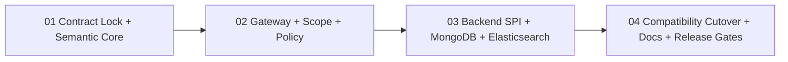

# Query 服务架构升级 Implementation Plan

> **For agentic workers:** REQUIRED SUB-SKILL: Use superpowers:subagent-driven-development (recommended) or superpowers:executing-plans to implement this plan task-by-task. Steps use checkbox (`- [ ]`) syntax for tracking.

**Goal:** 把现有 Snapshot/EventStream 查询统一切换到单一 `PLANNED` 引擎，同时保留 Wow 8.x 已承诺的公开调用、Spring Bean、HTTP/OpenAPI 与存储路由兼容面，并让 MongoDB、Elasticsearch 和第三方存储保留经过显式协商的后端能力。

**Architecture:** 以 `QueryGateway` 作为唯一应用入口，按 Admission → Normalize → QueryPolicy → Backend Resolve → Plan → Execute → ResultPolicy 流水线处理；兼容门面只委托公共 Gateway。Portable expression 保证跨后端语义，Capability expression 显式保留后端特性；`QueryPolicy` 是唯一服务端查询条件与权限扩展 SPI，Backend SPI 只接收框架创建的不可变 `QueryPlanV1`。

**Tech Stack:** Kotlin 2.4.10、Java 17、Reactor、Jackson、Spring Framework / Spring Boot、MongoDB Reactive Streams、Spring Data Elasticsearch、JUnit Jupiter 6、FluentAssert、Testcontainers、Gradle Kotlin DSL、VitePress。

## Global Constraints

- 最终规格是唯一产品决策来源：[2026-08-11-query-service-architecture-upgrade-design.md](../specs/2026-08-11-query-service-architecture-upgrade-design.md)。规格与实现冲突时停止实施并修正规格或计划，不在代码里私自做第二套决策。
- 不新增 Gradle 模块、不修改 KSP、不新增聚合分析 API、不自动迁移现有 Elasticsearch 索引。
- 运行时只有 `PLANNED`，不实现 `LEGACY`、`SHADOW`、双读、开关回退或旧 Filter 运行时探测。
- 旧 Query Filter/Handler/Context 扩展面是唯一批准的直接删除项；`RewriteRequestCondition` 与 masker API 仍保留并 deprecate。
- 除批准删除项和规格逐项列出的行为修正外，所有 Wow 8.x 公开 source/binary/wire API、Spring Bean name、storage routing property 必须保持兼容。
- `QueryPolicy` 是唯一通用服务端查询约束扩展点；不得引入 `QueryConditionContributor`、通用 query hook 或可变 attributes map。
- 所有输入集合进入引擎时只 materialize 一次；所有时间表达式在单次 subscription 内使用冻结的 `Instant` 和 `ZoneId`；核心路径不得阻塞。
- Backend 不接触外部 DTO、Spring/HTTP 类型或 authority；应用代码不能构造 `QueryPlanV1` 或直接绕过 Gateway 调用 Backend。
- Capability 必须由 Backend descriptor 支持、Schema/字段权限允许且 Policy 明确 `GRANT`；全 `ABSTAIN` 必须拒绝，显式 `DENY` 优先。
- 修改公开契约、行为、序列化、Schema、Policy、Planner、Backend 或兼容门面时必须测试先行；每个计划中的失败测试必须先观察到预期失败，再写实现。
- 不把 `.superpowers/`、构建产物、容器数据、凭据或 IDE 状态加入提交。

---

## 执行顺序

四份计划必须按顺序执行；后续计划可以在同一开发分支继续，但不得跳过前一计划的完成门槛：

1. [01 - 契约锁定与语义核心](2026-08-12-query-service-architecture-upgrade-01-contract-semantic-core.md)
2. [02 - Gateway、Invocation 与 QueryPolicy](2026-08-12-query-service-architecture-upgrade-02-gateway-policy-runtime.md)
3. [03 - Backend SPI、MongoDB 与 Elasticsearch](2026-08-12-query-service-architecture-upgrade-03-storage-backends.md)
4. [04 - 兼容门面切换、文档与发布闭环](2026-08-12-query-service-architecture-upgrade-04-compatibility-cutover.md)

## 跨计划类型归属

| 类型/职责 | 所属模块 | 稳定性 |
| --- | --- | --- |
| `QueryTarget`、四种 request、result shape、expression、budget、error | `wow-api` | Wow 8.x 稳定应用 API |
| `QueryGateway`、`QueryPolicy`、`QueryPolicyContext`、`QueryPolicyResult` | `wow-query` | Wow 8.x 稳定应用/扩展 API |
| `QueryBackend`、`QueryBackendDescriptor`、`QueryBackendResolver`、`QueryPlanV1` | `wow-query` | 版本化稳定基础设施 SPI |
| Normalizer、Planner、policy combiner、物理 compiler | 各实现模块 | Kotlin `internal` |
| Jackson Query Schema 推导与 `QuerySchemaCustomizer` | `wow-query` | customizer 为唯一 Schema 扩展 SPI |
| MongoDB compiler/executor/readiness | `wow-mongo` | Backend SPI 实现 |
| Elasticsearch compiler/executor/PIT/readiness | `wow-elasticsearch` | Backend SPI 实现 |
| Policy/Backend 契约测试工具 | `wow-test` / `wow-tck` | 公开测试支持 |

## 计划间固定契约

- `QueryGateway` 只暴露 `single`、`list`、`page`、`count` 四个 operation-specific 方法；typed/dynamic 由 `QueryResultShape` 表达。
- `QueryExpression` 由 portable 与 capability 两层组成；逻辑组合只有 `AND`、`OR`、`NOR`，没有语义含混的 `NOT`。
- `QueryPolicyResult.mandatoryExpression` 永远以 `AND` 与调用表达式合并；字段权限取交集，预算取最小值；capability 显式 `DENY` 胜出，否则至少一个 `GRANT` 才允许。
- System policy 不可替换；自定义 `List<QueryPolicy>` 只能追加。`@Order` 只影响诊断顺序，不影响合并语义。
- `QueryBackendResolver` 在一次 invocation 内解析一次并冻结 backend、descriptor、route identity；Planner 依据该快照生成只读 `QueryPlanV1`。
- MongoDB/Elasticsearch 共享 Portable Query TCK；后端差异只能通过 capability/readiness 暴露，不能静默降级。
- `single`、`page`、`count` 原子发射；`list` 支持背压流式返回，首项后失败必须按 partial-result 语义终止。
- 现有 `QueryService`/factory/route/DSL 最终都只通过 `QueryGateway` 公共接口委托，不能访问 Planner、Backend 或 `DefaultQueryGateway`。

## 每阶段交付门槛

### 01 完成门槛

- ABI/source golden 已锁定全部保留 API 和唯一批准删除清单。
- 43 个旧 `Operator` 穷尽 lowering，Portable/Capability AST、Query Schema、结构/预算验证全部通过单元测试。
- `./gradlew :wow-api:check :wow-query:check queryApiCheck` 通过。

### 02 完成门槛

- 每次 Reactor subscription 都创建独立 immutable invocation。
- System/custom policy 的固定组合、fail-closed、deadline、跨入口所需 provenance 已有自动化测试。
- 记录型 fake backend 证明 Gateway 全流水线与 operation/result 原子性，不依赖真实存储。
- `./gradlew :wow-query:check :wow-test:check :wow-spring-boot-starter:check` 通过。

### 03 完成门槛

- MongoDB 与 Elasticsearch 均通过同一 Portable Query TCK 和真实后端 integration test。
- Mongo page 使用单请求 `$facet`；Elasticsearch 无限 list 使用 PIT + `search_after` 且取消/失败必清理 PIT。
- mapping/index readiness、capability negotiation、storage routing invalid binding 均 fail-fast/fail-closed。
- `./gradlew :wow-mongo:check :wow-elasticsearch:check :wow-tck:check` 及相关 integration test 通过。

### 04 完成门槛

- 所有框架托管入口只命中 Gateway；旧执行器和 NoOp 静默空结果路径不存在。
- 除批准删除的 Filter 扩展面外，ABI/source/JSON/OpenAPI/Spring/storage routing golden 全部通过。
- 中英文迁移文档、查询/数据访问/CoSec/backend/Snapshot/best-practices/onboarding 文档同步，示例可编译，VitePress build 通过。
- 全量 `detekt`、contract/integration test、`build` 通过；发布回滚是上一制品版本，不依赖运行时双引擎开关。

## 提交与回滚策略

- 每个任务完成一个可单独验证的提交；提交信息使用计划内给定文案。
- 01～03 可以 additive 落地，但在 04 完成前不得对外发布新 Gateway 与旧执行器并存的中间制品。
- 索引 mapping 只验证不自动变更；若 readiness 失败，运维先按文档完成 alias-based migration，再升级制品。
- 代码回滚只回滚制品版本；不得在 04 中引入不可逆数据写入或让新旧引擎共享不兼容持久化状态。
