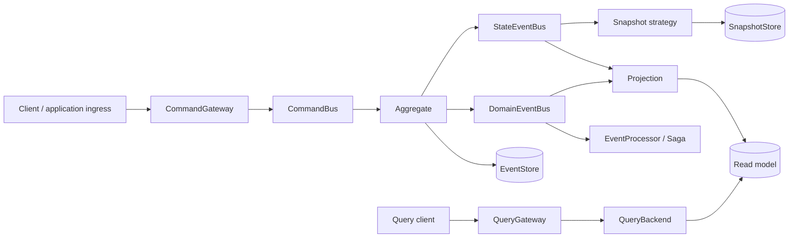
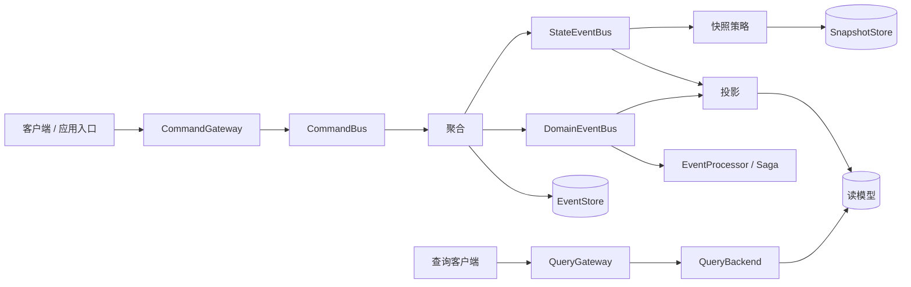
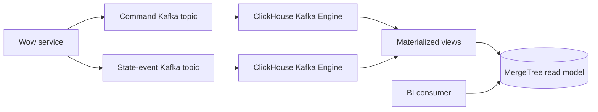
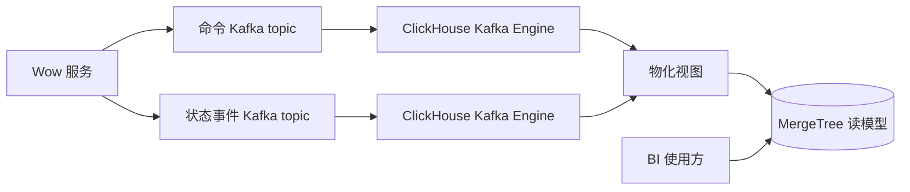
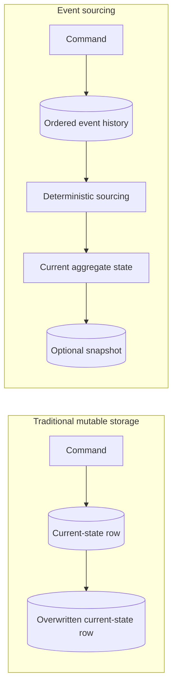
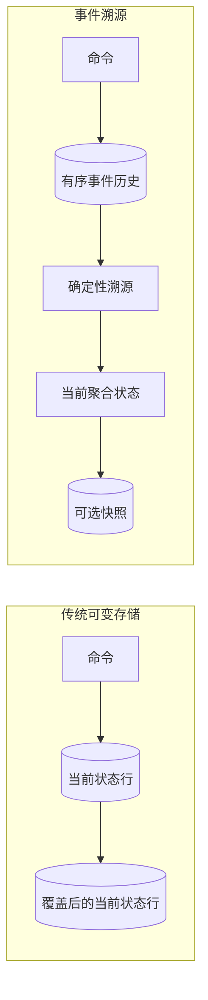

# High-Traffic Mermaid Migration Implementation Plan

> **For agentic workers:** REQUIRED SUB-SKILL: Use superpowers:subagent-driven-development (recommended) or superpowers:executing-plans to implement this plan task-by-task. Steps use checkbox (`- [ ]`) syntax for tracking.

**Goal:** Replace the three high-traffic architecture, BI, and event-sourcing SVG diagrams with repository-native Mermaid and remove their superseded SVG assets.

**Architecture:** README files receive a compact V9 component flow, while VitePress pages use fenced Mermaid directly. Introduction pages reuse their existing runtime Mermaid and link to the detailed architecture page instead of duplicating a second full architecture diagram. Once every reference is gone, delete only the five diagram SVG files; retain logos, badges, screenshots, and unsupported use-case assets.

**Tech Stack:** Markdown, Mermaid, VitePress, pnpm

**Spec:** `docs/superpowers/specs/2026-08-31-v9-documentation-concept-and-diagram-migration-design.md`

## Global Constraints

- Prefer fenced Mermaid for user-facing diagrams; do not commit generated Mermaid SVG.
- Keep English and Chinese documents structurally aligned.
- Preserve diagram meaning while simplifying visual styling that Mermaid does not model.
- Do not change runtime code, public API, REST, serialization, `Condition`, or `DynamicDocument`.
- Delete only SVG files superseded in this batch; retain `logo.svg`, `kaicode-2026-wow.svg`, screenshots, the PlantUML use-case diagram, and its required rendering asset.
- Do not add dependencies, diagram generators, compatibility aliases, or VitePress `dist` output.

---

### Task 1: Replace README and introduction SVGs

**Files:**
- Modify: `README.md`
- Modify: `README.zh-CN.md`
- Modify: `documentation/docs/en/guide/introduction.md`
- Modify: `documentation/docs/zh/guide/introduction.md`

**Interfaces:**
- Consumes: The V9 `CommandGateway`, event buses, projections, `QueryGateway`, and `QueryBackend` terminology already merged to `main`.
- Produces: GitHub-renderable README Mermaid and introduction pages without architecture/BI SVG references.

- [ ] **Step 1: Capture the six existing SVG references**

Run:

```bash
rg -n 'Architecture\.svg|bi/bi\.svg' \
  README.md README.zh-CN.md \
  documentation/docs/en/guide/introduction.md \
  documentation/docs/zh/guide/introduction.md
```

Expected: two `Architecture.svg` README references and four introduction references: two BI plus two architecture.

- [ ] **Step 2: Replace the English README architecture image**

Replace the centered `Architecture.svg` image with this exact Mermaid block:



- [ ] **Step 3: Replace the Chinese README architecture image**

Use this aligned Mermaid block:



- [ ] **Step 4: Replace the introduction BI images**

In the English introduction, replace the BI image with:



In the Chinese introduction, use:



- [ ] **Step 5: Remove the redundant introduction architecture images**

Replace the English sentence and image with:

```markdown
For the complete component and ownership view, continue to [Architecture Overview](./advanced/architecture.md).
```

Replace the aligned Chinese sentence and image with:

```markdown
完整组件与所有权视图见[架构概览](./advanced/architecture.md)。
```

- [ ] **Step 6: Verify the four entry documents no longer reference SVG diagrams**

Run:

```bash
if rg -n 'Architecture\.svg|bi/bi\.svg' \
  README.md README.zh-CN.md \
  documentation/docs/en/guide/introduction.md \
  documentation/docs/zh/guide/introduction.md; then
  exit 1
fi
rg -n '^```mermaid$' \
  README.md README.zh-CN.md \
  documentation/docs/en/guide/introduction.md \
  documentation/docs/zh/guide/introduction.md
git diff --check
```

Expected: no target SVG references, Mermaid fences in all four documents, and no whitespace errors.

- [ ] **Step 7: Commit the entry-document migration**

```bash
git add \
  README.md README.zh-CN.md \
  documentation/docs/en/guide/introduction.md \
  documentation/docs/zh/guide/introduction.md
git commit -m "docs: replace entry diagrams with Mermaid"
```

### Task 2: Replace BI and event-sourcing SVGs

**Files:**
- Modify: `documentation/docs/en/guide/bi.md`
- Modify: `documentation/docs/zh/guide/bi.md`
- Modify: `documentation/docs/en/guide/domain/event-sourcing.md`
- Modify: `documentation/docs/zh/guide/domain/event-sourcing.md`

**Interfaces:**
- Consumes: The BI flow introduced in Task 1 and the authoritative-history model documented by the event-sourcing pages.
- Produces: Bilingual BI and event-sourcing pages with Mermaid as their only diagram source.

- [ ] **Step 1: Capture the six existing SVG references**

Run:

```bash
rg -n 'bi/bi\.svg|eventstore/eventsourcing\.svg' \
  documentation/docs/en/guide/bi.md \
  documentation/docs/zh/guide/bi.md \
  documentation/docs/en/guide/domain/event-sourcing.md \
  documentation/docs/zh/guide/domain/event-sourcing.md
```

Expected: two BI-flow references and four event-sourcing references.

- [ ] **Step 2: Replace event-sourcing comparison images**

Use this exact block in both English pages that currently show `eventsourcing.svg`:



Use this aligned block in both Chinese pages:



- [ ] **Step 3: Replace BI-flow images on the BI pages**

Use this exact block in the English BI page:


Use this aligned block in the Chinese BI page:


- [ ] **Step 4: Verify all four pages use Mermaid and no target SVG**

Run:

```bash
if rg -n 'bi/bi\.svg|eventstore/eventsourcing\.svg' \
  documentation/docs/en/guide/bi.md \
  documentation/docs/zh/guide/bi.md \
  documentation/docs/en/guide/domain/event-sourcing.md \
  documentation/docs/zh/guide/domain/event-sourcing.md; then
  exit 1
fi
rg -n '^```mermaid$' \
  documentation/docs/en/guide/bi.md \
  documentation/docs/zh/guide/bi.md \
  documentation/docs/en/guide/domain/event-sourcing.md \
  documentation/docs/zh/guide/domain/event-sourcing.md
git diff --check
```

Expected: no target SVG references, two Mermaid blocks per BI page, one new block per event-sourcing page, and no whitespace errors.

- [ ] **Step 5: Commit the BI/event-sourcing migration**

```bash
git add \
  documentation/docs/en/guide/bi.md \
  documentation/docs/zh/guide/bi.md \
  documentation/docs/en/guide/domain/event-sourcing.md \
  documentation/docs/zh/guide/domain/event-sourcing.md
git commit -m "docs: migrate BI and event sourcing diagrams"
```

### Task 3: Delete superseded SVG assets

**Files:**
- Modify: `documentation/docs/en/guide/advanced/architecture.md`
- Modify: `documentation/docs/zh/guide/advanced/architecture.md`
- Delete: `document/design/assets/Architecture.svg`
- Delete: `document/design/assets/EventSourcing.svg`
- Delete: `documentation/docs/public/images/Architecture.svg`
- Delete: `documentation/docs/public/images/bi/bi.svg`
- Delete: `documentation/docs/public/images/eventstore/eventsourcing.svg`

**Interfaces:**
- Consumes: The zero-reference state produced by Tasks 1 and 2.
- Produces: A repository with no tracked copy of the three superseded diagrams.

- [ ] **Step 1: Verify only the advanced architecture fact-source links remain**

Run:

```bash
rg -n 'Architecture\.svg|bi/bi\.svg|eventstore/eventsourcing\.svg|EventSourcing\.svg' \
  README*.md documentation/docs document \
  --glob '!documentation/docs/.vitepress/dist/**'
```

Expected: only the two `Architecture.svg` fact-source links in the English and Chinese advanced architecture pages.

- [ ] **Step 2: Remove the obsolete fact-source bullets**

Delete only the `Architecture.svg` bullet from the `Fact sources` / `事实来源` lists. Keep the `wow-api`, `wow-core`, and `wow-compiler` links unchanged.

- [ ] **Step 3: Delete the five superseded SVG files**

Delete exactly:

```text
document/design/assets/Architecture.svg
document/design/assets/EventSourcing.svg
documentation/docs/public/images/Architecture.svg
documentation/docs/public/images/bi/bi.svg
documentation/docs/public/images/eventstore/eventsourcing.svg
```

- [ ] **Step 4: Verify references and tracked files are gone**

Run:

```bash
if rg -n 'Architecture\.svg|bi/bi\.svg|eventstore/eventsourcing\.svg|EventSourcing\.svg' \
  README*.md documentation/docs document \
  --glob '!documentation/docs/.vitepress/dist/**'; then
  exit 1
fi
for removed_svg in \
  document/design/assets/Architecture.svg \
  document/design/assets/EventSourcing.svg \
  documentation/docs/public/images/Architecture.svg \
  documentation/docs/public/images/bi/bi.svg \
  documentation/docs/public/images/eventstore/eventsourcing.svg; do
  test ! -e "$removed_svg"
done
git diff --check
```

Expected: no references, all five paths absent, and no whitespace errors.

- [ ] **Step 5: Commit the asset cleanup**

```bash
git add \
  documentation/docs/en/guide/advanced/architecture.md \
  documentation/docs/zh/guide/advanced/architecture.md \
  document/design/assets/Architecture.svg \
  document/design/assets/EventSourcing.svg \
  documentation/docs/public/images/Architecture.svg \
  documentation/docs/public/images/bi/bi.svg \
  documentation/docs/public/images/eventstore/eventsourcing.svg
git commit -m "docs: remove superseded diagram SVGs"
```

### Task 4: Verify the standalone PR batch

**Files:**
- Verify: `README.md`
- Verify: `README.zh-CN.md`
- Verify: `documentation/docs/`
- Verify: repository working tree

**Interfaces:**
- Consumes: The Mermaid migrations and asset deletions from Tasks 1-3.
- Produces: A build-verified PR batch with no stale SVG references or generated output.

- [ ] **Step 1: Install locked documentation dependencies**

Run:

```bash
cd documentation
pnpm install --frozen-lockfile
```

Expected: installation succeeds without changing `pnpm-lock.yaml`.

- [ ] **Step 2: Build the bilingual VitePress site**

Run:

```bash
cd documentation
pnpm docs:build
```

Expected: Mermaid parsing, client/SSR bundling, page rendering, and sitemap generation succeed.

- [ ] **Step 3: Run final reference and Git checks**

Run from the repository root:

```bash
if rg -n 'Architecture\.svg|bi/bi\.svg|eventstore/eventsourcing\.svg|EventSourcing\.svg' \
  README*.md documentation/docs document \
  --glob '!documentation/docs/.vitepress/dist/**'; then
  exit 1
fi
comparison_base_sha=$(git merge-base origin/main HEAD)
git diff --check "${comparison_base_sha}..HEAD"
git status --short
```

Expected: no stale references, no whitespace errors, and no tracked VitePress `dist`, dependency output, or unrelated files.
