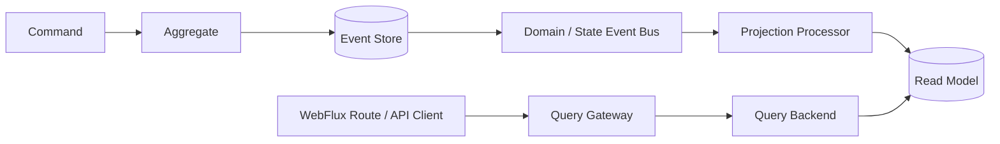
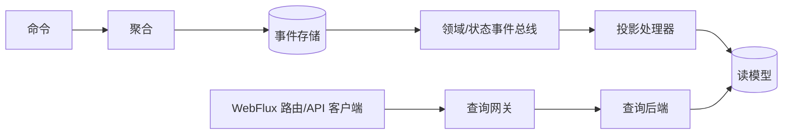

# V9 Query Terminology Cleanup Implementation Plan

> **For agentic workers:** REQUIRED SUB-SKILL: Use superpowers:subagent-driven-development (recommended) or superpowers:executing-plans to implement this plan task-by-task. Steps use checkbox (`- [ ]`) syntax for tracking.

**Goal:** Remove stale `QueryService` terminology from V9 user documentation and make the `QueryGateway`/`QueryBackend` responsibility split explicit in both languages.

**Architecture:** This batch changes documentation only. Managed entry, policy, and typed materialization are named `QueryGateway`; storage execution and TCK adapter contracts are named `QueryBackend`; generic prose uses “query capability” only when it does not denote a framework type.

**Tech Stack:** Markdown, Mermaid, VitePress, pnpm

**Spec:** `docs/superpowers/specs/2026-08-31-v9-documentation-concept-and-diagram-migration-design.md`

## Global Constraints

- Do not change runtime code, public API, serialization, REST contracts, or the V9.0.x `Condition` compatibility window.
- Do not change `DynamicDocument`; it is a frontend alias and is outside this batch.
- Old `QueryService` names may remain only inside explicit V8-to-V9 migration material under `v9-query-migration.md`.
- Keep English and Chinese documents structurally aligned.
- Do not add compatibility aliases, dependencies, generated SVG, or VitePress `dist` output.

---

### Task 1: Replace stale QueryService terminology and anchors

**Files:**
- Modify: `documentation/docs/en/guide/advanced/module-dependencies.md`
- Modify: `documentation/docs/zh/guide/advanced/module-dependencies.md`
- Modify: `documentation/docs/en/guide/extensions/apiclient.md`
- Modify: `documentation/docs/zh/guide/extensions/apiclient.md`
- Modify: `documentation/docs/en/guide/extensions/elasticsearch.md`
- Modify: `documentation/docs/zh/guide/extensions/elasticsearch.md`
- Modify: `documentation/docs/en/guide/extensions/tck.md`
- Modify: `documentation/docs/zh/guide/extensions/tck.md`
- Modify: `documentation/docs/en/guide/extensions/webflux.md`
- Modify: `documentation/docs/zh/guide/extensions/webflux.md`
- Modify: `documentation/docs/en/reference/config/core.md`
- Modify: `documentation/docs/zh/reference/config/core.md`
- Modify: `documentation/docs/en/guide/query.md`
- Modify: `documentation/docs/zh/guide/query.md`

**Interfaces:**
- Consumes: V9 `QueryGatewayRegistrar`, `SnapshotQueryBackendSpec`, `EventStreamQueryBackendSpec`, MongoDB/Elasticsearch `QueryBackend` implementations.
- Produces: User documentation whose names match the V9 JVM types and responsibility boundaries.

- [ ] **Step 1: Capture the failing terminology scan**

Run:

```bash
rg -n -i 'query service|query-service|查询服务|公共 service 行为' \
  documentation/docs/en documentation/docs/zh \
  --glob '!**/v9-query-migration.md'
```

Expected: matches in module dependency, API client, Elasticsearch, TCK, WebFlux, configuration, and query entry documents.

- [ ] **Step 2: Apply the exact responsibility-aware wording**

Use these replacements in the English documents:

| Existing meaning | Replacement wording |
| --- | --- |
| `wow-spring` query-service registration | `Query Gateway registration` |
| MongoDB/Elasticsearch query services | `query backends` |
| projection turned into a query service | projection turned into a server-side `QueryGateway` |
| both query-service specs | `SnapshotQueryBackendSpec` and `EventStreamQueryBackendSpec` |
| programmatic query services | programmatic `QueryGateway` calls |
| configuration capability query services | query backends |
| `<a id="query-service">` | `<a id="query-gateway">` |
| `<a id="query-service-registrar">` | `<a id="query-gateway-registrars">` |

Use the aligned Chinese wording:

| Existing meaning | Replacement wording |
| --- | --- |
| `wow-spring` 查询服务注册 | 查询网关注册 |
| MongoDB/Elasticsearch 查询服务 | 查询后端 |
| 把投影变成查询服务 | 把投影变成服务端 `QueryGateway` |
| 两个 query service spec | `SnapshotQueryBackendSpec` 与 `EventStreamQueryBackendSpec` |
| 程序内查询保持公共 service 行为 | 程序内 `QueryGateway` 调用保持既有公共行为 |
| 配置 capability 查询服务 | 查询后端 |
| `<a id="查询服务">` | `<a id="query-gateway">` |
| `<a id="查询服务注册器">` | `<a id="query-gateway-registrars">` |

Do not change explicit old names in the migration tables.

- [ ] **Step 3: Verify the stale terminology is gone outside migration docs**

Run:

```bash
if rg -n -i 'query service|query-service|查询服务|公共 service 行为' \
  documentation/docs/en documentation/docs/zh \
  --glob '!**/v9-query-migration.md'; then
  exit 1
fi
```

Expected: exit code `0` with no output.

- [ ] **Step 4: Verify the canonical names exist symmetrically**

Run:

```bash
rg -n 'QueryGateway|Query Gateway|query backends|query-gateway-registrars' \
  documentation/docs/en/guide documentation/docs/en/reference/config/core.md
rg -n 'QueryGateway|查询网关|查询后端|query-gateway-registrars' \
  documentation/docs/zh/guide documentation/docs/zh/reference/config/core.md
```

Expected: both commands find the new names in the modified entry, extension, and configuration documents.

- [ ] **Step 5: Commit the terminology batch**

```bash
git add \
  documentation/docs/en/guide/advanced/module-dependencies.md \
  documentation/docs/zh/guide/advanced/module-dependencies.md \
  documentation/docs/en/guide/extensions/apiclient.md \
  documentation/docs/zh/guide/extensions/apiclient.md \
  documentation/docs/en/guide/extensions/elasticsearch.md \
  documentation/docs/zh/guide/extensions/elasticsearch.md \
  documentation/docs/en/guide/extensions/tck.md \
  documentation/docs/zh/guide/extensions/tck.md \
  documentation/docs/en/guide/extensions/webflux.md \
  documentation/docs/zh/guide/extensions/webflux.md \
  documentation/docs/en/reference/config/core.md \
  documentation/docs/zh/reference/config/core.md \
  documentation/docs/en/guide/query.md \
  documentation/docs/zh/guide/query.md
git commit -m "docs(query): unify gateway and backend terminology"
```

### Task 2: Correct the projection read-path diagrams

**Files:**
- Modify: `documentation/docs/en/guide/projection.md`
- Modify: `documentation/docs/zh/guide/projection.md`

**Interfaces:**
- Consumes: The terminology established by Task 1.
- Produces: Mermaid diagrams that show the managed Gateway and storage Backend as separate nodes.

- [ ] **Step 1: Verify the old diagram collapses the query boundary**

Run:

```bash
rg -n 'Query Service|查询服务' \
  documentation/docs/en/guide/projection.md \
  documentation/docs/zh/guide/projection.md
```

Expected: one old node in each document.

- [ ] **Step 2: Replace the English diagram with the V9 read path**

Use this exact Mermaid block:



- [ ] **Step 3: Replace the Chinese diagram with the aligned V9 read path**

Use this exact Mermaid block:



- [ ] **Step 4: Verify both diagrams expose the same boundary**

Run:

```bash
rg -n 'Query Gateway|Query Backend' documentation/docs/en/guide/projection.md
rg -n '查询网关|查询后端' documentation/docs/zh/guide/projection.md
```

Expected: exactly one Gateway node and one Backend node in each document.

- [ ] **Step 5: Commit the diagram correction**

```bash
git add \
  documentation/docs/en/guide/projection.md \
  documentation/docs/zh/guide/projection.md
git commit -m "docs(query): show gateway backend boundary"
```

### Task 3: Verify the standalone PR batch

**Files:**
- Verify: `documentation/docs/`
- Verify: repository working tree

**Interfaces:**
- Consumes: Documentation changes from Tasks 1 and 2.
- Produces: A build-verified, whitespace-clean batch ready for review.

- [ ] **Step 1: Install the locked documentation dependencies**

Run:

```bash
cd documentation
pnpm install --frozen-lockfile
```

Expected: installation succeeds without changing `pnpm-lock.yaml`.

- [ ] **Step 2: Build the bilingual VitePress site**

Run:

```bash
cd documentation
pnpm docs:build
```

Expected: VitePress build succeeds.

- [ ] **Step 3: Run the final textual and Git checks**

Run from the repository root:

```bash
if rg -n -i 'query service|query-service|查询服务|公共 service 行为' \
  documentation/docs/en documentation/docs/zh \
  --glob '!**/v9-query-migration.md'; then
  exit 1
fi
git diff --check HEAD~2..HEAD
git status --short
```

Expected: no stale terminology, no whitespace errors, and no tracked VitePress `dist` or dependency output.
