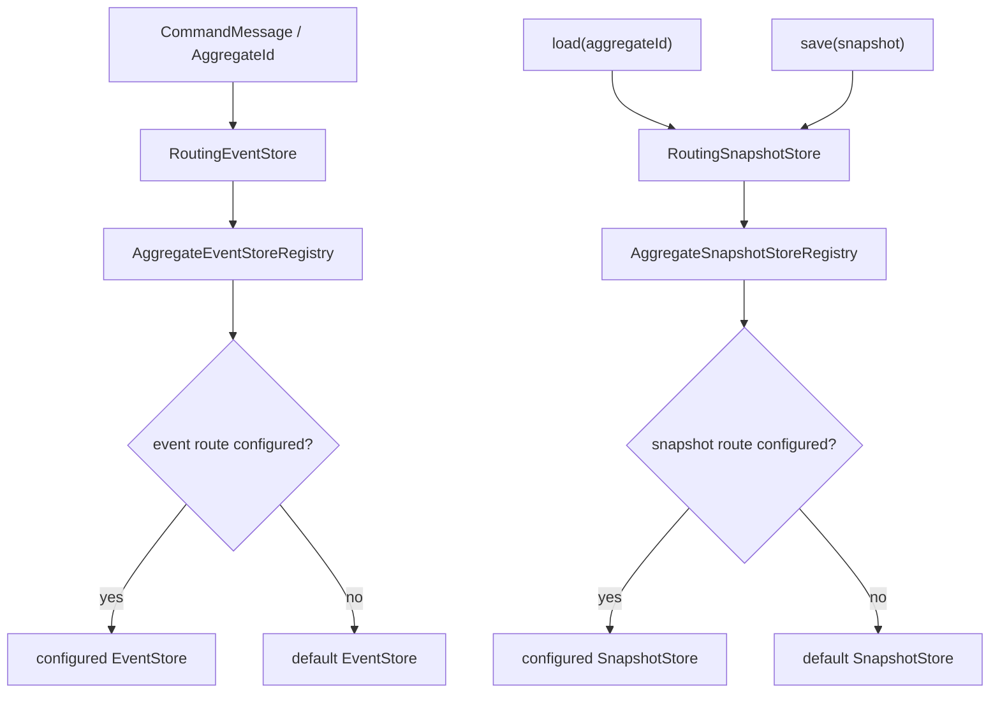

# 聚合存储路由设计

## 背景

Wow 当前通过全局配置选择唯一事件存储和快照存储：

```yaml
wow:
  eventsourcing:
    store:
      storage: mongo
    snapshot:
      storage: mongo
```

对应代码也按单例注入。当前代码里的快照存储接口名仍是 `SnapshotRepository`：

- `AggregateAutoConfiguration.stateAggregateRepository(...)` 注入一个 `SnapshotRepository` 和一个 `EventStore`，创建 `EventSourcingStateAggregateRepository`。
- `AggregateAutoConfiguration.commandAggregateFactory(...)` 注入一个 `EventStore`，创建 `SimpleCommandAggregateFactory`。
- `EventSourcingStateAggregateRepository` 在加载聚合时先读 `SnapshotRepository`，再从 `EventStore` 重放增量事件。
- `SimpleCommandAggregate` 在命令处理完成后把 `DomainEventStream` 追加到 `EventStore`。

这说明当前模型的限制不是核心 port 缺少聚合身份，而是运行时装配只有全局后端。`EventStore.append(eventStream)`、`EventStore.load(aggregateId)`、`SnapshotRepository.load(aggregateId)`、`SnapshotRepository.save(snapshot)` 已经能拿到 `AggregateId` 或 `NamedAggregate`，可以在 port 外层做路由。

设计目标命名将 `SnapshotRepository` 收敛为 `SnapshotStore`。`Store` 与 `EventStore` 对齐，更准确表达“快照事实的存取端口”，避免 `Repository` 与领域仓储、查询仓储混用。

## 目标

支持按聚合配置 `EventStore` 和 `SnapshotStore`，并保持现有默认行为：

- 未配置聚合路由时，行为与当前版本一致。
- 聚合未出现在路由配置中时，使用全局默认后端。
- 聚合可以只覆盖 `event` 或只覆盖 `snapshot`，未覆盖的 channel 使用默认后端。
- 配置中能显式区分 `event` 和 `snapshot`。
- 常见后端使用 `StorageType` 枚举，保留 IDE 智能提示。
- 同类型多实例、特殊数据库、归档存储等高级场景通过命名 `binding` 扩展。

## 非目标

- 不修改 `EventStore` 方法签名。
- `SnapshotRepository` 重命名为 `SnapshotStore`，实现时需要提供清晰迁移路径。
- 不把存储选择放入 `@AggregateRoot` 或聚合元数据。
- 不在聚合配置里声明数据库连接、Redis 连接或 R2DBC 数据源细节。
- 第一阶段不支持 `event: redis` 这类 scalar 简写，避免类型提示和扩展模型混杂。
- 第一阶段不承诺自动迁移已存在事件或快照数据。

## 配置模型

正式配置使用对象写法：

```yaml
wow:
  context-name: order-service

  eventsourcing:
    store:
      storage: mongo
    snapshot:
      enabled: true
      storage: mongo

    storage-routing:
      aggregates:
        order:
          event:
            storage: redis

        cart:
          snapshot:
            storage: redis

        audit:
          event:
            binding: archive-event-store
          snapshot:
            binding: archive-snapshot-store
```

语义：

- `order` 省略 `contextName`，按当前 `wow.context-name` 解析为 `order-service.order`。
- `order-service.order` 也允许，表示完整 `NamedAggregate`。
- `event.storage` / `snapshot.storage` 的类型是 `StorageType`，支持 `mongo`、`redis`、`r2dbc`、`elasticsearch`、`in_memory`、`delay`。
- `event.binding` / `snapshot.binding` 是自定义后端绑定名称，用于同类型多实例或特殊实现。
- 一个 channel 内 `storage` 和 `binding` 二选一。
- 聚合未配置某个 channel 时，该 channel 使用默认全局后端。
- 聚合完全未配置时，`event` 与 `snapshot` 都使用默认全局后端。

建议属性类型：

```kotlin
data class StorageRoutingProperties(
    val aggregates: Map<String, AggregateStorageRouteProperties> = emptyMap()
)

data class AggregateStorageRouteProperties(
    val event: StorageChannelRouteProperties? = null,
    val snapshot: StorageChannelRouteProperties? = null
)

data class StorageChannelRouteProperties(
    val storage: StorageType? = null,
    val binding: String? = null
)
```

## 组件设计

新增运行时路由组件：

- `RoutingEventStore : EventStore`
- `RoutingSnapshotStore : SnapshotStore`
- `AggregateEventStoreRegistry`
- `AggregateSnapshotStoreRegistry`

新增后端绑定组件：

```kotlin
data class EventStoreBinding(
    val name: String,
    val storage: StorageType?,
    val eventStore: EventStore
)

data class SnapshotStoreBinding(
    val name: String,
    val storage: StorageType?,
    val snapshotStore: SnapshotStore
)
```

`storage` 用于枚举型配置解析；`name` 用于高级 `binding` 解析。默认全局后端也应注册成 binding，但业务配置不需要显式引用它。

路由开启条件：

- `wow.eventsourcing.storage-routing.aggregates` 非空时启用路由。
- 路由开启时，`RoutingEventStore` 和 `RoutingSnapshotStore` 作为主 `EventStore` / `SnapshotStore` 注入。
- 具体后端通过 `EventStoreBinding` / `SnapshotStoreBinding` 注入路由组件，避免路由代理把自身当成可选后端。

## 后端解析

`storage` 解析规则：

1. 根据 channel 的 `StorageType` 查找同类型 binding。
2. 如果没有对应 binding，启动失败。
3. `storage` 只表达后端类型，不表达连接细节。

`binding` 解析规则：

1. `event.binding` 查找 `EventStoreBinding.name`。
2. `snapshot.binding` 查找 `SnapshotStoreBinding.name`。
3. 找不到时启动失败。

多实例场景使用 `binding`：

```kotlin
@Bean
fun archiveEventStoreBinding(
    archiveEventStore: EventStore
): EventStoreBinding =
    EventStoreBinding(
        name = "archive-event-store",
        storage = null,
        eventStore = archiveEventStore,
    )

@Bean
fun archiveSnapshotStoreBinding(
    archiveSnapshotStore: SnapshotStore
): SnapshotStoreBinding =
    SnapshotStoreBinding(
        name = "archive-snapshot-store",
        storage = null,
        snapshotStore = archiveSnapshotStore,
    )
```

## 数据流



委托规则：

- `RoutingEventStore.append(eventStream)` 从 `eventStream.aggregateId.namedAggregate` 路由。
- `RoutingEventStore.load(...)`、`last(...)`、`single(...)` 从 `aggregateId.namedAggregate` 路由。
- `RoutingSnapshotStore.load(...)`、`getVersion(...)` 从 `aggregateId.namedAggregate` 路由。
- `RoutingSnapshotStore.save(snapshot)` 从 `snapshot.aggregateId.namedAggregate` 路由。
- `RoutingSnapshotStore.scanAggregateId(namedAggregate, ...)` 直接按参数路由。

补偿、WebFlux 管理路由、聚合加载、命令持久化只要注入主 `EventStore` / `SnapshotStore`，就会使用同一套路由规则。

## 启动校验

启动期必须快速失败：

- 聚合 key 省略 context 时，如果 `wow.context-name` 为空，启动失败。
- 聚合 key 补全后不在 `MetadataSearcher.namedAggregateType` 中，启动失败。
- 一个 channel 同时配置 `storage` 和 `binding`，启动失败。
- 一个 channel 配置为空对象，启动失败。
- `storage` 找不到对应后端 binding，启动失败。
- `binding` 找不到对应命名 binding，启动失败。
- `wow.eventsourcing.snapshot.enabled=false` 时，如果配置了任何 `snapshot` 路由，启动失败。

运行期不吞异常。底层存储抛出的版本冲突、重复请求、连接失败和序列化异常应保持当前语义向上传播。

## 自动配置影响

第一阶段应保持现有无路由行为完全不变。开启路由后：

- `StorageRoutingProperties` 由 `wow-spring-boot-starter` 绑定。
- `StorageRoutingAutoConfiguration` 创建 `RoutingEventStore` / `RoutingSnapshotStore`。
- 各后端自动配置为可用后端注册 `EventStoreBinding` / `SnapshotStoreBinding`。
- 默认后端由现有 `wow.eventsourcing.store.storage` 与 `wow.eventsourcing.snapshot.storage` 选择。
- 非默认 `StorageType` 只有在路由配置引用它时才需要创建对应 binding，避免未使用后端因为连接配置缺失而影响启动。

实现时需要避免多个 `EventStore` 或 `SnapshotStore` bean 造成歧义。路由开启后，对框架内部注入点应让路由代理成为主 bean；具体后端通过 binding 列表被路由组件消费。

## 测试

核心测试：

- `RoutingEventStore.append/load/last/single` 按 `NamedAggregate` 委托到配置后端。
- `RoutingEventStore` 未配置聚合或未配置 `event` channel 时回落默认后端。
- `RoutingSnapshotStore.load/getVersion/save/scanAggregateId` 按 `NamedAggregate` 委托到配置后端。
- `RoutingSnapshotStore` 未配置聚合或未配置 `snapshot` channel 时回落默认后端。
- 底层异常不被路由层吞掉或包装成不兼容异常。

Starter 配置测试：

- `order.event.storage=redis` 只覆盖事件存储，快照回落默认。
- `cart.snapshot.storage=redis` 只覆盖快照存储，事件回落默认。
- `audit.event.binding=archive-event-store` 和 `audit.snapshot.binding=archive-snapshot-store` 使用命名 binding。
- `order` 在 `wow.context-name=order-service` 下解析为 `order-service.order`。
- 完整 `order-service.order` key 可以直接解析。
- 未配置聚合走默认后端。
- 非法聚合 key、空 channel、同时配置 `storage` 和 `binding`、不存在 binding、不可用 `StorageType` 都启动失败。
- `snapshot.enabled=false` 且存在 `snapshot` 路由时启动失败。

不需要重跑每个后端的完整 TCK 语义。具体 `EventStore` 与 `SnapshotStore` 后端契约仍由现有 TCK 负责；本设计新增测试聚焦路由选择和配置绑定。

## 兼容性与迁移

现有应用不配置 `wow.eventsourcing.storage-routing.aggregates` 时，不感知该功能。

`SnapshotRepository` 到 `SnapshotStore` 是公开 API 命名变更。实现计划需要明确迁移策略：

1. 新增 `SnapshotStore` 作为目标接口名称。
2. 将框架内部注入点、路由组件、后端实现和文档统一迁移到 `SnapshotStore`。
3. 为源代码迁移提供一轮兼容桥接，例如保留已废弃的 `SnapshotRepository` 名称作为过渡入口，并在文档中标明后续移除窗口。
4. TCK 与测试命名同步迁移为 `SnapshotStoreSpec`，但保留对兼容桥接的最小测试，确保旧名称在过渡期可用。
5. 发布说明必须标注这是命名层面的破坏性变更或过渡性弃用，避免用户误以为只是内部重构。

迁移到聚合路由时建议先只覆盖一个低风险聚合的单 channel：

```yaml
wow:
  eventsourcing:
    storage-routing:
      aggregates:
        order:
          event:
            storage: redis
```

确认事件写入和重放稳定后，再按聚合或 channel 扩展。已经存在于旧后端的数据不会自动迁移；如果把某个聚合的 `event` 从 Mongo 切到 Redis，需要业务侧先完成事件数据迁移或接受该聚合从新后端重新开始的语义。

## 风险

最大风险是事件与快照被配置到不一致的数据生命周期。设计允许分通道覆盖是为了支持冷热、归档和渐进迁移，但使用者必须保证同一聚合的快照来源与事件来源在业务上可重建。

第二个风险是多后端自动配置引入 bean 歧义。实现必须通过 binding 抽象隔离具体后端，并让框架主注入点只看到路由代理。

第三个风险是文档误导用户以为 `storage: redis` 会声明 Redis 连接。文档必须明确：`storage` 只是后端类型选择，连接配置仍由对应 starter 或用户自定义 bean 提供。
