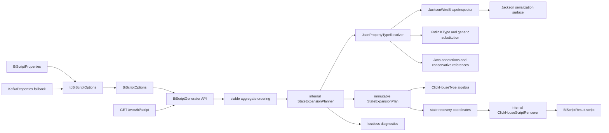
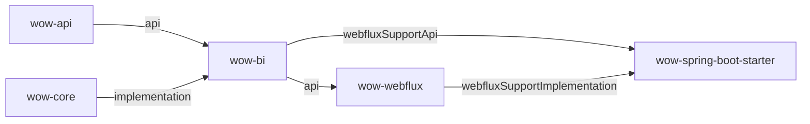

# Wow BI 清洁架构与无损类型设计

## 1. 决策状态

本文是 `wow-bi` 唯一的架构设计事实源。此前已完成的 planner、renderer、稳定排序、SQL quoting 和
diagnostics 继续保留；旧双轨实现、旧设计和旧实施计划全部删除。

用户已明确允许破坏性变更，不考虑向前兼容和迁移。因此本文不为历史构造器、类名、配置或 SQL schema
保留适配层、迁移表或回滚说明。

## 2. 目标与完成标准

本轮目标不是继续包装现有实现，而是把 BI 脚本生成收敛为单一、无损、可验证的模型。

完成标准：

- 只有一条 `BiScriptGenerator -> StateExpansionPlanner -> ClickHouseScriptRenderer` 生产链。
- 只有 `BiScriptOptions` 表达生成策略；WebFlux 直接接收它，Spring 只保留配置绑定适配器。
- 删除 legacy engine/template/builder/column API、重复 enums 和所有兼容分支。
- Kotlin 与 Java 属性的 nullability、泛型参数和 nullable ancestor 不再丢失。
- ClickHouse 类型由结构化模型表达，构造期无法产生 `Nullable(Array(...))` 等非法组合。
- nullable scalar 使用 `Nullable(T)`；每个 declared nullable/unknown typed property 使用类型化投影加 scoped raw companion。
- 每个 expansion view 直接投影原始 `state` 为 `__state`，它是唯一词法权威；property raw 不是权威副本。
- 每个 collection child row 使用 RFC 6901 `__path` 和零基 `__index` 定位 `__state` 中的 occurrence。
- depth cutoff、object map、raw generic 和 unsupported type 只允许 fail 或可由 `__state + __path` 恢复；不允许有损强转后宣称权威。
- 只有能证明声明 Bean 模型与实际 Jackson wire shape 同构的对象才允许递归展开；其他对象统一 fail 或 scoped raw + `__state` recovery。
- JVM scalar 映射同时声明 JSON token shape、提取策略和 ClickHouse type；任一环节无法证明无损时统一 raw/fail。
- planner 发现重复列名、reserved raw 名冲突或 Java nullability 冲突时 fail fast。
- 本地单测、四个相关模块检查、detekt、文档构建通过。
- 独立 ClickHouse integration test 可编译，并在 CI Docker 环境执行真实 DDL/query；CI 不静默跳过。
- `BiScriptGenerator` 生成的全部 executable statements 在最低支持 ClickHouse 上执行真实 DDL smoke。
- 中英文文档只描述当前 API/schema，不保留迁移和兼容说明。

## 3. 方案比较

### 3.1 方案 A：类型化展开 + raw companion（采用）

标量、数组和 Map 尽可能保留 ClickHouse 类型；复合 nullable 节点额外输出 scoped raw companion，
完整词法值由 `__state` recovery channel 保留。
planner 使用 Kotlin/Java nullability resolver 和结构化 `ClickHouseType`。

优点：

- BI 查询仍使用类型化列。
- `null`、empty、missing 和正常值可无损区分。
- 非法 ClickHouse 类型在进入 renderer 前即被类型系统拒绝。
- 复杂值 fallback 不再伪造精度。

代价：保守的 wire-shape 判定会让 custom/polymorphic/unwrapped 等对象失去 typed expansion，但始终保留完整 JSON。

### 3.2 方案 B：统一使用 ClickHouse `JSON`

所有 state 属性保留为 ClickHouse `JSON`，查询时动态取值。

未采用原因：改变现有列式 BI 使用模型，引入 ClickHouse 版本和动态 path 行为依赖，且削弱稳定 schema。

### 3.3 方案 C：复杂值全部输出 String

所有对象、数组和 Map 只输出 scoped `JSONExtractRaw` convenience projection，并保留权威 `__state`。

未采用原因：虽然无损，但会主动放弃已经可以可靠表达的标量、数组和 Map 类型，降低分析价值。

## 4. 目标架构



### 4.1 模块依赖



- `wow-bi` 的公开 generator 接收 `NamedAggregate`，因此显式 `api(project(":wow-api"))`。
- `wow-bi` 对 introspection/serialization runtime 继续 `implementation(project(":wow-core"))`。
- WebFlux 的公开 handler/factory 直接接收 `BiScriptOptions`，因此 `api(project(":wow-bi"))`。
- Starter 的公开 configuration properties 使用 BI enum，只在 `webflux-support` feature 暴露 `wow-bi`。
- `GlobalRouteModule` 收窄为 `internal`，不额外扩大 WebFlux ABI。

## 5. 公开 API 与内部边界

### 5.1 七个公开类型

`wow-bi` 只承诺以下七个公开类型：`BiScriptGenerator`、`BiScriptOptions`、
`UnsupportedTypeStrategy`、`BiScriptResult`、`BiScriptDiagnostic`、
`BiScriptDiagnosticCode`、`BiScriptMappingDecision`。

```kotlin
class BiScriptGenerator(
    options: BiScriptOptions = BiScriptOptions(),
) {
    fun generate(namedAggregates: Set<NamedAggregate>): BiScriptResult
}

data class BiScriptOptions(
    val database: String = "bi_db",
    val consumerDatabase: String = "bi_db_consumer",
    val cluster: String = "{cluster}",
    val installation: String = "{installation}",
    val shard: String = "{shard}",
    val replica: String = "{replica}",
    val timezone: String = "Asia/Shanghai",
    val kafkaBootstrapServers: String = "localhost:9093",
    val topicPrefix: String = Wow.WOW_PREFIX,
    val maxExpansionDepth: Int = 5,
    val unsupportedTypeStrategy: UnsupportedTypeStrategy = UnsupportedTypeStrategy.RAW_JSON,
)

enum class UnsupportedTypeStrategy {
    FAIL,
    RAW_JSON,
}
```

`BiScriptOptions` 在 `init` 中校验，非法实例不能被构造。默认值只在该类型定义，不再反向依赖 legacy template。

结果 API：

```kotlin
data class BiScriptResult(
    val script: String,
    val diagnostics: List<BiScriptDiagnostic>,
)

data class BiScriptDiagnostic(
    val code: BiScriptDiagnosticCode,
    val aggregate: String,
    val path: String,
    val sourceType: String,
    val decision: BiScriptMappingDecision,
    val message: String,
)

enum class BiScriptDiagnosticCode {
    RAW_JSON_FALLBACK,
    MAX_DEPTH_REACHED,
}

enum class BiScriptMappingDecision {
    RAW_JSON,
    MAX_DEPTH_RAW_JSON,
}
```

所有返回的 diagnostic 都是 warning；严格失败直接抛出包含 aggregate/path/type 的异常，因此删除无生产语义的
`Severity.ERROR`。`decision` 只描述无损决定，如 `RAW_JSON` 或 `MAX_DEPTH_RAW_JSON`。

### 5.2 内部实现边界

命名、planner/plan、resolver、renderer/syntax、wire-shape inspector、结构化 ClickHouse 类型和
executable statement 列表全部 `internal`。WebFlux 与 Starter 只消费上述公开类型，不公开重复配置模型或
BI 内部规划结构。

## 6. 类型解析模型

### 6.1 序列化表面与类型信息分工

Jackson 是实际 JSON 表面的权威来源，负责：

- property 是否参与 serialization；
- `@JsonProperty` 后的 serialized name；
- getter/field/constructor property 与继承可见性。

`JsonPropertyTypeResolver` 按 Jackson accessor/member signature 对齐 Kotlin/Java member，不按 serialized name
猜测 Kotlin property。它输出：

```kotlin
internal enum class Nullability {
    NON_NULL,
    NULLABLE,
    UNKNOWN,
}

internal data class ResolvedType(
    val javaType: JavaType,
    val arguments: List<ResolvedType>,
    val nullability: Nullability,
    val origin: TypeOrigin,
)
```

planner 递归进入 generic object 时必须把当前 `ResolvedType` 传回 resolver；resolver 以其中的 argument
nullability 初始化该 raw class 的 type-parameter bindings。只传 `JavaType` 会让 `Box<T>.value` 在第二层
重新退化为 `UNKNOWN`，因此只允许 `resolve(ResolvedType)` 作为递归入口。

`JsonPropertyTypeResolver` 只负责声明类型、泛型和 nullability；它不再声称 Bean properties 就是实际 wire shape。

### 6.2 Kotlin 规则

- 使用 property/getter 的 `KType.isMarkedNullable`。
- 递归读取 collection/map generic arguments。
- 沿 concrete type 建立 `KTypeParameter -> KType` binding，支持
  `Base<T>` / `Derived : Base<String?>` 与多层嵌套替换。
- nullable ancestor object 或 nullable collection element 会让所有后代 typed leaf 变为 effective nullable。
- `@JsonProperty` rename 不改变 member 对齐和 KType 来源。

### 6.3 Java 规则

- primitive 为 `NON_NULL`。
- getter return/type-use、field、record component、constructor parameter 上的 `@Nullable` 为 `NULLABLE`。
- 对应 `@NotNull`/`@NonNull` 为 `NON_NULL`。
- 同一 property 出现冲突标注时 fail fast。
- 未标注 reference 为 `UNKNOWN`，映射时按 nullable 处理；这是可接受所有合法 Java 值的保守 schema，
  不因缺少 annotation 阻断脚本生成。
- `@JsonProperty(required = true)` 不代表 non-null。
- Java override 继承最具体父接口/父类 getter 的 return/type-use nullability contract；实现方法不必重复注解。

### 6.4 Jackson wire-shape trust gate

新增内部 `JacksonWireShapeInspector`，使用生产消息序列化所使用的同一个 `JsonSerializer` 和
`acceptJsonFormatVisitor` 判断实际 wire format。只有同时满足以下条件的对象才返回
`ExpandableObject(properties)`：

- format visitor 返回 `OBJECT`；
- visitor 的 property name/type signature 与过滤后的 Bean properties 一一对应；
- 类型是 concrete、非 sealed、非 polymorphic；
- 类型和 property 上不存在 `@JsonValue`、`@JsonUnwrapped`、`@JsonAnyGetter`、custom serializer、converter、
  content/key serializer 等会改变结构的声明。

其他情况返回带内部 reason 的 `Opaque`。嵌套 opaque property 在最近可寻址节点整体 raw/fail；opaque collection
element 使整个 collection raw/fail；opaque root state 在 root view 中直接透传完整 `state`，禁止生成空 view。
集合和 Map 只有在 selected serializer 来自 Jackson databind、容器 visitor shape 正确且元素/key/value 映射通过时
才允许 typed projection；显式或第三方 custom container serializer 统一 raw/fail，不反推其内容语义。
不扫描或合并运行时子类，不反编译 custom serializer，也不硬编码特定 serializer 的字段。

## 7. ClickHouse 类型代数

`ColumnPlan` 不再携带任意 `String sqlType`，而携带受约束的 `ClickHouseType`：

```kotlin
internal sealed interface ClickHouseType {
    sealed interface Scalar : ClickHouseType
    data class Nullable(val value: Scalar) : ClickHouseType
    data class Array(val element: ClickHouseType) : ClickHouseType
    data class Map(val key: Scalar, val value: ClickHouseType) : ClickHouseType
}
```

具体 scalar 由不可变 registry 映射，renderer 是唯一 SQL 序列化位置。每个映射同时表达预期 JSON token shape、
提取策略和 ClickHouse type；format visitor 与预期 token 不一致时该值视为 opaque。构造不变量：

- `Nullable` 只能包装 scalar，不能包装 Array/Map。
- Map key 必须是 non-null scalar。
- nested `Nullable(Nullable(T))` 不存在。
- Decimal precision/scale 和其他参数在构造时校验。
- 调用方不能在运行期修改全局 JVM-to-SQL mapping。

无损 scalar 决策：

| JVM type | Jackson wire shape | ClickHouse projection |
| --- | --- | --- |
| `String` | string | `String` |
| primitive/boxed integer、boolean、char | number/boolean/string | 对应精确 scalar |
| `Float` / `Double` | number 或 Jackson 已定义的特殊值 | `Float32` / `Float64` |
| `UUID` | UUID 格式 string | `UUID` |
| `java.time.Duration`、`java.util.Date`、`java.sql.Date`、`Instant`、其他 `java.time.*` | string | `String` |
| `Year` | signed integer | `Int32` |
| `BigDecimal` | arbitrary precision JSON number | scoped `JSONExtractRaw` convenience + authoritative `__state`，不提供固定 Decimal projection |
| `kotlin.time.Duration` | Kotlin value-class wire value | 按解析后的实际 `Long` 处理，不注册伪语义映射 |
| enum | 仅当 format visitor 证明为 string | `String`，否则 raw/fail |

## 8. 无损投影规则

ClickHouse 不允许 `Nullable(Array(...))` 或 `Nullable(Map(...))`，但允许
`Array(Nullable(T))` 与 `Map(String, Nullable(T))`。因此使用以下规则：

| 源类型 | Typed 投影 | Raw companion |
| --- | --- | --- |
| `T` scalar | `T` | 无 |
| `T?` / Java nullable reference scalar | `Nullable(T)` | `__raw__<target>` |
| `List<T>` | `Array(T)` | 无 |
| `List<T?>` | `Array(Nullable(T))` | 无 |
| `List<T>?` | `Array(T)` | `__raw__<target>` |
| `Map<String,T>` | `Map(String,T)` | 无 |
| `Map<String,T?>` | `Map(String,Nullable(T))` | 无 |
| `Map<String,T>?` | `Map(String,T)` | `__raw__<target>` |
| `Child?` | 后代 leaf 使用 effective nullable | `__raw__<target>` |
| `List<Child?>` | parent raw elements + typed child view | child view 中输出 element raw companion |
| depth/raw generic/object-map/unsupported | 不伪造 typed 值 | scoped `JSONExtractRaw` convenience + `__state` recovery |

raw companion 命名为 `__raw__<targetName>`，内容来自 scoped `JSONExtractRaw`，只承担查询便利和
missing/null/empty 判别，不是词法权威：

- missing -> `""`
- explicit null -> `"null"`
- empty array/map -> `"[]"` / `"{}"`
- normal value -> ClickHouse 解析后的 scoped JSON

ClickHouse 24.8 没有同时满足“当前对象层级寻址”和“保留原始数字词法”的子值提取函数：
`simpleJSONExtractRaw` 会跨嵌套层级按首次同名字段匹配，也不能可靠处理需要 JSON escape 的 property name；
`JSONExtractRaw`、`JSONExtractArrayRaw`、`JSON_VALUE` 和 `JSON_QUERY` 会规范化任意精度数字。因此：

- `__state` 直接引用 `state_last.state`，不经过 JSON parse/reserialize，是唯一词法权威；
- root view 的 `__path` 是空 RFC 6901 pointer；
- child view 的 `__path` 包含 serialized property segment 和每层零基 array index，例如 `/orders/2/lines/5`；
- child view 的 `__index` 是当前 collection 层的零基 index；完整 occurrence identity 是 source metadata + `__path`；
- pointer segment 中 `~` 编码为 `~0`，`/` 编码为 `~1`；
- consumer 需要精确子值时必须对 `__state` 按 `__path` 做 source-slice；禁止 parse 后重新序列化并声称词法恢复。

因此 nullable property 不会把 missing、explicit null 或错误 JSON 类型静默合并。对于因 nullable ancestor
而变为 effective nullable、但自身声明为 non-null 的 leaf，由 ancestor raw companion 提供区分，不重复生成 leaf raw。
raw companion 是 view 投影，不新增源表存储。

所有 raw fallback 都输出 scoped convenience column，并通过同一 view 的 `__state` 与当前 recovery path 保证可恢复。
fallback 主 target 不再复制内容相同的 `__raw__` companion。禁止把 `JSONExtractRaw` 或
`JSONExtractArrayRaw` 的结果声明为词法权威。`UnsupportedTypeStrategy.FAIL` 抛异常；`RAW_JSON` 输出 scoped raw
column并产生 `RAW_JSON_FALLBACK` diagnostic。depth cutoff 使用同一 recovery contract 并产生
`MAX_DEPTH_REACHED` diagnostic。

## 9. Plan 不变量与命名

Recovery 与领域列是两个独立内部模型：

```kotlin
internal sealed interface JsonPointerSegment {
    data class Property(val encoded: String) : JsonPointerSegment
    data class Index(val reference: ColumnReference) : JsonPointerSegment
}

internal data class CollectionCursorPlan(
    val source: ColumnReference,
    val property: String,
    val cursor: ColumnReference,
    val element: ColumnReference,
)

internal class ExpansionRecoveryPlan(
    cursors: Collection<CollectionCursorPlan>,
    pointer: Collection<JsonPointerSegment>,
    val currentIndex: ColumnReference?,
)
```

`ExpansionRecoveryPlan` 在构造时复制并冻结 `cursors` 和 `pointer`。collection cursor 不伪装成
`ColumnPlan`；renderer 根据 recovery plan 生成一次 zipped `arrayJoin`，保证元素与 ordinal 不会漂移。

- property 按 serialized name 稳定排序。
- view/diagnostics 顺序确定且 Java 侧不可修改。
- 每个 view 在冻结前检查全部 typed、raw companion 和 metadata alias 的 target name。
- `__state`、`__path`、`__index` 和内部 collection cursor 属于 recovery namespace，不能被领域属性占用。
- collection join 使用 `arrayEnumerate` 生成零基 index；嵌套 collection 继承外层 path 并追加当前 index。
- 重复 target name、domain property 占用 `__raw__` namespace、或与 `__id` 等 metadata alias 冲突时 fail fast，
  错误包含 aggregate、两个 source path 和冲突 target。
- collection child view 继续在同表 sibling 完整收集后构建，保持继承列完整。
- clear 和 create 复用同一份 plan。
- Jackson serialized property name 中的 ISO control 与 DEL 按 UTF-8 bytes 统一渲染为 ClickHouse `\xHH`
  序列，string literal 与 quoted identifier 共用同一编码规则；quote 与 backslash 继续按各自 SQL 上下文转义。

## 10. WebFlux 与 Spring Boot

WebFlux：

```kotlin
class GenerateBIScriptHandlerFunction(
    private val options: BiScriptOptions,
) : HandlerFunction<ServerResponse>

class GenerateBIScriptHandlerFunctionFactory(
    private val options: BiScriptOptions,
)
```

handler 直接调用 `BiScriptGenerator(options).generate(...)`，记录 diagnostics，仍返回
`200 application/sql`。HTTP route/OpenAPI contract 不改变。

Starter 只保留 nullable `BiScriptProperties` 作为 Spring “是否显式配置”的边界，并提供一次转换：

```kotlin
fun BiScriptProperties.toBiScriptOptions(kafkaProperties: KafkaProperties?): BiScriptOptions
```

优先级保持：

1. `wow.bi.script.kafka-*`
2. `wow.kafka.*`
3. `BiScriptOptions` defaults

properties 直接使用 `UnsupportedTypeStrategy`，不复制 enum；最终 `BiScriptOptions` 构造负责唯一校验。

## 11. 测试策略

### 11.1 单元测试

- `ClickHouseTypeTest`：合法 nested 类型与全部非法构造。
- `JsonPropertyTypeResolverTest`：Kotlin nullable/generic/inheritance/rename 和 Java annotation/primitive/reference。
- `JacksonWireShapeInspectorTest`：ordinary bean、interface/abstract/sealed、polymorphic、`@JsonValue`、
  `@JsonUnwrapped`、custom/contextual serializer 和 `AggregateIdJsonSerializer`。
- `StateExpansionPlannerNullableTest`：scalar、array element、map value、nullable ancestor、nullable object element、raw companion。
- recovery plan：root `__state`/empty path、nested collection ordinal vector、RFC 6901 escape、reserved name collision 和不可变性。
- planner collision、depth、unsupported/raw generic、确定性和不可变性。
- renderer 只断言结构/语句和 SQL escaping；完整 golden 仅作为显式 schema snapshot，不作为唯一正确性门禁。
- options 在构造期 fail fast；无 `.validate()` 双态。
- WebFlux 行为测试直接注入 `BiScriptOptions`。
- Spring integration test 从 property 绑定到唯一 options，再通过实际 HTTP SQL 验证，不反射 private route DTO。

### 11.2 ClickHouse integration test

- 将 `:wow-bi` 加入 root `integrationTestProjects`。
- 最低支持版本为 ClickHouse 24.8 LTS；`wow-bi/src/integrationTest` 使用固定的 24.8 image 和 Testcontainers ClickHouse module。
- 从 `BiScriptGenerator.generate()` 取得与 `script` 同源的 immutable executable statements，执行 global、clear、
  command、stateEvent、stateLast 和 expansion 的完整 DDL；测试代码不解析 SQL 字符串。
- 插入 scalar null、array/map null/empty/missing、nullable object、nullable element、object-map mixed JSON。
- 输入 JSON 必须由 `JsonSerializer` 生成，并覆盖 BigDecimal raw、epoch 前 Date、negative Year、Duration 和 Instant。
- 查询 `toTypeName`、typed columns、scoped raw、`__state`、`__path` 和 `__index`，证明类型、值语义与 occurrence 可追溯性。
- 集成数据必须覆盖嵌套同名 key、escaped serialized name、高精度 child value、重复/null/empty child element 和 nested collection。
- 本地 `test/check` 保持 Docker-free；显式 `:wow-bi:integrationTest` 需要 Docker。
- CI integration job 增加 `wow-bi/**` path，并真实运行测试；不使用 `disabledWithoutDocker`。
- Kafka engine 只验证 DDL/object dependency，不在 module test 中伪造 broker 消费；Keeper、Replicated 和 Distributed
  对象使用当前单节点集群配置真实创建。

## 12. 文档

- 中英文代码示例改为 `BiScriptGenerator(options).generate(...)`。
- 删除 `ScriptEngine`、template/expansion API、route constructor 的说明。
- 删除 `object-map-strategy`；`unsupported-type-strategy` 改为 `FAIL | RAW_JSON`。
- 不再复制多份手写完整 SQL；BI 文档保留 canonical 片段，OpenAPI 文档链接 BI 指南。
- 明确列出当前 `T -> Nullable(T)`、array/map element nullable、scoped `__raw__*`、`__state` authority、
  `__path`/`__index` recovery 和 metadata 规则。
- 删除迁移表、升级步骤、回滚说明、旧设计和旧实施计划；仓库中只保留当前事实。
- 模块依赖图必须与 Gradle `api` / `implementation` / feature variant 保持一致。

## 13. 风险与控制

| 风险 | 控制 |
| --- | --- |
| Kotlin member 与 Jackson name 错配 | 按 accessor/member signature 对齐，并测试 `@JsonProperty` rename。 |
| 声明 Bean 模型与 wire shape 不同 | structural trust gate；opaque 值整体 raw/fail。 |
| JVM 类型与 JSON token/ClickHouse 类型错配 | 三元映射模型 + `JsonSerializer` 输入的真实 ClickHouse query test。 |
| scoped raw 路径或数字词法失真 | 原始 `__state` authority + RFC 6901 path/index recovery；raw 列不声明为权威。 |
| Java annotation 生态不一致 | 支持主流 Nullable/NonNull 名称；冲突 fail，未标注 reference 保守 nullable。 |
| raw companion 与 domain 列冲突 | reserved namespace + planner collision validation。 |
| Docker 在开发机不可用 | 单测与 integration 分层；CI 负责不可跳过的真实 ClickHouse gate。 |

## 14. 验收命令

```bash
./gradlew :wow-bi:clean :wow-bi:test --rerun-tasks
./gradlew :wow-bi:integrationTest
./gradlew :wow-bi:check :wow-webflux:check :wow-spring-boot-starter:check :wow-openapi:check detekt
cd documentation && pnpm docs:build
```

若本地 Docker 不可用，必须至少运行 `:wow-bi:integrationTestClasses`，记录环境阻断，并由 CI integration gate
执行容器测试后才能发布。
