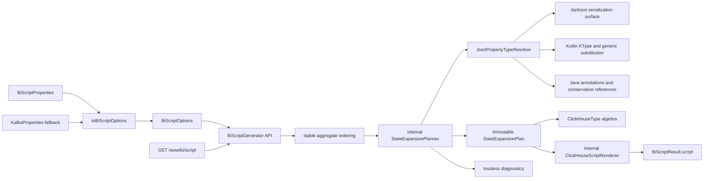
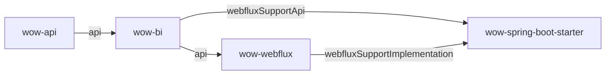

# Wow BI 清洁架构与无损类型设计

## 1. 决策状态

本文是 `wow-bi` 破坏性收口设计，取代
`2026-07-10-wow-bi-refactor-design.md` 中关于 ABI 兼容层、重复 route options 和旧 expansion API
的约束。此前已完成的 planner、renderer、稳定排序、SQL quoting 和 diagnostics 继续保留；旧双轨实现不再保留。

用户已明确允许破坏性变更，并授权在其离线期间自主完成架构决策。因此本文按推荐方案直接执行，
不再为历史构造器、类名或 SQL schema 保留适配层。

## 2. 目标与完成标准

本轮目标不是继续包装现有实现，而是把 BI 脚本生成收敛为单一、无损、可验证的模型。

完成标准：

- 只有一条 `BiScriptGenerator -> StateExpansionPlanner -> ClickHouseScriptRenderer` 生产链。
- 只有 `BiScriptOptions` 表达生成策略；WebFlux 直接接收它，Spring 只保留配置绑定适配器。
- 删除 legacy engine/template/builder/column API、重复 enums 和所有兼容分支。
- Kotlin 与 Java 属性的 nullability、泛型参数和 nullable ancestor 不再丢失。
- ClickHouse 类型由结构化模型表达，构造期无法产生 `Nullable(Array(...))` 等非法组合。
- nullable scalar 使用 `Nullable(T)`；每个 declared nullable/unknown property 使用类型化投影加完整 raw companion。
- depth cutoff、object map、raw generic 和 unsupported type 只允许 fail 或完整 raw JSON；不允许有损强转。
- planner 发现重复列名、reserved raw 名冲突或 Java nullability 冲突时 fail fast。
- 本地单测、四个相关模块检查、detekt、文档构建通过。
- 独立 ClickHouse integration test 可编译，并在 CI Docker 环境执行真实 DDL/query；CI 不静默跳过。
- 中英文文档只描述当前 API/schema，并给出破坏性迁移与回滚方式。

## 3. 方案比较

### 3.1 方案 A：类型化展开 + raw companion（采用）

标量、数组和 Map 尽可能保留 ClickHouse 类型；复合 nullable 节点额外输出完整 JSON raw companion。
planner 使用 Kotlin/Java nullability resolver 和结构化 `ClickHouseType`。

优点：

- BI 查询仍使用类型化列。
- `null`、empty、missing 和正常值可无损区分。
- 非法 ClickHouse 类型在进入 renderer 前即被类型系统拒绝。
- 复杂值 fallback 不再伪造精度。

代价：SQL schema 改变，nullable composite 增加 reserved companion 列，下游查询需要迁移。

### 3.2 方案 B：统一使用 ClickHouse `JSON`

所有 state 属性保留为 ClickHouse `JSON`，查询时动态取值。

未采用原因：改变现有列式 BI 使用模型，引入 ClickHouse 版本和动态 path 行为依赖，且削弱稳定 schema。

### 3.3 方案 C：复杂值全部输出 String

所有对象、数组和 Map 统一 `JSONExtractRaw`。

未采用原因：虽然无损，但会主动放弃已经可以可靠表达的标量、数组和 Map 类型，降低分析价值。

## 4. 目标架构



### 4.1 模块依赖



- `wow-bi` 的公开 generator 接收 `NamedAggregate`，因此显式 `api(project(":wow-api"))`。
- `wow-bi` 对 introspection/serialization runtime 继续 `implementation(project(":wow-core"))`。
- WebFlux 的公开 handler/factory 直接接收 `BiScriptOptions`，因此 `api(project(":wow-bi"))`。
- Starter 的公开 configuration properties 使用 BI enum，只在 `webflux-support` feature 暴露 `wow-bi`。
- `GlobalRouteModule` 收窄为 `internal`，不额外扩大 WebFlux ABI。

## 5. 公开 API 与删除范围

### 5.1 唯一公开 API

```kotlin
class BiScriptGenerator(
    options: BiScriptOptions = BiScriptOptions(),
) {
    fun generate(namedAggregates: Set<NamedAggregate>): BiScriptResult
}

data class BiScriptOptions(
    val database: String = "bi_db",
    val consumerDatabase: String = "bi_db_consumer",
    val cluster: String = "{cluster}",
    val installation: String = "{installation}",
    val shard: String = "{shard}",
    val replica: String = "{replica}",
    val timezone: String = "Asia/Shanghai",
    val kafkaBootstrapServers: String = "localhost:9093",
    val topicPrefix: String = Wow.WOW_PREFIX,
    val maxExpansionDepth: Int = 5,
    val unsupportedTypeStrategy: UnsupportedTypeStrategy = UnsupportedTypeStrategy.RAW_JSON,
)

enum class UnsupportedTypeStrategy {
    FAIL,
    RAW_JSON,
}
```

`BiScriptOptions` 在 `init` 中校验，非法实例不能被构造。默认值只在该类型定义，不再反向依赖 legacy template。

结果 API：

```kotlin
data class BiScriptResult(
    val script: String,
    val diagnostics: List<BiScriptDiagnostic>,
)

data class BiScriptDiagnostic(
    val code: BiScriptDiagnosticCode,
    val aggregate: String,
    val path: String,
    val sourceType: String,
    val decision: BiScriptMappingDecision,
    val message: String,
)
```

所有返回的 diagnostic 都是 warning；严格失败直接抛出包含 aggregate/path/type 的异常，因此删除无生产语义的
`Severity.ERROR`。`decision` 只描述无损决定，如 `RAW_JSON` 或 `MAX_DEPTH_RAW_JSON`。

### 5.2 删除的 API 与实现

- `ScriptEngine`
- `ScriptTemplateEngine`
- `StateExpansionScriptGenerator`
- `SqlBuilder`
- `TableNaming`
- 整个 `expansion.column` 包
- mutable `SqlTypeMapping`
- `BiScriptRouteOptions` 及 route enums
- Starter 重复 enums
- handler/factory 的 `(String, String)` 构造器
- `GlobalRouteModule(KafkaProperties?)` 构造器
- `BiScriptGenerator.legacy`、`validateOptions` 双态和 blank fallback
- 对应 characterization/ABI reflection tests 与 `expected_bi_aggregate_script.sql`

`BiTableNaming`、planner/plan、resolver、renderer/syntax 和结构化 ClickHouse 类型全部 `internal`。

## 6. 类型解析模型

### 6.1 序列化表面与类型信息分工

Jackson 是实际 JSON 表面的权威来源，负责：

- property 是否参与 serialization；
- `@JsonProperty` 后的 serialized name；
- getter/field/constructor property 与继承可见性。

`JsonPropertyTypeResolver` 按 Jackson accessor/member signature 对齐 Kotlin/Java member，不按 serialized name
猜测 Kotlin property。它输出：

```kotlin
internal enum class Nullability {
    NON_NULL,
    NULLABLE,
    UNKNOWN,
}

internal data class ResolvedType(
    val javaType: JavaType,
    val arguments: List<ResolvedType>,
    val nullability: Nullability,
    val origin: TypeOrigin,
)
```

### 6.2 Kotlin 规则

- 使用 property/getter 的 `KType.isMarkedNullable`。
- 递归读取 collection/map generic arguments。
- 沿 concrete type 建立 `KTypeParameter -> KType` binding，支持
  `Base<T>` / `Derived : Base<String?>` 与多层嵌套替换。
- nullable ancestor object 或 nullable collection element 会让所有后代 typed leaf 变为 effective nullable。
- `@JsonProperty` rename 不改变 member 对齐和 KType 来源。

### 6.3 Java 规则

- primitive 为 `NON_NULL`。
- getter return/type-use、field、record component、constructor parameter 上的 `@Nullable` 为 `NULLABLE`。
- 对应 `@NotNull`/`@NonNull` 为 `NON_NULL`。
- 同一 property 出现冲突标注时 fail fast。
- 未标注 reference 为 `UNKNOWN`，映射时按 nullable 处理；这是可接受所有合法 Java 值的保守 schema，
  不因缺少 annotation 阻断脚本生成。
- `@JsonProperty(required = true)` 不代表 non-null。

## 7. ClickHouse 类型代数

`ColumnPlan` 不再携带任意 `String sqlType`，而携带受约束的 `ClickHouseType`：

```kotlin
internal sealed interface ClickHouseType {
    sealed interface Scalar : ClickHouseType
    data class Nullable(val value: Scalar) : ClickHouseType
    data class Array(val element: ClickHouseType) : ClickHouseType
    data class Map(val key: Scalar, val value: ClickHouseType) : ClickHouseType
}
```

具体 scalar 由不可变 registry 映射，renderer 是唯一 SQL 序列化位置。构造不变量：

- `Nullable` 只能包装 scalar，不能包装 Array/Map。
- Map key 必须是 non-null scalar。
- nested `Nullable(Nullable(T))` 不存在。
- Decimal precision/scale 和其他参数在构造时校验。
- 调用方不能在运行期修改全局 JVM-to-SQL mapping。

## 8. 无损投影规则

ClickHouse 不允许 `Nullable(Array(...))` 或 `Nullable(Map(...))`，但允许
`Array(Nullable(T))` 与 `Map(String, Nullable(T))`。因此使用以下规则：

| 源类型 | Typed 投影 | Raw companion |
| --- | --- | --- |
| `T` scalar | `T` | 无 |
| `T?` / Java nullable reference scalar | `Nullable(T)` | `__raw__<target>` |
| `List<T>` | `Array(T)` | 无 |
| `List<T?>` | `Array(Nullable(T))` | 无 |
| `List<T>?` | `Array(T)` | `__raw__<target>` |
| `Map<String,T>` | `Map(String,T)` | 无 |
| `Map<String,T?>` | `Map(String,Nullable(T))` | 无 |
| `Map<String,T>?` | `Map(String,T)` | `__raw__<target>` |
| `Child?` | 后代 leaf 使用 effective nullable | `__raw__<target>` |
| `List<Child?>` | parent raw elements + typed child view | child view 中输出 element raw companion |
| depth/raw generic/object-map/unsupported | 不伪造 typed 值 | 整个 value 使用 `JSONExtractRaw` |

raw companion 命名为 `__raw__<targetName>`，内容直接来自 `JSONExtractRaw`：

- missing -> `""`
- explicit null -> `"null"`
- empty array/map -> `"[]"` / `"{}"`
- normal value -> 完整 JSON

因此 nullable property 不会把 missing、explicit null 或错误 JSON 类型静默合并。对于因 nullable ancestor
而变为 effective nullable、但自身声明为 non-null 的 leaf，由 ancestor raw companion 提供区分，不重复生成 leaf raw。
raw companion 是 view 投影，不新增源表存储。

所有 raw fallback 都保留整个 value；禁止使用 `Map(String,String)` 或把 unsupported collection 仅转成
`JSONExtractArrayRaw` 后宣称无损。`UnsupportedTypeStrategy.FAIL` 抛异常；`RAW_JSON` 输出 raw column并产生
`RAW_JSON_FALLBACK` diagnostic。depth cutoff 始终输出 raw 并产生 `MAX_DEPTH_REACHED` diagnostic。

## 9. Plan 不变量与命名

- property 按 serialized name 稳定排序。
- view/diagnostics 顺序确定且 Java 侧不可修改。
- 每个 view 在冻结前检查全部 typed、raw companion 和 metadata alias 的 target name。
- 重复 target name、domain property 占用 `__raw__` namespace、或与 `__id` 等 metadata alias 冲突时 fail fast，
  错误包含 aggregate、两个 source path 和冲突 target。
- collection child view 继续在同表 sibling 完整收集后构建，保持继承列完整。
- clear 和 create 复用同一份 plan。

## 10. WebFlux 与 Spring Boot

WebFlux：

```kotlin
class GenerateBIScriptHandlerFunction(
    private val options: BiScriptOptions,
) : HandlerFunction<ServerResponse>

class GenerateBIScriptHandlerFunctionFactory(
    private val options: BiScriptOptions,
)
```

handler 直接调用 `BiScriptGenerator(options).generate(...)`，记录 diagnostics，仍返回
`200 application/sql`。HTTP route/OpenAPI contract 不改变。

Starter 只保留 nullable `BiScriptProperties` 作为 Spring “是否显式配置”的边界，并提供一次转换：

```kotlin
fun BiScriptProperties.toBiScriptOptions(kafkaProperties: KafkaProperties?): BiScriptOptions
```

优先级保持：

1. `wow.bi.script.kafka-*`
2. `wow.kafka.*`
3. `BiScriptOptions` defaults

properties 直接使用 `UnsupportedTypeStrategy`，不复制 enum；最终 `BiScriptOptions` 构造负责唯一校验。

## 11. 测试策略

### 11.1 单元测试

- `ClickHouseTypeTest`：合法 nested 类型与全部非法构造。
- `JsonPropertyTypeResolverTest`：Kotlin nullable/generic/inheritance/rename 和 Java annotation/primitive/reference。
- `StateExpansionPlannerNullableTest`：scalar、array element、map value、nullable ancestor、nullable object element、raw companion。
- planner collision、depth、unsupported/raw generic、确定性和不可变性。
- renderer 只断言结构/语句和 SQL escaping；完整 golden 仅作为显式 schema snapshot，不作为唯一正确性门禁。
- options 在构造期 fail fast；无 `.validate()` 双态。
- WebFlux 行为测试直接注入 `BiScriptOptions`。
- Spring integration test 从 property 绑定到唯一 options，再通过实际 HTTP SQL 验证，不反射 private route DTO。

### 11.2 ClickHouse integration test

- 将 `:wow-bi` 加入 root `integrationTestProjects`。
- `wow-bi/src/integrationTest` 使用固定的最低支持 ClickHouse image 和 Testcontainers ClickHouse module。
- 创建最小 `state_last` fixture，执行真实 expansion view DDL。
- 插入 scalar null、array/map null/empty/missing、nullable object、nullable element、object-map mixed JSON。
- 查询 `toTypeName`、typed columns 和 raw companion，证明类型与值语义。
- 本地 `test/check` 保持 Docker-free；显式 `:wow-bi:integrationTest` 需要 Docker。
- CI integration job 增加 `wow-bi/**` path，并真实运行测试；不使用 `disabledWithoutDocker`。
- 当前 clustered command/state/Kafka DDL 保持既有行为；本轮 single-node integration 聚焦发生变化的 expansion
  schema。完整 Keeper/Kafka 集群部署 smoke 属于部署流水线，不在 module 单元边界中伪造。

## 12. 文档与迁移

- 中英文代码示例改为 `BiScriptGenerator(options).generate(...)`。
- 删除 `ScriptEngine`、template/expansion API、route constructor 的说明。
- 删除 `object-map-strategy`；`unsupported-type-strategy` 改为 `FAIL | RAW_JSON`。
- 不再复制多份手写完整 SQL；BI 文档保留 canonical 片段，OpenAPI 文档链接 BI 指南。
- 明确列出 `T -> Nullable(T)`、array/map element nullable、`__raw__*`、raw fallback 和 metadata 变化。
- `CREATE VIEW IF NOT EXISTS` 不会替换旧定义，升级必须 drop/recreate expansion views。
- 回滚前保留旧 view 定义；回滚代码后 drop/recreate 旧 schema。command/state source table不因本轮 nullable
  expansion 变化重建。

## 13. 风险与控制

| 风险 | 控制 |
| --- | --- |
| 下游查询依赖旧 non-null schema | 迁移表、schema snapshot 和真实 ClickHouse query test。 |
| Kotlin member 与 Jackson name 错配 | 按 accessor/member signature 对齐，并测试 `@JsonProperty` rename。 |
| Java annotation 生态不一致 | 支持主流 Nullable/NonNull 名称；冲突 fail，未标注 reference 保守 nullable。 |
| raw companion 与 domain 列冲突 | reserved namespace + planner collision validation。 |
| legacy 删除造成源码/二进制不兼容 | 明确作为 breaking release；不留适配层，文档给出一对一迁移。 |
| Docker 在开发机不可用 | 单测与 integration 分层；CI 负责不可跳过的真实 ClickHouse gate。 |

## 14. 验收命令

```bash
./gradlew :wow-bi:clean :wow-bi:test --rerun-tasks
./gradlew :wow-bi:integrationTest
./gradlew :wow-bi:check :wow-webflux:check :wow-spring-boot-starter:check :wow-openapi:check detekt
cd documentation && pnpm docs:build
rg -n "ScriptEngine|ScriptTemplateEngine|StateExpansionScriptGenerator|BiScriptRouteOptions|ObjectMapStrategy" \
  wow-bi wow-webflux wow-spring-boot-starter documentation
```

最后一条除迁移说明外必须无生产代码命中。若本地 Docker 不可用，必须至少运行
`:wow-bi:integrationTestClasses`，记录环境阻断，并由 CI integration gate 执行容器测试后才能发布。
