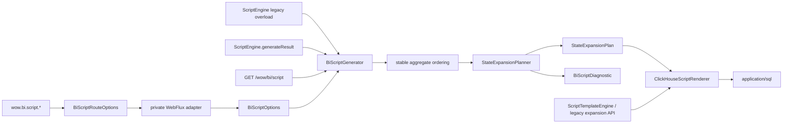
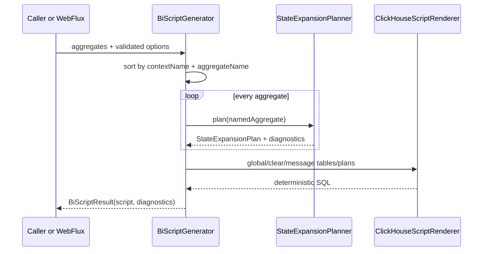

# Wow BI 模块完整重构设计

## 1. 目标与完成标准

本次重构把 `wow-bi` 从“反射遍历、展开决策、SQL 拼接混在一起”的实现，演进为边界明确、
可配置、可诊断、输出确定的 ClickHouse BI 脚本生成器。

完成标准：

- `ScriptEngine.generate(Set<NamedAggregate>, String, String): String` 保持源码与 JVM 签名兼容。
- `ScriptTemplateEngine` 现有常量和 `render*` 方法保持兼容。
- `/wow/bi/script` 继续是无参数的 `GET`，返回 `200 application/sql` 和字符串响应体。
- 新增结构化 options/result/diagnostics API，并可由 Spring Boot 的 `wow.bi.script.*` 配置驱动。
- 状态展开先生成不可变 plan，再由 ClickHouse renderer 生成 SQL。
- 同一组聚合无论 `Set` 插入顺序如何，都生成字节级稳定的脚本。
- 修复扩展视图缺少 `space_id`、`Byte`/`Short` 无符号映射、metadata `version` 类型不一致。
- 深度截断、对象 Map 降级和不支持类型不再静默发生。
- `wow-bi`、WebFlux、starter、OpenAPI、文档构建的相关验证全部通过。

## 2. 范围与非目标

### 2.1 本次范围

- `wow-bi` 的配置、编排、状态展开 plan、ClickHouse 渲染、诊断和兼容 facade。
- `wow-webflux` 的 BI handler/factory options 构造路径。
- `wow-spring-boot-starter` 的配置绑定和 feature dependency。
- BI 文档、黄金 SQL、WebFlux/OpenAPI 快照及相关测试。

### 2.2 非目标

- 不实现运行时 ETL 或 ClickHouse 客户端；模块仍只生成部署脚本。
- 不抽象多数据仓库方言；本轮 renderer 明确面向 ClickHouse。
- 不改变 command/state/state_last 的消息业务语义。
- 不新增 diagnostics HTTP 响应；需要诊断的调用方使用 Kotlin result API。
- 不让普通 `check` 强依赖外部 ClickHouse。
- 不在本次移除历史上公开的 expansion builder/column 类型；它们转为兼容层，后续主版本再清理。

## 3. 架构



### 3.1 组件职责

| 组件 | 单一职责 |
| --- | --- |
| `BiScriptOptions` | 生成脚本所需的部署参数和展开策略；负责 fail-fast 校验。 |
| `BiScriptGenerator` | 稳定排序、调用 planner、组织脚本 section、汇总 diagnostics。 |
| `BiTableNaming` | topic、table、view 的统一命名和合法性检查。 |
| `BiScriptRouteOptions` | WebFlux 自有的 nullable 配置边界，不把 BI domain 类型泄漏进 WebFlux ABI。 |
| `StateExpansionPlanner` | 从聚合 state 元数据生成不可变展开 plan；决定列、子 view 和诊断。 |
| `StateExpansionPlan` | 与渲染生命周期解耦的只读 view/column 计划。 |
| `ClickHouseScriptRenderer` | 负责 ClickHouse DDL、JSON 提取表达式和 plan 渲染。 |
| `ScriptEngine` | 公开兼容 facade；旧 overload 委托新生成器。 |
| `ScriptTemplateEngine` | 保留现有公开 API，内部委托 renderer。 |
| 历史 expansion builder | 只服务兼容调用，不再进入新的 `ScriptEngine` 主链。 |

### 3.2 主数据流



## 4. API 与兼容策略

### 4.1 新 API

```kotlin
data class BiScriptOptions(
    val database: String = "bi_db",
    val consumerDatabase: String = "bi_db_consumer",
    val cluster: String = "{cluster}",
    val installation: String = "{installation}",
    val shard: String = "{shard}",
    val replica: String = "{replica}",
    val timezone: String = "Asia/Shanghai",
    val kafkaBootstrapServers: String = "localhost:9093",
    val topicPrefix: String = Wow.WOW_PREFIX,
    val maxExpansionDepth: Int = 5,
    val unsupportedTypeStrategy: UnsupportedTypeStrategy = UnsupportedTypeStrategy.FAIL,
    val objectMapStrategy: ObjectMapStrategy = ObjectMapStrategy.STRING_VALUE_WITH_DIAGNOSTIC,
)

data class BiScriptResult(
    val script: String,
    val diagnostics: List<BiScriptDiagnostic>,
)

data class BiScriptDiagnostic(
    val code: BiScriptDiagnosticCode,
    val severity: Severity,
    val aggregate: String,
    val path: String,
    val message: String,
)
```

诊断 code 至少包括：

- `OBJECT_MAP_FALLBACK`
- `UNSUPPORTED_TYPE_FALLBACK`
- `MAX_DEPTH_REACHED`

### 4.2 旧入口

以下契约保持：

```kotlin
ScriptEngine.generate(namedAggregates, kafkaBootstrapServers, topicPrefix): String
ScriptTemplateEngine.renderGlobal()
ScriptTemplateEngine.renderClear(namedAggregate, expansionTables)
ScriptTemplateEngine.renderCommand(namedAggregate, kafkaBootstrapServers, topicPrefix)
ScriptTemplateEngine.renderStateEvent(namedAggregate, kafkaBootstrapServers, topicPrefix)
ScriptTemplateEngine.renderStateLast(namedAggregate)
```

旧 `ScriptEngine.generate` 保留历史上允许空 Kafka/topic 字符串的行为；新 options API 执行严格校验。
这样旧二进制/源码调用不会因新校验意外失败，新调用则获得更清晰的配置错误。

历史 `StateExpansionScriptGenerator(Column, SqlBuilder)`、`SqlBuilder` 和 `Column` 类型不删除；
新主链不再依赖它们，并在文档中标注为兼容 API。避免在 8.x 中制造二进制破坏。

## 5. 展开规则与诊断

| 输入 | 默认规划 |
| --- | --- |
| 简单值 / enum | 当前 view 中的 ClickHouse 简单列。 |
| `Collection<Simple>` / array | 当前 view 中的 `Array(Type)`。 |
| 普通嵌套对象 | 扁平到当前 view，列名使用 `parent__child`。 |
| `Collection<Object>` | 建立子 view，使用 `arrayJoin` 展开。 |
| `Map<String, Simple>` | `Map(String, Type)`。 |
| `Map<String, Object>` | 默认 `Map(String, String)` 并生成 `OBJECT_MAP_FALLBACK` warning；严格策略抛异常。 |
| 超过最大深度 | 把截断节点保留为原始 JSON String，停止继续递归并生成 `MAX_DEPTH_REACHED` warning。 |
| 不支持平台类型 | 严格策略抛出带聚合、path、type 的异常；兼容策略降级为 String 并诊断。 |

普通嵌套对象必须把后代列直接加入同一 view，不能通过“生成同名 view 后再去重”恢复；
否则 `distinctBy(targetTableName)` 会丢失后代列。集合对象才创建独立子 view。

planner 对每个 view 使用两阶段构建：先完整收集所有同表嵌套列，再基于最终列集合建立集合子 view。
不能在遍历第一个嵌套分支时立即固化其集合子 view，否则该子 view 会漏掉后续 sibling 分支新增的继承列。

`maxExpansionDepth` 不计算 root state；`1` 表示展开第一层属性，第二层复杂对象作为原始 JSON String 保留。
diagnostic 的 aggregate 使用稳定的 `contextName.aggregateName`，不能依赖实现类 `toString()`。

## 6. 正确性修复

### 6.1 metadata 单一来源

扩展 view 的 metadata schema 由 renderer 的单一列表生成，包含：

`id`、`aggregate_id`、`tenant_id`、`owner_id`、`space_id`、`command_id`、`request_id`、
`version`、`first_operator`、`first_event_time`、`create_time`、`tags`、`deleted`。

`space_id` 当前存在于 state/state_last 表但缺失于扩展 view，本次补为 `__space_id`。
`version` 与源表统一为 `UInt32`。

### 6.2 JVM 到 ClickHouse 类型

- `Byte` / `java.lang.Byte`：`Int8`
- `Short` / `java.lang.Short`：`Int16`
- `Char` / `java.lang.Character`：`String`
- 其他既有映射除有独立测试证明外不改变。

这是正确性变化：已有 view 需要通过重新执行 clear/create 脚本迁移；文档必须显式说明。

### 6.3 确定性

- 聚合按 `(contextName, aggregateName)` 排序后再规划和渲染。
- planner 按 property name 排序，并保证 view、diagnostics 的插入顺序稳定。
- clear 与 create 必须复用同一份 plan 顺序。

### 6.4 SQL 配置安全

- database、table、view 和 alias 统一通过 ClickHouse identifier quoting 渲染。
- `maxExpansionDepth >= 1`，其余必填字符串不得为空。
- cluster、timezone、Kafka、topic、replication path、replica 和 JSON key 统一通过 string literal quoting 渲染。
- identifier 与 string literal 中的引号、反斜杠统一转义；拒绝 NUL 和控制字符。

## 7. WebFlux 与 Spring Boot

### 7.1 WebFlux API

新增 WebFlux 自有的 `BiScriptRouteOptions` 构造路径，同时保留 handler/factory 原有 `(String, String)`
JVM 构造器和默认构造方式。route options 的字段使用 nullable 表示“未覆盖”，由 WebFlux 私有 mapper
基于 `BiScriptOptions()` 解析并校验；`BiScriptOptions` 不出现在 WebFlux 的 public/protected ABI 中。
因此 `wow-webflux` 继续使用 `implementation(project(":wow-bi"))`。

新 route-options 路径使用 result API 生成脚本，并记录 warning diagnostics；HTTP 响应仍只返回 SQL。
旧字符串构造器继续调用旧 `ScriptEngine.generate(..., String, String)`，保留空字符串等历史行为。

### 7.2 Spring 配置

新增：

```properties
wow.bi.script.database=bi_db
wow.bi.script.consumer-database=bi_db_consumer
wow.bi.script.cluster={cluster}
wow.bi.script.timezone=Asia/Shanghai
wow.bi.script.kafka-bootstrap-servers=localhost:9093
wow.bi.script.topic-prefix=wow.
wow.bi.script.max-expansion-depth=5
wow.bi.script.unsupported-type-strategy=FAIL
wow.bi.script.object-map-strategy=STRING_VALUE_WITH_DIAGNOSTIC
```

BI 专用的 Kafka servers/topic prefix 使用 nullable override：

1. 配置了 `wow.bi.script.kafka-*` 时，以 BI 配置为准；
2. 未配置时继承现有 `KafkaProperties`；
3. 两者都不存在时使用 `BiScriptOptions` 默认值。

starter 将 `BiScriptProperties` 转换为 `BiScriptRouteOptions`，不直接引用 `wow-bi`，因此无需新增
`:wow-bi` 依赖。`wow-openapi` 未使用 BI 类型，其冗余 `:wow-bi` 依赖移除并用编译/快照验证。

## 8. 测试策略

### 8.1 characterization

- 旧 `ScriptEngine` 默认与自定义参数输出。
- 旧 expansion API 的黄金 SQL 与 target table 顺序。
- WebFlux 的 status、content type、响应脚本关键内容。
- OpenAPI `/wow/bi/script` 快照不变。

### 8.2 planner 单元测试

- 普通嵌套对象留在根 view；多层后代列不丢失。
- nested collection 子 view 继承所有 sibling nested object 最终加入的根列。
- 简单集合内联，对象集合和嵌套集合拆分 view。
- 对象 Map 默认 warning 与 strict fail。
- unsupported type、深度限制和循环模型的稳定 diagnostics。
- metadata 包含 `space_id`，view/diagnostics 顺序稳定。

### 8.3 renderer 与 options

- options 默认值、严格校验、字面量转义和非法标识符。
- 相同 plan 重复渲染字节级一致。
- `Byte=Int8`、`Short=Int16`、`Char=String`、`version=UInt32`。
- 自定义 database、cluster、timezone、Kafka servers 和 topic prefix 生效。

### 8.4 Spring 与文档

- 配置绑定及 BI override > KafkaProperties > default 的优先级。
- starter feature compile classpath 能解析 `wow-bi`。
- 中英文 BI 文档和 VitePress 构建。

## 9. 实施与回滚

按以下可独立验证的顺序实施：

1. characterization tests。
2. options/result/diagnostics 和命名。
3. planner 与嵌套正确性。
4. renderer 与主编排器。
5. metadata/type/determinism 修复。
6. WebFlux/starter/OpenAPI dependency 接线。
7. 中英文文档和全量验证。

每个行为变化先制造目标明确的失败测试，再实现最小代码使其通过。

回滚边界：

- `ScriptEngine` facade 可单独切回旧模板主链。
- WebFlux 仍保留旧字符串构造器，可独立回滚 options 接线。
- 正确性变化集中在黄金 SQL，可按 metadata/type 两个提交分别回滚。
- Spring 配置是新增项；不配置时维持现有 KafkaProperties/default 行为。

## 10. 风险

| 风险 | 缓解 |
| --- | --- |
| SQL 文本变化影响部署 diff | 黄金文件逐项审查，文档列出迁移字段。 |
| `space_id`/signed type 修复要求重建 view | clear/create 流程与升级说明同步更新。 |
| 新 WebFlux 构造器改变模块 ABI 依赖 | 公开 `BiScriptRouteOptions`，BI domain options 仅在 private mapper 中出现。 |
| 历史 public expansion 类型难以立即删除 | 保留兼容层，新主链零依赖，下一主版本再移除。 |
| 外部 ClickHouse 环境不可用 | 默认使用精确黄金/renderer 测试；真实 ClickHouse 验证保持 opt-in。 |
