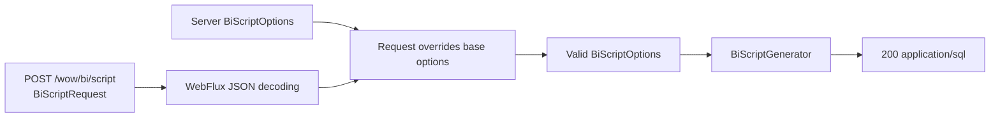

# BI Script POST Request Design

## Goal

Replace the fixed `GET /wow/bi/script` endpoint with a parameterized
`POST /wow/bi/script` endpoint. Each request may override the server's
configured `BiScriptOptions` while the BI generator remains independent of
HTTP and continues to return SQL as `application/sql`.

## Scope

This change covers the BI script HTTP contract, request-to-domain mapping,
OpenAPI description, route integration tests, and English and Chinese
documentation. It does not change ClickHouse SQL planning or rendering, add a
second generation pipeline, retain the old GET route, or provide a compatibility
adapter for the previous HTTP contract.

## Architecture

The request contract belongs to `wow-openapi`, which already owns built-in HTTP
route contracts and is an API dependency of `wow-webflux`. `wow-webflux` owns the
mapping from the nullable request DTO to a complete `BiScriptOptions` value.
`wow-bi` remains transport-independent and receives only valid domain options.
`wow-spring-boot-starter` continues to construct the base options from
application and Kafka configuration.



The dependency direction remains:

```text
wow-bi <- wow-webflux -> wow-openapi
                  ^
                  |
      wow-spring-boot-starter
```

No HTTP request type is introduced into `wow-bi`, and the OpenAPI schema is not
duplicated as a manually maintained raw schema in `wow-webflux`.

## Request Contract

The endpoint accepts a required `application/json` request body. An empty JSON
object is valid and means that all server-side options are retained.

```http
POST /wow/bi/script HTTP/1.1
Content-Type: application/json
Accept: application/sql

{}
```

The complete request shape is:

```json
{
  "database": "analytics",
  "consumerDatabase": "analytics_consumer",
  "topology": {
    "mode": "CLUSTER",
    "cluster": {
      "name": "production",
      "installation": "primary",
      "shard": "01",
      "replica": "replica-1"
    }
  },
  "timezone": "UTC",
  "kafkaBootstrapServers": "kafka:9092",
  "topicPrefix": "analytics.",
  "maxExpansionDepth": 5,
  "unsupportedTypeStrategy": "RAW_JSON"
}
```

`BiScriptRequest` exposes nullable overrides for every current
`BiScriptOptions` property:

- `database`
- `consumerDatabase`
- `topology`
- `timezone`
- `kafkaBootstrapServers`
- `topicPrefix`
- `maxExpansionDepth`
- `unsupportedTypeStrategy`, with `FAIL` and `RAW_JSON`

The topology request contains a required `mode` whenever `topology` is present.
Supported values are `CLUSTER` and `STANDALONE`. Cluster details are represented
by a nested nullable `cluster` object with `name`, `installation`, `shard`, and
`replica` overrides.

## Override Semantics

Top-level request fields that are absent inherit their values from the base
`BiScriptOptions` created at application startup.

When `topology` is absent, the complete base topology is retained. When it is
present, `mode` is mandatory and determines the result:

- `STANDALONE` produces `ClickHouseTopology.Standalone` and rejects a non-null
  `cluster` object.
- `CLUSTER` produces `ClickHouseTopology.Cluster`. Each absent cluster field
  inherits from the base topology when the base is already Cluster. When the
  base is Standalone, absent cluster fields inherit from
  `ClickHouseTopology.Cluster()` defaults.

The merged values are passed through the existing `BiScriptOptions` and
`ClickHouseTopology.Cluster` constructors. Their current validation remains the
single source of truth for blank strings, control characters, expansion depth,
and cluster values.

## Components

### OpenAPI Request Model

`wow-openapi` defines focused request DTOs for the BI route:

- `BiScriptRequest`
- `BiScriptTopologyRequest`
- `BiScriptClusterRequest`
- `BiScriptTopologyMode`

The route contributor registers their schema through the existing typed schema
mechanism. The route method becomes POST, its JSON request body is required, and
the successful response remains SQL text.

### WebFlux Mapping

`GenerateBIScriptHandlerFunction` decodes `BiScriptRequest`, merges it over the
base options supplied by `GenerateBIScriptHandlerFunctionFactory`, constructs a
new `BiScriptGenerator` for that request, and generates from
`MetadataSearcher.localAggregates`.

The mapping is a focused pure function or mapper with no access to the request,
metadata registry, response builder, or logger. It can therefore be tested
independently from WebFlux decoding.

Diagnostic handling is unchanged: every diagnostic is logged as WARN, and only
`BiScriptResult.script` is written to the response body.

### Starter Wiring

`BiScriptProperties.toBiScriptOptions(...)` remains responsible for constructing
the base options and preserving the current application-versus-Kafka property
precedence. The global route module passes those options to the handler factory;
it does not parse or merge request payloads.

## HTTP Behavior and Errors

The old GET route is removed and no compatibility route is registered.

| Request | Result |
|---|---|
| Valid JSON body, including `{}` | `200 application/sql` with SQL text only |
| Missing body | `400` |
| Malformed JSON | `400` |
| Missing `topology.mode` when topology is present | `400` |
| `STANDALONE` with a cluster object | `400` |
| Domain-invalid option values | `400` |
| Unsupported request media type | `415` |
| `GET /wow/bi/script` | `405` when the path is served by the POST route |

Error responses use the existing WebFlux global error handling. The route does
not catch and translate domain validation errors locally because that would
create route-specific error semantics.

## OpenAPI Contract

The generated OpenAPI document describes:

- a single POST operation at `/wow/bi/script`;
- a required `application/json` request body;
- the complete typed request schema, nested topology objects, and enums;
- a `200 application/sql` string response;
- the existing common `400` response contract.

The OpenAPI snapshots are updated as an intentional breaking contract change.
No GET operation remains in the generated document.

## Testing Strategy

Implementation follows RED, GREEN, and REFACTOR cycles.

### WebFlux Unit Tests

- `{}` retains every base option.
- A partial request overrides only supplied fields.
- Partial Cluster details inherit from a Cluster base.
- Partial Cluster details use domain defaults when the base is Standalone.
- Standalone rejects cluster details.
- Missing topology mode is rejected.
- Successful responses remain `application/sql` and contain only generated SQL.
- Generated diagnostics remain WARN logs and do not enter the response body.

### Starter Route Integration Tests

- `POST /wow/bi/script` is registered and generates SQL.
- `GET /wow/bi/script` returns `405`.
- An empty object uses application and Kafka-derived base options.
- Request values override application and Kafka-derived base options.
- Missing, malformed, and invalid bodies return `400`.
- A non-JSON request returns `415`.

### OpenAPI Tests

- The contributor emits POST and no GET contract.
- The request body is required and uses the typed request schema.
- The schema includes all fields, nested topology shapes, and enums.
- The successful SQL response and common bad-request response remain present.
- Full OpenAPI and route-contract snapshots reflect the breaking contract.

### Documentation

The English and Chinese BI, configuration, and OpenAPI guides are updated. Each
language includes examples for an empty request, Standalone overrides, and
Cluster overrides. References to `GET /wow/bi/script` are removed.

## Completion Criteria

- The only BI script route is `POST /wow/bi/script`.
- The required JSON body supports every current `BiScriptOptions` field as an
  optional override.
- Override and topology inheritance rules are deterministic and covered by
  tests.
- `wow-bi` has no HTTP dependency or request DTO.
- Runtime behavior and generated OpenAPI use the same request DTO.
- Relevant WebFlux, Starter, OpenAPI, BI regression, static analysis, and
  documentation builds pass.
