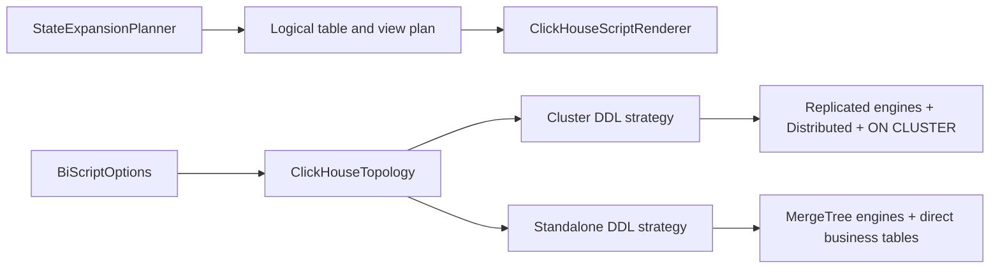
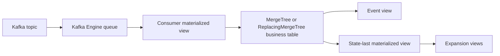

# Wow BI Standalone ClickHouse Topology Design

## 1. Goal

Add first-class standalone ClickHouse support to `wow-bi` without weakening the
existing clustered deployment model. Standalone output must describe a real
single-node topology: no `ON CLUSTER`, replicated engines, `Distributed` tables,
`_local` tables, or ZooKeeper paths.

The generator keeps one public entrypoint and one logical schema. Deployment
topology changes only the physical DDL graph.

## 2. Scope

This change covers:

- the public `BiScriptOptions` topology model;
- ClickHouse global, clear, command, state-event, state-last, and expansion DDL;
- Spring Boot configuration binding;
- WebFlux BI script delivery through `GET /wow/bi/script`;
- unit, snapshot, integration, and documentation coverage for both topologies.

It does not introduce a second generator, a compatibility adapter for the old
flat cluster fields, or a runtime database migration facility.

## 3. Domain Model

Topology is represented by a sealed model so invalid combinations cannot be
constructed in the domain API:

```kotlin
sealed interface ClickHouseTopology {
    data object Standalone : ClickHouseTopology

    data class Cluster(
        val name: String = "{cluster}",
        val installation: String = "{installation}",
        val shard: String = "{shard}",
        val replica: String = "{replica}",
    ) : ClickHouseTopology
}

data class BiScriptOptions(
    val database: String = "bi_db",
    val consumerDatabase: String = "bi_db_consumer",
    val topology: ClickHouseTopology = ClickHouseTopology.Cluster(),
    val timezone: String = "Asia/Shanghai",
    val kafkaBootstrapServers: String = "localhost:9093",
    val topicPrefix: String = "wow.",
    val maxExpansionDepth: Int = 5,
    val unsupportedTypeStrategy: UnsupportedTypeStrategy = UnsupportedTypeStrategy.RAW_JSON,
)
```

`cluster`, `installation`, `shard`, and `replica` are removed from the top level
of `BiScriptOptions`. The default remains clustered so an omitted setting cannot
silently change a production deployment to standalone.

`ClickHouseTopology.Cluster` validates all four values as non-blank and free of
control characters. `Standalone` carries no cluster state.

## 4. Logical and Physical Boundaries

`StateExpansionPlanner` remains topology-independent. It produces logical
source and target table names, column plans, diagnostics, and recovery
coordinates. `BiTableNaming.toDistributedTableName` becomes `toTableName`
because the logical business table is not necessarily a `Distributed` table.

`ClickHouseScriptRenderer` delegates physical table creation to an internal
topology-specific DDL strategy. The strategy owns:

- the optional DDL scope clause;
- the physical storage engine;
- whether a local physical table and distributed facade are required;
- the topology-specific drop graph.

Views and materialized views always reference the logical business table name.
This keeps Kafka ingestion, latest-state derivation, event projection, and state
expansion independent of the selected physical topology.



## 5. Statement Graph

Both modes retain the same databases, Kafka queue tables, consumer materialized
views, event views, state-last materialized views, and expansion views.

| DDL role | Cluster | Standalone |
| --- | --- | --- |
| DDL scope | `ON CLUSTER` | none |
| command storage | `_local` `ReplicatedMergeTree` plus `Distributed` | business table using `MergeTree` |
| state-event storage | `_local` `ReplicatedReplacingMergeTree` plus `Distributed` | business table using `ReplacingMergeTree` |
| state-last storage | `_local` `ReplicatedReplacingMergeTree` plus `Distributed` | business table using `ReplacingMergeTree` |
| Kafka queue | retained | retained |
| consumer materialized view target | distributed business table | physical business table |
| event and expansion view source | distributed business table | physical business table |
| ZooKeeper path | required | absent |

Standalone data flow is:



Expected statement counts for one aggregate are:

| Section | Cluster | Standalone |
| --- | ---: | ---: |
| command | 4 | 3 |
| state event | 5 | 4 |
| state last | 3 | 2 |
| clear, excluding expansion views | 12 | 9 |

The standalone clear graph drops only objects that standalone generation can
create. It does not emit defensive drops for clustered `_local` tables.

## 6. Spring Boot Configuration

Spring binding uses a conventional nested properties DTO and one adapter to the
sealed domain model. The binder does not instantiate the sealed interface
directly.

Standalone configuration:

```yaml
wow:
  bi:
    script:
      topology:
        mode: STANDALONE
      database: bi_db
      consumer-database: bi_db_consumer
```

Cluster configuration:

```yaml
wow:
  bi:
    script:
      topology:
        mode: CLUSTER
        cluster:
          name: production
          installation: clickhouse
          shard: '{shard}'
          replica: '{replica}'
```

The mode defaults to `CLUSTER`. Cluster fields use the domain placeholders when
omitted in cluster mode. Configuring any `topology.cluster.*` value while mode is
`STANDALONE` fails application startup rather than silently ignoring the value.
Unknown modes fail during Spring binding.

The old flat keys `wow.bi.script.cluster`, `installation`, `shard`, and
`replica` are removed. No compatibility aliases or fallback readers are added.

## 7. Error Handling

Topology configuration errors are generation preconditions, not mapping
diagnostics. They fail while constructing `BiScriptOptions` or adapting Spring
properties and never produce partial SQL.

The renderer performs an exhaustive `when` over the sealed topology. It has no
unknown-topology fallback and does not downgrade topology errors to warnings.
Existing unsupported-property diagnostics remain unchanged.

## 8. Test Strategy

Implementation follows red-green-refactor. Each production behavior starts with
a focused failing test.

### 8.1 Domain and API tests

- assert the default topology is `Cluster`;
- assert `Standalone` has no cluster properties;
- reject blank and control-character cluster values;
- include `ClickHouseTopology` in the public API contract;
- prove the removed top-level fields are absent.

### 8.2 Renderer contract tests

- prove standalone output contains none of `ON CLUSTER`, `Replicated`,
  `Distributed`, `_local`, or a ZooKeeper path;
- prove standalone command, state-event, and state-last tables use the intended
  `MergeTree` engines and version columns;
- prove every materialized view and regular view uses the logical business
  table;
- assert statement order, counts, immutable statement lists, and exact drop
  graphs for both topologies;
- retain all clustered rendering assertions.

### 8.3 Full-script snapshots

- retain `expected_bi_script.sql` as the clustered contract;
- add `expected_bi_standalone_script.sql` as the standalone contract;
- generate both through `BiScriptGenerator` so no parallel generation path can
  emerge.

### 8.4 Spring and WebFlux tests

- bind nested cluster and standalone properties;
- fail startup for standalone mode combined with cluster properties;
- prove removed flat keys do not configure the new model;
- verify `/wow/bi/script` returns standalone SQL when configured accordingly.

### 8.5 ClickHouse integration tests

- retain the clustered ClickHouse 24.8 test container with its cluster config;
- execute the complete standalone script against a vanilla ClickHouse 24.8
  container with no cluster configuration mounted;
- insert and query data through command, state, state-last, event, and expansion
  paths;
- query ClickHouse system tables to prove generated `_local` and `Distributed`
  tables do not exist in standalone mode.

## 9. Documentation

The English and Chinese BI guides document both current topologies and their SQL
shape. The configuration references use only the nested topology properties.
Public API counts and examples include `ClickHouseTopology`.

Documentation describes the current architecture only. It does not add a legacy
configuration compatibility section or migration adapter guidance.

## 10. Verification

The implementation is complete only after these commands pass:

```bash
./gradlew :wow-bi:clean :wow-bi:test :wow-bi:integrationTest --rerun-tasks
./gradlew --no-daemon :wow-bi:check :wow-webflux:check \
  :wow-spring-boot-starter:check :wow-openapi:check detekt --rerun-tasks
cd documentation && pnpm docs:build
```

Additional static gates:

- `git diff --check`;
- scans for removed top-level option fields and flat Spring configuration keys;
- standalone script scans for forbidden clustered constructs;
- clustered script scans for its required replicated and distributed graph.

## 11. Impact and Rollback

This is an intentional public API and configuration break. Kotlin callers must
construct `ClickHouseTopology.Cluster` or `ClickHouseTopology.Standalone`, and
Spring users must use the nested topology properties. No source or configuration
compatibility layer is retained.

Rollback is a code rollback to the preceding generator version. Generated source
tables contain no automatic data transformation in this change; operators must
apply the DDL matching the generator version they run.
