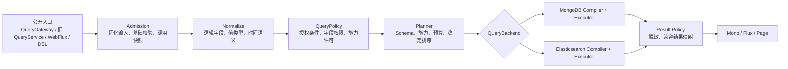
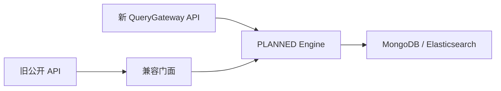

# Query 服务架构升级设计

> 状态：已确认
>
> 日期：2026-08-11
>
> 审查基线：`53dc6d9c860379aa799c46c62ee3d3fe7aee4548`
>
> 范围：`wow-api`、`wow-query`、`wow-mongo`、`wow-elasticsearch`、`wow-spring`、`wow-spring-boot-starter`、`wow-webflux` 及相关测试模块

## 1. 决策摘要

本次升级选择**直接切换到单一 `PLANNED` 执行引擎**，不在运行时维护 `LEGACY` 或 `SHADOW` 双轨。Wow 8.x 新增稳定的 `QueryGateway` 公开 API；现有 `QueryService`、Spring Bean、HTTP/JSON/OpenAPI 契约继续保留，但实现全部改为通过 `QueryGateway` 公共接口委托新引擎的兼容门面。旧 Query Filter 扩展 API 直接删除，不保留兼容 hook 或运行时检测；开发者在重新编译时通过 IDE/编译错误定位迁移点。下一主版本删除其余旧 API 与仅用于迁移的兼容能力。

查询能力采用两层模型：

- `PortableExpression` 定义 MongoDB、Elasticsearch 等后端都必须满足的可移植语义，并以 MongoDB 语义作为共享 TCK 的参考基线；
- `CapabilityExpression` 显式承载 `FullText`、`Native`、未来 `Geo` 等后端能力，后端不支持时必须拒绝，不能静默降级。

所有框架托管入口统一经过 Admission、Normalize、Policy、Plan、Execute、Result Policy 六个阶段。授权条件使用带来源标记的强制 `QueryPolicy` 注入，不能被调用方移除；结果脱敏由独立的 `ResultPolicy` 承担。存储后端只编译并执行已验证计划，不解析外部 DTO，也不自行拼接授权条件。

第一阶段不拆 Gradle 模块、不修改 KSP、不实现聚合分析 API、不自动迁移索引。默认查询 Schema 在启动时由聚合状态类型的 Jackson 序列化模型推导，并只提供一个 `QuerySchemaCustomizer` 扩展点。

## 2. 背景与根因

当前查询抽象已经覆盖单条、列表、分页、计数等基础操作，但契约、执行和后端语义仍混合在一起：

- `QueryService` 直接暴露七种执行方法，调用形态与执行策略绑定（`wow-query/src/main/kotlin/me/ahoo/wow/query/QueryService.kt:33`）；
- `QueryContext` 以可变 attributes 和未检查类型转换承载调用状态，难以保证订阅隔离与扩展安全（`wow-query/src/main/kotlin/me/ahoo/wow/query/filter/QueryContext.kt:31`）；
- `QueryHandler` 与尾部 Filter 同时承担过滤链组织和实际执行，授权、兼容与后端执行边界不清晰（`wow-query/src/main/kotlin/me/ahoo/wow/query/filter/QueryHandler.kt:40`、`wow-query/src/main/kotlin/me/ahoo/wow/query/snapshot/filter/SnapshotQueryFilter.kt:30`）；
- Spring 注册器将每个聚合的 Bean 直接绑定到具体 `QueryService`，缺少统一治理入口（`wow-spring/src/main/kotlin/me/ahoo/wow/spring/query/SnapshotQueryServiceRegistrar.kt:48`、`wow-spring/src/main/kotlin/me/ahoo/wow/spring/query/EventStreamQueryServiceRegistrar.kt:35`）；
- `NoOp` 服务会把后端未就绪解释为空结果或零，掩盖部署和配置错误（`wow-query/src/main/kotlin/me/ahoo/wow/query/snapshot/SnapshotQueryService.kt:31`）；
- EventStream 工厂使用普通可变 Map，而 Snapshot 工厂采用并发结构，生命周期与并发假设不一致（`wow-query/src/main/kotlin/me/ahoo/wow/query/event/EventStreamQueryServiceFactory.kt:22`）；
- MongoDB 与 Elasticsearch 各自直接转换 `Condition`，缺少共同的标准化与计划契约（`wow-mongo/src/main/kotlin/me/ahoo/wow/mongo/query/AbstractMongoConditionConverter.kt`、`wow-elasticsearch/src/main/kotlin/me/ahoo/wow/elasticsearch/query/AbstractElasticsearchConditionConverter.kt`）；
- `ListQuery.limit=0` 在公开契约中表示不限制，但 Elasticsearch 执行路径存在 `10_000` 上限，形成跨后端可观察差异（`wow-api/src/main/kotlin/me/ahoo/wow/api/query/ListQuery.kt:24`、`wow-elasticsearch/src/main/kotlin/me/ahoo/wow/elasticsearch/query/ListQueries.kt:16`）；
- 公开分页模型没有在统一边界验证页码、页大小和深分页预算（`wow-api/src/main/kotlin/me/ahoo/wow/api/query/Queryable.kt:69`）。

根因不是单个转换器缺陷，而是缺少一个在后端之前完成**输入固化、语义标准化、权限合成、能力协商和预算校验**的统一规划边界。继续在现有 Filter 或各后端内打补丁，会扩大语义漂移和兼容负担。

## 3. 目标与非目标

### 3.1 目标

1. 为 Snapshot 和 EventStream 的单条、列表、分页、计数查询建立统一执行管线。
2. 让可移植语义一致，同时通过显式能力模型保留存储后端特性。
3. 将授权、字段可见性、成本预算和结果脱敏变成不可绕过的框架阶段。
4. 在 Wow 8.x 保持旧查询调用 API、Spring Bean、HTTP/JSON/OpenAPI 契约兼容，并给出下一主版本的明确删除路径；Query Filter 扩展 API 是经过批准的破坏性删除例外。
5. 消除静默空结果、静默截断、近似结果冒充精确结果和未声明字段直通等错误模式。
6. 用共享契约测试和真实后端集成测试证明 MongoDB、Elasticsearch 的共同语义与能力差异。

### 3.2 非目标

- 第一阶段不实现 `AnalyticsQueryGateway` 或聚合分析查询；只保证内部计划模型未来可增加独立分析入口；
- 不拆分或新增 Gradle 模块；
- 不修改 KSP 生成协议，也不要求 `wow-query` 依赖完整 `wow-schema`；
- 不新增公开游标、PIT 或 `search_after` API；
- 不保留运行时 `LEGACY`、`SHADOW` 引擎或双读比对；
- 不为旧 Query Filter 提供兼容 hook、适配器或运行时 Bean 检测；
- 不自动执行 Elasticsearch 索引迁移、alias 切换或破坏性数据变更；
- 不支持跨聚合 Join；
- 不把全文检索、Native DSL 等后端能力伪装成可移植语义。

## 4. 总体架构



所有框架管理的查询入口都必须进入同一个 `QueryGateway`。旧 `QueryService` 不再拥有独立执行器，而是通过注入的 `QueryGateway` 公共接口，把旧 DTO 降低为新请求并映射回旧结果类型。兼容门面不能依赖 `DefaultQueryGateway`、Planner 或 Backend 实现。Raw backend API 仅供基础设施内部使用，不能成为绕过 Policy 和 Planner 的应用入口。

职责边界如下：

| 层 | 职责 | 明确不负责 |
| --- | --- | --- |
| Admission | 每次订阅创建独立调用；固化 authority、Clock、deadline、budget；防御性复制输入；结构预算校验 | 解释后端语法 |
| Normalize | 将外部条件和值转换为不可变逻辑模型；统一时间和值语义 | 拼接授权、访问物理字段 |
| QueryPolicy | 注入不可移除的强制条件；限制字段、能力与资源范围 | 编译 MongoDB/ES 查询 |
| Planner | 根据 Schema 和后端能力生成可执行计划；加入稳定排序；拒绝超预算请求 | 执行网络 I/O |
| QueryBackend | 编译和执行已验证计划；报告 readiness 与 capability | 解析 wire DTO、静默改写语义 |
| ResultPolicy | 结果脱敏、审计和兼容结果映射 | 放宽查询权限 |

### 4.1 模块边界

- `wow-api`：稳定公开请求、结果、表达式和错误码等纯数据契约；
- `wow-query`：Reactive `QueryGateway` 公开契约及其默认实现、兼容门面、Admission、Normalizer、Policy、Planner 与生命周期管理；
- `wow-mongo`：MongoDB 计划编译器、执行器、readiness 检查；
- `wow-elasticsearch`：Elasticsearch 计划编译器、执行器、mapping/readiness 检查；
- `wow-spring*`：Bean 装配、旧 Bean 名称与泛型注入兼容；
- `wow-webflux`：保持现有 HTTP wire 契约，将请求交给统一 Gateway。

由于后端位于独立 Gradle 模块，跨模块使用的最小 `QueryPlan`/`QueryBackend` 契约不能使用 Kotlin `internal`。它们放在 `me.ahoo.wow.query.backend`，标记 `@ExperimentalQueryBackendApi` 或 `@InternalQueryApi`，仅作为框架基础设施 SPI；应用侧不获得稳定兼容承诺。Normalizer、Planner 实现及中间构建器仍保持 Kotlin `internal`。`QueryBackend` 是长期端口，但导出的计划数据结构保持最小、不可变且不含存储驱动类型。

## 5. 公开查询模型

### 5.1 QueryGateway

Wow 8.x 新增稳定公开 API，采用统一 Gateway 与操作专用请求，避免重新复制多套客户端，也避免引入难以类型化的万能消息总线。

建议契约形态：

```kotlin
interface QueryGateway {
    fun <R : Any> single(request: SingleQueryRequest<R>): Mono<R>
    fun <R : Any> list(request: ListQueryRequest<R>): Flux<R>
    fun <R : Any> page(request: PageQueryRequest<R>): Mono<QueryPage<R>>
    fun count(request: CountQueryRequest): Mono<Long>
}
```

`SingleQueryRequest<R>`、`ListQueryRequest<R>`、`PageQueryRequest<R>`、`CountQueryRequest` 显式包含：

- 逻辑 target（聚合、tenant、Snapshot/EventStream 文档种类）；
- result descriptor/shape；
- `PortableExpression` 或显式 `CapabilityExpression`；
- 排序、分页、deadline 和预算提示等与操作相关的参数。

请求对象不暴露 BSON、Elasticsearch DSL、物理索引字段或驱动类型。每次 Reactor subscription 创建独立 invocation，不在请求或 Context 中复用可变状态。

`QueryPage<R>` 在新 API 中明确携带 items、精确 total 与一致性元数据。旧分页 API继续映射为 `PagedList<R>`；如果后端不能在同一逻辑命令内产生精确结果，必须返回错误，不得用近似 total 或两次无一致性保证的独立查询冒充。

### 5.2 表达式分层

`PortableExpression` 第一阶段覆盖现有共同语义：

- 逻辑组合：`AND`、`OR`、`NOT`；
- 相等与集合：`EQ`、`NE`、`IN`、`NOT_IN`、`ALL_IN`；
- 比较与区间：`GT`、`GTE`、`LT`、`LTE`、`BETWEEN`；
- 空值与存在性；
- 精确字符串 contains/prefix/suffix；
- 在 Schema 明确允许时的 `ELEM_MATCH`；
- 逻辑字段排序、offset/page 与 limit。

`CapabilityExpression` 必须显式声明能力标识及后端约束：

- `FullText`：由后端定义相关度、分析器等搜索语义；
- `Native`：受配置、权限、字段白名单与复杂度预算约束的原生查询；
- 未来 `Geo`、向量检索等能力。

Capability 不可用时返回 `UNSUPPORTED_CAPABILITY`。禁止把 FullText 自动降级为字符串 contains，也禁止忽略 Native 片段。

现有 `MATCH` 在兼容门面中降低为 `FullText` capability；现有 RAW/原生条件只有在相应 backend/native capability 显式启用且策略允许时才接受。

### 5.3 不可变值模型

Admission 对 List、Map、byte array 等可变输入只遍历一次并防御性复制，随后转换为内部 `QueryValue`：标量、时间、枚举、列表、对象等均具有明确类型。内部模型不得继续传播 `Any`、BSON value、Elasticsearch JSON 节点或物理字段名。

时间相关值在每次订阅开始时使用同一个冻结 `Clock` 解析。相对时间、deadline 和策略判断不得在同一查询的不同阶段重新读取系统时间。

## 6. Query Schema

### 6.1 默认来源

第一阶段采用单一、低配置的 Schema 来源：启动时从 `AggregateMetadata.state.aggregateType` 获取聚合状态类型，并使用 Wow 当前 Jackson 序列化配置构建逻辑查询 Schema。固定的 Snapshot/EventStream 系统字段由框架内置。

这一设计与现有元数据和 Jackson 能力对齐：聚合状态类型由 `StateAggregateMetadata` 暴露（`wow-core/src/main/kotlin/me/ahoo/wow/modeling/metadata/StateAggregateMetadata.kt:38`）；现有 schema 工具已经证明 Jackson、Kotlin 和 Jakarta 模型可以共同推导字段结构（`wow-schema/src/main/kotlin/me/ahoo/wow/schema/SchemaGeneratorBuilder.kt:52`）。第一阶段只复用同类运行时 introspection 思路，不增加 `wow-query -> wow-schema` 的强耦合。

推导必须尊重 `@JsonProperty`、`@JsonIgnore`、命名策略、nullable、collection、nested object 和 enum 等实际序列化规则。默认规则保持保守：

| 字段类型 | 默认允许的查询能力 |
| --- | --- |
| enum / boolean | equality、membership |
| number / time | equality、range、sort |
| String | exact equality、literal contains/prefix/suffix；后端必须证明绑定到 exact 语义字段 |
| scalar collection | membership、`ALL_IN` |
| nested object | 已声明子字段 |
| object collection | 默认禁用 `ELEM_MATCH`，需显式定制 |
| system fields | 使用框架固定定义 |

默认不推断 FullText，不从 Elasticsearch mapping 反推领域查询契约。

### 6.2 唯一扩展点

只提供一个 `QuerySchemaCustomizer`，用于：

- 标记 FullText 字段与所需 capability；
- 启用 object collection 的 `ELEM_MATCH`/nested 语义；
- 注册 `DynamicDocument` 或外部结果模型；
- 指定 Elasticsearch exact/search/sort 等物理绑定；
- 设置 collation、最大字符串长度、数值精度等约束。

MongoDB 默认物理路径与逻辑 Jackson 路径一致。Wow 管理的 Elasticsearch 索引遵循固定 mapping 约定；已有或自定义索引在启动 readiness 阶段验证 mapping 是否满足 Schema。Mapping 是验证对象和物理绑定，不是 Schema 真相来源。验证失败返回 `BACKEND_NOT_READY` 并要求显式迁移，不自动改索引。

### 6.3 旧 API 的未知字段

新 `QueryGateway` 只接受 Schema 已声明字段。8.x 兼容门面对于旧请求中的未知字段，可在配置和策略允许时降低为受控的 `LegacyBackendField` capability：

- 必须经过字段策略、语法和预算检查；
- 发出 deprecation warning 与可观测 metric；
- 不提供跨后端可移植保证；
- 下一主版本与旧 API 一同删除。

这使旧用户获得过渡窗口，但不会污染新公开模型或长期语义。

## 7. Policy、安全与旧 Filter 迁移

旧 Query Filter 扩展 API 直接删除。框架不保留兼容 hook、Filter adapter 或运行时 Bean 扫描，也不会静默忽略旧 Filter。依赖旧类型的源码在重新编译时由 IDE/编译器报告缺失 import、接口实现或 Bean 声明，开发者按迁移文档将职责迁移到明确端口：

| 旧 Filter 职责 | 新边界 |
| --- | --- |
| 授权、tenant/aggregate 范围、强制条件 | `QueryPolicy` |
| 字段权限、能力许可、预算上限 | `QueryPolicy` |
| 结果字段脱敏、结果侧审计信息 | `ResultPolicy` |
| 后端特有条件或字段绑定 | `CapabilityExpression`、`QuerySchemaCustomizer` 或 Backend compiler |
| 通用请求/结果改写、任意前后置拦截 | 不提供一比一替代；拆分到上述有类型的职责边界 |

这是 8.x 兼容承诺中的显式破坏性例外。使用旧 Filter 的预编译应用不保证原地二进制升级，必须重新编译并完成迁移；框架不以运行时探测补偿这一点。迁移文档必须提供中英文版本、职责对照、前后代码示例以及授权 Filter 的安全迁移检查清单。

用户表达式和策略表达式在内部保持不同 provenance，直到 Planner 完成审计和合成。最终计划虽然通常使用 `AND(user, mandatory)`，但审计、错误定位和优化都不能丢失其来源。

Policy 读取的是每次订阅固化的 authority，不依赖共享可变 `QueryContext.attributes`。Native、FullText 和 `LegacyBackendField` 默认拒绝，只有后端支持、配置启用且 Policy 明确授权时才可执行。

## 8. 规划与后端执行

### 8.1 计划不变量

Planner 输出给后端的计划必须已经满足：

- target、document kind 和结果 shape 已解析；
- 所有逻辑字段存在于 Query Schema，或被标记为受控兼容 capability；
- 用户条件与 mandatory policy 条件已合成且 provenance 可审计；
- 后端声明支持全部 portable operator 和 capability；
- page、limit、expression depth、collection cardinality、deadline 等预算已校验；
- bounded list/page 具有确定性排序，必要时自动追加 identity tie-breaker；
- 计划不可变，不包含 wire DTO、Spring Context 或存储驱动对象。

后端编译器只能把计划绑定为物理查询，不能补做授权，也不能通过忽略表达式来“兼容”。

`single`、`page`、`count` 必须在请求、计划和结果形态完整验证后原子发射结果；`list` 才允许按背压逐项流式发射。任何验证失败都发生在后端执行前，后端执行中的流式失败则使用第 9 节的完整性错误语义。

### 8.2 `limit=0` 与流生命周期

保留当前公开契约中 `limit=0` 表示不限制的语义：

- MongoDB 使用 reactive cursor 按背压读取；
- Elasticsearch 在内部使用 PIT + `search_after` 循环；
- 对外仍返回 `Flux<R>`，不公开 cursor/PIT；
- complete、error、cancel 三种终止路径都必须关闭 cursor/PIT；
- 达到 deadline 或预算时以终止错误结束，绝不返回看似成功的截断结果。

bounded list 自动加入稳定 identity tie-breaker。超过后端深分页能力或预算的请求在执行前拒绝，不在后端运行后再截断。

### 8.3 分页一致性

`PageQueryRequest` 的 items 与 total 由同一后端逻辑命令产生：

- MongoDB 使用单一 aggregation pipeline/facet；
- Elasticsearch 使用一次 search 同时返回 hits 与精确 total。

如果 exact total 或一致性要求无法满足，返回明确错误。旧 `PagedList` 只做结果形态映射，不降低这一保证。

### 8.4 Snapshot 与 EventStream

第一阶段对 Snapshot 和 EventStream 使用相同规划管线、错误模型和生命周期。EventStream 查询的基本粒度是存储中的 event-stream document，不把 document count 宣称为领域事件总数。领域事件级聚合分析应通过 projection 建模，留给未来独立 Analytics 能力。

## 9. 错误模型与可观测性

公开错误至少包含稳定 code、阶段、target、backend、retryable 标记和安全的 diagnostic context。第一阶段定义：

| Code | 含义 |
| --- | --- |
| `INVALID_QUERY` | 请求结构、类型、Schema 字段或预算参数无效 |
| `POLICY_DENIED` | 授权、字段、能力或资源范围被拒绝 |
| `UNSUPPORTED_CAPABILITY` | 目标后端不支持请求能力 |
| `BACKEND_NOT_READY` | 后端未注册、mapping/index 未就绪或配置不满足计划 |
| `BUDGET_EXCEEDED` | 表达式、结果量、深分页或资源预算超限 |
| `DEADLINE_EXCEEDED` | 调用超过固化 deadline |
| `INCOMPLETE_RESULT` | 流在已发射部分元素后失败，结果不完整 |
| `BACKEND_FAILURE` | 已就绪后端执行失败 |

禁止以下行为：

- 用 `NoOp` 返回空集合、`Mono.empty()` 或 `0` 表示后端缺失；
- 把已部分发射的 `Flux` 恢复为空或成功完成；
- 静默应用 `10_000` 上限；
- 用 approximate total 替代 exact total；
- 在不支持 capability 时自动退化到另一语义。

指标至少按 operation、document kind、backend、outcome、error code、capability、legacy facade 区分；不得记录 Native 原文、敏感条件值或未脱敏 authority。`LegacyBackendField` 和旧 API 使用量必须可观测，用于下一主版本删除评估。

## 10. 兼容与迁移策略

### 10.1 Wow 8.x 兼容承诺

除 Query Filter 扩展 API 外，8.x 保持：

- Kotlin/Java 旧 `QueryService`、请求/结果类型、方法、构造器和 package 的 source/binary 兼容；
- 现有 JSON 字段、HTTP 路由和 OpenAPI 契约；
- Spring Bean 名称、按聚合注册方式和已有泛型注入点；
- `limit=0` 不限制等已公开语义。

旧调用 API 标记 deprecation。兼容门面只依赖 `QueryGateway` 公共接口，在内部完成 `legacy DTO -> new request -> QueryGateway -> legacy result/error` 映射；它不能访问 Planner、Backend 或默认 Gateway 实现。兼容门面不保留以下错误行为：NoOp 静默空结果、非法分页未校验、ES 静默 10k 截断、部分失败伪装成功、能力不支持时语义降级。

旧 Query Filter 类型、Handler/Context 扩展面及其 Spring 注册入口直接删除。没有 runtime warning 或 Bean 检测；重新编译产生的错误就是迁移入口。发布说明必须将其列为 breaking change，并链接到 `documentation/docs/zh/guide/migration/` 与 `documentation/docs/en/guide/migration/` 下的 Query Filter 迁移指南。

8.x 同时公开新的稳定 `QueryGateway`，让应用可以主动迁移。第一阶段不新增 HTTP 路由：现有 WebFlux wire 契约改由 Gateway 执行即可。

### 10.2 直接 PLANNED 切换

运行时只有一个 `PLANNED` 引擎：



不引入 `LEGACY -> SHADOW -> PLANNED` 状态机。这样避免长期维护双实现及双读副作用，也保证所有入口接受同一 Policy 和错误语义。发布回滚依赖回滚到上一制品版本，而不是运行时切回旧引擎。因此每个发布切片都必须可独立验证、具备明确版本回滚说明，索引/数据变更不得与引擎切换做不可逆捆绑。

### 10.3 下一主版本

下一主版本删除：

- 旧 `QueryService` 公开门面及其旧 DTO；
- `LegacyBackendField`；
- 只为旧 Bean/构造器存在的适配层。

删除前以编译期 deprecation、运行时 metric、迁移文档和 release note 证明迁移窗口已完整提供。

## 11. 实施切片

虽然发布后的运行时直接使用单一 PLANNED 引擎，实现应按以下可验证切片推进：

1. **Contract Lock**：为除 Query Filter 外的旧查询调用 API、JSON/OpenAPI、Spring Bean 与关键现有语义建立 golden/ABI/集成基线，并锁定批准删除的 Filter API 清单；
2. **Semantic Core**：实现不可变值、portable/capability expression、Schema resolver、标准化和预算验证；
3. **Gateway & Policy**：实现 `QueryGateway`、每订阅 invocation、Policy provenance、ResultPolicy 和稳定错误；
4. **Backends**：实现 MongoDB、Elasticsearch plan compiler/executor、readiness 与共享 TCK；
5. **Facade Cutover**：把旧 QueryService、Spring、WebFlux、DSL 全部切到 Gateway，删除独立执行路径与 NoOp 语义；
6. **Release Closure**：完成中英文 Query Filter 迁移文档、其余旧 API deprecation、指标、真实后端验证和可回滚发布说明。

切片可以在开发分支上以 additive 方式合并，但对外发布时必须满足：所有框架托管入口已经进入 PLANNED，且不存在可被应用误用的旧执行器。

## 12. 验证策略

### 12.1 单元与契约测试

- Admission 单次遍历、防御性复制、表达式深度/集合大小/分页预算；
- Clock、authority、deadline、budget 每订阅固化且订阅间隔离；
- Jackson Schema 推导覆盖命名、ignore、nullable、enum、nested、collection；
- Policy provenance、mandatory condition 不可删除、字段和 capability 权限；
- 旧 DTO 到新 request、错误和结果形态的兼容映射；
- 公开 ABI 检查只允许批准清单中的 Query Filter 删除，其他差异失败；
- JSON/OpenAPI 与 Spring Bean 名称 golden test；
- 迁移后的 Policy/ResultPolicy 示例可编译，并覆盖旧授权 Filter 的等价安全约束。

### 12.2 Portable Query TCK

同一测试向量运行于 MongoDB 与 Elasticsearch：

- 全部 portable operator、null/missing、enum、时间、collection、nested；
- 排序稳定性、identity tie-breaker、single/list/page/count；
- Snapshot 与 EventStream；
- 非法字段、类型不匹配、unsupported capability、预算和 deadline；
- exact total、分页一致性与 `limit=0` 完整流。

MongoDB 是 portable 语义参考 oracle，但不是通过复制 MongoDB 特有行为来定义跨后端能力。无法满足共同契约的功能必须进入 capability layer。

### 12.3 真实后端集成测试

- MongoDB：真实 reactive cursor、facet page、cancel/error resource cleanup；
- Elasticsearch：真实 mapping、PIT + `search_after`、一次 search 的 exact total、PIT cleanup；
- readiness：缺失 index/mapping、字段绑定不匹配、后端未注册；
- 故障注入：首元素前失败、部分发射后失败、超时、取消和重试边界；
- Spring/WebFlux：旧 Bean/route/OpenAPI 与新 Gateway 共享同一 Policy 和执行器。

### 12.4 必跑验证

实施完成前至少运行相关模块的最窄检查，并在最终合并前闭环全量契约：

```bash
./gradlew :wow-query:check
./gradlew :wow-mongo:check
./gradlew :wow-elasticsearch:check
./gradlew :wow-spring-boot-starter:check
./gradlew :wow-webflux:check
./gradlew allContractTest allIntegrationTest
./gradlew detekt build
```

如果新增或更新文档站内容，再运行：

```bash
cd documentation
pnpm docs:build
```

性能结论只能来自可复现 benchmark、profile、日志或复杂度分析。特别验证无限列表的背压和内存上界、PIT 循环开销、Schema 缓存与 Policy/Planner 延迟。

## 13. 风险与控制

| 风险 | 控制措施 |
| --- | --- |
| 直接切换暴露旧行为依赖 | Contract Lock、兼容门面、明确行为修正清单、制品级回滚 |
| Jackson 模型与物理 mapping 不一致 | 启动 readiness 验证；不自动迁移；失败为 `BACKEND_NOT_READY` |
| 兼容门面演变为第二执行器 | 门面只做 lowering/mapping；共享测试断言所有入口命中同一 Gateway |
| 删除旧授权 Filter 导致迁移遗漏 | 编译期破坏、显式 breaking change、中英文迁移示例与安全检查清单；不使用容易被忽略的运行时 warning |
| 能力层成为任意后门 | capability 默认拒绝；后端声明 + 配置 + Policy 三重许可；严格预算与审计 |
| `limit=0` 导致资源失控 | 背压、deadline、budget、取消清理和 `INCOMPLETE_RESULT` 语义 |
| 跨模块 SPI 被应用依赖 | 最小契约、opt-in annotation、非稳定包命名、文档声明和 API 检查 |
| 旧未知字段长期滞留 | `LegacyBackendField` 警告/指标、8.x 限定、下一主版本删除 |

## 14. 完成标准

本架构升级只有在以下条件全部满足时才算完成：

1. Snapshot/EventStream 的 single/list/page/count 以及 typed/dynamic 路径全部通过统一 Gateway；
2. 运行时不存在 LEGACY/SHADOW 或可绕过 Planner/Policy 的框架托管执行路径；
3. Portable TCK 在真实 MongoDB、Elasticsearch 上通过，后端特性通过 capability 显式表达；
4. 除批准删除的 Query Filter API 外，旧查询调用 API、JSON/OpenAPI、Spring Bean 兼容测试通过，且保留的旧调用 API 已 deprecate；
5. NoOp 静默结果、ES 静默 10k 截断、部分失败伪装成功等行为已被明确错误替代；
6. Query Schema、mapping readiness、权限、预算、资源清理和错误可观测性均有自动化测试；
7. 所有相关 check、契约/集成测试、detekt 和 build 通过；
8. 中英文 Query Filter 迁移指南、行为修正清单、索引准备说明和制品级回滚步骤已经发布。
