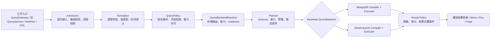
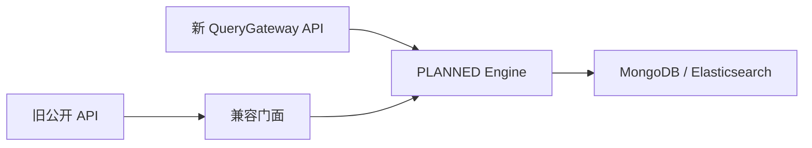

# Query 服务架构升级设计

> 状态：复审修订待确认
>
> 日期：2026-08-11
>
> 审查基线：`53dc6d9c860379aa799c46c62ee3d3fe7aee4548`
>
> 范围：`wow-api`、`wow-query`、`wow-mongo`、`wow-elasticsearch`、`wow-spring`、`wow-spring-boot-starter`、`wow-webflux` 及相关测试模块

## 1. 决策摘要

本次升级选择**直接切换到单一 `PLANNED` 执行引擎**，不在运行时维护 `LEGACY` 或 `SHADOW` 双轨。Wow 8.x 新增稳定的 `QueryGateway` 公开 API；现有 `QueryService`、Spring Bean、HTTP/JSON/OpenAPI 契约继续保留，但实现全部改为通过 `QueryGateway` 公共接口委托新引擎的兼容门面。旧 Query Filter 扩展 API 直接删除，不保留兼容 hook 或运行时检测；开发者在重新编译时通过 IDE/编译错误定位迁移点。下一主版本删除其余旧 API 与仅用于迁移的兼容能力。

查询能力采用两层模型：

- `PortableExpression` 定义 MongoDB、Elasticsearch 等后端都必须满足的可移植语义，并以 MongoDB 语义作为共享 TCK 的参考基线；
- `CapabilityExpression` 显式承载 `FullText`、`Native`、未来 `Geo` 等后端能力，后端不支持时必须拒绝，不能静默降级。

所有框架托管入口统一经过 Admission、Normalize、Policy、Backend Resolve、Plan、Execute、Result Policy 七个阶段。Admission 为每次订阅建立带来源信息的 `QueryInvocationScope`；单一 `QueryPolicy` 扩展 SPI 统一承载服务端业务约束、安全条件、字段/capability 权限和预算上限，框架负责把其 mandatory expression 以 `AND` 注入，调用方不能移除。结果脱敏由独立的 `ResultPolicy` 承担。存储后端只编译并执行已验证计划，不解析外部 DTO，也不自行拼接授权条件。

第一阶段不拆 Gradle 模块、不修改 KSP、不实现聚合分析 API、不自动迁移索引。默认查询 Schema 在启动时由聚合状态类型的 Jackson 序列化模型推导，并只提供一个 `QuerySchemaCustomizer` 扩展点。

## 2. 背景与根因

当前查询抽象已经覆盖单条、列表、分页、计数等基础操作，但契约、执行和后端语义仍混合在一起：

- `QueryService` 直接暴露七种执行方法，调用形态与执行策略绑定（`wow-query/src/main/kotlin/me/ahoo/wow/query/QueryService.kt:33`）；
- `QueryContext` 以可变 attributes 和未检查类型转换承载调用状态，难以保证订阅隔离与扩展安全（`wow-query/src/main/kotlin/me/ahoo/wow/query/filter/QueryContext.kt:31`）；
- `QueryHandler` 与尾部 Filter 同时承担过滤链组织和实际执行，授权、兼容与后端执行边界不清晰（`wow-query/src/main/kotlin/me/ahoo/wow/query/filter/QueryHandler.kt:40`、`wow-query/src/main/kotlin/me/ahoo/wow/query/snapshot/filter/SnapshotQueryFilter.kt:30`）；
- Spring 注册器将每个聚合的 Bean 直接绑定到具体 `QueryService`，缺少统一治理入口（`wow-spring/src/main/kotlin/me/ahoo/wow/spring/query/SnapshotQueryServiceRegistrar.kt:48`、`wow-spring/src/main/kotlin/me/ahoo/wow/spring/query/EventStreamQueryServiceRegistrar.kt:35`）；
- `NoOp` 服务会把后端未就绪解释为空结果或零，掩盖部署和配置错误（`wow-query/src/main/kotlin/me/ahoo/wow/query/snapshot/SnapshotQueryService.kt:31`）；
- EventStream 工厂使用普通可变 Map，而 Snapshot 工厂采用并发结构，生命周期与并发假设不一致（`wow-query/src/main/kotlin/me/ahoo/wow/query/event/EventStreamQueryServiceFactory.kt:22`）；
- MongoDB 与 Elasticsearch 各自直接转换 `Condition`，缺少共同的标准化与计划契约（`wow-mongo/src/main/kotlin/me/ahoo/wow/mongo/query/AbstractMongoConditionConverter.kt`、`wow-elasticsearch/src/main/kotlin/me/ahoo/wow/elasticsearch/query/AbstractElasticsearchConditionConverter.kt`）；
- `ListQuery.limit=0` 在公开契约中表示不限制，但 Elasticsearch 执行路径存在 `10_000` 上限，形成跨后端可观察差异（`wow-api/src/main/kotlin/me/ahoo/wow/api/query/ListQuery.kt:24`、`wow-elasticsearch/src/main/kotlin/me/ahoo/wow/elasticsearch/query/ListQueries.kt:16`）；
- 公开分页模型没有在统一边界验证页码、页大小和深分页预算（`wow-api/src/main/kotlin/me/ahoo/wow/api/query/Queryable.kt:69`）。

根因不是单个转换器缺陷，而是缺少一个在后端之前完成**输入固化、语义标准化、权限合成、能力协商和预算校验**的统一规划边界。继续在现有 Filter 或各后端内打补丁，会扩大语义漂移和兼容负担。

## 3. 目标与非目标

### 3.1 目标

1. 为 Snapshot 和 EventStream 的单条、列表、分页、计数查询建立统一执行管线。
2. 让可移植语义一致，同时通过显式能力模型保留存储后端特性。
3. 将授权、字段可见性、成本预算和结果脱敏变成不可绕过的框架阶段。
4. 在 Wow 8.x 保持旧查询调用 API、Spring Bean、HTTP/JSON/OpenAPI 契约兼容，并给出下一主版本的明确删除路径；Query Filter 扩展 API 是经过批准的破坏性删除例外。
5. 消除静默空结果、静默截断、近似结果冒充精确结果和未声明字段直通等错误模式。
6. 用共享契约测试和真实后端集成测试证明 MongoDB、Elasticsearch 的共同语义与能力差异。

### 3.2 非目标

- 第一阶段不实现 `AnalyticsQueryGateway` 或聚合分析查询；只保证内部计划模型未来可增加独立分析入口；
- 不拆分或新增 Gradle 模块；
- 不修改 KSP 生成协议，也不要求 `wow-query` 依赖完整 `wow-schema`；
- 不新增公开游标、PIT 或 `search_after` API；
- 不保留运行时 `LEGACY`、`SHADOW` 引擎或双读比对；
- 不为旧 Query Filter 提供兼容 hook、适配器或运行时 Bean 检测；
- 不自动执行 Elasticsearch 索引迁移、alias 切换或破坏性数据变更；
- 不支持跨聚合 Join；
- 不把全文检索、Native DSL 等后端能力伪装成可移植语义。

## 4. 总体架构



所有框架管理的查询入口都必须进入同一个 `QueryGateway`。旧 `QueryService` 不再拥有独立执行器，而是通过注入的 `QueryGateway` 公共接口，把旧 DTO 降低为新请求并映射回旧结果类型。兼容门面不能依赖 `DefaultQueryGateway`、Planner 或 Backend 实现。Raw backend API 仅供基础设施内部使用，不能成为绕过 Policy 和 Planner 的应用入口。

职责边界如下：

| 层 | 职责 | 明确不负责 |
| --- | --- | --- |
| Admission | 每次订阅创建独立调用；从入口请求和可信 authority 构造带 provenance 的 `QueryInvocationScope`；固化 Clock、deadline、budget；防御性复制输入；结构预算校验 | 解释后端语法、仅凭调用方字段授予权限 |
| Normalize | 将外部条件和值转换为不可变逻辑模型；统一时间和值语义 | 拼接授权、访问物理字段 |
| QueryPolicy | 注入跨入口业务约束；根据可信 authority 校验/收窄 scope；限制所有字段引用、能力与资源范围 | 编译 MongoDB/ES 查询、提供调用方可覆盖的默认值 |
| QueryBackendResolver | 保留现有 aggregate/storage routing 语义；解析具体后端、稳定 descriptor、capability 和 readiness | 改写查询语义、执行查询 |
| Planner | 根据 Schema 和已解析后端能力生成版本化可执行计划；解析输出 shape；加入稳定排序；拒绝超预算请求 | 执行网络 I/O |
| QueryBackend | 编译和执行已验证计划；报告 readiness 与 capability | 解析 wire DTO、静默改写语义 |
| ResultPolicy | 结果脱敏、审计、有类型结果转换和后置条件 | 放宽查询权限、执行旧 API 映射 |

### 4.1 模块边界

- `wow-api`：稳定公开请求、结果、表达式和错误码等纯数据契约；
- `wow-query`：Reactive `QueryGateway` 公开契约及其默认实现、兼容门面、Admission、Normalizer、稳定 `QueryPolicy` SPI、Planner、稳定且版本化的 Backend SPI 与生命周期管理；
- `wow-mongo`：MongoDB 计划编译器、执行器、readiness 检查；
- `wow-elasticsearch`：Elasticsearch 计划编译器、执行器、mapping/readiness 检查；
- `wow-spring*`：Bean 装配、旧 Bean 名称与泛型注入兼容；
- `wow-webflux`：保持现有 HTTP wire 契约，从 route/header/request 构造带 provenance 的入口 scope，并将请求交给统一 Gateway；
- `wow-cosec`：向 Admission 提供可信 authority/scope contributor，不再把安全性寄托于普通条件重写；
- `wow-test`：提供公开 `QueryPolicyTestKit` 和 Backend/Policy 契约测试支持。

由于后端位于独立 Gradle 模块，也允许第三方实现自定义存储，`me.ahoo.wow.query.backend` 中的 `QueryBackend`、`QueryBackendDescriptor`、`QueryBackendResolver` 与 `QueryPlanV1` 是稳定、公开、版本化的基础设施 SPI：一旦在 8.x 发布，必须保持该主版本内的 source/binary compatibility。新增计划能力通过并行的 `QueryPlanV2`/新 capability 类型演进，不原地修改 `QueryPlanV1` 的既有语义。Normalizer、Planner 实现、中间构建器和物理编译细节仍保持 Kotlin `internal`。导出的计划数据结构必须最小、不可变且不含 Spring、wire DTO 或存储驱动类型；应用查询入口仍是 `QueryGateway`，Backend SPI 在独立文档中面向基础设施开发者说明。

稳定 SPI 的职责形态固定为 operation-specific consumer；第三方 backend 接收框架创建的只读计划，不获得绕过 Gateway 的 plan builder：

```kotlin
interface QueryBackend {
    val descriptor: QueryBackendDescriptor
    fun <R : Any> single(plan: SingleQueryPlanV1<R>): Mono<R>
    fun <R : Any> list(plan: ListQueryPlanV1<R>): Flux<R>
    fun <R : Any> page(plan: PageQueryPlanV1<R>): Mono<QueryPage<R>>
    fun count(plan: CountQueryPlanV1): Mono<Long>
    fun readiness(): Mono<QueryBackendReadiness>
}

interface QueryBackendResolver {
    fun resolve(target: QueryTarget): Mono<ResolvedQueryBackend>
}
```

`QueryBackendDescriptor` 固定声明 backend id、支持的 document kind/plan version/portable operator/capability；capability id 使用可扩展值对象而不是封闭 enum。四种 `*QueryPlanV1` 共享 target、canonical expression、已授权 result shape、sort/page/limit、frozen deadline/budget 与审计 correlation，但只暴露各 operation 必需字段。`ResolvedQueryBackend` 将 resolver 选择的 backend、descriptor 和 route identity 绑定为一次 invocation 的不可变结果。只有 Planner 能创建计划；应用和兼容门面均不能直接调用 Backend。

## 5. 公开查询模型

### 5.1 QueryGateway

Wow 8.x 新增稳定公开 API，采用统一 Gateway 与操作专用请求，避免重新复制多套客户端，也避免引入难以类型化的万能消息总线。

建议契约形态：

```kotlin
interface QueryGateway {
    fun <R : Any> single(request: SingleQueryRequest<R>): Mono<R>
    fun <R : Any> list(request: ListQueryRequest<R>): Flux<R>
    fun <R : Any> page(request: PageQueryRequest<R>): Mono<QueryPage<R>>
    fun count(request: CountQueryRequest): Mono<Long>
}
```

`SingleQueryRequest<R>`、`ListQueryRequest<R>`、`PageQueryRequest<R>`、`CountQueryRequest` 显式组合以下不可变值对象：

- `QueryTarget`：命名聚合与 Snapshot/EventStream 文档种类；
- `QueryResultShape<R>`：typed/dynamic 结果描述、逻辑 projection 和解码契约；
- `QueryExpression`：`PortableExpression` 或显式 `CapabilityExpression`；
- operation parameters：排序、分页、limit、deadline 和预算提示等与操作相关的参数；
- requested resource scope：旧请求中的 tenant/owner/space 只能作为带 `CALLER_REQUEST` provenance 的范围请求，不能覆盖 Admission 从可信 authority 建立的 scope。

请求对象不暴露 BSON、Elasticsearch DSL、物理索引字段或驱动类型，也不提供能让调用方把自己标记为已授权的 authority 字段。每次 Reactor subscription 创建独立 invocation，不在请求或 Context 中复用可变状态。

开发者对单次查询的条件直接放入 request/DSL；允许调用方覆盖的默认条件放在领域 Query Facade 或 request builder。只有必须对旧 `QueryService`、新 `QueryGateway`、WebFlux 等所有入口统一生效且调用方不能移除的服务端约束，才实现第 7.4 节的 `QueryPolicy`。

`QueryPage<R>` 在新 API 中明确携带 items、精确 total 与一致性元数据。旧分页 API继续映射为 `PagedList<R>`；如果后端不能在同一逻辑命令内产生精确结果，必须返回错误，不得用近似 total 或两次无一致性保证的独立查询冒充。

### 5.2 表达式分层

`PortableExpression` 只描述布尔谓词；排序、projection、page/offset 与 limit 属于 operation request，不能伪装成表达式节点。当前 `Operator` 定义了 43 个枚举值（`wow-api/src/main/kotlin/me/ahoo/wow/api/query/Operator.kt:23`），现有 converter 通过穷尽 `when` 分派全部操作符（`wow-query/src/main/kotlin/me/ahoo/wow/query/converter/AbstractConditionConverter.kt:32`）；兼容门面必须保持同样的穷尽性并按下表 lowering：

| 当前操作符 | lowering 与约束 |
| --- | --- |
| `AND`、`OR`、`NOR` | 降低为同名 portable 逻辑节点。否定组合是 `NOR`，第一阶段不新增语义不同的通用 `NOT`。空子句和单子句规则由标准化器统一并写入 TCK。 |
| `ID`、`IDS`、`AGGREGATE_ID`、`AGGREGATE_IDS`、`TENANT_ID`、`OWNER_ID`、`SPACE_ID` | 降低为框架固定 system logical field 上的 equality/membership。所有 system field 引用仍须经过 Policy；tenant/owner/space 不能仅凭调用方条件获得授权。 |
| `DELETED` | 降低为 Snapshot 固定 deletion scope/predicate。新 API 的 Snapshot 默认 `ACTIVE`；兼容门面精确复现现有 `DeleteConditionGuard` 的默认 active 与显式 deletion 规则。EventStream 不套用 Snapshot deletion guard。 |
| `ALL` | 降低为 `MatchAll`。Snapshot 的默认 `ACTIVE` mandatory policy 仍然生效，除非请求以受允许的显式 deletion scope 改变它。 |
| `EQ`、`NE`、`GT`、`LT`、`GTE`、`LTE`、`CONTAINS`、`IN`、`NOT_IN`、`BETWEEN`、`ALL_IN`、`STARTS_WITH`、`ENDS_WITH`、`ELEM_MATCH`、`NULL`、`NOT_NULL`、`TRUE`、`FALSE`、`EXISTS` | 降低为 canonical portable predicate；字段类型、arity、null/missing、collection 与 nested 语义由 Schema 校验，并以 MongoDB 现有可观察语义为参考 oracle 写入双后端 TCK。`ELEM_MATCH` 只允许 Schema 显式声明的 object collection。 |
| `TODAY`、`BEFORE_TODAY`、`TOMORROW`、`THIS_WEEK`、`NEXT_WEEK`、`LAST_WEEK`、`THIS_MONTH`、`LAST_MONTH`、`RECENT_DAYS`、`EARLIER_DAYS` | 在 Normalize 阶段使用本次 subscription 冻结的 `Clock` 与明确 `ZoneId` 一次性降低为 `Instant` range/comparison；日、周、月范围统一为 `[startInclusive, endExclusive)`，以正确覆盖 DST 与存储精度差异。Planner 和 Backend 不得再次读取当前时间。legacy `datePattern` 会把边界改写为无类型字符串，无法经过 Schema 证明其时间语义，因此兼容门面明确返回 `INVALID_QUERY`；开发者必须迁移为类型化时间字段，不提供字符串范围回退。 |
| `MATCH` | 降低为 `FullText` capability；不允许退化成 `CONTAINS`。 |
| `RAW` | 仅当 legacy `Condition.value` 已是完整、不可变的 `NativeExpression` 时原样降低为 `Native` capability；必须通过后端支持、显式配置、Policy 许可、字段与复杂度预算四重校验。旧 BSON、Elasticsearch `Query`、任意 JSON/String/Map 等裸 payload 不含 backend、受控 template、参数与字段声明，兼容门面统一返回 `INVALID_QUERY`，不得运行时推断、自动包装或透传驱动对象。开发者可先将 `Condition.raw(payload)` 改为 `Condition.raw(NativeExpression(...))` 过渡，最终迁移为直接提交 canonical expression 的 `QueryGateway` 请求。 |

矩阵与代码都必须穷尽枚举；新增或遗漏 `Operator` 时编译或契约测试失败，禁止通过默认分支静默忽略。兼容 lowering 完成后，Planner 只看 canonical expression，不再依赖旧 `Operator`。

`CapabilityExpression` 必须显式声明能力标识及后端约束：

- `FullText`：由后端定义相关度、分析器等搜索语义；
- `Native`：受配置、权限、字段白名单与复杂度预算约束的原生查询；
- 未来 `Geo`、向量检索等能力。

Capability 不可用时返回 `UNSUPPORTED_CAPABILITY`。禁止把 FullText 自动降级为字符串 contains，也禁止忽略 Native 片段。

Capability payload 中引用的每一个逻辑字段都必须参与 Schema 与字段权限校验；`Native` 即使无法完全结构化解析，也必须使用受控模板/参数和显式字段声明，不能用不可审计的任意字符串绕过字段策略。

上述 `RAW` 与 `datePattern` 规则是经批准的显式行为修正：兼容门面仍委托同一 `QueryGateway`，不保留 legacy backend 旁路、运行时 payload 检测、resolver/registry hook 或字符串时间语义。迁移文档必须同时给出旧写法、过渡写法、最终 `QueryGateway` 写法以及失败码。

### 5.3 不可变值模型

Admission 对 List、Map、byte array 等可变输入只遍历一次并防御性复制，随后转换为内部 `QueryValue`：标量、时间、枚举、列表、对象等均具有明确类型。内部模型不得继续传播 `Any`、BSON value、Elasticsearch JSON 节点或物理字段名。

时间相关值在每次订阅开始时使用同一个冻结 `Clock` 解析。相对时间、deadline 和策略判断不得在同一查询的不同阶段重新读取系统时间。

## 6. Query Schema

### 6.1 默认来源

第一阶段采用单一、低配置的 Schema 来源：启动时从 `AggregateMetadata.state.aggregateType` 获取聚合状态类型，并使用 Wow 当前 Jackson 序列化配置构建逻辑查询 Schema。固定的 Snapshot/EventStream 系统字段由框架内置。

这一设计与现有元数据和 Jackson 能力对齐：聚合状态类型由 `StateAggregateMetadata` 暴露（`wow-core/src/main/kotlin/me/ahoo/wow/modeling/metadata/StateAggregateMetadata.kt:38`）；现有 schema 工具已经证明 Jackson、Kotlin 和 Jakarta 模型可以共同推导字段结构（`wow-schema/src/main/kotlin/me/ahoo/wow/schema/SchemaGeneratorBuilder.kt:52`）。第一阶段只复用同类运行时 introspection 思路，不增加 `wow-query -> wow-schema` 的强耦合。

推导必须尊重 `@JsonProperty`、`@JsonIgnore`、命名策略、nullable、collection、nested object 和 enum 等实际序列化规则。默认规则保持保守：

| 字段类型 | 默认允许的查询能力 |
| --- | --- |
| enum / boolean | equality、membership |
| number / time | equality、range、sort |
| String | exact equality、literal contains/prefix/suffix；后端必须证明绑定到 exact 语义字段 |
| scalar collection | membership、`ALL_IN` |
| nested object | 已声明子字段 |
| object collection | 默认禁用 `ELEM_MATCH`，需显式定制 |
| system fields | 使用框架固定定义 |

默认不推断 FullText，不从 Elasticsearch mapping 反推领域查询契约。

### 6.2 唯一扩展点

只提供一个 `QuerySchemaCustomizer`，用于：

- 标记 FullText 字段与所需 capability；
- 启用 object collection 的 `ELEM_MATCH`/nested 语义；
- 注册 `DynamicDocument` 或外部结果模型；
- 指定 Elasticsearch exact/search/sort 等物理绑定；
- 设置 collation、最大字符串长度、数值精度等约束。

MongoDB 默认物理路径与逻辑 Jackson 路径一致。Wow 管理的 Elasticsearch 索引遵循固定 mapping 约定；已有或自定义索引在启动 readiness 阶段验证 mapping 是否满足 Schema。Mapping 是验证对象和物理绑定，不是 Schema 真相来源。验证失败返回 `BACKEND_NOT_READY` 并要求显式迁移，不自动改索引。

### 6.3 旧 API 的未知字段

新 `QueryGateway` 只接受 Schema 已声明字段。8.x 兼容门面对于旧请求中的未知字段，可在配置和策略允许时降低为受控的 `LegacyBackendField` capability：

- 必须经过字段策略、语法和预算检查；
- 发出 deprecation warning 与可观测 metric；
- 不提供跨后端可移植保证；
- 下一主版本与旧 API 一同删除。

这使旧用户获得过渡窗口，但不会污染新公开模型或长期语义。

## 7. Policy、安全与旧 Filter 迁移

旧 Query Filter 扩展 API 直接删除。框架不保留兼容 hook、Filter adapter 或运行时 Bean 扫描，也不会静默忽略旧 Filter。依赖旧类型的源码在重新编译时由 IDE/编译器报告缺失 import、接口实现或 Bean 声明，开发者按迁移文档将职责迁移到明确端口：

| 旧 Filter 职责 | 新边界 |
| --- | --- |
| 授权、tenant/aggregate 范围、强制条件 | `QueryPolicy` |
| 字段权限、能力许可、预算上限 | `QueryPolicy` |
| 所有入口必须追加的业务条件 | `QueryPolicy` |
| 单次条件或调用方可覆盖的默认条件 | Query request/DSL 或领域 Query Facade/request builder |
| 结果字段脱敏、结果侧审计信息 | `ResultPolicy` |
| 后端特有条件或字段绑定 | `CapabilityExpression`、`QuerySchemaCustomizer` 或 Backend compiler |
| 任意前后置拦截 | 不提供一比一替代；拆分到上述有类型的职责边界 |

这是 8.x 兼容承诺中的显式破坏性例外。使用旧 Filter 的预编译应用不保证原地二进制升级，必须重新编译并完成迁移；框架不以运行时探测补偿这一点。迁移文档必须提供中英文版本、职责对照、前后代码示例以及授权 Filter 的安全迁移检查清单。

### 7.1 QueryInvocationScope

Admission 在每次 subscription 中重新构造不可变 `QueryInvocationScope`，至少区分以下来源：

- `CALLER_REQUEST`：route、header、旧 DTO 或新请求声明的 tenant/owner/space 范围，只表示调用方想访问什么；
- `TRUSTED_AUTHORITY`：认证集成提供的 tenant ownership、subject、roles/claims 与允许范围；
- `SYSTEM_METADATA`：聚合元数据、固定 system field、内部任务身份；
- `LEGACY_ENRICHMENT`：8.x 保留的普通请求重写所追加的条件，安全级别与用户输入相同。

`QueryPolicy` 以 `TRUSTED_AUTHORITY` 和 `SYSTEM_METADATA` 为依据校验或收窄 `CALLER_REQUEST`，并注入带 `MANDATORY_POLICY` provenance 的 tenant/owner/space/deletion 条件。调用方范围超出 authority 时返回 `POLICY_DENIED`，不能静默扩大为 tenant-wide，也不能把请求里的 system field 当作授权证明。

用户表达式、legacy enrichment 和 mandatory policy 表达式在内部保持不同 provenance，直到 Planner 完成审计和合成。最终计划虽然通常使用 `AND(user, mandatory)`，但审计、错误定位和优化都不能丢失其来源。

### 7.2 WebFlux 与 CoSec 接入

现有 WebFlux handler 仍可先执行 8.x 的请求解析/兼容 enrichment，但随后必须由 Admission adapter 从 route、header、request 和已认证 principal 构造 scope。当前 rewrite 会直接把 tenant/owner/space 追加进普通 `Condition`（`wow-webflux/src/main/kotlin/me/ahoo/wow/webflux/route/query/RewriteRequestCondition.kt:45`），CoSec 还会从 header 回退解析 space（`wow-cosec/src/main/kotlin/me/ahoo/wow/cosec/query/CoSecRewriteRequestCondition.kt:23`）。升级后 `wow-cosec` 注册新的可信 scope contributor，把 CoSec authority/space 解析结果交给 Admission；安全强制条件由 `QueryPolicy` 独立生成，不再依赖 `CoSecRewriteRequestCondition` 是否运行。

`RewriteRequestCondition` 不是 Query Filter API。为满足“除 Query Filter 外保持 8.x 兼容”的承诺，它及现有 Spring 注入点在 8.x 保留并标记 deprecated，只作为请求 enrichment 在 Admission 前运行；其追加条件统一标记为 `LEGACY_ENRICHMENT`，仍须通过 Schema、Policy、Planner。默认 WebFlux/CoSec 适配器即使保留旧 rewrite，也必须另外提供可信 scope contributor。下一主版本再删除 `RewriteRequestCondition`、`CoSecRewriteRequestCondition` 及其旧装配。

### 7.3 字段与结果权限

字段权限在发起后端 I/O 前覆盖所有逻辑字段引用：

- condition 中的普通字段、system field 和 nested path；
- projection include/exclude；
- `Projection.ALL` 展开的完整输出 shape；
- sort 字段及 Planner 自动追加的 identity tie-breaker；
- `FullText`、`Native` 等 capability payload 声明的字段；
- typed/dynamic 结果 descriptor 中要求解码或返回的字段。

`Projection.ALL` 不能把决定权留给后端或仅靠事后 masking；Policy 必须先把它解析为当前 authority 允许的明确输出 shape，再交给 Planner。`ResultPolicy` 继续做脱敏、审计和防御性检查，但不是防止敏感字段被读取的唯一边界。

Policy 读取的是每次订阅固化的 authority，不依赖共享可变 `QueryContext.attributes`。Native、FullText 和 `LegacyBackendField` 默认拒绝，只有后端支持、配置启用且 Policy 明确授权时才可执行。

### 7.4 单一 QueryPolicy 扩展 SPI

框架不再提供 `QueryConditionContributor` 或新的通用 query hook。所有框架级条件注入本质上都是调用方不能移除的服务端约束，因此统一由一个最小函数式接口承载：

```kotlin
fun interface QueryPolicy {
    fun evaluate(context: QueryPolicyContext): Mono<QueryPolicyResult>
}

data class QueryPolicyResult(
    val mandatoryExpression: PortableExpression = MatchAll,
    val constraints: QueryPolicyConstraints = QueryPolicyConstraints.NONE
)

data class QueryPolicyConstraints(
    val fieldAccess: QueryFieldAccess = QueryFieldAccess.UNRESTRICTED,
    val capabilityAccess: Map<QueryCapabilityId, CapabilityDecision> = emptyMap(),
    val maxBudget: QueryBudgetLimit = QueryBudgetLimit.UNBOUNDED
)
```

`me.ahoo.wow.query.policy` 下的 `QueryPolicy`、`QueryPolicyContext`、`QueryPolicyResult`、constraints、denied exception 及它们引用的 context view 都是稳定公开 SPI。`QueryPolicyContext` 是不可变值，包含 `QueryTarget`、operation、Normalize 后的 expression、result shape、`QueryInvocationScope`、`QuerySchemaView`、请求 budget，以及本次 subscription 冻结的 `Instant`/`ZoneId`。它不暴露 Spring、HTTP request、存储驱动类型、可变 attributes 或可替换 query 的方法。`QueryPolicy` 可以读取 trusted authority；实现该 SPI 的服务端代码属于受信部署面。

Policy 不适用或没有附加条件时返回默认 `QueryPolicyResult`/`MatchAll`。明确拒绝通过 `Mono.error(QueryPolicyDeniedException(reasonCode))` 表达；`reasonCode` 必须稳定、低基数且不含敏感数据。`Mono.empty()` 不是允许或不适用，而是扩展协议错误。

所有 Policy 接收相同的只读 context，不能读取前一个 Policy 的结果。框架集中合并：

```text
securedExpression = AND(
    normalizedUserAndLegacyExpression,
    policy1.mandatoryExpression,
    policy2.mandatoryExpression,
    ...
)
```

- mandatory expression 全部 `AND`，且只能是 `PortableExpression`；安全条件不能依赖 Native、全文或某个 mapping 特性；
- field access 取交集；max budget 取最小值；
- capability 任意显式 `DENY` 优先，否则需要至少一个 `GRANT`；全部 `ABSTAIN` 时拒绝；
- capability 的最终许可仍是 backend 支持、系统配置启用、Policy grant 三者同时满足；
- Policy 顺序只影响执行、日志和错误诊断稳定性，不允许形成语义依赖。

组合器在进入 Backend Resolver 前验证每个 Policy result 及最终 expression/constraints；未知字段、错误值类型、非法表达式或不一致约束立即产生 `POLICY_FAILURE`。Policy evaluation、组合和验证都受本次 invocation deadline 约束。

框架内置 `SystemQueryPolicy` 负责 Snapshot 默认 active、Schema 基线、管理员预算，以及“没有任何 Policy grant 时拒绝 capability”的系统不变量；它不能对所有 capability 预先产生显式 `DENY`，否则自定义 `GRANT` 永远无法生效。System Policy 始终参与组合，不能因为应用声明自定义 Bean 或没有自定义 Policy 而被替换/移除。CoSec 等集成追加自己的 Policy，不覆盖系统策略。

Spring 自动收集 `List<QueryPolicy>`，复用 Wow 的 `@Order`/`Ordered` 排序，并在 `QueryGateway` 创建时与内置 Policy 合成为不可变快照。非 Spring 环境由 `QueryGatewayFactory` 构造时显式传入不可变自定义 Policy 列表，系统 Policy 仍由框架加入。扩展描述符由注册层根据 Spring bean name/实现类生成，用于低基数指标和日志，不污染 `QueryPolicy` 接口。第一阶段不提供运行时 `register`/`unregister`。

普通业务约束和安全约束使用同一注册方式：

```kotlin
@Bean
fun activeOrderPolicy() = QueryPolicy { context ->
    val mandatory = if (context.target.aggregateName == "order") {
        PortableExpression.eq("state.status", "ACTIVE")
    } else {
        MatchAll
    }
    QueryPolicyResult(mandatoryExpression = mandatory).toMono()
}

@Bean
fun tenantPolicy() = QueryPolicy { context ->
    val tenantId = context.invocationScope.trustedAuthority.tenantId
        ?: return@QueryPolicy Mono.error(QueryPolicyDeniedException("TENANT_REQUIRED"))
    QueryPolicyResult(
        mandatoryExpression = PortableExpression.tenantId(tenantId)
    ).toMono()
}
```

## 8. 规划与后端执行

### 8.1 Backend 解析与路由

`QueryBackendResolver` 在 Policy 之后、Planner 之前，根据 document kind、命名聚合、当前 `StorageRoutingProperties`/aggregate storage binding 和已注册 backend 解析唯一的 `QueryBackendDescriptor`。当前启动装配已经分别按 aggregate 的 event/snapshot channel 解析 query factory route（`wow-spring-boot-starter/src/main/kotlin/me/ahoo/wow/spring/boot/starter/eventsourcing/routing/StorageRouteResolver.kt:104`），而 routing factory 在调用时再次选择具体 factory（`wow-query/src/main/kotlin/me/ahoo/wow/query/snapshot/RoutingSnapshotQueryServiceFactory.kt:20`）。Planner 因此必须在统一 resolver 已解析具体后端后，基于其 capability、计划版本和 readiness 生成计划，而不是先生成一个无法证明可执行的抽象计划。

解析必须保留现有按 aggregate 与 storage channel 路由的语义；旧 `SnapshotQueryServiceFactory`、`EventStreamQueryServiceFactory` 和 routing factory 的兼容适配都委托同一个 resolver，不能各自维护第二份路由表。错误边界如下：

- 显式 storage route/binding 本身非法或指向不存在的配置：Spring 启动期按配置错误失败；
- 合法 target 在运行时没有已注册 backend：查询返回 `BACKEND_NOT_READY`，不再使用 NoOp；
- backend 已注册但 index/mapping 暂不可用：descriptor/readiness 报告原因，查询返回 `BACKEND_NOT_READY`；默认不阻止不使用该查询后端的应用启动；
- 运维要求全量就绪时，可启用 strict readiness 使应用 readiness 失败，但不能改变查询错误语义。

### 8.2 计划不变量

Planner 输出给后端的计划必须已经满足：

- target、document kind 和结果 shape 已解析；
- condition、projection、sort、capability payload、结果 shape 和自动 tie-breaker 中的所有逻辑字段都存在于 Query Schema，或被标记为受控兼容 capability，并已通过字段权限；
- 用户条件与 mandatory policy 条件已合成且 provenance 可审计；
- 已解析后端声明支持计划版本、全部 portable operator 和 capability；
- page、limit、expression depth、collection cardinality、deadline 等预算已校验；
- bounded list/page 具有确定性排序，必要时自动追加 identity tie-breaker；
- 计划不可变，不包含 wire DTO、Spring Context 或存储驱动对象。

后端编译器只能把计划绑定为物理查询，不能补做授权，也不能通过忽略表达式来“兼容”。

验证严格分阶段：请求结构、Schema、Policy、capability 和 plan validation 必须在后端 I/O 前完成；decode、ResultPolicy 和结果后置条件只能在后端返回数据后执行。`single`、`page`、`count` 在完整 materialize 并通过结果验证后原子发射；`list` 才允许按背压逐项流式发射，并可能在部分发射后因 decode、结果策略或后端故障以第 9 节完整性语义终止。

### 8.3 `limit=0`、预算与流生命周期

保留当前公开契约中 `limit=0` 表示“没有请求级 item count 上限”的语义；它不等于绕过管理员配置的 deadline、表达式复杂度、后端窗口、内存或资源预算：

- MongoDB 使用 reactive cursor 按背压读取；
- Elasticsearch 在内部使用 PIT + `search_after` 循环；
- 对外仍返回 `Flux<R>`，不公开 cursor/PIT；
- complete、error、cancel 三种终止路径都必须关闭 cursor/PIT；
- 达到 deadline 或预算时以终止错误结束，绝不返回看似成功的截断结果。

为避免 8.x 升级静默改变旧查询，legacy facade 在没有显式运维配置时不得暗加有限 result-count 上限或 deadline；默认是 result-count unbounded、deadline disabled。新旧 API 都服从同一管理员上限；受信内部调用的预算提示只能收紧或在策略允许范围内调整，不能超过 policy maximum。配置上限触发时返回终止错误，绝不成功截断。

bounded list 自动加入稳定 identity tie-breaker。超过后端深分页能力或可预检预算的请求在执行前拒绝；只能在执行时确定的流量/deadline 超限按终止错误处理。

### 8.4 分页一致性

`PageQueryRequest` 的 items 与 total 由同一后端逻辑命令产生：

- MongoDB 使用单一 aggregation pipeline/facet；
- Elasticsearch 使用一次 search 同时返回 hits 与精确 total。

如果 exact total 或一致性要求无法满足，返回明确错误。旧 `PagedList` 只做结果形态映射，不降低这一保证。

### 8.5 Snapshot 与 EventStream

第一阶段对 Snapshot 和 EventStream 使用相同规划管线、错误模型和生命周期。EventStream 查询的基本粒度是存储中的 event-stream document，不把 document count 宣称为领域事件总数。领域事件级聚合分析应通过 projection 建模，留给未来独立 Analytics 能力。

## 9. 错误模型与可观测性

公开错误至少包含稳定 code、阶段、target、backend、retryable 标记和安全的 diagnostic context。第一阶段定义：

| Code | 含义 |
| --- | --- |
| `INVALID_QUERY` | 请求结构、类型、Schema 字段或预算参数无效 |
| `POLICY_DENIED` | 授权、字段、能力或资源范围被拒绝 |
| `POLICY_FAILURE` | Policy 异常、返回 `Mono.empty()`、输出未知字段/错误类型/非法表达式等服务端扩展失败 |
| `UNSUPPORTED_CAPABILITY` | 目标后端不支持请求能力 |
| `BACKEND_NOT_READY` | 后端未注册、mapping/index 未就绪或配置不满足计划 |
| `BUDGET_EXCEEDED` | 表达式、结果量、深分页或资源预算超限 |
| `DEADLINE_EXCEEDED` | 调用超过固化 deadline |
| `INCOMPLETE_RESULT` | 流在已发射部分元素后失败，结果不完整 |
| `BACKEND_FAILURE` | 已就绪后端执行失败 |

公开错误码在不同传输上遵守“提交后不能改写 HTTP 状态”的事实，不能承诺实际上无法发送的统一 error body：

| 调用/传输 | 首个结果前失败 | 已发射部分结果后失败 |
| --- | --- | --- |
| in-process Reactor | 以原始稳定 code 的 `QueryException` 终止 | 以 `QueryException(INCOMPLETE_RESULT)` 终止，并保留安全的 cause code |
| HTTP `single`/`page`/`count` | materialize/验证完成后才提交；映射为稳定 HTTP status 与结构化 error body | 不存在部分业务结果；响应提交故障按 transport failure 记录 |
| HTTP streaming JSON array | adapter 必须延迟到首项或终止信号再决定响应；首项前错误映射为正常 HTTP error | HTTP 200/数组前缀一旦提交就不能替换 status/body；立即中止连接，客户端必须把不完整或无法完成解析的 body 视为失败，并记录 `INCOMPLETE_RESULT` metric/log |
| SSE | 首事件前映射为正常 HTTP error | 发送最终 error event（含稳定 code，不含敏感 diagnostic）后关闭；若连接已不可写则直接关闭并记录指标 |

当前 `StreamingJsonArrayResponse` 已用 `switchOnFirst` 区分首信号，但进入写出后固定拼接 `[`、元素、`]`（`wow-webflux/src/main/kotlin/me/ahoo/wow/webflux/route/response/StreamingJsonArrayResponse.kt:59`）；中途错误无法回写状态，也不会产生完整数组。现有 streaming JSON 的 success header 与 `[` 写出时机必须随 adapter 调整；在首项前失败时不能预先宣告成功，在首项后失败时也不得追加伪造的成功结尾。HTTP client 文档必须明确：只有完整消费并成功闭合的 JSON array 才是成功结果。

Policy 明确抛出的 `QueryPolicyDeniedException` 映射为 `POLICY_DENIED`；其他异常、空 publisher 或无效输出映射为 `POLICY_FAILURE`，不能错误归因于调用方的 `INVALID_QUERY`。Policy 评估期间超过 invocation deadline 仍使用 `DEADLINE_EXCEEDED` 并标记 Policy stage。三类错误都 fail-closed，Backend Resolver 不得运行；外部响应不暴露 bean name、堆栈、authority 或 mandatory expression，内部日志/指标只记录安全的 policy descriptor、阶段、耗时和 cause 分类。禁止用 `onErrorResume` 将 Policy 失败恢复为 `MatchAll`。

禁止以下行为：

- 用 `NoOp` 返回空集合、`Mono.empty()` 或 `0` 表示后端缺失；
- 把已部分发射的 `Flux` 恢复为空或成功完成；
- 静默应用 `10_000` 上限；
- 用 approximate total 替代 exact total；
- 在不支持 capability 时自动退化到另一语义。

指标至少按 operation、document kind、backend、outcome、error code、capability、低基数 policy descriptor、legacy facade 区分；不得记录 Native 原文、mandatory expression、敏感条件值或未脱敏 authority。`LegacyBackendField` 和旧 API 使用量必须可观测，用于下一主版本删除评估。

## 10. 兼容与迁移策略

### 10.1 Wow 8.x 兼容承诺

兼容面按类型逐项锁定，不能用“保留 QueryService”代替完整 ABI 审计：

| 公开面 | Wow 8.x 处置 |
| --- | --- |
| `QueryGateway`、新 request/result/expression/error | 新增稳定应用 API；遵循 8.x source/binary/wire compatibility |
| `QueryPolicy`、`QueryPolicyContext`、`QueryPolicyResult`、约束与测试工具 | 新增稳定扩展 SPI；所有入口共享同一不可变 Policy 快照和组合器 |
| `QueryService`、`SnapshotQueryService`、`EventStreamQueryService` 及现有 request/result DTO | 保留 package、方法和既有公开签名并 deprecate；实现改为只委托 `QueryGateway` 的兼容门面 |
| `SnapshotQueryServiceFactory`、`EventStreamQueryServiceFactory`、`RoutingSnapshotQueryServiceFactory`、`RoutingEventStreamQueryServiceFactory` | 保留接口/类、公开构造器和行为入口并 deprecate；内部统一委托 resolver/Gateway，不保留第二路由表或执行器 |
| MongoDB/Elasticsearch 公开的具体 `*QueryServiceFactory` 与相关存储绑定 | 保留既有公开类、构造器和 package；改为注册/适配 `QueryBackend`。若 ABI 工具发现无法适配的签名，须单独提案确认，不能顺带删除 |
| Kotlin/Java query DSL、Condition builders、projection/sort/page/limit、`DynamicDocument`、`PagedList` | 保留 source/binary 和序列化契约；只在兼容门面做穷尽 lowering |
| Spring Bean name、按聚合注册方式、generic injection 与 storage routing properties | 保留；所有 Bean 最终命中同一 Gateway/resolver |
| HTTP route、JSON 字段与 OpenAPI | 保留；只修正已列明的错误行为和不可伪造的流式错误语义 |
| `RewriteRequestCondition`、`DefaultRewriteRequestCondition`、`CoSecRewriteRequestCondition` 及其 Spring 注入点 | 8.x 保留并 deprecate，只作 `LEGACY_ENRICHMENT`；安全 scope 改走独立 contributor；下一主版本删除 |
| `me.ahoo.wow.query.mask` 下的 `DataMasking`/`DataMasker`、各 `DynamicDocumentMasker`、`AggregateDataMasker`、`DataMaskerRegistry`、实现类、扩展函数与现有 masker 注册点 | 8.x 保留既有公开签名并 deprecate；由 adapter 接入 `ResultPolicy`，不要求用户在本次升级同时重写 masker |
| `QueryBackend`、`QueryBackendDescriptor`、`QueryBackendResolver`、`QueryPlanV1` | 新增稳定、版本化基础设施 SPI；第三方 backend 不依赖内部 Planner 实现 |
| `QueryFilter`、`SnapshotQueryFilter`、`EventStreamQueryFilter`、`QueryContext`/`Contexts`/`QueryType`、`QueryHandler`/`AbstractQueryHandler`、`SnapshotQueryHandler`、`EventStreamQueryHandler`、Tail/Masking/ABAC query filter 及对应 Spring Filter 注册面 | 本次经批准直接删除；不提供 hook、adapter 或 runtime 检测，必须重新编译并按迁移文档迁移到 Policy/ResultPolicy |

除最后一行明确批准的 Query Filter 扩展面及已经逐项列出的行为修正外，ABI/API golden test 不允许其他删除或签名漂移。现有 `limit=0` 等公开语义按第 8.3 节保持。

旧调用 API 标记 deprecation。兼容门面只依赖 `QueryGateway` 公共接口，在内部完成 `legacy DTO -> new request -> QueryGateway -> legacy result/error` 映射；它不能访问 Planner、Backend 或默认 Gateway 实现。兼容门面不保留以下错误行为：NoOp 静默空结果、非法分页未校验、ES 静默 10k 截断、部分失败伪装成功、能力不支持时语义降级。

旧 Query Filter 类型、Handler/Context 扩展面及其 Spring 注册入口直接删除。没有 runtime warning 或 Bean 检测；重新编译产生的错误就是迁移入口。`RewriteRequestCondition` 与 masker API 按上表保留，不能被误归入 Filter 删除。发布说明必须将批准删除项列为 breaking change，并链接到 `documentation/docs/zh/guide/migration/` 与 `documentation/docs/en/guide/migration/` 下的 Query Filter 迁移指南。

条件扩展的迁移判断固定为：调用方可以决定或覆盖的条件放入 query request/DSL/领域 Query Facade；所有框架托管入口都必须执行且调用方不能移除的业务或安全约束实现 `QueryPolicy`。旧授权/ABAC Filter 迁移到 `QueryPolicy`；仅 WebFlux 生效的 `RewriteRequestCondition` 在 8.x 继续作为 `LEGACY_ENRICHMENT`，需要跨入口一致性的规则应迁移到 `QueryPolicy`。普通 Policy 与安全 Policy 使用同一 SPI，不再额外引入职责重叠的 `QueryConditionContributor`。

8.x 同时公开新的稳定 `QueryGateway`，让应用可以主动迁移。第一阶段不新增 HTTP 路由：现有 WebFlux wire 契约改由 Gateway 执行即可。

### 10.2 直接 PLANNED 切换

运行时只有一个 `PLANNED` 引擎：



不引入 `LEGACY -> SHADOW -> PLANNED` 状态机。这样避免长期维护双实现及双读副作用，也保证所有入口接受同一 Policy 和错误语义。发布回滚依赖回滚到上一制品版本，而不是运行时切回旧引擎。因此每个发布切片都必须可独立验证、具备明确版本回滚说明，索引/数据变更不得与引擎切换做不可逆捆绑。

### 10.3 下一主版本

下一主版本删除：

- 旧 `QueryService` 公开门面及其旧 DTO；
- `LegacyBackendField`；
- `RewriteRequestCondition`/CoSec rewrite 与旧 masker adapter；
- 只为旧 Bean/构造器/factory 存在的适配层。

删除前以编译期 deprecation、运行时 metric、迁移文档和 release note 证明迁移窗口已完整提供。

## 11. 实施切片

虽然发布后的运行时直接使用单一 PLANNED 引擎，实现应按以下可验证切片推进：

1. **Contract Lock**：按第 10.1 节完整矩阵为旧 API/ABI、JSON/OpenAPI、Spring Bean/storage routing 与关键语义建立 golden/集成基线，并锁定唯一批准删除的 Filter API 清单；
2. **Semantic Core**：实现不可变值、43 个 Operator 的穷尽 lowering、portable/capability expression、Schema resolver、标准化和预算验证；
3. **Gateway, Scope & Policy**：实现 `QueryGateway`、每订阅 `QueryInvocationScope`、WebFlux/CoSec scope contributor、单一 `QueryPolicy` SPI/组合器、Policy provenance、ResultPolicy 和稳定错误；
4. **Backend SPI & Resolver**：先发布版本化 `QueryPlanV1`/Backend SPI，实现 storage route resolver、descriptor、capability/readiness；
5. **Backends**：实现 MongoDB、Elasticsearch plan compiler/executor、readiness 与共享 TCK；
6. **Facade Cutover**：把旧 QueryService/factory、Spring、WebFlux、DSL 全部切到 Gateway；保留 deprecated rewrite/masker adapter，删除独立执行路径与 NoOp 语义；
7. **Release Closure**：完成全部相关中英文文档、deprecation、指标、真实后端验证和可回滚发布说明。

切片可以在开发分支上以 additive 方式合并，但对外发布时必须满足：所有框架托管入口已经进入 PLANNED，且不存在可被应用误用的旧执行器。

## 12. 验证策略

### 12.1 单元与契约测试

- Admission 单次遍历、防御性复制、表达式深度/集合大小/分页预算；
- Clock、authority、deadline、budget 每订阅固化且订阅间隔离；
- 当前 43 个 `Operator` 每个都有唯一 lowering；枚举新增/遗漏无默认分支并使测试失败；相对时间只读取一次冻结 Clock/ZoneId；
- Jackson Schema 推导覆盖命名、ignore、nullable、enum、nested、collection；
- `QueryInvocationScope` provenance、caller scope 不可伪造 authority、mandatory condition 不可删除；WebFlux/CoSec 即使禁用 legacy rewrite 仍强制 tenant/owner/space；
- `QueryPolicy` 的 `MatchAll`、mandatory `AND`、field intersection、budget minimum、capability deny/grant/abstain；所有 Policy 读取相同 context 且顺序不改变语义；
- `QueryPolicyDeniedException`、`Mono.empty()`、意外异常、invalid expression 和 deadline 分别映射 `POLICY_DENIED`、`POLICY_FAILURE` 或 `DEADLINE_EXCEEDED`，且后端无 I/O；
- condition、projection、`Projection.ALL`、sort、capability payload、result shape 和自动 tie-breaker 的字段权限；
- `QueryBackendResolver` 对每聚合/storage route 的稳定解析、非法启动配置、缺失后端与 readiness 错误；
- 旧 DTO 到新 request、错误和结果形态的兼容映射；
- 公开 ABI 检查覆盖第 10.1 节全部类型，只允许批准清单中的 Query Filter 删除，其他差异失败；
- JSON/OpenAPI 与 Spring Bean 名称 golden test；
- deprecated `RewriteRequestCondition`/masker adapter 兼容测试；迁移后的 Policy/ResultPolicy 示例可编译，并覆盖旧授权 Filter 的等价安全约束。
- 提供 `QueryPolicyTestKit` 构造 target、authority、scope、expression 与 frozen time，覆盖适用/不适用 target、tenant mismatch，以及同一个 Policy 对旧 `QueryService`、新 `QueryGateway` 和 WebFlux 的一致生效。

### 12.2 Portable Query TCK

同一测试向量运行于 MongoDB 与 Elasticsearch：

- 全部 portable operator、null/missing、enum、时间、collection、nested；
- 排序稳定性、identity tie-breaker、single/list/page/count；
- Snapshot 与 EventStream；
- 非法字段、类型不匹配、unsupported capability、预算和 deadline；
- exact total、分页一致性与 `limit=0` 完整流。

MongoDB 是 portable 语义参考 oracle，但不是通过复制 MongoDB 特有行为来定义跨后端能力。无法满足共同契约的功能必须进入 capability layer。

### 12.3 真实后端集成测试

- MongoDB：真实 reactive cursor、facet page、cancel/error resource cleanup；
- Elasticsearch：真实 mapping、PIT + `search_after`、一次 search 的 exact total、PIT cleanup；
- readiness：缺失 index/mapping、字段绑定不匹配、后端未注册；
- 故障注入：首元素前失败、部分发射后失败、超时、取消和重试边界；
- Spring/WebFlux：旧 Bean/route/OpenAPI 与新 Gateway 共享同一 Policy 和执行器；验证 JSON 首项前 error mapping、首项后连接中止，以及 SSE 最终 error event。

### 12.4 必跑验证

实施完成前至少运行相关模块的最窄检查，并在最终合并前闭环全量契约：

```bash
./gradlew :wow-query:check
./gradlew :wow-mongo:check
./gradlew :wow-elasticsearch:check
./gradlew :wow-spring-boot-starter:check
./gradlew :wow-webflux:check
./gradlew allContractTest allIntegrationTest
./gradlew detekt build
```

如果新增或更新文档站内容，再运行：

```bash
cd documentation
pnpm docs:build
```

文档不是只新增 migration 页。交付时必须同步更新中英文 `guide/query.md`、`guide/data-access.md`、`guide/extensions/cosec.md`、Staff Engineer onboarding，以及 Spring Boot、自定义 backend、Snapshot 和 best-practices 中所有相关章节；migration 页要分别覆盖 Query Filter 到单一 `QueryPolicy` 的迁移、request/DSL/Facade/Policy 选择规则、legacy rewrite/masker 的时间表、43 个 Operator、行为修正与自定义 backend SPI。使用 `rg` 清理除 migration/history 外已经失效的 Filter/rewrite 示例，`QueryPolicy`、普通业务约束和 tenant/ABAC 示例必须编译，最后运行 `pnpm docs:build`。

性能结论只能来自可复现 benchmark、profile、日志或复杂度分析。特别验证无限列表的背压和内存上界、PIT 循环开销、Schema 缓存与 Policy/Planner 延迟。

## 13. 风险与控制

| 风险 | 控制措施 |
| --- | --- |
| 直接切换暴露旧行为依赖 | Contract Lock、兼容门面、明确行为修正清单、制品级回滚 |
| Jackson 模型与物理 mapping 不一致 | 启动 readiness 验证；不自动迁移；失败为 `BACKEND_NOT_READY` |
| 兼容门面演变为第二执行器 | 门面只做 lowering/mapping；共享测试断言所有入口命中同一 Gateway |
| 删除旧授权 Filter 导致迁移遗漏 | 编译期破坏、显式 breaking change、中英文迁移示例与安全检查清单；不使用容易被忽略的运行时 warning |
| Policy 扩展输出错误或被恢复为放行 | 无效输出统一 `POLICY_FAILURE`；禁止 empty/错误恢复为 `MatchAll`；组合器 fail-closed；提供 Policy TestKit |
| 能力层成为任意后门 | capability 默认拒绝；后端声明 + 配置 + Policy 三重许可；严格预算与审计 |
| `limit=0` 导致资源失控 | 背压、deadline、budget、取消清理和 `INCOMPLETE_RESULT` 语义 |
| 版本化 Backend SPI 演进受限 | 保持 `QueryPlanV1` 最小不可变；新版本并行增加，不原地改语义；API/ABI 检查和 backend TCK |
| 兼容 rewrite 被误当授权 | 所有 enrichment 标为调用方 provenance；WebFlux/CoSec 独立贡献 trusted scope；Policy 注入 mandatory condition |
| HTTP 流提交后无法返回结构化错误 | 首项前延迟提交；JSON 首项后中止连接，SSE 发 error event；客户端文档和故障注入测试 |
| 旧未知字段长期滞留 | `LegacyBackendField` 警告/指标、8.x 限定、下一主版本删除 |

## 14. 完成标准

本架构升级只有在以下条件全部满足时才算完成：

1. Snapshot/EventStream 的 single/list/page/count 以及 typed/dynamic 路径全部通过统一 Gateway；
2. 运行时不存在 LEGACY/SHADOW 或可绕过 Planner/Policy 的框架托管执行路径；
3. Portable TCK 在真实 MongoDB、Elasticsearch 上通过，后端特性通过 capability 显式表达；
4. 第 10.1 节完整 API/ABI 矩阵通过，除批准删除的 Query Filter 扩展面外没有未确认破坏；保留的旧 API 已 deprecate；
5. NoOp 静默结果、ES 静默 10k 截断、部分失败伪装成功等行为已被明确错误替代；
6. Query Schema、mapping readiness、权限、预算、资源清理和错误可观测性均有自动化测试；
7. 单一 `QueryPolicy` SPI、不可变 context、固定组合规则、Spring/非 Spring 注册、`POLICY_DENIED`/`POLICY_FAILURE` 与跨入口一致性测试全部通过；不存在 `QueryConditionContributor` 或新的通用 query hook；
8. 所有相关 check、契约/集成测试、detekt 和 build 通过；
9. 中英文 Query Filter 迁移指南、相关 query/data-access/CoSec/onboarding/backend/Snapshot/best-practices 文档、行为修正清单、索引准备说明和制品级回滚步骤已经发布；过时示例已清理，迁移示例可编译且文档站构建通过。
