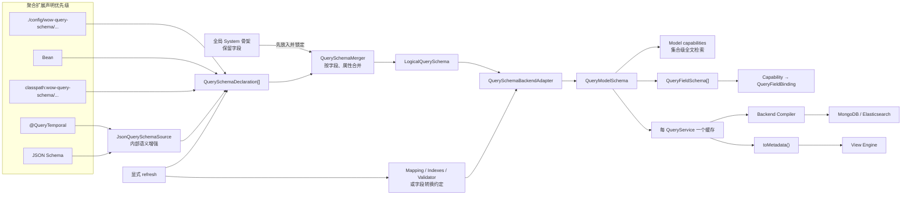
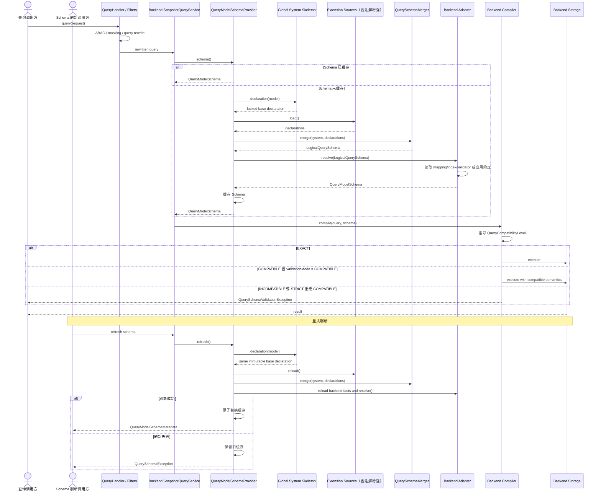
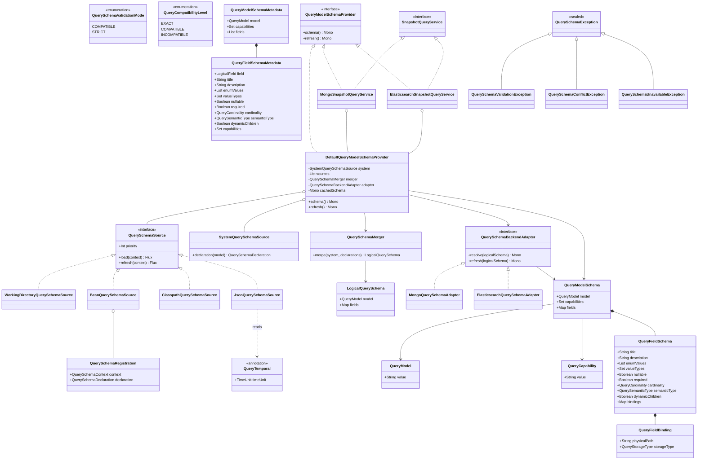

# 查询模型 Schema 注册与发现设计

## 背景

Wow 的查询 API 使用 `LogicalField` 表达逻辑路径，但不同查询后端对同一字段具有不同的物理表示与能力：

- MongoDB 通常没有字段级固定 Schema，字段路径按文档约定转换；全文检索由集合上的 text index 整体开启。
- Elasticsearch 可以发现 index mapping，同一逻辑字段可能按查询用途绑定到 `text`、`keyword`、`date`、数值字段或 nested 路径。
- JSON Schema 能描述领域对象的逻辑结构，但不能证明实际后端 mapping，也不能表达数值 `long` 是金额、版本还是毫秒时间戳。
- 开发者掌握无法从结构或后端推断的业务语义，例如 `state.createdAt` 是毫秒时间戳；这类稳定且贴近字段定义的语义可以由专用注解声明。
- Snapshot 与 EventStream 拥有不同的系统元数据、结构和物理存储，不能共享一份未分级的字段目录。

现有 `TypeFieldPaths` 只把 JSON Schema 展开为最多五层的字段字符串集合，并向 OpenAPI 发布静态 `x-wow-query-fields`。它不包含类型、基数、业务语义、后端能力或物理绑定，不能作为查询编译器和 View Engine 的共同元数据基准。

本设计建立一个按具体 QueryService 生命周期协商并缓存的查询模型 Schema。Schema 由全局系统骨架、JSON Schema、开发者声明及后端事实共同形成，同时服务 Backend Compiler 与 View Engine，但不演变为中央 Schema Registry。

## 第一性目标

查询模块最终只需要回答以下问题：

1. 当前查询模型有哪些逻辑字段及结构？
2. 字段的值类型、基数和业务语义是什么？
3. 某项查询能力位于模型级还是字段级？
4. 某个逻辑字段应映射到哪个物理字段？
5. 当前请求与后端能力是精确兼容、可接受兼容，还是不兼容？

所有来源差异必须在 QueryService 内部收敛。Backend Compiler 不逐个查询来源，View Engine 不接触物理绑定。

## 目标场景

### 数值存储与时间语义合并

```text
逻辑字段：state.createdAt
JSON Schema：integer
后端事实：long（若后端可发现）
开发者声明：`@QueryTemporal(MILLISECONDS)`、Bean 或约定文件
```

最终 Schema 同时保留数值存储与毫秒时间戳语义，使相对时间过滤和日期分桶不再要求每个查询重复携带字段类型。

### 同一逻辑字段按能力绑定不同物理字段

```text
state.name
├── FULL_TEXT_TERMS  → state.name
├── FULL_TEXT_PHRASE → state.name
├── EXACT_MATCH      → state.name.keyword
└── SORT             → state.name.keyword
```

### 数组与元素边界

```text
state.orders               MANY + OBJECT
state.orders.lines         MANY + OBJECT
state.orders.lines.price   SINGLE + DECIMAL
```

Schema 为 `ELEMENT_MATCH`、Aggregation Elements、nested 查询和数值聚合提供结构依据。

### 系统元数据统一

Snapshot 系统字段是按 `QueryModel.SNAPSHOT` 全局共享的框架骨架，例如 `aggregateId`、`tenantId`、`ownerId`、`spaceId`、`version`、`eventTime`、`snapshotTime`、`deleted` 和 `state`。它不随聚合或后端变化；聚合声明只补齐 `state` 与扩展 `state.*`，后端只补充物理路径与存储事实。

### 模型级与字段级全文检索

MongoDB text index 形成模型级能力；`SearchFilter.fields` 非空时仍使用集合级 `$text`，属于可接受兼容。Elasticsearch 通过 mapping 形成模型级全局搜索能力与字段级搜索 binding。

### View Engine 元数据基准

View Engine 从同一 Schema 获取逻辑字段、类型、基数、业务语义及 capability，用于过滤器、字段选择器、排序、聚合编辑器和动态列。View Engine 不读取 Mongo pipeline、Elasticsearch mapping 或物理路径。

### 后端重建后的显式刷新

Schema 通常是静态的。Elasticsearch 重建索引或切换 alias、MongoDB 修改 validator/index、外部声明文件热修复时，通过聚合级刷新端点重新读取并原子替换当前实例缓存。

## 首期范围

- QueryModel：`SNAPSHOT`。
- 后端：MongoDB、Elasticsearch。
- 消费者：Snapshot Backend Compiler、View Engine。
- 声明方式：全局系统骨架、JSON Schema 推断及 `@QueryTemporal` 增强、Bean、约定本地文件、约定 Classpath 文件、后端事实。
- 校验模式：`COMPATIBLE`、`STRICT`。

`QueryModel` 使用开放字符串值对象，首期提供 `SNAPSHOT` 常量。未来 EventStream 与 Projection 可以增加新的 model 值，但本期不实现相应 Provider、路由或编译支持。

## 非目标

- 不建设中央 Schema Registry、持久化版本库或跨实例协调服务。
- 不提供 TTL、定时轮询、后端变更监听、Schema 哈希或相等性判断。
- 不通过生产文档抽样推断 MongoDB 字段类型。
- 不使用 Schema 校验数据写入，不迁移或修复存量数据。
- 不暴露 Backend binding、Mongo pipeline、Elasticsearch script/runtime field 或原生 mapping。
- 不实现 EventStream、Projection 或自定义 QueryModel 的系统 Schema。
- 不维护 QueryService 的 SINGLE/LIST/PAGED/COUNT/AGGREGATION operations 列表。
- 不增加插件总线、Classpath Scanner 或可配置 Schema 文件位置。
- 不增加通用 `@QuerySemantic`、元注解、注解 Resolver SPI 或用于描述后端绑定的注解。
- 不保留旧 `wowElasticsearchMapping` Actuator 端点、`TypeFieldPaths` 或 `x-wow-query-fields` 兼容桥接。

## 核心术语与命名

### QueryModel

```kotlin
data class QueryModel(
    @get:JsonValue val value: String,
) {
    companion object {
        val SNAPSHOT = QueryModel("SNAPSHOT")
    }
}
```

`value` 必须是可安全用于标识符和约定文件名的单个非空段，不允许 `/`、`\\`、`.` 或路径回退片段。开放值对象允许增加 QueryModel，但不允许借此读取约定目录之外的文件。

字段名称使用 `model`：

```kotlin
val model: QueryModel
```

不使用冗余的 `queryModel` 属性名。

### QueryCapability

`QueryCapability` 表示 Schema 能支持的存储查询能力，不表示 QueryService 的 HTTP/API operations。它使用开放值对象而非 enum，允许以后增加能力而不要求下游穷举更新。

```kotlin
data class QueryCapability(
    @get:JsonValue val value: String,
) {
    companion object {
        val PRESENCE = QueryCapability("PRESENCE")
        val EXACT_MATCH = QueryCapability("EXACT_MATCH")
        val LITERAL_MATCH = QueryCapability("LITERAL_MATCH")
        val RANGE = QueryCapability("RANGE")
        val FULL_TEXT_TERMS = QueryCapability("FULL_TEXT_TERMS")
        val FULL_TEXT_PHRASE = QueryCapability("FULL_TEXT_PHRASE")
        val SORT = QueryCapability("SORT")
        val ELEMENT_SCOPE = QueryCapability("ELEMENT_SCOPE")
        val AGGREGATE_TERMS = QueryCapability("AGGREGATE_TERMS")
        val AGGREGATE_NUMERIC = QueryCapability("AGGREGATE_NUMERIC")
        val AGGREGATE_TEMPORAL = QueryCapability("AGGREGATE_TEMPORAL")
    }
}
```

`value` 使用与 QueryModel 相同的单段标识符约束。`QueryValueType` 与 `QueryStorageType` 同样使用开放值对象；`QueryCardinality` 只有稳定的 `SINGLE`、`MANY`，可以使用 enum。`QuerySemanticType` 使用可扩展的非 sealed 多态接口，首期只注册 Temporal 子类型，避免以后新增真实语义时破坏穷举调用方。

`PROJECT` 不作为 capability。Projection 只要求字段存在并可解析物理路径，不引入独立存储能力。

### QueryFieldBinding

`QueryFieldBinding` 只描述某项字段 capability 如何映射到物理存储，不包含执行计划：

```kotlin
data class QueryFieldBinding(
    val physicalPath: String,
    val storageType: QueryStorageType?,
)
```

MongoDB 即使没有可发现字段 Schema，也能通过现有字段转换约定确定 `physicalPath`；无法确定的 `storageType` 保持 `null`。Mongo pipeline 与 Elasticsearch runtime field 仍由各自 Compiler 生成。

## Schema 分级

### QueryModelSchema

```kotlin
data class QueryModelSchema(
    val model: QueryModel,
    val capabilities: Set<QueryCapability>,
    val fields: Map<LogicalField, QueryFieldSchema>,
)
```

`QueryModelSchema.capabilities` 只表达模型级存储能力。例如 MongoDB 集合存在 text index 时，模型具有 `FULL_TEXT_TERMS` 与 `FULL_TEXT_PHRASE`。

`QueryModelSchema` 是不可变纯数据：

- 不加载或刷新来源；
- 不执行合并；
- 不生成 HTTP Metadata；
- 不内置 QueryService operations；
- 不持有兼容性固定值。

### QueryFieldSchema

```kotlin
data class QueryFieldSchema(
    val title: String?,
    val description: String?,
    val enumValues: List<JsonNode>?,
    val valueTypes: Set<QueryValueType>,
    val nullable: Boolean,
    val required: Boolean,
    val cardinality: QueryCardinality,
    val semanticType: QuerySemanticType?,
    val dynamicChildren: Boolean,
    val bindings: Map<QueryCapability, QueryFieldBinding>,
)
```

字段身份已经是 `QueryModelSchema.fields` 的 Map key，因此 `QueryFieldSchema` 不重复保存 `field`。

`title`、`description` 与 `enumValues` 属于逻辑 Schema 元数据，由 JSON Schema、现有 `@Schema`、约定文件或 Bean 声明合并产生。它们既供 View Engine 使用，也进入公共 Metadata；Backend Adapter 不修改展示元数据。

`valueTypes` 不包含 null；nullability 由 `nullable` 独立表达。`required` 表示 JSON Schema 声明要求该属性出现，仅供元数据和编辑器使用，不证明历史存储文档必然含有该字段。

`cardinality` 首期为 `SINGLE`、`MANY`。对象通过 `QueryValueType.OBJECT` 表达，数组不是值类型。例如对象数组是 `MANY + OBJECT`。

`semanticType` 首期只实现 Temporal。Temporal 至少能够表达原生日期、带 `TimeUnit` 的数值 epoch，以及带 pattern 的格式化字符串。原生日期从 JSON Schema 推断；整型 epoch 可由 `@QueryTemporal`、Bean 或约定文件声明；格式化字符串首期通过 Bean 或约定文件声明。以后出现真实需求时再增加 Money、Identifier 等语义类型及其专用声明方式。

`dynamicChildren` 表示未枚举后代可由后端约定解析。未知路径只有在落入动态祖先时才可继续解析；物理路径由祖先 binding 与相对后缀组合，能力仍受祖先和 Backend Adapter 限制。

### 模型级与字段级 capability

capability 的作用域由所在容器表达，不增加 `scope` 字段：

```text
QueryModelSchema.capabilities
→ 模型级 capability

QueryFieldSchema.bindings.keys
→ 字段级 capability
```

MongoDB 全文检索示例：

```text
QueryModelSchema.capabilities:
  FULL_TEXT_TERMS
  FULL_TEXT_PHRASE

字段 bindings:
  无全文检索 binding
```

Elasticsearch 示例：

```text
QueryModelSchema.capabilities:
  FULL_TEXT_TERMS
  FULL_TEXT_PHRASE

state.title.bindings:
  FULL_TEXT_TERMS
  FULL_TEXT_PHRASE

state.semanticText.bindings:
  FULL_TEXT_TERMS
```

不增加 `FullTextSearchSchema`、`globalModes`、`FieldSelection`、通用 `QueryUsage`、通用 `QueryBinding` 或显式 scope。

## 声明与来源

### QuerySchemaDeclaration

每个 Source 返回可合并的局部声明。未声明属性不覆盖其他来源。不同字段取并集，同一字段的不同属性合并。

```kotlin
data class QuerySchemaContext(
    val namedAggregate: NamedAggregate,
    val model: QueryModel,
)

data class QuerySchemaDeclaration(
    val fields: Map<LogicalField, QueryFieldDeclaration>,
)

data class QuerySchemaRegistration(
    val context: QuerySchemaContext,
    val declaration: QuerySchemaDeclaration,
)

interface QuerySchemaSource {
    val priority: Int
    fun load(context: QuerySchemaContext): Flux<QuerySchemaDeclaration>
    fun refresh(context: QuerySchemaContext): Flux<QuerySchemaDeclaration> = load(context)
}

object QuerySchemaSourcePriority {
    const val JSON_SCHEMA = 100
    const val CLASSPATH = 200
    const val BEAN = 300
    const val WORKING_DIRECTORY = 400
}

data class QueryFieldDeclaration(
    val title: DeclarationValue<String?>,
    val description: DeclarationValue<String?>,
    val enumValues: DeclarationValue<List<JsonNode>?>,
    val valueTypes: DeclarationValue<Set<QueryValueType>>,
    val nullable: DeclarationValue<Boolean>,
    val required: DeclarationValue<Boolean>,
    val cardinality: DeclarationValue<QueryCardinality>,
    val semanticType: DeclarationValue<QuerySemanticType?>,
    val dynamicChildren: DeclarationValue<Boolean>,
)
```

局部声明必须区分未声明与显式清空：

```kotlin
sealed interface DeclarationValue<out T> {
    data object Unset : DeclarationValue<Nothing>
    data class Set<T>(val value: T) : DeclarationValue<T>
}
```

- `Unset`：本来源不参与该属性合并；
- `Set(value)`：本来源声明或覆盖该属性；
- `Set(null)`：对允许为空的 title、description、enumValues、semanticType 显式清空低优先级值；
- 同一优先级出现不同的 `Set` 值时冲突。

`DeclarationValue` 只属于内部合并模型，不进入公共 Metadata。Bean DSL 隐藏其构造细节；约定文件中属性缺失对应 `Unset`，显式 `null` 对应 `Set(null)`。

`QuerySchemaDeclaration` 只表达可合并内容，不携带作用域。约定文件与 JSON Schema Source 已由 `load(context)` 获得作用域；Bean 没有调用期上下文，因此单独使用 `QuerySchemaRegistration` 关联 `QuerySchemaContext`。该包装不参与合并，不形成 Registry 或第二份 Schema。

Source 使用开放的整数优先级，数值越大优先级越高；内置常量固定上述顺序。`Flux` 保留同一 Source 或同一优先级的多个声明，使合并器能够检测同级冲突，而不是由加载顺序悄悄覆盖。默认 `refresh` 等同 `load`；Classpath Source 覆盖它以清除对应 context 的资源缓存后重读，Working-directory Source 每次都直接读取文件，JSON Schema 与 Bean Source 保持静态缓存。

逻辑合并先放入全局 System 骨架并锁定其已声明叶子，再合并聚合扩展声明。扩展来源优先级为：

```text
Working-directory file
> Bean
> Classpath file
> `@QueryTemporal`
> JSON Schema
```

System 不是聚合级的普通高优先级声明，而是合并前固定存在的全局骨架。Snapshot 的聚合来源只能补齐 `state` 上 System 未声明的叶子属性并增加 `state.*` 后代，不能增加任意顶层字段，也不能覆盖或清空 System 已声明的叶子值。

同一优先级的两个扩展来源对同一叶子属性给出不同值时抛出 `QuerySchemaConflictException`，不依赖文件、Bean 或 Classpath 顺序。

Backend Adapter 在逻辑合并后读取物理事实并解析 capability/binding。Backend 物理事实与逻辑业务语义属于不同维度，不通过上述优先级互相覆盖；物理不兼容会影响 capability 或产生不兼容结果。

### SystemQuerySchemaSource

`SystemQuerySchemaSource` 按 `QueryModel` 提供全局共享、不可变的框架骨架。它通过 `declaration(model)` 返回常量声明，不进入可配置的扩展 Source 列表，也不根据 `namedAggregate`、QueryService 或后端生成不同定义；不为此增加接口或 Registry。首期内置唯一的 Snapshot 骨架，包括：

- `contextName`、`aggregateName`、`aggregateId`；
- `tenantId`、`ownerId`、`spaceId`；
- `version`、`eventId`；
- `firstOperator`、`operator`；
- `firstEventTime`、`eventTime`、`snapshotTime`；
- `tags`、`deleted`、`state`。

这些字段名及其稳定逻辑属性是所有 Snapshot 聚合共同拥有的结构，不代表各文档中的字段值相同。例如，骨架将 `state` 定义为 `SINGLE + OBJECT`，将系统时间字段定义为 Temporal；具体 nullable、required 等合同以框架真实模型为准。

聚合 State 的 JSON Schema、注解、Bean 和约定文件可以补齐 `state` 上 System 保持 `Unset` 的展示或动态属性，并扩展 `state.*`；不能改变 `state` 的 `SINGLE + OBJECT` 等 System 已声明叶子。未来 EventStream 支持通过新增独立的全局骨架实现，不与 Snapshot 骨架混合。

System Source 不访问后端，不声明 MongoDB `_id` 或 Elasticsearch mapping。具体后端仍可为骨架字段生成不同 binding，因此全局共享的是逻辑骨架，不是最终 `QueryModelSchema`。

### JsonQuerySchemaSource 与注解增强

`JsonQuerySchemaSource` 使用 Wow 现有 Jackson/JSON Schema 生成配置，从聚合 State 类型转换以 `state` 为根的逻辑字段声明。它可以补齐 System 在 `state` 上保持 `Unset` 的属性，并产生 `state.*` 后代：

- Jackson 序列化名称与 `@JsonUnwrapped`；
- read/write visibility；
- custom serializer 的 opaque wire shape；
- `$ref`、`allOf`、`anyOf`、`oneOf`；
- 数组 items 与多态 discriminator；
- required、nullable、enum、title、description；
- additionalProperties/dynamic children；
- LogicalField 路径语法。

同一个 Source 随后读取逻辑属性上的 `@QueryTemporal`，只覆盖该字段由 JSON Schema 推断出的 `semanticType`。这形成 Source 内部的 `Annotation > JSON Schema` 两层合并；对外仍只返回一个 `QuerySchemaDeclaration`，因此不增加 `AnnotationQuerySchemaSource`。工作目录、Bean 和 Classpath 声明仍可按总优先级覆盖注解结果。

```kotlin
@Target(
    AnnotationTarget.FIELD,
    AnnotationTarget.PROPERTY,
    AnnotationTarget.PROPERTY_GETTER,
    AnnotationTarget.VALUE_PARAMETER,
)
@Retention(AnnotationRetention.RUNTIME)
annotation class QueryTemporal(
    val timeUnit: TimeUnit = TimeUnit.MILLISECONDS,
)
```

```kotlin
data class OrderState(
    @QueryTemporal(TimeUnit.MILLISECONDS)
    val createdAt: Long,
)
```

首期注解合同保持最小：

- 仅用于 JSON Schema 为 integer 的 epoch 字段；集合字段则描述其元素语义；
- `Instant` 等原生时间类型继续从 JSON Schema 自动推断，无须注解；
- 格式化字符串通过 Bean 或约定文件声明 pattern，不给 `@QueryTemporal` 增加互斥参数；
- title、description、enum 等展示信息继续复用现有 `@Schema`；
- 字段名、`@JsonUnwrapped`、可见性与 custom serializer 继续遵循 Jackson 的逻辑属性，不用裸反射另算路径；
- 注解不能声明 physicalPath、storageType、capability、index、pipeline 或 script；
- 注解用于非 integer wire shape 时，逻辑声明不一致，抛出 `QuerySchemaConflictException`。

不使用固定最大深度。遍历通过引用环检测终止；递归字段本身保留为对象或集合字段，但不无限枚举重复后代。

JSON Source 不读取 Classpath 上的任意业务类型，不建立 Scanner。

### BeanQuerySchemaSource

开发者可以注册不可变、带明确作用域的 Bean：

```kotlin
@Bean
fun orderSnapshotSchema(): QuerySchemaRegistration =
    querySchemaRegistration(Order::class, QueryModel.SNAPSHOT) {
        field("state.createdAt") {
            temporalEpoch(TimeUnit.MILLISECONDS)
        }
    }
```

`querySchemaRegistration` 根据聚合类型解析 `NamedAggregate`，创建 `QuerySchemaContext`，并把 DSL 内容保存为 `QuerySchemaDeclaration`。`BeanQuerySchemaSource.load(context)` 只返回 context 精确相等的 registration；同一 context 的多个 Bean 作为同一优先级分别进入合并器。

Bean 只声明后端无关业务语义、逻辑结构或展示元数据，不注册 MongoDB pipeline、Elasticsearch script 或任意执行入口。

### 约定文件来源

不提供自定义加载位置，不扫描目录。根据当前 context、aggregate 和 model 精确计算相对路径：

```text
工作目录：
./config/wow-query-schema/{contextName}/{aggregateName}/{model}.json

Classpath：
classpath:wow-query-schema/{contextName}/{aggregateName}/{model}.json
```

model 文件名使用小写。例如：

```text
./config/wow-query-schema/sales/order/snapshot.json
classpath:wow-query-schema/sales/order/snapshot.json
```

文件内容不重复 context、aggregate 和 model：

```json
{
  "fields": {
    "state.createdAt": {
      "semanticType": {
        "type": "TEMPORAL_EPOCH",
        "timeUnit": "MILLISECONDS"
      }
    }
  }
}
```

规则：

- 工作目录文件不存在时继续处理 Bean、Classpath 和 JSON 来源；
- Classpath 中的全部同名资源作为同一优先级合并；
- 同一 Classpath 优先级冲突失败，不依赖 ClassLoader 顺序；
- refresh 重新读取工作目录和 Classpath 资源；
- 首期只支持 JSON，复用现有 Jackson，不增加 YAML 依赖；
- 文件存在但读取或解析失败时抛出 `QuerySchemaUnavailableException`。

工作目录声明用于运行期热修复，优先于 Bean 与随包发布的 Classpath 默认声明。

工作目录与 Classpath 文件遵守与 Bean 相同的边界：只能声明逻辑结构、业务语义和展示元数据，不能声明 physicalPath、storageType 或后端执行细节。

## 后端解析

### QuerySchemaBackendAdapter

逻辑来源无法独立产生后端 capability 与 physical binding，因此保留一个明确的后端解析阶段：

```text
SystemQuerySchemaSource
+ QuerySchemaSource[]
→ QuerySchemaMerger
→ LogicalQuerySchema
→ QuerySchemaBackendAdapter.resolve()
→ QueryModelSchema
```

最终类型仍是 `QueryModelSchema`，不使用 `BoundQuerySchema`。后端解析可以来自真实 Schema，也可以来自稳定约定。

```kotlin
interface QuerySchemaBackendAdapter {
    fun resolve(logicalSchema: LogicalQuerySchema): Mono<QueryModelSchema>
    fun refresh(logicalSchema: LogicalQuerySchema): Mono<QueryModelSchema> = resolve(logicalSchema)
}
```

默认 refresh 复用 resolve；持有物理事实缓存的 Adapter 覆盖 refresh，先重新读取 mapping、indexes 或 validator，再解析最终 Schema。

### MongoQuerySchemaAdapter

Mongo Adapter：

- 复用 Snapshot 字段转换约定生成 physicalPath；
- 若存在 collection validator，则读取可用字段事实；不存在时不推断文档样本；
- 读取 collection indexes；存在 text index 时增加模型级 `FULL_TEXT_TERMS` 与 `FULL_TEXT_PHRASE`；
- MongoDB `$text` 不按请求 fields 限定具体字段，因此 fields 非空时评估为 `COMPATIBLE`；
- 根据逻辑值类型与业务语义生成可安全使用的字段 capability；storageType 无法证明时保持 `null`；
- 不把单个文档的运行时值提升为模型 Schema。

### ElasticsearchQuerySchemaAdapter

Elasticsearch Adapter 复用并演进现有 mapping resolver：

- 读取实际 index/alias mapping；
- 要求当前资源解析到确定的物理 mapping；
- 解析 alias、multi-field、nested、flattened、runtime fields、doc values 与 indexed 状态；
- 同一逻辑字段可按 capability 绑定不同 physicalPath；
- 模型级全局全文检索 capability 与字段级全文检索 binding 分开声明；
- mapping 不支持请求语义时不以字段名或 JVM 类型猜测。

Mongo 与 Elasticsearch Compiler 继续拥有 pipeline、query tree、runtime field 和 script 生成逻辑。

## Provider 与生命周期

### QueryModelSchemaProvider

```kotlin
interface QueryModelSchemaProvider {
    fun schema(): Mono<QueryModelSchema>
    fun refresh(): Mono<QueryModelSchema>
}
```

`DefaultQueryModelSchemaProvider` 组合全局 System 骨架、聚合扩展 Sources、`QuerySchemaMerger` 与当前 Backend Adapter，并拥有当前具体 QueryService 的 Schema 缓存。

内置 MongoDB/Elasticsearch SnapshotQueryService 通过委托实现 `QueryModelSchemaProvider`。自定义 QueryService 可以实现该接口接入 Schema HTTP 端点和严格校验；未实现时 Schema 端点返回 `QuerySchemaUnavailableException`，其查询行为仍由自定义实现负责。

### 缓存分层

```text
静态逻辑缓存
├── System：按 QueryModel 全局共享的不可变常量
├── JSON Schema + 注解增强：按 State Java Type 缓存
├── Bean：不可变集合
└── Classpath：按确定资源缓存，可在 refresh 重读

具体服务缓存
└── QueryModelSchema：每个 QueryService 实例一份
```

QueryService Factory 已按聚合缓存具体服务实例，因此不建立全局 `SchemaKey` 或以 backendName 作为缓存键。不同 MongoDatabase、ElasticsearchClient 或 Storage Route 拥有不同服务实例与 Schema 缓存，不会相互碰撞。

### 首次加载与刷新

- 首次需要 Schema 时按需加载；同一实例的并发首次加载合并为一次。
- 一次查询始终持有同一个不可变 `QueryModelSchema`。
- refresh 重新读取所有动态来源及后端事实。
- refresh 成功后原子替换；进行中的查询继续使用旧对象，后续查询使用新对象。
- refresh 失败保留旧缓存并向调用方传播异常。
- 不计算 changed，不比较新旧 Schema，不生成版本号。

## 查询兼容性与执行位置

### QueryCompatibilityLevel

```kotlin
enum class QueryCompatibilityLevel {
    EXACT,
    COMPATIBLE,
    INCOMPATIBLE,
}
```

- `EXACT`：所有影响结果语义的约束均被后端保留。
- `COMPATIBLE`：核心查询语义一致，但未知事实回退现有行为，或后端忽略了允许兼容的限定参数。
- `INCOMPATIBLE`：已知事实证明请求会改变语义、无法执行或使用错误字段类型。

兼容性是具体请求的推导结果，不存储在 `QueryModelSchema` 根对象。使用普通扩展函数或 Compiler 内部函数计算，不增加 evaluator SPI。

全文检索推导：

- fields 为空且模型级存在对应全文 capability：`EXACT`；
- fields 非空且每个字段具有对应 binding：`EXACT`；
- fields 非空、字段 binding 缺失，但模型级存在对应 capability：`COMPATIBLE`；
- 对应模型与字段层级均无 capability：`INCOMPATIBLE`。

其他典型结果：

- 未知字段且没有动态祖先：`COMPATIBLE`，允许兼容模式回退现有后端行为；严格模式拒绝；
- keyword 字段执行日期分桶：`INCOMPATIBLE`；
- 非数值字段执行数值聚合：`INCOMPATIBLE`；
- 非对象集合执行 `ELEMENT_SCOPE`：`INCOMPATIBLE`；
- Schema 来源暂时不可用：兼容模式允许查询回退；严格模式失败。

### QuerySchemaValidationMode

```kotlin
enum class QuerySchemaValidationMode {
    COMPATIBLE,
    STRICT,
}
```

配置：

```yaml
wow:
  query:
    schema:
      validation-mode: COMPATIBLE
```

默认 `COMPATIBLE`：接受 `EXACT` 与 `COMPATIBLE`，拒绝 `INCOMPATIBLE`。

`STRICT`：只接受 `EXACT`。

Schema 始终生成并供 View Engine 使用；模式只控制查询执行的接受范围，因此不提供 `DISABLED`。

### 执行位置

Schema capability 解析必须位于具体 Backend QueryService/Compiler 内。现有 Query Filter Chain 先完成 ABAC、租户/所有者过滤、query rewrite 等策略，Tail Filter 最后调用 Backend QueryService：

```text
Query request
→ Query Filter Chain / rewrite
→ Backend QueryService
→ Schema compatibility / physical binding
→ Backend Compiler
```

不增加前置 Schema QueryFilter，不重复遍历重写前查询，也不绕过现有策略链。

## 公共元数据

### QueryModelSchemaMetadata

内部 `QueryModelSchema` 包含 physical binding，不能直接作为 HTTP 响应。公共 DTO 由内部 Schema 单向投影：

```text
QueryModelSchema
├── 逻辑 Schema
└── QueryFieldBinding
        ↓ toMetadata()
QueryModelSchemaMetadata
└── 逻辑 Schema + capabilities
```

公共 Metadata 合同固定为：

```kotlin
data class QueryModelSchemaMetadata(
    val model: QueryModel,
    val capabilities: Set<QueryCapability>,
    val fields: List<QueryFieldSchemaMetadata>,
)

data class QueryFieldSchemaMetadata(
    val field: LogicalField,
    val title: String?,
    val description: String?,
    val enumValues: List<JsonNode>?,
    val valueTypes: Set<QueryValueType>,
    val nullable: Boolean,
    val required: Boolean,
    val cardinality: QueryCardinality,
    val semanticType: QuerySemanticType?,
    val dynamicChildren: Boolean,
    val capabilities: Set<QueryCapability>,
)
```

`fields` 按 `LogicalField.value` 升序生成，保证 HTTP 输出与生成客户端测试确定。字段级 capabilities 来自内部 bindings 的 key。

不包含：

- physicalPath、storageType；
- MongoDB collection/index 名称；
- Elasticsearch index、mapping、multi-field 或 runtime field；
- Source 名称、优先级或声明 provenance；
- Backend execution plan。

Metadata 通过纯扩展函数 `QueryModelSchema.toMetadata()` 单向投影。Schema GET/refresh 本来就需要遍历并序列化字段，因此不为这一步增加独立 Projector 类或第二份缓存。它是派生 DTO，不形成第二份事实来源。

所有逻辑字段元数据对已经获得该聚合访问权限的用户公开，不增加用户级 `ViewMetadataFilter`。

## HTTP 契约

新增聚合级路由：

```http
GET  /{aggregate}/snapshot/schema
POST /{aggregate}/snapshot/schema/refresh
```

具体路径继续由现有 aggregate route materialization 处理，不猜测或硬编码 bounded-context 前缀。

GET：

- 获取当前路由 QueryService 的 Schema；
- 调用 `QueryModelSchema.toMetadata()` 返回 `QueryModelSchemaMetadata`；
- 首次调用可触发按需加载；
- Schema 不可用时返回现有异常体系映射的错误。

POST refresh：

- 使用独立 route ID，允许授权策略与普通查询分开配置；
- 重新读取约定文件、后端事实及其他来源；
- 成功后将新的 Schema 投影为 `QueryModelSchemaMetadata` 返回；
- 失败时保留旧缓存并返回错误；
- 只刷新接收请求的当前服务实例，不广播到其他实例。

集群环境需要逐实例调用或滚动重启，本期不增加消息广播或分布式协调。

删除旧 `wowElasticsearchMapping` Actuator endpoint、自动配置、响应模型与测试。Elasticsearch mapping 刷新能力下沉到 `ElasticsearchQuerySchemaAdapter`。

## 异常体系

复用现有 `WowException + ErrorCode + ErrorHttpStatusMapping`，增加三个有不同处理语义的异常：

### QuerySchemaValidationException

- 未知字段在严格模式下被拒绝；
- 请求为 `INCOMPATIBLE`；
- 严格模式拒绝 `COMPATIBLE`。

HTTP 400。

### QuerySchemaConflictException

- 同一优先级的同一叶子属性声明冲突；
- 非 System 来源尝试覆盖系统保留定义。
- Snapshot 聚合来源声明 `state` / `state.*` 之外的字段，或覆盖 System 已声明的叶子值。
- `@QueryTemporal` 用于非 integer 的 JSON wire shape。

HTTP 500。首次加载失败；refresh 时保留旧缓存。

### QuerySchemaUnavailableException

- 文件存在但读取或解析失败；
- JSON Schema Source 生成失败；
- Backend mapping/index/validator 读取失败；
- Backend Adapter 解析失败；
- 当前自定义 QueryService 不提供 Schema。

HTTP 503。原始异常作为 cause 保留。兼容模式的普通查询可以回退现有编译路径；严格模式、Schema GET 和 refresh 不降级。

不为每种字段错误增加独立异常子类。

## 删除与替换

### 删除 TypeFieldPaths

新 `JsonQuerySchemaSource + SystemQuerySchemaSource` 覆盖并超越现有字段发现能力。删除：

- `TypeFieldPaths`；
- `AggregatedFieldPaths`；
- `allFieldPaths`、`stateAggregatedFieldPaths`、`commandAggregatedFieldPaths`；
- `AggregatedFieldPathsTest`。

原有 Jackson 命名、unwrapped、opaque serializer、多态、组合 Schema、数组和 LogicalField 语法测试迁移到新 Sources 测试。

### 删除 x-wow-query-fields

静态 OpenAPI 无法表达运行时后端协商能力，View Engine 改为读取聚合级 Schema endpoint。删除：

- `x-wow-query-fields` RequestBody extension；
- aggregate-specific `*AggregatedFields` enum components；
- `QueryComponent.aggregatedFieldsSchema`；
- 相关 OpenAPI snapshot 与测试断言。

查询请求中的 `LogicalField` 继续使用普通字符串 Schema。

### 删除旧 Elasticsearch Mapping Endpoint

删除：

- `ElasticsearchMappingEndpointAutoConfiguration`；
- `WowElasticsearchMappingEndpoint`；
- `ElasticsearchMappingEndpointResponse`；
- 对应配置、测试和文档。

不提供废弃期、转发或兼容路由。

## 模块职责与依赖

```text
wow-api
├── QueryModel / QueryCapability
├── QueryCompatibilityLevel / QueryValueType / QueryCardinality
├── QuerySemanticType 公共语义模型
├── QueryTemporal 公共字段注解
└── QueryModelSchemaMetadata 公共 HTTP 类型

wow-query
├── QueryModelSchema / QueryFieldSchema / QueryFieldBinding
├── QuerySchemaSource / QuerySchemaDeclaration / QuerySchemaRegistration
├── QuerySchemaMerger / LogicalQuerySchema
├── QueryModelSchemaProvider
├── SystemQuerySchemaSource 全局骨架
├── Bean / Working-directory / Classpath 扩展 Sources
├── QuerySchemaValidationMode
└── QuerySchemaException 层级

wow-schema
└── JsonQuerySchemaSource

wow-mongo
└── MongoQuerySchemaAdapter

wow-elasticsearch
└── ElasticsearchQuerySchemaAdapter

wow-webflux
└── Schema GET / refresh HandlerFunction

wow-openapi
└── 两个聚合路由及 Metadata Schema

wow-spring-boot-starter
└── Sources、Provider、模式与路由装配
```

`wow-query` 不依赖 MongoDB、Elasticsearch 或具体 JSON Schema Source。后端模块只实现 Adapter；`wow-schema` 实现 Source 合同；Spring Boot Starter 只装配，不复制合并或后端解析规则。

不新增 Gradle module。

## 架构图

```mermaid
flowchart TB
    subgraph API["wow-api"]
        Metadata["QueryModelSchemaMetadata<br/>公共逻辑元数据"]
        Capability["QueryCapability<br/>开放值对象"]
        Model["QueryModel"]
    end

    subgraph Query["wow-query"]
        SourceContract["QuerySchemaSource"]
        Provider["DefaultQueryModelSchemaProvider"]
        Merger["QuerySchemaMerger"]
        Logical["LogicalQuerySchema"]
        Final["QueryModelSchema"]
        Field["QueryFieldSchema"]
        Binding["QueryFieldBinding<br/>内部物理绑定"]
        Mode["QuerySchemaValidationMode"]
        Exceptions["QuerySchemaException"]
    end

    subgraph SystemDefinition["Global System Definition"]
        System["SystemQuerySchemaSource<br/>按 QueryModel 共享"]
    end

    subgraph Sources["Aggregate Extension Sources"]
        WorkDir["Working-directory Source"]
        Bean["Bean Source"]
        Classpath["Classpath Source"]
        Annotation["@QueryTemporal"]
        Json["JsonQuerySchemaSource<br/>JSON Schema + 注解增强"]
    end

    subgraph Backends["Backend Adapters"]
        Mongo["MongoQuerySchemaAdapter"]
        Elastic["ElasticsearchQuerySchemaAdapter"]
    end

    subgraph Runtime["Runtime Consumers"]
        MongoCompiler["Mongo Query Compiler"]
        ElasticCompiler["Elasticsearch Query Compiler"]
        Projection["QueryModelSchema.toMetadata()"]
    end

    subgraph HTTP["wow-webflux / wow-openapi"]
        Get["GET /{aggregate}/snapshot/schema"]
        Refresh["POST /{aggregate}/snapshot/schema/refresh"]
    end

    SourceContract --> WorkDir
    SourceContract --> Bean
    SourceContract --> Classpath
    SourceContract --> Json
    Annotation --> Json

    System -->|locked base| Provider
    WorkDir --> Provider
    Bean --> Provider
    Classpath --> Provider
    Json --> Provider

    Provider --> Merger
    Merger --> Logical
    Logical --> Mongo
    Logical --> Elastic
    Mongo --> Final
    Elastic --> Final

    Final *--> Field
    Field *--> Binding
    Final --> MongoCompiler
    Final --> ElasticCompiler
    Final --> Projection
    Projection --> Metadata
    Get --> Projection
    Refresh --> Provider
    Mode --> MongoCompiler
    Mode --> ElasticCompiler
    Exceptions --> HTTP
```

## 组件交互图



## 时序图



## 类图



## 测试策略

### wow-query

- Source 属性合并、优先级与同级冲突。
- Bean registration 只匹配完全相同的 `QuerySchemaContext`，不同聚合或 model 不串用。
- 不同聚合的 Snapshot 使用同一个 System 逻辑骨架。
- Snapshot 聚合来源只能补齐 `state` 的 System-Unset 属性并增加 `state.*`，不可增加任意顶层字段，也不可覆盖或清空 System 已声明叶子。
- `LONG + TEMPORAL_EPOCH(MILLISECONDS)` 正交合并。
- `EXACT / COMPATIBLE / INCOMPATIBLE` 与两种 validation mode 的接受矩阵。
- 模型级与字段级全文检索推导。
- unknown、dynamic ancestor 与已知不兼容字段。
- 并发首次解析只执行一次。
- refresh 成功替换、失败保留旧缓存。
- QueryModelSchemaMetadata 不含 binding、physicalPath 或 storageType。
- 三类自定义异常的 errorCode 与 cause。

### wow-schema

- scalar、object、array 与 object collection。
- nullable、required、enum、title、description。
- Jackson name、unwrapped、writeOnly、custom serializer opaque shape。
- `@QueryTemporal` 将 integer 增强为指定 `TimeUnit` 的 epoch 语义。
- 注解字段继续遵循 Jackson name、unwrapped、visibility 与 opaque wire shape。
- 工作目录、Bean、Classpath 可覆盖注解；注解可覆盖 JSON Schema 的 semanticType 推断。
- `@QueryTemporal` 用于非 integer wire shape 时冲突失败。
- `$ref`、allOf、anyOf、oneOf、多态 discriminator 与引用环。
- additionalProperties/dynamic children。
- LogicalField 语法过滤。
- 删除 `AggregatedFieldPathsTest` 后的能力等价覆盖。

### wow-mongo

- 按字段转换约定生成 physicalPath。
- validator 存在与缺失。
- text index 存在时生成模型级全文 capability。
- fields 为空为 EXACT，fields 非空为 COMPATIBLE。
- 无 text index 为 INCOMPATIBLE。
- Temporal 数值字段的范围与日期分桶。
- 不读取文档样本推断字段类型。

### wow-elasticsearch

- text/keyword multi-field 分别绑定全文、exact 与 sort。
- SEARCH 与 PHRASE_SEARCH 差异。
- nested、object、flattened 与 dynamic child。
- date、date_nanos、数值 epoch 与 doc values。
- index/alias mapping 刷新后重新生成 Schema。
- mapping 不兼容时不进行 JVM 类型猜测。

### wow-webflux / wow-openapi / starter

- GET Schema 返回公共 Metadata，不泄漏物理绑定。
- POST refresh 使用独立 route ID，成功返回新 Metadata，失败保留旧缓存。
- 聚合授权适用于 GET；refresh 可由独立 route policy 限制。
- `QuerySchemaValidationException` → 400。
- `QuerySchemaConflictException` → 500。
- `QuerySchemaUnavailableException` → 503。
- 工作目录、Bean、Classpath、注解与 JSON 来源优先级。
- 多个同名 Classpath 资源冲突与无序合并。
- OpenAPI 包含两个新路由及 Metadata Schema。
- OpenAPI 不再包含 `x-wow-query-fields` 与 `*AggregatedFields` components。
- ApplicationContext 不再提供旧 Elasticsearch Mapping Actuator endpoint。

### 后端真实集成

共享 Snapshot Query TCK 验证 MongoDB 与 Elasticsearch 在同一逻辑 Schema 下的：

- exact/range/sort；
- element scope；
- terms/numeric/temporal aggregation；
- model/field full-text；
- compatible/strict mode；
- refresh 后的新 Schema 生效。

不重复测试 MongoDB 或 Elasticsearch 自身规则，只验证 Wow 的发现、转换、兼容性与编译合同。

### 验证命令

实现阶段至少运行：

```bash
./gradlew :wow-query:check :wow-schema:check
./gradlew :wow-mongo:check :wow-elasticsearch:check
./gradlew :wow-webflux:check :wow-openapi:check :wow-spring-boot-starter:check
./gradlew :wow-it:integrationTest --stacktrace
```

还必须启动一次 `example-server` 实际 distribution，从生成的 OpenAPI 确认 Schema GET/refresh 的真实路径，再请求两个端点验证公共 Metadata、刷新和错误响应。不得以测试快照或直接调用 RouterSpecs 代替实际 HTTP 证明。

## 完成条件

- QueryModelSchema 能由所有确认来源确定性生成，包括 Jackson 逻辑属性上的 `@QueryTemporal` 语义增强。
- Snapshot System 定义按 QueryModel 全局共享；聚合与后端差异只进入扩展字段、capability 和 binding。
- MongoDB 与 Elasticsearch Backend Compiler 只消费最终 Schema，不查询各个 Source。
- View Engine 可通过 GET Schema 获取不含物理信息的完整逻辑 Metadata。
- refresh 可重读约定文件与后端事实，成功原子替换、失败保留旧缓存。
- `COMPATIBLE` 与 `STRICT` 严格遵循三级兼容合同。
- `TypeFieldPaths`、`AggregatedFieldPaths`、`x-wow-query-fields` 和旧 Elasticsearch Actuator endpoint 已删除。
- 相关模块 check、MongoDB/Elasticsearch 集成测试、OpenAPI snapshot 与实际服务 HTTP 合同验证通过。
- 未新增依赖、Gradle module、Scanner、Registry、后台轮询或兼容桥接。
