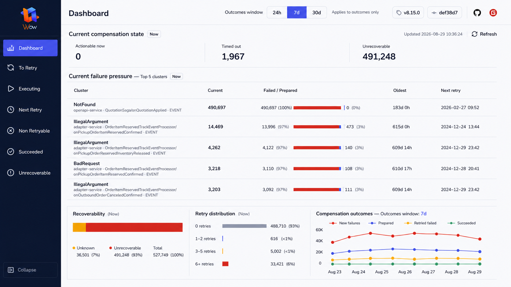

# 补偿控制面仪表盘重建设计

## 1. 背景与定位

现有 `/analytics` 页面已经通过既有 Snapshot 与 EventStream 聚合查询提供当前补偿状态、失败压力、可恢复性、重试分布和历史结果趋势。数据能力已经成立，但页面仍以“分析内容集合”组织，默认入口仍是 `/to-retry`，不符合值班人员先总览、再定位、最后进入队列处理的工作顺序。

本次把分析页升级为补偿控制面的默认 `Dashboard`。仪表盘的产品目标不是展示更多图表，而是让值班人员在 30 秒内回答：

1. 现在是否需要关注；
2. 压力集中在哪里；
3. 风险属于哪种性质；
4. 补偿结果正在改善还是恶化；
5. 下一步应进入哪个既有队列调查。

本设计只重建信息架构、路由入口和可视化，不改变聚合查询能力。`docs/superpowers/specs/2026-08-28-compensation-dashboard-analytics-design.md` 中已经实现的数据合同、查询边界、请求取消、最后成功数据、局部错误隔离和事件趋势原子性继续有效；本文只覆盖与页面定位、布局、Top 数量、图表形态、导航和测试验收有关的部分。

## 2. 最终视觉目标

最终批准稿：



视觉稿用于确认信息层级和空间关系。实现必须使用真实聚合结果，不复制稿中的静态数据或把视觉稿当成像素图片嵌入页面。

## 3. 范围

### 3.1 目标

- 将页面和导航名称从 `Analytics` 提升为 `Dashboard`。
- 将 Dashboard 设为应用默认入口和侧栏第一项。
- 保留 `/analytics` 旧地址的兼容跳转。
- 把 `24h / 7d / 30d` 提升到应用顶栏，明确命名为 `Outcomes window`。
- 时间窗口只影响历史 EventStream 结果，不改变任何当前 Snapshot 指标。
- 以失败压力 Top 5 为页面主体，在 `1280 × 720` 成功态下一屏完整展示。
- 用紧凑、可读且不依赖颜色的方式展示当前状态、风险构成和历史趋势。
- 复用现有查询、Hook、shadcn/ui、Recharts、路由和错误处理，不新增通用仪表盘框架。

### 3.2 非目标

- 不新增或修改后端 API、OpenAPI、Query Schema、`AggregationQuery` 或存储实现。
- 不修改 `compensation/dashboard/src/generated/`。
- 不增加自动轮询、持久化缓存、查询构建器、保存视图或任意字段选择器。
- 不增加告警、预测、AI、搜索、导出、环境选择、风险评分或新的补偿操作。
- 不新增失败队列，不改变既有六类队列的查询、刷新和操作行为。
- 不把 Snapshot 当前数量解释为历史事件数量。
- 不要求错误态和窄屏态强行无滚动；可读性和错误可达性优先于一屏约束。

## 4. 信息架构

### 4.1 决策顺序

页面按以下顺序组织：

1. **当前状态**：Actionable now、Timed out、Unrecoverable；
2. **压力定位**：失败压力 Top 5；
3. **风险构成**：Recoverability 与 Retry distribution；
4. **结果方向**：Compensation outcomes；
5. **处理入口**：保留侧栏六类既有队列，不在表格中伪造尚不存在的筛选深链。

所有区域都必须显示其时间语义：Snapshot 区域标记 `Now`，历史趋势标记当前 `Outcomes window`。

### 4.2 路由与导航

- 新的规范路由为 `/dashboard`。
- `/` 重定向到 `/dashboard`。
- 未匹配路由重定向到 `/dashboard`。
- `/analytics` 使用 `replace` 重定向到 `/dashboard`，保留旧书签和已分享链接。
- 侧栏顺序为 Dashboard、To Retry、Executing、Next Retry、Non Retryable、Succeeded、Unrecoverable。
- Logo 链接改为 `/dashboard`。
- Dashboard 使用现有图表类 Lucide 图标，应用顶栏标题显示 `Dashboard`。

导航项继续区分无 `FindCategory` 的 Dashboard 和六类队列，不能为了统一数组而把队列 category 改成可空类型。

## 5. 时间语义与状态归属

### 5.1 Outcomes window

顶栏显示：

- 标签 `Outcomes window`；
- `24h / 7d / 30d` 按钮组，默认 `7d`；
- 低强调说明 `Applies to outcomes only`。

该控件只改变 `useEventTrend(range, refreshToken)` 的 `range`，不得触发 `useSnapshotAnalytics`。Snapshot 指标始终代表刷新时刻的当前状态。

### 5.2 顶栏状态实现

为了让页面级控件真正位于现有 `App` 顶栏，而不增加全局状态库：

- `App` 在 Dashboard 路由上持有内存态 `outcomesRange`，默认 `7d`；
- `App` 只在 Dashboard 路由渲染时间窗口控件；
- 通过 React Router 现有 `Outlet context` 把 `outcomesRange` 和更新函数交给 Dashboard 页面；
- 不增加 React Context Provider、状态库或 URL 查询参数；
- 不写入 localStorage 或 sessionStorage，刷新页面后恢复 `7d`。

在同一应用壳内离开再返回 Dashboard 时允许保留本次会话选择；这不是持久化合同。

### 5.3 刷新

`Refresh` 仍是唯一主操作，位于当前状态行右侧，并与统一的更新时间组成紧凑状态组：

```text
Updated 2026-08-29 10:36:24 | Refresh
```

- 点击 Refresh 同时刷新 Snapshot 与当前范围的 EventStream；
- 切换 Outcomes window 只取消并重新加载 EventStream；
- 不为各区域增加独立重试按钮；
- 不自动轮询。

## 6. 页面布局

### 6.1 目标视口

主要桌面验收视口为 `1280 × 720`。在该视口且所有区域成功时：

- 页面和内容容器没有纵向或横向滚动条；
- Dashboard 标题、时间窗口、三个当前指标、Top 5、两个分布和趋势图全部可见；
- 正文字号不低于 14px；
- 长集群身份允许两行，不截断错误码和关键函数名。

高度或宽度低于目标视口时允许页面滚动和分区纵向排列，不通过继续缩小字体维持一屏。

### 6.2 布局层级

1. App 顶栏：Dashboard、Outcomes window、构建信息和仓库链接；
2. 当前状态条：三个指标、`Now`、统一更新时间和 Refresh；
3. 主体：Current failure pressure Top 5；
4. 底部信号条：Recoverability、Retry distribution、Compensation outcomes。

布局优先使用间距、对齐、分隔线和排版区分层级。避免三张大 KPI 卡、卡片套卡片和无意义阴影。

## 7. 组件设计

### 7.1 当前状态条

三个指标沿用现有查询语义：

| 指标 | 数据语义 |
| --- | --- |
| Actionable now | `RetryConditions.nextRetryCondition(now)` |
| Timed out | `PREPARED && timeoutAt <= now` |
| Unrecoverable | `RetryConditions.unrecoverableCondition` |

指标使用单一分组面和垂直分隔线，不各自包成卡片。所有数字使用 tabular nums。

### 7.2 失败压力 Top 5

现有压力聚合查询的 `limit` 从 10 改为 5，后续状态占比查询只限定这 5 个完整集群身份。表格列固定为：

- Cluster；
- Current；
- Failed / Prepared；
- Oldest；
- Next retry。

Failed / Prepared 单元格同时展示：

- 精确数量；
- 百分比；
- 细分比例条，Failed 为红色，Prepared 为蓝色。

比例条不能作为唯一信息源。`aria-label` 必须包含两类数量和比例。没有 Prepared 时仍显示 `0 (0%)`，不能隐藏蓝色语义对应的文本。

不新增复合风险评分、行操作按钮或“查看全部”。运营人员继续通过既有侧栏队列处理详细记录。

### 7.3 Recoverability

把现有环图改为简单的水平堆叠比例条：

- Recoverable：绿色；
- Unknown：琥珀色；
- Unrecoverable：红色。

比例条下始终显示分类、数量和百分比。使用 CSS 即可完成，不为这一简单比例新增新的图表抽象。

### 7.4 Retry distribution

保留现有水平条形表达：

- `0`：灰色；
- `1–2`：蓝色；
- `3–5`：琥珀色；
- `6+`：红色。

继续显示精确数量和百分比，非零且小于 1% 显示 `<1%`。达到聚合上限时继续拒绝绘图并显示截断警告。

### 7.5 Compensation outcomes

保留四条 EventStream 序列和现有数据原子性：

| 序列 | 颜色 |
| --- | --- |
| New failures | 红色 |
| Prepared | 蓝色 |
| Retried failed | 琥珀色 |
| Succeeded | 绿色 |

趋势图标题旁显示 `Outcomes window: {range}`。图表压缩为底部次级信号，但保留 Tooltip、Legend 和屏幕阅读器数据表。不得用 Snapshot 总量作为折线数据。

## 8. 数据流与并发

Snapshot 与 EventStream 仍由两个既有 Hook 管理：

```text
App outcomesRange
        |
        v
DashboardView ---------> useEventTrend(range, refreshToken)
        |
        +--------------> useSnapshotAnalytics(refreshToken)
```

- 初次进入：并行加载 Snapshot 与默认 7d EventStream；
- 切换时间窗口：仅 EventStream 重新加载；
- Refresh：两类事实源共同重新加载；
- Top 集群查询返回空数组时，不执行状态占比查询；
- Snapshot 最多 7 个聚合请求的上限保持不变，Top 数量降低不会增加请求数；
- EventStream 固定 4 个查询并保持全有或全无。

## 9. 加载、错误与空状态

保留现有五区域独立状态和最后成功数据策略：

- 首次无数据时显示稳定高度 Skeleton；
- 刷新时保留旧数据并显示 `Refreshing…`；
- 刷新失败时保留旧数据、内联显示错误和最后成功时间；
- 首次失败显示区域级错误；
- Abort 不进入可见错误状态；
- 压力表两条查询视为原子区域；
- 四条历史序列视为原子区域。

成功态的一屏验收不要求错误文案被强行压缩。错误、截断警告或超长后端消息出现时允许内容区域滚动，禁止覆盖、裁剪或隐藏错误。

## 10. 可访问性

- Outcomes window 使用带可见选中态的按钮组，并提供可访问名称。
- `Now` 和 `Outcomes window` 文本明确区分 Snapshot 与历史语义。
- Failed / Prepared、Recoverability 和 Retry distribution 都同时提供文本、数量、比例和颜色。
- Recharts 继续启用 `accessibilityLayer`。
- 趋势图保留屏幕阅读器数据表。
- 加载使用 `role="status"`，错误使用 `role="alert"`。
- 键盘焦点在时间范围、Refresh、导航和仓库链接上清晰可见。
- DOM 阅读顺序与视觉顺序一致；窄屏不使用仅视觉排序。
- 颜色对比和一屏截图不能替代键盘、屏幕阅读器与缩放测试。

## 11. 兼容性与安全边界

- `/analytics` 兼容跳转保留旧链接，但不保留第二份页面实现。
- 既有六类队列 URL 和行为不变。
- 聚合调用继续经过现有认证 Header、QueryGateway、HTTP guard、rewrite 和 Schema 校验。
- 不增加 tenant/owner 选择器，不扩大现有数据作用域。
- 不修改后端查询节点上限；当前补偿服务的既有配置继续作为运行边界。
- 不修改生成客户端，不绕过查询校验，不把路由存在视为授权证明。

## 12. 最小文件边界

实现优先修改既有文件：

| 位置 | 变化 |
| --- | --- |
| `src/features/App/App.tsx` | Dashboard 标题、Logo 默认链接、顶栏时间控件和 Outlet context |
| `src/routes/constants.tsx` | Dashboard 导航名称、顺序和路径 |
| `src/routes/Routes.tsx` | 默认路由、Dashboard 规范路由、Analytics 兼容跳转 |
| `src/features/Analytics/AnalyticsView.tsx` | Dashboard 布局、Now 状态、Top 5 和底部信号条 |
| `src/features/Analytics/AnalyticsCharts.tsx` | Recoverability 比例条、Retry 条形图和紧凑趋势图 |
| `src/features/Analytics/analyticsQueries.ts` | 压力查询 limit 从 10 改为 5 |
| 对应测试与 `e2e/dashboard.spec.ts` | 更新路由、语义、布局和交互合同 |

可以把页面导出和懒加载文件重命名为 Dashboard，但不整体重命名 Analytics 数据目录，也不新增 dashboard framework、全局 store、client class 或通用 widget 抽象。

## 13. 测试策略

### 13.1 查询与 Hook

- 压力查询 `limit = 5`，状态占比查询只包含返回的 5 个完整身份。
- Snapshot 摘要、Recoverability 和 Retry 查询合同不变。
- Outcomes window 切换只触发 4 个 EventStream 请求。
- Refresh 同时触发 Snapshot 与 EventStream。
- 默认范围为 7d，刷新页面后恢复 7d。
- Abort、旧数据和局部错误合同继续通过。

### 13.2 路由与页面

- `/`、未知路由跳转到 `/dashboard`。
- `/analytics` 使用 replace 跳转到 `/dashboard`。
- Dashboard 是侧栏第一项和 Logo 目标。
- 时间控件只在 Dashboard 顶栏出现，并明确显示作用域。
- 页面展示三个 Now 指标、Top 5、两个当前分布和四线历史趋势。
- Failed / Prepared 的文本、比例和可访问名称正确。
- 无数据、加载、刷新、局部失败和截断警告均可达。

### 13.3 浏览器验收

Playwright 使用固定聚合响应验证：

- `1280 × 720` 成功态下文档和 Dashboard 内容无横向、纵向滚动；
- 所有主要区域都与视口相交并可见；
- 不存在被遮挡或裁剪的 Compensation outcomes；
- 切换 24h/7d/30d 只发送 EventStream aggregation；
- Refresh 同时发送 Snapshot 与 EventStream aggregation；
- `/analytics` 兼容跳转和默认 `/dashboard` 正确；
- 页面没有未处理控制台错误。

同时保留更窄视口测试，验证内容可通过滚动到达、表格不会撑破整个应用壳。

## 14. 验证命令

```bash
cd compensation/dashboard
pnpm test
pnpm lint
pnpm build
pnpm exec playwright test e2e/dashboard.spec.ts
git diff --check
```

视觉验收必须在本地运行页面上，以最终视觉稿和 `1280 × 720` 实现截图组成对比输入后检查；不能仅凭测试通过或单张截图宣称视觉完成。

## 15. 完成标准

- Dashboard 成为默认入口，Analytics 旧地址兼容。
- 时间窗口位于顶栏并只影响历史结果。
- 当前 Snapshot 区域始终明确标记 Now。
- 失败压力 Top 5 是最大、最先读取的内容区域。
- 成功态在 `1280 × 720` 一屏完整展示且无滚动条。
- 真实聚合数据、局部错误、最后成功数据和截断保护保持正确。
- 不新增后端 API、生成客户端修改、全局状态库或图表依赖。
- 单元测试、Lint、Build、Playwright 和视觉对比均通过。
