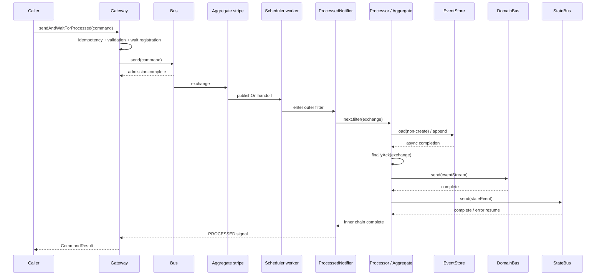
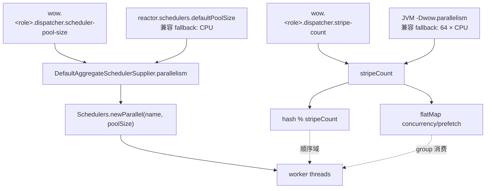
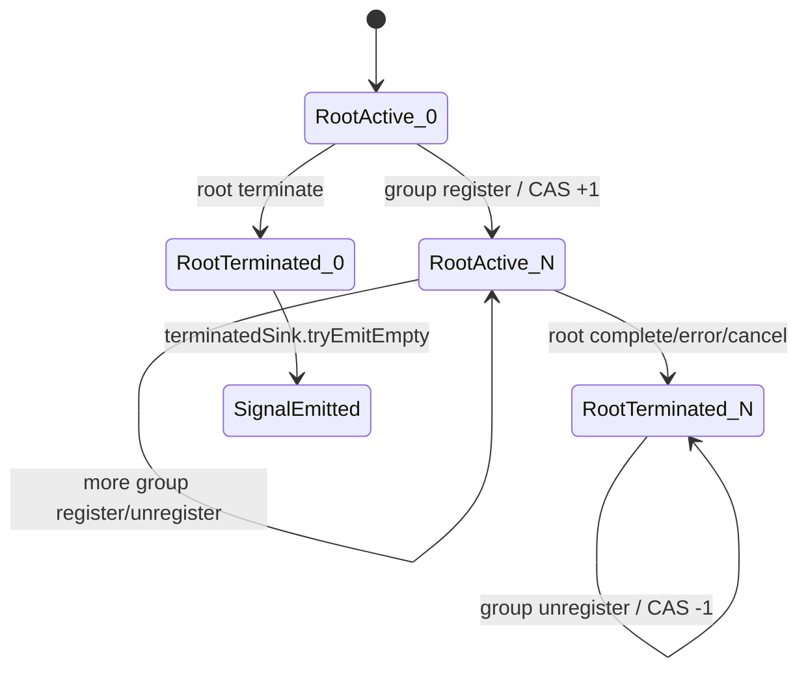
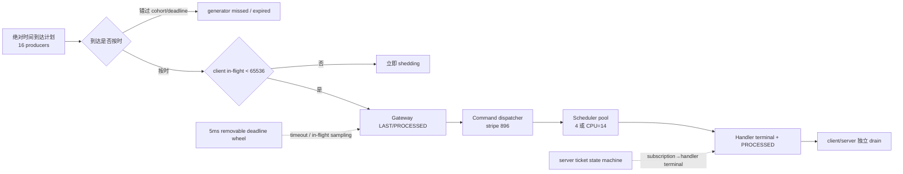
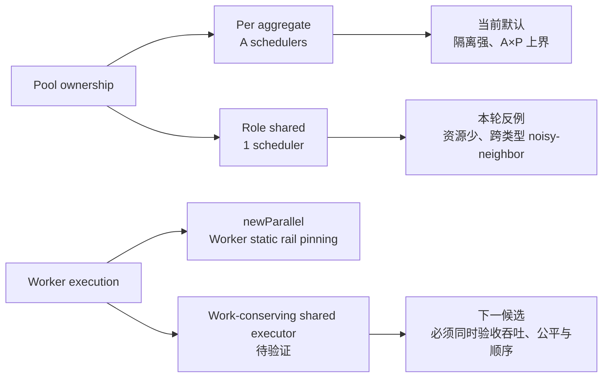

# 核心命令运行时与调度器吞吐研究（2026-07-23）

## 摘要

本次研究从 `sendAndWaitForProcessed` 入口一路追到 aggregate handler、event store 和
processed notification，并用已有历史数据、JMH 诊断和 24 轮 bounded-open-loop
实验交叉验证调度器配置与最终等待热路径。

核心结论：

1. **`MessageParallelism.DEFAULT_PARALLELISM = 64 × CPU` 是 stripe 数，不是线程数。**
   它控制 aggregate ID 的顺序域与哈希碰撞；本机 14 核时为 896 个 stripe，而生产
   Scheduler 默认为每个已装配 materialized aggregate 类型创建一个 pool size 为 14 的
   parallel Scheduler；执行线程按需启动，潜在 worker 上界仍随类型数线性增长。降低
   stripe 数会增加不同 aggregate ID 的分片级队头阻塞，但也可能降低 group/scheduling 开销：
   在本轮同质极短路径中，固定 CPU=14 的 pool，stripe 4 比 896 的点估计高 44.2%。
   新增的固定 t4、同步 100K CPU one-slow 配对实验给出了反面边界：两轮 full matrix
   中，强制同 stripe 后 fast throughput 稳定下降 91.4%–91.8%，fast-lane
   SampleTime p99 升至 8.39×–8.74×。最终代码的 distinct/pool-4 定向复测则得到
   +0.5% 的吞吐点估计（JMH error 区间重叠）与 0.98× p99，说明隔离有效，但不证明
   精确增益。因此不能把 stripe 4 设为新默认。只有在保留高 stripe key 空间、却单独
   把 `flatMap` 消费并发降到 worker 数时，才会引入 `groupBy` 消费活性风险。
2. **`schedulerPoolSize = CPU` 不是所有工作负载下的吞吐最优值，但仍是未知
   workload 下更安全的兼容默认。** 在 t16、Noop event store、极短命令路径上，
   pool 2/4 约为 318K ops/s，CPU=14 约为 223K ops/s，前者点估计高约 42%；
   加入 100,000 个 `Blackhole.consumeCPU` tokens 后，CPU=14 达到 45.4K ops/s，
   pool 4 只有 19.4K ops/s，CPU-sized pool 反而高 134.6%。在 4 个不同 stripe 的
   新 t4 实验中，加入一个同步 100K CPU 慢 aggregate、并强制 4 个 group 共用单 rail
   后，两轮 full matrix 的 fast throughput 下降 90.7%–91.3%，fast-lane p99 升至
   8.23×–8.86×；distinct/pool-4 定向复测未观察到该灾难性传播。pool 1 与 pool 4
   在 uniform 场景的相对排序跨两轮 full matrix 反转，不能作为缩小默认 pool 的依据。
   小 pool 的短路径收益必须以异质负载与尾延迟 guardrail 验收。
3. **“每 aggregate type 一个 CPU-sized pool”已确认存在资源放大，但把现有
   `newParallel` 直接改成 role-shared 也不是正确优化。** 新的配置等值 t16 组件矩阵
   先用 A=1 验证负控制（shared 仅 `+0.30%`），再把每池 P 固定为 4：A=4 时 shared
   用 4 个 worker 对 dedicated 的 16 个，吞吐仍高 `75.88%`；A=16 时 4 对 64，
   吞吐高 `112.05%`。固定角色总预算为 14 后，A=1/2/7/14 的 shared delta 仅为
   `+2.87%/+1.08%/+0.17%/+0.48%`，全部 confidence interval 重叠；因此前一矩阵
   的巨大差异来自 `A×P` 过量 worker，而不是 shared ownership 本身更快。可是固定
   总 worker=2 的两类型隔离矩阵又给出 guardrail：uniform 下 shared 的 Type B
   throughput 在 balanced/skewed 分别回退 `7.84%`/`12.51%`；Type A 加入 100K
   CPU tokens 后，Type B 回退 `96.48%`/`86.52%`，SampleTime p99 分别升高
   `2142.90%`/`460.51%`。根因是 role-shared 仍使用静态绑定 rail 的
   `newParallel`，更多跨类型 stripe worker 被共同固定到同一组单线程 executor。
   因此当前 per-type 所有权先保留为兼容默认；直接 role-shared 候选已否定，下一步
   必须把“pool 所有权”与“work-conserving 执行拓扑”分轴比较。
4. **不存在由当前证据支持的单一新默认值。** 本轮已把 `stripeCount` 与
   `schedulerPoolSize` 作为 Wow 专用角色级配置显式解耦，同时保持旧默认；部署应按
   短路径、CPU-heavy、异步 I/O、热点分布和 aggregate 类型数量分别验收。
5. **已有 localhost Mongo 证据中，持久化主瓶颈不在 Scheduler。** 框架约
   10.6µs，Mongo 路径约 335µs，存储增量约占 96.5%；`PARALLEL` 与
   `IMMEDIATE` 的真实 Mongo 差异仅约 5%，应优先优化 load/replay、snapshot、
   append、连接池与批处理。Redis 尚未做本轮真实 confirmation。
6. **逐消息共享 `AtomicInteger` 不是本轮可辨识的吞吐瓶颈。** 同一 JMH JAR 的
   benchmark-only 局部对照中，有/无额外逐消息原子包装在 pool 4 相差 +0.96%，在
   CPU=14 相差 -0.61%，JMH error 区间均重叠。两组都运行新 group lifecycle，
   不能等同于完整新旧实现 A/B。实现仍将原子操作移出逐消息热路径，因为新状态机同时
   修复了自然完成不发 `terminatedSignal` 的问题，并保留 stop-before-start 立即完成
   语义；该变更应被视为正确性与结构清理，不能宣称已验证吞吐收益。
7. **`sendAndWaitForProcessed` 的最终等待热路径存在可辨识的软件开销，已在兼容边界内
   优化。** 默认 last-result handle 等待 `PROCESSED` 或更晚阶段时，成功 `SENT` 对
   完成条件与空结果合并不可见；跳过其信号构造/状态迁移，并延迟结果 Map 分配、避免
   无用 wait-function 物化后，同一 JMH JAR 的正式 t16 对照由
   `315,820.63 ±7,649.52` 提升到 `346,410.11 ±4,545.56 ops/s`（`+9.69%`，
   error 区间不重叠），规范化分配由 `3971.67` 降到 `3528.91 B/op`
   （`-11.15%`）。旧行为通过 benchmark-only coordinator proxy 恢复，额外包含一个
   内层 Reactor `doOnSuccess` operator 与一次 coordinator 查找，可能高估旧成本；
   精确旧/新独立 JAR 运行同向为 `+13.81%` 与
   `-9.88% B/op`，但不能当作同二进制配对。流式等待、`SENT` 目标、错误快速失败和
   public 自定义 handle 均保留原通知语义。
8. **开放环结果支持保留 CPU-sized Scheduler 默认，但不支持把它解释为精确生产
   容量。** 在 high-cardinality、Noop-store runner、14-core、16 个同 JVM producer 的
   bounded-open-loop 矩阵中，pool 4 只在 340K/s 未发生 shedding/timeout，360K/s 已进入
   83.67%–99.43% yield 的不稳定区；CPU=14 在 360K/s 三轮均达到约 99.999% yield、
   无 shedding/timeout、all-offered p99 为 2.43–3.89ms，380K/s 开始触达
   `maxInFlight`。最大已测试且无 shedding 的 offered point 从 340K/s 变为 360K/s
   （网格差 `+5.88%`），也与 CPU-heavy/HOL guardrail 同向。但这不是实际容量增益下界；
   load generator、watchdog 与 14 个 Scheduler worker 共享同一
   JVM/14 个核心，且两组非交错、source dirty。后续 observer-ablation 在 340K/360K
   offered-rate 封顶点没有改变容量分类；380K 过载点虽出现 `NO_LATENCY` 相对 `FULL`
   高 8.5%–10.5% 的信号，但绝对吞吐随时间下滑，而相同 recorder 的组件微基准只有
   8.07–15.05ns/request，直接归因缺乏数量级支持。因此不能用这 9.9% 修正历史容量，
   也不能归因给 `SampleBuffer` 稳态写入。360K/s 仍只能视为 **instrumented tested point**，
   不能写成框架原生或生产 SLO 容量。生产默认仍不改；后续 formal task 已拒绝 dirty
   source，并对 generator expiry、missed ratio 与 lag p99 设置显式有效性门槛。
9. **共享 `RetryBackoffSpec` 基础模板不是有效优化。** 同一 JMH JAR 的 t16/pool4
   A/B 中，共享路径为 `346,164 ±5,209 ops/s`，旧的逐 processor assembly 为
   `351,512 ±7,437 ops/s`，区间重叠；规范化 allocation 分别为
   `3536.784` 与 `3536.726 B/op`，不可区分。候选生产改动已回退，只保留
   non-recoverable 与 exhausted retry 语义测试，避免用源码层“少创建对象”代替真实收益。
10. **allocation profile 能指导候选排序，但本轮新增的 target/locality、通知扁平化与
   Header backing 候选均没有通过吞吐验收。** 正式 2×2 同 JAR confirmation 只确认
   共享 processed target 减少 `24.309 ±2.098 B/op`，throughput 条件效应却发生符号
   翻转；扁平 notification extractor 在 t16/pool4 下 allocation 反而多
   `0.02 B/op`；保持 insertion order 的 compact Header 虽稳定少约 `216 B/op`，
   两轮短时 throughput 均值只比 baseline 高约 `0.3%`，COW 还比 eager copy 多约
   `8 B/op`。这些候选及 benchmark proxy 均已回退，不列为吞吐优化。

## 范围、完成标准与证据等级

研究范围：

- 本地命令入口：`DefaultCommandGateway`、`InMemoryCommandBus`；
- 核心 dispatch：`CommandDispatcher`、`AggregateCommandDispatcher`、
  `AggregateDispatcher`；
- aggregate 与存储：`DefaultCommandHandler`、`SimpleCommandAggregate`、
  `EventStore`；
- 并发参数：stripe count、`flatMap` concurrency/prefetch、Scheduler pool size；
- 生命周期：complete、error、cancel、stop-before-start；
- benchmark：Noop E2E、synthetic CPU-heavy、历史模拟 I/O、真实 Mongo。
- arrival model：closed-loop regression、固定 t4 HOL、bounded-open-loop overload。
- 热点边界：固定 aggregate ID、一个异质慢 handler、stripe/worker HOL 与 fast-lane
  SampleTime。
- 多类型边界：配置等值的 `A×P` 资源放大、固定总 worker 的 topology 因果控制、
  per-type secondary throughput 与 noisy-neighbor p99。
- 最终等待：成功/失败 `SENT`、stream/last、自定义 `WaitHandle` SPI、空结果复制与
  wait header 提取。
- profile：async-profiler/JDK JFR 原始文件有效性、sampled allocation caller 排序，
  以及 JMH GC profiler 的精确 per-operation allocation。

完成标准：

- 用真实源码建立可核验调用链；
- 明确区分 stripe、worker、调用线程和异步 I/O 并发；
- 不用单一 Noop benchmark 外推通用默认；
- 用独立 fast-lane 指标区分慢请求自身延迟、stripe HOL 与 worker rail HOL；
- 对额外逐消息原子包装使用同 JAR 局部对照，明确它不等同于完整旧实现；
- 对 last-result 快路同时使用同 JAR 旧行为 proxy 与精确旧/新独立 JAR 交叉验证；
- 对 profile 驱动候选先校验 profiler 原始产物与采样边界，再用同 JAR 或明确降级的
  exploratory screen 验证；没有吞吐信号的候选必须回退；
- 用 server-side ticket、deadline wheel 和 generator fidelity guardrail 验证开放环
  PROCESSED 容量，不能用 client in-flight 清零冒充 dispatcher drain；
- 多类型 Scheduler 对照必须同时包含单类型负控制、实际 worker 拓扑断言和固定总
  worker 预算，不能把更多线程当成所有权收益；
- 运行核心测试、benchmark check、JMH 编译和正式 confirmation profile；
- 给出可执行的配置演进与下一轮验收矩阵。

证据等级：

| 等级 | 含义 | 本文对应证据 |
|---|---|---|
| `CONFIRMED_CLEAN` | clean commit、可追溯 JAR、正式 profile | 已有 MPSC confirmation |
| `PAIRED_SAME_JAR_DIRTY` | 同一 dirty JAR 的局部对照，只隔离额外包装/通知 | task counter proxy、last-wait SENT proxy |
| `DIRECTIONAL_DIRTY` | dirty JAR、正式 profile，适合方向判断 | 新 pool/stripe/CPU/HOL 矩阵 |
| `INSTRUMENTED_DIRTY_OPEN_LOOP` | dirty JAR、同 JVM generator/probe，只能判断容量区间 | 24 轮 PROCESSED offered-rate 矩阵 |
| `EXPLORATORY_DIRTY` | 短时、可能跨 dirty JAR，只用于筛选和否定候选 | allocation profile、flat/Header pilot |
| `HISTORICAL_DIAGNOSTIC` | 历史报告或快速 profile | 跨线程、Mongo 与模拟 I/O |

当前分支基线为
[`6c6e4ebbe891fed0752f635391b1b034c988dd66`](https://github.com/Ahoo-Wang/Wow/commit/6c6e4ebbe891fed0752f635391b1b034c988dd66)。
所有新实验使用 OpenJDK 17.0.7、macOS arm64、14 个 available processors、24GiB
物理内存。前四组 confirmation 为 `2 × 3s` warmup、`3 × 5s` measurement、
2 forks、t16、G1、4GiB heap 和 GC profiler；HOL 实验使用同样的 warmup/measurement
时长、固定 t4 group、3 forks、`thrpt,sample`，不启用 profiler。
多类型配置等值实验使用 `2 × 2s` warmup、`4 × 3s` measurement、3 forks、t16
与 GC profiler；固定 2-worker 隔离实验使用 `2 × 2s` warmup、`3 × 3s`
measurement、3 forks、固定 t8 group 和 `thrpt,sample`，不启用 profiler。
开放环矩阵使用同一 runner JAR、每点 3 个隔离 JVM、10s warmup、20s measurement、
16 producers、`maxInFlight=65536` 与 5s deadline；pool4 全组先于 CPU 全组运行，
不是随机化/交错配对。

## 视角一：架构与职责边界

### 命令主链

```mermaid
flowchart LR
    A["调用方<br/>sendAndWaitForProcessed"] --> B["DefaultCommandGateway<br/>幂等检查 / 校验 / wait 注册"]
    B --> C["InMemoryCommandBus<br/>MPSC admission"]
    C --> D["CommandDispatcher<br/>按 NamedAggregate 拆分"]
    D --> E["AggregateDispatcher<br/>groupBy(hash % stripeCount)"]
    E --> F["flatMap<br/>concurrency = prefetch = stripeCount"]
    F --> G["publishOn<br/>aggregate Scheduler"]
    G --> H["concatMap<br/>同 stripe 严格串行"]
    H --> I["DefaultCommandHandler<br/>filter chain"]
    I --> J["ProcessedNotifierFilter<br/>外层包装"]
    J --> K["RetryableAggregateProcessor<br/>repository load / retry"]
    K --> L["SimpleCommandAggregate<br/>invoke / source / EventStore.append"]
    L --> M["exchange finallyAck"]
    M --> N["DomainEventBus.send"]
    N --> O["StateEventBus.send<br/>error resume"]
    O --> P["PROCESSED success signal"]
    P --> A
```



<!-- Sources:
wow-core/src/main/kotlin/me/ahoo/wow/command/DefaultCommandGateway.kt
wow-core/src/main/kotlin/me/ahoo/wow/modeling/command/dispatcher/CommandDispatcher.kt
wow-core/src/main/kotlin/me/ahoo/wow/messaging/dispatcher/AggregateDispatcher.kt
wow-core/src/main/kotlin/me/ahoo/wow/modeling/command/SimpleCommandAggregate.kt
wow-core/src/main/kotlin/me/ahoo/wow/modeling/command/dispatcher/AggregateProcessorFilter.kt
wow-core/src/main/kotlin/me/ahoo/wow/modeling/command/dispatcher/SendDomainEventStreamFilter.kt
wow-core/src/main/kotlin/me/ahoo/wow/eventsourcing/state/SendStateEventFilter.kt
wow-core/src/main/kotlin/me/ahoo/wow/command/wait/NotifierFilters.kt
-->

对应源码：

- Gateway 在发送前执行 idempotency 与 validation，再调用 `commandBus.send`：
  [`DefaultCommandGateway.kt`](https://github.com/Ahoo-Wang/Wow/blob/6c6e4ebbe891fed0752f635391b1b034c988dd66/wow-core/src/main/kotlin/me/ahoo/wow/command/DefaultCommandGateway.kt#L78-L126)。
- `CommandDispatcher` 为每个 `NamedAggregate` 创建独立
  `AggregateCommandDispatcher`，并从 supplier 获取 Scheduler：
  [`CommandDispatcher.kt`](https://github.com/Ahoo-Wang/Wow/blob/6c6e4ebbe891fed0752f635391b1b034c988dd66/wow-core/src/main/kotlin/me/ahoo/wow/modeling/command/dispatcher/CommandDispatcher.kt#L36-L70)。
- aggregate ID 通过 `mod(parallelism)` 映射到 stripe：
  [`MessageParallelism.kt`](https://github.com/Ahoo-Wang/Wow/blob/6c6e4ebbe891fed0752f635391b1b034c988dd66/wow-core/src/main/kotlin/me/ahoo/wow/messaging/dispatcher/MessageParallelism.kt#L25-L43)。
- 非创建命令先通过 repository 从 snapshot/event store 恢复状态：
  [`RetryableAggregateProcessor.kt`](https://github.com/Ahoo-Wang/Wow/blob/6c6e4ebbe891fed0752f635391b1b034c988dd66/wow-core/src/main/kotlin/me/ahoo/wow/modeling/command/RetryableAggregateProcessor.kt#L54-L70)。
- 成功产生事件的命令在 aggregate process 内 append：
  [`SimpleCommandAggregate.kt`](https://github.com/Ahoo-Wang/Wow/blob/6c6e4ebbe891fed0752f635391b1b034c988dd66/wow-core/src/main/kotlin/me/ahoo/wow/modeling/command/SimpleCommandAggregate.kt#L119-L132)。
- append 后先 ack，再依次发送 domain/state event，内层 chain 完成后才发成功
  `PROCESSED`：
  [`AggregateProcessorFilter.kt`](https://github.com/Ahoo-Wang/Wow/blob/6c6e4ebbe891fed0752f635391b1b034c988dd66/wow-core/src/main/kotlin/me/ahoo/wow/modeling/command/dispatcher/AggregateProcessorFilter.kt#L26-L50)、
  [`SendDomainEventStreamFilter.kt`](https://github.com/Ahoo-Wang/Wow/blob/6c6e4ebbe891fed0752f635391b1b034c988dd66/wow-core/src/main/kotlin/me/ahoo/wow/modeling/command/dispatcher/SendDomainEventStreamFilter.kt#L25-L47)、
  [`SendStateEventFilter.kt`](https://github.com/Ahoo-Wang/Wow/blob/6c6e4ebbe891fed0752f635391b1b034c988dd66/wow-core/src/main/kotlin/me/ahoo/wow/eventsourcing/state/SendStateEventFilter.kt#L37-L77)、
  [`NotifierFilters.kt`](https://github.com/Ahoo-Wang/Wow/blob/6c6e4ebbe891fed0752f635391b1b034c988dd66/wow-core/src/main/kotlin/me/ahoo/wow/command/wait/NotifierFilters.kt#L49-L70)。

### 职责表

| 层 | 控制什么 | 不控制什么 |
|---|---|---|
| Gateway | 幂等、校验、等待计划、发送/结果关联 | aggregate 顺序、worker 数 |
| Command bus | 多 producer admission、消息交付 | handler 执行并行度 |
| stripe | 相同 aggregate ID 的顺序域、碰撞后的 HOL | 真实线程数 |
| `flatMap` | 同时订阅/消费多少 group | 每个 group 内并发 |
| Scheduler pool | CPU 执行 rail 与跨线程隔离 | 异步 I/O 的在途上限 |
| `concatMap` | 一个 stripe 内严格串行 | stripe 之间公平性 |
| Event store | load/replay/append 延迟与可扩展性 | dispatch stripe 数 |

## 视角二：运行时行为与并发模型

### `sendAndWaitForProcessed` 时序



<!-- Sources:
wow-core/src/main/kotlin/me/ahoo/wow/command/CommandGateway.kt
wow-core/src/main/kotlin/me/ahoo/wow/messaging/InMemoryMessageBus.kt
wow-core/src/main/kotlin/me/ahoo/wow/messaging/dispatcher/AggregateDispatcher.kt
wow-core/src/main/kotlin/me/ahoo/wow/modeling/command/dispatcher/AggregateProcessorFilter.kt
wow-core/src/main/kotlin/me/ahoo/wow/modeling/command/dispatcher/SendDomainEventStreamFilter.kt
wow-core/src/main/kotlin/me/ahoo/wow/eventsourcing/state/SendStateEventFilter.kt
wow-core/src/main/kotlin/me/ahoo/wow/command/wait/NotifierFilters.kt
-->

`publishOn` 将后续信号切换到 Scheduler worker；每个订阅获得一个 worker，多个 group
可轮转到同一线程。Reactor 官方文档明确区分 `publishOn` 的执行上下文语义：
[Threading and Schedulers](https://projectreactor.io/docs/core/release/reference/coreFeatures/schedulers.html)。

### 四种并发不是同一个数

| 维度 | 本机默认 | 作用 |
|---|---:|---|
| JMH/调用线程 | 实验中 16 | 并发 producer / closed-loop waiter |
| `stripeCount` | `64 × 14 = 896` | 顺序分片、碰撞稀释、最大 group key 数 |
| `flatMap concurrency` | 896 | 消费所有可能的 group |
| Scheduler workers | 每个 materialized aggregate 类型最多 14，按任务懒启动 | 实际同步 CPU 执行 rail |
| 异步 I/O in-flight | 由活跃 stripe、store/driver/连接池共同决定 | 不等于 worker 数 |

同 aggregate ID 一定进入同一 stripe，并受 `concatMap` 串行约束；不同 ID 如果哈希碰撞，
也会被无关地串行。增加 worker 无法突破热点单 aggregate 上限，增加 stripe 也无法让同一
aggregate 并发。

`groupBy` 产生的 group 必须持续被消费；Reactor 也提醒高基数 `groupBy` 需要足够的下游
消费并发，否则上游可能挂起：
[Three Sorts of Batching](https://projectreactor.io/docs/core/release/reference/advancedFeatures/advanced-three-sorts-batching.html)。
当前 key 空间本身就是 `stripeCount`，所以 `flatMap(concurrency = stripeCount)` 是一个
保守的完整消费策略。当前同一个 `parallelism` 同时缩小 key 空间与消费并发，因此整体
调低它不会单独造成 liveness 缺口，但会增加哈希碰撞/HOL；真正危险的是未来解耦后保留
高 stripe key 空间、却把 `flatMap concurrency` 简单降成 worker 数。

## 视角三：依赖、配置与集成

### 两个被混淆的“parallelism”



<!-- Sources:
wow-core/src/main/kotlin/me/ahoo/wow/messaging/dispatcher/MessageParallelism.kt
wow-core/src/main/kotlin/me/ahoo/wow/scheduler/AggregateSchedulerSupplier.kt
reactor-core 3.8.6 Schedulers.java
-->

| 参数/入口 | 当前默认 | 范围 | 问题 |
|---|---:|---|---|
| `-Dwow.parallelism` | `64 × CPU` | 未显式配置角色 stripe 的 dispatcher | 名称容易被误解为线程数，仅保留兼容 fallback |
| `wow.<role>.dispatcher.stripe-count` | fallback 到左项 | command/event/projection/stateless saga | Wow 专用顺序分片配置 |
| `reactor.schedulers.defaultPoolSize` | CPU | 未显式配置角色 pool 时的 Reactor 全局 fallback | 影响范围大，不应作为首选调优旋钮 |
| `wow.<role>.dispatcher.scheduler-pool-size` | fallback 到左项 | command/event/projection/stateless saga | Wow 专用、每 named aggregate 的 worker 配置 |
| `DefaultAggregateSchedulerSupplier(name, parallelism)` | CPU | 一个 supplier | 参数名仍叫 parallelism，实际是 pool size |
| `CommandDispatcher(..., schedulerSupplier)` | 默认 supplier | 单 dispatcher | 核心 API 已原生解耦 stripe 与 pool |
| Spring role dispatcher bean | 自动创建 | bounded context | 角色属性显式接线；自定义 dispatcher bean 仍可整体替换 |

`DefaultAggregateSchedulerSupplier` 为每个 materialized aggregate 创建并缓存一个
`Schedulers.newParallel(name, poolSize)`：
[`AggregateSchedulerSupplier.kt`](https://github.com/Ahoo-Wang/Wow/blob/6c6e4ebbe891fed0752f635391b1b034c988dd66/wow-core/src/main/kotlin/me/ahoo/wow/scheduler/AggregateSchedulerSupplier.kt#L99-L138)。
dispatcher 装配时会为已注册类型创建 Scheduler/executor 结构；`newParallel` 的线程
按首次调度按需启动，而不是构造时一次性启动全部线程。因此潜在 worker 上界接近
`materializedAggregateTypes × schedulerPoolSize`，实际存活线程数取决于各类型是否
承担任务；类型较多时仍可能造成线程、队列与缓存局部性碎片化。

更精确地，令 `A` 为已装配类型数、`P` 为每池 worker、`S` 为 stripe 数、`G_a`
为类型 `a` 实际订阅的活跃 stripe 数，则当前 command role 的活跃 worker 上界为：

```text
T_live <= Σ min(P, G_a) <= A × min(P, S) <= A × P
```

`MainDispatcher.start()` 会为 `namedAggregates` 中的全部类型建立 child dispatcher
与 Scheduler；空闲类型可能只持有 executor/queue 结构而尚未启动 Java thread，活跃
类型足够多时才逼近 `A×P`。`stripeCount` 不参与 pool 数计算，也不能通过降低 P
自动降低 ordering-domain 数量。

本轮多类型组件基准已经把该风险实测为 1/4/16 个 Scheduler 和 4/16/64 个已激活
worker，并证明短命令路径上的 `A×P` 没有形成吞吐收益；但固定预算隔离基准同时证明，
把这些类型直接共享到同一个 `newParallel(P)` 会把跨类型 stripe worker 固定到同一组
rail，造成严重 noisy-neighbor。Scheduler supplier 还由一个 dispatcher 生命周期独占，
`CommandDispatcher.stopGracefully()` 会停止整个 supplier，因此不能把同一 supplier
随意共享给多个独立 role/dispatcher。

基线版本的 Spring 自动配置直接构造 `CommandDispatcher`，未注入 Wow 专用
pool/stripe properties：
[`AggregateAutoConfiguration.kt`](https://github.com/Ahoo-Wang/Wow/blob/6c6e4ebbe891fed0752f635391b1b034c988dd66/wow-spring-boot-starter/src/main/kotlin/me/ahoo/wow/spring/boot/starter/modeling/AggregateAutoConfiguration.kt#L136-L154)。
本轮工作树已通过四个独立 `*DispatcherProperties` 与对应 AutoConfiguration 关闭该缺口；
Snapshot dispatcher 暂未纳入。

## 视角四：有效模式、反模式与生命周期

### 有效模式与风险

| 类型 | 判断 | 原因 |
|---|---|---|
| `groupBy + concatMap` | 保留 | 清晰实现同一顺序域串行 |
| 可配置的 stripe 数 | 保留高兼容默认 | 低值可减少同质短路径开销，高值可稀释碰撞；必须联合吞吐与尾延迟验收 |
| `publishOn` 隔离 | 保留默认 | 防止 handler 在发送线程重入并隔离延迟/故障传播 |
| 每 aggregate type 独占 CPU-sized pool | 有风险 | 多类型时线程上界膨胀，短路径上也可能过度配置 |
| `Schedulers.immediate()` 全局替换 | 不接受 | 虽快，但改变重入、隔离和调用线程延迟语义 |
| 无界入口/分组队列 | 过载风险 | admission TPS 可能高于 processed TPS，最终转成内存与尾延迟 |
| 逐消息共享原子计数 | 已移除 | 模型上属于跨 worker 共享缓存行，但本轮未测出可辨识收益 |
| 只观察 SENT TPS | 不充分 | 无法证明 store 后的可持续 processed throughput |

### 新终止状态机

旧实现为每条消息执行一次共享 `AtomicInteger.incrementAndGet/decrementAndGet`，并依赖
“subscriber 已 disposed 且计数归零”发出终止信号。自然 complete 时可能永远不发信号，
而 stop-before-start 依靠 `stopGracefully` 的显式零计数分支完成。移除逐消息 counter
时必须保留后一个边界，不能只依赖 `BaseSubscriber.hookFinally`。

新实现把原子状态移到低频 group 生命周期：



<!-- Sources:
wow-core/src/main/kotlin/me/ahoo/wow/messaging/dispatcher/AggregateDispatcher.kt
reactor-core 3.8.6 BaseSubscriber.java and FluxFlatMap.java
-->

root terminated flag 与 active group count 共用一个 `AtomicLong` CAS 状态：

- group 注册先赢 CAS：root 一定看到非零计数；
- root 先赢 CAS：后续 group 注册被拒绝；
- 只有 root 已终止且 group count 为零时发信号；
- CAS 只发生在 group 首次订阅/终止，不再发生在每条命令上；
- start 管道的 `doFinally` 处理自然 complete/error/cancel；
- `stopGracefully` 额外幂等标记，覆盖 stop-before-start 与 start/stop 注册窗口。

这里的 shutdown 语义是**取消并等待取消传播完成**：root 和所有已订阅 group 都观察到
complete/error/cancel 后，`terminatedSignal` 才结束。`stopGracefully()` 不会 drain
队列或等待活跃命令业务成功完成；活跃 handler 和尚未处理的消息会随订阅取消。

Reactor 3.8.6 的取消传播审计基于：

- [`BaseSubscriber`](https://github.com/reactor/reactor-core/blob/v3.8.6/reactor-core/src/main/java/reactor/core/publisher/BaseSubscriber.java)；
- [`FluxFlatMap`](https://github.com/reactor/reactor-core/blob/v3.8.6/reactor-core/src/main/java/reactor/core/publisher/FluxFlatMap.java)。

## 视角五：Benchmark、解释与实战决策

### 1. 跨线程成本的上下界

历史隔离 benchmark 中，`IMMEDIATE` 相对 `PARALLEL` 为 20–25 倍；但真实 Mongo
端到端只高约 5%：

| 场景 | `PARALLEL` | `IMMEDIATE` | 解释 |
|---|---:|---:|---|
| 隔离 dispatcher chain | 约 145–188K ops/s | 约 3.4–3.9M ops/s | 跨线程往返主导 |
| Mongo t1 | 2,961 ops/s | 3,119 ops/s | `IMMEDIATE` +5.3% |
| Mongo t4 | 10,272 ops/s | 10,867 ops/s | `IMMEDIATE` +5.8% |

本轮在最终代码前又定向复跑同一个 single-hot-aggregate component：
`PARALLEL = 174,738 ±38,483 ops/s`、约 `696 B/op`，
`IMMEDIATE = 6,262,467 ±574,132 ops/s`、`512 B/op`。该 component 的
AsyncProfiler reverse flamegraph 中，`__psynch_cvwait` 与 `__psynch_cvsignal`
leaf samples 合计约 82.7%，进一步支持“隔离短链由跨线程等待/唤醒主导”的归因。
这是 component ceiling，不是移除生产 Scheduler 的依据；真实 Mongo 对照仍说明存储
会淹没绝大部分该成本。

框架/存储分解：

| 场景 | 吞吐 | 推算延迟 |
|---|---:|---:|
| Noop ceiling | 94,539 ops/s | 10.6µs |
| In-memory store | 86,661 ops/s | 11.5µs |
| Mongo | 2,984 ops/s | 335µs |

Mongo 增量约 323µs，占总延迟约 96.5%。详见
[命令调度链跨线程开销归因报告](./2026-07-22-dispatch-chain-cross-thread-attribution.md)。

### 2. 新鲜 Scheduler pool 扫描

场景：`CommandIngressE2EDiagnosticBenchmark.sendAndWaitProcessed`、t16、
`current-production` MPSC、Noop event store、NoOp validation/idempotency、
每次命令使用新 aggregate ID。

Run ID：`00c48718-75c8-467b-a63f-ab7674fe97bd`；
JMH JAR SHA-256：
`0954a16959869336e74f48a90240d2a6d36d8ba56a730d05b4d663be23be0da3`。

| Pool | Throughput | JMH error | 相对 CPU=14 |
|---:|---:|---:|---:|
| 1 | 253,619.52 ops/s | ±15,772.13 | +13.5% |
| 2 | **318,207.50 ops/s** | ±15,723.37 | **+42.4%** |
| 4 | **317,232.79 ops/s** | ±14,943.30 | **+42.0%** |
| 8 | 253,793.47 ops/s | ±2,408.43 | +13.6% |
| CPU=14 | 223,454.91 ops/s | ±1,273.54 | baseline |

当前样本无法分辨 pool 2 与 pool 4 的差异；两者都是最高点估计，且与 CPU=14 的
JMH error 区间不重叠。这是在该 synthetic、dirty、2-fork benchmark 中观察到的明确
方向，不足以证明 CPU-sized pool 对所有极短生产命令都过大。

### 3. stripe × pool 二维扫描

场景与上一节相同，并固定 `taskCounterStrategy=group-lifecycle`、
`handlerCpuTokens=0`；新增 `stripeCount = 4, 16, 64, 896` 与
`schedulerPoolSize = 2, 4, 8, CPU` 的 4 × 4 正式扫描。

Run ID：`b6cf7ee9-912a-4b5b-8ef2-5c912d2bbfb7`；
JMH JAR SHA-256：
`f2f2f266e2aa3d5cdb685621e5364cdae469d95d900f4eac564766e8068cf8da`。

| Stripe | Pool 2 | Pool 4 | Pool 8 | CPU=14 |
|---:|---:|---:|---:|---:|
| 4 | 348,843 ±26,002 | 308,581 ±59,193 | 317,835 ±6,815 | **321,136 ±1,750** |
| 16 | 326,984 ±32,574 | 318,404 ±17,256 | 252,512 ±3,032 | 226,501 ±2,208 |
| 64 | 320,563 ±16,018 | 314,958 ±10,179 | 253,047 ±6,568 | 220,235 ±2,180 |
| 896 | 303,516 ±9,740 | 317,381 ±7,702 | 254,573 ±4,975 | **222,700 ±825** |

这组结果显示出明显的参数交互模式：stripe 效应会随 pool 改变，不能只按两个参数各自
的单独排序选值。本轮未做正式 interaction significance test，因此只作方向性判断：

- 固定 CPU=14 pool，stripe 4 比 896 的点估计高 44.2%；固定 pool 8 时高 24.9%，
  固定 pool 2 时高 14.9%，三组 JMH error 区间均不重叠；
- 固定 pool 4 时四个 stripe 的区间重叠，且 stripe 4 的第二 fork 波动明显，当前样本
  无法分辨；
- stripe 4 时最多只有四个串行 group 活跃，pool 2、8、CPU=14 的区间重叠，不能证明
  348.8K 的最高点估计对应唯一最佳 pool；
- stripe 4 的规范化 allocation 约为 3,796–3,808 B/op，stripe 896 约为
  3,886–3,920 B/op。较少 group/scheduling 开销是与数据一致的机制推断，但这点
  allocation 差异不能单独解释或证明全部吞吐变化。

限制决定了该结果只能用于方向判断：每次命令使用新 aggregate ID、handler 成本相同、
Noop store、t16 closed loop，且没有 p95/p99。现实中的慢 handler、热点 ID 或异质任务
可能把 stripe 碰撞转换为队头阻塞；第 5 节的固定 ID/one-slow 配对随后验证了这个机制
边界。因此保留 896 的兼容默认，同时把 stripe 暴露为角色级配置，比直接改成 4 更合理。

### 4. CPU-heavy 反例

为避免把 pool 4 错设为通用默认，benchmark 新增 `handlerCpuTokens`，在 aggregate
Scheduler worker 上执行 synthetic CPU work。

Run ID：`1fa976db-2550-4b2a-af72-0d26a50c9b77`；
JMH JAR SHA-256：
`14c8fac7e14399026c13c8067e8794e22614fed557f29436e95181a9d5b0306b`。

| CPU tokens | Pool 4 | CPU=14 | 判断 |
|---:|---:|---:|---|
| 0 | 317,558.95 ±6,059.69 | 223,354.83 ±1,293.95 | pool 4 +42.2% |
| 100,000 | 19,376.30 ±96.45 | 45,449.12 ±445.80 | CPU=14 +134.6% |

两个 synthetic workload 给出相反排序，且区间明显分离：CPU=14 在 100,000 tokens
时显著优于 pool 4。这里只比较了 4 与 14，未证明 14 是 CPU-heavy 的全局最优值；
但它足以构成“固定把默认改成 4”的反例。保留兼容默认、增加 Wow 专用配置与 profile
才是可演进方案。

### 5. 异质 handler 的 stripe HOL 与 worker rail HOL

为补上前述“新 aggregate ID、同质 handler、无 p99”的证据缺口，本轮增加独立
`CommandIngressHeadOfLineBenchmark`。固定 `stripeCount=16` 与 4 个 aggregate ID，
一个 JMH group 使用 1 个 control producer 和 3 个 observed-fast producer：

- `DISTINCT`：4 个 ID 分别映射到 4 个 stripe；
- `COLLIDING`：4 个不同 ID 显式映射到同一个 stripe；
- `UNIFORM`：control 与 fast handler 都不增加 CPU work；
- `ONE_SLOW`：只对 control aggregate 增加 100,000 个
  `Blackhole.consumeCPU` tokens；
- `POOL4`：4 个活跃 group 可分别获得一个 Scheduler rail；
- `POOL1`：不同 stripe 的 4 个 group 共享一个 Scheduler rail。

每次调用仍创建新的 command ID/request ID，只复用 aggregate ID。表中吞吐与 JMH error
取 `secondaryMetrics.observedFastAggregates`；p99 来自同一 secondary metric 的
SampleTime percentile，不使用混合快慢请求的 primary metric。

最终代码 full matrix 的 Run ID 为
`3190552b-4628-4ce7-aae0-dae782e0938b`，JMH JAR SHA-256 为
`437e0944a4c5a1be8b02b51c7ee18c0b83f53a3074bb5b76c0fbbbe08badda8d`：

| 分组 / pool | Uniform fast throughput | One-slow fast throughput | 点估计变化 | Uniform fast p99 | One-slow fast p99 |
|---|---:|---:|---:|---:|---:|
| Distinct stripes / 4 | 186,587 ±2,503 ops/s | 169,712 ±36,159 ops/s | -9.0%，区间重叠 | 33.664µs | 32.512µs（0.97×） |
| Same stripe / 4 | 180,373 ±8,150 ops/s | 15,496 ±413 ops/s | **-91.4%** | 34.368µs | **288.256µs（8.39×）** |
| Distinct stripes / 1 | 168,124 ±19,983 ops/s | 15,629 ±504 ops/s | **-90.7%** | 30.656µs | **252.416µs（8.23×）** |

distinct/pool-4 one-slow 的 9 个 throughput measurement 中有一个孤立低观测
112,520 ops/s，其余 8 个为 173,508–179,038 ops/s；不能事后删除该样本，所以正式
结果仍保留 `169,712 ±36,159`，只能判断区间内没有灾难性 fast-lane collapse，
不能把 -9.0% 解释为可辨识损失。为减少全矩阵顺序与热状态干扰，又用同一最终 JMH JAR
只复测 distinct/pool-4：

Run ID：`c5e1316b-7397-4b53-beed-675afdbc6da9`。

| 定向复测 | Uniform fast | One-slow fast | 点估计变化 | Uniform fast p99 | One-slow fast p99 |
|---|---:|---:|---:|---:|---:|
| Distinct stripes / 4 | 173,591 ±2,950 ops/s | 174,476 ±11,309 ops/s | +0.5%，区间重叠 | 30.240µs | 29.696µs（0.98×） |

定向复测的 throughput error 区间分别约为 170,640–176,541 与
163,167–185,785 ops/s；结果支持“本实验未观察到 slow control 向独立 fast rail 的
灾难性传播”，但不是统计等价性或 +0.5% 增益证明。group 总吞吐仍因 slow control
从 231,570 降至 178,796 ops/s（-22.8%），slow control 只完成 4,320 ops/s；
fast-lane 保持不等于慢业务没有成本。

pre-review full matrix
`ef55684b-1ae4-4f51-a651-4224aeed19fe` 使用不同 JMH JAR，只作为方向复现：
same-stripe/pool-4 的 fast throughput 下降 91.8%、p99 为 8.74×，
distinct/pool-1 分别为 91.3% 与 8.86×。最终 full matrix 中，same-stripe 三个 fork
的吞吐降幅为 91.45%、91.40%、91.37%，pool-1 为 90.13%、90.86%、91.07%。
因此两种严重 HOL 的可复现范围分别是：

- same-stripe/pool-4：fast throughput 下降 91.4%–91.8%，p99 为 8.39×–8.74×；
- distinct/pool-1：fast throughput 下降 90.7%–91.3%，p99 为 8.23×–8.86×。

JMH `scorePercentiles` 不为单个 p99 提供置信区间，上述 p99 倍数都是描述性点估计，
不作 percentile 显著性声明。另一方面，uniform 场景的跨拓扑排序没有复现：
pre-review run 中 same-stripe 相对 distinct/pool-4 为 +9.4%、pool-1 相对 pool-4
为 +4.6%；最终 run 分别反转为 -3.3% 与 -9.9%，且 error 区间重叠。因此不能把
“减少 group/rail 开销提高同质吞吐”写入配置依据；这只能是待独立验证的机制假设。

这三次运行共同支持两个配置结论：

1. 慢 aggregate 与 fast aggregate 同 stripe 时，`concatMap` 产生明确 HOL；即使
   stripe 不同，共享单 worker rail 也产生约 91% 的 fast throughput 损失。
2. distinct stripes / pool 4 在当前 t4 synthetic 边界下隔离了慢 control；应把
   足够的 stripe key 空间和 Scheduler rail 当作异质负载 guardrail，而不是依赖
   uniform 短路径的单次最高点估计。

限制同样重要：这是 Noop event store、t4 closed loop；每个 producer 最多一个在途请求，
因此存在 coordinated omission，不能代表 open-loop overload p99。Noop store 每次恢复
空状态，所以固定 ID 只构造调度热点，不代表真实 event replay、版本冲突或持久化热点。
100,000 tokens 也只是同步 CPU 异质性的可重复边界，不代表具体业务 handler 成本。

closed loop 还会使完成请求的快慢比例内生变化：最终 full matrix 的
distinct/pool-4 one-slow control 只占 group 总吞吐约 2.5%，而 same-stripe 和
pool-1 one-slow 因 fast 请求被连带阻塞，control 仍约占 24.6%–24.8%。因此约 91%
的损失是当前线程、资源拓扑与闭环反馈共同形成的机制边界，不能解读成固定 1:3 到达
流量下的生产容量预测。

### 6. 逐消息原子计数局部对照

同一个 JMH JAR 内，两组都运行新的 group-lifecycle 生产实现。
`legacy-per-message-atomic` 通过 handler decorator 额外叠加
`AtomicInteger.incrementAndGet/decrementAndGet`、`Mono.defer` 与 `doFinally`，
用作旧热路径共享原子操作的近似 proxy；它的位置和 operator topology 与旧
`AggregateDispatcher` 不完全相同，因此不是完整新旧状态机 A/B。

Run ID：`1bc4bf16-2e03-4988-b8f8-6b02ea7f0aac`；
JMH JAR SHA-256：
`f45c7d08599deb9b6321b20bffb1394040a3fcbb4fdbb73133556480bfd8df1b`。

| Pool | Legacy atomic | Group lifecycle | 相对变化 | 区间 |
|---:|---:|---:|---:|---|
| 4 | 310,930.71 ±11,098.84 | 313,926.46 ±15,519.34 | +0.96% | 重叠 |
| CPU=14 | 222,891.14 ±1,192.37 | 221,525.66 ±9,981.63 | -0.61% | 重叠 |

规范化 allocation 差异在 `-0.005%` 到 `+0.037%`，同样不可区分。结论只能是：
额外逐消息原子包装的边际成本在当前测量中不可辨识；不能据此声称完整状态机重构有
吞吐收益，也不能把该局部对照解释为统计等价性证明。

### 7. `PROCESSED` 最终等待快路

热点审计发现，`sendAndWait` 为 last-result handle 注册目标后，旧路径在 command bus
成功 admission 时仍构造一个成功 `SENT` signal 并推进状态机。对
`PROCESSED`/`SNAPSHOT`/projection/event/saga 等更晚目标，这个成功、空结果
`SENT` 既不能完成等待，也不会被 last-result 调用方观察；真正失败的 `SENT` 则必须
继续快速结束等待。除此之外，`StageWaitState` 原来会为常见空结果完成无条件创建
result Map/copy，非 function stage 的 header 提取也会先物化 `NamedFunctionInfoData`
再丢弃。

实现后的兼容边界是：

- 只有框架内置 `DefaultWaitLastHandle` 声明 internal skip capability；public
  `WaitCoordinator`/`WaitLastHandle` 自定义实现仍收到成功 `SENT`；
- `sendAndWaitStream` 与 `SENT` 目标仍收到成功 `SENT`；
- command bus error 仍构造失败 `SENT`、推进 handle 并传播
  `CommandResultException`；
- 仅当 signal 使用框架已知不可变的空结果单例且没有累计结果时复用 signal；传入
  mutable empty Map 仍防御复制；
- 非 function stage 不再调用 `extractWaitFunction()`，function/chain target 保持原路径。

先用旧实现的正式 t16、pool 4、default stripe、Noop store 运行精确 baseline：

- Run ID：`8c92c301-0c66-4fb0-8483-f9bf9fac65b3`；
- JMH JAR SHA-256：
  `437e0944a4c5a1be8b02b51c7ee18c0b83f53a3074bb5b76c0fbbbe08badda8d`；
- throughput：`304,377.02 ±14,472.09 ops/s`；
- allocation：`3915.63 ±1.32 B/op`。

最终实现用同一 profile 得到：

- Run ID：`03a7b2ad-41bc-481c-b944-36679855ce43`；
- JMH JAR SHA-256：
  `69b2d751f9c4556c9daba70c68b7d8cfbe38117ef7d0d184a85c7e57828efee9`；
- throughput：`346,410.11 ±4,545.56 ops/s`；
- allocation：`3528.91 ±0.99 B/op`。

精确旧/新实现的点估计变化为 throughput `+13.81%`、allocation `-9.88%`，两个
throughput error 区间也不重叠；但 JMH JAR 不同，所以它只能作为真实代码路径的
独立前后交叉验证，不能排除两次运行间的环境/JIT 差异。

为降低这个不确定性，最终 JAR 增加 benchmark-only
`legacy-successful-sent-notify-proxy`，把被删除的成功 `SENT` 经同一个
`WaitCoordinator` 重新送入注册 handle。两种策略在同一进程矩阵、相同 forks 与参数
下配对：

| 同 JAR 策略 | Throughput | JMH error | `gc.alloc.rate.norm` |
|---|---:|---:|---:|
| Legacy successful-SENT proxy | 315,820.63 ops/s | ±7,649.52 | 3971.67 ±0.95 B/op |
| Skip unobservable successful SENT | **346,410.11 ops/s** | ±4,545.56 | **3528.91 ±0.99 B/op** |
| 相对变化 | **+9.69%** | throughput 区间不重叠 | **-11.15%** |

throughput error 区间约为 proxy `308,171–323,470`、快路
`341,865–350,956 ops/s`。6 个原始 measurement 中，proxy 为
`312,358–320,183`，快路为 `344,482–349,013 ops/s`，未由单个异常点驱动。
allocation 减少 `442.76 B/op`；其中同时包含少构造一个 `SimpleWaitSignal`、少一次
状态迁移，以及 benchmark proxy 自身额外 operator 的分配，不能全部归因于 signal。

同 JAR proxy 仍不是完整旧代码：Gateway 的注册 handle 是 private，因此 proxy 经
额外的内层 Reactor `doOnSuccess` operator 和 coordinator map lookup 投递，而旧实现
只在 Gateway 已有 operator 中持有 handle 直接调用；它会略微高估旧路径成本。
反过来，proxy 与快路都运行新的 lazy-result/header-extraction 实现，因此该配对主要
隔离成功 `SENT`，不会量出另外两个小优化。两种证据独立但同向，足以支持保留该快路，
却不能把 `+9.69%` 外推到持久化占主导、不同等待 stage 或分布式 notifier 的生产负载。

### 8. bounded-open-loop `PROCESSED` 容量矩阵

closed-loop JMH 会让每个 producer 等待完成后才发下一条请求，天然限制在途量并产生
coordinated omission。为验证调度器在固定 offered rate 下能否真正跟上，本轮增加了
独立 bounded-open-loop runner：



每个 producer 使用不相交的全局 sequence，并按同一个 `System.nanoTime()` 原点调度；
completion 不推进下一次 arrival。measurement 的 planned arrivals 必须守恒为
`generatorMissed + generatorExpired + shed + admitted`；client terminal 与 server
handler terminal 分开 drain，避免超时后 client 清零却仍有 dispatcher 工作。deadline
采用可移除 hashed wheel，成功请求 O(1) 删除；24 轮平均 sweep 约 7–14µs，每个约
30s run 的候选访问总计约 4K–45K，而不是每 5ms 扫描全部 active request。

固定条件：high cardinality、stripe 896、16 producers、
`maxInFlight=65536`、5s request deadline、10s warmup + 20s measurement，每点 3 个
隔离 JVM。下表为“中位数 [最小, 最大]”；吞吐单位为 K commands/s，延迟单位为 ms：
当前 runner 源码使用 `NoopEventStore`，但固化 result/manifest 没有记录 event-store
类型，dirty patch 与 runner JAR 也未入库，因此仅凭 evidence 包不能独立复核这一条件。

| Pool | Offered | Processed yield | Measurement processed | 条件 processed p99 | All-offered p99 |
|---:|---:|---:|---:|---:|---:|
| 4 | 340K | 99.99984% [99.99981, 99.99990] | 339.999 [339.790, 340.001] | 8.716 [4.268, 9.732] | 8.716 [4.268, 9.732] |
| 4 | 360K | 87.189% [83.668, 99.429] | 313.890 [301.191, 358.335] | 273.154 [207.356, 299.893] | 仅 repeat3 可估：214.696 |
| 4 | 380K | 79.655% [79.654, 81.020] | 302.686 [302.685, 307.877] | 259.523 [251.134, 272.105] | 不可估 |
| 4 | 400K | 67.646% [66.576, 68.340] | 270.582 [266.305, 273.359] | 294.126 [274.203, 363.856] | 不可估 |
| CPU=14 | 340K | 99.99947% [99.99913, 99.99975] | 339.999 [339.997, 340.000] | 1.763 [1.722, 1.855] | 1.765 [1.722, 1.855] |
| CPU=14 | 360K | 99.99911% [99.99910, 99.99917] | 359.998 [359.995, 359.998] | 2.548 [2.425, 3.883] | 2.548 [2.425, 3.887] |
| CPU=14 | 380K | 98.475% [94.852, 99.504] | 374.929 [360.342, 378.111] | 193.462 [181.404, 203.948] | 仅 repeat3 可估：182.190 |
| CPU=14 | 400K | 91.589% [91.195, 94.050] | 366.368 [364.781, 376.196] | 201.851 [198.967, 203.424] | 不可估 |

条件 p99 只看 deadline 前成功完成的 measurement-cohort 请求。yield 大于 99% 时，
all-offered p99 使用成功样本的 `99 / yield` percentile；yield 不足时，若把失败、
shedding 和 timeout 视为非有限完成时间，第 99 percentile 已落入失败质量，不能伪造
一个有限 p99。所有正式矩阵轮次的
`generatorExpired`、timeout、command/gateway failure 和 forced cancellation 都为 0；
过载损失主要是触达 65,536 后立即 shedding。

容量判断：

- **CPU=14 的已验证无 shedding 点是 360K/s。** 三轮 measurement in-flight mean
  108.6–131.2，last-first decile 差为 -135.5 到 -7.5，未出现持续增长；
  generator lag p99 为 1.286–1.300ms，generator missed 60–65/7.2M。
- **本批 dirty/instrumented 数据在 360K–380K/s 之间观察到 CPU 配置的过渡。**
  380K 三轮都触达 cap，yield 94.85%–99.50%，但三轮 generator lag p99 都超过后续
  5ms 门槛；它们只能作为过载机制线索，不能定位一个通过有效性门槛的正式 knee，也不能
  把约 371K/s 的 processed mean 当作可持续容量。
- **pool4 在 340K/s 未 shedding，但没有充分余量证据。** 三轮 in-flight
  last-first decile 都为正（+4.2 到 +605），p99 为 4.27–9.73ms；360K 三轮全部触达
  cap，yield 只有 83.67%–99.43%。所以不能声称 340K/s 有充分稳态余量；本矩阵只说明
  pool4 的可重复无 shedding 区域低于 360K/s，而没有定位其真实容量。
- 最大已测试且三轮均无 shedding 的 offered point 从 pool4 的 340K/s 变为 CPU 的
  360K/s，网格差为 `360 / 340 - 1 = 5.88%`。这不是实际容量提升的下界；它与
  CPU-heavy 反例、异质 handler rail 隔离共同支持保留 CPU-sized 兼容默认，但不证明
  14 是全局最优值。

对 generator 公平性的终审核验又发现：14-core JVM 中，CPU=14 worker 与 16 producer、
watchdog 争抢同一组核心。CPU 380/400 的 generator lag p99 已达 14.2–23.0ms；pool4
360 的两轮也达到 9.63/13.60ms。后续 runner 因此把 measurement
`generatorExpired == 0`、`generatorMissedRatio <= 0.001` 与
`generatorLagP99 <= 5ms` 作为默认实验有效性门槛。按该门槛回看，pool4 340 与
CPU 340/360 全部通过；pool4 360 repeat2/3 和 CPU 380/400 会因 lag 被拒绝，但
pool4 360 repeat1、380/400 仍通过 generator fidelity。这个门槛只检查 arrival stream，
不会自动识别被测系统的 shedding/过载，也不能把同 JVM generator 变成外部独立负载源。

#### 8.1 观测器敏感性与因果边界

每个 admitted request 会创建 client deadline registration、server ticket，并写入多路
`SampleBuffer`。为量化 runner 自身扰动，新增 benchmark-only observation mode；
formal task 强制 `FULL`，其余模式只允许 `observer-diagnostic`。`NO_LATENCY` 关闭
generator/service recorder storage，但保留 clock、request state、bus/handler wrapper
与 terminal hook，因此它只隔离 recorder 数据结构，不是“无观测”的原生命令运行时。

选定 `FULL`/`NO_LATENCY` 结果如下；吞吐为中位数，ratio 使用同 repeat 标签配对：

| Offered | 协议 | FULL processed/s | NO_LATENCY processed/s | Paired ratio 中位 [范围] | 解释 |
|---:|---|---:|---:|---:|---|
| 340K | 5s + 10s，2 次，5ms lag gate | 339,917.3 | 339,999.6 | 1.000242 [1.000001, 1.000483] | 两者均被 offered rate 封顶；执行按 mode 分组，只能描述 |
| 360K | 10s + 20s，3 次，20ms lag gate | 359,999.75 | 360,005.05 | 1.000014 [0.999918, 1.000015] | 两者均无 shedding；没有可辨容量差 |
| 380K | 10s + 20s，3 次，20ms lag gate | 311,621.0 | 342,355.95 | 1.098629 [1.085052, 1.105322] | 两者均触达 cap 并 shedding；只构成过载扰动信号 |

这批较晚的 dirty binary 把 pool4 的局部 knee 放在 `(360K, 380K)`，与前述历史
24 轮矩阵中 pool4/360K 的不稳定表现不同。它没有同 JAR 的 CPU-pool 对照，lag gate
也放宽到 20ms，因此不能覆盖历史 scheduler 比较；差异本身反而说明 host、binary 与
协议版本对容量点很敏感，不能把离散本机结果固化成默认值。

380K 下 FULL shed ratio 中位为 17.994%，NO_LATENCY 为 9.907%，差
`-8.087pp`；三个配对的方向一致，且两种执行次序都出现。但六轮吞吐从前到后明显下滑，
运行期间主机进程快照还观察到瞬时背景 CPU 竞争。这个结果不能区分 recorder 成本、
热状态、host noise 或残留 hook 的交互，更不能当作“关闭监控可提高生产吞吐 9.9%”。

为检查量级，又新增
`OpenLoopObserverComponentBenchmark`，直接调用 runner 使用的
`ConcurrentLatencyRecorder`：

| Threads | No observation | 4 × disabled call | Generator only | 5 × enabled recorder |
|---:|---:|---:|---:|---:|
| 1 | 1.099ns | 0.522ns | 2.913ns | 8.075ns |
| 4 | 1.127ns | 0.529ns | 3.122ns | 8.956ns |
| 16 | 1.639ns | 0.981ns | 5.575ns | 15.045ns |

GC profiler 的规范化分配均近似 0。即使用 t16 的 full-minus-disabled
`≈14.06ns/request` 乘 380K/s，也只有约
`5.34ms aggregate operation-time/s`。由于没有 CPU profiler，这不是 CPU time；
它表明“9.9% 主要来自 SampleBuffer 稳态写入”的直接归因缺乏数量级支持，而不是证明
observer 总成本为零。组件基准使用每线程动态输入、每 iteration 重建 recorder，并在
teardown 校验计数；3 forks 的 finalized manifest 固化了 runner JAR 与 artifact hash。
它仍不覆盖 clock、request state、deadline、terminal hook、summary integration 与
完整命令运行时，且 source dirty，因此只是诊断性 component evidence。HdrHistogram
`Recorder` 又会把 thread-local plain increment
替换为共享 atomic/phaser，percentile 和 destructive interval snapshot 语义也不同；
没有 backend JMH 与配对 open-loop 证据前不替换。

一次追加的三模式 block 中，FULL 因
`7887 / 7.6M = 0.103776%` generator missed 超过 0.1% 门槛而 INVALID，轻量模式虽有
局部 SUCCESS，也按整个 block 排除，避免 survivor bias。新的 aggregate diagnostic
默认使用完整 Williams-balanced block：5 个 mode 需要 10 repeats，每个 mode 在每个
位置出现两次，每个有向 predecessor 对出现两次。`NO_DEADLINE_WHEEL` 另会改变 deadline
释放与 admission 语义，已明确标为 semantic ablation，不再称为 upper bound。

结果文件现在把 symbolic `cpu/default` 在父进程解析为显式 pool/stripe 数值，二者连同
source fingerprint、orchestrator/runner source SHA、完整 Williams design identity、
producer/watchdog、JVM args 和 observation mode 进入 protocol fingerprint；
子 JVM 只使用该显式数值并由 postflight 精确比对。aggregate task 还要求同一 block
的全部 leaf 共享 run ID、runner JAR、source/design identity、各自匹配设计位置对应的
protocol fingerprint 且均为 SUCCESS，并从磁盘重验 result/human 的 size 与 SHA-256，
才发布 finalized block manifest。source fingerprint 还覆盖所有 source-set resource，
包括无扩展名 `META-INF/services` 与 XML。runner JSON 只报告
`fullObservationCoverage` 与 mode-local validity；正式资格只由 clean source、
`profile=formal`、SUCCESS finalized manifest 和 artifact hashes 共同表达。

因此历史与本轮数值都仍是 **instrumented ceiling**。旧 pool4→CPU 矩阵没有交错随机化，
所有 manifest 均为 dirty source；相同 runner JAR SHA 固定了比较二进制，却不能从
commit 单独重建。本批证据只支持最大已测试无 shedding 点的网格差、过载机制与
observer 因果边界，不支持实际容量增益下界或小幅精确差异。逐轮派生数据、组件 JMH
分数、raw hash 与排除规则见
[`open-loop-observer-sensitivity/`](./evidence/2026-07-23-command-scheduler/open-loop-observer-sensitivity/)。

补充 stripe pilot 在 CPU=14、380K/s、10s warmup/10s measurement 下得到：
stripe64 yield 95.99%、processed 365.2K/s；stripe224 yield 95.31%、processed
362.3K/s。它们没有优于 default896 的稳定证据，结合前述 same-stripe HOL，
继续保留 896 默认。

### 9. `RetryBackoffSpec` 复用负向筛选

`AggregateProcessorFilter` 每条命令创建一个 `RetryableAggregateProcessor`；源码上看，
把 `Retry.backoff(...).filter(...)` 的无上下文 immutable base spec 放到 companion，
只为每个 processor 追加捕获 `aggregateId` 的 logging hook，似乎可以减少短命对象。
Reactor 3.8.6 的 `RetryBackoffSpec` 是 copy-on-write template，语义上可安全复用。

但性能优化必须由测量决定。先补齐 non-recoverable 不重试和 recoverable exhausted/cause
characterization，再在同一 JMH JAR 内用 benchmark-only legacy processor 对比：

| 策略 | Throughput | `gc.alloc.rate.norm` |
|---|---:|---:|
| Shared base spec | 346,164.37 ±5,208.54 ops/s | 3536.784 ±24.582 B/op |
| Legacy per-processor base assembly | 351,511.71 ±7,436.54 ops/s | 3536.726 ±23.436 B/op |

Run ID：`c60d2ee1-42c5-451e-8dc8-1ddacbafb169`；t16、pool4、stripe896、
Noop store、2 forks × 3 measurements。共享路径点估计反而低 1.52%，吞吐区间重叠，
allocation 差只有 0.058 B/op、方向也不利。与“少写两次 builder 调用”的源码直觉不同，
HotSpot/JIT 后没有可辨识的 per-operation allocation 收益。因此生产 patch 与
benchmark-only proxy 均已回退；这是一项被实验否定的候选，不列入吞吐提升。

### 10. Profile 有效性与后续候选负向筛选

#### Profiler 先验校验

`CommandIngressE2EDiagnosticBenchmark` 的完整 parameterized benchmark ID 长 287
字符。JMH 1.37 async-profiler wrapper 直接把该 ID 用作 trial 目录，在 macOS 的
255 字符单文件名限制下报 `File name too long`；JMH JFR wrapper 虽未报错，也没有留下
`profile.jfr`。因此本轮改为把 async-profiler/JDK JFR agent 直接注入 fork JVM，并使用
短绝对输出路径。只有实际存在且 hash 可核验的 JFR 才视为 profile。

async-profiler `event=cpu` 在 macOS 上的大量全局样本落在其他阻塞线程的
`__psynch_cvwait`，不能用于量化命令 CPU 比例。Zulu JDK 17.0.7 的 14 秒 JFR 只有
17 个 `jdk.ExecutionSample` 与 8 个 `NativeMethodSample`，CPU 样本同样不足；但它有
3,990 个 `jdk.ObjectAllocationSample`，适合做 caller family 排序。该 sampled weight
同时覆盖 setup、warmup、measurement 与 teardown，不是精确 bytes/op。精确基线来自
JMH GC profiler：t1 为 `97,773.934 ops/s`、`3553.083 B/op`。

方向性 allocation caller 显示：

- `DefaultHeader.putAll` 与 `put` 合计约占 sampled relative weight 的 15.3%，其中
  `LinkedHashMap$Entry` 主要来自 event stream/header defensive copy；
- `MonoCommandWaitNotifier.subscribe` 是 inclusive caller，包含整个同步下游订阅链，
  不能把其约 1.72GB sampled weight 当成 notifier 自身可消除分配；
- `SimpleWaitPlan`、`StageWaitTarget`、`ExtractedWaitPlan` 确实可见，但
  `CosIdState` 在 locality parse 下的样本远小于 global ID generation。

#### Locality × target 正式负向对照

同一 JMH JAR、t16、pool4、2 forks × 3 measurements 的 2×2 confirmation：

| Locality | Processed target | Throughput | `gc.alloc.rate.norm` |
|---|---|---:|---:|
| Parse local ID | Fresh | 349,464.99 ±6,662.86 ops/s | 3528.936 ±1.108 B/op |
| Parse local ID | Shared | 353,800.61 ±7,493.99 ops/s | 3504.545 ±1.126 B/op |
| Direct-signal upper bound | Fresh | 353,122.94 ±5,608.22 ops/s | 3528.749 ±1.263 B/op |
| Direct-signal upper bound | Shared | 352,398.18 ±7,118.92 ops/s | 3504.522 ±0.698 B/op |

共享 target 的 allocation 主效应为 `-24.309 ±2.098 B/op`，在两个 locality 条件和
两个 fork 中都稳定；throughput 主效应只有 `+0.514%`，且 parse 条件为正、direct
条件为负。locality throughput 主效应为 `+0.321%`，fresh/shared 条件也发生符号翻转；
四个 throughput 的 99.9% 区间有共同交集。绕过 locality 还会错误地把 remote ID
发送到本机 coordinator。因此两项生产候选均回退。

#### Notification 与 Header screen

benchmark-only flat notification filter 保留 `BaseSubscriber`、signal-level function
匹配、endpoint 路由与 terminal 顺序，只把 subscribe 时的完整 plan 物化改为扁平字段。
同 JAR pilot 结果：

| 拓扑 | Materialized | Flat |
|---|---:|---:|
| t1 / CPU pool | 98,026.72 ops/s; 3570.40 B/op | 100,322.52 ops/s; 3569.48 B/op |
| t16 / pool4 | 347,239.89 ops/s; 3533.14 B/op | 345,931.10 ops/s; 3533.16 B/op |

t16 allocation 差为 `+0.02 B/op`，没有收益；源码层少创建 wrapper 已被 JIT/object
layout 抵消。为防止未来优化误改语义，测试仍保留通知先于 downstream terminal、每次
订阅重新读取 header、function 二次匹配和 subscriber context characterization。

Header screen 是独立 dirty JAR、短时、未交错的 exploratory upper bound：

| Backing | 两轮 throughput | 两轮 `gc.alloc.rate.norm` |
|---|---:|---:|
| Current `LinkedHashMap` | 336,792.74 / 344,387.04 | 3533.79 / 3533.33 B/op |
| `HashMap` | 380,818.56 / 348,888.58 | 3493.07 / 3492.64 B/op |
| Insertion-ordered compact, eager copy | 343,730.33 / 339,505.61 | 3317.23 / 3317.44 B/op |
| Compact + COW | 348,040.09 / 346,788.01 | 3325.56 / 3325.40 B/op |

`HashMap` 稳定少约 40.7 B/op，但会改变默认 keys/entries、Jackson map 序列化、日志与
trace key iteration，且跨 JAR throughput 不能归因。保持顺序的 eager compact 稳定少约
216.2 B/op，但 throughput 两轮均值只比 linked baseline 高约 0.3%；COW allocation
反而比 eager 多约 8.2 B/op，并引入 `MutableMap` view 与并发复制复杂度。三种实现均已
回退。这一结果再次说明：allocation 降低是必要诊断指标，不是吞吐提升的充分条件。

完整原始结果、JFR hash 与限制见
[`profile-candidate-screening/`](./evidence/2026-07-23-command-scheduler/profile-candidate-screening/)。

### 11. 历史模拟 I/O 边界

已有 `SimulatedIoCommandWriteBenchmark` 对 pool 4 与 CPU=14 的结果：

| I/O delay | Pool 4 相对 CPU=14 | 区间是否重叠 |
|---:|---:|---|
| direct | +36.91% | 否 |
| 20µs | +26.73% | 否 |
| 100µs | +2.32% | 否 |
| 500µs | +0.18% | 是 |

延迟越高，Scheduler pool 的相对影响越快被 I/O 淹没。完整 provenance 与限制见
[Command Ingress MPSC 优化基准确认报告](../../wow-benchmarks/results/reports/command-ingress-mpsc-confirmation.md)。

### 12. 多 aggregate 类型 Scheduler 所有权与 rail 拓扑

新组件夹具为每个逻辑类型建立一条真实 `AggregateCommandDispatcher` chain，并通过
不同 `MaterializedNamedAggregate` key 获取 Scheduler。所有类型复用相同 Cart metadata、
预构建 command 与 completion handler，避免把领域模型差异误算成调度收益。setup 会
断言 Scheduler identity、激活并计数实际 worker；aggregate ID plan 保证固定 cardinality
落到不同 stripe。它保留真实 `groupBy → publishOn → concatMap`，但不包含 gateway、
aggregate repository、event store 或网络，因此仍是 closed-loop component diagnostic。

首先按当前配置语义固定 `P=4`，比较每类型一个 P-worker pool 与整个 role 一个
P-worker pool：

| Aggregate types | Dedicated pools/workers | Shared pools/workers | Dedicated ops/s | Shared ops/s | Shared delta | Dedicated / shared B/op |
|---:|---:|---:|---:|---:|---:|---:|
| 1 | 1 / 4 | 1 / 4 | 230,632.97 | 231,329.89 | +0.30% | 712.898 / 722.875 |
| 4 | 4 / 16 | 1 / 4 | 181,622.92 | 319,433.76 | +75.88% | 690.615 / 694.253 |
| 16 | 16 / 64 | 1 / 4 | 171,414.28 | 363,491.74 | +112.05% | 709.930 / 671.233 |

A=1 是结构相同的负控制，throughput confidence interval 重叠；A=4/16 的区间不重叠。
该矩阵证明当前“同一个配置数值”会把 role worker 上界放大到 `A×P`，而这批极短均匀
命令没有从更多 worker 获益。它不能单独证明 shared ownership 更优，因为总 worker
并不相等。

第二个矩阵把 role 总预算固定为本机 CPU=14，并选择可整除的
`A={1,2,7,14}`。dedicated 每池分别使用 `14/7/2/1` 个 worker，shared 始终使用
一个 pool14；setup 逐格确认总 worker 都等于 14：

| Aggregate types | Dedicated pools × workers | Shared pools × workers | Dedicated ops/s | Shared ops/s | Shared delta | Dedicated / shared B/op |
|---:|---:|---:|---:|---:|---:|---:|
| 1 | 1 × 14 | 1 × 14 | 188,378.80 | 193,794.51 | +2.87% | 739.257 / 719.089 |
| 2 | 2 × 7 | 1 × 14 | 179,656.38 | 181,597.24 | +1.08% | 709.830 / 706.567 |
| 7 | 7 × 2 | 1 × 14 | 195,508.58 | 195,847.62 | +0.17% | 690.902 / 697.508 |
| 14 | 14 × 1 | 1 × 14 | 209,093.41 | 210,094.99 | +0.48% | 705.330 / 705.089 |

四组 throughput confidence interval 全部重叠，per-fork mean CV 最大 `3.54%`；
allocation 变化也只有 `-2.73%/-0.46%/+0.96%/-0.03%`，没有一致方向。固定总资源
后，uniform 短路径没有可辨识的 ownership 主效应。因此配置等值矩阵中
`+75.88%/+112.05%` 的大信号应归因于 worker 预算/过度配置，而不是“共享池天然更快”。

第三个矩阵固定两类型总 worker=2：dedicated 为 `1+1`，shared 为一个 pool2；两个
JMH group 分别使用 Type A:B=`4:4` 与 `1:7`，并把 100K CPU tokens 只加到 Type A。
主表只报告 Type B secondary metric，避免慢类型自身延迟稀释隔离信号：

| Producer / workload | Type B dedicated ops/s | Type B shared ops/s | Shared delta | Type B p99 dedicated | Type B p99 shared | p99 delta |
|---|---:|---:|---:|---:|---:|---:|
| balanced / uniform | 201,275.36 | 185,499.43 | -7.84% | 54.464µs | 55.680µs | +2.23% |
| balanced / Type A slow | 308,740.71 | 10,870.84 | -96.48% | 31.776µs | 712.704µs | +2142.90% |
| skewed / uniform | 299,708.16 | 262,219.00 | -12.51% | 44.736µs | 89.472µs | +100.00% |
| skewed / Type A slow | 313,727.45 | 42,278.28 | -86.52% | 39.872µs | 223.488µs | +460.51% |

Type B throughput 的 confidence interval 在四组均不重叠，per-fork mean CV 最大
`4.80%`。SampleTime p99 是三 fork 合并 histogram 的点估计，没有独立 p99 CI；
因此 tail 数字用于确认灾难性传播方向，不用于声明精确生产倍数。group total throughput
在 uniform 的 balanced/skewed 中也分别回退 `7.51%`/`13.76%`，one-slow 中回退
`93.07%`/`85.07%`。

三组实验并不矛盾，它们分别隔离资源规模、所有权与执行拓扑：



Reactor `ParallelScheduler.createWorker()` round-robin 选择一个单线程 executor，之后
该 Worker 始终固定在同一 rail。role-shared 会让更多类型的 stripe worker 共同固定到
P 个 rail；一个慢 group 能阻塞同 rail 的其他类型，而其他 rail 不会接管。因此：

- 当前 per-type ownership 保留为兼容默认，但 CPU-sized-per-type 的资源模型已确认
  是高优先级风险；
- uniform 短路径在固定 14-worker 总预算后没有 ownership 主效应，优先通过现有
  per-type `scheduler-pool-size` 做显式预算，而不是引入 shared 生命周期；
- benchmark-only `ROLE_SHARED + newParallel` 未通过 uniform throughput 和
  noisy-neighbor guardrail，候选已否定，未进入生产代码；
- 下一轮必须比较 `{per-type, role-shared} × {pinned newParallel,
  work-conserving executor}`，并覆盖相同 stripe 顺序、取消/dispose、拒绝处理、
  thread naming 与 metrics；
- 14-worker 只是本机 CPU-sized 组件控制，不是推荐的 role 总预算；生产值仍需
  bounded-open-loop、实际 active type 分布和下游 I/O 验收。

配置等值 run `8f1bcbd7-b6a2-4fb3-b21c-5f389a7b385b` 使用修正后 JAR
`b510bd2e...`；固定 14-worker run
`5abe67bf-794f-4a37-9c3f-7e938bd99aa5` 使用同一 JAR。隔离 run
`0aac8db2-18c3-4c10-a078-89818b0144e3` 使用前一 JAR
`c8c084a6...`；该 2-worker run 没有出现探针异常。后续 16-worker setup 暴露了
worker-count 探针“release 后立即 dispose”可能打断探针任务的竞态，该轮已当场终止、
未保留结果；探针改为等待记录任务完成后再 dispose，并通过 16 类型/64-worker smoke。
修改只影响 trial setup 的拓扑观测，不进入 measurement path，但隔离矩阵仍按
`DIRECTIONAL_DIRTY` 使用，后续应在修正后同一 JAR 复验。

## 配置合理性最终判定

| 配置 | 判定 | 依据 |
|---|---|---|
| `stripeCount = 64 × CPU` | 保留兼容默认，但必须可配置 | 低 stripe 在一组同质路径中提高点估计；两轮固定 t4/同步 100K CPU full matrix 中，强制同 stripe 使 fast throughput 下降 91.4%–91.8%、fast-lane p99 达 8.39×–8.74×，不能据此降低默认 |
| `flatMap concurrency/prefetch = stripeCount` | 保留 | 保证所有可能 group 被消费；不能等同 worker 数 |
| `schedulerPoolSize = CPU` | 保留兼容默认，但必须可配置 | synthetic CPU-heavy 中 14 优于 4；两轮固定 t4/同步 100K CPU full matrix 中，4 个 distinct stripe group 共用单 rail 使 fast throughput 下降 90.7%–91.3%、fast-lane p99 达 8.23×–8.86×；instrumented open loop 的 CPU=14/360K 三轮无 shedding，pool4/360K 已不稳定 |
| 每 aggregate type 独占 Scheduler | 保留兼容默认，按 active type 显式预算 | A=4/16 时实际激活 16/64 worker，配置等值 shared 仅用 4 worker 仍高 75.88%/112.05%；固定 14-worker 后 ownership 差异不可辨识，而 one-slow 证明 per-type 隔离可保护其他类型 |
| role-shared `newParallel` | 不采用 | 固定总 worker 下 uniform Type B 吞吐回退 7.84%–12.51%；one-slow 回退 86.52%–96.48%，p99 升高 460.51%–2142.90% |
| role-capped / work-conserving executor | 待验证，不因 uniform 结果新增 | 固定预算 uniform 没有 shared 优势；只有实际 skew/idle fragmentation 证明收益，并通过同 stripe 顺序、公平性、取消、生命周期与 open-loop guardrail 后才值得引入 |
| `Schedulers.immediate()` | 不作为默认 | 破坏调用线程隔离与重入边界 |
| 用全局 Reactor property 调 Wow | 不推荐 | 影响其他 Reactor 组件，缺乏角色级边界 |

## 优先级与演进方案

### P0：先定义“可持续吞吐”

生产验收至少同时采集：

- accepted / sent / processed TPS；
- p50/p95/p99 和 timeout；
- ingress queue、stripe queue、processing lag；
- 热 stripe、aggregate ID 分布、retry/conflict；
- CPU、上下文切换、GC、内存与 event-store 连接池；
- 10–30 分钟稳态，而不是只看短时峰值。

入口和部分 Reactor queue 仍可无界增长；如果 sent TPS 高于 processed TPS，更高入口吞吐
只会转化为积压与尾延迟。应设计有界 admission 或明确 overload policy。

### P1：解耦并暴露 Wow 专用配置（已实现）

Spring Boot 现已提供四组相互独立的角色级配置。以下数值只展示独立覆盖语法，
不是通用推荐配置：

```yaml
wow:
  command:
    dispatcher:
      stripe-count: 896
      scheduler-pool-size: 4
  event:
    dispatcher:
      stripe-count: 896
      scheduler-pool-size: 8
  projection:
    dispatcher:
      stripe-count: 896
      scheduler-pool-size: 4
  saga:
    stateless:
      dispatcher:
        stripe-count: 896
        scheduler-pool-size: 4
```

实现边界：

- `stripe-count` 独立控制 hash 顺序分片与 `flatMap` concurrency/prefetch；
- `scheduler-pool-size` 独立控制每个 named aggregate 的 Scheduler worker 数；
- command、event、projection、stateless saga 分别绑定、校验与装配；
- 未配置时仍使用 `MessageParallelism.DEFAULT_PARALLELISM` 和
  `Schedulers.DEFAULT_POOL_SIZE`，因此兼容 JVM system properties
  `wow.parallelism` 与 `reactor.schedulers.defaultPoolSize`；
- 显式角色属性只影响对应 Wow dispatcher，可用单项配置回滚到 CPU-sized pool；
- 配置元数据说明 pool 是“每 named aggregate”而非角色总线程上限，启动日志打印两个值；
- Snapshot dispatcher 本轮未纳入，仍使用兼容默认；
- queue/lag 与配置值 metrics 尚未补齐，仍属于 P0 可观测性工作。

### P1：压缩最终等待热路径（已实现）

`sendAndWait` 的内置 last-result handle 现在只处理能影响其可见结果的信号：
非 `SENT` 目标跳过成功 admission signal，错误仍 fail fast；stream、显式 `SENT`
目标与 public 自定义 handle 保持兼容。`StageWaitState` 延迟创建结果 Map，只在已知
不可变空结果时复用 signal；header 提取也按 stage 决定是否物化 wait function。

该优化不改变 Scheduler 隔离、aggregate 顺序或 event-store 语义，回滚边界集中在
Gateway/WaitState/header extraction。正式 synthetic Noop E2E 已确认吞吐与 allocation
改善；真实 Mongo/Redis 的端到端收益仍需单独 confirmation，不能用本节数字替代。

### P1：按 workload profile 调优

| Workload | 起始 pool | stripe | 首要瓶颈 |
|---|---:|---:|---|
| 极短、纯内存、同质非阻塞 | 2–4 起扫 | 默认起步；只在真实 ID 分布与 p99 guardrail 下逐级降低 | group、跨线程与 rail 协调 |
| CPU-heavy | 接近 available processors | 保持较高 | CPU rail |
| 同类型内异质同步 handler | CPU 起步；仅在 tail 隔离达标后下调 | 保持较高 | stripe/worker rail HOL、slow-path 隔离 |
| 20–100µs async I/O | 2–4 起扫 | 保持较高 | 调度与 I/O 混合 |
| 500µs+ / localhost Mongo | pool 影响次要 | 保持较高 | store/driver/连接池 |
| Redis | 待真实 confirmation | 保持较高 | 目前仅能按存储架构提出假设 |
| 热点单 aggregate | 增加 pool 无效 | 增加 stripe 也无法拆热点 | 业务分片、批命令、回放/append 成本 |
| 多 aggregate 类型 | 保留 per-type 默认并显式下调各类型 P；不要直接共享 `newParallel` | 按类型顺序域 | `A×P` 总线程、跨类型 noisy-neighbor、公平性 |

“异质同步 handler 从 CPU-sized pool 起步”是结合兼容默认与 CPU-heavy 反例给出的
保守策略，不是 HOL 实验证明的最优点；HOL 小矩阵只比较了 pool 1 与 pool 4。

### P2：补齐决策矩阵

下一轮正式基准必须覆盖：

```text
poolSize            = 1, 2, 4, 8, CPU
stripeCount         = 4, 16, 64, default
handlerCpuTokens    = 0, intermediate, 100000
handlerMix          = uniform, one-slow, heavy-tail
ioDelay             = direct, async-0, 20us, 100us, 500us
aggregateCardinality= 1, 16, 256, high
aggregateTypes      = 1, 4, 16
threads             = 1, 4, 16, 64
arrivalModel        = closed-loop, bounded-open-loop, overload
```

本轮已覆盖 `cardinality=4` 的 distinct/colliding 与 uniform/one-slow 小矩阵，也覆盖
high-cardinality bounded open loop 的 pool4/CPU offered-rate 过渡，并新增
`aggregateTypes=1,4,16` 的配置等值矩阵与两类型固定 worker 隔离矩阵。下一轮应完成
work-conserving executor 对照，并在 clean source 上外置或隔离 generator，对过渡区
使用交错顺序细扫。固定 14-worker 的 1/2/7/14 类型规模扫描已经完成且没有 ownership
主效应。继续记录 p99、queue depth、context
switches 和 steady-state processed TPS。只有某个 profile 在这些维度上稳定胜出，
才应成为 profile 默认。

### P2：已验证 Mongo 主链优先于 Scheduler 微调

localhost Mongo 证据支持优先检查以下存储环节；Redis 应先做同构 confirmation，再决定
优先级：

- aggregate load/replay 与 snapshot 命中率；
- append 序列化、网络往返和 write concern；
- 批处理与 pipeline；
- 连接池/driver in-flight；
- optimistic conflict、retry 与热点 aggregate。

在本报告引用的 localhost Mongo 场景中，存储增量占约 96.5%；即使完全消除一次
dispatch handoff，端到端上限也只是个位数百分比。

### P3：多 aggregate 类型共享/封顶 Scheduler

第一阶段已完成，结论不是“改成共享池”，而是把两个问题分开：

- per-type `newParallel(P)` 的 `A×P` 资源放大在极短多类型路径上无收益；
- 固定 14-worker 后，1/2/7/14 类型的 uniform throughput 没有 ownership 主效应；
- role-shared `newParallel(P)` 的静态 rail pinning 会破坏跨类型隔离，已否定；
- per-type pool size 可先按 workload 显式下调，现有 role properties 已支持且可回滚；
- role 总预算需要新的 work-conserving executor 候选，不能复用本轮 shared supplier
  冒充。

下一阶段比较 bounded context 或 runtime role 的固定总预算，至少覆盖：

- 总线程数；
- 单类型与多类型 throughput；
- noisy-neighbor 与公平性；
- pinned rail 与 work-conserving queue；
- stop/dispose 生命周期；
- aggregate 级 metrics 与线程命名可观测性。

在两类型 bounded-open-loop、skew/idle fragmentation 与生产 profile 均通过前，
不替换现有每类型隔离模型。

## 本轮代码变更

| 文件 | 变更 |
|---|---|
| `wow-core/.../AggregateDispatcher.kt` | 用 root flag + active group count 状态机替换逐消息 task counter；精确等待 complete/error/cancel 传播，不做业务 drain |
| `wow-core/.../AggregateDispatcherTest.kt` | 增加自然完成、未启动重复 stop、并行多 group 取消、error 终止测试 |
| `wow-core/.../DefaultCommandGateway.kt` / `WaitHandle.kt` | 内置 last-result、非 `SENT` 目标跳过不可见成功 `SENT`；internal capability 保留 public 自定义 handle 兼容 |
| `wow-core/.../StageWaitState.kt` / `ExtractedWaitPlan.kt` | 结果 Map 延迟分配、安全复用不可变空结果，并避免非 function stage 的无用 function 物化 |
| `wow-core/.../DefaultCommandGatewayTest.kt` / `StageWaitStateTest.kt` | 覆盖 fast path、stream/SENT/error/custom SPI 兼容和 mutable-empty-map 别名边界 |
| `wow-spring-boot-starter/.../*DispatcherProperties.kt` | 增加四个角色的 `stripe-count` / `scheduler-pool-size`，正数校验、默认兼容与配置元数据 |
| `wow-spring-boot-starter/.../*AutoConfiguration.kt` | 将角色配置分别传入 dispatcher 与 role-local scheduler supplier，并打印启动配置 |
| `wow-benchmarks/.../CommandDispatcherScenario.kt` | 增加 benchmark-only handler decorator 与独立 `stripeCount` 参数 |
| `wow-benchmarks/.../CommandIngressE2EDiagnosticBenchmark.kt` | 增加 per-message atomic、legacy successful-SENT proxy、synthetic CPU tokens 与 stripe/pool 二维扫描 |
| `wow-benchmarks/.../BenchmarkAggregateIdPlan.kt` | 生成可复现的固定 aggregate ID 池，并显式构造 balanced/same-stripe 分布 |
| `wow-benchmarks/.../CommandIngressHeadOfLineBenchmark.kt` | 用 JMH group 分离 control/fast 指标，配对测量 stripe HOL、worker rail HOL、吞吐和 p99 |
| `wow-benchmarks/.../MultiAggregateSchedulerComponentBenchmark.kt` | 增加配置等值、固定总 worker 与两类型隔离三类真实 dispatcher-chain 诊断；断言 Scheduler identity、实际 worker 和 distinct stripe |
| `wow-benchmarks/.../openloop/*` / `workload/OpenLoop*` | 增加绝对时间 bounded-open-loop runner、可移除 deadline wheel、client/server 独立 drain、cohort/window 守恒、条件与 all-offered latency；补充 observer mode 与精确 recorder 组件微基准 |
| `wow-benchmarks/.../OpenLoopServerTrackerTest.kt` | 锁定 send/handler 两种完成顺序、并发 settle、forced close 与 handler CANCEL 非法边界 |
| `wow-core/.../RetryableAggregateProcessorTest.kt` | 补充 non-recoverable 不重试与 recoverable exhausted/cause characterization；共享 retry template 候选被 A/B 否定后未改生产实现 |
| `wow-core/.../MonoCommandWaitNotifierTest.kt` | 锁定通知 terminal 顺序、重订阅 header 观察时点、function 二次匹配与 subscriber context；flat extractor 候选被 pilot 否定后未改生产实现 |
| `wow-benchmarks/gradle/benchmarking.gradle.kts` / `README.md` | 增加 HOL、multi-aggregate 与 open-loop task、manifest provenance、formal clean-source/FULL-observation 预检、effective pool/stripe protocol fingerprint、Williams-balanced observer block、generator fidelity 门槛与复现边界 |
| `documentation/docs/{zh,en}/.../configuration.md` | 增加角色级调度器配置、语义、默认兼容与调优边界 |
| 本报告 | 调用链、配置模型、benchmark 结果、风险与演进顺序 |

生产默认的 stripe 与 Scheduler pool **均未修改**。本轮先消除了错误归因：synthetic
短路径提示小 pool 值得扫描，synthetic CPU-heavy 给出了 pool 4 的明确反例，已有
localhost Mongo 数据则指向 store；新的异质配对进一步表明，在 uniform 短路径中
选择较少 stripe/rail，可能在 one-slow 负载下带来 90% 以上的 fast-lane 吞吐损失。
开放环矩阵又表明，pool4 的 closed-loop 短路径优势不会自动转化为更高可持续 offered
rate；在本机 instrumented workload 中 CPU-sized pool 的最大已测试无 shedding 点更高。
多类型矩阵又确认 per-type CPU pool 会放大资源，却同时否定了直接 role-share 现有
`newParallel` 的方案：前者要做预算封顶，后者会破坏 noisy-neighbor 隔离。
任何未经 profile 与 tail 验收的单一固定值都会过拟合。

## 验证与复现

### 实际执行

```bash
./gradlew :wow-core:detekt :wow-core:test :wow-core:contractTest \
  :wow-spring-boot-starter:detekt :wow-spring-boot-starter:test \
  :wow-benchmarks:check :wow-benchmarks:jmhJar \
  --no-parallel --console=plain
```

首次把 Starter 纳入组合验证时，Detekt 准确发现四个 JavaBean 配置类把构造参数误写成
KDoc `@property`；修正为 `@param` 后，以上完整命令
`BUILD SUCCESSFUL`（33s）。扩展四个角色的非法绑定覆盖后，又运行：

```bash
./gradlew :wow-spring-boot-starter:test \
  --no-parallel --console=plain

cd documentation
pnpm docs:build
```

最终组合回归为 `BUILD SUCCESSFUL`（39s），VitePress 为
`build complete`（9.27s）：

| Suite/task | 结果 |
|---|---|
| `wow-core:test` | 824 tests，0 failures |
| `wow-core:contractTest` | 128 tests，0 failures |
| `wow-spring-boot-starter:test` | 177 tests，0 failures |
| `wow-benchmarks:test` | 49 tests，0 failures |
| `wow-core:detekt` / `wow-spring-boot-starter:detekt` | PASS |
| `wow-benchmarks:check` / `wow-benchmarks:jmhJar` | PASS |
| VitePress zh/en 文档 | PASS；仅保留既有 chunk-size warning |
| Starter JAR 配置元数据 | 四个 group、8 个 dispatcher 属性均存在 |

benchmark teardown 顺序调整后又单独运行
`./gradlew :wow-benchmarks:check :wow-benchmarks:jmhJar --no-parallel --console=plain`，
结果 `BUILD SUCCESSFUL`（6s）。4 × 4 stripe/pool confirmation
`BUILD SUCCESSFUL`（12m02s），manifest 为 `SUCCESS`、16 rows。
新增 HOL benchmark 并完成代码审计修正后，最终
`:wow-benchmarks:test :wow-benchmarks:check :wow-benchmarks:jmhJar`
为 `BUILD SUCCESSFUL`（12s），JMH 列表包含唯一 group
`CommandIngressHeadOfLineBenchmark.contention`。pre-review full matrix
为 `BUILD SUCCESSFUL`（13m09s）；最终代码 full matrix 为
`BUILD SUCCESSFUL`（13m16s），SUCCESS manifest、12 rows
（6 scenarios × 2 modes）、3 forks；同一最终 JMH JAR 的 distinct/pool-4
定向复测为 `BUILD SUCCESSFUL`（4m26s），SUCCESS manifest、4 rows。
最终等待优化的旧实现精确 baseline 为 `BUILD SUCCESSFUL`（46s）、1 row；最终代码
同 JAR fast-path/proxy 对照为 `BUILD SUCCESSFUL`（1m40s）、2 rows，两个 manifest
均为 `SUCCESS`。第二阶段最终组合回归
`:wow-core:test :wow-core:contractTest :wow-core:detekt :wow-benchmarks:check
:wow-benchmarks:jmhJar` 为 `BUILD SUCCESSFUL`（42s）。
open-loop runner 完成多轮 1K/s smoke：最终一轮 planned/admitted/processed 均为
1,000，client/deadline/server final 均为 0，handler terminal 全部为 `ON_COMPLETE`；
formal dirty-source preflight 按预期在采样前失败，并返回明确错误。24/24 固化矩阵的
result/manifest/run spec/artifact SHA 已独立核对；用已有同名 formal result 做回归时，
preflight 前后 result/manifest/human SHA 完全不变，确认拒绝 dirty source 不会先删除
旧证据。

observer harness 收口后又运行两模式、2-repeat 低负载完整 block，实际顺序为
`FULL → NO_LATENCY → NO_LATENCY → FULL`，4/4 leaf 均为 SUCCESS，planned/admitted/
processed 均为 1,000。finalized block manifest
`observer-diagnostic-block-ffc5967f5b0cc084e4220a4d.manifest.json` 验证四个 leaf
共享 run ID `28a4c247-900a-4460-bb7f-9bd7338671c3`、runner JAR、source commit/dirty
与 design identity，重验 result/human artifact，并固化 leaf manifest hash。修正版
recorder 组件任务使用动态输入、
iteration reset、teardown count 校验与 3 forks，结果
`BUILD SUCCESSFUL`（2m24s），三线程档共享 run ID
`a18509e8-45a1-4574-a377-824a885c9c82` 和 finalized manifest。最后再次执行本节开头
的完整组合命令，`BUILD SUCCESSFUL`（9s）：core 824 tests、contract 128 tests、
Starter 177 tests、benchmarks 49 tests，均为 0 failures/errors/skipped；
三个 Detekt、benchmark policy checks 与 JMH JAR 均通过。

共享 retry base spec 同 JAR A/B 为 `BUILD SUCCESSFUL`（1m37s）、2 rows；因 allocation
不可区分且吞吐无改善，生产 patch 与 benchmark proxy 随即回退。回退后再次执行上述
完整组合回归与文档构建通过。

profile 阶段先运行新增 `MonoCommandWaitNotifierTest` characterization，结果
`BUILD SUCCESSFUL`。flat notification proxy 的 t1/t16 同 JAR pilots、Header 的
linked/HashMap/compact/COW 两轮 exploratory screens 均成功完成；因没有通过吞吐门槛，
所有临时生产候选与 benchmark proxy 已回退。正式 locality × target 2×2 confirmation
run ID 为 `209dff22-821d-42d6-91a8-ec10fbe23a8e`，manifest `SUCCESS`、4 rows。
回退后最终执行
`:wow-core:test :wow-core:detekt :wow-benchmarks:check :wow-benchmarks:jmhJar`
为 `BUILD SUCCESSFUL`（22s）；core 共 824 tests、0 skipped/failures/errors。

多类型阶段三次执行
`:wow-benchmarks:compileJmhKotlin :wow-benchmarks:check :wow-benchmarks:jmhJar`
均通过；探针竞态修正后的最终一轮为 `BUILD SUCCESSFUL`（18s）。固定 2-worker
隔离矩阵为 `BUILD SUCCESSFUL`（12m11s）、SUCCESS manifest、16 rows；配置等值矩阵
为 `BUILD SUCCESSFUL`（5m29s）、SUCCESS manifest、6 rows；固定 14-worker 矩阵
为 `BUILD SUCCESSFUL`（7m23s）、SUCCESS manifest、8 rows。中间一轮配置等值运行
在 16-worker setup 首次暴露探针任务被 dispose 打断后立即人工终止，未作为证据；
修正后 16 类型/64-worker smoke 无异常。固定预算任务第一次启动前曾被本次执行环境
的新命令审批额度拒绝；用户明确授权后正常完成，最终结果与 manifest 已固化。

`git diff --check`、配置元数据 JSON、JMH evidence 与 72 个 open-loop evidence 文件
解析/校验均通过。编译仅保留
已有 Kotlin annotation、JMH processor、deprecated metrics/snapshot API 与文档
chunk-size 警告。

代码按关注点拆分到 clean branch 后，最终再次执行：

```bash
./gradlew :wow-core:check :wow-benchmarks:check \
  :wow-spring-boot-starter:check :wow-benchmarks:jmhJar \
  --no-parallel --console=plain
```

结果 `BUILD SUCCESSFUL`（46s，125 actionable tasks：26 executed、99 up-to-date）。

### JMH 复现

逐消息原子 proxy 局部对照：

```bash
./gradlew :wow-benchmarks:benchmarkConfirmE2E \
  -PbenchmarkConfirmE2EThreads=16 \
  '-PbenchmarkConfirmE2EIncludes=me.ahoo.wow.benchmark.e2e.CommandIngressE2EDiagnosticBenchmark.sendAndWaitProcessed' \
  '-PbenchmarkConfirmE2EParameters=ingressStrategy=current-production;schedulerPoolSize=4,cpu;stripeCount=default;taskCounterStrategy=group-lifecycle,legacy-per-message-atomic;handlerCpuTokens=0' \
  --no-parallel --console=plain
```

最终等待成功 `SENT` 同 JAR 局部对照：

```bash
./gradlew :wow-benchmarks:benchmarkConfirmE2E \
  -PbenchmarkConfirmE2EThreads=16 \
  '-PbenchmarkConfirmE2EIncludes=me.ahoo.wow.benchmark.e2e.CommandIngressE2EDiagnosticBenchmark.sendAndWaitProcessed' \
  '-PbenchmarkConfirmE2EParameters=ingressStrategy=current-production;schedulerPoolSize=4;stripeCount=default;taskCounterStrategy=group-lifecycle;handlerCpuTokens=0;lastWaitSentSignalStrategy=skip-unobservable-successful-sent,legacy-successful-sent-notify-proxy' \
  --no-parallel --console=plain
```

CPU workload 边界：

```bash
./gradlew :wow-benchmarks:benchmarkConfirmE2E \
  -PbenchmarkConfirmE2EThreads=16 \
  '-PbenchmarkConfirmE2EIncludes=me.ahoo.wow.benchmark.e2e.CommandIngressE2EDiagnosticBenchmark.sendAndWaitProcessed' \
  '-PbenchmarkConfirmE2EParameters=ingressStrategy=current-production;schedulerPoolSize=4,cpu;stripeCount=default;taskCounterStrategy=group-lifecycle;handlerCpuTokens=0,100000' \
  --no-parallel --console=plain
```

stripe/pool 二维扫描：

```bash
./gradlew :wow-benchmarks:benchmarkConfirmE2E \
  -PbenchmarkConfirmE2EThreads=16 \
  '-PbenchmarkConfirmE2EIncludes=me.ahoo.wow.benchmark.e2e.CommandIngressE2EDiagnosticBenchmark.sendAndWaitProcessed' \
  '-PbenchmarkConfirmE2EParameters=ingressStrategy=current-production;schedulerPoolSize=2,4,8,cpu;stripeCount=4,16,64,896;taskCounterStrategy=group-lifecycle;handlerCpuTokens=0' \
  --no-parallel --console=plain
```

异质 handler 的 stripe/worker HOL：

```bash
./gradlew :wow-benchmarks:benchmarkCommandIngressHolE2E \
  --no-parallel --console=plain
```

只定向复测 distinct/pool-4 隔离：

```bash
./gradlew :wow-benchmarks:benchmarkCommandIngressHolE2E \
  '-PbenchmarkCommandIngressHolParameters=contentionScenario=DISTINCT_UNIFORM_POOL4,DISTINCT_ONE_SLOW_POOL4' \
  --no-parallel --console=plain
```

该任务固定 t4、3 forks、`thrpt,sample` 与 6 个预定义 scenario。只运行子集时可使用
`benchmarkCommandIngressHolParameters`；完整参数与 fast-lane 读取方法见
[`wow-benchmarks/README.md`](../../wow-benchmarks/README.md)。

多 aggregate 类型配置语义、固定预算与隔离矩阵：

```bash
./gradlew :wow-benchmarks:benchmarkMultiAggregateScheduler \
  --no-parallel --console=plain

./gradlew :wow-benchmarks:benchmarkMultiAggregateSchedulerFixedBudget \
  --no-parallel --console=plain

./gradlew :wow-benchmarks:benchmarkMultiAggregateSchedulerIsolation \
  --no-parallel --console=plain
```

第一项固定每池 P=4，第二项固定 role 总预算=14，第三项固定两类型总预算=2 并报告
per-type secondary metric。三项不可合并解读；本轮三项均已完成。参数覆盖与
closed-loop 限制见
[`wow-benchmarks/README.md`](../../wow-benchmarks/README.md)。

bounded-open-loop offered-rate matrix（formal task 要求 clean source）：

```bash
./gradlew :wow-benchmarks:benchmarkCommandProcessedOpenLoop \
  -PbenchmarkOpenLoopRates=340000,360000,380000,400000 \
  -PbenchmarkOpenLoopRepeats=3 \
  -PbenchmarkOpenLoopSchedulerPoolSize=4 \
  -PbenchmarkOpenLoopStripeCount=default \
  -PbenchmarkOpenLoopWarmupSeconds=10 \
  -PbenchmarkOpenLoopMeasurementSeconds=20 \
  -PbenchmarkOpenLoopProducerCount=16 \
  -PbenchmarkOpenLoopMaxInFlight=65536 \
  -PbenchmarkOpenLoopMaxGeneratorMissedRatio=0.001 \
  -PbenchmarkOpenLoopMaxGeneratorLagP99Millis=5 \
  -PbenchmarkOpenLoopAggregateCardinality=high \
  --no-parallel --console=plain
```

完成 pool4 后，将 `benchmarkOpenLoopSchedulerPoolSize` 改为 `cpu` 重复；为减少顺序偏差，
正式确认应按 rate/pool 交错运行，而不是整组串行。

observer-ablation 只用于测量扰动；三模式完整 Williams block 需要 6 repeats：

```bash
./gradlew :wow-benchmarks:benchmarkCommandProcessedOpenLoopObservationDiagnostic \
  -PbenchmarkOpenLoopObservationModes=FULL,GENERATOR_ONLY_LATENCY,NO_LATENCY \
  -PbenchmarkOpenLoopObservationRate=360000 \
  -PbenchmarkOpenLoopObservationWarmupSeconds=10 \
  -PbenchmarkOpenLoopObservationMeasurementSeconds=20 \
  -PbenchmarkOpenLoopObservationRepeats=6 \
  -PbenchmarkOpenLoopSchedulerPoolSize=4 \
  --no-parallel --console=plain
```

只隔离 latency recorder 稳态写路径：

```bash
./gradlew :wow-benchmarks:benchmarkOpenLoopObserverComponent \
  -PbenchmarkOpenLoopObserverThreads=1,4,16 \
  -PbenchmarkOpenLoopObserverModes=avgt \
  --no-parallel --console=plain
```

JMH 原始结果、manifest 和 24 轮 open-loop result/manifest/human report 已固化到
[`evidence/2026-07-23-command-scheduler/`](./evidence/2026-07-23-command-scheduler/)；
SHA-256 见目录 README。JMH JAR 未入库；本批 manifest 记录 `source.dirty=true` 与
JAR SHA，但没有保存每轮 dirty patch，因此这些证据可持续核对数值和参数，仍不能提升为
clean-source confirmation。新增 formal preflight 会拒绝再次产生这种 provenance。

## 风险与回滚

- 新 benchmark 是 synthetic ceiling，不代表具体生产命令的 CPU 成本；
- 新结果来自 dirty source，manifest 可追踪 JAR hash，但不是 clean commit confirmation；
- closed-loop t16 与 HOL t4 会限制最大积压并产生 coordinated omission；新增 open-loop
  已覆盖 overload，但 generator/probe 与被测 runtime 共用 JVM/CPU，绝对容量仍是
  instrumented ceiling；
- observer diagnostic 的非 FULL SUCCESS 只代表 mode-local invariants；关闭 generator
  latency 后也没有 lag gate，必须按完整 block 共同纳入，不能单独筛选轻量 mode；
- `NO_DEADLINE_WHEEL` 改变超时释放与 admission 语义，方向不保证是 throughput upper
  bound；`NO_LATENCY` 也只关闭 recorder storage，不能等同原生无探针 runtime；
- recorder 组件 JMH 使用动态输入、iteration 重置和 3 forks，但 source dirty，且排除
  多个 observer/runtime 组件，仍不是独立正式 baseline；
- open-loop pool4 与 CPU 批次未交错，过渡区方差很大；340K/360K/380K 等离散测试点
  不能被简化成一个精确最大 TPS；
- 未运行真实 Mongo/Redis 服务的新 confirmation；本文只把历史 localhost Mongo 作为
  已测证据，Redis 仍待验证；
- `stopGracefully()` 是 cancel-and-settle，不是 drain-and-complete；部署停机需接受活跃
  与排队命令被取消，或在上层先停止 admission 并等待业务 drain；
- dispatcher 生命周期状态机与 wait fast path 均未改变公共 API 或默认配置；wait
  优化需将 Gateway、WaitHandle capability、StageWaitState 与 header extraction
  作为一组回滚，不能只撤掉其中一个文件；
- `WaitSignal.result` 的 public 类型仍只是 `Map`；实现只对框架不可变空单例做零复制，
  mutable empty Map 回归测试确保外部实现不会产生结果别名；
- 新角色属性是增量配置，stripe 与 Scheduler 默认均未改变；删除显式角色配置即可回到
  旧 JVM fallback，或整体回滚 starter 配置文件，不需要部署迁移。
