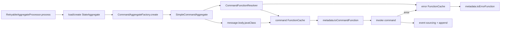
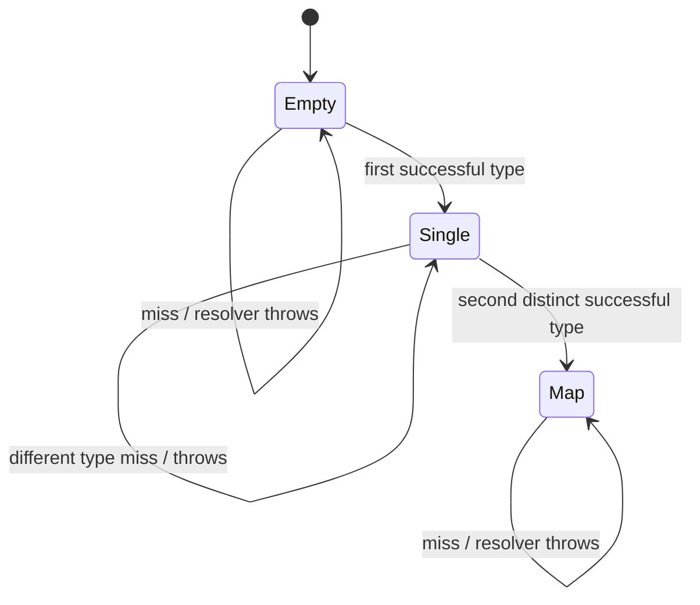
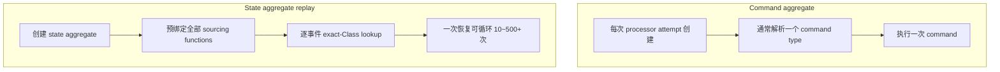
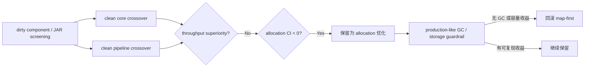

# 命令函数缓存与事件溯源注册表吞吐研究（2026-07-24）

## 摘要

本轮是
[`核心命令运行时与调度器吞吐研究`](./2026-07-23-command-runtime-scheduler-throughput.md)
的后续工作。固定 14-worker 的 Scheduler 结论不变：当前证据支持保留
CPU-sized 兼容默认，不支持继续通过缩小 pool 或直接共享 `newParallel` 来获得通用吞吐
收益。本轮转向 aggregate 内部函数解析热路径，并只接受通过真实实现 A/B 的候选。

结论先行：

1. **生产代码保留 `FunctionCache` 的 single-entry → map promotion，但只定位为
   allocation 优化。**
   第一次成功解析保存一个不可变 `(Class, function)` entry；第二个不同且成功的类型才
   晋升为 `HashMap`。miss 与 resolver exception 不缓存，精确 `Class` key 语义不变。
2. **clean core crossover 不支持吞吐提升主张。** 6 个交错 pair、12 个隔离 JVM 的
   `processCommandAggregate` 顺序校正效应为 `+0.22%`，95% CI
   `[-1.23%, +1.69%]`；它支持 `-3%` non-inferiority，但没有 superiority 证据。
   规范化分配减少 `85.33 B/op`，95% CI `[-111.25, -59.42]`。
3. **clean pipeline 仍然功效不足。** `handleAggregateOnly` 的顺序校正效应为
   `+1.64%`，95% CI `[-5.32%, +9.12%]`，既没有证明提升，也不能排除超过 `3%`
   的回退；allocation 减少 `92.00 B/op`，95% CI `[-173.53, -10.47]`。
4. **早期 dirty A/B 的 `+2.98%/+4.34%` 只保留为筛选信号。** clean-commit
   confirmation 未复现该幅度，因此不能再写成核心处理更快。当前成立的结论是：
   **核心吞吐中性、pipeline 吞吐不确定、allocation 下降（core 证据强于
   pipeline）；真实存储端到端尚未验证。**
5. **延迟创建 command/error cache 的候选已回退。** 它还能少约 `40 B/op`，但
   focused pipeline 点估计为 `-0.22%`，并削弱核心局部吞吐，没有足够收益支撑额外状态
   分支。
6. **自适应/lazy sourcing registry 已否决，生产状态恢复路径保持 eager binding。**
   500-event、两事件类型 replay 中，最佳 adaptive 候选相对对应 eager control 的点估计
   在 t1/t16 分别为 `-6.75%/-7.74%`，未通过 `-3%` non-inferiority gate；每次 replay
   只少 `248 B`，约 `0.44%`。
7. **没有调度器配置、公开 API、序列化或存储格式变化。** 保留实现的依据是 clean
   allocation 信号、局部 internal 边界和低回滚成本，不是已证明的吞吐增益；若
   production-like GC-bound 验证没有减少 GC CPU/pause 或提高容量，应回滚。

## 目标对齐

### 目标

- 继续沿核心命令运行时寻找可复现的吞吐候选；
- 解释 command function resolution 与 event sourcing resolution 的生命周期差异；
- 用语义测试、同 JAR 结构对照、精确旧/新生产 JAR A/B 和较长 pipeline confirmation
  决定是否落地；
- 不把微基准收益外推成真实 Mongo/Kafka 端到端收益。

### 范围

- `SimpleCommandAggregate` 与 `CommandFunctionResolver`；
- `FunctionCache` 的空、单 key、多 key、miss、exception 状态；
- `RetryableAggregateProcessor` 的 aggregate 实例生命周期；
- state aggregate 的 eager sourcing function registry；
- t1/t16 component、aggregate-only pipeline、500-event replay 和 GC allocation。

### 完成标准

- 精确类型、miss、exception 与多类型晋升语义有测试；
- clean core 交叉对照的 `-3%` non-inferiority 下界成立；只有 95% CI 全部高于 0
  才能声称 throughput superiority；
- 完整 aggregate-only pipeline 必须单独评估 `-3%` non-inferiority；若未通过，只能
  将候选定位为 allocation 优化，并保留生产验证与回滚条件；
- 影响 replay 每事件热路径的候选必须单独通过 500-event mixed-type guardrail；
- 最终 class bytecode 与实际测量候选一致；
- `:wow-core:check`、`:wow-benchmarks:check` 与 `jmhJar` 通过。

## 视角一：架构与运行时生命周期

### 命令处理路径



源码证据：

- 标准 processor 在每次 load/create 后调用 `commandAggregateFactory.create(...)`，retry
  重新订阅时也重新创建 command aggregate：
  [`RetryableAggregateProcessor.kt`](../../wow-core/src/main/kotlin/me/ahoo/wow/modeling/command/RetryableAggregateProcessor.kt#L54)。
- `SimpleCommandAggregate` 每实例持有一个 resolver，并以
  `message.body.javaClass` 作为精确 key：
  [`SimpleCommandAggregate.kt`](../../wow-core/src/main/kotlin/me/ahoo/wow/modeling/command/SimpleCommandAggregate.kt#L62)。
- command function 在正常路径解析一次；error function 只在 `onErrorResume` 中解析：
  [`SimpleCommandAggregate.kt`](../../wow-core/src/main/kotlin/me/ahoo/wow/modeling/command/SimpleCommandAggregate.kt#L119)。
- 两个 cache 均绑定当前 command aggregate 实例，不能跨实例共享：
  [`CommandFunctionResolver.kt`](../../wow-core/src/main/kotlin/me/ahoo/wow/modeling/command/CommandFunctionResolver.kt#L24)。

这解释了旧结构的浪费：标准运行时中，一个新建 command aggregate 通常只看到一个
command body 类型，原先却在第一次成功解析时立即创建 `HashMap`。Map 的多 key 能力在
这个实例生命周期内通常无法摊销。

### 新 cache 状态机



实现位于
[`CommandFunctionResolver.kt`](../../wow-core/src/main/kotlin/me/ahoo/wow/modeling/command/CommandFunctionResolver.kt#L44)。
第一项使用不可变 `FunctionCacheEntry`，避免 key/value 分字段发布造成不一致；cache
仍与 aggregate 一样是非线程安全对象，没有引入并发共享承诺。

### 为什么 command cache 与 sourcing registry 不能采用同一策略



state aggregate 的 registry 位于
[`SimpleStateAggregate.kt`](../../wow-core/src/main/kotlin/me/ahoo/wow/modeling/state/SimpleStateAggregate.kt)
和
[`StateAggregateMetadata.kt`](../../wow-core/src/main/kotlin/me/ahoo/wow/modeling/metadata/StateAggregateMetadata.kt)。
eager binding 把函数绑定成本放在 replay 循环之前；adaptive 候选把 metadata lookup、
binding 分支和 cache 状态判断带回逐事件路径。500-event replay 表明，少量构造分配不足以
抵消热循环成本，因此生产 sourcing registry 不改。

## 视角二：候选与语义约束

| 候选 | 预期收益 | 主要代价 | 决策 |
|---|---|---|---|
| command `single-entry → map` | 避免首次解析的 Map 分配和访问 | 空 cache 对象多一个字段 | **接受（allocation）** |
| lazy command/error cache object | 不使用时不创建 cache | 首次访问多一层 lazy/null 状态 | **回退** |
| adaptive sourcing + map-first | 少绑定未出现事件类型 | replay 热循环按需解析 | **否决** |
| adaptive sourcing + single-entry | 同时减少初始绑定与首个 Map | mixed replay 会晋升并增加分支 | **否决** |

必须保留的语义：

- key 是 exact `Class` identity，不做 assignable/supertype 合并；
- 成功解析后复用同一 bound function；
- `null` miss 不缓存，后续 metadata 变化或不同 resolver 仍可重新解析；
- resolver exception 不缓存、不包装；
- 第二个不同 key 只有在成功解析后才晋升；
- 晋升后第三个及后续成功 key 必须写入现有 Map；
- command/error cache 继续绑定各自 aggregate/root 实例，不能成为全局 cache。

这些约束由
[`FunctionCacheTest.kt`](../../wow-core/src/test/kotlin/me/ahoo/wow/modeling/command/FunctionCacheTest.kt)
和
[`CommandFunctionResolverTest.kt`](../../wow-core/src/test/kotlin/me/ahoo/wow/modeling/command/CommandFunctionResolverTest.kt)
覆盖。

## 视角三：实验设计与证据等级

### 环境

- Apple M4 Pro，14 physical cores（10P + 4E），24 GiB；
- macOS 26.5.2 / arm64；
- Azul Zulu OpenJDK 17.0.7；
- JMH 1.37，G1，`-Xms2g -Xmx2g`；
- 正式 component：`2 × 2s` warmup、`5 × 2s` measurement、3 forks、GC profiler；
- focused pipeline：`3 × 2s` warmup、`7 × 2s` measurement、5 forks、GC profiler；
- t1/t16 表示 JMH load threads，**不是** Scheduler pool size。固定 14-worker
  Scheduler 的结论来自前一份调度器报告，本轮没有把两个维度混为一谈。

### 五层对照

1. **同 JAR cache policy component**：`MAP_FIRST` 与 `SINGLE_ENTRY`，隔离数据结构；
2. **同 JAR sourcing 2×2**：`EAGER/ADAPTIVE × MAP_FIRST/SINGLE_ENTRY`，并包含
   eager negative control；
3. **精确旧/新生产 JAR A/B**：运行真实 `CommandFunctionResolver` 的 aggregate
   creation、processing 与 pipeline；
4. **较长 focused pipeline confirmation**：提高 forks/measurement，区分真实
   pipeline 信号与短时噪声，并加入 lazy-cache rejected candidate。
5. **clean-commit crossover confirmation**：baseline/candidate 独立 clean worktree，
   对 core 与 pipeline 各运行 6 个交错 pair，显式校正顺序效应。

原始 JSON 与完整控制台输出位于
[`evidence/2026-07-24-command-function-cache/`](./evidence/2026-07-24-command-function-cache/)。
完整 provenance、命令、JAR/class hash 见该目录
[`README.md`](./evidence/2026-07-24-command-function-cache/README.md)。

根目录旧 artifact 来自 dirty-source 筛选阶段；最终生产收益判断以
[`clean-confirmation/`](./evidence/2026-07-24-command-function-cache/clean-confirmation/)
为准。

证据等级：

| 等级 | 含义 | 本轮用途 |
|---|---|---|
| `PAIRED_SAME_JAR_DIRTY` | 同一 benchmark JAR 参数化对照 | cache policy、sourcing 2×2 |
| `EXACT_IMPLEMENTATION_AB_DIRTY` | 旧/新 JAR，除目标生产实现外保持相同 | aggregate/pipeline A/B |
| `FOCUSED_CONFIRMATION_DIRTY` | 增加 forks 与 measurement 的真实 pipeline | final/eager/lazy 三方确认 |
| `CLEAN_CROSSOVER` | clean commits、独立 JVM、交错顺序与顺序校正 CI | 最终 core/pipeline 判断 |
| `SEMANTIC_REGRESSION` | production tests 与 module checks | exact key、miss、exception、promotion |

旧筛选证据不是 clean-commit release confirmation；clean crossover 两侧 worktree
均无未提交变更，并记录 commit、whole-JAR 与 production class SHA-256。

## 视角四：基准结果

以下 `±` 为 JMH 输出的 score error，吞吐单位均为 `ops/s`。

### Cache-only 同 JAR 结构对照

| Benchmark | t1 throughput delta | t16 throughput delta | t1 allocation | t16 allocation |
|---|---:|---:|---:|---:|
| `createAndResolveFirst` | `+682.53%` | `+631.45%` | `128 → 24 B/op` | `128 → 24 B/op` |
| `createAndResolveSecond` | `+59.68%` | `+30.34%` | `192 → 176 B/op` | `192 → 184 B/op` |
| `createEmptyCache` | `-21.40%` | `-21.56%` | `16 → 24 B/op` | `16 → 24 B/op` |
| `singleTypeHit` | `+55.33%` | `+84.07%` | 近零 | 近零 |
| `twoTypeAlternatingHit` | `+0.83%` | `-2.26%` | 近零 | 近零 |

这个 component 只证明结构机制：

- 首次成功解析不再创建 Map，少 `104 B/op`；
- 空 cache 因多一个引用字段增加 `8 B/op`；
- 第二类型晋升仍保留多 key 行为；
- t16 双类型命中点估计 `-2.26%`，仍在预设 `-3%` non-inferiority 范围内，且
  error 区间重叠。

它不能单独证明框架吞吐，所以还需要真实 production implementation A/B。

### Adaptive sourcing replay：否决证据

固定 `eventCount=500`、`MIXED_TWO_TYPES`：

| Threads | Registry/cache | Throughput | Allocation |
|---:|---|---:|---:|
| 1 | `EAGER / MAP_FIRST`（当前生产基线） | `165,508.64 ± 7,802.04` | `56,520.00 B/op` |
| 1 | `EAGER / SINGLE_ENTRY`（对应 control） | `169,960.76 ± 2,575.15` | `56,520.00 B/op` |
| 1 | `ADAPTIVE / SINGLE_ENTRY` | `158,496.89 ± 3,971.82` | `56,272.00 B/op` |
| 16 | `EAGER / MAP_FIRST`（当前生产基线） | `1,196,724.65 ± 105,209.35` | `56,520.00 B/op` |
| 16 | `EAGER / SINGLE_ENTRY`（对应 control） | `1,071,738.24 ± 57,794.87` | `56,520.00 B/op` |
| 16 | `ADAPTIVE / SINGLE_ENTRY` | `988,792.66 ± 86,490.15` | `56,272.00 B/op` |

相对对应 `EAGER / SINGLE_ENTRY` control，adaptive 在 t1/t16 的点估计分别为
`-6.75%/-7.74%`。t1 区间不重叠；t16 区间虽重叠，但也无法证明满足 `-3%`
non-inferiority。每 500-event replay 只减少 `248 B`，所以候选否决，不能用
“少绑定几个 handler”替代 replay 实测。

### 真实 production implementation A/B（dirty-source 历史筛选）

| Threads | Benchmark | Baseline | Final candidate | Delta | Allocation delta |
|---:|---|---:|---:|---:|---:|
| 1 | `createCommandAggregate` | `3,612,022 ± 91,109` | `3,690,755 ± 84,091` | `+2.18%` | `+26.667 B/op` |
| 1 | `processCommandAggregate` | `1,192,838 ± 9,102` | `1,228,354 ± 12,413` | `+2.98%` | `-88.000 B/op` |
| 1 | `handleAggregateOnly` | `808,585 ± 8,627` | `802,630 ± 10,115` | `-0.74%` | `-85.333 B/op` |
| 16 | `createCommandAggregate` | `1,789,188 ± 132,261` | `1,854,308 ± 55,699` | `+3.64%` | `+16.000 B/op` |
| 16 | `processCommandAggregate` | `912,159 ± 20,870` | `951,772 ± 14,368` | `+4.34%` | `-80.000 B/op` |
| 16 | `handleAggregateOnly` | `831,365 ± 22,664` | `813,095 ± 26,584` | `-2.20%` | `-34.665 B/op` |

解读：

- aggregate creation 的对象尺寸略增，对应两个 cache 各新增一个字段；
- 一旦进入首次 function resolution，避免 Map 的收益超过 construction 增量；
- `processCommandAggregate` 的短时旧/新 JAR 对照曾给出正向信号，但 clean crossover
  未复现该幅度，不能作为最终吞吐结论；
- 短时 pipeline 的吞吐区间重叠，t16 点估计虽为负，但仍在 `-3%` gate 内；不能据此
  宣称 pipeline 变快，也不能据此否决；
- pipeline allocation 两组都下降，方向与局部结构 benchmark 一致。

### 较长 t16 pipeline confirmation（dirty-source 历史筛选）

| Candidate | Throughput | vs baseline | Allocation | vs baseline |
|---|---:|---:|---:|---:|
| Baseline map-first | `831,532.2 ± 24,507.6` | — | `7148.858 B/op` | — |
| Final eager-cache + single-entry | `834,076.3 ± 15,893.7` | `+0.306%` | `7073.626 B/op` | `-75.232 B/op` |
| Rejected lazy-cache + single-entry | `829,740.7 ± 18,092.1` | `-0.215%` | `7033.627 B/op` | `-115.231 B/op` |

三组 throughput error 区间重叠。这组结果只用于筛选 eager/lazy 候选，不能代替
clean confirmation。

### Clean-commit 交错确认

每条路径使用 6 个 pair，顺序为 `BC, CB, BC, CB, BC, CB`；每个顺序位置是独立
JVM。吞吐对 `ln(candidate / baseline)` 建模，allocation 对
`candidate - baseline` 建模，以 sequence 内 pooled variance 计算 95% CI（`df=4`）。

| Benchmark | Arithmetic baseline | Arithmetic candidate | Corrected throughput | 95% CI | Corrected allocation | 95% CI |
|---|---:|---:|---:|---:|---:|---:|
| `handleAggregateOnly` | `872,614.64` | `887,447.51` | `+1.64%` | `[-5.32%, +9.12%]` | `-92.00 B/op` | `[-173.53, -10.47]` |
| `processCommandAggregate` | `970,525.90` | `972,308.55` | `+0.22%` | `[-1.23%, +1.69%]` | `-85.33 B/op` | `[-111.25, -59.42]` |

完整 pair、模型、命令与 hash 见
[`clean-confirmation/README.md`](./evidence/2026-07-24-command-function-cache/clean-confirmation/README.md)。

最终决策是保留 eager-cache + single-entry 作为 allocation 优化：

- 两条真实路径的 allocation 区间均低于 0；
- pipeline allocation 的 pair 波动较大，证据强度低于 core；
- core 通过 `-3%` non-inferiority，但没有 superiority；
- pipeline CI 太宽，尚未通过 non-inferiority，必须在 production-like workload
  继续验证；
- eager 状态比已回退的 lazy-cache 简单；
- 改动仅限 internal class，无 API、配置或数据迁移，回滚边界清楚。

## 视角五：综合决策与演进



<!-- Sources:
wow-core/src/main/kotlin/me/ahoo/wow/modeling/command/CommandFunctionResolver.kt
wow-benchmarks/src/jmh/kotlin/me/ahoo/wow/benchmark/component/AggregateHandleComponentBenchmark.kt
wow-benchmarks/src/jmh/kotlin/me/ahoo/wow/benchmark/component/CommandPipelineComponentBenchmark.kt
document/design/evidence/2026-07-24-command-function-cache/clean-confirmation/summary.csv
-->

| 决策问题 | 证据 | 结论 | 信心 |
|---|---|---|---|
| 是否已提升核心吞吐 | clean core CI `[-1.23%, +1.69%]` | 否，吞吐中性 | 高 |
| 是否已证明 pipeline 非劣 | clean pipeline CI 下界 `-5.32%` | 否，功效不足 | 高 |
| 是否稳定减少分配 | 两条 clean CI 均低于 0 | 是，减少约 `85–92 B/op` | 高 |
| 是否改变外部兼容面 | internal cache；无 API/config/schema 变更 | 否 | 高 |
| 是否应永久保留 | 尚无真实 GC/存储收益证据 | 有条件保留，可回滚 | 中 |

### 生产代码

[`CommandFunctionResolver.kt`](../../wow-core/src/main/kotlin/me/ahoo/wow/modeling/command/CommandFunctionResolver.kt)：

- 新增不可变 `FunctionCacheEntry`；
- 首个成功 key 使用 single entry；
- 第二个不同且成功的 key 晋升到初始容量为 4 的 `HashMap`；
- 晋升后新 key 直接加入现有 Map；
- miss/exception 不改变 cache state；
- command/error 两个 cache 继续 eager 创建。

### 测试与 benchmark

- 新增 single-entry、promotion、third key、miss、exception 与 failed second
  resolution 测试；
- resolver 层测试改为验证行为，不再假设底层必须是 Map；
- 新增 benchmark-only cache policy 与 sourcing registry variants；
- 新增 cache component 与 sourcing replay component；
- 固化 t1/t16 JSON、控制台输出和 focused pipeline evidence。

### 未改变

- Scheduler pool、stripe、prefetch 配置与默认值；
- state sourcing registry 的 eager binding；
- public API、配置 key、事件/命令 schema；
- Reactor 非阻塞执行模型；
- aggregate retry 与 error handler 语义。

## 验证结果

已执行并通过：

```text
./gradlew :wow-core:test \
  --tests "me.ahoo.wow.modeling.command.FunctionCacheTest" \
  --tests "me.ahoo.wow.modeling.command.CommandFunctionResolverTest" \
  --tests "me.ahoo.wow.modeling.command.SimpleCommandAggregateProcessingTest"

./gradlew :wow-benchmarks:test \
  --tests "me.ahoo.wow.benchmark.runtime.*"

./gradlew :wow-core:check :wow-benchmarks:check \
  :wow-spring-boot-starter:check :wow-benchmarks:jmhJar \
  --no-parallel --console=plain
```

clean baseline/candidate worktree 均执行并通过：

```text
./gradlew :wow-benchmarks:jmhJar
```

最终 module check 为 `BUILD SUCCESSFUL`；包括 unit test、contract test、Detekt 与
benchmark policy checks。最终本地 JMH JAR SHA-256 为
`db3fba8d5f852d189eea22ea23d70140dad1c98d9e75ab63ecf63996154108ec`。
clean crossover 使用：

| Variant | Commit | JMH JAR SHA-256 |
|---|---|---|
| baseline | `04b4310f69d9b578d26144782bfa08abec58c5e5` | `4659b9560901f89857438eabeb28fa41d70e4dcb0daf863a9301183e7607c573` |
| candidate | `dfa607d0ea6c2d7a663dbd49f01608e6ba7607d2` | `94675ccc7f907468087fcf8e39696919a646351504cef8c500fe15236f1f546d` |

最终 JMH JAR 中三个相关 class 与正式 measured eager candidate 的 SHA-256 完全一致：

| Class | SHA-256 |
|---|---|
| `CommandFunctionResolver.class` | `ed9c326b8f1e37996b62d8416314b39231780f03c224e2815eb9b719005cb341` |
| `FunctionCache.class` | `688fd154a6df444ecdbcc9c18f5a8458c5ce99483b549f1af8a7066d97b2b5f2` |
| `FunctionCacheEntry.class` | `8112f8ea7a43f0e89718e05b66f49d0c6d87d8b4e4dea124c4f4e0c329b34ed8` |

## 风险与注意事项

1. **不是端到端容量证明。** 本轮 pipeline 使用 Noop/fixture 路径，没有覆盖 Mongo load、
   snapshot、append、Kafka publish、网络和序列化；clean crossover 也没有证明
   throughput superiority。
2. **cache 仍非线程安全。** 当前正确性依赖 aggregate 实例的顺序处理边界；不可变 entry
   只改善 key/value 一致性，不提供并发 Map。
3. **多类型路径保留但不是主路径。** 如果未来复用同一 command aggregate 处理多个
   command type，第二个类型会晋升，第三个及以后进入 Map，行为已测试。
4. **exact-Class 语义不变。** 如果未来要支持多态 handler lookup，应作为 metadata/API
   设计变更处理，不能偷偷改变 cache equality。
5. **pipeline precision 不足。** 6-pair clean CI 下界为 `-5.32%`，没有通过
   `-3%` non-inferiority；保留实现不等于宣称 pipeline 安全边界已证明。
6. **交叉设计仍有时间漂移风险。** 每个 period 只有一个 fork，顺序是确定性交替而非
   随机化；pipeline 第 6 pair 是在前 5 pair 后追加。模型只校正一阶顺序效应，不能
   消除非线性主机漂移或后补批次效应。
7. **回滚简单。** 恢复 `FunctionCache` 的 map-first 实现即可；没有配置迁移、数据迁移
   或公开兼容问题。benchmark 与证据可保留作为负向/历史资料。

## 后续建议

按收益/风险排序：

1. **下一步做 production-like GC/存储 confirmation。** 固定 Scheduler 默认
   14 workers，分别覆盖 create、short replay、500-event replay、snapshot hit/miss
   与真实 Mongo，同时记录 throughput、p95/p99、`B/op`、GC CPU、pause 与连接池
   饱和度。只有 allocation 降幅实际转化为 GC 或容量收益，才继续保留该优化。
2. **扩大 pipeline crossover 只用于预先定义的非劣检验。** 当前 point estimate
   不能指导追加样本；若合入门槛要求 `-3%` non-inferiority，应先做 power analysis，
   固定 pair 数和停止规则，再运行，避免看到结果后选择性延长。
3. **下一候选必须由新 profile 决定。** 优先对 `processCommandAggregate` 采集 allocation
   JFR/async-profiler；只有当 `SimpleDomainEventExchange`、metadata lookup 或 handler
   binding 进入可辨识 top caller 时，才设计同 JAR proxy 与真实 A/B。不要继续尝试
   lazy sourcing registry。
4. **把 sourcing handler 注入/异步签名作为独立正确性审计。** 这会触及 handler
   解析与调用契约，不应混入本轮纯性能补丁；若确认问题，再单独给迁移与兼容方案。
5. **配置层维持已有结论。** 保留 CPU-sized 默认和 per-type 隔离；生产只根据实际
   workload 调整 `stripeCount`/pool，并用 CPU-heavy、异步 I/O、热点与 noisy-neighbor
   guardrail 验收。
