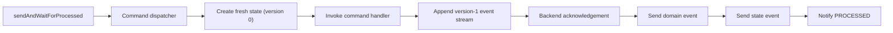

# Pure-Create Command Throughput to `PROCESSED`

## Decision

Under the fixed 14-worker, fresh-aggregate workload, no scheduler configuration can currently
support a claim of at least 20% higher throughput on both MongoDB and Redis.

The 20% target is interpreted as a relative throughput increase:

```text
candidate throughput / baseline throughput > 1.20
```

This conclusion is deliberately narrower than general command throughput:

- every command creates a new aggregate;
- the wait endpoint is `sendAndWaitForProcessed`;
- MongoDB or Redis must acknowledge the version-1 append;
- snapshot load, event-history load/replay, projection, saga, and downstream consumers are excluded.

No production batching or persistence change is recommended from the experiments below. The
backend-specific probes did not beat their own unbatched baselines.

## Measured path



For create commands, `RetryableAggregateProcessor` calls the aggregate factory directly and does
not call `StateAggregateRepository`. The command aggregate waits for `EventStore.append` before the
filter chain can reach `ProcessedNotifierFilter`.

Relevant implementation points:

- `wow-core/src/main/kotlin/me/ahoo/wow/modeling/command/RetryableAggregateProcessor.kt`
- `wow-core/src/main/kotlin/me/ahoo/wow/modeling/command/SimpleCommandAggregate.kt`
- `wow-core/src/main/kotlin/me/ahoo/wow/command/wait/NotifierFilters.kt`
- `wow-mongo/src/main/kotlin/me/ahoo/wow/mongo/MongoEventStore.kt`
- `wow-redis/src/main/kotlin/me/ahoo/wow/redis/eventsourcing/RedisEventStore.kt`
- `wow-redis/src/main/resources/event_stream_append.lua`

The retained infrastructure benchmarks additionally assert that every result:

- succeeds at `CommandStage.PROCESSED`;
- belongs to the command's aggregate;
- reports `Version.INITIAL_VERSION`.

## Scheduler configuration screen

The real MongoDB/Redis screen used:

- 14 JMH worker threads;
- `PARALLEL` scheduling;
- scheduler pools `2, 4, 8, 14`;
- ordering stripes `64, 224, 896`;
- two 3-second warmups;
- three 5-second measurements;
- one fork and no profiler.

The baseline was `pool=14, stripes=896`. The selection score was the minimum of the MongoDB and
Redis ratios, because a common configuration must help both backends.

| Configuration | MongoDB ops/s | MongoDB ratio | Redis ops/s | Redis ratio | Minimum ratio |
|---|---:|---:|---:|---:|---:|
| `14 / 896` baseline | 15,604.4 | 1.0000 | 21,333.1 | 1.0000 | 1.0000 |
| `8 / 896` best non-baseline maximin | 16,553.2 | 1.0608 | 21,041.8 | 0.9863 | 0.9863 |
| `2 / 224` MongoDB-best point | 18,610.4 | 1.1926 | 20,991.7 | 0.9840 | 0.9840 |

Every non-baseline Redis point estimate was below its baseline. The MongoDB-best point remained
below 20% and regressed Redis by 1.60%.

This was a screening run, not formal proof:

- source provenance was `dirty=true`;
- there was only one fork and three measurements;
- the MongoDB baseline drifted from 14,672 to 16,124 ops/s.

The screen is sufficient to reject candidate promotion because it contains no common positive point,
but it is not used to claim an exact production delta.

Retained command:

```bash
./gradlew :wow-benchmarks:benchmarkPureCreateSchedulerScreen --no-parallel --console=plain
```

Artifact identity for the reviewed run:

```text
JMH JAR SHA-256: 5e55fd35a75e2aa883f38bb21c079eef86f685f323118cc93875bf7ef3e69781
result SHA-256:  e268a04241c7b5f15ff86444330f5957d89403a4ed936a7c422463bc37d4c685
human SHA-256:   727eff4fed95ae7295c5be4d885225ba5582489f3d116be752290dc928617319
```

## Backend mechanism probes

Two benchmark-only probes tested whether storage-side fixed costs could provide the missing
headroom. Both preserved the rule that a command cannot reach `PROCESSED` before its own storage
acknowledgement. Their source was intentionally removed after rejection; the numbers are diagnostic
evidence, not retained production features or formal benchmark results.

### MongoDB acknowledged `insertMany`

The probe grouped version-1 documents into unordered `insertMany` calls. Each append had an
individual completion signal, completed only after an acknowledged result covered the batch.
Teardown verified:

- no outstanding or failed append;
- acknowledged append count equalled successful command count;
- persisted document count equalled successful command count.

All candidates used `pool=2, stripes=224`.

| Strategy | ops/s | Delta |
|---|---:|---:|
| `insertOne` baseline | 18,149.1 | — |
| batch 8, 2 lanes, 50 µs | 14,754.4 | -18.71% |
| batch 8, 4 lanes, 50 µs | 16,830.9 | -7.26% |
| batch 16, 2 lanes, 50 µs | 15,599.1 | -14.05% |

Four lanes were best but still slower than individual acknowledged writes. With only 14 requests in
flight, smaller batches lose most amortization while `insertMany` retains its command latency and
per-document index maintenance.

Reviewed artifact identity:

```text
JMH JAR SHA-256: 00dae8001f7749af4d88158566251a5680c6f556f1235cc375b8d18ca44cdc22
result SHA-256:  0f22f7fdd7a1f3eeb563d148aef043751109d056b5765c230e63dc280eaf1808
human SHA-256:   9b3d17059f070a137d7a31401834af3d56c164cb97a737a520836b437c95f9d5
```

### Redis Lettuce flush coalescing

The probe reused the production `RedisEventStore`, key layout, Lua script, and result mapping.
It disabled Lettuce auto-flush on the benchmark's shared native connection and used a dedicated
flusher. Every Lua call retained its own result future; enqueue or flush never acknowledged the
command. Teardown restored auto-flush and sampled event stream, version, and request-ID indexes.

All candidates used `pool=14, stripes=896`.

| Strategy | ops/s | Delta |
|---|---:|---:|
| auto-flush baseline | 21,819.8 | — |
| coalesce 8, 50 µs | 21,198.9 | -2.85% |
| coalesce 14, 250 µs mechanism bound | 18,664.2 | -14.46% |

The existing shared connection already carries concurrent `EVALSHA` requests. Coalescing flushes
does not reduce JSON serialization, Lua executions, or the script's five Redis operations, while
the wait window increases closed-loop response time.

Reviewed artifact identity:

```text
JMH JAR SHA-256: 4f24886ee7aef3e05be2e3e3db9339af0e9179217adf219ad1b33d2aaf46c945
result SHA-256:  6013d86da9334140863ad709197b5af5bf6e061a5720d26191cd6d661c5c5402
human SHA-256:   d5099021a3f255b7b38b10ed0fd05f4fcc18120105ee00a032005cbb07a6fd0b
```

## Configuration assessment

The current separation between ordering stripes and scheduler workers is reasonable:

- stripes protect per-aggregate ordering and bound hash-collision head-of-line blocking;
- scheduler workers control CPU handoff capacity;
- increasing stripes does not create more scheduler workers;
- reducing workers can help MongoDB by reducing handoff and contention, but it is not a universal
  win and slightly reduces Redis throughput.

Consequently:

- `pool=8, stripes=896` is the least-bad non-baseline common point, not an optimization;
- `pool=2, stripes=224` is a MongoDB-specific diagnostic point, not a common default;
- no fixed scheduler configuration should be promoted with a 20% cross-backend claim.

## What would be required next

If the requirement remains a single cross-backend configuration with at least 20% improvement,
stop this direction. A formal A/B run cannot turn the observed Redis regressions into a credible
20% candidate.

The next potentially material experiments require backend-specific behavior or a changed
constraint:

1. MongoDB index-write ablation: quantify the cost of optional owner/tenant indexes. This changes
   query capability and is MongoDB-specific.
2. Redis script/data-layout ablation: reduce server-side operations per create. This can require a
   key-layout migration and must preserve Redis Cluster hash-slot rules.
3. Higher allowed in-flight concurrency: measure capacity separately from fixed-14 response time.
   This changes the workload and must include latency/backpressure acceptance criteria.
4. Core allocation/notifier profiling: useful for incremental improvements, but current storage
   ceilings do not provide evidence that this alone can deliver 20% on both backends.

Any future candidate should first pass a cheap real-backend screen, then use clean-source,
balanced A/B blocks. The formal acceptance criterion should be a one-sided confidence lower bound
above `1.20` for each backend, with correction if a simultaneous cross-backend 95% claim is made.
