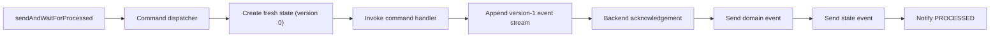

# Pure-Create Command Throughput to `PROCESSED`

## Decision

The clean, eight-pair `main`/PR A/B shows that the current runtime changes are incremental, not a
20% production-throughput breakthrough:

- MongoDB: **+0.42%**, with a two-sided 95% CI of **-0.19% to +1.03%**;
- Redis: **+2.92%**, with a two-sided 95% CI of **+2.46% to +3.39%**.

The one-sided 95% conservative gain bounds are -0.07% for MongoDB and +2.55% for Redis. Both are
far below the predeclared gate, so the candidate does not demonstrate at least 20% higher
throughput on either backend. The earlier scheduler screen also found no fixed configuration that
improved both backends.

The 20% target is interpreted as a relative throughput increase:

```text
LCB95(candidate throughput / baseline throughput) > 1.20
```

This conclusion is deliberately narrower than general command throughput:

- every command creates a new aggregate;
- the wait endpoint is `sendAndWaitForProcessed`;
- MongoDB or Redis must acknowledge the version-1 append;
- snapshot load, event-history load/replay, projection, saga, and downstream consumers are excluded.

This does not show that the code is globally optimal. It shows that the scheduler and current core
runtime direction cannot supply the missing headroom under this workload. No production batching
or persistence change is recommended from the rejected probes below.

## Measured path


```mermaid
flowchart LR
    A["sendAndWaitForProcessed"] --> B["Command dispatcher"]
    B --> C["Create fresh state (version 0)"]
    C --> D["Invoke command handler"]
    D --> E["Append version-1 event stream"]
    E --> F["Backend acknowledgement"]
    F --> G["Send domain event"]
    G --> H["Send state event"]
    H --> I["Notify PROCESSED"]
```

For create commands, `RetryableAggregateProcessor` calls the aggregate factory directly and does
not call `StateAggregateRepository`. The command aggregate waits for `EventStore.append` before the
filter chain can reach `ProcessedNotifierFilter`.

Relevant implementation points:

- `wow-core/src/main/kotlin/me/ahoo/wow/modeling/command/RetryableAggregateProcessor.kt`
- `wow-core/src/main/kotlin/me/ahoo/wow/modeling/command/SimpleCommandAggregate.kt`
- `wow-core/src/main/kotlin/me/ahoo/wow/command/wait/NotifierFilters.kt`
- `wow-mongo/src/main/kotlin/me/ahoo/wow/mongo/MongoEventStore.kt`
- `wow-redis/src/main/kotlin/me/ahoo/wow/redis/eventsourcing/RedisEventStore.kt`
- `wow-redis/src/main/resources/event_stream_append.lua`

The retained infrastructure benchmarks additionally assert that every result:

- succeeds at `CommandStage.PROCESSED`;
- belongs to the command's aggregate;
- reports `Version.INITIAL_VERSION`.

## Clean `main` vs PR paired A/B

The formal comparison used two clean, detached measurement trees:

- baseline production code: `b187af6303e88fd8311f749c4af2ded24590d4cc`;
- baseline with neutral harness: `220e0fc8652e0871aa152f085b69efd14c853de1`;
- candidate: `b38afec22ae7462b581434fd7bb6c7c605b757f5`;
- `origin/main` at run time: `b68be955d0d38a24af56e3b9e05398a7fca84092`.

The only change from the baseline production commit to the run-time `origin/main` was README and
documentation-site content, so their runtime code is equivalent. The complete `wow-benchmarks`
tree was identical on both measurement refs:

```text
wow-benchmarks tree: c60b1f4af69eccaaff4f2f8aa05e53159835c273
harness class bundle: 58bf216ee2ee103558ed5b01b58547ffab0e799ba702423c130b8b9815dc7467
baseline JMH JAR: aa189666b74ce7051efc02fb0fd0bcb0e515339e4be6b64e9b9b22efd22148c9
candidate JMH JAR: f9373063021d2fcb15b3d0adc7162a0b9583509b92609d606089b65dbb6d15d3
```

The full JAR hashes differ because they contain the baseline or candidate runtime. The class-bundle
hash covers the sorted names and bytes of all benchmark and infrastructure harness classes and is
identical.

### Protocol and integrity

One unscored warm-up pair preceded eight formal pairs. The order was frozen before score
inspection:

```text
AB, BA, BA, AB, BA, AB, AB, BA
```

A is the baseline and B is the candidate. Each position was a separate serial process using:

- 14 JMH callers;
- `PARALLEL`, scheduler pool `14`, and `896` stripes;
- two 5-second warmups and three 10-second measurements;
- one fork, G1, a fixed 4 GiB heap, and no profiler.

All 16 manifests reported `SUCCESS`, `dirty=false`, the exact commit and run specification, and two
result rows. The 48 JSON, human-output, and manifest files matched their recorded sizes and
SHA-256 values. Invocation times did not overlap. MongoDB and Redis remained healthy with
`restartCount=0`.

For each backend and pair:

```text
x[i] = ln(candidate throughput / baseline throughput)
ratio = exp(mean(x))
LCB95 = exp(mean(x) - t(0.95, 7) * sd(x) / sqrt(8))
```

The acceptance rule requires the MongoDB and Redis one-sided 95% lower bounds to each exceed
`1.20`. Because success requires both component claims, this is an intersection-union test and
does not require a multiplicity correction.

### Results

| Backend | n | Baseline arithmetic mean | Candidate arithmetic mean | Geometric ratio | Gain | Two-sided 95% CI | One-sided 95% LCB | `> 1.20` |
|---|---:|---:|---:|---:|---:|---:|---:|---|
| MongoDB | 8 | 21,340.38 | 21,429.87 | 1.004182 | +0.42% | -0.19% to +1.03% | 0.999325 (-0.07%) | No |
| Redis | 8 | 26,672.55 | 27,452.90 | 1.029241 | +2.92% | +2.46% to +3.39% | 1.025536 (+2.55%) | No |

| Pair | Order | MongoDB baseline | MongoDB candidate | MongoDB gain | Redis baseline | Redis candidate | Redis gain |
|---:|:---:|---:|---:|---:|---:|---:|---:|
| 1 | AB | 21,370.45 | 21,429.31 | +0.28% | 26,578.00 | 27,531.22 | +3.59% |
| 2 | BA | 21,557.46 | 21,543.11 | -0.07% | 26,670.98 | 27,483.94 | +3.05% |
| 3 | BA | 20,987.44 | 20,936.23 | -0.24% | 26,551.64 | 27,108.77 | +2.10% |
| 4 | AB | 21,124.63 | 21,367.71 | +1.15% | 26,689.78 | 27,253.43 | +2.11% |
| 5 | BA | 21,514.55 | 21,420.12 | -0.44% | 26,844.11 | 27,659.26 | +3.04% |
| 6 | AB | 21,420.14 | 21,503.54 | +0.39% | 26,725.41 | 27,652.20 | +3.47% |
| 7 | AB | 21,315.65 | 21,684.96 | +1.73% | 26,677.35 | 27,459.99 | +2.93% |
| 8 | BA | 21,432.74 | 21,553.99 | +0.57% | 26,643.14 | 27,474.40 | +3.12% |

MongoDB's AB and BA geometric ratios were 1.00885 and 0.99953, respectively; the balanced order
prevents that order sensitivity from being mistaken for candidate benefit. Redis was more stable:
1.03023 for AB and 1.02825 for BA.

The candidate result is the combined effect of all runtime changes that reach this path:

1. removing per-command shared atomic lifecycle updates from the aggregate dispatcher;
2. skipping the successful `SENT` signal for the default non-`SENT` last-result wait;
3. lazily allocating wait results and reusing an empty `PROCESSED` signal;
4. using a single-entry command-function cache before promotion to a map.

The Spring Boot per-role scheduler properties are not measured because the fixture constructs the
dispatcher directly. The A/B cannot attribute a percentage to any individual change.

Raw evidence and the dependency-free verifier are retained under
`document/design/evidence/2026-07-24-pure-create-main-pr-pair/`.

The environment was deliberately controlled but is not production-equivalent: JDK 17.0.7 on an
Apple Silicon host, Docker Desktop with 4 vCPUs and about 5.8 GiB, tmpfs-backed MongoDB 8.3.4 and
Redis 7.4.9, and Redis persistence disabled. The result is local real-backend, fixed-concurrency,
short-window E2E evidence, not an open-loop production capacity or latency claim.

## Scheduler configuration screen

The real MongoDB/Redis screen used:

- 14 JMH worker threads;
- `PARALLEL` scheduling;
- scheduler pools `2, 4, 8, 14`;
- ordering stripes `64, 224, 896`;
- two 3-second warmups;
- three 5-second measurements;
- one fork and no profiler.

The baseline was `pool=14, stripes=896`. The selection score was the minimum of the MongoDB and
Redis ratios, because a common configuration must help both backends.

| Configuration | MongoDB ops/s | MongoDB ratio | Redis ops/s | Redis ratio | Minimum ratio |
|---|---:|---:|---:|---:|---:|
| `14 / 896` baseline | 15,604.4 | 1.0000 | 21,333.1 | 1.0000 | 1.0000 |
| `8 / 896` best non-baseline maximin | 16,553.2 | 1.0608 | 21,041.8 | 0.9863 | 0.9863 |
| `2 / 224` MongoDB-best point | 18,610.4 | 1.1926 | 20,991.7 | 0.9840 | 0.9840 |

Every non-baseline Redis point estimate was below its baseline. The MongoDB-best point remained
below 20% and regressed Redis by 1.60%.

This was a screening run, not formal proof:

- source provenance was `dirty=true`;
- there was only one fork and three measurements;
- the MongoDB baseline drifted from 14,672 to 16,124 ops/s.

The screen is sufficient to reject candidate promotion because it contains no common positive point,
but it is not used to claim an exact production delta.

Retained command:

```bash
./gradlew :wow-benchmarks:benchmarkPureCreateSchedulerScreen --no-parallel --console=plain
```

Artifact identity for the reviewed run:

```text
JMH JAR SHA-256: 5e55fd35a75e2aa883f38bb21c079eef86f685f323118cc93875bf7ef3e69781
result SHA-256:  e268a04241c7b5f15ff86444330f5957d89403a4ed936a7c422463bc37d4c685
human SHA-256:   727eff4fed95ae7295c5be4d885225ba5582489f3d116be752290dc928617319
```

## Backend mechanism probes

Two benchmark-only probes tested whether storage-side fixed costs could provide the missing
headroom. Both preserved the rule that a command cannot reach `PROCESSED` before its own storage
acknowledgement. Their source was intentionally removed after rejection; the numbers are diagnostic
evidence, not retained production features or formal benchmark results.

### MongoDB acknowledged `insertMany`

The probe grouped version-1 documents into unordered `insertMany` calls. Each append had an
individual completion signal, completed only after an acknowledged result covered the batch.
Teardown verified:

- no outstanding or failed append;
- acknowledged append count equalled successful command count;
- persisted document count equalled successful command count.

All candidates used `pool=2, stripes=224`.

| Strategy | ops/s | Delta |
|---|---:|---:|
| `insertOne` baseline | 18,149.1 | — |
| batch 8, 2 lanes, 50 µs | 14,754.4 | -18.71% |
| batch 8, 4 lanes, 50 µs | 16,830.9 | -7.26% |
| batch 16, 2 lanes, 50 µs | 15,599.1 | -14.05% |

Four lanes were best but still slower than individual acknowledged writes. With only 14 requests in
flight, smaller batches lose most amortization while `insertMany` retains its command latency and
per-document index maintenance.

Reviewed artifact identity:

```text
JMH JAR SHA-256: 00dae8001f7749af4d88158566251a5680c6f556f1235cc375b8d18ca44cdc22
result SHA-256:  0f22f7fdd7a1f3eeb563d148aef043751109d056b5765c230e63dc280eaf1808
human SHA-256:   9b3d17059f070a137d7a31401834af3d56c164cb97a737a520836b437c95f9d5
```

### Redis Lettuce flush coalescing

The probe reused the production `RedisEventStore`, key layout, Lua script, and result mapping.
It disabled Lettuce auto-flush on the benchmark's shared native connection and used a dedicated
flusher. Every Lua call retained its own result future; enqueue or flush never acknowledged the
command. Teardown restored auto-flush and sampled event stream, version, and request-ID indexes.

All candidates used `pool=14, stripes=896`.

| Strategy | ops/s | Delta |
|---|---:|---:|
| auto-flush baseline | 21,819.8 | — |
| coalesce 8, 50 µs | 21,198.9 | -2.85% |
| coalesce 14, 250 µs mechanism bound | 18,664.2 | -14.46% |

The existing shared connection already carries concurrent `EVALSHA` requests. Coalescing flushes
does not reduce JSON serialization, Lua executions, or the script's five Redis operations, while
the wait window increases closed-loop response time.

Reviewed artifact identity:

```text
JMH JAR SHA-256: 4f24886ee7aef3e05be2e3e3db9339af0e9179217adf219ad1b33d2aaf46c945
result SHA-256:  6013d86da9334140863ad709197b5af5bf6e061a5720d26191cd6d661c5c5402
human SHA-256:   d5099021a3f255b7b38b10ed0fd05f4fcc18120105ee00a032005cbb07a6fd0b
```

## Configuration assessment

The current separation between ordering stripes and scheduler workers is reasonable:

- stripes protect per-aggregate ordering and bound hash-collision head-of-line blocking;
- scheduler workers control CPU handoff capacity;
- increasing stripes does not create more scheduler workers;
- reducing workers can help MongoDB by reducing handoff and contention, but it is not a universal
  win and slightly reduces Redis throughput.

Consequently:

- `pool=8, stripes=896` is the least-bad non-baseline common point, not an optimization;
- `pool=2, stripes=224` is a MongoDB-specific diagnostic point, not a common default;
- no fixed scheduler configuration should be promoted with a 20% cross-backend claim.
- the clean code A/B must not be presented as scheduler-configuration gain because both sides used
  the same `pool=14, stripes=896` configuration.

## What would be required next

If the requirement remains at least 20% on both backends, stop tuning the fixed scheduler and stop
expecting the current allocation/notifier changes to close the gap. The clean A/B places their
combined MongoDB effect near zero and their Redis effect near 3% in this environment.

The next potentially material experiments require backend-specific behavior or a changed
constraint:

1. MongoDB index-write ablation: quantify the cost of optional owner/tenant indexes. This changes
   query capability and is MongoDB-specific.
2. Redis script/data-layout ablation: reduce server-side operations per create. This can require a
   key-layout migration and must preserve Redis Cluster hash-slot rules.
3. Higher allowed in-flight concurrency: measure capacity separately from fixed-14 response time.
   This changes the workload and must include latency/backpressure acceptance criteria.
4. Core allocation/notifier profiling: useful for incremental improvements, but current storage
   ceilings do not provide evidence that this alone can deliver 20% on both backends.

Any future candidate should first pass a cheap real-backend screen, then use clean-source,
balanced A/B blocks. The formal acceptance criterion should be a one-sided confidence lower bound
above `1.20` for each backend. Requiring both backend component claims is an intersection-union
gate and does not require a multiplicity correction.
