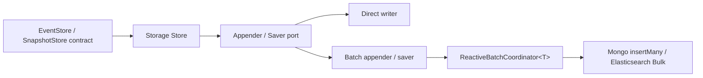

# Reactive Storage Batching

## Decision

Use a storage-independent `ReactiveBatchCoordinator<T>` in `wow-core`, composed
with protocol-specific writers and narrow EventStore/SnapshotStore collaborators
inside each infrastructure module.

Do not put MongoDB or Elasticsearch request types in the coordinator. Do not make
the base stores construct Bulk requests directly, and do not expose parallel
`BatchMongoEventStore` or `BatchElasticsearchEventStore` public store hierarchies.
The selected composition keeps domain operation signatures and data types
unchanged while allowing MongoDB EventStore, Elasticsearch EventStore, and
Elasticsearch SnapshotStore to reuse the same admission, batching,
result-routing, cancellation, and shutdown machinery.

## Alternatives

| Alternative | Result |
|-------------|--------|
| One batcher per Store | Rejected. It duplicates cancellation, bounded admission, result isolation, close, timeout, and race handling. |
| Common coordinator plus storage-specific writers | Selected. The common layer knows only `T`, `Mono`, and one result per input; each infrastructure module owns its protocol and error mapping. |
| Public `BatchMongoEventStore` / `BatchElasticsearchEventStore` decorators | Rejected as the primary API. They would duplicate the full Store surface and create another public type per storage/Store combination. Narrow internal appender/saver composition provides the same separation without changing domain operation signatures. |

## Contracts

### Coordinator

- Submission is lazy: admission and item construction begin on subscription.
- Admission is non-blocking and bounded by `maxPendingItems`; exhaustion fails the
  new caller with `ReactiveBatchOverflowException`.
- `maxSize` or `maxDelay` closes a batch window. Batches are sent serially by the
  coordinator, while a protocol writer may use one native multi-item request.
- The writer must return exactly one `BatchItemResult` for every claimed input,
  in input order. Empty or wrong-cardinality results are protocol failures.
- A writer request failure fails every claimed item in that batch, but it does
  not terminate later batches.
- Per-item failures are signalled only to the matching subscriber.
- Cancelling before claim removes the item from protocol work and releases live
  admission. Its physical queue placeholder stays bounded and is reclaimed when
  the pipeline observes it, so a cancellation storm can temporarily exhaust
  queue-slot capacity even when fewer live callers remain. Cancelling after
  claim does not cancel an already-started storage write.
- `close()` rejects new submissions, completes the input, flushes a partial
  window, waits for protocol work and result delivery, and is idempotent.
- Close timeout or interruption freezes admission and fails outstanding queued
  or in-flight callers. A protocol write that already settled may still deliver
  its result after the synchronous close call times out; timeout stops waiting,
  it does not roll back acknowledged storage work. The default close timeout is
  30 seconds.

### MongoDB EventStore

- Direct mode remains `insertOne`.
- Batch mode groups items by target collection and uses unordered `insertMany`.
- MongoDB bulk-write errors are mapped back to the matching append; successful
  items in the same unordered request remain successful.
- Collection groups inside one coordinator batch are joined before results are
  delivered. A stalled collection can therefore increase latency for the other
  collection groups in that batch, although their success/error results remain
  isolated. Removing this batch-level head-of-line latency is a writer-level
  optimization and does not require changing the coordinator contract.

### Elasticsearch EventStore

- Direct and batch paths use `create`, never `index`, preserving the event
  stream no-overwrite invariant.
- A Bulk request retains each item's index, document ID, and routing.
- The writer validates item count, operation, index, ID, `errors()`, and every
  item status before routing results.
- An item status of 409 maps only that append to
  `EventVersionConflictException`. Other item failures remain protocol-specific
  exceptions, and successes in the same response complete normally.
- `refreshPolicy` is applied once to the Bulk request and remains configurable.

### Elasticsearch SnapshotStore

- Snapshot persistence uses Bulk `index`.
- Items for the same index/document ID in one batch are coalesced to the highest
  aggregate version; equal versions preserve the first submission, matching
  external-version behavior across separate requests.
- Writes use Elasticsearch external versioning. A lower or equal version cannot
  overwrite a newer stored snapshot, including across different batches or
  concurrent Store instances.
- Snapshot 409 is treated as idempotent success because the stored version is
  already equal or newer. Other item failures are isolated to the corresponding
  caller.

## Compatibility And Migration

Batching is opt-in and direct behavior remains the default. Existing Store
constructors remain available. Applications enable batching through the
storage-specific batch options or the corresponding Spring Boot properties.
`EventStore` and `SnapshotStore` now extend `AutoCloseable` with a default
no-op `close()` so decorators can propagate shutdown to an underlying batch
coordinator. This is an additive JVM interface change: existing implementations
normally inherit the default method, but code that reflects on implemented
interfaces or declares an incompatible/non-public `close()` may need adjustment.
Append/save method signatures and domain data types are unchanged.

Routing stores are explicitly non-owning composites: closing a
`RoutingEventStore` or `RoutingSnapshotStore` does not close the leaf stores
supplied through its registry. Spring closes those leaf beans; a manual
composition root must retain and close each leaf itself. This avoids duplicate
close calls when a leaf is registered under multiple routes or is also managed
by a container.

`ReactiveBatchCoordinator` and its storage-neutral options/results are a new
public infrastructure API in `wow-core`. Storage adapters must keep protocol
types and error interpretation in their own modules so this API can evolve
without coupling the core to MongoDB or Elasticsearch.

Elasticsearch SnapshotStore now uses external versioning in both direct and
batch modes. Treating stale/equal-version 409 responses as idempotent success is
a correctness change for all Elasticsearch snapshot users, not only users who
enable batching.

Rollback is configuration-only while the old constructors remain: disable the
batch option to return to direct writes. Elasticsearch snapshots retain external
version protection in both direct and batch modes so rollback cannot reintroduce
an older-over-newer overwrite.

## Verification

Functional verification must include:

- single-item success;
- partial item failure and exact caller isolation;
- event version conflict mapping;
- whole-request failure followed by a healthy batch;
- cross-index/collection and routing preservation;
- concurrent submissions and bounded overflow;
- cancellation before and after claim;
- close flushing a partial batch, timeout, and idempotent close;
- Elasticsearch snapshot newer-before-older ordering.

Performance evidence must compare the same 128-event workload at three layers:
single Store write, native protocol Bulk, and end-to-end coordinated batch. Run
both throughput and average-time modes, and for Elasticsearch use the same
`refresh` policy in every leg. Average-time scores are amortized wall time per
event because JMH normalizes a 128-event invocation with
`@OperationsPerInvocation(128)`; they are not the independent response latency
of a single concurrent append. Quick one-fork results are directional; formal
claims require the multiple-fork confirmation tasks documented in
`wow-benchmarks/README.md`, run from a clean `HEAD`.
