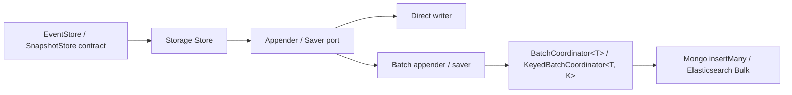

# Storage Batching

## Decision

Use a storage-independent `BatchCoordinator<T>` in `wow-core`, composed
with protocol-specific writers and narrow EventStore/SnapshotStore collaborators
inside each infrastructure module.

Do not put MongoDB or Elasticsearch request types in the coordinator. Do not make
the base stores construct Bulk requests directly, and do not expose parallel
`BatchMongoEventStore` or `BatchElasticsearchEventStore` public store hierarchies.
The selected composition keeps domain operation signatures and data types
unchanged while allowing MongoDB EventStore, Elasticsearch EventStore, and
Elasticsearch SnapshotStore to reuse the same admission, batching,
result-routing, cancellation, and shutdown machinery.

## Alternatives

| Alternative | Result |
|-------------|--------|
| One batcher per Store | Rejected. It duplicates cancellation, bounded admission, result isolation, close, timeout, and race handling. |
| Common coordinator plus storage-specific writers | Selected. The common layer knows only `T`, `Mono`, and one result per input; each infrastructure module owns its protocol and error mapping. |
| Public `BatchMongoEventStore` / `BatchElasticsearchEventStore` decorators | Rejected as the primary API. They would duplicate the full Store surface and create another public type per storage/Store combination. Narrow internal appender/saver composition provides the same separation without changing domain operation signatures. |

## Contracts

### Coordinator

- Submission is lazy: admission and item construction begin on subscription.
- Admission is non-blocking and bounded by `maxPendingItems`; exhaustion fails the
  new caller with `BatchOverflowException`.
- `maxSize` or `maxDelay` closes a batch window. Batches are sent serially by the
  coordinator, while a protocol writer may use one native multi-item request.
- `BatchCoordinator` remains the single-lane primitive. `KeyedBatchCoordinator`
  hashes an immutable ordering key into a fixed number of lanes; writer calls are
  serial within a lane and may overlap across lanes. It shares one global
  admission bound, lifecycle, result dispatcher, and close operation across all
  lanes.
- Equal keys are assigned to the same lane, but multiple equal-key items may be
  present in one native batch. The coordinator does not add an item-order
  guarantee inside a protocol request; that remains a writer/storage contract.
- A writer used by `KeyedBatchCoordinator` must support concurrent calls from
  different lanes. `laneCount=1` preserves the original globally serial path and
  remains the default.
- The writer must return exactly one `BatchItemResult` for every claimed input,
  in input order. Empty or wrong-cardinality results are protocol failures.
- A writer request failure fails every claimed item in that batch, but it does
  not terminate later batches.
- Per-item failures are signalled only to the matching subscriber.
- Cancelling before claim removes the item from protocol work and releases live
  admission. Its physical queue placeholder stays bounded and is reclaimed when
  the pipeline observes it, so a cancellation storm can temporarily exhaust
  queue-slot capacity even when fewer live callers remain. Cancelling after
  claim does not cancel an already-started storage write.
- `close()` rejects new submissions, completes the input, flushes a partial
  window, waits for protocol work and result delivery, and is idempotent.
- Close timeout or interruption freezes admission and fails outstanding queued
  or in-flight callers. A protocol write that already settled may still deliver
  its result after the synchronous close call times out; timeout stops waiting,
  it does not roll back acknowledged storage work. The default close timeout is
  30 seconds.

### MongoDB EventStore

- Direct mode remains `insertOne`.
- Batch mode groups items by target collection and uses unordered `insertMany`.
- The optional lane key is the complete aggregate identity. This prevents
  overlapping `insertMany` requests for one aggregate while allowing different
  aggregate lanes to write concurrently.
- MongoDB bulk-write errors are mapped back to the matching append; successful
  items in the same unordered request remain successful.
- Collection groups inside one coordinator batch are joined before results are
  delivered. A stalled collection can therefore increase latency for the other
  collection groups in that batch, although their success/error results remain
  isolated. Removing this batch-level head-of-line latency is a writer-level
  optimization and does not require changing the coordinator contract.

### Elasticsearch EventStore

- Direct and batch paths use `create`, never `index`, preserving the event
  stream no-overwrite invariant.
- The optional lane key is the complete aggregate identity, matching MongoDB
  EventStore concurrency boundaries without leaking Elasticsearch types into the
  common coordinator.
- A Bulk request retains each item's index, document ID, and routing.
- The writer validates item count, operation, ID, `errors()`, and every item
  status before routing results. It deliberately does not require the response
  `_index` to equal the request expression: Elasticsearch returns a concrete or
  backing index when the request targets an alias or data stream.
- An item status of 409 maps only that append to
  `EventVersionConflictException`. Other item failures remain protocol-specific
  exceptions, and successes in the same response complete normally.
- `refreshPolicy` is applied once to the Bulk request and remains configurable.

### Elasticsearch SnapshotStore

- Snapshot persistence uses Bulk `update` with scripted upserts.
- The optional lane key is `(index, document ID)`, so snapshots for one stored
  document cannot be sent by overlapping Bulk requests.
- Items for the same index/document ID in one batch are coalesced to the highest
  aggregate version; equal versions preserve the first submission, matching
  source-version guard behavior across separate requests.
- Every direct and batch write uses an atomic `update` script that compares
  `_source.version`, replaces the complete source only for a newer incoming
  snapshot, and otherwise performs a no-op. Missing documents are inserted with
  `upsert`.
- The source guard remains authoritative across Store instances and also
  protects legacy documents whose Elasticsearch internal `_version` is a write
  counter rather than the aggregate version.
- Bulk response items are validated and returned independently to their
  corresponding callers; a failed item does not change successful item results.

## Compatibility And Migration

Batching is opt-in and direct behavior remains the default. Existing Store
constructors remain available. Applications enable batching through the
storage-specific batch options or the corresponding Spring Boot properties.
`EventStore` and `SnapshotStore` now extend `AutoCloseable` with a default
no-op `close()` so decorators can propagate shutdown to an underlying batch
coordinator. This is an additive JVM interface change: existing implementations
normally inherit the default method, but code that reflects on implemented
interfaces or declares an incompatible/non-public `close()` may need adjustment.
Append/save method signatures and domain data types are unchanged.

Routing stores own the lifecycle of their distinct registry leaves so manual
composition can flush and close batch-enabled stores by closing the router.
Spring's routing auto-configuration disables the router bean's inferred destroy
callback because the leaf stores are independently container-owned beans; Spring
therefore closes each leaf once without also invoking the router's ownership
path.

`BatchCoordinator` and its storage-neutral options/results are a new
public infrastructure API in `wow-core`. Storage adapters must keep protocol
types and error interpretation in their own modules so this API can evolve
without coupling the core to MongoDB or Elasticsearch.

`KeyedBatchCoordinator` is an additive public infrastructure API. Storage batch
options add `laneCount`, and Spring Boot exposes it as `lane-count`; the default
is `1`, so existing applications retain globally serial batch writes. Increasing
it requires a concurrency-safe protocol writer and should be validated against
the application's key distribution and storage capacity.

Elasticsearch SnapshotStore now uses the same atomic `_source.version` guarded
update in direct and batch modes. Existing internal-version documents need no
metadata migration: their `_version` write counter is never used to order
aggregate snapshots. Documents without a source `version` fail explicitly
instead of being overwritten.

Rollback is configuration-only while the old constructors remain: disable the
batch option to return to direct writes. The direct path retains the same source
version protection, so rollback cannot reintroduce an older-over-newer
overwrite.

## Verification

Functional verification must include:

- single-item success;
- partial item failure and exact caller isolation;
- event version conflict mapping;
- whole-request failure followed by a healthy batch;
- cross-index/collection, alias-to-concrete response, and routing preservation;
- concurrent submissions and bounded overflow;
- same-lane serial writer calls, different-lane concurrent writer calls, and one
  global pending bound;
- cancellation before and after claim;
- close flushing a partial batch, timeout, and idempotent close;
- Elasticsearch snapshot newer-before-older ordering;
- direct and batch upgrades from legacy internal-version snapshot documents.

Performance evidence must compare the same 128-event workload at three layers:
single Store write, native protocol Bulk, and end-to-end coordinated batch. Run
both throughput and average-time modes, and for Elasticsearch use the same
`refresh` policy in every leg. Average-time scores are amortized wall time per
event because JMH normalizes a 128-event invocation with
`@OperationsPerInvocation(128)`; they are not the independent response latency
of a single concurrent append. Quick one-fork results are directional; formal
claims require the multiple-fork confirmation tasks documented in
`wow-benchmarks/README.md`, run from a clean `HEAD`.
