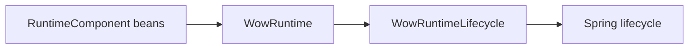
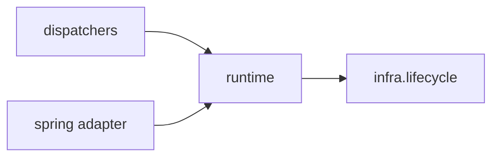
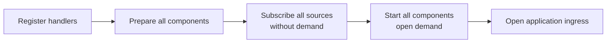
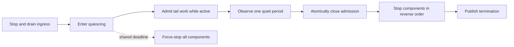

# Unified Runtime Orchestration

## Decision

Wow has one high-level runtime owner:
`me.ahoo.wow.runtime.WowRuntime`.

Applications register `RuntimeComponent` instances with that runtime. Spring
contributes components from the current application context and exposes one
`WowRuntimeLifecycle` adapter. Dispatchers are components; they are not
independent Spring lifecycles or bean-destroy owners.



The design deliberately relies on one explicit composition root instead of
runtime ownership handles, target unwrapping, global registries, or per-dispatcher
private runtimes.

## Package and responsibility boundaries

- `me.ahoo.wow.runtime` contains the public orchestration model:
  `WowRuntime`, `RuntimeComponent`, `RuntimeContext`, and `RuntimeActivity`.
- `me.ahoo.wow.runtime.internal` contains state machines, component grouping,
  deadlines, bounded cleanup execution, and failure accumulation.
- `me.ahoo.wow.infra.lifecycle` remains the runtime-independent capability
  package. Generic `Lifecycle`, `GracefullyStoppable`, `ForceStoppable`, and
  terminal-signal utilities do not depend on Wow runtime policy.
- `me.ahoo.wow.spring` contains only Spring integration and component discovery
  helpers. It does not own core runtime state.

Dependency direction remains one-way:



The generic lifecycle package is therefore not moved under `runtime`.

## Component contract

`RuntimeComponent` is the complete collaboration contract:

```kotlin
interface RuntimeComponent {
    fun prepare(runtimeContext: RuntimeContext)
    fun start()
    fun stopGracefully(): Mono<Void>
    fun forceStop()
}
```

The rules are:

- Construction is inert.
- `prepare` acquires subscriptions or resources without opening processing.
- `start` opens processing only after every component is prepared.
- `stopGracefully` drains accepted work and releases resources.
- `forceStop` is prompt, non-blocking, idempotent, and safe before `prepare`.
- Long-lived asynchronous work holds a `RuntimeActivity`.
- Intake closure is registered through `RuntimeContext.onAdmissionClose`.
- Fatal component errors are reported through `RuntimeContext.reportFailure`.

`RuntimeComponent` intentionally does not extend `AutoCloseable`. A container
must not infer a second `close()` lifecycle for runtime-owned components.

`MessageDispatcher` directly extends `RuntimeComponent`. Legacy lifecycle
adapters and graceful-only force fallbacks are not supported. In particular,
`AggregateSchedulerSupplier` supplies both graceful and force-stop semantics.

## Startup barrier

Startup is a two-pass operation:



Preparing all downstream subscriptions before opening any source demand avoids
losing messages on in-memory transports. Command, event, projection, and saga
flows form a dependency cycle, so startup cannot be represented as a simple
publisher-first DAG.

`WowRuntime.start()` returns `Mono<Void>`. A startup failure is composed with
its asynchronous rollback; it does not block a Reactor non-blocking worker.
Prepared components roll back in reverse order.

## Graceful shutdown

Shutdown operates on complete-runtime activity:



Each new activity restarts `wow.shutdown-quiet-period`. At the quiet boundary,
admission closes before component cleanup begins. This covers broker handoff
gaps where upstream publication completes before downstream consumption begins.

One `wow.shutdown-timeout` bounds the entire shutdown, including startup
rollback. Deadline expiry atomically replaces the graceful owner and force-stops
all registered components.

Runtime control delivery, public termination observers, deadline scheduling,
and best-effort physical cleanup use separate bounded resources. Spring claims
the trusted termination control channel through
`WowRuntime.claimTerminationControl`; public observers cannot starve it.

## Concurrency and failure semantics

`RuntimeComponentGroup` is the shared ordered composition primitive used by
`WowRuntime`, `MainDispatcher`, and `CompositeEventDispatcher`.

- Component identities must be distinct within one group.
- Preparation and start follow registration order.
- Graceful and force cleanup follow reverse order.
- Force-stop covers every registered component, including components not yet
  prepared.
- Complete lifecycle actions are linearized with force-stop.
- If force-stop overlaps `prepare` or `start`, the group invokes `forceStop`
  again after the method returns. If it overlaps `stopGracefully`, the slot
  remains in flight until the returned publisher terminates or upstream
  cancellation returns, and compensation runs afterward.
- If force-stop wins while `stopGracefully` is returning its cold publisher,
  the group does not subscribe that publisher.
- Once force-stop wins, a detached graceful chain cannot enter a later component
  or managed cleanup step.

The first non-fatal failure remains primary and later failures are suppressed.
Failure mutation and terminal publication share one seal: a published terminal
failure is never mutated by late cleanup.

A fatal dispatcher pipeline error fails the complete runtime. In Spring, the
runtime lifecycle asynchronously closes the application context so ingress
cannot remain available over a terminated data plane.

## Spring integration

The Starter uses the current `ConfigurableListableBeanFactory` as the composition
boundary:

1. Find local `RuntimeComponent` bean names.
2. Require each component bean to be a singleton.
3. Obtain the exposed bean instance and reject a competing Spring
   `Lifecycle` owner.
4. Sort using Spring's `PriorityOrdered`, `Ordered`, and factory-method
   `@Order` semantics.
5. Pass the immutable list to `WowRuntime`.

Only local bean names are collected; a child context never takes ownership of a
parent component. The runtime invokes the exposed proxy itself, so AOP advice
runs exactly once. It does not unwrap `TargetSource` objects or bypass advice.
A JDK proxy that participates in the runtime must expose `RuntimeComponent`.

The resulting boundary is:

```text
local singleton RuntimeComponent beans
                ↓
            WowRuntime
                ↓
       WowRuntimeLifecycle
```

`WowRuntimeLifecycle` is the only `SmartLifecycle` owner. Its phase precedes
Spring Boot web ingress on startup and follows ingress shutdown on stop. The
default Spring lifecycle processor receives a per-phase timeout of
`wow.shutdown-timeout + 1s`. A user-provided `DefaultLifecycleProcessor` is
configured the same way; other lifecycle processor implementations own their
timeout policy.

Handler auto-registrars implement `SmartInitializingSingleton`, not
`SmartLifecycle`. Registration is initialization work and completes before
Spring starts the runtime.

The runtime and its Spring lifecycle are one-shot. Recreate the application
context instead of stopping and restarting the same runtime.

## Extension migration

- Implement `RuntimeComponent` directly for a custom runtime participant.
- Expose that component as a singleton Spring bean using a return type that
  includes `RuntimeComponent`.
- Do not register a per-dispatcher launcher or independent destroy method.
- Use `WowRuntime` for application and benchmark lifecycle. Direct dispatcher
  lifecycle calls are reserved for focused component-level tests that explicitly
  prepare their runtime context.
- `WowRuntime.start()` is cold and must be subscribed; a blocking standalone
  boundary may use `runtime.start().block()`.
- Customize dispatcher lifecycle through `prepareManaged`, `startManaged`,
  `stopManagedGracefully`, and `forceStopManaged`.
- Keep generic lifecycle-only types under `me.ahoo.wow.infra.lifecycle`; only
  components participating in readiness, global quiescence, and shared failure
  policy belong to `me.ahoo.wow.runtime`.

This intentionally breaks the earlier internal runtime API. The removed
ownership handles, compatibility adapters, launcher factories, marker
interfaces, and registry validation are not migration targets.
