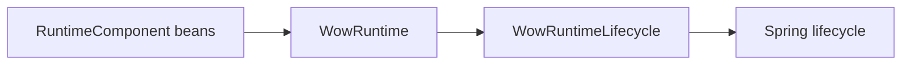
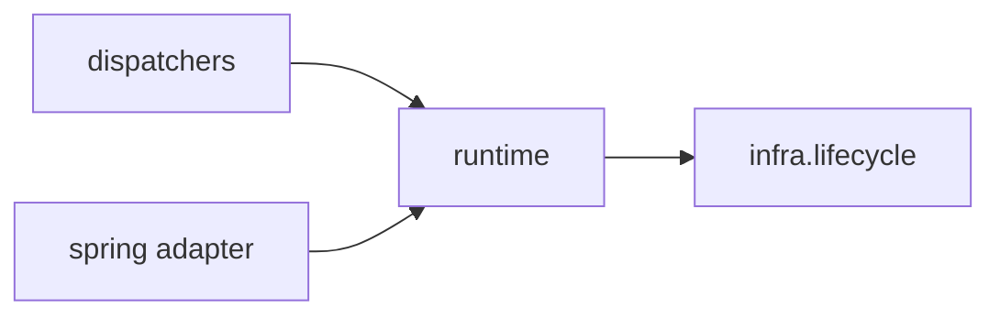
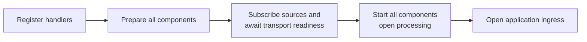
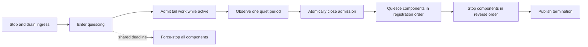

# Unified Runtime Orchestration

## Decision

Wow has one high-level runtime owner:
`me.ahoo.wow.runtime.WowRuntime`.

Applications register `RuntimeComponent` instances with that runtime. When
Spring creates the default runtime, it contributes components from the current
application context and exposes one canonical `WowRuntimeLifecycle` adapter. A custom
runtime owns its component topology explicitly, while the lifecycle adapter remains
Starter-owned. Dispatchers are components;
they are not independent Spring lifecycles or bean-destroy owners.



The design deliberately relies on one explicit composition root instead of
runtime ownership handles, target unwrapping, global registries, or per-dispatcher
private runtimes.

## Package and responsibility boundaries

- `me.ahoo.wow.runtime` contains the public orchestration model and
  `WowRuntime`'s private whole-runtime state and policy: lifecycle state,
  shutdown ownership, deadline scheduling, force cleanup, and terminal sealing.
- `me.ahoo.wow.runtime.internal` contains reusable concurrency mechanisms:
  admission and activity tracking, ordered component grouping, execution-resource
  isolation, bounded terminal delivery, and failure accumulation.
- `me.ahoo.wow.infra.lifecycle` contains runtime-independent shutdown and
  terminal-observation capabilities. `GracefullyStoppable` and
  `TerminatedSignalCapable` do not define startup, readiness, ordering, or Wow
  runtime policy. The redundant generic `Lifecycle` start/stop contract is
  removed.
- `me.ahoo.wow.spring` contains only Spring integration and component discovery
  helpers. It does not own core runtime state.

Dependency direction remains one-way:



The generic capability package is therefore not moved under `runtime`.

## Component contract

`RuntimeComponent` is the complete collaboration contract:

```kotlin
interface RuntimeComponent {
    fun prepare(runtimeContext: RuntimeContext): Mono<Void>
    fun start()
    fun quiesce() = Unit
    fun stopGracefully(): Mono<Void>
    fun forceStop()
}
```

The rules are:

- Construction is inert.
- `prepare` acquires subscriptions or resources without opening processing and
  completes only when the component can retain admitted work without loss.
- `start` opens processing only after every component is prepared.
- `quiesce` promptly and synchronously closes component intake after global
  admission closes.
- `stopGracefully` drains accepted work and releases resources.
- `forceStop` is prompt, non-blocking, idempotent, and safe before `prepare`.
- Long-lived asynchronous work holds a `RuntimeActivity`.
- Fatal component errors are reported through `RuntimeContext.reportFailure`.

`RuntimeComponent` intentionally does not extend `AutoCloseable`. A container
must not infer a second `close()` lifecycle for runtime-owned components.

`MessageDispatcher` directly extends `RuntimeComponent`. Legacy lifecycle
adapters and graceful-only force fallbacks are not supported. In particular,
`AggregateSchedulerSupplier` supplies both graceful and force-stop semantics.

## Startup barrier

Startup is a two-pass operation:



Preparing all downstream subscriptions and transport retention points before
opening any dispatcher processing avoids startup loss. In-memory transports are
ready once the subscription is installed behind its demand gate. Redis is ready
after all consumer groups exist at `latest`; stream reads remain closed until
the runtime explicitly opens `MessageReceiver` processing, so readiness and
reactive prefetch cannot move entries into the PEL.
Kafka is ready after capturing each broker-assigned position, running user
assignment customizers, and asynchronously committing the earlier of the
original and customized positions. Every in-flight assignment anchor must
settle before readiness; cooperative retained partitions are not included in
incremental assignment callbacks and are not re-anchored. Readiness therefore
never commits past the position that the session intends to consume; forward
seeks remain session-local until normal processing commits them. Command,
event, projection, and saga flows form a dependency cycle, so startup cannot be
represented as a simple publisher-first DAG.

`WowRuntime.start()` returns `Mono<Void>`. A startup failure is composed with
its asynchronous rollback; it does not block a Reactor non-blocking worker.
Lifecycle-entered components roll back in reverse order. Cancelling the startup
subscription aborts and force-stops the one-shot runtime before cancellation is
propagated to an in-flight preparation publisher.

## Graceful shutdown

Shutdown operates on complete-runtime activity:



Each new activity restarts `wow.shutdown-quiet-period`. At the quiet boundary,
global admission closes before component intake, then cleanup begins. This
covers broker handoff gaps where upstream publication completes before
downstream consumption begins.

`MessageReceiver.closeProcessing()` synchronously revokes logical transport
admission before physical source cancellation is detached. Built-in in-memory
local-first delivery returns success only after every targeted dispatcher has
acquired a runtime activity lease and handed the tracked exchange to its
processing pipeline. Sink acceptance, buffering, and physical subscriber count
are not delivery receipts. Admission rejection, filtering, or a route change
completes the attempt as undelivered, so the distributed fallback is sent
without the local-handled flag. The receipt proves admission, not successful
handler completion; a later fatal pipeline failure follows runtime failure
semantics and does not retroactively reroute an admitted message.
Ordinary `receiver()` consumers do not participate in local suppression.
Runtime-owned custom consumers opt in explicitly through `runtimeReceiver()`
and then confirm or reject the receipt after their equivalent admission step;
built-in dispatchers perform this protocol automatically.

One `wow.shutdown-timeout` bounds the entire shutdown, including startup
rollback. Deadline expiry atomically replaces the graceful owner and force-stops
all registered components.

Runtime control delivery, public termination observers, deadline scheduling,
and best-effort physical cleanup use separate bounded resources. Spring claims
the trusted termination control channel through
`WowRuntime.claimTerminationControl`; public observers cannot starve it.

## Concurrency and failure semantics

`RuntimeComponentGroup` is the shared ordered composition primitive used by
`WowRuntime`, `MainDispatcher`, and `CompositeEventDispatcher`.

- Component identities must be distinct within one group.
- Preparation and start follow registration order.
- Quiescence follows registration order.
- Graceful and force cleanup follow reverse order.
- Force-stop covers every registered component, including components not yet
  prepared.
- Complete lifecycle actions are linearized with force-stop.
- If force-stop overlaps `prepare`, `start`, or `quiesce`, the group invokes
  `forceStop` again after the method returns. If it overlaps
  `stopGracefully`, the slot remains in flight until the returned publisher
  terminates or upstream cancellation returns, and compensation runs afterward.
- If force-stop wins while `stopGracefully` is returning its cold publisher,
  the group does not subscribe that publisher.
- Once force-stop wins, a detached graceful chain cannot enter a later component
  or managed cleanup step.

The first non-fatal failure remains primary and later failures are suppressed.
Failure mutation and terminal publication share one seal: a published terminal
failure is never mutated by late cleanup.

A fatal dispatcher pipeline error immediately closes global admission and
component intake, skips the ordinary quiet period, drains already admitted
work, and fails the complete runtime. In Spring, the runtime lifecycle
asynchronously closes the application context so ingress cannot remain
available over a terminated data plane.

## Targeted performance confirmation

The two four-thread `CommandSendE2EBenchmark.sendAndWaitSent` regression
candidates in the broad baseline comparison were rerun on 2026-07-30 with the
same host, JDK, JVM arguments, GC profiler, warmup, measurement, forks, and
parameters. Both source manifests were clean and successful.

```bash
./gradlew :wow-benchmarks:benchmarkConfirmE2E \
  -PbenchmarkConfirmE2EThreads=4 \
  -PbenchmarkConfirmE2EIncludes=me.ahoo.wow.benchmark.e2e.CommandSendE2EBenchmark.sendAndWaitSent \
  '-PbenchmarkConfirmE2EParameters=gatewayScenario=ceiling,validated' \
  --no-parallel
```

- Base run `b70b3a0c-ec1d-4973-a3af-48cee0e53c7d`:
  commit `7f5e44aeee642ec9f2e977dbbc9a634fedee4a59`, JMH jar
  `2ca6cf2de3cbcac1e4421efc857199be34da335977b44a88976f7a35c0d2d1d1`,
  manifest SHA-256
  `9078d5eddb1968388ab19f166c0c367ecbeab50234a5c3bd8e2ad24fce8c4116`.
- Candidate run `c2755cce-1203-490c-bfbf-920784120994`:
  commit `a27d79cd72698891358f9f3efe43cda373061b87`, JMH jar
  `8d86e3e94d70b5ca642816c5fbb3b9cad9b3d27cdb4fe82a73229d0d96c2c4c3`,
  manifest SHA-256
  `2ade0a917ac6db0395ad0634c746e1373475736e7b95f88e4ed1dd7c08eb3c51`.

| Scenario | Base `7f5e44a` | Candidate `a27d79c` | Delta | Result |
|---|---:|---:|---:|---|
| `ceiling` | 802,429 ± 387,896 ops/s | 860,692 ± 463,583 ops/s | +7.26% | Stable; intervals overlap |
| `validated` | 780,005 ± 392,646 ops/s | 881,363 ± 174,267 ops/s | +12.99% | Inconclusive improvement; intervals overlap |

Normalized allocation remained within 0.6% for both scenarios. The targeted
run therefore does not confirm either reported regression. Confirmation output
remains diagnostic and does not replace the accepted baseline, as required by
`wow-benchmarks/README.md`. These numbers prove only the two named clean commits;
the later receipt and admission fixes add per-exchange dispatcher work and are not
represented by this run. No current-HEAD performance conclusion should be drawn
from these results; rerun the targeted comparison before making one.

## Spring integration

The Starter uses one direct local singleton named `wowRuntime` as the canonical
composition boundary. It must be the current `ApplicationContext`'s only
`WowRuntime`; a `FactoryBean` product is rejected because the Starter cannot prove
that the factory will not become a second destruction owner. A parent runtime
cannot replace this local boundary. The Starter also owns the canonical bean
`wowRuntimeLifecycle` and rejects any additional local `WowRuntimeLifecycle`;
applications may replace the runtime topology, but not its Spring lifecycle owner.

When the Starter creates that default runtime, it uses the current
`ConfigurableListableBeanFactory` to:

1. Find local `RuntimeComponent` bean names.
2. Require each component bean to be a singleton.
3. Obtain the exposed bean instance and reject a competing Spring `Lifecycle`
   or standard Spring destruction owner.
4. Sort using Spring's `PriorityOrdered`, `Ordered`, and factory-method
   `@Order` semantics.
5. Pass the immutable list to `WowRuntime`.

Only local bean names are collected; a child context never takes ownership of a
parent component. The runtime invokes the exposed proxy itself, so AOP advice
runs exactly once. It does not unwrap `TargetSource` objects or bypass advice.
A JDK proxy that participates in the runtime must expose `RuntimeComponent`.
For a `RuntimeComponent` exposed as a `FactoryBean` product, Spring owns
destruction of the factory rather than the product, so factory destruction
metadata is not attributed to the component. This does not relax the stricter
rule that the canonical `WowRuntime` itself cannot be a `FactoryBean` product.

The resulting boundary is:

```text
local singleton RuntimeComponent beans
                ↓
 canonical singleton bean "wowRuntime"
                ↓
 canonical bean "wowRuntimeLifecycle"
```

The canonical `WowRuntimeLifecycle` is the only `SmartLifecycle` owner. Its phase precedes
Spring Boot web ingress on startup and follows ingress shutdown on stop. The
default Spring lifecycle processor receives a per-phase timeout of
the selected `WowRuntime.shutdownTimeout + 1s`. This remains correct when an
application supplies a custom `WowRuntime` whose timeout differs from
`wow.shutdown-timeout`. A user-provided `DefaultLifecycleProcessor` is
configured the same way; other lifecycle processor implementations own their
timeout policy.

Handler auto-registrars implement `SmartInitializingSingleton`, not
`SmartLifecycle`. Registration is initialization work and completes before
Spring starts the runtime.

The runtime and its Spring lifecycle are one-shot. Recreate the application
context instead of stopping and restarting the same runtime.

## Extension migration

- Implement `RuntimeComponent` directly for a custom runtime participant.
- Expose that component as a singleton Spring bean using a return type that
  includes `RuntimeComponent`.
- Do not register a per-dispatcher launcher or independent destroy method.
- Use `WowRuntime` for application and benchmark lifecycle. Direct dispatcher
  lifecycle calls are reserved for focused component-level tests that explicitly
  prepare their runtime context.
- `WowRuntime.start()` is cold and must be subscribed; a blocking standalone
  boundary may use `runtime.start().block()`.
- Compose custom lifecycle ownership as a separate `RuntimeComponent` instead
  of subclassing a dispatcher lifecycle template. `MainDispatcher` retains only
  the narrow cleanup hooks required by scheduler-owning framework
  implementations.
- Keep standalone resources in their responsibility-owning module and package;
  they may implement the narrow capabilities declared in
  `me.ahoo.wow.infra.lifecycle`. Only components participating in readiness,
  global quiescence, and shared failure policy implement
  `me.ahoo.wow.runtime.RuntimeComponent`.
