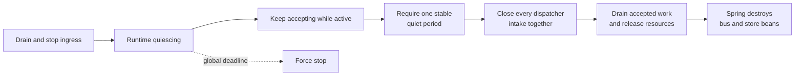

# Unified Runtime Orchestration

## Decision

Wow owns dispatcher lifecycle through one top-level
`me.ahoo.wow.runtime.WowRuntime`. Spring contributes one
`WowRuntimeLifecycle`; individual dispatchers are no longer independent Spring
lifecycles or bean-destroy owners.

The package boundary follows responsibility rather than putting every lifecycle
type under `runtime`:

- `me.ahoo.wow.runtime` contains the public high-level orchestrator and component
  collaboration SPI: `WowRuntime`, `RuntimeComponent`, `RuntimeContext`,
  `RuntimeActivity`, the stable `RuntimeOwnership` handle, and the explicit
  legacy adapter.
- `me.ahoo.wow.runtime.internal` contains orchestration mechanics and policy:
  component grouping, the concrete runtime context state machine, cleanup
  execution, and deadlines. Legacy/direct-use policy is isolated further under
  `me.ahoo.wow.runtime.internal.compat`.
- `me.ahoo.wow.infra.lifecycle` remains the low-level, runtime-independent
  capability package for `Lifecycle`, `GracefullyStoppable`,
  `ForceStoppable`, `TerminatedSignalCapable`, bounded terminal-signal delivery,
  and pure lifecycle composition.

This keeps the dependency direction one-way: runtime builds on generic
lifecycle capabilities; generic lifecycle code never depends back on runtime.

Startup is a two-stage barrier:

Preparing all subscriptions before opening demand prevents an early dispatcher
from publishing to an in-memory bus whose downstream consumer has not subscribed.
This is required because command, event, and saga processing form a dependency
cycle rather than a startup DAG.

Shutdown is coordinated around complete-runtime activity:

`RuntimeContext` does not guess message provenance. While quiescing it admits
all arriving work, and each operation restarts `wow.shutdown-quiet-period`.
The first complete quiet period starts when quiescing begins, even if the runtime
is already idle. At its boundary, admission is atomically closed before every
dispatcher intake is signalled. This covers asynchronous broker handoff gaps in
which a producer is acknowledged before the downstream consumer sees its event
or tail command, without admitting work after intake shutdown has started.

Ingress must stop before this phase; Spring lifecycle ordering provides that for
the application server. Independent external producers can keep the runtime
active, so the global `wow.shutdown-timeout` remains the hard bound. The quiet
period should be configured above the expected publish-to-consume handoff delay.

`RuntimeContext` is also the public extension SPI for custom runtime components.
`tryAcquire()` returns an idempotent `RuntimeActivity` lease that must remain
open for the complete asynchronous operation chain. `onAdmissionClose()` registers
the component intake barrier, and `reportFailure()` propagates a terminal pipeline
failure to the complete runtime. The lease API deliberately avoids exposing a
separate public decrement operation that could underflow the global activity
counter. Intake-close callbacks are dispatched off the shutdown owner thread.
Because that callback is asynchronous and may itself be faulty, every
`ForceStoppable.forceStop()` implementation must synchronously close its logical
admission. Physical cancellation hooks outside the component's control may run
as bounded best-effort cleanup and are not ordered before later resource
disposal. Intake-close and other best-effort physical cleanup use one
process-wide eight-worker executor with a bounded queue. Force-close removes
that context's queued callbacks and interrupts callbacks already running. A
callback that ignores interruption can therefore consume only a fixed
process-wide thread and retention budget; saturation is reported as runtime
failure and escalates to component force-stop.

The reactive shutdown subscription itself runs on a dedicated bounded
`wow-runtime-shutdown` scheduler. It does not consume Reactor's shared
`boundedElastic` capacity. Every shutdown owner also installs its deadline on a
separate `wow-runtime-deadline` timer. Deadline expiry replaces the graceful
owner before cancellation is submitted to the bounded cleanup executor, so a
blocking cancellation hook cannot prevent logical force-stop and termination.
The raw hot termination signal remains private to runtime control flow. Each
public termination subscriber must reserve a permit from a dedicated bounded
daemon dispatcher at subscription time. The permit covers one running or queued
terminal callback, so every admitted callback can later be dispatched without
terminal-time rejection and no callback executes on the runtime emitter thread.
An over-capacity subscriber receives `RejectedExecutionException` immediately
on its own subscription thread instead of hanging or silently losing completion.
The one framework controller is claimed explicitly through
`WowRuntime.claimTerminationControl` and runs on a separate bounded control
dispatcher. Public observers cannot consume its workers or permits. Runtime
control flow, observer delivery, and physical cleanup therefore use separate
bounded resources. Both controller and observer callbacks must return promptly;
applications offload blocking notification work to their own bounded executor.

## Failure semantics

- Components are prepared before any component starts.
- A graceful-stop request received during startup is retained. Startup unwinds at
  the next safe boundary, prepared components roll back, and the deadline is
  measured from the original stop request; a blocked startup is force-stopped
  when that deadline expires.
- Startup failure stops every prepared component in reverse order.
- Successful startup rollback remains graceful; rollback failure or deadline
  expiry escalates to force-stop.
- Shutdown continues after non-fatal component failures.
- The first failure remains primary; later failures are suppressed. Runtime and
  context failures use the same sealable accumulator policy: primary selection,
  suppressed mutation, and terminal sealing share one critical section.
- Runtime termination atomically seals failure reporting before publishing the
  hot termination signal, so a fatal failure racing the terminal transition is
  either included in the result or is unambiguously after termination. Detached
  graceful pipelines cannot mutate a published `Throwable`.
- All components share one `wow.shutdown-timeout` deadline.
- New activity resets one shared `wow.shutdown-quiet-period`.
- The quiet boundary closes every registered dispatcher intake before component
  resource cleanup begins.
- Any failed graceful shutdown, including deadline expiry, force-stops every
  claimed component, including components not yet prepared. `forceStop()` is
  idempotent and safe before preparation; when force overlaps an
  in-flight `prepare`/`start`, the runtime performs a second compensation pass
  after that startup call returns.
- `GracefullyStoppable` remains the legacy graceful-only contract.
  Runtime-owned components must additionally implement `ForceStoppable`, whose
  `forceStop()` must be idempotent, non-blocking, and prompt. Subscribing to the
  graceful path is not a valid force fallback.
- `RuntimePreparable` is the readiness-barrier capability.
  `RuntimeComponent` combines `Lifecycle`, `RuntimePreparable`, and
  `ForceStoppable`, and exposes one stable `RuntimeOwnership` handle. Every
  component creates that handle once and retains it for its complete lifetime.
  `WowRuntime` uses the handle to create an owner-bound component view and
  complete the all-component claim transaction internally; claim,
  commit, and rollback are not extension APIs. `RuntimeLifecycleAdapter`
  explicitly upgrades a legacy `Lifecycle`, but cannot wrap another
  `RuntimeComponent` and bypass its ownership.
- One internal `RuntimeComponentGroup` is used by `WowRuntime`,
  `MainDispatcher`, and `CompositeEventDispatcher`. It owns transactional
  claims, the all-component prepare barrier, ordered start, reverse cleanup,
  atomic startup admission, and the second force compensation pass when
  `prepare` or `start` overlaps hard shutdown.
- Explicit force-stop replaces the graceful shutdown owner atomically. An
  already in-flight graceful callback can no longer publish termination before
  force cleanup finishes or discard a force cleanup failure. Nested dispatcher
  cleanup checks the same force boundary between every child, managed hook, and
  scheduler step, so a physically uncancelled graceful subscription cannot enter
  new cleanup work after force-stop wins.
- If force-stop terminates the runtime while a component's startup call is
  still blocked, the runtime cannot retroactively replace an already-published
  termination result with a failure from the later compensation pass. If a
  primary failure was recorded before termination, the startup caller observes
  that same primary failure; otherwise it observes its own late startup failure.
  The published failure is never mutated after termination is sealed.
- A fatal dispatcher pipeline error fails the shared runtime. The Spring adapter
  then closes the application context so ingress cannot remain available over a
  terminated data plane.
- Concurrent shutdown observers share one hot termination state; cancelling an
  observer releases only its delivery permit and does not cancel runtime-owned
  cleanup. Admitted callbacks are asynchronous and cannot block force-stop or
  deadline completion. Capacity exhaustion is reported synchronously while the
  extra observer subscribes, before it can become part of the terminal fan-out.
- Aggregate scheduler suppliers are one-shot. Scheduler lookup and terminal
  draining share one lifecycle boundary, so a concurrent lookup is either
  included in cleanup or rejected after shutdown.
- A legacy child dispatcher may be adapted only when it implements
  `ForceStoppable`; a graceful-only dispatcher fails fast instead of pretending
  that asynchronous graceful cleanup is a hard stop. It participates in the
  readiness barrier when it also implements `RuntimePreparable`. Graceful-only
  aggregate scheduler suppliers retain a bounded best-effort compatibility
  path because their existing public contract predates runtime orchestration;
  new implementations should implement `ForceStoppable`.
- Direct dispatcher use is also one-shot. Its first lifecycle call claims a
  private `WowRuntime`; a stop or force-stop before start is terminal, and a
  later start is rejected. An outer runtime transactionally claims an
  owner-bound component view only after validating every component; a failed
  multi-component claim rolls earlier claims back. Once committed, public
  dispatcher lifecycle calls reject attempts to bypass that external owner.
  Every `RuntimeLifecycleAdapter` for the same legacy delegate identity shares
  one weakly keyed ownership record, preventing multiple wrappers from creating
  multiple owners.
- Batch force-stop closes admission immediately, logically terminates
  uncooperative in-progress result callbacks, and atomically detaches every
  pending request from admission before invoking subscriber code. Detached
  terminal signals use a coordinator-owned executor with at most four workers
  and a queue bounded by that coordinator's `maxPendingItems`. It retains at
  most one task for each already-admitted detached request, so terminal delivery
  is not silently lost, one coordinator cannot starve another, and capacity
  remains aligned with the existing admission boundary. Queued framework-owned
  callbacks are abandoned. A hard-force upgrade interrupts detached callbacks
  already running; queued detached callbacks observe the same hard-force signal
  when they start, including an upgrade requested after logical termination.
  Lane cancellation uses a separate process-wide four-worker executor with a
  bounded queue, so an uncooperative cancellation hook cannot create an
  unbounded number of platform threads or retained cleanup handles. Every
  request permit and coordinator callback is detached synchronously before that
  physical cancellation is submitted. If the lane cleanup queue is saturated,
  physical publisher cancellation is dropped and logged as a best-effort
  limitation; logical ownership remains detached and force-stop remains prompt.
  Logical termination waits for neither detached terminal delivery nor
  best-effort physical cancellation and never executes subscriber callbacks
  on the force-stop caller. A batch settles its
  requests and registers their result tasks in one short terminal critical
  section, closing the `settle`-to-dispatch handoff gap without duplicate
  registrations; rejected-dispatch fallback runs outside that section.
  Timeout-driven soft force detaches queued and in-flight requests but leaves
  already-settled results on their accepted dispatcher path, preserving result
  order behind a blocking callback. Explicit hard force may detach those
  callbacks so logical termination never waits for them.

## Spring phase and ownership

The Wow runtime phase is lower than Spring Boot's web-server start/stop phase.
Wow is therefore ready before the server opens and remains available until the
server has drained and stopped. Handler registrars run at a still lower phase.
Spring's outer timeout for the Wow phase is derived as
`wow.shutdown-timeout + 1s`, so Spring cannot advance to bean destruction at its
default phase timeout while the runtime still owns cleanup. The Starter
registers a configured `DefaultLifecycleProcessor`; a custom processor must also
be a `DefaultLifecycleProcessor` and is configured by the ownership adapter.

The Starter registers exactly one canonical `WowRuntime` and exactly one
canonical `WowRuntimeLifecycle`; duplicate or replacement ownership fails
context refresh. `RuntimeComponentRegistry` disables inferred dispatcher
destroy methods for the canonical runtime membership; individual dispatcher
factory methods do not duplicate that ownership policy. An explicit dispatcher
destroy method is rejected instead of silently overwritten: its cleanup must be
part of `stopGracefully()` or `forceStop()`. Spring destroys bus/store
dependencies only after the runtime completes.

A single `RuntimeComponentRegistry` is the source of truth for both runtime
membership and Spring destruction ownership. It discovers declared component
types without eager initialization, freezes one immutable ordered descriptor
snapshot, resolves a stable singleton AOP target, and supplies the exact same
membership to `WowRuntime`. Snapshot resolution does not hold the registry lock
while Spring creates beans. Legacy `MessageDispatcher` targets are explicitly
adapted at this boundary only when they provide real force-stop capability.
`FactoryBean` products can be runtime-owned while destruction of the distinct
factory object remains Spring-owned. The registry also owns the construction
handoff: if context refresh fails before `WowRuntime` is constructed, it
force-stops every materialized valid component; after construction it delegates
fallback destruction to that same runtime. This closes the interval created by
suppressing Spring's inferred product destroy method.

Only runtime components declared in the current application context are
collected; a child context never takes ownership of a parent component. Custom
non-dispatcher components opt in by implementing `WowRuntimeComponent`.
Dispatchers and custom runtime components share one global Spring `@Order`
sequence. Startup follows that sequence and cleanup reverses it.
Runtime-owned beans must be singletons; prototype beans and scoped proxies fail
context refresh before they can create multiple lifecycle-owned instances. AOP
proxies must use a non-opaque, static `TargetSource`. The runtime resolves and
owns that stable singleton target directly; lifecycle advice on the proxy is
therefore intentionally bypassed. Registering both a proxy and its singleton
target also fails because it would give one instance two lifecycle slots.

The old `MessageDispatcherLauncher` types remain deprecated for binary and
source compatibility with applications that use `wow-spring` without the
Starter. The Starter rejects them as Spring beans because the canonical
`WowRuntimeLifecycle` must remain the only lifecycle owner.

Unexpected runtime termination dispatches application-context closure through
an asynchronous control-plane executor. It never calls `ApplicationContext.close`
from inside the runtime start/termination callback stack. Component registrars
are one-shot as well: a hard context restart is rejected before rescanning or
registering handlers, avoiding partial second-start side effects.
`WowRuntimeLifecycle` is inert during construction. It claims the runtime's
single termination controller before the first lifecycle `start` or `stop`
operation and reuses it for synchronous and callback-based Spring stop paths.
That controller has a dedicated bounded dispatcher, so blocked public
termination observers cannot delay Spring stop completion or unexpected
termination handling. Exhausted control-plane capacity fails that lifecycle
operation explicitly instead of proceeding without a reliable termination
control signal.

`WowRuntime` is intentionally one-shot. Spring `start()` is idempotent while it
is running, but a hard `ApplicationContext.stop()` followed by `start()` is
rejected before higher-phase ingress can restart. Recreate the application
context after runtime termination.

Custom runtime-component construction, factory methods, and `@PostConstruct`
must be inert. Resource acquisition and source subscription belong in
`prepare`/`start`, after the canonical runtime owns the component. The
construction fallback remains a defensive cleanup boundary, not an alternative
resource-acquisition phase.
The built-in `MainDispatcher`, `AggregateDispatcher`, and
`CompositeEventDispatcher` base classes expose protected additive lifecycle
hooks: `prepareManaged`, `startManaged`, `stopManagedGracefully`, and
`forceStopManaged`. Their public `runtimeOwnership`, `prepare`, `start`,
`stopGracefully`, and `forceStop` accessors and methods are final templates.
Subclasses cannot replace the ownership checks, readiness barrier, child
cleanup, or force-stop invariants. The canonical runtime obtains an internal
owner-bound view through the stable ownership handle rather than invoking the
dispatcher's public direct lifecycle.

This intentionally drops source and binary compatibility for subclasses that
overrode those public lifecycle methods. It also removes the intermediate
runtime-control marker and acknowledgement protocol: one final template per
phase is the complete lifecycle path. Spring owns the resolved singleton target
directly, so AOP advice intended for public lifecycle methods is not part of
runtime orchestration.

## Extension migration

This ownership boundary intentionally tightens lifecycle extension contracts:

- Existing `GracefullyStoppable` and `Lifecycle` implementations remain source
  compatible. To join `WowRuntime`, implement the complete `RuntimeComponent`
  contract or explicitly wrap a `Lifecycle` plus a real prompt force action in
  `RuntimeLifecycleAdapter`.
- Every custom `RuntimeComponent` implements `RuntimePreparable` and
  `ForceStoppable` and retains one
  `override val runtimeOwnership = RuntimeOwnership()` for its full lifetime.
  Identity-based, transactional exclusive ownership is the only public model;
  extension code does not implement the ownership transaction, and an unstable
  ownership handle fails fast. Owner-bound views and claim/commit/rollback
  mechanics remain runtime-internal.
- New `MainDispatcher`, `AggregateDispatcher`, and
  `CompositeEventDispatcher` subclasses customize lifecycle through
  `prepareManaged`, `startManaged`, `stopManagedGracefully`, and
  `forceStopManaged`. Existing overrides of public lifecycle methods must be
  migrated to these protected hooks; recompilation alone is insufficient
  because the public lifecycle templates are now final.
- A custom Spring runtime participant implements `WowRuntimeComponent`; an
  arbitrary `Lifecycle` bean is not collected.
- Custom code imports the orchestrator and runtime extension SPIs from
  `me.ahoo.wow.runtime`. Generic lifecycle capabilities such as `Lifecycle`,
  `GracefullyStoppable`, and `ForceStoppable` remain under
  `me.ahoo.wow.infra.lifecycle`.
