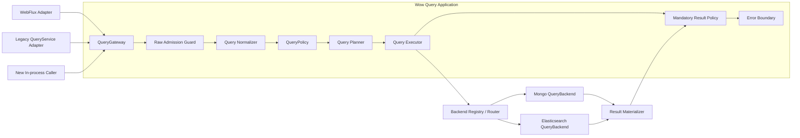

# Query 服务架构升级设计

## 1. 决策摘要

Query 服务重构为一条不可绕过的应用主干：



只把以下三类能力设计为长期扩展端口：

1. `QueryGateway`：唯一应用查询入口；
2. `QueryPolicy`：可信授权、强制条件、字段和结果约束；
3. `QueryBackend`：只执行已经验证的后端无关计划。

`QueryNormalizer`、`QueryPlanner`、预算计算器和路由器在模型稳定前保持框架内部具体实现，不提前开放多套 SPI。现有 `SnapshotQueryService`、`EventStreamQueryService`、HTTP Handler 和存储 `QueryServiceFactory` 保留为兼容适配器，不再同时承担应用端口和 Backend 端口。

## 2. 背景与根因

当前查询合同由 `wow-api` 的 Query DTO、`wow-query` 的 Service/Handler/Filter、WebFlux 路由以及 MongoDB/Elasticsearch 实现共同解释，存在以下结构性问题：

- HTTP 查询经过 Handler/Filter，进程内 `QueryService` 可以直接进入存储，安全与错误处理边界不一致；
- `SnapshotQueryService` / `EventStreamQueryService` 同时表示应用服务和存储服务，类型系统不能阻止循环接线；
- Filter 可通过可变 `QueryContext` 替换整个 query/result，无法承载不可移除的授权条件；
- MongoDB 和 Elasticsearch 分别解释 `Condition`、字段、分页、投影与完整性，公共 DTO 相同但语义并不相同；
- Factory、Provider、Gateway 各自缓存同一聚合的服务实例，生命周期没有唯一 owner；
- `SHADOW` 是执行策略，`STRICT` 是校验策略，把两者放入单一 profile 会形成互斥关系，无法表达“严格校验下进行 shadow”。

因此本次升级不是给 Elasticsearch 增加 MongoDB 操作符别名，而是重新划分应用、语义与存储边界。

## 3. 目标与非目标

### 3.1 目标

1. HTTP 与进程内调用最终都进入同一个 `QueryGateway`。
2. 原始 Query DTO 在应用边界内转换为深度不可变、后端无关的 `QueryPlan`。
3. 授权强制条件具有 provenance，任何后续扩展都不能移除或覆盖。
4. MongoDB 作为 `PORTABLE` 查询语义基准，Backend 只负责编译和执行同一份 Plan。
5. 查询完整性、分页一致性、预算与错误分类由公共合同定义，Backend 不得静默降级。
6. 保持现有 Query DTO、JSON/OpenAPI、七个 `QueryService` 方法、DSL、Spring 聚合 Bean 名称与主要返回结构兼容。
7. 将分析型聚合建模为独立的一等操作，在不污染记录查询合同的前提下统一 MongoDB/Elasticsearch 的分组、指标、桶分页与完整性语义。
8. 支持按聚合逐步启用 planned path、shadow compare、切换和回滚。

### 3.2 非目标

- 不承诺 `MATCH` 在 MongoDB 与 Elasticsearch 间具有相同分词和相关性。
- 不把 `RAW` 纳入跨 Backend 可移植语义。
- 第一阶段不新增公开 cursor HTTP 协议。
- 当前 PR 不增加公开聚合 DSL、`AnalyticsQueryService` 或第八个 `QueryService` 方法。
- 不在查询运行时提供跨聚合、跨集合或跨索引 join；此类需求通过 Projection 物化专用 read model。
- 应用启动不自动迁移、删除 Elasticsearch 索引或切换 alias。
- 在核心模型尚未稳定前不拆分新的 Gradle module。

### 3.3 聚合术语边界

“聚合”在 Wow 中必须区分三种含义：

| 术语 | 含义 | 本设计的处理 |
|---|---|---|
| DDD Aggregate 查询 | 查询某个聚合根的 Snapshot 或 EventStream read model | 现有记录查询目标 |
| 分析型聚合 | `GROUP BY`、document count、`MIN/MAX/SUM/AVG` 等统计 | 独立 `ANALYZE` 操作 |
| 联邦查询 | 跨聚合/集合/索引 join | 明确排除，改用物化 Projection |

公开类型使用 `Analytics*`，避免 `AggregateQuery` 与 DDD Aggregate 混淆。分析型聚合共享
`QueryGateway`、Policy、Planner 和 Backend registry，但不复用记录查询的 `PagedList`、
`DynamicDocument` 或七方法 `QueryService` 合同。

## 4. 边界与职责

### 4.1 QueryGateway

`QueryGateway` 是唯一应用端口，负责整个 Publisher 生命周期：

- 每次订阅创建独立的 `QueryInvocation`；
- 读取显式、可信的 `QueryExecutionContext`；
- 完成 admission、normalization、policy、planning、execution 和结果策略；
- 覆盖同步异常、异步 Backend 异常、部分 `Flux` 后的异常和取消；
- 不缓存聚合服务、不解析物理字段、不拥有存储客户端。

WebFlux 是 transport adapter；现有聚合级 `SnapshotQueryService<State>` / `EventStreamQueryService` Bean 是 legacy adapter。两者都只能委托 Gateway。兼容期保留 Handler/Filter，但它们不得再被描述为最终安全边界。

未来新增的 `AnalyticsQueryService` 是独立、additive 的应用 adapter，同样只能委托 Gateway；它不是现有
`QueryService` 的第八个方法，也不能直接持有 MongoDB collection 或 Elasticsearch client。

### 4.2 Raw Admission Guard

Policy 不直接接收未经验证的 `Any` DTO。Admission 先执行低成本结构保护：

- 条件深度、节点数、children 形态；
- 字段、projection、sort 数量和字符串长度；
- value、options、RAW payload 的大小上限；
- 非法分页、负 limit 和明显溢出。

Admission 只防止畸形输入消耗过多资源，不决定业务授权或 Backend 语义。

### 4.3 Normalizer

Normalizer 将 wire DTO 转换为 `NormalizedQuery`：

- 完整递归解析逻辑条件和 `ELEM_MATCH` 相对字段作用域；
- 将内置 ID、tenant、owner、space、deleted 操作符映射为逻辑 `SystemField`；
- 将时间操作符基于一次订阅内冻结的 `Clock.instant()` 展开为半开区间；
- 对 List、Map 和字节值进行防御性复制，消除 `Any` 的可变性；
- 验证 projection、sort、pagination、limit 和 Native payload 形态；
- 标注用户条件来源，不混入授权条件。

Normalizer 产物不能包含 BSON、Elasticsearch `Query`、`_id`、`.keyword`、索引名或集合名。

### 4.4 QueryPolicy

`QueryPolicy` 是响应式授权扩展端口，只返回：

```text
Deny(reason)
Allow(
  mandatoryCondition: NormalizedCondition,
  fieldConstraint,
  resultConstraint,
  analyticsConstraint
)
```

Authority 必须来自经过认证的 `QueryExecutionContext`，不能直接把 Header、请求参数或任意 Reactor key 当作可信身份。Policy 只接收已经规范化的 query，并且只能通过 typed policy builder 产生 `NormalizedCondition`；不得把 wire `Condition`、`Any`、`RAW` 或 Backend Native 条件直接注入 policy decision。

用户条件与 `mandatoryCondition` 分开保存 provenance。Planner 必须分别对两者执行同一套字段 schema、operator、capability 和预算校验，通过后才在最终 Plan 中强制执行外层 `AND`。Filter、Backend 和 Native 查询都不能移除或覆盖该条件。

`analyticsConstraint` 约束可使用的 dimension、metric、having、bucket order、最大桶数以及最小桶文档数。
最小桶文档数属于带 provenance 的强制聚合条件，必须在 Backend 内执行，不能只在响应序列化阶段删除小桶，
否则 cursor、桶数或相邻查询仍可能泄露受保护信息。

`LEGACY` 模式下无 authority 的内部调用是一个需要显式迁移的兼容事实，不能默认等价为系统权限。

### 4.5 Planner

Planner 是框架内部确定性实现，输入为 normalized query、policy decision、逻辑字段 schema 和 validation mode，输出 `QueryPlan`。它负责：

- operation 与 typed/dynamic result shape；
- projection、稳定排序、limit/page 与一致性要求；
- 字段 capability 和语义层级；
- Native Backend binding；
- 预算评估和兼容问题报告。

相同语义输入必须产生相同 Plan。deadline、当前时间、执行模式、租户凭据和动态预算不写入语义 Plan，而放在 `QueryExecutionContext/QueryExecutionOptions` 中，避免破坏计划比较、缓存和 shadow 稳定性。

### 4.6 QueryBackend

Backend 只接收完整、已验证的 Plan：

```kotlin
interface QueryBackend<D : Any> {
    fun single(plan: SingleQueryPlan, options: QueryExecutionOptions): Mono<BackendRecord<D>>
    fun stream(plan: StreamQueryPlan, options: QueryExecutionOptions): Flux<BackendRecord<D>>
    fun page(plan: PageQueryPlan, options: QueryExecutionOptions): Mono<BackendPage<D>>
    fun count(plan: CountQueryPlan, options: QueryExecutionOptions): Mono<Long>
}

interface AnalyticsQueryBackend {
    fun analyze(
        plan: AnalyticsQueryPlan,
        options: QueryExecutionOptions
    ): Mono<BackendAnalyticsPage>
}
```

分析能力使用独立 Backend capability interface，避免强迫只支持记录查询的 Backend 实现空方法或在运行期
抛出通用异常。Planner/Router 在执行前根据 capability 拒绝不支持的 operation。

Backend module 负责：

- 逻辑字段到物理字段/multi-field/nested path 的映射；
- Plan 到驱动查询对象的编译；
- driver/cursor/PIT 生命周期；
- timeout、failed shard、total relation、缺失 source 等完整性校验；
- 返回独立 identity 与 payload，不直接物化 typed API 对象。

Backend 不再校验 wire DTO、不追加授权条件、不决定公共 projection/分页语义，也不恢复异常为成功。

### 4.7 Result Materializer 与结果策略

`ResultMaterializer` 在 Backend record 与公共结果之间隔离存储格式：

- typed 查询需要完整信封；
- dynamic 查询可投影 payload，但 identity 由独立 metadata 承载；
- 物理 `_id`、索引名和内部字段不得泄漏；
- mandatory result policy 和 masking 在 materialization 后执行；
- partial `Flux` 必须以 error 终止，不能因为错误处理器返回 empty 而伪装完整成功。

不为所有结果增加通用 `QueryResult<T>` 包装。内部 page 使用带 total relation 与 consistency 的 `BackendPage/PlannedPage`，兼容 adapter 再映射为现有 `PagedList<T>`。

分析结果使用独立、深度不可变的 `AnalyticsPage`：bucket key、metric value、cursor 和 completeness
均为显式值对象。它不伪装成实体列表，不复用可变 `DynamicDocument`，也不把 bucket count 填入
`PagedList.total`。桶总数默认不计算；未来若调用方显式请求，必须作为单独高成本 capability 预算和执行。

## 5. 核心模型

### 5.1 QueryInvocation 与执行上下文

`QueryInvocation` 显式表达：

- materialized aggregate；
- document kind：`SNAPSHOT` / `EVENT_STREAM`；
- result shape：`TYPED` / `DYNAMIC` / `COUNT` / `ANALYTICS`；
- operation：`SINGLE` / `STREAM` / `PAGE` / `COUNT` / `ANALYZE`；
- 原始兼容 Query DTO。

`QueryExecutionContext` 显式携带可信 authority、purpose、deadline、execution mode、validation mode 和 budget。它不是任意 attribute map。

### 5.2 NormalizedCondition

```text
All
Junction(AND | OR | NOR, children)
Predicate(field, operator, immutableValue, options)
ElementMatch(field, childScopeCondition)
Search(field?, text)
Native(backendId, immutableUtf8Json)
```

逻辑字段分为：

```text
SystemField(IDENTITY | AGGREGATE_ID | TENANT_ID | OWNER_ID | SPACE_ID | DELETED)
Path(segments, basis = ROOT | CURRENT_ELEMENT)
```

嵌套元素中的 `id` 是元素相对字段，不得被错误映射为根文档 `_id`。`RAW` 只有显式 Backend binding、可信 capability 和不可变 JSON 才能进入 Plan；旧 `Bson/Query/Any` 只留在 legacy passthrough。

### 5.3 QueryPlan

Plan 使用 sealed operation：

```text
SingleQueryPlan
StreamQueryPlan(limit = Bounded | Unbounded)
PageQueryPlan(offset: Long, size, totalMode, consistency)
CountQueryPlan
AnalyticsQueryPlan
```

所有 Plan 共享 `QueryTarget`、用户条件与 mandatory condition 的最终外层合取、
`RequiredCapabilities` 和 `SemanticTier`。记录型 Plan 另外共享：

- `PlannedProjection`；
- `PlannedSort`；

`AnalyticsQueryPlan` 不复用记录 projection/sort/pagination，改为显式包含 dimension、metric、having、
bucket order、bucket window/cursor、missing policy、numeric policy、required consistency 和
required completeness。预算与 deadline 仍属于 `QueryExecutionOptions`，不写入可比较的语义 Plan。

Plan 禁止包含：

- `Any`、BSON 或 Elasticsearch driver 对象；
- 物理字段、集合、索引或 alias；
- mixed include/exclude；
- 未验证的负分页、Int offset 或溢出值；
- 未绑定 Backend 的 Native 条件。

### 5.4 逻辑字段 Schema 与 Backend binding

`QueryFieldSchema` 只描述逻辑合同：字段类型、允许的 operator、exact/range/text/sort/projection/nested 能力及 null/missing/array 模型。

MongoDB/Elasticsearch 各自持有 `BackendFieldBinding`：物理字段、keyword/text multi-field、nested mapping、索引限制和 mapping version。Backend 启动校验 binding/mapping 是否满足逻辑 schema，并记录 capability digest；逻辑 schema 不直接负责生成某个 Backend 的 mapping。

## 6. 语义、分页与完整性

### 6.1 语义层级

| 层级 | 合同 | 路由与对比 |
|---|---|---|
| `PORTABLE` | 以 MongoDB 行为为基准的精确查询语义 | 可跨 Backend 路由和等价 shadow |
| `SEARCH` | `MATCH` 等全文能力 | 要求 TEXT capability；只比较结构与错误，不承诺分词等价 |
| `NATIVE` | `RAW` 等 Backend 原生能力 | 必须绑定 Backend；禁止自动跨 Backend 路由和等价判断 |

`CONTAINS`、`STARTS_WITH`、`ENDS_WITH` 是字面量字符串合同，不允许 Elasticsearch 用 analyzed `match_phrase` 代替。

### 6.2 Projection

- strict typed 查询只接受 `Projection.ALL`；
- compatible typed projection 继续走 legacy，并记录 compatibility issue；
- dynamic 查询允许 include 或 exclude，二者同时非空必须拒绝；
- Backend 永远独立返回 identity，最终 logical projection 不泄漏物理字段。

### 6.3 排序与分页

- `index >= 1`、`size > 0`；
- offset 使用 `Math.multiplyExact((index - 1).toLong(), size.toLong())`；
- strict page 必须具有唯一稳定排序，缺少 identity 时由 Planner 追加逻辑 identity；
- offset page 只支持预算允许的窗口，深分页后续使用独立 cursor 协议；
- page 是 Backend 的单个 SPI 操作，返回 total relation 与 consistency；Executor 不允许静默降低一致性。

MongoDB `SAME_INPUT` 可使用单次 `$facet`，但必须显式处理 stage/文档大小和索引风险；`SNAPSHOT` 需要匹配的 read concern。Elasticsearch exact page 必须校验 `total.relation == Eq`。

### 6.4 List limit

现有 `limit=0` 继续表示 `Unbounded`，不能静默映射为 Elasticsearch 的固定 result window。策略只能显式允许或返回 `BudgetExceeded`。Elasticsearch planned backend 使用 PIT + `search_after`，并在 complete/error/cancel 时关闭 PIT。

### 6.5 完整性与错误

公共错误模型至少区分：

- `InvalidQuery`；
- `InvalidCursor`；
- `AccessDenied`；
- `UnsupportedFeature`；
- `BudgetExceeded`；
- `BackendUnavailable`；
- `BackendTimeout`；
- `IncompleteResult`；
- `MappingFailure`。

Elasticsearch Backend 必须拒绝 timeout、failed shards、缺失 `_source` 和要求 exact 时的非 `Eq` total。MongoDB 与 Elasticsearch 的 driver exception 统一映射，但根因保留为 cause。

### 6.6 分析型聚合合同

分析请求先规范化为独立模型：

```text
AnalyticsQueryPlan(
  target,
  preFilter = userCondition AND mandatoryCondition,
  dimensions: NonEmptyList<Dimension>,
  metrics: NonEmptyList<Metric>,
  having: AnalyticsCondition = All,
  bucketOrder,
  bucketWindow: First | After(cursor),
  missingPolicy,
  numericPolicy,
  requiredConsistency,
  requiredCompleteness,
  requiredCapabilities
)
```

- `preFilter` 只引用 read-model 字段，在分组前执行；
- `having` 使用独立 AST，只能引用 dimension 或 metric alias，不能混入 `NormalizedCondition`、`RAW`
  或物理字段；
- dimension/metric alias 在一次请求中唯一，并在 Planner 阶段绑定逻辑 schema；
- bucket order 是分析结果合同，不等价于记录 `sort`；
- cursor 是不透明值，绑定 plan digest、target、稳定 key order 和 Backend paging state；调用方不能自行拼装；
- 成功结果的 completeness 为 `Exact`，或在调用方显式允许近似时为
  `Approximate(errorBound?, warnings)`；要求 exact 时任何近似、timeout 或分片失败都返回
  `IncompleteResult`。

结果模型：

```text
AnalyticsPage(
  buckets: List<AnalyticsBucket(key: DimensionKey, metrics: List<MetricValue>)>,
  nextCursor: AnalyticsCursor?,
  consistency: Eventual | Snapshot,
  completeness: Exact | Approximate,
  warnings
)
```

`nextCursor == null` 只表示本次查询已无更多桶，不承诺已计算桶总数。exact bucket pagination 只能按唯一、
稳定的 dimension key 顺序进行；按 metric 排序的全局 top-N 不是同一能力。

`completeness` 与 `consistency` 正交：`Exact` 表示每次请求没有已知近似或部分结果，不表示多次 cursor
请求观察到同一数据快照。`Snapshot` 才承诺跨页输入集合固定；Backend 不具备该能力时必须在执行前拒绝，
不能用 `Eventual` 静默替代。

第一批 `PORTABLE` 合同收敛为：

- 单个 `QueryTarget`，优先只开放 `SNAPSHOT`；
- 根级、单值、非 nested 的 scalar dimension，支持单 key 和复合 key；
- `DOCUMENT_COUNT`；`MIN/MAX/SUM/AVG` 仅用于 schema 已声明的 numeric/instant 字段，并且全部满足显式
  numeric precision、type promotion 与 overflow policy；
- `EXCLUDE` 或 `AS_NULL_BUCKET` missing policy；后者按 MongoDB 基准把 missing 与显式 null 合为同一桶；
- 按 dimension key 的 exact cursor 分页；第一批跨 Backend 合同只承诺 `Eventual` consistency。

以下能力先标记为 unsupported，而不是由 Backend 猜测或降级：

- array/multi-valued、nested、自动 unwind 和跨文档 join；
- metric-sorted paging、全局 top-N、cardinality、percentile、pipeline metric；
- portable `having`；模型先保留，但首个 Elasticsearch exact path 只接受 `All`；
- locale collation、calendar interval/timezone；
- 无精度策略的 `Decimal128`、超过安全表示范围的整数与浮点精确相等比较。

`EVENT_STREAM` 的统计粒度必须显式定义。现有 QueryTarget 的一个文档表示一个
`DomainEventStream`，`ANALYZE` 不会隐式展开其中的 event array。按单个 domain event 统计应先投影到专用
read model；待 EventStream grain 和 mapping fixture 独立验证后再声明相应 capability。

### 6.7 MongoDB 基准与 Elasticsearch 编译策略

MongoDB planned backend 是 portable aggregation 的语义基准。基本 pipeline 顺序为：

```text
$match(userCondition AND mandatoryCondition)
  -> $group(dimensions, metrics)
  -> $match(mandatoryHaving AND userHaving)
  -> keyset cursor predicate
  -> $sort(stable dimension key)
  -> $limit(bucketLimit + 1)
```

首批 portable path 的 `userHaving=All`。`allowDiskUse`、`maxTimeMS`、扫描文档预算、最大 dimension/metric
数量、最大候选桶数和返回桶数必须由 options/policy 显式控制。`$group` 是 blocking stage；是否允许落盘是
部署策略，不是 Backend 可以自行开启的透明优化。只有未来显式请求 bucket total 时才考虑 `$facet/$count`，
且必须单独评估内存、文档大小和重复扫描成本。

首批 Mongo analytics cursor 只声明 `Eventual` consistency。除非后续证明并封装可跨 HTTP 请求安全恢复、
有界保留且可释放的 snapshot/session 机制，否则 `requiredConsistency=Snapshot` 必须返回
`UnsupportedFeature`，不能因为单次 aggregation 命令内部读取一致就宣称跨页快照一致。

Elasticsearch exact portable path 使用 `composite` aggregation：

- dimension 绑定到满足 exact/doc-values 的字段；
- 使用响应返回的 `after_key` 生成 cursor，不能从最后一个 bucket key 自行推导；
- `requiredConsistency=Snapshot` 时使用 PIT；cursor 保存每次响应返回的最新 PIT id。无 next cursor 的
  terminal page 立即关闭，error/cancel 尽力关闭，调用方停止翻页时由短 keep-alive/expiry 有界回收；
- timeout、failed shards、无法解析的 `after_key` 或 metric 精度不满足 Plan 时失败关闭；
- `terms` aggregation 的 doc count/sub-aggregation 可能近似，只能进入显式允许近似的非 portable capability，
  不能冒充 MongoDB exact 结果；
- `composite` 不能满足首批 portable 的 metric-sorted 全局分页或 pipeline `having`，因此 Planner 直接拒绝。
- policy 要求 `minBucketDocumentCount` 时等价于 mandatory having；首批 composite path 不支持时必须拒绝或
  路由到满足能力的 Backend，不能在返回后过滤。

MongoDB 与 Elasticsearch 共享同一组 fixtures/TCK，至少比较 bucket key、顺序、metric type/value、
missing/null、cursor replay、completeness 和错误类别。仅比较 JSON 形状不构成语义等价证据。

### 6.8 聚合安全、预算与可观测性

- mandatory pre-filter 必须在分组前进入最终 Plan，Native payload 不能绕开；
- Policy 分别约束 filter field、dimension field、metric field、having alias、bucket order 和输出 metric；
- 强制最小桶文档数在 Backend 内执行，并保留 policy provenance；
- admission 限制 dimension/metric/having 节点、alias、cursor 和 payload 大小；
- execution budget 至少覆盖 deadline、扫描文档数、候选桶数、返回桶数、内存/落盘策略和跨页次数；
- 指标记录 operation、target、semantic tier、capability、bucket 数、扫描/执行耗时、completeness、fallback
  原因和 budget rejection；不得把 dimension key 或 metric 原值写入低基数标签/普通日志。

## 7. 兼容与发布模式

执行策略与语义校验是两个独立维度：

```text
QueryExecutionMode = LEGACY | SHADOW | PLANNED
QueryValidationMode = COMPATIBLE | STRICT
```

这样可以表达 `SHADOW + STRICT`，也可以在 `PLANNED + COMPATIBLE` 下对无法规范化的历史请求显式 fallback。禁止散落 `strictEnabled`、`shadowEnabled` 等布尔开关。

SHADOW 始终返回 legacy 结果，比较 planned 的：

- 错误类别；
- identity 集合与顺序；
- exact/lower-bound total；
- null/missing/array 行为；
- 完整性与延迟。

现有系统没有 legacy analytics path，因此 `ANALYZE` 不适用 `LEGACY/SHADOW`，只能在 `PLANNED` 下执行。
公开发布前使用 TCK、离线 fixtures 和内部 dual-backend probe 比较 bucket key/order、metric type/value、
cursor termination 与 completeness；发布后若需要非 serving Backend 对比，应增加独立的 backend comparison
option，而不是伪造 legacy 结果。近似查询只记录误差元数据和结构差异，不能据此宣称与 MongoDB exact 等价。

`SEARCH/NATIVE` 只记录差异，不判定跨 Backend 等价。任何 fallback 都必须产生原因和指标，不能默默发生。

兼容阶段不能静默修改：

- Query DTO JSON/OpenAPI、七个 QueryService 方法或聚合 Bean 名；
- `limit=0` 语义；
- legacy 排序、typed projection、NoOp 和 HTTP status；
- 自动索引迁移、alias 切换或旧索引删除。

## 8. 生命周期与模块归属

### 8.1 生命周期

- `QueryGateway`、Normalizer、Planner、Policy chain 和 Backend registry 为单例、无请求级可变状态；
- `QueryInvocation`、normalized query、Plan 和 execution context 每订阅创建；
- Backend registry 是 planned Backend 实例的唯一生命周期 owner，key 至少包含 materialized aggregate、document kind 和 backend id；
- 旧 Factory 的缓存行为在兼容期保留，但不再叠加 Provider/Gateway cache；
- record cursor、analytics cursor、PIT/session 默认是每次执行资源；需要跨请求的 PIT/session 只能通过
  有有效期的 cursor lease 显式转移所有权，并在 terminal page/error/cancel 时尽力释放，在调用方停止翻页时
  依靠短 expiry 有界回收；
- analytics cursor 必须有版本、有效期和 plan/target binding；升级后无法安全恢复时返回明确的 cursor 错误，
  不能从错误位置继续。

### 8.2 模块

| 模块 | 职责 |
|---|---|
| `wow-api` | 现有 wire DTO、JSON/OpenAPI 和 DSL 合同；稳定后 additive 引入 analytics wire contract |
| `wow-query` | Gateway、Plan/Normalizer/Planner、Policy、错误、analytics model、experimental Backend SPI |
| `wow-spring` | 现有聚合 QueryService 兼容 adapter 与 Bean name/generic 注册 |
| `wow-spring-boot-starter` | 默认装配、Backend registry/routing 和模式配置 |
| `wow-webflux` | HTTP、authority、request/response adapter；显式依赖 `wow-query` |
| `wow-mongo` | Mongo compiler、binding、record/analytics Backend、materializer |
| `wow-elasticsearch` | ES compiler、mapping 校验、PIT record/composite analytics Backend、materializer |
| `wow-tck` | Mongo 基准 fixtures、计划 golden、record/analytics 双 Backend 语义对比 |

Backend SPI 稳定前放在 experimental package 并增加兼容测试，不新建 Gradle module。

## 9. Elasticsearch 索引生命周期

逻辑名保持稳定 alias，物理索引使用 mapping version 与 generation：

```text
wow.<context>.<aggregate>.snapshot-v0002-000001
wow.<context>.<aggregate>.es-v0002-000001
```

mapping `_meta` 保存 mapping version、document kind 和 capability digest。应用启动只执行 `VALIDATE` 或显式配置的 `CREATE_MISSING`；回填与 alias 切换是独立运维流程：

1. 固化 logical schema 与 backend binding；
2. 创建 template 和新物理索引；
3. Snapshot 从权威事件流重建；
4. EventStream 排空 writer 或启用受控镜像写；
5. 校验 count、identity、版本连续性和 checksum；
6. 执行 SHADOW；
7. 原子切换 alias；
8. 在回滚窗口保留旧索引与 legacy backend。

若切换后没有向旧 EventStream 索引镜像新增写入，alias 不能直接回切。Snapshot 回滚同样需要以权威事件流重建和版本校验为准。

## 10. 分阶段实施

### Phase 0：执行正确性基础

- `QueryHandler` 每次订阅创建独立 context；
- 同步与异步 Backend 错误统一进入 error observer，错误处理器不能把查询恢复为成功；
- 覆盖 partial Flux 和 cancellation；
- EventStream legacy Factory 使用 materialized aggregate key 和并发安全缓存；
- 不切换 Spring Bean，不新增 Gateway/Provider cache，不宣称已形成安全边界。

### Phase 1：纯语义模型

- additive 引入 `QueryInvocation`、`NormalizedCondition`、record/analytics `QueryPlan`、execution/validation mode；
- 先以内部分层模型保留 `ANALYZE/ANALYTICS`、dimension/metric/having/completeness，不发布 DSL/HTTP；
- 用 golden tests 固化递归字段、时间冻结、projection、limit、分页、analytics cursor 与 mandatory provenance；
- 不接管生产流量。

### Phase 2：Policy 与 legacy Backend adapter

- 引入可信 execution context 与 `QueryPolicy`；
- 用 legacy Backend adapter 包裹现有 ServiceFactory；
- Gateway、WebFlux 和进程内 legacy adapter 完整接线后再切换 Bean；
- 默认 `LEGACY + COMPATIBLE`，所有 fallback 可观测。

### Phase 3：MongoDB planned path

- Mongo compiler、field binding、Backend、materializer；
- page 单 SPI、一致性与预算；
- 实现首批 Mongo exact analytics pipeline、独立结果模型与预算；
- 扩展共享 TCK，以 MongoDB 固化 record/analytics portable 语义；
- record path 按 DDD Aggregate 启用 `SHADOW`，达到门槛后再切 `PLANNED`。

### Phase 4：Elasticsearch planned path

- literal string、nested scope、projection/sort binding；
- 完整结果校验与 PIT unlimited；
- analytics 使用 composite + `after_key`，要求 `Snapshot` consistency 时使用 PIT；`terms` 不进入 exact portable path；
- mapping capability readiness；
- 与 MongoDB 运行同一 record/analytics portable TCK 和 shadow fixtures。

### Phase 5：索引与 cursor

- 版本化物理索引、显式回填与 alias cutover；
- 稳定 record/analytics cursor envelope；
- 通过 additive `AnalyticsQueryService` 和独立 HTTP/DSL contract 发布分析查询，不修改七方法 `QueryService`；
- 主版本中移除 legacy Filter/converter/service 路径。

## 11. 当前 PR 的处理

当前 PR 只保留 Phase 0 的执行正确性修复和本设计文档。以下过早抽象应撤回：

- `SnapshotQueryGateway*` / `EventStreamQueryGateway*`；
- 名为 Backend、实际返回旧 `QueryService` 的 Provider；
- Gateway/Provider/Factory 三层缓存；
- Spring Registrar 与 Web 文档中“Bean 已切到 Gateway”的声明；
- 为上述临时层保留的自动配置与 ABI bridge。

分析型聚合在当前 PR 中也只进入设计，不新增 `AnalyticsQueryService`、DSL、wire DTO、Backend SPI 或
MongoDB/Elasticsearch aggregation 实现。这样可以先评审 portable scope、cursor、precision、missing、
security 和 completeness 合同，再用独立 Phase 1 PR 落地最小模型。

这能避免在真正的 Plan、Policy、Backend SPI 之前固化错误公开类型。Phase 1 作为后续独立、additive 的可审查切片实现。

## 12. 验证门槛

- Query DTO/OpenAPI golden 不变；
- Kotlin/Java 调用方、Spring Bean name/generic injection 不变；
- error observer 覆盖同步、异步、partial Flux、取消和多订阅；
- Normalizer/Planner golden 覆盖递归 `AND/OR/NOR`、嵌套 element identity、一次 Clock、mandatory 外层 AND、深度不可变；
- MongoDB/Elasticsearch 对同一 fixture 比较 identity、顺序、total、错误与 null/missing/array；
- 覆盖 `limit=0` 且超过 10,000 条、相同业务排序键、多页稳定回放和并发写；
- analytics TCK 覆盖单/复合 dimension、count/min/max/sum/avg、missing/null、数字精度/溢出、
  `after_key` replay、PIT 失效、并发写下的 consistency、最大桶预算和 exact/approximate completeness；
- 不支持的 array/nested、metric sort、portable having、cardinality/percentile 必须在 Planner 阶段稳定拒绝；
- mandatory pre-filter 与最小桶条件分别在分组前/后强制执行，并有无法被 Filter/Native Backend 绕过的测试；
- mapping capability 不满足 logical schema 时 readiness 失败；
- 所有执行模式、alias 切换和索引回滚均有明确数据源、指标、阈值与演练证据。

## 13. 后端语义依据

- [MongoDB `$group`](https://www.mongodb.com/docs/manual/reference/operator/aggregation/group/)：blocking stage 与内存/落盘边界；
- [MongoDB `$avg`](https://www.mongodb.com/docs/manual/reference/operator/aggregation/avg/)：numeric、missing、array 与返回类型语义；
- [Elasticsearch composite aggregation](https://www.elastic.co/docs/reference/aggregations/search-aggregations-bucket-composite-aggregation)：
  bucket 分页、`after_key`、source ordering 与 pipeline aggregation 限制；
- [Elasticsearch terms aggregation](https://www.elastic.co/docs/reference/aggregations/search-aggregations-bucket-terms-aggregation)：
  doc count/sub-aggregation 近似性和 error bound；
- [Elasticsearch PIT](https://www.elastic.co/docs/api/doc/elasticsearch/operation/operation-open-point-in-time)：
  跨请求 index state、一致性、keep-alive 与资源成本。
