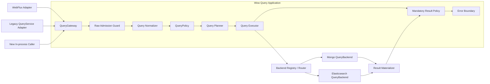

# Query 服务架构升级设计

## 1. 决策摘要

Query 服务重构为一条不可绕过的应用主干：



只把以下三类能力设计为长期扩展端口：

1. `QueryGateway`：唯一应用查询入口；
2. `QueryPolicy`：可信授权、强制条件、字段和结果约束；
3. `QueryBackend`：只执行已经验证的后端无关计划。

`QueryNormalizer`、`QueryPlanner`、预算计算器和路由器在模型稳定前保持框架内部具体实现，不提前开放多套 SPI。现有 `SnapshotQueryService`、`EventStreamQueryService`、HTTP Handler 和存储 `QueryServiceFactory` 保留为兼容适配器，不再同时承担应用端口和 Backend 端口。

## 2. 背景与根因

当前查询合同由 `wow-api` 的 Query DTO、`wow-query` 的 Service/Handler/Filter、WebFlux 路由以及 MongoDB/Elasticsearch 实现共同解释，存在以下结构性问题：

- HTTP 查询经过 Handler/Filter，进程内 `QueryService` 可以直接进入存储，安全与错误处理边界不一致；
- `SnapshotQueryService` / `EventStreamQueryService` 同时表示应用服务和存储服务，类型系统不能阻止循环接线；
- Filter 可通过可变 `QueryContext` 替换整个 query/result，无法承载不可移除的授权条件；
- MongoDB 和 Elasticsearch 分别解释 `Condition`、字段、分页、投影与完整性，公共 DTO 相同但语义并不相同；
- Factory、Provider、Gateway 各自缓存同一聚合的服务实例，生命周期没有唯一 owner；
- `SHADOW` 是执行策略，`STRICT` 是校验策略，把两者放入单一 profile 会形成互斥关系，无法表达“严格校验下进行 shadow”。

因此本次升级不是给 Elasticsearch 增加 MongoDB 操作符别名，而是重新划分应用、语义与存储边界。

## 3. 目标与非目标

### 3.1 目标

1. HTTP 与进程内调用最终都进入同一个 `QueryGateway`。
2. 原始 Query DTO 在应用边界内转换为深度不可变、后端无关的 `QueryPlan`。
3. 授权强制条件具有 provenance，任何后续扩展都不能移除或覆盖。
4. MongoDB 作为 `PORTABLE` 查询语义基准，Backend 只负责编译和执行同一份 Plan。
5. 查询完整性、分页一致性、预算与错误分类由公共合同定义，Backend 不得静默降级。
6. 保持现有记录 Query DTO、七个 `QueryService` 方法、DSL、Spring 聚合 Bean 名称与主要返回结构兼容；
   经批准的 Analytics/Cursor 契约以 additive 方式升级 JSON/OpenAPI。
7. 将分析型聚合建模为独立的一等操作，在不污染记录查询合同的前提下统一 MongoDB/Elasticsearch 的分组、指标、桶分页与完整性语义。
8. 支持按聚合逐步启用 planned path、shadow compare、切换和回滚。

### 3.2 非目标

- 不承诺 `MATCH` 在 MongoDB 与 Elasticsearch 间具有相同分词和相关性。
- 不把 `RAW` 纳入跨 Backend 可移植语义。
- 不给现有记录查询增加 cursor HTTP 协议；Analytics 使用独立、已批准的 opaque cursor 契约。
- 不给 `QueryService` 增加第八个方法；Analytics 通过独立的 `AnalyticsQueryService` / Gateway / route additive 发布。
- 不在查询运行时提供跨聚合、跨集合或跨索引 join；此类需求通过 Projection 物化专用 read model。
- 应用启动不自动迁移、删除 Elasticsearch 索引或切换 alias。
- 在核心模型尚未稳定前不拆分新的 Gradle module。

### 3.3 聚合术语边界

“聚合”在 Wow 中必须区分三种含义：

| 术语 | 含义 | 本设计的处理 |
|---|---|---|
| DDD Aggregate 查询 | 查询某个聚合根的 Snapshot 或 EventStream read model | 现有记录查询目标 |
| 分析型聚合 | `GROUP BY`、document count、`MIN/MAX/SUM/AVG` 等统计 | 独立 `ANALYZE` 操作 |
| 联邦查询 | 跨聚合/集合/索引 join | 明确排除，改用物化 Projection |

公开类型使用 `Analytics*`，避免 `AggregateQuery` 与 DDD Aggregate 混淆。分析型聚合共享
`QueryGateway`、Policy、Planner 和 Backend registry，但不复用记录查询的 `PagedList`、
`DynamicDocument` 或七方法 `QueryService` 合同。

## 4. 边界与职责

### 4.1 QueryGateway

`QueryGateway` 是唯一应用端口，负责整个 Publisher 生命周期：

- 每次订阅创建独立的 `QueryInvocation`；
- 读取显式、可信的 `QueryExecutionContext`；
- 完成 admission、normalization、policy、planning、execution 和结果策略；
- 覆盖同步异常、异步 Backend 异常、部分 `Flux` 后的异常和取消；
- 不缓存聚合服务、不解析物理字段、不拥有存储客户端。

WebFlux 是 transport adapter；现有聚合级 `SnapshotQueryService<State>` / `EventStreamQueryService` Bean 是 legacy adapter。两者都只能委托 Gateway。兼容期保留 Handler/Filter，但它们不得再被描述为最终安全边界。

已批准的 `AnalyticsQueryService` 是独立、additive 的应用 adapter，同样只能委托 Gateway；它不是现有
`QueryService` 的第八个方法，也不能直接持有 MongoDB collection 或 Elasticsearch client。

### 4.2 Raw Admission Guard

Policy 不直接接收未经验证的 `Any` DTO。Admission 先执行低成本结构保护：

- 条件深度、节点数、children 形态；
- 字段、projection、sort 数量和字符串长度；
- value、options，以及未来已绑定 immutable JSON `RAW` payload 的大小上限；
- 非法分页、负 limit 和明显溢出。

Admission 只防止畸形输入消耗过多资源，不决定业务授权或 Backend 语义。

### 4.3 Normalizer

Normalizer 将 wire DTO 转换为 `NormalizedQuery`：

- 完整递归解析逻辑条件和 `ELEM_MATCH` 相对字段作用域；
- 将内置 ID、tenant、owner、space、deleted 操作符映射为逻辑 `SystemField`；
- 将时间操作符基于一次订阅内冻结的 `Clock.instant()` 展开为半开区间；
- 对 List、Map 和字节值进行防御性复制，消除 `Any` 的可变性；
- 验证 projection、sort、pagination、limit 和 Native payload 形态；
- 标注用户条件来源，不混入授权条件。

Normalizer 产物不能包含 BSON、Elasticsearch `Query`、`_id`、`.keyword`、索引名或集合名。

### 4.4 QueryPolicy

`QueryPolicy` 是响应式授权扩展端口，只返回：

```text
Deny(reason)
Allow(
  mandatoryCondition: NormalizedCondition,
  fieldConstraint,
  resultConstraint,
  analyticsConstraint
)
```

Authority 必须来自经过认证的 `QueryExecutionContext`，不能直接把 Header、请求参数或任意 Reactor key 当作可信身份。Policy 只接收已经规范化的 query，并且只能通过 typed policy builder 产生 `NormalizedCondition`；不得把 wire `Condition`、`Any`、`RAW` 或 Backend Native 条件直接注入 policy decision。

用户条件与 `mandatoryCondition` 分开保存 provenance。Planner 必须分别对两者执行同一套字段 schema、operator、capability 和预算校验，通过后才在最终 Plan 中强制执行外层 `AND`。Filter、Backend 和 Native 查询都不能移除或覆盖该条件。

`analyticsConstraint` 约束可使用的 dimension、metric、having、bucket order、最大桶数以及最小桶文档数。
最小桶文档数属于带 provenance 的强制聚合条件，必须在 Backend 内执行，不能只在响应序列化阶段删除小桶，
否则 cursor、桶数或相邻查询仍可能泄露受保护信息。

`LEGACY` 模式下无 authority 的内部调用是一个需要显式迁移的兼容事实，不能默认等价为系统权限。

### 4.5 Planner

Planner 是框架内部确定性实现，输入为 normalized query、policy decision、逻辑字段 schema 和 validation mode，输出 `QueryPlan`。它负责：

- operation 与 typed/dynamic result shape；
- projection、稳定排序、limit/page 与一致性要求；
- 字段 capability 和语义层级；
- Native Backend binding；
- 预算评估和兼容问题报告。

相同语义输入必须产生相同 Plan。deadline、当前时间、执行模式、租户凭据和动态预算不写入语义 Plan，而放在 `QueryExecutionContext/QueryExecutionOptions` 中，避免破坏计划比较、缓存和 shadow 稳定性。

### 4.6 QueryBackend

Backend 只接收完整、已验证的 Plan：

```kotlin
interface QueryBackend<D : Any> {
    fun single(plan: SingleQueryPlan, options: QueryExecutionOptions): Mono<BackendRecord<D>>
    fun stream(plan: StreamQueryPlan, options: QueryExecutionOptions): Flux<BackendRecord<D>>
    fun page(plan: PageQueryPlan, options: QueryExecutionOptions): Mono<BackendPage<D>>
    fun count(plan: CountQueryPlan, options: QueryExecutionOptions): Mono<Long>
}

interface AnalyticsQueryBackend {
    fun analyze(
        plan: AnalyticsQueryPlan,
        options: QueryExecutionOptions
    ): Mono<BackendAnalyticsPage>
}
```

分析能力使用独立 Backend capability interface，避免强迫只支持记录查询的 Backend 实现空方法或在运行期
抛出通用异常。Planner/Router 在执行前根据 capability 拒绝不支持的 operation。

Backend module 负责：

- 逻辑字段到物理字段/multi-field/nested path 的映射；
- Plan 到驱动查询对象的编译；
- driver/cursor/PIT 生命周期；
- timeout、failed shard、total relation、缺失 source 等完整性校验；
- 返回独立 identity 与 payload，不直接物化 typed API 对象。

Backend 不再校验 wire DTO、不追加授权条件、不决定公共 projection/分页语义，也不恢复异常为成功。

### 4.7 Result Materializer 与结果策略

`ResultMaterializer` 在 Backend record 与公共结果之间隔离存储格式：

- typed 查询需要完整信封；
- dynamic 查询可投影 payload，但 identity 由独立 metadata 承载；
- 物理 `_id`、索引名和内部字段不得泄漏；
- mandatory result policy 和 masking 在 materialization 后执行；
- partial `Flux` 必须以 error 终止，不能因为错误处理器返回 empty 而伪装完整成功。

不为所有结果增加通用 `QueryResult<T>` 包装。内部 page 使用带 total relation 与 consistency 的 `BackendPage/PlannedPage`，兼容 adapter 再映射为现有 `PagedList<T>`。

分析结果使用独立、深度不可变的 `AnalyticsPage`：bucket key、metric value、cursor 和 completeness
均为显式值对象。它不伪装成实体列表，不复用可变 `DynamicDocument`，也不把 bucket count 填入
`PagedList.total`。桶总数默认不计算；未来若调用方显式请求，必须作为单独高成本 capability 预算和执行。

## 5. 核心模型

### 5.1 QueryInvocation 与执行上下文

`QueryInvocation` 显式表达：

- materialized aggregate；
- document kind：`SNAPSHOT` / `EVENT_STREAM`；
- result shape：`TYPED` / `DYNAMIC` / `COUNT` / `ANALYTICS`；
- operation：`SINGLE` / `STREAM` / `PAGE` / `COUNT` / `ANALYZE`；
- 原始兼容 Query DTO。

`QueryExecutionContext` 显式携带可信 authority、purpose、deadline、execution mode、validation mode 和 budget。它不是任意 attribute map。

### 5.2 NormalizedCondition

```text
All
Junction(AND | OR | NOR, children)
Predicate(field, operator, immutableValue, options)
ElementMatch(field, childScopeCondition)
Search(scope, text)
Native(backendId, immutableUtf8Json)
```

逻辑字段分为：

```text
SystemField(IDENTITY | AGGREGATE_ID | TENANT_ID | OWNER_ID | SPACE_ID | DELETED)
Path(segments, basis = ROOT | CURRENT_ELEMENT)
```

嵌套元素中的 `id` 是元素相对字段，不得被错误映射为根文档 `_id`。`RAW` 只有显式 Backend binding、可信 capability 和不可变 JSON 才能进入 Plan；旧 `Bson/Query/Any` 只留在 legacy passthrough。

### 5.3 QueryPlan

Plan 使用 sealed operation：

```text
SingleQueryPlan
StreamQueryPlan(limit = Bounded | Unbounded)
PageQueryPlan(offset: Long, size, totalMode, consistency)
CountQueryPlan
AnalyticsQueryPlan
```

所有 Plan 共享 `QueryTarget`、用户条件与 mandatory condition 的最终外层合取、
`RequiredCapabilities` 和 `SemanticTier`。记录型 Plan 另外共享：

- `PlannedProjection`；
- `PlannedSort`；

`AnalyticsQueryPlan` 不复用记录 projection/sort/pagination，改为显式包含 dimension、metric、having、
bucket order、bucket window/cursor、missing policy、numeric policy、required consistency 和
required completeness。预算与 deadline 仍属于 `QueryExecutionOptions`，不写入可比较的语义 Plan。

Plan 禁止包含：

- `Any`、BSON 或 Elasticsearch driver 对象；
- 物理字段、集合、索引或 alias；
- mixed include/exclude；
- 未验证的负分页、Int offset 或溢出值；
- 未绑定 Backend 的 Native 条件。

### 5.4 逻辑字段 Schema 与 Backend binding

`QueryFieldSchema` 只描述逻辑合同：字段类型、允许的 operator、exact/range/full-text/literal-pattern/
sort/projection/aggregation/nested 能力及 null/missing/array 模型。

MongoDB/Elasticsearch 各自持有 `BackendFieldBinding`：物理字段、keyword/text multi-field、nested mapping、索引限制和 mapping version。Backend 启动校验 binding/mapping 是否满足逻辑 schema，并记录 capability digest；逻辑 schema 不直接负责生成某个 Backend 的 mapping。

#### 5.4.1 字符串能力模型

客户端和 Plan 只引用 `state.name` 这样的逻辑字段，不允许引用 `.keyword`、`.exact`、analyzer、normalizer
或 Elasticsearch field type。字符串不是单一 `STRING` capability，而是按查询语义组合：

| 逻辑能力 | 允许的操作 | Elasticsearch 典型 binding | MongoDB 基准 |
|---|---|---|---|
| `EXACT` | `EQ/NE/IN/NOT_IN/ALL_IN` | 未分析的 `keyword` field | 原字段精确值比较 |
| `PRESENCE` | `NULL/NOT_NULL/EXISTS` | `exists` 与显式 null/missing binding | 按已声明 null/missing 模型判断 |
| `FULL_TEXT` | `MATCH` / `Search` | `text` field | 已声明 text index/search scope |
| `LITERAL_PATTERN` | `CONTAINS/STARTS_WITH/ENDS_WITH` | `keyword` 或专用 `wildcard` field | 转义用户值后的字面量 regex |
| `SORTABLE` | record sort、稳定 tie-breaker | 启用 `doc_values` 的 exact field | 原字段排序与显式 collation |
| `AGGREGATABLE` | analytics dimension | 启用 `doc_values` 的 exact field | 原字段 `$group` key |
| `PROJECTABLE` | include/exclude/materialization | `_source` 中的 source field | 原文档字段 |

`MATCH` 不再伪装成普通字段 predicate，而规范化为 `Search(scope, text)`。`scope` 是逻辑搜索范围：MongoDB
binding 指向一个已声明的 text index，Elasticsearch binding 指向一个或多个 `text` field。MongoDB text index
不能满足任意单字段 scope 时，该 scope 在 MongoDB 上为 unsupported；`SEARCH` tier 不承诺跨 Backend analyzer、
分词、相关性或排序等价。

现有 wire `Condition.MATCH(field, value)` 保持 JSON/DSL 兼容，由 Normalizer 把 `field` 解析为 schema 已声明的
legacy search scope。找不到 scope 或 Backend 无法满足字段范围时，planned path 稳定拒绝；`COMPATIBLE` 模式
可以带 reason/metric 回退 legacy，但不得在 planned path 中悄悄扩大为 MongoDB 全 text index。

首批 `PORTABLE` 字面量字符串合同只承诺 case-sensitive。`ignoreCase=true` 只有在 schema 声明大小写模型、
MongoDB/Elasticsearch binding 具有等价 normalization/collation 且 shared TCK 证明 Unicode/边界行为后才开放；
否则稳定返回 `UnsupportedFeature`，不能把 Elasticsearch `case_insensitive` 当作 MongoDB `i` regex 的无证据
替代。

字符串范围比较只在 schema 显式声明有序字符串、normalization 和 collation 时允许。否则
`GT/LT/GTE/LTE/BETWEEN` 对字符串稳定拒绝，避免把 Backend 默认字典序误认为公共合同。

#### 5.4.2 Elasticsearch 字符串 binding

需要全文检索和精确能力的同一逻辑字段使用 multi-field，但 sub-field 名称仍是 Backend 私有实现，例如：

```text
logical field: state.name

ElasticsearchStringBinding(
  sourceField = state.name,
  searchField = state.name,
  exactField = state.name.exact,
  literalField = state.name.exact,
  sortField = state.name.exact,
  groupField = state.name.exact
)
```

Planner 只产生 required capability；Elasticsearch compiler 必须按 binding 精确选择字段：

- `EQ/IN` 及其否定、排序和分组只使用 exact/sort/group field；不得对 analyzed `text` 执行 `term`；
- `MATCH` 只使用 search field；不得自动回退到 keyword；
- `CONTAINS/STARTS_WITH/ENDS_WITH` 只使用 literal field，并转义 `\\`、`*`、`?` 等模式字符；不得用
  `match_phrase` 替代字面量子串；
- projection/materialization 始终读取 logical source field，不返回或泄漏 multi-field；
- 缺少所需 binding、mapping 类型不符或 `doc_values` 不满足时，在执行前返回 `UnsupportedFeature` 或
  readiness failure，不按字段名猜测 `.keyword`。

推荐 mapping 由字段用途决定，而不是使用一个全局 dynamic string template：

| 字段用途 | 推荐 mapping |
|---|---|
| ID、code、status、tag | `keyword` |
| name/title，既检索又精确排序/分组 | `text` + exact `keyword` multi-field |
| description/content，仅全文检索 | `text` |
| 高频 grep-like、前导 wildcard 的机器生成大文本 | 经 benchmark 后声明专用 `wildcard` literal field |

`ignore_above` 是完整性边界，不只是 mapping 参数。超过限制的值仍可能存在于 `_source`，却不进入 exact
field，导致精确查询、排序和聚合静默漏数。只有满足以下全部条件，Backend 才能发布对应 exact/sort/group
capability：

1. logical schema 声明并在写入端执行可索引的字符/UTF-8 byte 长度约束；
2. `ignore_above`、Lucene term 限制与该约束一致；
3. readiness 对现有 generation 完成 mapping 和数据审计，不存在会被忽略的历史值；
4. 新增 multi-field 后已重建/回填历史文档；只更新 template/mapping 不算完成。

旧索引的动态 `.keyword` 只有通过上述 readiness 后才能临时绑定。默认动态 mapping、Snapshot/EventStream
不同 template 或字段名恰好存在都不能成为 capability 证据。

#### 5.4.3 其他字段类型

- numeric、instant/date、boolean 使用对应逻辑类型与物理 binding，不通过字符串 multi-field 模拟；
- object 本身不能参与 exact/range/sort/group，必须选择有 schema 的叶子字段；
- array 沿用元素类型能力，并显式声明 missing/null/empty/multi-valued 模型；
- `ELEM_MATCH` 需要 element-relative schema；Elasticsearch 必须具有对应 `nestedPath`，普通 object array
  mapping 不能冒充 nested capability。

Mongo baseline 下 `null` 是查询语义而不是普通字段类型：`EQ null`/`IN [..., null]` 包含 missing，`NE null`
只匹配存在且非 null，`NOT_IN` 仍包含 missing；详见 MongoDB 官方
[null/missing 查询](https://www.mongodb.com/docs/manual/tutorial/query-for-null-fields/) 与
[`$nin`](https://www.mongodb.com/docs/manual/reference/operator/query/nin/) 合同。因此 exact 集合允许 canonical
`Null` operand，由 Compiler 按 presence/nullability 明确展开；range/BETWEEN 一律拒绝 `Null`，不得借 BSON type
order 冒充 portable 数值/时间范围语义。

## 6. 语义、分页与完整性

### 6.1 语义层级

| 层级 | 合同 | 路由与对比 |
|---|---|---|
| `PORTABLE` | 以 MongoDB 行为为基准的精确查询语义 | 可跨 Backend 路由和等价 shadow |
| `SEARCH` | `MATCH` 等全文能力 | 要求 `FULL_TEXT` capability；只比较结构与错误，不承诺分词等价 |
| `NATIVE` | `RAW` 等 Backend 原生能力 | 必须绑定 Backend；禁止自动跨 Backend 路由和等价判断 |

`CONTAINS`、`STARTS_WITH`、`ENDS_WITH` 是字面量字符串合同，不允许 Elasticsearch 用 analyzed `match_phrase` 代替。

### 6.2 Projection

- strict typed 查询只接受 `Projection.ALL`；
- compatible typed projection 只有在 legacy Backend 能直接承载 typed result 且证明投影映射等价时才允许 fallback。P2-C 的
  immutable `BackendRecord` 过渡 seam 尚不具备该证明，因此 non-`ALL` typed projection 在两种 validation mode 都稳定拒绝，
  禁止先裁剪动态文档再伪装成完整 typed result；
- dynamic 查询允许 include 或 exclude，二者同时非空必须拒绝；
- Backend 永远独立返回 identity，最终 logical projection 不泄漏物理字段。

### 6.3 排序与分页

- `index >= 1`、`size > 0`；
- offset 使用 `Math.multiplyExact((index - 1).toLong(), size.toLong())`；
- strict page 必须具有唯一稳定排序，缺少 identity 时由 Planner 追加逻辑 identity；
- offset page 只支持预算允许的窗口，深分页后续使用独立 cursor 协议；
- page 是 Backend 的单个 SPI 操作，返回 total relation 与 consistency；Executor 不允许静默降低一致性。

MongoDB `SAME_INPUT` 可使用单次 `$facet`，但必须显式处理 stage/文档大小和索引风险；`SNAPSHOT` 需要匹配的 read concern。Elasticsearch exact page 必须校验 `total.relation == Eq`。

### 6.4 List limit

现有 `limit=0` 继续表示 `Unbounded`，不能静默映射为 Elasticsearch 的固定 result window。策略只能显式允许或返回 `BudgetExceeded`。Elasticsearch planned backend 使用 PIT + `search_after`，并在 complete/error/cancel 时关闭 PIT。

### 6.5 完整性与错误

公共错误模型至少区分：

- `InvalidQuery`；
- `InvalidCursor`；
- `AccessDenied`；
- `UnsupportedFeature`；
- `BudgetExceeded`；
- `BackendUnavailable`；
- `BackendTimeout`；
- `IncompleteResult`；
- `MappingFailure`。

Elasticsearch Backend 必须拒绝 timeout、failed shards、缺失 `_source` 和要求 exact 时的非 `Eq` total。MongoDB 与 Elasticsearch 的 driver exception 统一映射，但根因保留为 cause。

### 6.6 分析型聚合合同

分析请求先规范化为独立模型：

```text
AnalyticsQueryPlan(
  target,
  preFilter = userCondition AND mandatoryCondition,
  grouping: Global | By(NonEmptyList<Dimension>),
  metrics: NonEmptyList<Metric>,
  having: AnalyticsCondition = All,
  bucketOrder,
  bucketWindow: First | After(cursor),
  missingPolicy,
  numericPolicy,
  requiredConsistency,
  requiredCompleteness,
  requiredCapabilities
)
```

- `preFilter` 只引用 read-model 字段，在分组前执行；
- `having` 使用独立 AST，只能引用 dimension 或 metric alias，不能混入 `NormalizedCondition`、`RAW`
  或物理字段；
- `Global` 表示无 `GROUP BY` 的全局统计，只产生一个 global bucket；`By` 才要求至少一个 dimension；
- dimension/metric alias 在一次请求中唯一，并在 Planner 阶段绑定逻辑 schema；
- bucket order 是分析结果合同，不等价于记录 `sort`；
- cursor 是不透明值，绑定 plan digest、target、稳定 key order 和 Backend paging state；调用方不能自行拼装；
- 成功结果的 completeness 为 `Exact`，或在调用方显式允许近似时为
  `Approximate(errorBound?, warnings)`；要求 exact 时任何近似、timeout 或分片失败都返回
  `IncompleteResult`。

结果模型：

```text
AnalyticsPage(
  buckets: List<AnalyticsBucket(key: Global | DimensionKey, metrics: List<MetricValue>)>,
  nextCursor: AnalyticsCursor?,
  consistency: Eventual | Snapshot,
  completeness: Exact | Approximate,
  warnings
)
```

`Global` grouping 最多返回一个 bucket 且没有 next cursor。`By` grouping 的 `nextCursor == null` 只表示本次
查询已无更多桶，不承诺已计算桶总数。exact bucket pagination 只能按唯一、稳定的 dimension key 顺序进行；
按 metric 排序的全局 top-N 不是同一能力。

`completeness` 与 `consistency` 正交：`Exact` 表示每次请求没有已知近似或部分结果，不表示多次 cursor
请求观察到同一数据快照。`Snapshot` 才承诺跨页输入集合固定；Backend 不具备该能力时必须在执行前拒绝，
不能用 `Eventual` 静默替代。

第一批 `PORTABLE` 合同收敛为：

- 单个 `QueryTarget`，优先只开放 `SNAPSHOT`；
- 支持无 dimension 的 global aggregation；分组时只允许根级、单值、非 nested 的 scalar dimension，支持单 key 和复合 key；
- `DOCUMENT_COUNT`；`MIN/MAX` 用于 schema 已声明的 numeric/instant 字段，`SUM/AVG` 仅用于 numeric 字段；
  只要 metric 涉及 numeric，就必须提供显式 precision、scale、type promotion、rounding 与 overflow policy；
- `EXCLUDE` 或 `AS_NULL_BUCKET` missing policy；后者按 MongoDB 基准把 missing 与显式 null 合为同一桶；
- 按 dimension key 的 exact cursor 分页；首批顺序固定为 binary collation、null-first，cursor key 使用 dimension
  输出类型的 canonical value，不复用 predicate numeric widening；第一批跨 Backend 合同只承诺 `Eventual`
  consistency；
- numeric promotion 首批固定为 `Decimal128`，precision 为 `1..34`；`Global` bucket window canonicalize 为
  `limit=1`，调用方传入的更大 limit 不改变 Plan 或 fingerprint。

以下能力先标记为 unsupported，而不是由 Backend 猜测或降级：

- array/multi-valued、nested、自动 unwind 和跨文档 join；
- metric-sorted paging、全局 top-N、cardinality、percentile、pipeline metric；
- portable `having`；模型先保留，但首个 Elasticsearch exact path 只接受 `All`；
- locale collation、calendar interval/timezone；
- 无精度策略的 `Decimal128`、超过安全表示范围的整数与浮点精确相等比较。

`EVENT_STREAM` 的统计粒度必须显式定义。现有 QueryTarget 的一个文档表示一个
`DomainEventStream`，`ANALYZE` 不会隐式展开其中的 event array。按单个 domain event 统计应先投影到专用
read model；待 EventStream grain 和 mapping fixture 独立验证后再声明相应 capability。

### 6.7 MongoDB 基准与 Elasticsearch 编译策略

MongoDB planned backend 是 portable aggregation 的语义基准。基本 pipeline 顺序为：

```text
$match(userCondition AND mandatoryCondition)
  -> $group(dimensions, metrics)
  -> $match(mandatoryHaving AND userHaving)
  -> keyset cursor predicate
  -> $sort(stable dimension key)
  -> $limit(bucketLimit + 1)
```

首批 portable path 的 `userHaving=All`。`allowDiskUse`、`maxTimeMS`、扫描文档预算、最大 dimension/metric
数量、最大候选桶数和返回桶数必须由 options/policy 显式控制。`$group` 是 blocking stage；是否允许落盘是
部署策略，不是 Backend 可以自行开启的透明优化。只有未来显式请求 bucket total 时才考虑 `$facet/$count`，
且必须单独评估内存、文档大小和重复扫描成本。

首批 Mongo analytics cursor 只声明 `Eventual` consistency。除非后续证明并封装可跨 HTTP 请求安全恢复、
有界保留且可释放的 snapshot/session 机制，否则 `requiredConsistency=Snapshot` 必须返回
`UnsupportedFeature`，不能因为单次 aggregation 命令内部读取一致就宣称跨页快照一致。

Elasticsearch exact portable path 使用 `composite` aggregation：

- dimension 绑定到满足 exact/doc-values 的字段；
- 使用响应返回的 `after_key` 生成 cursor，不能从最后一个 bucket key 自行推导；
- `requiredConsistency=Snapshot` 时使用 PIT；cursor 保存每次响应返回的最新 PIT id。无 next cursor 的
  terminal page 立即关闭，error/cancel 尽力关闭，调用方停止翻页时由短 keep-alive/expiry 有界回收；
- timeout、failed shards、无法解析的 `after_key` 或 metric 精度不满足 Plan 时失败关闭；
- `terms` aggregation 的 doc count/sub-aggregation 可能近似，只能进入显式允许近似的非 portable capability，
  不能冒充 MongoDB exact 结果；
- `composite` 不能满足首批 portable 的 metric-sorted 全局分页或 pipeline `having`，因此 Planner 直接拒绝。
- policy 要求 `minBucketDocumentCount` 时等价于 mandatory having；首批 composite path 不支持时必须拒绝或
  路由到满足能力的 Backend，不能在返回后过滤。

MongoDB 与 Elasticsearch 共享同一组 fixtures/TCK，至少比较 bucket key、顺序、metric type/value、
missing/null、cursor replay、completeness 和错误类别。仅比较 JSON 形状不构成语义等价证据。

### 6.8 聚合安全、预算与可观测性

- mandatory pre-filter 必须在分组前进入最终 Plan，Native payload 不能绕开；
- Policy 分别约束 filter field、dimension field、metric field、having alias、bucket order 和输出 metric；
- 强制最小桶文档数在 Backend 内执行，并保留 policy provenance；
- admission 限制 dimension/metric/having 节点、alias、cursor 和 payload 大小；
- execution budget 至少覆盖 deadline、扫描文档数、候选桶数、返回桶数、内存/落盘策略和跨页次数；
- cursor 首页把完整 execution budget ceiling 写入签名 lease；continuation 可逐项收紧但不得删除或放宽 ceiling，
  因此 security-context digest 可以保持身份/用途/模式绑定而不阻止合法收紧；
- 指标记录 operation、target、semantic tier、capability、bucket 数、扫描/执行耗时、completeness、fallback
  原因和 budget rejection；不得把 dimension key 或 metric 原值写入低基数标签/普通日志。

## 7. 兼容与发布模式

执行策略与语义校验是两个独立维度：

```text
QueryExecutionMode = LEGACY | SHADOW | PLANNED
QueryValidationMode = COMPATIBLE | STRICT
```

这样可以表达 `SHADOW + STRICT`，也可以在 `PLANNED + COMPATIBLE` 下对无法规范化的历史请求显式 fallback。禁止散落 `strictEnabled`、`shadowEnabled` 等布尔开关。

SHADOW 始终返回 legacy 结果，比较 planned 的：

- 错误类别；
- identity 集合与顺序；
- exact/lower-bound total；
- null/missing/array 行为；
- 完整性与延迟。

现有系统没有 legacy analytics path，因此 `ANALYZE` 不适用 `LEGACY/SHADOW`，只能在 `PLANNED` 下执行。
公开发布前使用 TCK、离线 fixtures 和内部 dual-backend probe 比较 bucket key/order、metric type/value、
cursor termination 与 completeness；发布后若需要非 serving Backend 对比，应增加独立的 backend comparison
option，而不是伪造 legacy 结果。近似查询只记录误差元数据和结构差异，不能据此宣称与 MongoDB exact 等价。

`SEARCH/NATIVE` 只记录差异，不判定跨 Backend 等价。任何 fallback 都必须产生原因和指标，不能默默发生。

兼容阶段不能静默修改：

- Query DTO JSON/OpenAPI、七个 QueryService 方法或聚合 Bean 名；
- `limit=0` 语义；
- legacy 排序、typed projection、NoOp 和 HTTP status；
- 自动索引迁移、alias 切换或旧索引删除。

## 8. 生命周期与模块归属

### 8.1 生命周期

- `QueryGateway`、Normalizer、Planner、Policy chain 和 Backend registry 为单例、无请求级可变状态；
- `QueryInvocation`、normalized query、Plan 和 execution context 每订阅创建；
- Backend registry 是 planned Backend 实例的唯一生命周期 owner，key 至少包含 materialized aggregate、document kind 和 backend id；
- 旧 Factory 的缓存行为在兼容期保留，但不再叠加 Provider/Gateway cache；
- record cursor、analytics cursor、PIT/session 默认是每次执行资源；需要跨请求的 PIT/session 只能通过
  有有效期的 cursor lease 显式转移所有权，并在 terminal page/error/cancel 时尽力释放，在调用方停止翻页时
  依靠短 expiry 有界回收；
- analytics cursor 必须有版本、有效期和 plan/target binding；升级后无法安全恢复时返回明确的 cursor 错误，
  不能从错误位置继续。

### 8.2 模块

| 模块 | 职责 |
|---|---|
| `wow-api` | 现有 wire DTO、JSON/OpenAPI 和 DSL 合同；稳定后 additive 引入 analytics wire contract |
| `wow-query` | Gateway、Plan/Normalizer/Planner、Policy、错误、analytics model、experimental Backend SPI |
| `wow-spring` | 现有聚合 QueryService 兼容 adapter 与 Bean name/generic 注册 |
| `wow-spring-boot-starter` | 默认装配、Backend registry/routing 和模式配置 |
| `wow-webflux` | HTTP、authority、request/response adapter；显式依赖 `wow-query` |
| `wow-mongo` | Mongo compiler、binding、record/analytics Backend、materializer |
| `wow-elasticsearch` | ES compiler、mapping 校验、PIT record/composite analytics Backend、materializer |
| `wow-tck` | Mongo 基准 fixtures、计划 golden、record/analytics 双 Backend 语义对比 |

Backend SPI 稳定前放在 experimental package 并增加兼容测试，不新建 Gradle module。

## 9. Elasticsearch 索引生命周期

逻辑名保持稳定 alias，物理索引使用 mapping version 与 generation：

```text
wow.<context>.<aggregate>.snapshot-v0002-000001
wow.<context>.<aggregate>.es-v0002-000001
```

mapping `_meta` 保存 mapping version、document kind、schema contract id 和由 binding 规范编码生成的 capability digest。
应用启动不执行 reindex、alias 切换或删除；`CREATE` 也只能由显式运维命令触发。回填与 alias 切换是独立运维流程：

1. 固化 logical schema 与 backend binding；
2. 创建 template 和新物理索引；
3. Snapshot 从权威事件流重建；
4. EventStream 排空 writer 或启用受控镜像写；
5. 校验 count、identity、版本连续性和 checksum；
6. 执行 SHADOW；
7. 原子切换 alias；
8. 在回滚窗口保留旧索引与 legacy backend。

若切换后没有向旧 EventStream 索引镜像新增写入，alias 不能直接回切。Snapshot 回滚同样需要以权威事件流重建和版本校验为准。

## 10. 分阶段实施计划

### 10.1 当前基线与完成度

以下状态以 stacked query-service 分支的当前源码和测试为审计基线。状态只根据可执行代码与验证结果判断，
不根据设计意图推断：

| Phase | 当前证据 | 状态 |
|---|---|---|
| 0 | `QueryHandler` 已形成单一 defer/fail-closed 边界；EventStream factory 已使用 materialized key 与并发缓存；对应同步、异步、partial Flux、cancel、direct handle 和多订阅测试已存在 | 已实现，待 PR #2908 合并 |
| 1 | P1-A 已引入 internal `QueryInvocation`、语义代数、`QueryPlan` 与最小 analytics model；P1-B 已引入单遍 admission snapshot、全局 value/payload budget、typed rejection 与 43 operator Normalizer；P1-C 已引入 logical schema、provenance-bearing Planner、record/analytics Plan 与 canonical fingerprint；Backend compiler 与运行时接线由后续 Phase 独立实现 | 已实现，stacked Draft PR #2909/#2910/#2915 |
| 2 | P2-A 已引入 typed execution context 与 fail-closed Policy；P2-B 已引入 per-subscription Gateway、Executor、legacy lowering/attestation、绝对 deadline、typed error boundary 与受控 SHADOW；P2-C 已把 framework-managed Service factory、Registrar、Handler/WebFlux transport 接到 Gateway，并保留 legacy wiring rollback 与原七方法 ABI；公共 Query/Analytics/Cursor 与完整 Query status OpenAPI 扩展已经审批并由 golden 锁定 | P2-A/P2-B/P2-C 已实现 |
| 3 | P3-A 已提升最小 experimental Backend contract，并实现 Snapshot Mongo binding/compiler/backend/materializer、text-index readiness、storage-routed composition、per-operation profile 与真实 Mongo SHADOW 对比；P3-B 已增加 Snapshot/EventStream PAGE 单操作、独立 system/identity/deletion binding、分库 Spring route、完整 budget envelope、Mongo deadline/allowDiskUse 执行与真实 explain fixture；P3-C 已增加 Snapshot `ANALYZE` Backend contract/adapter、Mongo Global/By pipeline、numeric/missing/cursor 映射及真实 Mongo fixture。高基数 explain/concurrency/cancel、跨 Backend Analytics TCK，以及同一真实集合上的 `SHADOW -> PLANNED -> LEGACY` count 演练已完成；精确 scanned-record enforcement、生产性能签署与 unbounded stream 尚未完成 | P3-A/P3-B/P3-C vertical slice 与仓库级回滚演练已实现；Phase 3 生产性能 exit gate 未完成 |
| 4 | P4-A 已引入显式 Elasticsearch source/exact/presence/search/literal/sort/group/nested binding、mapping-version/readiness 与 analyzer/normalizer/keyword 完整性证明；P4-B 已实现 Snapshot SINGLE/bounded STREAM/PAGE/COUNT compiler、mapper、完整性/error validator、Spring storage-routed contribution和真实 Elasticsearch fixture，PAGE 已使用 PIT + search_after 并通过 >10k 实库回归，PIT expiry/cancel/closed-transport fault 均有真实 client 回归；P4-C 已实现 EVENTUAL/EXACT 的 global/grouped DocumentCount composite、服务端 after_key replay、`EXCLUDE/AS_NULL_BUCKET`，并通过 Mongo/Elasticsearch shared TCK；P5-A 现已为 grouped SNAPSHOT Analytics 接入跨请求 PIT state/lifecycle。同一真实索引上的 `SHADOW -> PLANNED -> LEGACY` count 演练已完成；unbounded、EventStream 与 Decimal128 metric 未完成 | P4-A、P4-B 与 P4-C exact-count vertical slice、仓库级回滚演练已实现；SNAPSHOT cursor 由 P5-A 闭环；Phase 4 exit gate 未完成 |
| 5 | P5-A 已实现 internal cursor envelope/codec/lease manager，并由公共 Analytics Gateway 使用经批准的持久化 store SPI；MongoDB 已提供显式初始化、固定容量 slot、unique lease id、TTL grace 与 revision CAS 的跨节点 store，真实 Mongo fixture 已证明跨实例翻页、单次消费和 HMAC key rotation。Elasticsearch grouped SNAPSHOT Analytics 已把最新 PIT id 作为 opaque Backend state 交给 target/backend keyed lease coordinator，覆盖 continuation、terminal/error/cancel、capacity failure、expired reaper 与 PIT expiry `IncompleteResult`；公共 token 不含 PIT。Starter 已提供默认关闭、显式配置、单 lifecycle owner 的有界串行 reaper。P5-B 已实现 internal migration manifest、版本/generation 命名、不可变 inventory/attestation/verification、CAS command state、幂等恢复、component/index template、显式 create、source↔destination write-alias 原子切换，以及基于独立 hidden system index 与 `_seq_no/_primary_term` 的持久化 migration repository；Snapshot/EventStream rebuild 与 verification 已形成 vertical slice。公开 Analytics contract 已 additive 落地；目标应用 probe/cutover、EventStream controlled mirror/生产 barrier 接线和旧同名 concrete index 转 managed alias尚未完成 | P5-A persistent cursor、自动 reaper 与 Elasticsearch SNAPSHOT PIT lifecycle、P5-C 公共契约已实现；P5-B vertical slice 已实现；Phase 5 exit gate 未完成 |

关闭但未合并的 PR #2903（`agent/unify-mongo-elasticsearch-query-semantics`）包含
`ConditionValidator`、operator fixtures 和部分双 Backend 测试。它作为 Phase 1/3 的需求与测试素材使用，
不整体 cherry-pick：其中直接修改 legacy converter/mapping 的实现必须重新落到 Normalizer、logical schema、
Backend binding 和 shared TCK 的新边界中，避免重新形成双重语义源。

### 10.2 依赖关系与合并策略

```mermaid
flowchart LR
    P0[Phase 0<br/>Execution Correctness] --> P1A[P1-A<br/>Semantic Kernel]
    P1A --> P1B[P1-B<br/>Admission + Normalizer]
    P1B --> P1C[P1-C<br/>Schema + Planner]
    P1C --> P2A[P2-A<br/>Context + Policy]
    P2A --> P2B[P2-B<br/>Gateway + Legacy Backend]
    P2B --> P2C[P2-C<br/>Spring/WebFlux Cutover]
    P2C --> P3A[P3-A<br/>Mongo Snapshot Record]
    P3A --> P3B[P3-B<br/>Mongo Event/Page]
    P3B --> P3C[P3-C<br/>Mongo Analytics Baseline]
    P3B --> P4A[P4-A<br/>ES Readiness]
    P4A --> P4B[P4-B<br/>ES Record]
    P3C --> P4C[P4-C<br/>ES Analytics]
    P4B --> P4C
    P4C --> P5A[P5-A<br/>Cursor Lease]
    P5A --> P5B[P5-B<br/>Index Lifecycle]
    P5B --> P5C[P5-C<br/>Public Analytics API]
    P5C --> P5D[P5-D<br/>Major Cleanup]
```



实施与合并规则：

1. 每个 slice 单独 PR；一个 PR 只跨越完成该 slice 必需的模块。
2. 前置 PR 未合并时可以建立 stacked branch，但前置 PR 合并后必须 rebase 到 `main` 并重新跑本 slice 全部门槛。
3. 纯模型、接线、Backend 行为、公开协议和数据迁移分开审查；不得用“大重构”一次切换全部边界。
4. 每个 PR 同步更新本节的基线提交、状态和证据；“代码存在”不等于 slice 完成。
5. 前一 slice 的 exit gate 未通过时，不让后一 slice 接管生产流量；可以并行只读研究或编写未接线的 fixture。
6. 新依赖、新 Gradle module、公开 ABI、OpenAPI/JSON 和自动数据变更继续服从仓库的显式确认边界。

### 10.3 Phase 0：执行正确性基础

交付范围：

- `QueryHandler` 每次订阅创建独立 context；
- 同步与异步 Backend 错误统一进入 error observer，错误处理器不能把查询恢复为成功；
- 覆盖 partial Flux、cancellation、direct `handle`、结果未订阅和多订阅隔离；
- EventStream legacy Factory 使用 materialized aggregate key 和并发安全缓存；
- 不切换 Spring Bean，不新增 Gateway/Provider cache，不宣称已形成安全边界。

Exit gate：`wow-query` 聚焦测试与 PR required checks 全绿；现有七方法和 Bean 行为无变化。回滚只需回退
Phase 0 提交，不涉及配置、索引或数据。

### 10.4 Phase 1：纯语义模型

#### P1-A：Semantic Kernel

- 仅在 `wow-query` 的 `internal` package 以 Kotlin `internal` visibility 引入 `QueryTarget`、
  `QueryInvocation`、operation/result shape、
  execution/validation mode、无 `Any` 的 `NormalizedValue/NormalizedCondition`、record/analytics plan skeleton；
- analytics grouping 建模为 `Global | By(NonEmptyList<Dimension>)`，支持合法的无 `GROUP BY` 全局统计；
- `QueryInvocation` 是每订阅创建、不得比较或缓存的临时 envelope；其中 legacy wire DTO 保持原样，深度不可变
  从 admitted snapshot/normalized query 边界开始；
- normalized condition/value、analytics model 与 Plan 的所有 collection/map/bytes 在边界防御复制，不能用
  Kotlin read-only interface 冒充深度不可变；
- Kotlin `internal` 类型在 JVM 字节码中仍可能表现为 public class；它们位于 internal package 且不进入受支持
  API，兼容性声明不得表述为“JAR 严格零 ABI diff”；
- 不加 Jackson/Swagger 注解，不修改 `wow-api`、`QueryService` 或 `QueryType`，不发布 cursor codec。

#### P1-B：Admission 与 Normalizer

- 实现内部具体 `RawAdmissionGuard` 与 `QueryNormalizer`，不先开放 SPI；
- admission 必须在一次有界遍历中完成校验与防御性物化，产出 immutable admitted snapshot；Normalizer
  只能读取该 snapshot，禁止校验后再次读取调用方的动态 getter、`Any`、List、Map 或 ByteArray；
- 固化深度/节点/字段/value/options 大小，递归 `AND/OR/NOR`、`ELEM_MATCH` 相对字段、system field、
  projection、sort、limit 和 page 规则；
- 每次 normalization 只读取一次 `Clock.instant()`；时间范围使用半开区间；
- 从 PR #2903 搬运有效 operator fixtures/validator cases，但不复用其 Backend-specific converter 修改；
- 返回稳定 category/path/code 的 typed rejection，测试不绑定异常文案。

P1-B 当前实现约束：

- `QueryAdmissionLimits` 同时限制局部容器和整次 admission 的 condition/value node、UTF-8 payload、数字精度；
  默认值仍是 internal safety baseline，P2-A 接入运行时时再通过配置与真实流量证据校准；
- legacy `RAW` 不携带 Backend id，admission 不读取、不预算并丢弃原 driver object，只产出 `NativeUnbound` marker，
  Normalizer 稳定返回 `UNSUPPORTED_FEATURE/NATIVE_BACKEND_UNBOUND`；未来已绑定 immutable JSON Native contract
  才进入 payload budget，留 P1-C/P5-A；
- mixed include/exclude 在 Normalizer 保留为 `NormalizedProjection.Mixed`，不在缺失 validation mode 时提前决定
  compatible/strict policy；P1-C Planner 根据 result shape、validation mode 和 compatibility issue 决策；
- Normalizer 以 `NormalizedDeletionScope` 保留 legacy 根条件是否显式声明删除范围；Planner 对未显式声明的 record/count
  查询加入 logical `DELETED=false`，该框架默认条件不受 user field allow-list 影响。显式 `deleted(ALL)` 保持 `All`，
  final execution request 禁止再次经过会隐式追加 `ACTIVE` 的 legacy guard；
- `RawAdmissionGuard`、`RawValueSnapshotter`、`AdmissionBudget` 与 `QueryNormalizer` 均保持 internal，生产调用链、
  Spring Bean、现有 wire DTO 和 OpenAPI 不接线。

P1-B 验证证据：

- admission tests 覆盖动态 getter 单读、one-shot iterable、List/Map/ByteArray 防御复制、condition/value cycle、
  hostile duplicate-key Map、局部与累计预算、稳定 key path、分页 Long offset 和 typed rejection；
- Normalizer golden tests 覆盖全部 43 个 wire operator、Mongo 空集合常量、数字 canonicalization、system field、
  多层 `ELEM_MATCH` 相对 scope、literal pattern、projection/sort、一次 Clock、DST-safe 半开时间范围和 RAW 拒绝；
- `./gradlew :wow-query:check` 与 OpenAPI snapshot test 是该切片的退出验证；P1-C 完成前不宣称 Phase 1 exit gate
  整体满足。

#### P1-C：Logical Schema 与 Planner

- 引入 `QueryFieldSchema`、logical capability、`RequiredCapabilities`、`SemanticTier`、plan fingerprint；
- 固化 `EXACT/FULL_TEXT/LITERAL_PATTERN/SORTABLE/AGGREGATABLE/PROJECTABLE` 字符串能力和 typed
  `SearchScope`；Plan/公开 DTO 不得包含 `.keyword`、analyzer 或 Backend field type；
- `PlanningConstraints` 作为未来 Policy decision 的内部承接模型；
- user/mandatory condition 分别校验并保留 provenance，最终只能形成不可拆除的外层 `AND`；
- strict page 自动追加 logical identity 稳定排序；`limit=0 -> Unbounded`；offset 使用 Long 和
  `Math.multiplyExact`；
- analytics 首批能力和 unsupported 集合在 Planner 稳定拒绝；Phase 1 cursor 只固定 decoded semantic state，
  token codec、签名和 expiry 留到 P5-A。

P1-C 当前实现约束：

- `QuerySchemaRegistry` 按完整 `QueryTarget(context, aggregate, documentKind)` 精确注册 immutable
  `QueryDocumentSchema`；schema 只包含 canonical logical field/type/operator/capability、null/missing/array 语义和
  typed `SearchScope`，logical alias 在 schema 内解析为 canonical system/path field，nested search scope 必须绑定
  最近的 `ELEMENT_MATCH` owner，并生成与注册顺序无关的 `SchemaContractId`；
- Planner 输出 `Planned(QueryPlan)` 或 `LegacyFallback(issues, validatedMandatory)`；fallback 只能由 user-side
  compatibility gap 触发，必须携带已验证 mandatory proof，mandatory schema/capability/Native 失败始终 fail closed；
- `EnforcedFilter` 分别保存 user/mandatory provenance，并固定生成不可拆除的外层 `AND`；Plan 中的 predicate、
  projection、sort 和 analytics dimension/metric 全部引用 canonical `QueryFieldId`，不再保留相对 path；
- version 1 plan fingerprint 使用显式 length-prefixed canonical encoder 与 SHA-256；包含 schema contract、target、
  operation/result shape、provenance、condition、projection/sort origin、page/limit、capability、tier 和 analytics
  语义，保留 condition/list/sort/object entry order，对 set/map canonical 排序；不包含 validation/execution mode、
  deadline、动态 planning limit、物理 binding 或 analytics cursor position；fingerprint 是 immutable Plan 内容的
  派生值，构造方不能注入与 Plan 不一致的 digest；
- 首批 analytics 只计划 `SNAPSHOT`、portable pre-filter、`Global` 或根级单值 scalar dimension、
  `DOCUMENT_COUNT`、numeric `MIN/MAX/SUM/AVG` 与 instant `MIN/MAX`、dimension-key ascending、`Eventual + Exact`
  和 decoded exact keyset cursor；排序显式固定 binary/null-first，numeric policy 固定 Decimal128 precision 1..34，
  `Global limit=1`；array/nested、having、metric order、Snapshot consistency、Approximate completeness、无 numeric
  policy、超精度 policy 及错误 cursor binding 稳定 typed reject，不进入 legacy fallback；
- P1-C 仍只位于 `wow-query/internal`，不接 Gateway、Backend compiler、Spring Bean、现有 wire DTO、OpenAPI、
  cursor token codec、签名或 expiry。

Phase 1 exit gate：

- golden tests 覆盖 invocation matrix、深度不可变、递归 scope、一次 Clock、projection、limit/page overflow、
  mandatory provenance、global/grouped analytics、string operator-to-capability、`SearchScope`、禁止物理字段泄漏、
  alias/capability 与 cursor binding；
- 增加 public compatibility guard，固定 `QueryService` 七方法和现有 `QueryType` 常量；
- `./gradlew :wow-query:check` 通过；
- `./gradlew :wow-openapi:test --tests "me.ahoo.wow.openapi.snapshot.OpenApiCompatibilitySnapshotTest"` 通过；
- 生产调用链、Spring Bean 和 wire DTO 零变化。回滚为删除 additive internal model，不需要运行时开关。

### 10.5 Phase 2：Policy、Gateway 与 legacy Backend adapter

#### P2-A：Trusted Context 与 Policy

- 建立 typed `QueryExecutionContext`、authority resolver 和响应式 `QueryPolicy`；
- policy builder 只能产生 normalized mandatory condition/field/result/analytics constraint；
- authority 缺失、跨租户、policy error 和 mandatory schema/capability failure 均 fail closed；
- 明确 LEGACY 内部无 authority 调用的精确 grant 与迁移负责人，禁止默认提升为 system authority。

P2-A 当前实现约束：

- `QueryExecutionContextFactory` 在每次 subscription 内解析 authority；provider 同步异常、异步异常、empty、过期
  deadline 和不匹配的 legacy grant 都形成 typed rejection，不捕获创建时身份，也不 fail open；legacy grant 由受信
  adapter 固定，并精确绑定 `callerId + target + purpose + resourceScope`，调用方不能在单次 request 中自报 caller；
- route/header 中的 tenant/owner/space 只建模为 `QueryResourceScope` selector；`TenantIsolationQueryPolicy` 必须先与
  authenticated subject 或 tenant-scoped service authority 比较，匹配后才转为 mandatory condition；System authority
  必须显式提供 justification；Subject 的 owner/space grant 即使 selector 缺失也必须形成 mandatory condition 或拒绝，
  不能静默扩大到同 tenant 全量数据；
- `QueryPolicyAllowance.Builder` 默认拒绝全部 user field/search/native 访问，只能返回 normalized mandatory condition、
  分维度 field/search/native constraint 和静态 result/stream/page/analytics constraint；mandatory Native 在 builder
  边界直接拒绝；
- Planner 在 user condition、projection、sort、search scope、native backend、analytics dimension/metric 上分别执行
  access constraint，且 access denial 不被 `COMPATIBLE` fallback 吞掉；mandatory condition 使用独立 provenance 和
  schema/capability 校验，不受 user allow-list 限制；
- typed compatible projection 的字段访问检查发生在 legacy fallback 决策前，避免 fallback 绕过 projection policy；
  `MaximumRecords` 对 unbounded stream 和 oversized page fail closed，不做 clamp；
- 本 slice 仍全部位于 `wow-query/internal`，未注册 Spring Bean、未接管 `QueryHandler`/public factory、未增加公开
  error code 或 OpenAPI schema；跨 module experimental SPI、公共错误映射和生产入口接线分别留给 P2-B/P2-C。

P2-A exit gate：

- 测试覆盖 authority 每订阅解析、sync/async/empty error、deadline 跨越、精确 legacy grant、Policy deny/empty/error、
  tenant/owner/space mismatch 与 selector 缺失、mandatory Native、约束深度不可变、受限 projection All/Exclude，以及
  filter/projection/sort/search/native/analytics 各 Planner 访问维度；
- `./gradlew :wow-query:check`、public compatibility guard 和 OpenAPI snapshot 通过；
- 生产调用链保持不变，回滚为删除 additive internal context/policy/constraint 模型并恢复 Planner 的默认 unrestricted
  参数，不需要运行时开关。

#### P2-B：Gateway、Executor 与 legacy Backend

- 实现单一 `QueryGateway`、Executor、Backend registry/router、legacy Backend adapter 和内部 typed 错误边界；
- 跨 module 必需的 Gateway/错误类型在 P2-C 接线前使用受控 experimental opt-in 和 ABI guard；
  Normalizer/Planner 仍保持 internal，公共 HTTP 错误映射与 status golden 同 P2-C 一起闭环；
- Publisher 生命周期覆盖同步、异步、partial Flux、cancel，并复用 Phase 0 已证明的错误边界；
- registry 成为 planned Backend 唯一 owner；Gateway/Provider 不再增加聚合级缓存；
- legacy adapter 只接收 Gateway 已最终确定的 immutable execution request；mandatory condition 无法无损执行时
  必须 fail closed，不能退回原始 DTO；
- 默认仍不接管现有 Bean，先以内部 probe 验证 plan 与 legacy adapter。

P2-B 当前实现约束：

- `QueryGateway` 的 `single/stream/page/count/analyze` 保持 operation-specific `Mono/Flux` cardinality；整个
  admission、normalization、authority、policy、planning、routing、Backend 和 observer 链在 subscription 内创建，
  同一个 Publisher 再订阅会重新创建 invocation 与可信上下文，不缓存 request、Plan、结果或聚合 service；
- subscription 开始后立即在同步 budget 边界内冻结 legacy wire DTO，再进入异步 authority/policy；调用方随后修改
  condition children、List、Map 或 ByteArray 不得改变该次执行。`LegacyCompilationInput` 只携带 immutable
  `NormalizedQueryInvocation + QueryDocumentSchema + PlanningDecision`，类型边界不包含 `QueryInvocation`、wire
  `Condition` 或 `Any`；
- `QueryBackendRegistry` 按 `QueryTarget + BackendId` 唯一注册，default route 与 Native-pinned route 均执行
  schema contract、operation、semantic tier、field/search/native capability 精确校验；planned route 缺失或运行期失败
  永不触发 legacy fallback，只有 Planner 显式 `LegacyFallback` 可以选择兼容路径。`Planned/Shadow` route 只持有
  immutable registry 与 Plan，Backend registration 必须在每次订阅时由 registry 解析，不能直接注入 registration
  绕过唯一 owner；
- mode matrix 固定为：`LEGACY` 对 record planned/fallback 均走 legacy，`SHADOW` 只对 planned request 创建受控 probe、
  fallback 明确记录 shadow skipped，`PLANNED` 对 planned request 走 planned Backend、仅 `COMPATIBLE` fallback 走
  legacy；所有 mode 的 `LegacyFallback` 都通过独立 decision observer 上报 target/operation/mode/reasons，不能只在
  `SHADOW` 中可见。任意 `STRICT + LegacyFallback` 是内部不变量错误。Analytics 只允许 `PLANNED`，不进入
  legacy/shadow；
- `LegacyQueryCompiler<C>` 与 `LegacyQueryBackend<C>` 由同一个 typed binding 封装，compiler 每订阅只接收 final
  immutable input，并校验 target/operation/result shape/schema contract。compiled query 必须携带绑定本次 input 的唯一
  token，并由 trusted compiler 显式 attestation 已 lowering framework deletion scope 与 validated mandatory condition；
  attestation 不是对物理 Backend AST 的独立证明，生产 compiler 注册前必须通过 golden/TCK，证明物理查询同时包含
  user condition、default-active deletion 与 mandatory condition，且 unsupported Search/Native 稳定拒绝。registry 只接受
  final、受控 factory 创建的 erased binding，禁止自定义 binding 绕过 attestation。mandatory 无法无损 lowering 固定为
  `ACCESS_DENIED/$.constraints.mandatoryCondition/MANDATORY_CONDITION_UNENFORCEABLE`。P2-B 不提供跨 Backend
  通用 lowering：unbound RAW 继续在 Normalizer 前置拒绝，Search/Native 只有未来 target-specific trusted compiler
  能证明等价时才可开放，禁止原 driver object/DTO passthrough；
- planned Backend 返回独立 identity、immutable document、total relation、achieved consistency 与 completeness；
  `BackendRecord.completeness` 无默认值。planned single/stream/page 对 unknown record、bounded stream max+1、非 exact
  total、非 same-input page、page 实际条数与 `min(size, max(0, total-offset))` 不一致均 fail closed；analytics 同样校验
  bucket limit、alias shape、cursor arity 以及 achieved consistency/completeness 不弱于 Plan。legacy 可以显式返回
  `UNKNOWN` provenance，但不能冒充 planned exact success；page/count/analyze 的 empty Publisher 与任意 mode 的负 count
  均视为 incomplete result；
- deadline 使用 subscription 时计算的单个绝对 timer，覆盖 authority、policy 和持续出数的 Backend Flux；timer 到期
  cancel 上游并返回 `BUDGET_EXCEEDED/$.executionContext.deadline/DEADLINE_EXPIRED`，不会像逐项 `timeout` 那样被
  每个 onNext 重置；Mono 使用单次绝对 timeout，不通过 `Flux.next()` 把正常完成误判为 cancel。SHADOW 的 planned
  registry resolve、Backend error 和 deadline 全在受 supervisor 管理的 cold probe 内，planned readiness/error 不得阻断
  legacy primary；probe deadline 固定为 `min(request deadline, configured shadow cap)`，request 未提供 deadline 时仍由
  shadow cap 终止并 cancel probe。supervisor 同时接收 target/operation/tier、planned publisher 与 typed primary
  value/terminal signal；submit 必须返回 `Accepted(handle)` 或 `Rejected(typed issue)`，disabled/overload/reject 与同步异常
  都由独立 decision observer 以上报 `target/fingerprint/tier/operation + stable rejection` 的健康事件，事件不暴露可执行
  Publisher，不能静默丢失，也不能改变 legacy primary。`SEARCH/NATIVE` tier 只记录差异，不得由 supervisor 判定跨
  Backend 等价；fallback 与 unbounded stream 明确
  上报 skipped。observer 每订阅独立计数并在 complete/error/cancel 仅终结一次，observer/shadow callback 失败不得替换
  primary 结果；
- 本 slice 的 Gateway/Backend/legacy contracts 仍在 `wow-query/internal`，不注册 Spring Bean、不改变受支持
  `QueryService` 七方法、JSON/OpenAPI 或 HTTP status；P2-C 提升最小跨 module facade 并接线所有框架托管入口。

P2-B exit gate：

- tests 覆盖 route matrix、registry duplicate/missing/schema/operation/capability、legacy compiler cold/mismatch/
  mandatory fail-closed、Gateway cold 与多订阅、wire TOCTOU、sync/async error、partial Flux、cancel、authority/backend
  absolute deadline、observer failure、RAW 拒绝、shadow primary 隔离及 result completeness；
- `./gradlew :wow-query:check`、public compatibility guard 和 OpenAPI snapshot 通过；
- 默认生产 Bean 和 transport 调用链保持不变，回滚为删除 additive internal execution package 与 deletion provenance
  接线，不涉及配置、索引或数据。

#### P2-C：Spring/WebFlux/进程内接线

- WebFlux、`SnapshotQueryService`、`EventStreamQueryService` legacy adapter 和新进程内调用最终全部委托 Gateway；
- 保持 Bean name、generic injection、JSON/OpenAPI、HTTP status、NoOp 和七方法 ABI；
- 默认 `LEGACY + COMPATIBLE`，fallback 带 reason/metric；`SHADOW + STRICT` 可独立配置；
- 兼容 request Filter 必须在 admission/policy 前执行；policy 后不得再替换 query。result Filter 只能在 mandatory
  result policy 后执行更严格的 masking；
- 证明 Filter 不能绕过 mandatory condition；兼容 Filter 只作为 adapter hook，不再作为安全边界；
- 当前 legacy storage 的 typed 方法已经完成 `MaterializedSnapshot<S>`/`DomainEventStream` 物化，而 P2-B Gateway
  返回带 identity/completeness 的 immutable logical document。P2-C 禁止通过 `Any`、unchecked generic cast、原 wire DTO
  passthrough 或“typed -> JSON -> typed”重复序列化桥接这两个边界；必须先让 Gateway 的 legacy leaf 调用 storage
  dynamic 方法，再由 target-bound materializer 统一产生 dynamic/typed public result。

P2-C 拆成三个可独立回滚的实现切片：

##### P2-C1：Core facade、legacy lowering 与 materializer

- 只提升跨 module 必需的 experimental facade、trusted authority context 和公共 typed error；Plan、Normalizer、schema、
  registry、`BackendRecord`、attestation token 继续保持 internal；
- facade 只暴露 operation-specific `Mono/Flux`，record path 以 immutable logical document 为唯一中间结果。dynamic
  result 从它生成新的独立 `DynamicDocument`，typed result 由 exact `QueryTarget + result Class` 绑定的唯一 materializer
  生成；materializer 运行在 Gateway 的 absolute deadline、error boundary 与 lifecycle observer 内。materializer 缺失、
  类型不匹配或 mapping 失败均 fail closed，不能回调 storage typed 方法绕过 Gateway；
- legacy compiler 只接收 `LegacyCompilationInput`，为 single/stream/page/count 新建 wire DTO。Snapshot 的最终
  condition 显式为 `user AND deletion AND mandatory`：`DEFAULT_ACTIVE` lowering 为 direct
  `DELETED=ACTIVE`，`EXPLICIT` 追加 direct `DELETED=ALL` sentinel 以中和旧 `DeleteConditionGuard`，同时保留用户原
  deletion predicate。EventStream 没有 snapshot deletion 字段，Planner 不合成 default-active，legacy lowering 也不注入
  deletion 条件；
- compiler 必须按 target-specific dialect 处理 `ELEM_MATCH` 子字段相对/绝对路径和 legacy `MATCH` scope；未注册 dialect、
  `RAW/Native` 或不能证明等价的条件稳定拒绝。`None` 在 legacy leaf 本地短路，不能依赖 Backend 对空集合的偶然行为；
- storage dynamic projection 必须额外取 identity；raw document 先通过一次有界 snapshot，再从 frozen value 读取 identity，
  禁止先无界复制或对动态 getter/entries 做两次观察。之后按原 projection 深层恢复 Include/Exclude/Mixed 并移除内部补取
  字段；output snapshot 有独立 value/payload budget，源 `Map/List/ByteArray` 后续变化不能影响结果；
- runtime 只接受独立类型 `QueryRawServiceSource`，不能接收与 application facade 相同的 public factory 类型。P2-C1 公开
  budget 在 P2-C1 首次只开放可证明执行的 `maxReturnedRecords`；P3-B 已扩展完整 envelope。Planner 仍只消费自身可证明
  的 result/page 约束，其余 budget 必须由最终 Backend 显式执行或在 storage 前稳定拒绝，不能形成 fail-open 承诺；
- 首个 facade schema 只声明 target-independent system fields。未知 user path 在 `COMPATIBLE` 下形成显式 legacy
  fallback，`STRICT` 下拒绝；不得伪造尚未存在的 production field/search capability。

##### P2-C2：Raw storage registry 与 Spring facade

- `SnapshotQueryServiceFactoryBinding`/`EventStreamQueryServiceFactoryBinding` 继续持有 Mongo/Elasticsearch/custom raw
  factory；新增不同类型的 raw registry，按 materialized aggregate/document kind 精确解析并拒绝重复 binding；
- 依赖方向固定为 `storage binding -> raw registry -> Gateway runtime -> @Primary facade factory -> Registrar/Tail`。
  Gateway 不能注入同一个 public facade factory，raw registry 也不能注册 facade，避免递归与双 `@Primary`；
- Spring 不再注册 `RoutingSnapshotQueryServiceFactory`/`RoutingEventStreamQueryServiceFactory` 作为 application Bean；
  raw registry 直接保留解析后的 factory route，并且只在每个 Gateway target 初始化 legacy leaf 时调用对应 raw factory。
  内建 Mongo/Elasticsearch route 同时解析固定 dialect；未声明 storage 的 custom binding 必须显式贡献
  `QueryLegacyDialectResolver`，不能猜测 Backend 语义；
- Registrar 保留现有 aggregate Bean name、`ResolvableType` 与七方法；framework-managed public factory、aggregate Bean、
  `QueryHandler.handle` 和七个 convenience 方法均只能得到 Gateway facade。手工构造的 Mongo/Elasticsearch concrete
  service/factory 仍是受信 Backend/TCK 边界，P2-C 不破坏其构造器 ABI，也不宣称 JVM 内物理不可绕过；
- NoOp 下沉为显式 raw route，empty single/list、empty page、count 0 仍经过 admission/policy/Gateway；Gateway/facade
  不缓存 raw executor、Plan、DTO 或结果。为保持既有 factory identity contract，application factory 只缓存轻量 target facade；
  现有 raw factory cache 仍是 legacy Backend service 的唯一 owner；
- 七方法缺少显式 context 参数，facade 因此在每次 subscription 调用 `QueryCallResolver`，并校验 exact target。P2-C2
  的默认 resolver/authority 均为空且 fail closed，不把进程内调用默认提升为 System；P2-C3 再从 trusted transport marker
  或 exact legacy grant 解析 call/authority；
- 自定义 factory 不再通过 `@ConditionalOnMissingBean` 被猜测为 application facade；必须显式注册 raw binding，保留一版
  migration adapter 和启动期诊断。
- `QueryGatewayRuntime` 是 Spring 组合的唯一 customization owner：resolver/configuration 与每 runtime 的 authority capability
  在构造时冻结，公开 facade factory 只允许零参获取。仅注册自定义 `QueryGateway` 的部分覆盖会启动失败；需要替换执行栈时必须
  提供完整 runtime，避免 direct Gateway 与 facade 使用不同实例。

##### P2-C3：Trusted transport、Filter 分相与公共错误

- WebFlux 只把 authenticated application context 转成 trusted authority；path/header/CoSec tenant/owner/space 只能形成
  frozen `QueryResourceScope` selector，不能建立 principal；missing/empty/error authority 与 selector mismatch 均在 storage
  publisher 前 fail closed；
- POST query route 与两个 GET load route 都必须写入同一 typed transport marker。存在 transport marker 时绝不降级为
  legacy grant；进程内兼容调用只允许预注册且精确匹配 `caller + target + purpose + mode + resourceScope` 的 legacy grant；
- legacy request Filter 只能在 admission 前重写隔离 query，不得设置/替换 result；policy 后 result extension 改为一入一出、
  不可替换 Publisher/identity/cardinality/total/cursor 的 masker。未声明 phase 的第三方旧 Filter 在 Gateway wiring 下启动失败；
- internal rejection 在 facade 边界映射为稳定公共 Query error，复用 `DefaultErrorInfo` envelope，不新增 JSON 字段、不泄漏
  policy/backend cause。锁定 400/403/408/429/502/503/504/500 status matrix；JSON Flux partial error 与 SSE 已提交
  200 后的 transport 语义单独 golden，不把 Publisher 正确性误报为 HTTP 已闭环；
- 保留一个版本的显式 legacy wiring 回滚开关并记录告警/指标；授权、policy、mandatory、schema、lowering 或 mapping 失败
  绝不能自动切回旧链。

P2-C3 已实现合同：

- `QueryWebTransportResolvers` 以一个原子 trusted resolver 同时解析 call 与 authority。所有 Snapshot/EventStream 的
  single/list/page/count route 与两个 GET load route 都写入同一种 Reactor transport marker；marker 固化 exact target、
  `QueryType`、purpose 与 tenant/owner/space selector。默认 `QueryWebAuthorityResolver` 返回 empty 并 fail closed，应用必须从
  已认证的 principal/security context 贡献 authority，禁止从 path/header/CoSec selector 反推身份；
- `CompositeQueryTrustedContextResolver` 按 Spring order 对 `QueryTrustedContextRequest` 原子解析 call 与 authority；同一次
  facade subscription 选中的 resolver 必须同时给出两者，禁止 A resolver 的 call 与 B resolver 的 authority 混合。解析出的
  authority 只通过每个 `QueryGatewayRuntime` 独有的对象 capability 在受控 Reactor context 中交给 Gateway；resolver 在 runtime
  构造时冻结，公开 factory 不接受替换 resolver，同名字符串或另一 runtime/channel 的对象都不能伪造。Web marker 存在但 authority 缺失时稳定返回
  `ACCESS_DENIED / $.executionContext.authority / AUTHORITY_REQUIRED`，即使 Reactor context 同时存在 legacy caller marker 也不降级；
- 进程内迁移使用 `QueryLegacyContextResolver` 的预注册 `QueryLegacyGrant`。caller marker 只选择固定 grant，不能修改
  `target + purpose + executionMode + resourceScope`；不存在或不精确匹配稳定返回
  `ACCESS_DENIED / $.executionContext.legacyGrant / LEGACY_CALLER_NOT_ALLOWED`，不提升为 System；
- request chain 只运行显式实现 `PreAdmissionQueryFilter` 的 Filter，随后丢弃任何提前写入的 result，再进入唯一 Gateway tail。
  policy 后只运行内建 masking Filter；一入一出 mapper 不能绕过 Gateway source 或改变 cardinality/page envelope，dynamic masker
  不能新增/改写 `id/aggregateId/tenantId/ownerId/spaceId`。未声明 phase 的第三方 `QueryFilter` 启动失败。旧 `AbacQueryFilter`
  仅以 deprecated pre-admission 兼容桥保留，不再被视为安全边界；授权必须迁移为 mandatory policy constraint；
- `QueryExecutionException` 继续复用 `DefaultErrorInfo` 与 `bindingErrors(name=path,msg=code)`。functional/global WebFlux 使用同一
  映射：Invalid/Cursor/Unsupported=400，AccessDenied=403，deadline=408，其他 BudgetExceeded=429，Incomplete=502，
  BackendUnavailable=503，BackendTimeout=504，Mapping/Internal=500；不增加 OpenAPI error schema 字段。P2-C3 只锁定运行时
  映射。经公共 Query/Analytics/Cursor 契约升级审批后，全部 query/load operation 已统一声明
  400/403/408/429/502/503/504/500 response，并继续复用 `DefaultErrorInfo` 与 `Wow-Error-Code`；该 additive OpenAPI diff
  已由 route contract test 与更新后的 compatibility snapshot 锁定；
- 一版紧急回滚属性为 `wow.query.gateway.legacy-wiring-rollback=true`。它显式停用 Gateway facade，并让 application factory
  直接委托独立 raw registry；启动持续记录 warning，计数器 `wow.query.gateway.legacy.wiring.rollback` 增加一次。该开关不由
  任何运行时错误自动触发，不恢复旧的双 `@Primary` routing factory，也不改变 raw factory cache owner；启用期间 admission、
  policy 与生命周期保护均被绕过，只能作为限时迁移措施；属性值不是精确 `true/false` 时启动失败，禁止 typo 静默绕过。

P2-C exit gate：

- core golden 覆盖 deletion 五态、portable condition、两级 `ELEM_MATCH` dialect、`MATCH`/`RAW`、identity 补取与 projection
  恢复、dynamic/typed materialization、结果深度不可变、NoOp、fallback reason 和每订阅 cold 行为；
- Spring context 覆盖 no-storage/Mongo/Elasticsearch/mixed/custom/duplicate binding，证明唯一 application factory、raw registry
  无 facade、无循环、Bean name/generic injection 与七方法 ABI 不变；
- 公开入口矩阵覆盖 aggregate Service、public factory、`QueryHandler.handle`、七 convenience 方法与全部 WebFlux routes，
  storage probe 证明每 subscription 只在 Gateway 后触达一次；
- 安全矩阵覆盖无 authority、provider empty/error、跨 tenant/owner/space、伪造 Header、Filter 替换 query/result、Native、
  mandatory lowering failure，全部 storage 零调用；
- `:wow-query:check`、`:wow-spring:check`、`:wow-spring-boot-starter:check`、`:wow-webflux:check`、Java/reflection ABI
  guard 与经审批更新的 OpenAPI snapshot 通过；全部 Query/Analytics/load route 的运行时 status response 已由统一组件与矩阵测试
  锁定。P2-C1/P2-C2/
  P2-C3 均保持独立 commit/PR 或可单独 revert 的 commit 边界。

Phase 2 exit gate：P2-C 三个切片全部完成后，所有 framework-managed 公开入口调用链必须经过 Gateway；安全测试覆盖
直接 Service 调用、HTTP、Filter 重写、Native 条件、无 authority 和跨租户；Spring context/Java compatibility/OpenAPI
全绿。任意代码手工构造 concrete storage service 或直接使用 driver 属于受信 Backend 边界，只有下一 major 收窄 public
constructor/SPI 才能物理禁止。运行时回滚使用 `LEGACY` execution mode；如果 Gateway wiring 本身失败，显式 legacy
wiring rollback 只允许在一个迁移版本内启用并持续记录告警/指标。

### 10.6 Phase 3：MongoDB planned path 与语义基准

#### P3-A：Snapshot record vertical slice

- 将 Backend 必需的 Plan/value/record 与 SPI 从 Phase 1 internal model 最小化提升到受控 experimental opt-in；
  Normalizer、Planner、policy implementation 不对 Backend module 公开；
- 实现 `MongoFieldBinding`、record plan compiler、`MongoQueryBackend` 和 materializer；
- `MongoFieldBinding` 分别声明 value path、text search scope 与 collation；`MATCH` 只能进入已声明 text index，
  literal string 必须转义用户值，`ignoreCase` 在 shared TCK 完成前保持 unsupported；
- compiler 只接收 validated Plan，禁止调用 wire/legacy converter 或接收 RAW/Bson；
- 先支持 Snapshot 的 single、bounded stream、count，再扩展 page；
- logical identity、tenant/owner/deleted、projection 和 stable sort 只从 binding 解析物理字段。

P3-A 当前实现约束：

- `LEGACY` target 不执行 planned readiness I/O；只有配置了非 `LEGACY` record operation 的 target 才按精确 storage route
  选择 planned source，不能以 Mongo Bean 存在推断所有 target 使用 Mongo；
- `SHADOW` 遇到已配置但未 ready 的 binding 时继续返回 legacy primary，并通过受控 probe 上报
  `BACKEND_UNAVAILABLE/$.backend/BACKEND_NOT_READY`；`PLANNED` 在启动阶段 fail closed；
- P3-A 的最小 contribution 只声明 `SINGLE`、`COUNT` 和 `BOUNDED_ONLY` stream；Native/RAW、`ignoreCase` 和无法
  exact 编码的 Decimal/Instant 在 driver I/O 前稳定拒绝；
- text search 仅接受 binding 精确声明、readiness 验证通过的 collection-wide root text index，并要求 simple/binary
  collation；一个 ready contribution 必须覆盖 logical schema 的全部字段，user path 不得与 framework system path
  冲突，collection namespace 必须与 binding 精确一致；
- materializer 对 Mongo source 只做一次有界冻结，再仅从 binding 重建 logical document；projection 内部补取 identity
  后重新应用 logical projection，不能泄漏 `_id`、未声明的顶层物理字段或被排除的 identity；
- bounded shadow supervisor 有独立上限，planned registry resolve、deadline 和 Backend error 均留在 cold probe 内，
  readiness、overload 或 planned failure 不得替换 legacy primary。

#### P3-B：EventStream、page、一致性与预算

- 增加 EventStream record binding，保持一个 document 等于一个 `DomainEventStream`；
- page 是 Backend 单操作，`SAME_INPUT` 使用经验证的 `$facet`，`SNAPSHOT` 只有 read concern 能力满足时开放；
- unbounded stream、deadline、cancel、driver error、mapping failure 和资源释放全部显式；
- 预算覆盖扫描、offset、返回记录、stage、内存/落盘；性能结论必须有 integration fixture/explain。

P3-B 当前实现约束：

- experimental record SPI 已增加 `BackendPageQueryPlan` 与 immutable `BackendPage`；Mongo PAGE 使用单次
  `$match + $facet(records, total)`，同时返回 `EXACT` total 和 `SAME_INPUT`，不以两次独立查询伪装一致性；
- Snapshot 与 EventStream 共用 validated compiler/backend，但 binding 分别固定 system path：Snapshot identity/
  aggregateId 为 `_id` 且包含 deleted；EventStream identity 为 `_id -> id`、aggregateId 保留独立字段且禁止 deleted；
- Snapshot/EventStream planned source 按既有 storage route 分别绑定 snapshot database/event-stream database，未选中
  Mongo 的 target 不读取 Mongo database/readiness；
- PAGE、SINGLE、bounded STREAM、COUNT 共享 mandatory/projection/sort/value 编译与 immutable mapper；deadline、cancel、
  max-returned 及 Backend error 继续由 Gateway/Executor 的绝对生命周期边界统一执行；
- `QueryExecutionBudget`/`QueryBackendExecutionOptions` 已完整携带 scan/return/page/bucket/cursor/disk budget；
  `maxReturnedRecords` 与 `maxPageWindow` 在 Planner 和 Mongo Backend 双重校验，高级 budget 在 legacy storage 前拒绝；
  Mongo 对 find/aggregate/count 使用绝对 deadline 派生的 `maxTime`，find/page 显式设置 `allowDiskUse`；
- Mongo 目前不能以单次普通查询精确限制 `totalDocsExamined`，因此 `maxScannedRecords` 在 driver I/O 前返回 unsupported，
  不以 result limit 或预跑第二次 explain 冒充 scan budget。真实 Testcontainers explain fixture 已证明代表性 tenant/deleted/
  identity PAGE 走 `IXSCAN` 且无 `COLLSCAN`，但它不是生产数据分布的性能签署；
- unbounded stream 仍保持 `BACKEND_OPERATION_UNSUPPORTED`。精确 scanned-record enforcement 与目标应用 explain/profile
  阈值签署完成前，生产 `PLANNED` 必须继续使用 operation-scoped rollout。

#### P3-C：Mongo analytics baseline

- 首批只开放 Snapshot、`Global` 或根级单/复合 scalar dimension、`DOCUMENT_COUNT`、
  `MIN/MAX/SUM/AVG` 的显式 numeric policy、`EXCLUDE/AS_NULL_BUCKET` 和 key-order cursor；
- pipeline 强制 `$match(user AND mandatory)` 在 `$group` 前，mandatory having 在 group 后；
- 默认不计算 bucket total；`Eventual` 是首批跨页 consistency，`Snapshot` capability 未证明前稳定拒绝；
- keyset cursor 不能掩盖每页重跑 `$group` 的成本，必须由扫描/跨页预算和真实 explain 约束。

P3-C 当前实现约束：

- experimental Backend contract 已增加深度不可变的 `BackendAnalyticsQueryPlan`、bucket/page result 与独立
  `AnalyticsQueryBackend`；internal adapter 只做 validated Plan/options/result 的类型转换，不向 Mongo 暴露
  Normalizer、Planner、wire DTO 或 legacy converter；
- Snapshot Mongo contribution 原子声明 `ANALYZE` 并注册 analytics Backend；EventStream contribution 明确不声明
  `ANALYZE`，避免把一个 `DomainEventStream` document 误报为 domain-event 粒度；
- Mongo compiler 只接受 `PORTABLE + EVENTUAL + EXACT + having=All`，Global 强制 limit=1 且无 cursor；By 只接受
  root scalar dimension、binary collation、null-first 与 dimension-key ascending；所有 dimension/metric 必须从同一
  logical binding 证明 `AGGREGATABLE`，cursor key 继续按 dimension canonical type 校验；
- pipeline 固定为 `$match(user AND mandatory)`、dimension missing filter、`$group`、keyset cursor、稳定 key sort、
  `limit+1`；`EXCLUDE` 在 group 前排除 missing/null，`AS_NULL_BUCKET` 使用 `$ifNull` 合并二者。Global 空输入由
  Backend 合成为一个 bucket：document count/sum 为零，min/max/avg 为 null；
- numeric metric 使用显式 Decimal128 policy；`SUM/AVG` 通过 `$toDecimal` 聚合，所有 numeric metric 在 materialize
  时按 rounding/scale/precision 校验，超出 policy 或 BSON 可表示范围返回 mapping failure，不静默截断；
- analytics Backend 对 deadline 派生 `maxTime`，显式传递 `allowDiskUse`，并在 I/O 前双检最大返回桶数；当前 Mongo
  单次 aggregation 无法精确执行 `maxScannedRecords`、`maxCandidateBuckets` 或 `maxCursorPages`，这些 budget 稳定
  unsupported，不以结果 limit 或额外预查询冒充；
- unit/golden 已覆盖 enforced filter、Global/复合 By pipeline、missing policy、canonical cursor、Decimal128 rounding、
  Global 空桶、预算零 I/O 与 Snapshot/EventStream 注册矩阵；Testcontainers 已覆盖 mandatory tenant/deleted、
  Global count/min/max/sum/avg、空输入、missing/null bucket、257 个高基数桶的完整 key cursor replay、跨页并发插入的
  `EVENTUAL` 可见性、Decimal128 aggregation overflow 的 fail-closed mapping，以及 2,000 documents 高基数
  aggregation `executionStats` 使用声明的 tenant/deleted/group index 且无 `COLLSCAN`。目标应用 profile/阈值签署、
  Mongo aggregate Publisher 的剩余 deadline→`maxTime` 与 cancel 传播也已有 driver-probe 回归。目标应用生产 profile/
  阈值签署与真实服务端 timeout/kill 场景仍属于 Phase 3 exit gate，不构成当前生产性能签署。shared analytics TCK
  已明确锁定 capability 差异：Mongo 对 Decimal128 policy 执行 exact `MIN/MAX/SUM/AVG`，Elasticsearch 对合法
  `Int64 AGGREGATABLE` numeric plan 在 I/O 前稳定 `UNSUPPORTED`，不得用 `double` 冒充 exact portable capability。

Phase 3 exit gate：Mongo integration 与 shared TCK 固化 portable record/analytics 基准；覆盖 null/missing/array、
数字提升/溢出、稳定排序、`limit=0 > 10,000`、cursor replay、并发写、budget/deadline/cancel 和 mandatory
顺序。按 DDD Aggregate 先 `SHADOW` record path；安全/完整性差异必须为零，性能阈值由目标应用基于基准显式
签署后才切 `PLANNED`。回滚到该 Aggregate 的 legacy Backend，不迁移或删除数据。

### 10.7 Phase 4：Elasticsearch planned path

#### P4-A：Binding readiness 与完整性 validator

- 实现 `ElasticsearchFieldBinding`、mapping version/capability digest 校验和 readiness；
- 分别验证 source/search/exact/literal/sort/group field，不允许 compiler 通过追加 `.keyword` 猜测；
- 验证 exact keyword/doc-values、text analyzer、literal keyword/wildcard、`ignore_above` 与数据长度审计、
  numeric/date metric、nested path、所有目标 generation 的 mapping 一致性；
- timeout、failed shard、partial total、缺失 source、未知 aggregation response 全部 fail closed；
- readiness 未通过时不注册 capability，不接业务流量。

#### P4-B：Record planned path

- 实现 bounded single/page/count/stream compiler、materializer 与错误映射；
- exact、full-text、literal string、nested scope、projection、stable sort 只按所需 capability/binding 编译；
- `MATCH` 只使用 search binding；literal string 转义模式字符且禁止 `match_phrase`；首批 portable
  `ignoreCase=true` 在等价 normalization/collation TCK 完成前保持 unsupported；
- `limit=0` 使用 PIT + `search_after`，以 `usingWhen` 等价生命周期覆盖 complete/error/cancel；
- 不再保留 legacy “缺失 source 静默跳过”行为，planned path 返回 `IncompleteResult`。

P4-A/P4-B 当前实现约束：

- Snapshot binding 必须精确绑定目标 Aggregate 的标准索引/alias 名，并在启动 readiness 阶段读取该名字解析出的每个
  concrete mapping；所有 generation 都必须携带一致的 `wow_query_mapping_version`，任一 generation 缺字段、类型、
  `doc_values`、nested、analyzer、normalizer、`ignore_above` 或历史长度审计证明即不注册 Backend capability；
- exact/search/literal/sort/group/source/presence 是相互独立的显式物理角色，compiler 不追加 `.keyword`。字符串 exact
  首批只接受无 normalizer 的 binary keyword；全文字段必须显式声明并同时匹配 analyzer 与 search analyzer；nullable
  presence 使用独立、已验证的 boolean presence marker，禁止可能与合法业务字符串碰撞的 `null_value` sentinel；
- 当前 record vertical slice 已覆盖 Snapshot `SINGLE`、bounded `STREAM`、`PAGE`、`COUNT`，mandatory filter、logical
  projection、stable sort、literal wildcard 转义、显式 search scope 与 nested path 均只从 binding 编译；timeout、failed
  shards、非 `Eq` total、缺失 `_source`/identity、`_ignored` 与 mapper 异常 fail closed；
- Spring planned source 只在目标 Aggregate 的既有 storage route 实际选择 Elasticsearch 且 execution profile 非
  `LEGACY` 时检查 mapping；Mongo/Elasticsearch mixed routing 不以某个 client Bean 的存在推断默认 Backend；
- `PAGE` 使用每订阅独立 PIT + stable sort + `search_after` 有界推进，响应轮换 PIT id 时更新租约，并在
  complete/error/cancel 三条路径关闭；真实 Elasticsearch fixture 已跨越 10,000 result window。`maxCursorPages` 与
  `maxPageWindow` 双重限制内部请求数与窗口；PIT 404 expiry 通过真实 transport 归一为 `IncompleteResult`，并保持
  最新 lease cleanup；`search_context_missing_exception` 的结构化 root cause 与 `usingWhen` 成功后 cleanup 包装都稳定归类为
  `IncompleteResult`，cleanup 失败不会被外层误报成 `BackendUnavailable`；真实 client 回归同时覆盖 cancel cleanup 与 closed
  transport 的 `BackendUnavailable` 分类；
- composite Analytics 真实 fixture 已以 257 个额外 dimension key、31 bucket/page 完整 replay 全部 key，证明 after-key 无缺口、
  无重复且在有界页数内终止；跨页插入排序位于 cursor 之后的新 bucket 可在下一页观察到，同时结果继续显式声明
  `EVENTUAL + EXACT`，不冒充 snapshot consistency；
- `limit=0` unbounded stream、EventStream，以及 composite 的 Decimal128 metric 尚未完成；grouped SNAPSHOT cursor
  已在 P5-A 通过持久化 lease + PIT state/lifecycle 补齐，因此
  P4-B/P4-C exit gate 未通过，生产只能继续 operation-scoped `SHADOW`，不得把该 vertical slice 视为 Phase 4 完成。

#### P4-C：Composite analytics

- Snapshot/root scalar 使用 composite + response `after_key`；Eventual 先行；
- 当前 exact-count vertical slice 只发布 `DocumentCount`、root scalar、`EXCLUDE/AS_NULL_BUCKET` missing、
  `EVENTUAL + EXACT`；global count 必须取得 `track_total_hits` 的 `eq` 关系，grouped count 使用 composite
  bucket 的精确 `doc_count`；Mongo/Elasticsearch 已运行同一 shared TCK，覆盖 mandatory pre-filter、稳定 key 顺序与
  cursor replay、有界终止、显式 null 与 missing 合并为同一 canonical null bucket，以及 bucket/scan/deadline budget 的
  fail-closed 分类；Elasticsearch 只使用响应 `after_key`，因此允许最后一个非空页继续返回 opaque cursor，再以一个空页终止，
  禁止从最后一个 bucket 自行推导 cursor；
- Elasticsearch 的 `sum/avg/min/max` 响应值经 double 表示，在没有额外精度证明前不得冒充 Decimal128 exact；
  `AS_NULL_BUCKET` 只能使用与 presence sentinel 分离、无 `null_value` 的显式 group binding，并要求历史值审计证明；
  compiler 固定 `missing_bucket=true`、null-first，cursor 把 Elasticsearch null key 还原为 canonical `Null`，从而按
  MongoDB 基准把显式 null 与 missing 合并为一个桶；
- `requiredConsistency=Snapshot` 由 Phase 5 把最新 PIT id 作为 opaque Backend state 纳入持久化 lease；只有注册
  target/backend keyed lifecycle closer 的 Backend 才能执行，否则在 storage-I/O 前拒绝；
- `terms`、metric-sorted top-N、pipeline having 不进入 exact portable path；
- 与 MongoDB 运行同一 fixtures/TCK；只比较结构不能作为语义等价证据。

Phase 4 exit gate：mapping mismatch readiness fail、record/analytics portable TCK、>10k、PIT complete/error/cancel/
expiry、after-key、failed shard、timeout、numeric precision 和 concurrent write consistency 全部有 integration
证据。先内部 dual-backend probe，再按 Aggregate/target planned route；回滚路由到 Mongo/legacy，并关闭或等待
短 TTL 回收现有 PIT，不切 alias、不删除索引。

仓库级切换/回滚演练记录（2026-08-09）：

| Backend | 可执行 fixture | 演练结果 |
|---|---|---|
| MongoDB | `MongoSnapshotRecordQueryBackendIntegrationTest.gateway Mongo rehearsal should shadow cut over and roll back against one collection` | 同一 Testcontainers 集合上 SHADOW=`MATCH`；PLANNED 结果一致且 legacy raw 调用数不增加；切回 LEGACY 后 raw 调用恢复 |
| Elasticsearch | `ElasticsearchSnapshotRecordQueryBackendIntegrationTest.gateway Elasticsearch rehearsal should shadow cut over and roll back against one index` | 同一 Testcontainers 索引上 SHADOW=`MATCH`；PLANNED 结果一致且 legacy raw 调用数不增加；切回 LEGACY 后 raw 调用恢复 |
| Elasticsearch Analytics | 同 fixture 的 composite replay、并发写 EVENTUAL、跨页 PIT SNAPSHOT、PIT expiry/cancel 用例 | 服务端 `after_key`、opaque PIT state、terminal/error/cancel 清理和 `IncompleteResult` 分类均由真实 client 验证 |
| Spring 示例目标 | `QueryGatewayAutoConfigurationTest.example order should rehearse storage routed shadow cut over and rollback through one facade` | 使用真实 `example-service/order` 聚合元数据和 Mongo storage route；LEGACY 只调用 raw，SHADOW raw/planned 各一次且 `MATCH`，PLANNED 不再调用 raw；三个模式复用同一个 Gateway facade |

以上证明仓库内 vertical slice 可切换、可回滚，不替代目标生产应用的 mapping inventory、性能阈值、迁移窗口与
运维签署；后者仍是 Phase 3/4/5 的生产 exit gate。目标应用必须按
[Query 服务目标应用发布与回滚 Runbook](./2026-08-09-query-service-application-rollout-runbook.md) 固定 authority、
Schema/Binding、operation profile、阈值和签署证据。

### 10.8 Phase 5：cursor、索引生命周期与公开 analytics contract

#### P5-A：Cursor envelope 与 lease

- 稳定 record/analytics cursor version、target、plan fingerprint、mapping generation、sort/group key、
  Backend state、expiry 和完整性保护；
- 跨请求 PIT/session 通过有期限 lease 转移所有权；terminal/error/cancel 尽力关闭，客户端遗弃由短 TTL 回收；
- tamper、version/target/plan/order mismatch 和 expiry 映射为 `InvalidCursor`；
- cursor token 不泄漏 PIT id、物理索引或 policy 数据。

P5-A 当前实现边界：

- token 是固定二进制 format version、独立 signing-key id、256-bit 随机 lease id、expiry 与 HMAC-SHA256，不把 target、plan fingerprint、
  group/sort key、mapping generation digest 或 Backend state 放入客户端 token；上述 envelope 全部保存在有界服务端
  registry，避免把 Base64 当成加密；
- internal codec 已实现最多 4 把 key 的有界 key ring：current key 只签发，previous key 只验签；key material 防御复制，重复、未知或
  已退役 key id 稳定拒绝且不会消费 lease。运维仍必须在 `maxCursorTtl` 之后才能移除 previous key；公共
  `QueryCursorLeaseConfiguration` 只接受显式 store 与 key ring，不从普通请求/header 推导密钥；
- envelope 额外保存 security-context SHA-256 digest，绑定 canonical authority type/principal/grants、purpose、resource scope
  与 policy constraint。`acquire` 必须提交 expected target、plan fingerprint、mapping generation 与 security-context binding；
  任一 mismatch 在原子移除前返回 `INVALID_CURSOR_BINDING`，且不能消费合法主体的 lease；
- binding 验证后 `acquire` 原子移除 entry，防止重放和并发双重消费；调用方取得 ownership 后只能向同一 Backend 转移为下一 token，
  或在 terminal/error/cancel 幂等关闭一次；遗弃 entry 由 TTL reaper 转交 Backend closer，cleanup/observer 失败隔离；
- registry 对 entry 数、最大 TTL 和 Backend state bytes 设硬预算；tamper、未知/version mismatch/replay、expiry 与
  Backend owner mismatch 均为稳定 typed rejection；
- `MongoQueryCursorLeaseStore` 使用固定数量 slot 实现严格容量上限，以 unique lease id 区分 token collision，并以 store revision
  条件删除转移唯一 ownership；`scanExpired` 按 lease id 有界 keyset 扫描。TTL 只作用于 `expiresAt + retentionGrace`，给 framework
  reaper 留出关闭 Backend state 的窗口，随后才由 MongoDB 作为最终遗弃清理。集合和 unique/TTL index 只能通过显式
  `ensureIndexes()` 管理操作初始化，Starter 不会因发现 MongoDB 就自动启用 cursor 或隐式执行 DDL；
- 公共 grouped Analytics Gateway 已在同一条 admission/policy/planner/executor 流水线中签发和接续 opaque wire token，
  校验 target、Plan fingerprint、mapping generation、security-context 与 Backend 后才执行 revision CAS。真实 Mongo fixture 已证明
  两个 runtime/两个 client 之间接续、previous-key 验签、新 key 签发、未知 key 不消费和 replay 拒绝；
- experimental Backend SPI 以 defensive-copy 的 `BackendAnalyticsCursorState` 传递物理 continuation state，并以
  `AnalyticsQueryCursorLifecycle` 幂等关闭；Gateway 仅接受与 exact `QueryTarget + BackendId` 匹配的 closer，禁止同 Backend id
  跨 target 误清理；
- Elasticsearch grouped SNAPSHOT Analytics 首页打开 PIT、后续页使用服务端 lease 中的最新 PIT id，并在 terminal、error、cancel、
  lease capacity failure 与 expired reaper 路径关闭。真实 Elasticsearch fixture 已证明并发写不进入同一 PIT continuation，关闭后续页
  稳定归类为 `IncompleteResult`；公共 cursor 从不携带 PIT id；
- `QueryGatewayRuntime.reapExpiredQueryCursors(batchSize)` 提供有界单批运维入口。Starter 的 reaper 默认关闭；只有显式配置
  `wow.query.cursor.reaper.enabled=true` 且存在 `QueryCursorLeaseConfiguration` 时，才由单一 `SmartLifecycle` 串行调度。
  每轮受 batch size 与 max-batches 双重上限约束，运行重叠被丢弃，单轮错误不终止后续周期。framework 不在普通查询请求中
  隐式清理，Mongo TTL grace 继续作为最终安全网；不使用 Starter 时仍可由外部运维 scheduler 调用单批入口。

#### P5-B：版本化索引与显式 cutover 工具

- 支持 component/index template、`_meta` mapping version/capability digest、physical generation 与 stable alias；
- template 按字段用途显式生成 keyword、text + exact multi-field、text 或经批准的 wildcard；禁止全局
  “所有 string 都是 keyword”规则，也不依赖 Elasticsearch 默认动态 `.keyword`；
- 工具只执行显式 `VALIDATE/CREATE/REBUILD/VERIFY/CUTOVER/ROLLBACK` 命令，应用启动不 reindex/cutover/delete；
- Snapshot 从权威事件流重建；EventStream 必须 pause/drain 或受控镜像写；
- cutover 前校验 count、identity、version continuity、checksum、record/analytics probe；旧 generation 保留
  `max cursor TTL + rollback window`。

P5-B 当前实现边界：

- physical 名固定为 `<stable-alias>-v<4-digit-mapping-version>-<6-digit-generation>`；manifest 精确绑定 target、
  schema contract、由 planned binding 规范编码生成的 capability digest、source/destination、重建策略、cursor TTL
  与 rollback window，并固定 checksum algorithm 与 probe suite id；
- `NEW -> VALIDATED -> CREATED -> REBUILT -> VERIFIED -> CUTOVER -> ROLLBACK_VERIFIED -> ROLLED_BACK`
  是唯一合法状态序列。每个外部动作前先以 revision CAS 认领 command，失败后只允许同一 command id 恢复；
  另一个并发 command fail closed；
- `VERIFY` 在 cutover 前证明 destination，在 cutover 后重新证明 source，后者不是复用旧报告。报告必须同时满足
  count、identity/content checksum、version continuity、authoritative/indexed watermark、record/analytics probe 零差异；
- `CREATE` 先幂等写 component template 和 composed index template，再显式创建 physical index并回读 `_meta`；
  alias 切换使用同一个 `_aliases` 请求执行 `remove(source, must_exist=true) + add(destination, is_write_index=true)`，
  完成后再次读取 alias；无任何 delete index 行为；
- Snapshot destination verification 与 alias 切换之间仍存在 writer 继续写 source 的窗口，因此 CUTOVER 默认由
  `ElasticsearchSnapshotCutoverGuard.DENY` fail closed。只有目标应用提供受信 pause/drain 或 controlled-mirror attestation
  才能执行 alias transition；仓库测试 allow guard 不是生产实现，本次任务不执行真实切换；
- Snapshot rebuild 由 EventStore authority port 全量重放；Snapshot verification authority 端复用相同有序分页，physical
  端用 exact generation PIT + `aggregateId` keyset 扫描，并以 `CANONICAL_DOCUMENT_SHA256_V1` 生成 count、identity/content
  checksum。顶层 `snapshotTime` 作为重建时易变元数据被排除，其他 logical document 内容全部进入摘要；严格拒绝
  partial shard、非 exact/不稳定 total、identity/source/version/顺序错误和超预算值；
- EventStream pause-and-drain rebuild 通过窄 barrier port 在复制前后取得同一 non-negative authority watermark，按 aggregate
  分页读取完整 EventStore history，并严格校验 named aggregate、aggregate 顺序、stream version 连续性、event sequence/last
  与 body size，再幂等覆盖 exact physical generation。authority verification 复用同一有序扫描，physical verification 使用 PIT
  与 `(aggregateId,version)` keyset，并以 `CANONICAL_EVENT_STREAM_SHA256_V1` 比较完整 canonical document；真实
  Elasticsearch fixture 已证明 authority/physical count、identity/content checksum 与 watermark 一致。外部生产 writer 的
  pause/drain、indexed-watermark 持久化和 barrier attestation 仍未接线；`EVENT_STREAM_CONTROLLED_MIRROR` 继续稳定拒绝；
- 目标应用 probe 已有 internal bounded runner：manifest suite id、exact `QueryTarget` 与 `SchemaContractId` 精确匹配，
  probe id 唯一且 canonical 排序、总数硬限制为
  256；每个 record/analytics probe 分别从 authority 与 exact physical generation 取得完整的
  `resultCount + resultChecksum` evidence，empty/incomplete/上游 error 一律 `VERIFICATION_FAILED`，mismatch 分类计数。
  具体 probe catalog/evaluator 仍由目标应用窄 port 提供；管理内核不允许用旧索引 `_reindex` 冒充权威重建；
- `ReactiveElasticsearchIndexLifecycleRepository` 使用显式创建的 `.wow-query-index-lifecycle-v1` hidden system index；
  repository document/mapping format 固定为 `v1`，当前有界 lifecycle payload codec 为 `v2`，旧 payload 不做隐式升级；
  strict mapping 只保存 format version、migration id、revision 与 payload；状态写入用 document create，更新用
  `_seq_no + _primary_term` compare-and-set。duplicate create 与 stale CAS 返回空，由 Executor 执行既有幂等/冲突协议；
  损坏、越界、跨 migration payload 以 `REPOSITORY_CORRUPTED` fail closed。真实 Elasticsearch 容器已验证重复
  `ensureIndex()`、跨 repository 实例重载与 stale CAS 不覆盖；
- `InMemoryElasticsearchIndexLifecycleRepository` 仍只用于单进程验证；生产 repository 不自动注册，也不在应用启动时
  隐式创建 system index。管理入口必须先显式 `ensureIndex()`，再注册 manifest/执行命令；
- Elasticsearch 不允许 alias 与同名 concrete index 共存。当前工具要求 source 已是受管 generation/write alias；
  既有 `wow.<context>.<aggregate>.snapshot|es` concrete index 到 managed alias 的一次性转换涉及停写、备份、权威
  重建及删除/改名限制，必须另行审批 runbook 和演练，工具不会静默删除旧 concrete index。

`EVENT_STREAM_CONTROLLED_MIRROR` 当前继续 fail closed。安全实现至少需要权威 EventStore 提供全局单调 watermark 与
`scanAsOf(watermark)`，并在 destination 达到同一 watermark 时原子取得 exact physical PIT；或在 mirror 历史回填后进入
短暂 pause-and-drain finalization。现有 `EventStore` 只有 aggregate/version 读取，EventStream physical document 也没有全局
offset，无法证明不停写期间 authority checksum 与稍后打开的 PIT 属于同一快照，因此不得用“两个当前水位相等”冒充完成。

#### P5-C：公开 Analytics API（公共契约已批准）

- additive 引入 `AnalyticsQueryService`、独立 wire DTO、HTTP route、DSL 和 OpenAPI；
- 不修改七方法 `QueryService`，不复用 `PagedList/DynamicDocument`；
- 发布文档明确 portable/unsupported、numeric/missing/consistency/completeness、budget 和 cursor 合同；
- Java/Kotlin/JSON/OpenAPI compatibility 与客户端生成链路一起验证。

以下公共契约已获批准并按 additive 方式落地；Mongo/Elasticsearch 的全部 capability、生产级 store 实现与目标应用
cutover 仍需各自 readiness/TCK 证据，不能因公共 route 已存在就宣称 Backend 已支持：

| 模块 | 新增边界 | 约束 |
|---|---|---|
| `wow-api` | `me.ahoo.wow.api.query.analytics` request/result DTO | 只有逻辑字段、显式 discriminator、无 Backend/driver/`Any` result |
| `wow-query` | `AnalyticsQueryService`、独立 `AnalyticsQueryGateway`、cursor store SPI | 不修改 `QueryService` 七方法和现有 `QueryGateway` JVM descriptor |
| `wow-spring` | `<context>.<aggregate>.AnalyticsQueryService` target-bound Bean | 首批只注册 Snapshot/document grain；EventStream 不自动 unwind |
| `wow-webflux` | 现有 tenant/owner variant 下新增 `POST .../snapshot/analyze` | 使用同一 trusted context、policy、deadline/error boundary |
| `wow-openapi` | request/page/value/cursor schema 与 Query error responses | 属于经批准的 additive snapshot 变化，随后重新生成客户端 |

服务边界固定为：

```kotlin
interface AnalyticsQueryService : NamedAggregateDecorator {
    fun analyze(query: AnalyticsQuery): Mono<AnalyticsPage>
}

interface AnalyticsQueryGateway {
    fun analyze(call: QueryCall, query: AnalyticsQuery): Mono<AnalyticsPage>
}
```

独立 `AnalyticsQueryGateway` 避免给当前 experimental `QueryGateway` 增加新的 abstract JVM method；runtime 实例可以同时实现
两个端口，但 authority、admission、policy、planner、executor 仍只有一条内部流水线。

首版 request wire shape：

```json
{
  "condition": { "operator": "ALL" },
  "grouping": {
    "kind": "BY",
    "dimensions": [
      { "alias": "status", "field": "state.status", "missingPolicy": "EXCLUDE" }
    ]
  },
  "metrics": [
    { "alias": "count", "kind": "DOCUMENT_COUNT" },
    { "alias": "total", "kind": "SUM", "field": "state.total" }
  ],
  "window": { "limit": 100, "cursor": null },
  "numericPolicy": {
    "promotion": "DECIMAL128",
    "precision": 34,
    "scale": 2,
    "roundingMode": "HALF_EVEN",
    "overflowPolicy": "REJECT"
  },
  "consistency": "EVENTUAL",
  "completeness": "EXACT"
}
```

- `grouping.kind=GLOBAL` 要求 dimensions 为空、limit 为 1、cursor 为空；`BY` 要求 1..N 个唯一 alias；
- metric 首版仅 `DOCUMENT_COUNT/MIN/MAX/SUM/AVERAGE`。`DOCUMENT_COUNT` 禁止 field，其他 metric 必须有逻辑 field；
- public 首版不暴露 `having`、metric sort、approximate bucket total 或 Backend-specific option；未形成 portable 合同的能力不进入
  wire schema，而不是用可选字段接收后静默忽略；
- bucket order 固定为 dimensions declaration order 的 binary/null-first ascending，不接受 `.keyword`、physical path、analyzer
  名或 collation 名；
- `condition` 复用现有 Mongo-baseline `Condition` wire，但在同一次 subscription 内立即 admission/snapshot；policy mandatory
  condition 仍保留独立 provenance；
- cursor 是不超过 256 字符的 opaque URL-safe token；client 不得读取、拼接 after-key 或 PIT state。

首版 result 不复用 mutable `DynamicDocument`，也不直接以 JSON number 暴露 `Int64/Decimal`：

```json
{
  "buckets": [
    {
      "keys": { "status": { "type": "TEXT", "value": "PAID" } },
      "metrics": {
        "count": { "type": "INT64", "value": "42" },
        "total": { "type": "DECIMAL", "value": "120.50" }
      }
    }
  ],
  "nextCursor": null,
  "consistency": "EVENTUAL",
  "completeness": "EXACT"
}
```

`AnalyticsValue.type` 首版只允许 `NULL/BOOLEAN/TEXT/INT64/DECIMAL/INSTANT`；`value` 为 nullable canonical string，
`NULL` 必须为 null，Boolean 为小写，Int64/Decimal 为十进制规范串，Instant 为 ISO-8601。这样 OpenAPI/JavaScript/Java/Kotlin
不会因 IEEE-754 或 JSON parser 自动提升丢失精度。keys/metrics 以 alias 索引，容器 defensive-copy 且不可变。

持久化 cursor SPI 不暴露 `NormalizedValue`、Plan、PIT 或 policy：framework 先把完整 envelope 编码为有界、版本化、完整性保护的
opaque bytes，再交给 experimental `QueryCursorLeaseStore`。最小原子合同为：

```kotlin
interface QueryCursorLeaseStore {
    fun create(entry: QueryCursorLeaseEntry): Mono<QueryCursorLeaseCreateResult>
    fun load(id: QueryCursorLeaseId): Mono<StoredQueryCursorLease>
    fun compareAndDelete(expected: StoredQueryCursorLease): Mono<Boolean>
    fun scanExpired(before: Instant, afterId: QueryCursorLeaseId?, limit: Int): Flux<StoredQueryCursorLease>
}
```

- `create` 区分 `CREATED/COLLISION/CAPACITY_EXCEEDED`；不得 last-write-wins；
- `load` 只读后，framework 先校验 token expiry 与 expected target/plan/mapping/security binding，再调用 compare-and-delete；错误
  authority 即使持有有效 token 也不能消费 lease；
- `compareAndDelete` 必须按 store revision 原子转移唯一 ownership；只有 winner 可返回下一页或关闭 Backend state；
- reaper 对有界 keyset scan 的每条 expired entry 也执行 compare-and-delete，成功者才清理 PIT；
- entry 只包含随机 lease id、expiry、payload format、opaque bytes 和 store revision，所有 byte array defensive-copy；
- store 必须支持 TTL、容量上限、跨节点一致的原子删除与可运维 namespace。进程内 manager 不能作为多实例默认；
- token HMAC key ring 至少 256 bit，token 带 key/version id；current key 签发，previous keys 只在 `maxCursorTtl` 内验签，移除
  旧 key 前必须等待其全部 token 过期。

兼容与发布门禁：

- 原 `QueryService` 七方法、`QueryType` 七值、Bean 名、HTTP route 与 error JSON 不变；
- 新 Analytics route/OpenAPI schema、opaque Cursor 与 Query status response 是经审批的 additive diff；仓库 golden、
  `wow-apiclient` 与 Java/Kotlin compile fixture 必须通过，下游 Fetcher/其他 SDK 在发布流程中从更新后的 OpenAPI 重新生成；
- `INVALID_CURSOR`、`UNSUPPORTED_FEATURE`、`BUDGET_EXCEEDED` 与 Backend failure 使用现有 Query error category/status 矩阵，
  不新增另一个错误 envelope；
- Aggregate 没有 Snapshot analytics schema/backend readiness 时稳定 `UNSUPPORTED_FEATURE` 且 storage zero-I/O；不能因 route
  存在就猜 mapping/capability；
- 完成标准包括 EVENTUAL 多页 cursor replay、SNAPSHOT PIT complete/error/cancel/expiry、跨节点 lease acquisition、key rotation、
  Mongo/Elasticsearch shared TCK、OpenAPI/client golden 与目标应用授权/预算负测。

#### P5-D：主版本清理

- 只有所有目标 Aggregate 完成 planned cutover、fallback 指标归零、回滚演练通过并经过弃用周期后，
  才移除 legacy Filter/converter/service 和 temporary wiring；
- breaking removal 单独主版本 PR，附调用方、反射/Spring binding、序列化和迁移审计。

Phase 5 exit gate：cursor 安全/租约测试、索引迁移与回滚演练、公开 ABI/OpenAPI/client compatibility、
双 Backend portable TCK、全量 build 与目标应用 shadow/cutover 证据齐全。EventStream 未镜像旧 generation 时，
回滚必须从权威事件流追平，不能只切 alias。

### 10.9 已锁定决策与待决事项

已锁定、后续 slice 不得自行改写的决策：

- analytics 使用 `Grouping.Global | Grouping.By`，不强迫全局统计伪造 dimension；
- Phase 1 模型保持 Kotlin internal；跨 module API 只在实际需要时最小化提升为 experimental opt-in；
- PR #2903 只作为 validator/TCK 素材，不整体合并 legacy Backend 修改；
- MongoDB 是 portable expected baseline；Elasticsearch mapping 不满足时 unsupported/readiness fail；
- 客户端和 Plan 只使用逻辑字段；text/keyword/multi-field 由字符串 capability 与 Backend binding 决定；
- 首批 portable literal string 仅 case-sensitive；`ignoreCase` 在等价 normalization/collation TCK 前 unsupported；
- 全局 dynamic keyword template 和硬编码 `.keyword` 都不是长期方案；exact capability 必须证明长度完整性；
- 首批 analytics 是 Snapshot/document grain；EventStream 不自动 unwind；
- Phase 1 只固定 cursor semantic state，token codec/签名/lease 属于 P5-A；
- `Exact/Approximate` 与 `Eventual/Snapshot` 是正交维度；
- bucket total 默认不计算；跨聚合 join 使用物化 Projection。

以下事项必须在指定 slice 前用代码实验/benchmark/运维约束决定，当前文档不伪造默认值：

| 待决事项 | 最晚决策点 | 所需证据 |
|---|---|---|
| admission/budget 默认上限 | P1-B/P2-A | 现有 DTO 分布、边界测试、目标应用配置需求 |
| Mongo page `SAME_INPUT` 的 `$facet` 限制与 Snapshot read concern 支持矩阵 | P3-B | Mongo 目标版本 integration、16 MiB/100 MB 边界、并发写 fixture |
| Mongo analytics cursor predicate 是否可安全下推 | P3-C | missing/null/collation 等价测试与 explain；否则保持 group 后过滤并限制预算 |
| numeric policy 的 portable type/range | P3-C | Mongo int/long/double/Decimal128 与 ES numeric metric 双 Backend TCK |
| 各 Aggregate 字符串 capability、search scope、长度、analyzer/normalizer/collation | P1-C/P4-A | 查询用例、实际 mapping、现有值长度/`_ignored` 审计与双 Backend fixtures |
| cursor token 完整性方案与 lease 是否需要 server-side state | P5-A | threat model、token 大小、key rotation、PIT TTL/资源实验 |
| ES template v2 与现有 concrete index 到 alias 的迁移步骤 | P5-B | 当前 template/index inventory、rebuild/checksum rehearsal、回滚窗口 |
| 每 Aggregate 的 shadow/cutover 性能阈值 | P3/P4 rollout 前 | 可重复 benchmark/metrics；安全和 exact semantic 差异阈值固定为零 |

这些待决事项不阻塞 P1-A；进入对应 slice 前若证据仍缺失，该 capability 保持 unsupported，不能用临时默认
值静默发布。

## 11. 当前 PR 的处理

PR #2908 只保留 Phase 0 的执行正确性修复和本设计文档。以下过早抽象已经撤回，后续 slice 也不得在
Plan/Policy/Backend contract 形成前以其他名称重新引入：

- `SnapshotQueryGateway*` / `EventStreamQueryGateway*`；
- 名为 Backend、实际返回旧 `QueryService` 的 Provider；
- Gateway/Provider/Factory 三层缓存；
- Spring Registrar 与 Web 文档中“Bean 已切到 Gateway”的声明；
- 为上述临时层保留的自动配置与 ABI bridge。

历史 PR #2908 只评审 Analytics portable scope、cursor、precision、missing、security 和 completeness 合同，
没有提前发布公开 DTO 或 Backend SPI。当前实现已按 Phase 1-5 的顺序完成内部 Plan/Policy、experimental Backend SPI、
MongoDB/Elasticsearch vertical slice 与经批准的 additive 公共契约；这一历史切片边界不再表示当前能力状态。

## 12. 验证与完成审计

### 12.1 分层验证矩阵

| 层 | 必须证明 | 权威证据 |
|---|---|---|
| Public contract | Query DTO/JSON/OpenAPI、七方法 `QueryService`、`QueryType`、Bean name/generic injection、Kotlin/Java 调用保持兼容 | reflection/Java compile guard、OpenAPI golden、Spring context tests、required CI |
| Semantic model | invocation matrix、深度不可变、一次 Clock、field/search scope、字符串 capability、projection/limit/page、global/grouped analytics、provenance、fingerprint | `wow-query` unit/golden tests |
| Gateway/Policy | HTTP 与直接 Service 调用同路；authority/policy/mandatory/result constraint 不可绕过；错误 fail closed | Gateway contract tests、WebFlux tests、direct in-process tests、security negative cases |
| Backend compiler | 只接受 Plan；source/search/exact/literal/sort/group/nested binding 正确；禁止 RAW/driver object 和物理字段猜测；unsupported 稳定拒绝 | compiler golden 与 architecture tests |
| MongoDB | record/page/analytics、null/missing/array、numeric、deadline/cancel、read concern、预算和 pipeline 顺序 | Mongo container integration、shared TCK、必要时 explain/profile |
| Elasticsearch | mapping readiness、完整性、record/PIT/composite、after-key、failed shard/timeout、mapping generation | Elasticsearch container integration、shared TCK、PIT/resource tests |
| Cross Backend | portable literal/exact string、identity/order/total/error 与 bucket key/order/metric type/value/completeness 等价 | 同一 logical fixture 的双 Backend TCK；MongoDB 是 expected baseline |
| Operations | mode rollout、fallback/shadow 指标、index rebuild/checksum、alias cutover、cursor lease、rollback | rehearsal logs、指标快照、迁移清单和目标应用验证记录 |

本地最低命令随 slice 扩展，而不是用一个窄测试代替全局结论：

```text
./gradlew :wow-query:check
./gradlew :wow-openapi:test --tests "me.ahoo.wow.openapi.snapshot.OpenApiCompatibilitySnapshotTest"
./gradlew :wow-mongo:integrationTest
./gradlew :wow-elasticsearch:integrationTest
./gradlew allLocalTest allContractTest allIntegrationTest
./gradlew detekt build
```

容器、网络或外部系统使某个命令无法运行时，必须记录 exact command、失败边界和缺失证据；不能把
“环境未验证”报告为行为成功。

### 12.2 目标—证据完成矩阵

| 目标 | 完成所需证据 |
|---|---|
| 1. 所有入口进入 Gateway | HTTP、Snapshot/EventStream Service 和新进程内调用的调用链/测试都命中同一 Gateway；不存在 storage factory 直达路径 |
| 2. 深度不可变 Plan | Normalizer golden 证明对原 List/Map/ByteArray 后续修改不敏感；Plan 类型不含 `Any`、BSON、ES Query 或物理字段 |
| 3. Mandatory provenance | user/mandatory 分别校验，Backend 只能取得最终外层 AND；Filter/Native/direct caller 的绕过测试全部拒绝 |
| 4. Mongo portable baseline | Mongo record/analytics TCK 给出 expected semantic results；ES 对同一 fixtures 全部满足或显式 unsupported |
| 5. 完整性/一致性/预算/错误 | partial shard/source、timeout、overflow、deep page、budget、cancel、Eventual/Snapshot 与 exact/approximate 分支都有正反测试 |
| 6. 兼容性 | DTO/OpenAPI golden、七方法反射 guard、Java compile、Spring Bean/generic、HTTP status/NoOp/legacy fallback 全部通过 |
| 7. Analytics 一等能力 | Global/By、metrics、missing/numeric、cursor/completeness/result policy、Mongo/ES Backend 与公开独立 Service/HTTP/DSL 均有证据 |
| 8. 渐进发布与回滚 | 每 Aggregate 的 mode、shadow/fallback reason、阈值、Mongo/ES route、index generation、cutover 与 rollback rehearsal 有实际记录 |

### 12.3 整体 Definition of Done

只有 12.2 的八行都具备当前、直接、覆盖相应范围的证据，并且以下条件同时成立，才可宣称本设计完整实现：

- Phase 0-5 所有 slice 已合并，工作树与发布分支无未说明差异；
- 本地分层命令和远端 required checks 全绿，无 retry 后偶然通过；
- 所有 portable/unsupported 边界与公开文档一致，无 Backend 静默 fallback 或近似降级；
- 至少一个仓库内可运行的 Snapshot Aggregate/示例服务完成 Mongo planned shadow/cutover/rollback 演练；
- 至少一个具备合格 mapping 的 Snapshot Aggregate/示例服务完成 Elasticsearch planned/composite/PIT 演练；
- EventStream 的 record path 已验证，event-level analytics 仍明确 unsupported 时不得包装为完成；
- 没有待处理的安全绕过、数据迁移、cursor 资源泄漏或兼容性 finding。

单个 Phase、PR、测试任务或绿色 CI 只能证明对应 slice，不能替代上述整体完成审计。

### 12.4 当前完成审计（2026-08-09）

本节区分“仓库内可重复验证的实现证据”和“必须由目标应用、真实数据与发布环境提供的运营证据”。
前者通过不代表后者已经完成，也不能据此执行生产 planned cutover。

| 目标 | 当前直接证据 | 当前判定 |
|---|---|---|
| 1. 所有受支持入口进入 Gateway | Spring aggregate Service/Factory、Handler/WebFlux route 与 direct facade 的 vertical tests；raw storage registry 与 facade 类型隔离；恶意 Filter、缺 authority、selector mismatch 均在 storage 前拒绝 | 仓库级已证明 |
| 2. 深度不可变 Plan | admission/normalization 的 getter-once、one-shot Iterable、List/Map/ByteArray 防御复制、canonical fingerprint 与 public Backend contract architecture tests | 仓库级已证明 |
| 3. Mandatory provenance | policy mandatory 与 user condition 分离验证；最终 `EnforcedFilter` 外层 AND；legacy attestation、Native/Filter/direct caller 绕过负测 | 仓库级已证明 |
| 4. Mongo portable baseline | Mongo planned record/analytics integration、shared record/analytics TCK；Elasticsearch 对同一 portable fixtures 的 integration 与 unsupported/readiness 负测 | 仓库级已证明 |
| 5. 完整性、Consistency、Budget 与错误 | page/stream/analytics envelope、partial/timeout/mapping、deadline/cancel、EVENTUAL cursor、Elasticsearch PIT SNAPSHOT、lease/reaper/key rotation tests | 仓库级已证明；目标数据规模与性能预算仍待实测 |
| 6. 兼容性 | 原 `QueryService` 七方法/`QueryType` 七值 reflection 与 Java fixture；Spring Bean/generic；HTTP status/ErrorInfo；经批准的 Analytics/Cursor/OpenAPI/client additive golden | 仓库级已证明 |
| 7. Analytics 一等能力 | 独立 public Analytics DTO/Service/Gateway/HTTP/DSL；Global/By、metric、missing/numeric、cursor/completeness；Mongo/Elasticsearch shared TCK | 仓库级已证明 |
| 8. 渐进发布与回滚 | Mongo 与 Elasticsearch integration 中的 LEGACY→SHADOW→PLANNED→LEGACY；Spring example `order` target 经同一 facade/storage route 的 mode rehearsal；目标应用 Runbook | 仓库演练已证明；生产未完成 |

当前仓库门禁结果：

```text
./gradlew :wow-spring-boot-starter:check                         PASS
pnpm --dir documentation docs:build                             PASS
./gradlew allLocalTest allContractTest allIntegrationTest       PASS
./gradlew detekt build                                          PASS
git diff --check                                                PASS
```

因此当前不能宣称 12.3 的整体 Definition of Done 已完成，原因不是仓库内已知测试失败，而是以下证据只能在
真实目标应用或发布流程中产生：

- 当前工作树尚未形成已合并、远端 required checks 全绿的发布提交；
- 目标应用尚未提供受认证的 `QueryWebAuthorityResolver`/direct-call grant，框架保持 fail closed，禁止自动提升为
  `System` authority；
- 目标 Aggregate 的真实 schema、Mongo/Elasticsearch binding、mapping/index inventory、历史值长度与 `_ignored`
  审计尚未签署；
- 生产或等价预发布环境尚未留下 SHADOW 差异、fallback reason、deadline/budget、性能阈值和资源使用快照；
- 同名 Elasticsearch concrete index 到 alias 的转换以及 EventStream generation mirror/watermark 仍属于需审批的
  数据迁移边界，未执行时不得把回滚描述为无损。

目标应用必须按
[Query 服务目标应用发布与回滚 Runbook](./2026-08-09-query-service-application-rollout-runbook.md)
补齐 authority、schema/binding、preflight、LEGACY 基线、SHADOW 观察、PLANNED cutover、rollback 和 operations sign-off。
任何安全、完整性、cursor 资源、mapping readiness 或 portable semantic 差异非零，立即按第 13 节停止条件回到
`LEGACY`，不得用 silent fallback 掩盖。

## 13. 风险登记与统一停止条件

| 风险 | 触发条件 | 控制与证明 |
|---|---|---|
| 双重语义源 | 直接 cherry-pick PR #2903 的 legacy converter，同时新增 Normalizer/Planner | 只迁移 fixtures/validator contract；planned compiler 禁止调用 legacy converter；architecture test 搜索依赖 |
| internal model 意外成为 ABI | Phase 1 类型 public，或被 `wow-api`/OpenAPI 引用 | 使用 Kotlin `internal` visibility，并禁止公开签名引用；public reflection/OpenAPI golden；仓库增加 ABI guard |
| mandatory 条件被绕过 | direct Service、Filter rewrite、Native payload 或 Backend 自行追加条件 | 所有入口统一 Gateway；typed policy builder；外层 AND provenance；负向安全测试 |
| Mongo/ES 语义漂移 | 相同 DTO 分别由两个 converter 解释 | 单一 Plan + Backend binding；Mongo expected TCK；mapping readiness；unsupported fail closed |
| 字符串 mapping 猜测 | compiler 硬编码 `.keyword`、依赖默认 dynamic mapping 或全局 string-as-keyword | logical string capability；显式 source/search/exact/literal/sort/group binding；mapping digest/readiness |
| exact 字段静默漏数 | 历史值或新值超过 `ignore_above`，仍在 `_source` 但未被索引 | schema/write 长度约束；历史数据审计；重建/回填；不满足时撤销 exact/sort/group capability |
| `Exact` 被误当 `Snapshot` | cursor 多页期间有并发写 | completeness/consistency 分离；Eventual 明示；Snapshot capability 不满足时执行前拒绝 |
| Mongo aggregation 成本失控 | 高基数 `$group/$sort`、每页重扫、自动落盘 | maxTime/scan/bucket/page budget；allowDiskUse policy；真实 fixture explain/profile；无通用性能承诺 |
| PIT/search context 泄漏 | client 停止翻页、error/cancel、旧 cursor | 短 TTL lease、最新 PIT id、terminal/error/cancel close、nodes stats/资源测试 |
| mapping/alias 迁移不可回滚 | concrete index 直接替换、EventStream 未镜像、旧 generation 过早删除 | 显式 rebuild/verify/cutover；旧 generation 保留；EventStream pause/drain/dual write；rollback rehearsal |
| EventStream 粒度误报 | 把一个 `DomainEventStream` document count 当作 domain-event count | target/grain capability 显式；event-level analytics 走专用 Projection；TCK 固化 document shape |
| numeric precision 漂移 | Long 超过安全范围、Decimal128/double、全 null/missing、overflow | logical numeric policy/type promotion；双 Backend type/value TCK；不满足时 unsupported |
| 生命周期/缓存重复 owner | Factory、Provider、Gateway、registry 同时缓存 Backend/Service | registry 是 planned Backend 唯一 owner；缓存 identity/concurrency tests；Phase 2 接线审计 |
| 大 PR 无法审查或回滚 | 模型、接线、Backend、public API、迁移混在同一 PR | 执行 10.2 slice/stack 规则；每 slice 独立 exit gate 与 rollback |

出现以下任一情况必须停止 planned rollout，而不是增加 fallback 掩盖问题：

- mandatory/result policy 可能被绕过；
- partial/approximate 结果被作为 exact success 返回；
- portable TCK 出现无法解释的 identity/order/metric/type 差异；
- fallback 没有 reason/metric，或 budget/deadline 被 Backend 忽略；
- mapping digest/readiness 不一致；
- exact/sort/group binding 存在 `_ignored` 或超长未索引值，或 search/literal field 类型与声明不符；
- cursor/PIT 无法有界释放；
- index rebuild/checksum/version continuity 或 rollback rehearsal 未通过。

停止后 record path 按 Aggregate 回到 `LEGACY` 或已验证的 Mongo planned route；Elasticsearch 不执行 alias
cutover/删除。已经写入新 EventStream generation 且旧 generation 未镜像时，以权威事件流补齐后再决定回切，
禁止只改路由伪造数据回滚。

## 14. 后端语义依据

- [MongoDB `$group`](https://www.mongodb.com/docs/manual/reference/operator/aggregation/group/)：blocking stage 与内存/落盘边界；
- [MongoDB `$avg`](https://www.mongodb.com/docs/manual/reference/operator/aggregation/avg/)：numeric、missing、array 与返回类型语义；
- [Elasticsearch composite aggregation](https://www.elastic.co/docs/reference/aggregations/search-aggregations-bucket-composite-aggregation)：
  bucket 分页、`after_key`、source ordering 与 pipeline aggregation 限制；
- [Elasticsearch terms aggregation](https://www.elastic.co/docs/reference/aggregations/search-aggregations-bucket-terms-aggregation)：
  doc count/sub-aggregation 近似性和 error bound；
- [Elasticsearch PIT](https://www.elastic.co/docs/api/doc/elasticsearch/operation/operation-open-point-in-time)：
  跨请求 index state、一致性、keep-alive 与资源成本。
- [Elasticsearch multi-fields](https://www.elastic.co/docs/reference/elasticsearch/mapping-reference/multi-fields)：
  同一 source value 的全文、精确、排序和聚合多种索引方式，以及新增 multi-field 后的历史数据回填边界；
- [Elasticsearch keyword type family](https://www.elastic.co/docs/reference/elasticsearch/mapping-reference/keyword)：
  keyword/text/wildcard 适用场景、doc values、`ignore_above` 与动态 `.keyword` 的完整性限制；
- [MongoDB `$regex`](https://www.mongodb.com/docs/manual/reference/operator/query/regex/) 与
  [MongoDB `$text`](https://www.mongodb.com/docs/manual/reference/operator/query/text/)：字面量模式与 text index 搜索边界。
