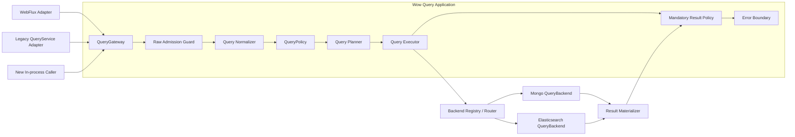

# Query 服务架构升级设计

## 1. 决策摘要

Query 服务重构为一条不可绕过的应用主干：



只把以下三类能力设计为长期扩展端口：

1. `QueryGateway`：唯一应用查询入口；
2. `QueryPolicy`：可信授权、强制条件、字段和结果约束；
3. `QueryBackend`：只执行已经验证的后端无关计划。

`QueryNormalizer`、`QueryPlanner`、预算计算器和路由器在模型稳定前保持框架内部具体实现，不提前开放多套 SPI。现有 `SnapshotQueryService`、`EventStreamQueryService`、HTTP Handler 和存储 `QueryServiceFactory` 保留为兼容适配器，不再同时承担应用端口和 Backend 端口。

## 2. 背景与根因

当前查询合同由 `wow-api` 的 Query DTO、`wow-query` 的 Service/Handler/Filter、WebFlux 路由以及 MongoDB/Elasticsearch 实现共同解释，存在以下结构性问题：

- HTTP 查询经过 Handler/Filter，进程内 `QueryService` 可以直接进入存储，安全与错误处理边界不一致；
- `SnapshotQueryService` / `EventStreamQueryService` 同时表示应用服务和存储服务，类型系统不能阻止循环接线；
- Filter 可通过可变 `QueryContext` 替换整个 query/result，无法承载不可移除的授权条件；
- MongoDB 和 Elasticsearch 分别解释 `Condition`、字段、分页、投影与完整性，公共 DTO 相同但语义并不相同；
- Factory、Provider、Gateway 各自缓存同一聚合的服务实例，生命周期没有唯一 owner；
- `SHADOW` 是执行策略，`STRICT` 是校验策略，把两者放入单一 profile 会形成互斥关系，无法表达“严格校验下进行 shadow”。

因此本次升级不是给 Elasticsearch 增加 MongoDB 操作符别名，而是重新划分应用、语义与存储边界。

## 3. 目标与非目标

### 3.1 目标

1. HTTP 与进程内调用最终都进入同一个 `QueryGateway`。
2. 原始 Query DTO 在应用边界内转换为深度不可变、后端无关的 `QueryPlan`。
3. 授权强制条件具有 provenance，任何后续扩展都不能移除或覆盖。
4. MongoDB 作为 `PORTABLE` 查询语义基准，Backend 只负责编译和执行同一份 Plan。
5. 查询完整性、分页一致性、预算与错误分类由公共合同定义，Backend 不得静默降级。
6. 保持现有 Query DTO、JSON/OpenAPI、七个 `QueryService` 方法、DSL、Spring 聚合 Bean 名称与主要返回结构兼容。
7. 支持按聚合逐步启用 planned path、shadow compare、切换和回滚。

### 3.2 非目标

- 不承诺 `MATCH` 在 MongoDB 与 Elasticsearch 间具有相同分词和相关性。
- 不把 `RAW` 纳入跨 Backend 可移植语义。
- 第一阶段不新增公开 cursor HTTP 协议。
- 应用启动不自动迁移、删除 Elasticsearch 索引或切换 alias。
- 在核心模型尚未稳定前不拆分新的 Gradle module。

## 4. 边界与职责

### 4.1 QueryGateway

`QueryGateway` 是唯一应用端口，负责整个 Publisher 生命周期：

- 每次订阅创建独立的 `QueryInvocation`；
- 读取显式、可信的 `QueryExecutionContext`；
- 完成 admission、normalization、policy、planning、execution 和结果策略；
- 覆盖同步异常、异步 Backend 异常、部分 `Flux` 后的异常和取消；
- 不缓存聚合服务、不解析物理字段、不拥有存储客户端。

WebFlux 是 transport adapter；现有聚合级 `SnapshotQueryService<State>` / `EventStreamQueryService` Bean 是 legacy adapter。两者都只能委托 Gateway。兼容期保留 Handler/Filter，但它们不得再被描述为最终安全边界。

### 4.2 Raw Admission Guard

Policy 不直接接收未经验证的 `Any` DTO。Admission 先执行低成本结构保护：

- 条件深度、节点数、children 形态；
- 字段、projection、sort 数量和字符串长度；
- value、options、RAW payload 的大小上限；
- 非法分页、负 limit 和明显溢出。

Admission 只防止畸形输入消耗过多资源，不决定业务授权或 Backend 语义。

### 4.3 Normalizer

Normalizer 将 wire DTO 转换为 `NormalizedQuery`：

- 完整递归解析逻辑条件和 `ELEM_MATCH` 相对字段作用域；
- 将内置 ID、tenant、owner、space、deleted 操作符映射为逻辑 `SystemField`；
- 将时间操作符基于一次订阅内冻结的 `Clock.instant()` 展开为半开区间；
- 对 List、Map 和字节值进行防御性复制，消除 `Any` 的可变性；
- 验证 projection、sort、pagination、limit 和 Native payload 形态；
- 标注用户条件来源，不混入授权条件。

Normalizer 产物不能包含 BSON、Elasticsearch `Query`、`_id`、`.keyword`、索引名或集合名。

### 4.4 QueryPolicy

`QueryPolicy` 是响应式授权扩展端口，只返回：

```text
Deny(reason)
Allow(
  mandatoryCondition,
  fieldConstraint,
  resultConstraint
)
```

Authority 必须来自经过认证的 `QueryExecutionContext`，不能直接把 Header、请求参数或任意 Reactor key 当作可信身份。用户条件与 `mandatoryCondition` 分开保存 provenance，Planner 在最终 Plan 中强制执行外层 `AND`。Filter、Backend 和 `RAW` 都不能移除该条件。

`LEGACY` 模式下无 authority 的内部调用是一个需要显式迁移的兼容事实，不能默认等价为系统权限。

### 4.5 Planner

Planner 是框架内部确定性实现，输入为 normalized query、policy decision、逻辑字段 schema 和 validation mode，输出 `QueryPlan`。它负责：

- operation 与 typed/dynamic result shape；
- projection、稳定排序、limit/page 与一致性要求；
- 字段 capability 和语义层级；
- Native Backend binding；
- 预算评估和兼容问题报告。

相同语义输入必须产生相同 Plan。deadline、当前时间、执行模式、租户凭据和动态预算不写入语义 Plan，而放在 `QueryExecutionContext/QueryExecutionOptions` 中，避免破坏计划比较、缓存和 shadow 稳定性。

### 4.6 QueryBackend

Backend 只接收完整、已验证的 Plan：

```kotlin
interface QueryBackend<D : Any> {
    fun single(plan: SingleQueryPlan, options: QueryExecutionOptions): Mono<BackendRecord<D>>
    fun stream(plan: StreamQueryPlan, options: QueryExecutionOptions): Flux<BackendRecord<D>>
    fun page(plan: PageQueryPlan, options: QueryExecutionOptions): Mono<BackendPage<D>>
    fun count(plan: CountQueryPlan, options: QueryExecutionOptions): Mono<Long>
}
```

Backend module 负责：

- 逻辑字段到物理字段/multi-field/nested path 的映射；
- Plan 到驱动查询对象的编译；
- driver/cursor/PIT 生命周期；
- timeout、failed shard、total relation、缺失 source 等完整性校验；
- 返回独立 identity 与 payload，不直接物化 typed API 对象。

Backend 不再校验 wire DTO、不追加授权条件、不决定公共 projection/分页语义，也不恢复异常为成功。

### 4.7 Result Materializer 与结果策略

`ResultMaterializer` 在 Backend record 与公共结果之间隔离存储格式：

- typed 查询需要完整信封；
- dynamic 查询可投影 payload，但 identity 由独立 metadata 承载；
- 物理 `_id`、索引名和内部字段不得泄漏；
- mandatory result policy 和 masking 在 materialization 后执行；
- partial `Flux` 必须以 error 终止，不能因为错误处理器返回 empty 而伪装完整成功。

不为所有结果增加通用 `QueryResult<T>` 包装。内部 page 使用带 total relation 与 consistency 的 `BackendPage/PlannedPage`，兼容 adapter 再映射为现有 `PagedList<T>`。

## 5. 核心模型

### 5.1 QueryInvocation 与执行上下文

`QueryInvocation` 显式表达：

- materialized aggregate；
- document kind：`SNAPSHOT` / `EVENT_STREAM`；
- result shape：`TYPED` / `DYNAMIC` / `COUNT`；
- operation：`SINGLE` / `STREAM` / `PAGE` / `COUNT`；
- 原始兼容 Query DTO。

`QueryExecutionContext` 显式携带可信 authority、purpose、deadline、execution mode、validation mode 和 budget。它不是任意 attribute map。

### 5.2 NormalizedCondition

```text
All
Junction(AND | OR | NOR, children)
Predicate(field, operator, immutableValue, options)
ElementMatch(field, childScopeCondition)
Search(field?, text)
Native(backendId, immutableUtf8Json)
```

逻辑字段分为：

```text
SystemField(IDENTITY | AGGREGATE_ID | TENANT_ID | OWNER_ID | SPACE_ID | DELETED)
Path(segments, basis = ROOT | CURRENT_ELEMENT)
```

嵌套元素中的 `id` 是元素相对字段，不得被错误映射为根文档 `_id`。`RAW` 只有显式 Backend binding、可信 capability 和不可变 JSON 才能进入 Plan；旧 `Bson/Query/Any` 只留在 legacy passthrough。

### 5.3 QueryPlan

Plan 使用 sealed operation：

```text
SingleQueryPlan
StreamQueryPlan(limit = Bounded | Unbounded)
PageQueryPlan(offset: Long, size, totalMode, consistency)
CountQueryPlan
```

共享内容：

- `QueryTarget`；
- 用户条件与 mandatory condition 的最终外层合取；
- `PlannedProjection`；
- `PlannedSort`；
- `RequiredCapabilities`；
- `SemanticTier`。

Plan 禁止包含：

- `Any`、BSON 或 Elasticsearch driver 对象；
- 物理字段、集合、索引或 alias；
- mixed include/exclude；
- 未验证的负分页、Int offset 或溢出值；
- 未绑定 Backend 的 Native 条件。

### 5.4 逻辑字段 Schema 与 Backend binding

`QueryFieldSchema` 只描述逻辑合同：字段类型、允许的 operator、exact/range/text/sort/projection/nested 能力及 null/missing/array 模型。

MongoDB/Elasticsearch 各自持有 `BackendFieldBinding`：物理字段、keyword/text multi-field、nested mapping、索引限制和 mapping version。Backend 启动校验 binding/mapping 是否满足逻辑 schema，并记录 capability digest；逻辑 schema 不直接负责生成某个 Backend 的 mapping。

## 6. 语义、分页与完整性

### 6.1 语义层级

| 层级 | 合同 | 路由与对比 |
|---|---|---|
| `PORTABLE` | 以 MongoDB 行为为基准的精确查询语义 | 可跨 Backend 路由和等价 shadow |
| `SEARCH` | `MATCH` 等全文能力 | 要求 TEXT capability；只比较结构与错误，不承诺分词等价 |
| `NATIVE` | `RAW` 等 Backend 原生能力 | 必须绑定 Backend；禁止自动跨 Backend 路由和等价判断 |

`CONTAINS`、`STARTS_WITH`、`ENDS_WITH` 是字面量字符串合同，不允许 Elasticsearch 用 analyzed `match_phrase` 代替。

### 6.2 Projection

- strict typed 查询只接受 `Projection.ALL`；
- compatible typed projection 继续走 legacy，并记录 compatibility issue；
- dynamic 查询允许 include 或 exclude，二者同时非空必须拒绝；
- Backend 永远独立返回 identity，最终 logical projection 不泄漏物理字段。

### 6.3 排序与分页

- `index >= 1`、`size > 0`；
- offset 使用 `Math.multiplyExact((index - 1).toLong(), size.toLong())`；
- strict page 必须具有唯一稳定排序，缺少 identity 时由 Planner 追加逻辑 identity；
- offset page 只支持预算允许的窗口，深分页后续使用独立 cursor 协议；
- page 是 Backend 的单个 SPI 操作，返回 total relation 与 consistency；Executor 不允许静默降低一致性。

MongoDB `SAME_INPUT` 可使用单次 `$facet`，但必须显式处理 stage/文档大小和索引风险；`SNAPSHOT` 需要匹配的 read concern。Elasticsearch exact page 必须校验 `total.relation == Eq`。

### 6.4 List limit

现有 `limit=0` 继续表示 `Unbounded`，不能静默映射为 Elasticsearch 的固定 result window。策略只能显式允许或返回 `BudgetExceeded`。Elasticsearch planned backend 使用 PIT + `search_after`，并在 complete/error/cancel 时关闭 PIT。

### 6.5 完整性与错误

公共错误模型至少区分：

- `InvalidQuery`；
- `AccessDenied`；
- `UnsupportedFeature`；
- `BudgetExceeded`；
- `BackendUnavailable`；
- `BackendTimeout`；
- `IncompleteResult`；
- `MappingFailure`。

Elasticsearch Backend 必须拒绝 timeout、failed shards、缺失 `_source` 和要求 exact 时的非 `Eq` total。MongoDB 与 Elasticsearch 的 driver exception 统一映射，但根因保留为 cause。

## 7. 兼容与发布模式

执行策略与语义校验是两个独立维度：

```text
QueryExecutionMode = LEGACY | SHADOW | PLANNED
QueryValidationMode = COMPATIBLE | STRICT
```

这样可以表达 `SHADOW + STRICT`，也可以在 `PLANNED + COMPATIBLE` 下对无法规范化的历史请求显式 fallback。禁止散落 `strictEnabled`、`shadowEnabled` 等布尔开关。

SHADOW 始终返回 legacy 结果，比较 planned 的：

- 错误类别；
- identity 集合与顺序；
- exact/lower-bound total；
- null/missing/array 行为；
- 完整性与延迟。

`SEARCH/NATIVE` 只记录差异，不判定跨 Backend 等价。任何 fallback 都必须产生原因和指标，不能默默发生。

兼容阶段不能静默修改：

- Query DTO JSON/OpenAPI、七个 QueryService 方法或聚合 Bean 名；
- `limit=0` 语义；
- legacy 排序、typed projection、NoOp 和 HTTP status；
- 自动索引迁移、alias 切换或旧索引删除。

## 8. 生命周期与模块归属

### 8.1 生命周期

- `QueryGateway`、Normalizer、Planner、Policy chain 和 Backend registry 为单例、无请求级可变状态；
- `QueryInvocation`、normalized query、Plan 和 execution context 每订阅创建；
- Backend registry 是 planned Backend 实例的唯一生命周期 owner，key 至少包含 materialized aggregate、document kind 和 backend id；
- 旧 Factory 的缓存行为在兼容期保留，但不再叠加 Provider/Gateway cache；
- cursor/PIT/session 是每次执行资源，必须覆盖 complete/error/cancel 释放。

### 8.2 模块

| 模块 | 职责 |
|---|---|
| `wow-api` | wire DTO、JSON/OpenAPI 和 DSL 合同 |
| `wow-query` | Gateway、Plan/Normalizer/Planner、Policy、错误、experimental Backend SPI |
| `wow-spring` | 现有聚合 QueryService 兼容 adapter 与 Bean name/generic 注册 |
| `wow-spring-boot-starter` | 默认装配、Backend registry/routing 和模式配置 |
| `wow-webflux` | HTTP、authority、request/response adapter；显式依赖 `wow-query` |
| `wow-mongo` | Mongo compiler、binding、Backend、materializer |
| `wow-elasticsearch` | ES compiler、mapping 校验、PIT Backend、materializer |
| `wow-tck` | Mongo 基准 fixtures、计划 golden、双 Backend 语义对比 |

Backend SPI 稳定前放在 experimental package 并增加兼容测试，不新建 Gradle module。

## 9. Elasticsearch 索引生命周期

逻辑名保持稳定 alias，物理索引使用 mapping version 与 generation：

```text
wow.<context>.<aggregate>.snapshot-v0002-000001
wow.<context>.<aggregate>.es-v0002-000001
```

mapping `_meta` 保存 mapping version、document kind 和 capability digest。应用启动只执行 `VALIDATE` 或显式配置的 `CREATE_MISSING`；回填与 alias 切换是独立运维流程：

1. 固化 logical schema 与 backend binding；
2. 创建 template 和新物理索引；
3. Snapshot 从权威事件流重建；
4. EventStream 排空 writer 或启用受控镜像写；
5. 校验 count、identity、版本连续性和 checksum；
6. 执行 SHADOW；
7. 原子切换 alias；
8. 在回滚窗口保留旧索引与 legacy backend。

若切换后没有向旧 EventStream 索引镜像新增写入，alias 不能直接回切。Snapshot 回滚同样需要以权威事件流重建和版本校验为准。

## 10. 分阶段实施

### Phase 0：执行正确性基础

- `QueryHandler` 每次订阅创建独立 context；
- 同步与异步 Backend 错误统一进入 error observer，错误处理器不能把查询恢复为成功；
- 覆盖 partial Flux 和 cancellation；
- EventStream legacy Factory 使用 materialized aggregate key 和并发安全缓存；
- 不切换 Spring Bean，不新增 Gateway/Provider cache，不宣称已形成安全边界。

### Phase 1：纯语义模型

- additive 引入 `QueryInvocation`、`NormalizedCondition`、`QueryPlan`、execution/validation mode；
- 用 golden tests 固化递归字段、时间冻结、projection、limit、分页与 mandatory provenance；
- 不接管生产流量。

### Phase 2：Policy 与 legacy Backend adapter

- 引入可信 execution context 与 `QueryPolicy`；
- 用 legacy Backend adapter 包裹现有 ServiceFactory；
- Gateway、WebFlux 和进程内 legacy adapter 完整接线后再切换 Bean；
- 默认 `LEGACY + COMPATIBLE`，所有 fallback 可观测。

### Phase 3：MongoDB planned path

- Mongo compiler、field binding、Backend、materializer；
- page 单 SPI、一致性与预算；
- 扩展共享 TCK，以 MongoDB 固化 portable 语义；
- 按聚合启用 `SHADOW`，达到门槛后再切 `PLANNED`。

### Phase 4：Elasticsearch planned path

- literal string、nested scope、projection/sort binding；
- 完整结果校验与 PIT unlimited；
- mapping capability readiness；
- 与 MongoDB 运行同一 portable TCK 和 shadow fixtures。

### Phase 5：索引与 cursor

- 版本化物理索引、显式回填与 alias cutover；
- 独立 cursor API；
- 主版本中移除 legacy Filter/converter/service 路径。

## 11. 当前 PR 的处理

当前 PR 只保留 Phase 0 的执行正确性修复和本设计文档。以下过早抽象应撤回：

- `SnapshotQueryGateway*` / `EventStreamQueryGateway*`；
- 名为 Backend、实际返回旧 `QueryService` 的 Provider；
- Gateway/Provider/Factory 三层缓存；
- Spring Registrar 与 Web 文档中“Bean 已切到 Gateway”的声明；
- 为上述临时层保留的自动配置与 ABI bridge。

这能避免在真正的 Plan、Policy、Backend SPI 之前固化错误公开类型。Phase 1 作为后续独立、additive 的可审查切片实现。

## 12. 验证门槛

- Query DTO/OpenAPI golden 不变；
- Kotlin/Java 调用方、Spring Bean name/generic injection 不变；
- error observer 覆盖同步、异步、partial Flux、取消和多订阅；
- Normalizer/Planner golden 覆盖递归 `AND/OR/NOR`、嵌套 element identity、一次 Clock、mandatory 外层 AND、深度不可变；
- MongoDB/Elasticsearch 对同一 fixture 比较 identity、顺序、total、错误与 null/missing/array；
- 覆盖 `limit=0` 且超过 10,000 条、相同业务排序键、多页稳定回放和并发写；
- mapping capability 不满足 logical schema 时 readiness 失败；
- 所有执行模式、alias 切换和索引回滚均有明确数据源、指标、阈值与演练证据。
