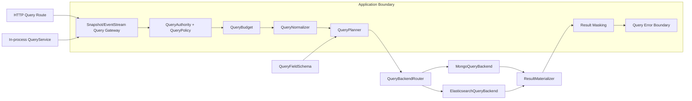

# Query 服务架构升级设计

## 1. 背景

当前 Query 能力由以下部分共同组成：

- `wow-api` 提供 `Condition`、`SingleQuery`、`ListQuery`、`PagedQuery`、`Projection` 和 `Sort`；
- `wow-query` 提供 `QueryService`、Snapshot/EventStream 查询服务、Filter 与 Handler；
- `wow-spring` 按聚合注册进程内 `SnapshotQueryService` / `EventStreamQueryService` Bean；
- `wow-webflux` 通过 Query Handler 暴露 HTTP 查询端点；
- MongoDB 与 Elasticsearch 分别转换和执行同一套 Query DTO。

旧架构存在两个并行入口：HTTP 请求经过 Query Handler 和 Filter，而进程内 QueryService 直接进入存储实现。授权、条件重写、脱敏和错误处理因此不是不可绕过的应用边界。MongoDB 与 Elasticsearch 又分别承担条件验证、字段解析、分页、投影和结果物化，导致公共 DTO 相同但实际语义不同。

本次升级不再以逐个修补 Elasticsearch 操作符为目标，而是建立统一的查询应用边界、语义计划和后端执行协议。

## 2. 目标与非目标

### 2.1 目标

1. HTTP 与进程内查询共享同一应用服务边界。
2. 将用户 Query DTO 规范化为不可变、后端无关的 `QueryPlan`。
3. 在进入存储前统一执行授权约束、结构验证、资源预算和字段能力验证。
4. MongoDB 与 Elasticsearch 只负责编译并执行同一份计划。
5. 查询结果必须显式区分完整成功、部分结果和失败；默认不接受静默截断。
6. 保持现有 Query DTO、DSL、HTTP JSON、聚合 Bean 名称和主要服务接口兼容。
7. 支持按聚合 shadow compare、渐进切换和快速回滚。

### 2.2 非目标

- 不承诺 `MATCH` 的分词和相关性在 MongoDB 与 Elasticsearch 间完全一致。
- 不把 `RAW` 纳入可移植语义。
- 第一阶段不新增公开 cursor HTTP 协议。
- 应用启动不得自动迁移已有 Elasticsearch 索引或切换 alias。

## 3. 目标架构



### 3.1 Query Gateway

Gateway 是唯一应用级查询入口：

- WebFlux Query Route 调用 Gateway；
- Spring 按聚合注册的 QueryService Bean 也是 Gateway 适配器；
- 存储 QueryServiceFactory 仅供 Tail/Backend 层使用；
- Backend Service 生命周期统一为每个物化聚合一个实例；自定义 Factory 的订阅级状态必须位于 Reactor Publisher 内，不能依赖每次查询创建 Service；
- 每次订阅创建独立 invocation，不跨订阅共享可变 `QueryContext`；
- Filter、后端 publisher、结果物化与 masking 位于同一错误边界。

现有 `SnapshotQueryService`、`EventStreamQueryService` 和聚合 Bean 名称继续保留，作为兼容外壳委托 Gateway。

### 3.2 Query Policy

`QueryPolicy` 只能产生以下决策：

- `Deny(reason)`；
- `Allow(mandatoryCondition, fieldPolicy, resultPolicy)`。

`mandatoryCondition` 必须与用户条件执行逻辑 `AND`，不得替换用户条件。tenant、owner、space、删除态与 ABAC 约束在此边界统一追加。Authority 必须来自可信上下文，不得直接信任请求参数或 Header。

### 3.3 Query Normalizer 与 Query Plan

Normalizer 在一次订阅内完成：

1. Query DTO 结构验证；
2. 时间操作符基于注入的 `Clock` 冻结边界；
3. 递归规范化逻辑条件；
4. 解析逻辑字段和 `ELEM_MATCH` 相对作用域；
5. 校验 projection、sort、pagination 和 limit；
6. 计算结构复杂度与执行预算；
7. 生成深度不可变的 `QueryPlan`。

`QueryPlan` 不得包含 BSON、Elasticsearch `Query`、物理字段名或索引名。MongoDB 的 `_id`、Elasticsearch multi-field 和 nested path 只在 Backend compiler 内出现。

建议的计划形态：

```text
SingleQueryPlan
ListQueryPlan(limit = Bounded | Unbounded)
OffsetPageQueryPlan(index, size, exactTotal)
CountQueryPlan
```

所有计划共享：

- `QueryTarget`：Snapshot/EventStream、Typed/Dynamic；
- `NormalizedCondition`；
- `ValidatedProjection`；
- 稳定排序；
- `SemanticTier`；
- `QueryBudget`；
- `CompatibilityProfile`。

### 3.4 字段能力

每个聚合通过 `QueryFieldSchema` 声明逻辑查询能力，至少包括：

- `EXACT`：精确、集合和字面量字符串操作；
- `RANGE`：数值、日期或可排序标量；
- `TEXT`：全文检索；
- `SORT`：稳定单值排序；
- `NESTED`：`ELEM_MATCH` 嵌套作用域；
- null/missing/空数组模型；
- 精确值最大长度等物理限制。

同一个 Schema 既用于 Planner 校验，也用于生成/验证 Elasticsearch mapping。客户端始终使用逻辑字段，不暴露 `.keyword`、`_id` 或 nested 物理路径。

### 3.5 语义分层

| 层级 | 说明 | 路由约束 |
|---|---|---|
| `PORTABLE` | MongoDB 基准下可由所有目标 Backend 实现的精确语义 | 允许跨后端路由与 shadow compare |
| `SEARCH` | `MATCH` 等全文检索能力 | 必须声明 `TEXT` capability，不承诺跨后端分词一致 |
| `NATIVE` | `RAW` 等后端原生查询 | 必须绑定 backend，禁止自动改写或跨后端等价比较 |

即使是 `NATIVE` 查询，系统强制条件仍应在最外层追加，不能绕过 tenant、owner、删除态和授权约束。

## 4. 查询合同

### 4.1 Projection

- Typed 查询需要完整的存储信封；严格模式下只允许 `Projection.ALL`。
- Dynamic 查询允许字段投影，但 Backend 必须通过隐藏 metadata 保留 identity，最终结果不得泄漏物理字段。
- include 与 exclude 同时非空必须拒绝，不能由不同 Backend 自行决定优先级。

### 4.2 分页与排序

- `index >= 1`、`size > 0`，offset 使用 `Long` 计算并校验预算与溢出。
- Paged 查询必须有稳定唯一排序；缺少唯一键时由 Planner 追加逻辑 identity。
- Offset page 只支持配置允许的浅分页窗口。
- 深分页由后续独立 `CursorQuery` 协议提供，不把 Elasticsearch cursor 细节泄漏给客户端。
- page 的 total 和 items 由同一个 Backend page 操作产生，并显式声明一致性等级。

### 4.3 List limit

现有 `limit=0` 合同表示 unlimited。兼容模式保留该含义：

- MongoDB 使用响应式 cursor；
- Elasticsearch 使用 PIT + `search_after` 分页展开；
- 完成、错误和取消均关闭 PIT；
- 不允许把 unlimited 静默映射为 10,000。

公开 API 是否改为强制上限属于下一主版本决策。

### 4.4 结果完整性

Elasticsearch Backend 必须校验：

- `timedOut == false`；
- failed shards 为 0；
- hit 必须包含 `_source`；
- exact page 的 total relation 必须为 `Eq`。

公共错误模型至少区分：

- `InvalidQuery`；
- `AccessDenied`；
- `UnsupportedFeature`；
- `BudgetExceeded`；
- `BackendUnavailable`；
- `BackendTimeout`；
- `IncompleteResult`；
- `MappingFailure`。

## 5. 兼容策略

升级期间使用单一 `CompatibilityProfile`，不散落布尔开关：

| Profile | 用途 |
|---|---|
| `LEGACY_V8` | 保持现有公开结果与排序行为，记录不兼容能力和弃用指标 |
| `SHADOW` | 同时执行 legacy/planned，返回 legacy，比较结果、顺序、total、错误与延迟 |
| `STRICT` | 启用完整验证、预算、字段能力、稳定排序和完整结果要求 |

以下变化不能在兼容阶段静默发生：

- 修改 QueryService 方法签名或聚合 Bean 名称；
- 修改 Query DTO JSON/OpenAPI 形态；
- 把 unlimited 静默改为固定上限；
- 自动改变业务排序；
- 把 NoOp 查询结果直接改成启动失败；
- 改变 HTTP 错误码而不更新契约；
- 自动迁移或删除 Elasticsearch 索引。

## 6. Elasticsearch 索引生命周期

逻辑名称保持稳定 alias，物理索引版本化：

```text
wow.<context>.<aggregate>.snapshot-v0002-000001
wow.<context>.<aggregate>.es-v0002-000001
```

mapping `_meta` 保存 mapping version、capability digest 和 document kind。应用启动默认只执行 `VALIDATE` 或 `CREATE_MISSING`，索引重建与 alias 切换由显式运维流程完成。

迁移顺序：

1. 建立 QueryFieldSchema；
2. 创建 component template、聚合模板和新物理索引；
3. 从权威事件流重建 Snapshot；
4. 对 EventStream 停止/排空 writer 或启用受控镜像写；
5. 校验文档数、identity、事件版本连续性和 checksum；
6. 运行 SHADOW 对比；
7. 原子切换 alias；
8. 保留旧索引、旧模板和 legacy Backend，覆盖回滚窗口。

若切换后只向新索引写入，不能直接把 alias 指回旧索引。EventStream 回滚前必须同步增量，Snapshot 则必须从权威事件流重建并验证版本。

## 7. 分阶段实施

### Phase 0：应用边界

- 聚合级 QueryService Bean 改为 Gateway；
- HTTP 与进程内查询共享 Handler/Filter；
- 后端异步错误纳入 QueryErrorHandler；
- 每次订阅使用独立 QueryContext；
- 修复 EventStream factory 并发缓存与逻辑聚合键。

### Phase 1：规范化与预算

- 引入 QueryNormalizer、QueryPlan、QueryBudget 和 CompatibilityProfile；
- 覆盖递归条件、时间冻结、projection、分页、排序与 RAW 分层；
- 通过 legacy adapter 保持现有 Backend 可运行。

### Phase 2：Backend SPI

- 引入 QueryBackend、QueryBackendRouter、ResultMaterializer；
- MongoDB/Elasticsearch converter 降级为 Backend compiler；
- TCK 对同一 portable plan 比较 identity、顺序、total 与错误。

### Phase 3：严格语义

- MongoDB 递归字段作用域、稳定分页和 page 一致性；
- Elasticsearch 完整结果校验、PIT + `search_after`；
- QueryFieldSchema 与 mapping readiness 校验；
- 聚合级 SHADOW/STRICT 切换。

### Phase 4：索引与 cursor

- 版本化物理索引、alias 和显式迁移工具；
- 独立 CursorQuery/CursorPage 公共协议；
- 删除 legacy converter/service 路径需要主版本迁移计划。

## 8. 验证门槛

- Query DTO/OpenAPI golden 不变；
- Kotlin/Java 调用方继续编译；
- Spring 聚合 Bean 名、类型和泛型注入不变；
- Query Gateway 覆盖 Filter、同步/异步错误、多订阅、取消和超时；
- MongoDB/Elasticsearch 对同一数据集运行共享 TCK；
- 覆盖大于 10,000 条、null/missing/数组/nested、日期边界、相同排序键和并发写入；
- Elasticsearch mapping capability digest 不匹配时 readiness 失败；
- SHADOW 记录 identity、顺序、total、错误类型和延迟差异；
- 所有切换均保留明确回滚源和可验证回滚步骤。
