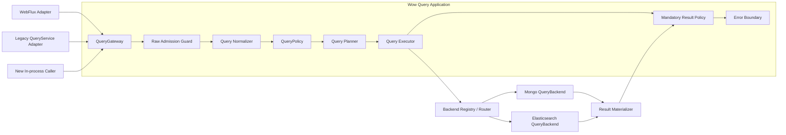

# Query 服务架构升级设计

## 1. 决策摘要

Query 服务重构为一条不可绕过的应用主干：



只把以下三类能力设计为长期扩展端口：

1. `QueryGateway`：唯一应用查询入口；
2. `QueryPolicy`：可信授权、强制条件、字段和结果约束；
3. `QueryBackend`：只执行已经验证的后端无关计划。

`QueryNormalizer`、`QueryPlanner`、预算计算器和路由器在模型稳定前保持框架内部具体实现，不提前开放多套 SPI。现有 `SnapshotQueryService`、`EventStreamQueryService`、HTTP Handler 和存储 `QueryServiceFactory` 保留为兼容适配器，不再同时承担应用端口和 Backend 端口。

## 2. 背景与根因

当前查询合同由 `wow-api` 的 Query DTO、`wow-query` 的 Service/Handler/Filter、WebFlux 路由以及 MongoDB/Elasticsearch 实现共同解释，存在以下结构性问题：

- HTTP 查询经过 Handler/Filter，进程内 `QueryService` 可以直接进入存储，安全与错误处理边界不一致；
- `SnapshotQueryService` / `EventStreamQueryService` 同时表示应用服务和存储服务，类型系统不能阻止循环接线；
- Filter 可通过可变 `QueryContext` 替换整个 query/result，无法承载不可移除的授权条件；
- MongoDB 和 Elasticsearch 分别解释 `Condition`、字段、分页、投影与完整性，公共 DTO 相同但语义并不相同；
- Factory、Provider、Gateway 各自缓存同一聚合的服务实例，生命周期没有唯一 owner；
- `SHADOW` 是执行策略，`STRICT` 是校验策略，把两者放入单一 profile 会形成互斥关系，无法表达“严格校验下进行 shadow”。

因此本次升级不是给 Elasticsearch 增加 MongoDB 操作符别名，而是重新划分应用、语义与存储边界。

## 3. 目标与非目标

### 3.1 目标

1. HTTP 与进程内调用最终都进入同一个 `QueryGateway`。
2. 原始 Query DTO 在应用边界内转换为深度不可变、后端无关的 `QueryPlan`。
3. 授权强制条件具有 provenance，任何后续扩展都不能移除或覆盖。
4. MongoDB 作为 `PORTABLE` 查询语义基准，Backend 只负责编译和执行同一份 Plan。
5. 查询完整性、分页一致性、预算与错误分类由公共合同定义，Backend 不得静默降级。
6. 保持现有 Query DTO、JSON/OpenAPI、七个 `QueryService` 方法、DSL、Spring 聚合 Bean 名称与主要返回结构兼容。
7. 将分析型聚合建模为独立的一等操作，在不污染记录查询合同的前提下统一 MongoDB/Elasticsearch 的分组、指标、桶分页与完整性语义。
8. 支持按聚合逐步启用 planned path、shadow compare、切换和回滚。

### 3.2 非目标

- 不承诺 `MATCH` 在 MongoDB 与 Elasticsearch 间具有相同分词和相关性。
- 不把 `RAW` 纳入跨 Backend 可移植语义。
- 第一阶段不新增公开 cursor HTTP 协议。
- 当前 PR 不增加公开聚合 DSL、`AnalyticsQueryService` 或第八个 `QueryService` 方法。
- 不在查询运行时提供跨聚合、跨集合或跨索引 join；此类需求通过 Projection 物化专用 read model。
- 应用启动不自动迁移、删除 Elasticsearch 索引或切换 alias。
- 在核心模型尚未稳定前不拆分新的 Gradle module。

### 3.3 聚合术语边界

“聚合”在 Wow 中必须区分三种含义：

| 术语 | 含义 | 本设计的处理 |
|---|---|---|
| DDD Aggregate 查询 | 查询某个聚合根的 Snapshot 或 EventStream read model | 现有记录查询目标 |
| 分析型聚合 | `GROUP BY`、document count、`MIN/MAX/SUM/AVG` 等统计 | 独立 `ANALYZE` 操作 |
| 联邦查询 | 跨聚合/集合/索引 join | 明确排除，改用物化 Projection |

公开类型使用 `Analytics*`，避免 `AggregateQuery` 与 DDD Aggregate 混淆。分析型聚合共享
`QueryGateway`、Policy、Planner 和 Backend registry，但不复用记录查询的 `PagedList`、
`DynamicDocument` 或七方法 `QueryService` 合同。

## 4. 边界与职责

### 4.1 QueryGateway

`QueryGateway` 是唯一应用端口，负责整个 Publisher 生命周期：

- 每次订阅创建独立的 `QueryInvocation`；
- 读取显式、可信的 `QueryExecutionContext`；
- 完成 admission、normalization、policy、planning、execution 和结果策略；
- 覆盖同步异常、异步 Backend 异常、部分 `Flux` 后的异常和取消；
- 不缓存聚合服务、不解析物理字段、不拥有存储客户端。

WebFlux 是 transport adapter；现有聚合级 `SnapshotQueryService<State>` / `EventStreamQueryService` Bean 是 legacy adapter。两者都只能委托 Gateway。兼容期保留 Handler/Filter，但它们不得再被描述为最终安全边界。

未来新增的 `AnalyticsQueryService` 是独立、additive 的应用 adapter，同样只能委托 Gateway；它不是现有
`QueryService` 的第八个方法，也不能直接持有 MongoDB collection 或 Elasticsearch client。

### 4.2 Raw Admission Guard

Policy 不直接接收未经验证的 `Any` DTO。Admission 先执行低成本结构保护：

- 条件深度、节点数、children 形态；
- 字段、projection、sort 数量和字符串长度；
- value、options、RAW payload 的大小上限；
- 非法分页、负 limit 和明显溢出。

Admission 只防止畸形输入消耗过多资源，不决定业务授权或 Backend 语义。

### 4.3 Normalizer

Normalizer 将 wire DTO 转换为 `NormalizedQuery`：

- 完整递归解析逻辑条件和 `ELEM_MATCH` 相对字段作用域；
- 将内置 ID、tenant、owner、space、deleted 操作符映射为逻辑 `SystemField`；
- 将时间操作符基于一次订阅内冻结的 `Clock.instant()` 展开为半开区间；
- 对 List、Map 和字节值进行防御性复制，消除 `Any` 的可变性；
- 验证 projection、sort、pagination、limit 和 Native payload 形态；
- 标注用户条件来源，不混入授权条件。

Normalizer 产物不能包含 BSON、Elasticsearch `Query`、`_id`、`.keyword`、索引名或集合名。

### 4.4 QueryPolicy

`QueryPolicy` 是响应式授权扩展端口，只返回：

```text
Deny(reason)
Allow(
  mandatoryCondition: NormalizedCondition,
  fieldConstraint,
  resultConstraint,
  analyticsConstraint
)
```

Authority 必须来自经过认证的 `QueryExecutionContext`，不能直接把 Header、请求参数或任意 Reactor key 当作可信身份。Policy 只接收已经规范化的 query，并且只能通过 typed policy builder 产生 `NormalizedCondition`；不得把 wire `Condition`、`Any`、`RAW` 或 Backend Native 条件直接注入 policy decision。

用户条件与 `mandatoryCondition` 分开保存 provenance。Planner 必须分别对两者执行同一套字段 schema、operator、capability 和预算校验，通过后才在最终 Plan 中强制执行外层 `AND`。Filter、Backend 和 Native 查询都不能移除或覆盖该条件。

`analyticsConstraint` 约束可使用的 dimension、metric、having、bucket order、最大桶数以及最小桶文档数。
最小桶文档数属于带 provenance 的强制聚合条件，必须在 Backend 内执行，不能只在响应序列化阶段删除小桶，
否则 cursor、桶数或相邻查询仍可能泄露受保护信息。

`LEGACY` 模式下无 authority 的内部调用是一个需要显式迁移的兼容事实，不能默认等价为系统权限。

### 4.5 Planner

Planner 是框架内部确定性实现，输入为 normalized query、policy decision、逻辑字段 schema 和 validation mode，输出 `QueryPlan`。它负责：

- operation 与 typed/dynamic result shape；
- projection、稳定排序、limit/page 与一致性要求；
- 字段 capability 和语义层级；
- Native Backend binding；
- 预算评估和兼容问题报告。

相同语义输入必须产生相同 Plan。deadline、当前时间、执行模式、租户凭据和动态预算不写入语义 Plan，而放在 `QueryExecutionContext/QueryExecutionOptions` 中，避免破坏计划比较、缓存和 shadow 稳定性。

### 4.6 QueryBackend

Backend 只接收完整、已验证的 Plan：

```kotlin
interface QueryBackend<D : Any> {
    fun single(plan: SingleQueryPlan, options: QueryExecutionOptions): Mono<BackendRecord<D>>
    fun stream(plan: StreamQueryPlan, options: QueryExecutionOptions): Flux<BackendRecord<D>>
    fun page(plan: PageQueryPlan, options: QueryExecutionOptions): Mono<BackendPage<D>>
    fun count(plan: CountQueryPlan, options: QueryExecutionOptions): Mono<Long>
}

interface AnalyticsQueryBackend {
    fun analyze(
        plan: AnalyticsQueryPlan,
        options: QueryExecutionOptions
    ): Mono<BackendAnalyticsPage>
}
```

分析能力使用独立 Backend capability interface，避免强迫只支持记录查询的 Backend 实现空方法或在运行期
抛出通用异常。Planner/Router 在执行前根据 capability 拒绝不支持的 operation。

Backend module 负责：

- 逻辑字段到物理字段/multi-field/nested path 的映射；
- Plan 到驱动查询对象的编译；
- driver/cursor/PIT 生命周期；
- timeout、failed shard、total relation、缺失 source 等完整性校验；
- 返回独立 identity 与 payload，不直接物化 typed API 对象。

Backend 不再校验 wire DTO、不追加授权条件、不决定公共 projection/分页语义，也不恢复异常为成功。

### 4.7 Result Materializer 与结果策略

`ResultMaterializer` 在 Backend record 与公共结果之间隔离存储格式：

- typed 查询需要完整信封；
- dynamic 查询可投影 payload，但 identity 由独立 metadata 承载；
- 物理 `_id`、索引名和内部字段不得泄漏；
- mandatory result policy 和 masking 在 materialization 后执行；
- partial `Flux` 必须以 error 终止，不能因为错误处理器返回 empty 而伪装完整成功。

不为所有结果增加通用 `QueryResult<T>` 包装。内部 page 使用带 total relation 与 consistency 的 `BackendPage/PlannedPage`，兼容 adapter 再映射为现有 `PagedList<T>`。

分析结果使用独立、深度不可变的 `AnalyticsPage`：bucket key、metric value、cursor 和 completeness
均为显式值对象。它不伪装成实体列表，不复用可变 `DynamicDocument`，也不把 bucket count 填入
`PagedList.total`。桶总数默认不计算；未来若调用方显式请求，必须作为单独高成本 capability 预算和执行。

## 5. 核心模型

### 5.1 QueryInvocation 与执行上下文

`QueryInvocation` 显式表达：

- materialized aggregate；
- document kind：`SNAPSHOT` / `EVENT_STREAM`；
- result shape：`TYPED` / `DYNAMIC` / `COUNT` / `ANALYTICS`；
- operation：`SINGLE` / `STREAM` / `PAGE` / `COUNT` / `ANALYZE`；
- 原始兼容 Query DTO。

`QueryExecutionContext` 显式携带可信 authority、purpose、deadline、execution mode、validation mode 和 budget。它不是任意 attribute map。

### 5.2 NormalizedCondition

```text
All
Junction(AND | OR | NOR, children)
Predicate(field, operator, immutableValue, options)
ElementMatch(field, childScopeCondition)
Search(scope, text)
Native(backendId, immutableUtf8Json)
```

逻辑字段分为：

```text
SystemField(IDENTITY | AGGREGATE_ID | TENANT_ID | OWNER_ID | SPACE_ID | DELETED)
Path(segments, basis = ROOT | CURRENT_ELEMENT)
```

嵌套元素中的 `id` 是元素相对字段，不得被错误映射为根文档 `_id`。`RAW` 只有显式 Backend binding、可信 capability 和不可变 JSON 才能进入 Plan；旧 `Bson/Query/Any` 只留在 legacy passthrough。

### 5.3 QueryPlan

Plan 使用 sealed operation：

```text
SingleQueryPlan
StreamQueryPlan(limit = Bounded | Unbounded)
PageQueryPlan(offset: Long, size, totalMode, consistency)
CountQueryPlan
AnalyticsQueryPlan
```

所有 Plan 共享 `QueryTarget`、用户条件与 mandatory condition 的最终外层合取、
`RequiredCapabilities` 和 `SemanticTier`。记录型 Plan 另外共享：

- `PlannedProjection`；
- `PlannedSort`；

`AnalyticsQueryPlan` 不复用记录 projection/sort/pagination，改为显式包含 dimension、metric、having、
bucket order、bucket window/cursor、missing policy、numeric policy、required consistency 和
required completeness。预算与 deadline 仍属于 `QueryExecutionOptions`，不写入可比较的语义 Plan。

Plan 禁止包含：

- `Any`、BSON 或 Elasticsearch driver 对象；
- 物理字段、集合、索引或 alias；
- mixed include/exclude；
- 未验证的负分页、Int offset 或溢出值；
- 未绑定 Backend 的 Native 条件。

### 5.4 逻辑字段 Schema 与 Backend binding

`QueryFieldSchema` 只描述逻辑合同：字段类型、允许的 operator、exact/range/full-text/literal-pattern/
sort/projection/aggregation/nested 能力及 null/missing/array 模型。

MongoDB/Elasticsearch 各自持有 `BackendFieldBinding`：物理字段、keyword/text multi-field、nested mapping、索引限制和 mapping version。Backend 启动校验 binding/mapping 是否满足逻辑 schema，并记录 capability digest；逻辑 schema 不直接负责生成某个 Backend 的 mapping。

#### 5.4.1 字符串能力模型

客户端和 Plan 只引用 `state.name` 这样的逻辑字段，不允许引用 `.keyword`、`.exact`、analyzer、normalizer
或 Elasticsearch field type。字符串不是单一 `STRING` capability，而是按查询语义组合：

| 逻辑能力 | 允许的操作 | Elasticsearch 典型 binding | MongoDB 基准 |
|---|---|---|---|
| `EXACT` | `EQ/NE/IN/NOT_IN/ALL_IN` | 未分析的 `keyword` field | 原字段精确值比较 |
| `FULL_TEXT` | `MATCH` / `Search` | `text` field | 已声明 text index/search scope |
| `LITERAL_PATTERN` | `CONTAINS/STARTS_WITH/ENDS_WITH` | `keyword` 或专用 `wildcard` field | 转义用户值后的字面量 regex |
| `SORTABLE` | record sort、稳定 tie-breaker | 启用 `doc_values` 的 exact field | 原字段排序与显式 collation |
| `AGGREGATABLE` | analytics dimension | 启用 `doc_values` 的 exact field | 原字段 `$group` key |
| `PROJECTABLE` | include/exclude/materialization | `_source` 中的 source field | 原文档字段 |

`MATCH` 不再伪装成普通字段 predicate，而规范化为 `Search(scope, text)`。`scope` 是逻辑搜索范围：MongoDB
binding 指向一个已声明的 text index，Elasticsearch binding 指向一个或多个 `text` field。MongoDB text index
不能满足任意单字段 scope 时，该 scope 在 MongoDB 上为 unsupported；`SEARCH` tier 不承诺跨 Backend analyzer、
分词、相关性或排序等价。

现有 wire `Condition.MATCH(field, value)` 保持 JSON/DSL 兼容，由 Normalizer 把 `field` 解析为 schema 已声明的
legacy search scope。找不到 scope 或 Backend 无法满足字段范围时，planned path 稳定拒绝；`COMPATIBLE` 模式
可以带 reason/metric 回退 legacy，但不得在 planned path 中悄悄扩大为 MongoDB 全 text index。

首批 `PORTABLE` 字面量字符串合同只承诺 case-sensitive。`ignoreCase=true` 只有在 schema 声明大小写模型、
MongoDB/Elasticsearch binding 具有等价 normalization/collation 且 shared TCK 证明 Unicode/边界行为后才开放；
否则稳定返回 `UnsupportedFeature`，不能把 Elasticsearch `case_insensitive` 当作 MongoDB `i` regex 的无证据
替代。

字符串范围比较只在 schema 显式声明有序字符串、normalization 和 collation 时允许。否则
`GT/LT/GTE/LTE/BETWEEN` 对字符串稳定拒绝，避免把 Backend 默认字典序误认为公共合同。

#### 5.4.2 Elasticsearch 字符串 binding

需要全文检索和精确能力的同一逻辑字段使用 multi-field，但 sub-field 名称仍是 Backend 私有实现，例如：

```text
logical field: state.name

ElasticsearchStringBinding(
  sourceField = state.name,
  searchField = state.name,
  exactField = state.name.exact,
  literalField = state.name.exact,
  sortField = state.name.exact,
  groupField = state.name.exact
)
```

Planner 只产生 required capability；Elasticsearch compiler 必须按 binding 精确选择字段：

- `EQ/IN` 及其否定、排序和分组只使用 exact/sort/group field；不得对 analyzed `text` 执行 `term`；
- `MATCH` 只使用 search field；不得自动回退到 keyword；
- `CONTAINS/STARTS_WITH/ENDS_WITH` 只使用 literal field，并转义 `\\`、`*`、`?` 等模式字符；不得用
  `match_phrase` 替代字面量子串；
- projection/materialization 始终读取 logical source field，不返回或泄漏 multi-field；
- 缺少所需 binding、mapping 类型不符或 `doc_values` 不满足时，在执行前返回 `UnsupportedFeature` 或
  readiness failure，不按字段名猜测 `.keyword`。

推荐 mapping 由字段用途决定，而不是使用一个全局 dynamic string template：

| 字段用途 | 推荐 mapping |
|---|---|
| ID、code、status、tag | `keyword` |
| name/title，既检索又精确排序/分组 | `text` + exact `keyword` multi-field |
| description/content，仅全文检索 | `text` |
| 高频 grep-like、前导 wildcard 的机器生成大文本 | 经 benchmark 后声明专用 `wildcard` literal field |

`ignore_above` 是完整性边界，不只是 mapping 参数。超过限制的值仍可能存在于 `_source`，却不进入 exact
field，导致精确查询、排序和聚合静默漏数。只有满足以下全部条件，Backend 才能发布对应 exact/sort/group
capability：

1. logical schema 声明并在写入端执行可索引的字符/UTF-8 byte 长度约束；
2. `ignore_above`、Lucene term 限制与该约束一致；
3. readiness 对现有 generation 完成 mapping 和数据审计，不存在会被忽略的历史值；
4. 新增 multi-field 后已重建/回填历史文档；只更新 template/mapping 不算完成。

旧索引的动态 `.keyword` 只有通过上述 readiness 后才能临时绑定。默认动态 mapping、Snapshot/EventStream
不同 template 或字段名恰好存在都不能成为 capability 证据。

#### 5.4.3 其他字段类型

- numeric、instant/date、boolean 使用对应逻辑类型与物理 binding，不通过字符串 multi-field 模拟；
- object 本身不能参与 exact/range/sort/group，必须选择有 schema 的叶子字段；
- array 沿用元素类型能力，并显式声明 missing/null/empty/multi-valued 模型；
- `ELEM_MATCH` 需要 element-relative schema；Elasticsearch 必须具有对应 `nestedPath`，普通 object array
  mapping 不能冒充 nested capability。

## 6. 语义、分页与完整性

### 6.1 语义层级

| 层级 | 合同 | 路由与对比 |
|---|---|---|
| `PORTABLE` | 以 MongoDB 行为为基准的精确查询语义 | 可跨 Backend 路由和等价 shadow |
| `SEARCH` | `MATCH` 等全文能力 | 要求 `FULL_TEXT` capability；只比较结构与错误，不承诺分词等价 |
| `NATIVE` | `RAW` 等 Backend 原生能力 | 必须绑定 Backend；禁止自动跨 Backend 路由和等价判断 |

`CONTAINS`、`STARTS_WITH`、`ENDS_WITH` 是字面量字符串合同，不允许 Elasticsearch 用 analyzed `match_phrase` 代替。

### 6.2 Projection

- strict typed 查询只接受 `Projection.ALL`；
- compatible typed projection 继续走 legacy，并记录 compatibility issue；
- dynamic 查询允许 include 或 exclude，二者同时非空必须拒绝；
- Backend 永远独立返回 identity，最终 logical projection 不泄漏物理字段。

### 6.3 排序与分页

- `index >= 1`、`size > 0`；
- offset 使用 `Math.multiplyExact((index - 1).toLong(), size.toLong())`；
- strict page 必须具有唯一稳定排序，缺少 identity 时由 Planner 追加逻辑 identity；
- offset page 只支持预算允许的窗口，深分页后续使用独立 cursor 协议；
- page 是 Backend 的单个 SPI 操作，返回 total relation 与 consistency；Executor 不允许静默降低一致性。

MongoDB `SAME_INPUT` 可使用单次 `$facet`，但必须显式处理 stage/文档大小和索引风险；`SNAPSHOT` 需要匹配的 read concern。Elasticsearch exact page 必须校验 `total.relation == Eq`。

### 6.4 List limit

现有 `limit=0` 继续表示 `Unbounded`，不能静默映射为 Elasticsearch 的固定 result window。策略只能显式允许或返回 `BudgetExceeded`。Elasticsearch planned backend 使用 PIT + `search_after`，并在 complete/error/cancel 时关闭 PIT。

### 6.5 完整性与错误

公共错误模型至少区分：

- `InvalidQuery`；
- `InvalidCursor`；
- `AccessDenied`；
- `UnsupportedFeature`；
- `BudgetExceeded`；
- `BackendUnavailable`；
- `BackendTimeout`；
- `IncompleteResult`；
- `MappingFailure`。

Elasticsearch Backend 必须拒绝 timeout、failed shards、缺失 `_source` 和要求 exact 时的非 `Eq` total。MongoDB 与 Elasticsearch 的 driver exception 统一映射，但根因保留为 cause。

### 6.6 分析型聚合合同

分析请求先规范化为独立模型：

```text
AnalyticsQueryPlan(
  target,
  preFilter = userCondition AND mandatoryCondition,
  grouping: Global | By(NonEmptyList<Dimension>),
  metrics: NonEmptyList<Metric>,
  having: AnalyticsCondition = All,
  bucketOrder,
  bucketWindow: First | After(cursor),
  missingPolicy,
  numericPolicy,
  requiredConsistency,
  requiredCompleteness,
  requiredCapabilities
)
```

- `preFilter` 只引用 read-model 字段，在分组前执行；
- `having` 使用独立 AST，只能引用 dimension 或 metric alias，不能混入 `NormalizedCondition`、`RAW`
  或物理字段；
- `Global` 表示无 `GROUP BY` 的全局统计，只产生一个 global bucket；`By` 才要求至少一个 dimension；
- dimension/metric alias 在一次请求中唯一，并在 Planner 阶段绑定逻辑 schema；
- bucket order 是分析结果合同，不等价于记录 `sort`；
- cursor 是不透明值，绑定 plan digest、target、稳定 key order 和 Backend paging state；调用方不能自行拼装；
- 成功结果的 completeness 为 `Exact`，或在调用方显式允许近似时为
  `Approximate(errorBound?, warnings)`；要求 exact 时任何近似、timeout 或分片失败都返回
  `IncompleteResult`。

结果模型：

```text
AnalyticsPage(
  buckets: List<AnalyticsBucket(key: Global | DimensionKey, metrics: List<MetricValue>)>,
  nextCursor: AnalyticsCursor?,
  consistency: Eventual | Snapshot,
  completeness: Exact | Approximate,
  warnings
)
```

`Global` grouping 最多返回一个 bucket 且没有 next cursor。`By` grouping 的 `nextCursor == null` 只表示本次
查询已无更多桶，不承诺已计算桶总数。exact bucket pagination 只能按唯一、稳定的 dimension key 顺序进行；
按 metric 排序的全局 top-N 不是同一能力。

`completeness` 与 `consistency` 正交：`Exact` 表示每次请求没有已知近似或部分结果，不表示多次 cursor
请求观察到同一数据快照。`Snapshot` 才承诺跨页输入集合固定；Backend 不具备该能力时必须在执行前拒绝，
不能用 `Eventual` 静默替代。

第一批 `PORTABLE` 合同收敛为：

- 单个 `QueryTarget`，优先只开放 `SNAPSHOT`；
- 支持无 dimension 的 global aggregation；分组时只允许根级、单值、非 nested 的 scalar dimension，支持单 key 和复合 key；
- `DOCUMENT_COUNT`；`MIN/MAX/SUM/AVG` 仅用于 schema 已声明的 numeric/instant 字段，并且全部满足显式
  numeric precision、type promotion 与 overflow policy；
- `EXCLUDE` 或 `AS_NULL_BUCKET` missing policy；后者按 MongoDB 基准把 missing 与显式 null 合为同一桶；
- 按 dimension key 的 exact cursor 分页；第一批跨 Backend 合同只承诺 `Eventual` consistency。

以下能力先标记为 unsupported，而不是由 Backend 猜测或降级：

- array/multi-valued、nested、自动 unwind 和跨文档 join；
- metric-sorted paging、全局 top-N、cardinality、percentile、pipeline metric；
- portable `having`；模型先保留，但首个 Elasticsearch exact path 只接受 `All`；
- locale collation、calendar interval/timezone；
- 无精度策略的 `Decimal128`、超过安全表示范围的整数与浮点精确相等比较。

`EVENT_STREAM` 的统计粒度必须显式定义。现有 QueryTarget 的一个文档表示一个
`DomainEventStream`，`ANALYZE` 不会隐式展开其中的 event array。按单个 domain event 统计应先投影到专用
read model；待 EventStream grain 和 mapping fixture 独立验证后再声明相应 capability。

### 6.7 MongoDB 基准与 Elasticsearch 编译策略

MongoDB planned backend 是 portable aggregation 的语义基准。基本 pipeline 顺序为：

```text
$match(userCondition AND mandatoryCondition)
  -> $group(dimensions, metrics)
  -> $match(mandatoryHaving AND userHaving)
  -> keyset cursor predicate
  -> $sort(stable dimension key)
  -> $limit(bucketLimit + 1)
```

首批 portable path 的 `userHaving=All`。`allowDiskUse`、`maxTimeMS`、扫描文档预算、最大 dimension/metric
数量、最大候选桶数和返回桶数必须由 options/policy 显式控制。`$group` 是 blocking stage；是否允许落盘是
部署策略，不是 Backend 可以自行开启的透明优化。只有未来显式请求 bucket total 时才考虑 `$facet/$count`，
且必须单独评估内存、文档大小和重复扫描成本。

首批 Mongo analytics cursor 只声明 `Eventual` consistency。除非后续证明并封装可跨 HTTP 请求安全恢复、
有界保留且可释放的 snapshot/session 机制，否则 `requiredConsistency=Snapshot` 必须返回
`UnsupportedFeature`，不能因为单次 aggregation 命令内部读取一致就宣称跨页快照一致。

Elasticsearch exact portable path 使用 `composite` aggregation：

- dimension 绑定到满足 exact/doc-values 的字段；
- 使用响应返回的 `after_key` 生成 cursor，不能从最后一个 bucket key 自行推导；
- `requiredConsistency=Snapshot` 时使用 PIT；cursor 保存每次响应返回的最新 PIT id。无 next cursor 的
  terminal page 立即关闭，error/cancel 尽力关闭，调用方停止翻页时由短 keep-alive/expiry 有界回收；
- timeout、failed shards、无法解析的 `after_key` 或 metric 精度不满足 Plan 时失败关闭；
- `terms` aggregation 的 doc count/sub-aggregation 可能近似，只能进入显式允许近似的非 portable capability，
  不能冒充 MongoDB exact 结果；
- `composite` 不能满足首批 portable 的 metric-sorted 全局分页或 pipeline `having`，因此 Planner 直接拒绝。
- policy 要求 `minBucketDocumentCount` 时等价于 mandatory having；首批 composite path 不支持时必须拒绝或
  路由到满足能力的 Backend，不能在返回后过滤。

MongoDB 与 Elasticsearch 共享同一组 fixtures/TCK，至少比较 bucket key、顺序、metric type/value、
missing/null、cursor replay、completeness 和错误类别。仅比较 JSON 形状不构成语义等价证据。

### 6.8 聚合安全、预算与可观测性

- mandatory pre-filter 必须在分组前进入最终 Plan，Native payload 不能绕开；
- Policy 分别约束 filter field、dimension field、metric field、having alias、bucket order 和输出 metric；
- 强制最小桶文档数在 Backend 内执行，并保留 policy provenance；
- admission 限制 dimension/metric/having 节点、alias、cursor 和 payload 大小；
- execution budget 至少覆盖 deadline、扫描文档数、候选桶数、返回桶数、内存/落盘策略和跨页次数；
- 指标记录 operation、target、semantic tier、capability、bucket 数、扫描/执行耗时、completeness、fallback
  原因和 budget rejection；不得把 dimension key 或 metric 原值写入低基数标签/普通日志。

## 7. 兼容与发布模式

执行策略与语义校验是两个独立维度：

```text
QueryExecutionMode = LEGACY | SHADOW | PLANNED
QueryValidationMode = COMPATIBLE | STRICT
```

这样可以表达 `SHADOW + STRICT`，也可以在 `PLANNED + COMPATIBLE` 下对无法规范化的历史请求显式 fallback。禁止散落 `strictEnabled`、`shadowEnabled` 等布尔开关。

SHADOW 始终返回 legacy 结果，比较 planned 的：

- 错误类别；
- identity 集合与顺序；
- exact/lower-bound total；
- null/missing/array 行为；
- 完整性与延迟。

现有系统没有 legacy analytics path，因此 `ANALYZE` 不适用 `LEGACY/SHADOW`，只能在 `PLANNED` 下执行。
公开发布前使用 TCK、离线 fixtures 和内部 dual-backend probe 比较 bucket key/order、metric type/value、
cursor termination 与 completeness；发布后若需要非 serving Backend 对比，应增加独立的 backend comparison
option，而不是伪造 legacy 结果。近似查询只记录误差元数据和结构差异，不能据此宣称与 MongoDB exact 等价。

`SEARCH/NATIVE` 只记录差异，不判定跨 Backend 等价。任何 fallback 都必须产生原因和指标，不能默默发生。

兼容阶段不能静默修改：

- Query DTO JSON/OpenAPI、七个 QueryService 方法或聚合 Bean 名；
- `limit=0` 语义；
- legacy 排序、typed projection、NoOp 和 HTTP status；
- 自动索引迁移、alias 切换或旧索引删除。

## 8. 生命周期与模块归属

### 8.1 生命周期

- `QueryGateway`、Normalizer、Planner、Policy chain 和 Backend registry 为单例、无请求级可变状态；
- `QueryInvocation`、normalized query、Plan 和 execution context 每订阅创建；
- Backend registry 是 planned Backend 实例的唯一生命周期 owner，key 至少包含 materialized aggregate、document kind 和 backend id；
- 旧 Factory 的缓存行为在兼容期保留，但不再叠加 Provider/Gateway cache；
- record cursor、analytics cursor、PIT/session 默认是每次执行资源；需要跨请求的 PIT/session 只能通过
  有有效期的 cursor lease 显式转移所有权，并在 terminal page/error/cancel 时尽力释放，在调用方停止翻页时
  依靠短 expiry 有界回收；
- analytics cursor 必须有版本、有效期和 plan/target binding；升级后无法安全恢复时返回明确的 cursor 错误，
  不能从错误位置继续。

### 8.2 模块

| 模块 | 职责 |
|---|---|
| `wow-api` | 现有 wire DTO、JSON/OpenAPI 和 DSL 合同；稳定后 additive 引入 analytics wire contract |
| `wow-query` | Gateway、Plan/Normalizer/Planner、Policy、错误、analytics model、experimental Backend SPI |
| `wow-spring` | 现有聚合 QueryService 兼容 adapter 与 Bean name/generic 注册 |
| `wow-spring-boot-starter` | 默认装配、Backend registry/routing 和模式配置 |
| `wow-webflux` | HTTP、authority、request/response adapter；显式依赖 `wow-query` |
| `wow-mongo` | Mongo compiler、binding、record/analytics Backend、materializer |
| `wow-elasticsearch` | ES compiler、mapping 校验、PIT record/composite analytics Backend、materializer |
| `wow-tck` | Mongo 基准 fixtures、计划 golden、record/analytics 双 Backend 语义对比 |

Backend SPI 稳定前放在 experimental package 并增加兼容测试，不新建 Gradle module。

## 9. Elasticsearch 索引生命周期

逻辑名保持稳定 alias，物理索引使用 mapping version 与 generation：

```text
wow.<context>.<aggregate>.snapshot-v0002-000001
wow.<context>.<aggregate>.es-v0002-000001
```

mapping `_meta` 保存 mapping version、document kind 和 capability digest。应用启动只执行 `VALIDATE` 或显式配置的 `CREATE_MISSING`；回填与 alias 切换是独立运维流程：

1. 固化 logical schema 与 backend binding；
2. 创建 template 和新物理索引；
3. Snapshot 从权威事件流重建；
4. EventStream 排空 writer 或启用受控镜像写；
5. 校验 count、identity、版本连续性和 checksum；
6. 执行 SHADOW；
7. 原子切换 alias；
8. 在回滚窗口保留旧索引与 legacy backend。

若切换后没有向旧 EventStream 索引镜像新增写入，alias 不能直接回切。Snapshot 回滚同样需要以权威事件流重建和版本校验为准。

## 10. 分阶段实施计划

### 10.1 当前基线与完成度

以下状态以提交 `9ddeba24f` 为审计基线。状态只根据当前源码和测试判断，不根据设计意图推断：

| Phase | 当前证据 | 状态 |
|---|---|---|
| 0 | `QueryHandler` 已形成单一 defer/fail-closed 边界；EventStream factory 已使用 materialized key 与并发缓存；对应同步、异步、partial Flux、cancel、direct handle 和多订阅测试已存在 | 已实现，待 PR #2908 合并 |
| 1 | 仓库中不存在 `QueryInvocation`、`NormalizedCondition`、`QueryPlan`、Normalizer、Planner 或 analytics model | 未开始 |
| 2 | Spring Registrar 仍从 storage `QueryServiceFactory` 直接创建 Bean；WebFlux 仍直接调用 legacy `QueryHandler` | 未开始 |
| 3 | MongoDB 查询仍由 `AbstractMongoQueryService` 直接执行 `find/countDocuments`，没有 planned compiler、Backend、单操作 page 或 aggregation pipeline | 未开始 |
| 4 | Elasticsearch 查询仍使用 `from/size` 和 hits/count，没有 field binding、readiness、完整性 validator、PIT 或 composite aggregation | 未开始 |
| 5 | 没有 cursor lease、版本化 physical index/alias 运维工具或公开 `AnalyticsQueryService`/HTTP/DSL contract | 未开始 |

关闭但未合并的 PR #2903（`agent/unify-mongo-elasticsearch-query-semantics`）包含
`ConditionValidator`、operator fixtures 和部分双 Backend 测试。它作为 Phase 1/3 的需求与测试素材使用，
不整体 cherry-pick：其中直接修改 legacy converter/mapping 的实现必须重新落到 Normalizer、logical schema、
Backend binding 和 shared TCK 的新边界中，避免重新形成双重语义源。

### 10.2 依赖关系与合并策略

```mermaid
flowchart LR
    P0[Phase 0<br/>Execution Correctness] --> P1A[P1-A<br/>Semantic Kernel]
    P1A --> P1B[P1-B<br/>Admission + Normalizer]
    P1B --> P1C[P1-C<br/>Schema + Planner]
    P1C --> P2A[P2-A<br/>Context + Policy]
    P2A --> P2B[P2-B<br/>Gateway + Legacy Backend]
    P2B --> P2C[P2-C<br/>Spring/WebFlux Cutover]
    P2C --> P3A[P3-A<br/>Mongo Snapshot Record]
    P3A --> P3B[P3-B<br/>Mongo Event/Page]
    P3B --> P3C[P3-C<br/>Mongo Analytics Baseline]
    P3B --> P4A[P4-A<br/>ES Readiness]
    P4A --> P4B[P4-B<br/>ES Record]
    P3C --> P4C[P4-C<br/>ES Analytics]
    P4B --> P4C
    P4C --> P5A[P5-A<br/>Cursor Lease]
    P5A --> P5B[P5-B<br/>Index Lifecycle]
    P5B --> P5C[P5-C<br/>Public Analytics API]
    P5C --> P5D[P5-D<br/>Major Cleanup]
```



实施与合并规则：

1. 每个 slice 单独 PR；一个 PR 只跨越完成该 slice 必需的模块。
2. 前置 PR 未合并时可以建立 stacked branch，但前置 PR 合并后必须 rebase 到 `main` 并重新跑本 slice 全部门槛。
3. 纯模型、接线、Backend 行为、公开协议和数据迁移分开审查；不得用“大重构”一次切换全部边界。
4. 每个 PR 同步更新本节的基线提交、状态和证据；“代码存在”不等于 slice 完成。
5. 前一 slice 的 exit gate 未通过时，不让后一 slice 接管生产流量；可以并行只读研究或编写未接线的 fixture。
6. 新依赖、新 Gradle module、公开 ABI、OpenAPI/JSON 和自动数据变更继续服从仓库的显式确认边界。

### 10.3 Phase 0：执行正确性基础

交付范围：

- `QueryHandler` 每次订阅创建独立 context；
- 同步与异步 Backend 错误统一进入 error observer，错误处理器不能把查询恢复为成功；
- 覆盖 partial Flux、cancellation、direct `handle`、结果未订阅和多订阅隔离；
- EventStream legacy Factory 使用 materialized aggregate key 和并发安全缓存；
- 不切换 Spring Bean，不新增 Gateway/Provider cache，不宣称已形成安全边界。

Exit gate：`wow-query` 聚焦测试与 PR required checks 全绿；现有七方法和 Bean 行为无变化。回滚只需回退
Phase 0 提交，不涉及配置、索引或数据。

### 10.4 Phase 1：纯语义模型

#### P1-A：Semantic Kernel

- 仅在 `wow-query` 的 `internal` package 以 Kotlin `internal` visibility 引入 `QueryTarget`、
  `QueryInvocation`、operation/result shape、
  execution/validation mode、无 `Any` 的 `NormalizedValue/NormalizedCondition`、record/analytics plan skeleton；
- analytics grouping 建模为 `Global | By(NonEmptyList<Dimension>)`，支持合法的无 `GROUP BY` 全局统计；
- 所有 collection/map/bytes 在边界防御复制，不能用 Kotlin read-only interface 冒充深度不可变；
- 不加 Jackson/Swagger 注解，不修改 `wow-api`、`QueryService` 或 `QueryType`，不发布 cursor codec。

#### P1-B：Admission 与 Normalizer

- 实现内部具体 `RawAdmissionGuard` 与 `QueryNormalizer`，不先开放 SPI；
- 固化深度/节点/字段/value/options 大小，递归 `AND/OR/NOR`、`ELEM_MATCH` 相对字段、system field、
  projection、sort、limit 和 page 规则；
- 每次 normalization 只读取一次 `Clock.instant()`；时间范围使用半开区间；
- 从 PR #2903 搬运有效 operator fixtures/validator cases，但不复用其 Backend-specific converter 修改；
- 返回稳定 category/path/code 的 typed rejection，测试不绑定异常文案。

#### P1-C：Logical Schema 与 Planner

- 引入 `QueryFieldSchema`、logical capability、`RequiredCapabilities`、`SemanticTier`、plan fingerprint；
- 固化 `EXACT/FULL_TEXT/LITERAL_PATTERN/SORTABLE/AGGREGATABLE/PROJECTABLE` 字符串能力和 typed
  `SearchScope`；Plan/公开 DTO 不得包含 `.keyword`、analyzer 或 Backend field type；
- `PlanningConstraints` 作为未来 Policy decision 的内部承接模型；
- user/mandatory condition 分别校验并保留 provenance，最终只能形成不可拆除的外层 `AND`；
- strict page 自动追加 logical identity 稳定排序；`limit=0 -> Unbounded`；offset 使用 Long 和
  `Math.multiplyExact`；
- analytics 首批能力和 unsupported 集合在 Planner 稳定拒绝；Phase 1 cursor 只固定 decoded semantic state，
  token codec、签名和 expiry 留到 P5-A。

Phase 1 exit gate：

- golden tests 覆盖 invocation matrix、深度不可变、递归 scope、一次 Clock、projection、limit/page overflow、
  mandatory provenance、global/grouped analytics、string operator-to-capability、`SearchScope`、禁止物理字段泄漏、
  alias/capability 与 cursor binding；
- 增加 public compatibility guard，固定 `QueryService` 七方法和现有 `QueryType` 常量；
- `./gradlew :wow-query:check` 通过；
- `./gradlew :wow-openapi:test --tests "me.ahoo.wow.openapi.snapshot.OpenApiCompatibilitySnapshotTest"` 通过；
- 生产调用链、Spring Bean 和 wire DTO 零变化。回滚为删除 additive internal model，不需要运行时开关。

### 10.5 Phase 2：Policy、Gateway 与 legacy Backend adapter

#### P2-A：Trusted Context 与 Policy

- 建立 typed `QueryExecutionContext`、authority resolver 和响应式 `QueryPolicy`；
- policy builder 只能产生 normalized mandatory condition/field/result/analytics constraint；
- authority 缺失、跨租户、policy error 和 mandatory schema/capability failure 均 fail closed；
- 明确 LEGACY 内部无 authority 调用清单与迁移负责人，禁止默认提升为 system authority。

#### P2-B：Gateway、Executor 与 legacy Backend

- 实现单一 `QueryGateway`、Executor、Backend registry/router、legacy Backend adapter 和公共错误映射；
- 跨 module 必需的 Gateway/错误类型使用受控 experimental opt-in 和 ABI guard；Normalizer/Planner 仍保持 internal；
- Publisher 生命周期覆盖同步、异步、partial Flux、cancel，并复用 Phase 0 已证明的错误边界；
- registry 成为 planned Backend 唯一 owner；Gateway/Provider 不再增加聚合级缓存；
- legacy adapter 只接收 Gateway 已最终确定的 immutable execution request；mandatory condition 无法无损执行时
  必须 fail closed，不能退回原始 DTO；
- 默认仍不接管现有 Bean，先以内部 probe 验证 plan 与 legacy adapter。

#### P2-C：Spring/WebFlux/进程内接线

- WebFlux、`SnapshotQueryService`、`EventStreamQueryService` legacy adapter 和新进程内调用全部委托 Gateway；
- 保持 Bean name、generic injection、JSON/OpenAPI、HTTP status、NoOp 和七方法 ABI；
- 默认 `LEGACY + COMPATIBLE`，fallback 带 reason/metric；`SHADOW + STRICT` 可独立配置；
- 兼容 request Filter 必须在 admission/policy 前执行；policy 后不得再替换 query。result Filter 只能在 mandatory
  result policy 后执行更严格的 masking；
- 证明 Filter 不能绕过 mandatory condition；兼容 Filter 只作为 adapter hook，不再作为安全边界。

Phase 2 exit gate：所有公开入口调用链测试必须经过 Gateway；安全测试覆盖直接 Service 调用、HTTP、Filter
重写、Native 条件、无 authority 和跨租户；Spring context/Java compatibility/OpenAPI 全绿。运行时回滚使用
`LEGACY` mode；如果 Gateway 本身接线失败，保留一个版本的显式 legacy wiring rollback 配置并记录指标。

### 10.6 Phase 3：MongoDB planned path 与语义基准

#### P3-A：Snapshot record vertical slice

- 将 Backend 必需的 Plan/value/record 与 SPI 从 Phase 1 internal model 最小化提升到受控 experimental opt-in；
  Normalizer、Planner、policy implementation 不对 Backend module 公开；
- 实现 `MongoFieldBinding`、record plan compiler、`MongoQueryBackend` 和 materializer；
- `MongoFieldBinding` 分别声明 value path、text search scope 与 collation；`MATCH` 只能进入已声明 text index，
  literal string 必须转义用户值，`ignoreCase` 在 shared TCK 完成前保持 unsupported；
- compiler 只接收 validated Plan，禁止调用 wire/legacy converter 或接收 RAW/Bson；
- 先支持 Snapshot 的 single、bounded stream、count，再扩展 page；
- logical identity、tenant/owner/deleted、projection 和 stable sort 只从 binding 解析物理字段。

#### P3-B：EventStream、page、一致性与预算

- 增加 EventStream record binding，保持一个 document 等于一个 `DomainEventStream`；
- page 是 Backend 单操作，`SAME_INPUT` 使用经验证的 `$facet`，`SNAPSHOT` 只有 read concern 能力满足时开放；
- unbounded stream、deadline、cancel、driver error、mapping failure 和资源释放全部显式；
- 预算覆盖扫描、offset、返回记录、stage、内存/落盘；性能结论必须有 integration fixture/explain。

#### P3-C：Mongo analytics baseline

- 首批只开放 Snapshot、`Global` 或根级单/复合 scalar dimension、`DOCUMENT_COUNT`、
  `MIN/MAX/SUM/AVG` 的显式 numeric policy、`EXCLUDE/AS_NULL_BUCKET` 和 key-order cursor；
- pipeline 强制 `$match(user AND mandatory)` 在 `$group` 前，mandatory having 在 group 后；
- 默认不计算 bucket total；`Eventual` 是首批跨页 consistency，`Snapshot` capability 未证明前稳定拒绝；
- keyset cursor 不能掩盖每页重跑 `$group` 的成本，必须由扫描/跨页预算和真实 explain 约束。

Phase 3 exit gate：Mongo integration 与 shared TCK 固化 portable record/analytics 基准；覆盖 null/missing/array、
数字提升/溢出、稳定排序、`limit=0 > 10,000`、cursor replay、并发写、budget/deadline/cancel 和 mandatory
顺序。按 DDD Aggregate 先 `SHADOW` record path；安全/完整性差异必须为零，性能阈值由目标应用基于基准显式
签署后才切 `PLANNED`。回滚到该 Aggregate 的 legacy Backend，不迁移或删除数据。

### 10.7 Phase 4：Elasticsearch planned path

#### P4-A：Binding readiness 与完整性 validator

- 实现 `ElasticsearchFieldBinding`、mapping version/capability digest 校验和 readiness；
- 分别验证 source/search/exact/literal/sort/group field，不允许 compiler 通过追加 `.keyword` 猜测；
- 验证 exact keyword/doc-values、text analyzer、literal keyword/wildcard、`ignore_above` 与数据长度审计、
  numeric/date metric、nested path、所有目标 generation 的 mapping 一致性；
- timeout、failed shard、partial total、缺失 source、未知 aggregation response 全部 fail closed；
- readiness 未通过时不注册 capability，不接业务流量。

#### P4-B：Record planned path

- 实现 bounded single/page/count/stream compiler、materializer 与错误映射；
- exact、full-text、literal string、nested scope、projection、stable sort 只按所需 capability/binding 编译；
- `MATCH` 只使用 search binding；literal string 转义模式字符且禁止 `match_phrase`；首批 portable
  `ignoreCase=true` 在等价 normalization/collation TCK 完成前保持 unsupported；
- `limit=0` 使用 PIT + `search_after`，以 `usingWhen` 等价生命周期覆盖 complete/error/cancel；
- 不再保留 legacy “缺失 source 静默跳过”行为，planned path 返回 `IncompleteResult`。

#### P4-C：Composite analytics

- Snapshot/root scalar 使用 composite + response `after_key`；Eventual 先行；
- `requiredConsistency=Snapshot` 时使用 PIT，并把每次响应最新 PIT id 转交给 cursor state；
- `terms`、metric-sorted top-N、pipeline having 不进入 exact portable path；
- 与 MongoDB 运行同一 fixtures/TCK；只比较结构不能作为语义等价证据。

Phase 4 exit gate：mapping mismatch readiness fail、record/analytics portable TCK、>10k、PIT complete/error/cancel/
expiry、after-key、failed shard、timeout、numeric precision 和 concurrent write consistency 全部有 integration
证据。先内部 dual-backend probe，再按 Aggregate/target planned route；回滚路由到 Mongo/legacy，并关闭或等待
短 TTL 回收现有 PIT，不切 alias、不删除索引。

### 10.8 Phase 5：cursor、索引生命周期与公开 analytics contract

#### P5-A：Cursor envelope 与 lease

- 稳定 record/analytics cursor version、target、plan fingerprint、mapping generation、sort/group key、
  Backend state、expiry 和完整性保护；
- 跨请求 PIT/session 通过有期限 lease 转移所有权；terminal/error/cancel 尽力关闭，客户端遗弃由短 TTL 回收；
- tamper、version/target/plan/order mismatch 和 expiry 映射为 `InvalidCursor`；
- cursor token 不泄漏 PIT id、物理索引或 policy 数据。

#### P5-B：版本化索引与显式 cutover 工具

- 支持 component/index template、`_meta` mapping version/capability digest、physical generation 与 stable alias；
- template 按字段用途显式生成 keyword、text + exact multi-field、text 或经批准的 wildcard；禁止全局
  “所有 string 都是 keyword”规则，也不依赖 Elasticsearch 默认动态 `.keyword`；
- 工具只执行显式 `VALIDATE/CREATE/REBUILD/VERIFY/CUTOVER/ROLLBACK` 命令，应用启动不 reindex/cutover/delete；
- Snapshot 从权威事件流重建；EventStream 必须 pause/drain 或受控镜像写；
- cutover 前校验 count、identity、version continuity、checksum、record/analytics probe；旧 generation 保留
  `max cursor TTL + rollback window`。

#### P5-C：公开 Analytics API

- additive 引入 `AnalyticsQueryService`、独立 wire DTO、HTTP route、DSL 和 OpenAPI；
- 不修改七方法 `QueryService`，不复用 `PagedList/DynamicDocument`；
- 发布文档明确 portable/unsupported、numeric/missing/consistency/completeness、budget 和 cursor 合同；
- Java/Kotlin/JSON/OpenAPI compatibility 与客户端生成链路一起验证。

#### P5-D：主版本清理

- 只有所有目标 Aggregate 完成 planned cutover、fallback 指标归零、回滚演练通过并经过弃用周期后，
  才移除 legacy Filter/converter/service 和 temporary wiring；
- breaking removal 单独主版本 PR，附调用方、反射/Spring binding、序列化和迁移审计。

Phase 5 exit gate：cursor 安全/租约测试、索引迁移与回滚演练、公开 ABI/OpenAPI/client compatibility、
双 Backend portable TCK、全量 build 与目标应用 shadow/cutover 证据齐全。EventStream 未镜像旧 generation 时，
回滚必须从权威事件流追平，不能只切 alias。

### 10.9 已锁定决策与待决事项

已锁定、后续 slice 不得自行改写的决策：

- analytics 使用 `Grouping.Global | Grouping.By`，不强迫全局统计伪造 dimension；
- Phase 1 模型保持 Kotlin internal；跨 module API 只在实际需要时最小化提升为 experimental opt-in；
- PR #2903 只作为 validator/TCK 素材，不整体合并 legacy Backend 修改；
- MongoDB 是 portable expected baseline；Elasticsearch mapping 不满足时 unsupported/readiness fail；
- 客户端和 Plan 只使用逻辑字段；text/keyword/multi-field 由字符串 capability 与 Backend binding 决定；
- 首批 portable literal string 仅 case-sensitive；`ignoreCase` 在等价 normalization/collation TCK 前 unsupported；
- 全局 dynamic keyword template 和硬编码 `.keyword` 都不是长期方案；exact capability 必须证明长度完整性；
- 首批 analytics 是 Snapshot/document grain；EventStream 不自动 unwind；
- Phase 1 只固定 cursor semantic state，token codec/签名/lease 属于 P5-A；
- `Exact/Approximate` 与 `Eventual/Snapshot` 是正交维度；
- bucket total 默认不计算；跨聚合 join 使用物化 Projection。

以下事项必须在指定 slice 前用代码实验/benchmark/运维约束决定，当前文档不伪造默认值：

| 待决事项 | 最晚决策点 | 所需证据 |
|---|---|---|
| admission/budget 默认上限 | P1-B/P2-A | 现有 DTO 分布、边界测试、目标应用配置需求 |
| Mongo page `SAME_INPUT` 的 `$facet` 限制与 Snapshot read concern 支持矩阵 | P3-B | Mongo 目标版本 integration、16 MiB/100 MB 边界、并发写 fixture |
| Mongo analytics cursor predicate 是否可安全下推 | P3-C | missing/null/collation 等价测试与 explain；否则保持 group 后过滤并限制预算 |
| numeric policy 的 portable type/range | P3-C | Mongo int/long/double/Decimal128 与 ES numeric metric 双 Backend TCK |
| 各 Aggregate 字符串 capability、search scope、长度、analyzer/normalizer/collation | P1-C/P4-A | 查询用例、实际 mapping、现有值长度/`_ignored` 审计与双 Backend fixtures |
| cursor token 完整性方案与 lease 是否需要 server-side state | P5-A | threat model、token 大小、key rotation、PIT TTL/资源实验 |
| ES template v2 与现有 concrete index 到 alias 的迁移步骤 | P5-B | 当前 template/index inventory、rebuild/checksum rehearsal、回滚窗口 |
| 每 Aggregate 的 shadow/cutover 性能阈值 | P3/P4 rollout 前 | 可重复 benchmark/metrics；安全和 exact semantic 差异阈值固定为零 |

这些待决事项不阻塞 P1-A；进入对应 slice 前若证据仍缺失，该 capability 保持 unsupported，不能用临时默认
值静默发布。

## 11. 当前 PR 的处理

PR #2908 只保留 Phase 0 的执行正确性修复和本设计文档。以下过早抽象已经撤回，后续 slice 也不得在
Plan/Policy/Backend contract 形成前以其他名称重新引入：

- `SnapshotQueryGateway*` / `EventStreamQueryGateway*`；
- 名为 Backend、实际返回旧 `QueryService` 的 Provider；
- Gateway/Provider/Factory 三层缓存；
- Spring Registrar 与 Web 文档中“Bean 已切到 Gateway”的声明；
- 为上述临时层保留的自动配置与 ABI bridge。

分析型聚合在 PR #2908 中也只进入设计，不新增 `AnalyticsQueryService`、DSL、wire DTO、Backend SPI 或
MongoDB/Elasticsearch aggregation 实现。这样可以先评审 portable scope、cursor、precision、missing、
security 和 completeness 合同，再用独立 Phase 1 PR 落地最小模型。

这能避免在真正的 Plan、Policy、Backend SPI 之前固化错误公开类型。Phase 1 按 10.4 的 P1-A/P1-B/P1-C
作为后续独立、additive、无生产流量的可审查切片实现。

## 12. 验证与完成审计

### 12.1 分层验证矩阵

| 层 | 必须证明 | 权威证据 |
|---|---|---|
| Public contract | Query DTO/JSON/OpenAPI、七方法 `QueryService`、`QueryType`、Bean name/generic injection、Kotlin/Java 调用保持兼容 | reflection/Java compile guard、OpenAPI golden、Spring context tests、required CI |
| Semantic model | invocation matrix、深度不可变、一次 Clock、field/search scope、字符串 capability、projection/limit/page、global/grouped analytics、provenance、fingerprint | `wow-query` unit/golden tests |
| Gateway/Policy | HTTP 与直接 Service 调用同路；authority/policy/mandatory/result constraint 不可绕过；错误 fail closed | Gateway contract tests、WebFlux tests、direct in-process tests、security negative cases |
| Backend compiler | 只接受 Plan；source/search/exact/literal/sort/group/nested binding 正确；禁止 RAW/driver object 和物理字段猜测；unsupported 稳定拒绝 | compiler golden 与 architecture tests |
| MongoDB | record/page/analytics、null/missing/array、numeric、deadline/cancel、read concern、预算和 pipeline 顺序 | Mongo container integration、shared TCK、必要时 explain/profile |
| Elasticsearch | mapping readiness、完整性、record/PIT/composite、after-key、failed shard/timeout、mapping generation | Elasticsearch container integration、shared TCK、PIT/resource tests |
| Cross Backend | portable literal/exact string、identity/order/total/error 与 bucket key/order/metric type/value/completeness 等价 | 同一 logical fixture 的双 Backend TCK；MongoDB 是 expected baseline |
| Operations | mode rollout、fallback/shadow 指标、index rebuild/checksum、alias cutover、cursor lease、rollback | rehearsal logs、指标快照、迁移清单和目标应用验证记录 |

本地最低命令随 slice 扩展，而不是用一个窄测试代替全局结论：

```text
./gradlew :wow-query:check
./gradlew :wow-openapi:test --tests "me.ahoo.wow.openapi.snapshot.OpenApiCompatibilitySnapshotTest"
./gradlew :wow-mongo:integrationTest
./gradlew :wow-elasticsearch:integrationTest
./gradlew allLocalTest allContractTest allIntegrationTest
./gradlew detekt build
```

容器、网络或外部系统使某个命令无法运行时，必须记录 exact command、失败边界和缺失证据；不能把
“环境未验证”报告为行为成功。

### 12.2 目标—证据完成矩阵

| 目标 | 完成所需证据 |
|---|---|
| 1. 所有入口进入 Gateway | HTTP、Snapshot/EventStream Service 和新进程内调用的调用链/测试都命中同一 Gateway；不存在 storage factory 直达路径 |
| 2. 深度不可变 Plan | Normalizer golden 证明对原 List/Map/ByteArray 后续修改不敏感；Plan 类型不含 `Any`、BSON、ES Query 或物理字段 |
| 3. Mandatory provenance | user/mandatory 分别校验，Backend 只能取得最终外层 AND；Filter/Native/direct caller 的绕过测试全部拒绝 |
| 4. Mongo portable baseline | Mongo record/analytics TCK 给出 expected semantic results；ES 对同一 fixtures 全部满足或显式 unsupported |
| 5. 完整性/一致性/预算/错误 | partial shard/source、timeout、overflow、deep page、budget、cancel、Eventual/Snapshot 与 exact/approximate 分支都有正反测试 |
| 6. 兼容性 | DTO/OpenAPI golden、七方法反射 guard、Java compile、Spring Bean/generic、HTTP status/NoOp/legacy fallback 全部通过 |
| 7. Analytics 一等能力 | Global/By、metrics、missing/numeric、cursor/completeness/result policy、Mongo/ES Backend 与公开独立 Service/HTTP/DSL 均有证据 |
| 8. 渐进发布与回滚 | 每 Aggregate 的 mode、shadow/fallback reason、阈值、Mongo/ES route、index generation、cutover 与 rollback rehearsal 有实际记录 |

### 12.3 整体 Definition of Done

只有 12.2 的八行都具备当前、直接、覆盖相应范围的证据，并且以下条件同时成立，才可宣称本设计完整实现：

- Phase 0-5 所有 slice 已合并，工作树与发布分支无未说明差异；
- 本地分层命令和远端 required checks 全绿，无 retry 后偶然通过；
- 所有 portable/unsupported 边界与公开文档一致，无 Backend 静默 fallback 或近似降级；
- 至少一个仓库内可运行的 Snapshot Aggregate/示例服务完成 Mongo planned shadow/cutover/rollback 演练；
- 至少一个具备合格 mapping 的 Snapshot Aggregate/示例服务完成 Elasticsearch planned/composite/PIT 演练；
- EventStream 的 record path 已验证，event-level analytics 仍明确 unsupported 时不得包装为完成；
- 没有待处理的安全绕过、数据迁移、cursor 资源泄漏或兼容性 finding。

单个 Phase、PR、测试任务或绿色 CI 只能证明对应 slice，不能替代上述整体完成审计。

## 13. 风险登记与统一停止条件

| 风险 | 触发条件 | 控制与证明 |
|---|---|---|
| 双重语义源 | 直接 cherry-pick PR #2903 的 legacy converter，同时新增 Normalizer/Planner | 只迁移 fixtures/validator contract；planned compiler 禁止调用 legacy converter；architecture test 搜索依赖 |
| internal model 意外成为 ABI | Phase 1 类型 public，或被 `wow-api`/OpenAPI 引用 | 使用 Kotlin `internal` visibility，并禁止公开签名引用；public reflection/OpenAPI golden；仓库增加 ABI guard |
| mandatory 条件被绕过 | direct Service、Filter rewrite、Native payload 或 Backend 自行追加条件 | 所有入口统一 Gateway；typed policy builder；外层 AND provenance；负向安全测试 |
| Mongo/ES 语义漂移 | 相同 DTO 分别由两个 converter 解释 | 单一 Plan + Backend binding；Mongo expected TCK；mapping readiness；unsupported fail closed |
| 字符串 mapping 猜测 | compiler 硬编码 `.keyword`、依赖默认 dynamic mapping 或全局 string-as-keyword | logical string capability；显式 source/search/exact/literal/sort/group binding；mapping digest/readiness |
| exact 字段静默漏数 | 历史值或新值超过 `ignore_above`，仍在 `_source` 但未被索引 | schema/write 长度约束；历史数据审计；重建/回填；不满足时撤销 exact/sort/group capability |
| `Exact` 被误当 `Snapshot` | cursor 多页期间有并发写 | completeness/consistency 分离；Eventual 明示；Snapshot capability 不满足时执行前拒绝 |
| Mongo aggregation 成本失控 | 高基数 `$group/$sort`、每页重扫、自动落盘 | maxTime/scan/bucket/page budget；allowDiskUse policy；真实 fixture explain/profile；无通用性能承诺 |
| PIT/search context 泄漏 | client 停止翻页、error/cancel、旧 cursor | 短 TTL lease、最新 PIT id、terminal/error/cancel close、nodes stats/资源测试 |
| mapping/alias 迁移不可回滚 | concrete index 直接替换、EventStream 未镜像、旧 generation 过早删除 | 显式 rebuild/verify/cutover；旧 generation 保留；EventStream pause/drain/dual write；rollback rehearsal |
| EventStream 粒度误报 | 把一个 `DomainEventStream` document count 当作 domain-event count | target/grain capability 显式；event-level analytics 走专用 Projection；TCK 固化 document shape |
| numeric precision 漂移 | Long 超过安全范围、Decimal128/double、全 null/missing、overflow | logical numeric policy/type promotion；双 Backend type/value TCK；不满足时 unsupported |
| 生命周期/缓存重复 owner | Factory、Provider、Gateway、registry 同时缓存 Backend/Service | registry 是 planned Backend 唯一 owner；缓存 identity/concurrency tests；Phase 2 接线审计 |
| 大 PR 无法审查或回滚 | 模型、接线、Backend、public API、迁移混在同一 PR | 执行 10.2 slice/stack 规则；每 slice 独立 exit gate 与 rollback |

出现以下任一情况必须停止 planned rollout，而不是增加 fallback 掩盖问题：

- mandatory/result policy 可能被绕过；
- partial/approximate 结果被作为 exact success 返回；
- portable TCK 出现无法解释的 identity/order/metric/type 差异；
- fallback 没有 reason/metric，或 budget/deadline 被 Backend 忽略；
- mapping digest/readiness 不一致；
- exact/sort/group binding 存在 `_ignored` 或超长未索引值，或 search/literal field 类型与声明不符；
- cursor/PIT 无法有界释放；
- index rebuild/checksum/version continuity 或 rollback rehearsal 未通过。

停止后 record path 按 Aggregate 回到 `LEGACY` 或已验证的 Mongo planned route；Elasticsearch 不执行 alias
cutover/删除。已经写入新 EventStream generation 且旧 generation 未镜像时，以权威事件流补齐后再决定回切，
禁止只改路由伪造数据回滚。

## 14. 后端语义依据

- [MongoDB `$group`](https://www.mongodb.com/docs/manual/reference/operator/aggregation/group/)：blocking stage 与内存/落盘边界；
- [MongoDB `$avg`](https://www.mongodb.com/docs/manual/reference/operator/aggregation/avg/)：numeric、missing、array 与返回类型语义；
- [Elasticsearch composite aggregation](https://www.elastic.co/docs/reference/aggregations/search-aggregations-bucket-composite-aggregation)：
  bucket 分页、`after_key`、source ordering 与 pipeline aggregation 限制；
- [Elasticsearch terms aggregation](https://www.elastic.co/docs/reference/aggregations/search-aggregations-bucket-terms-aggregation)：
  doc count/sub-aggregation 近似性和 error bound；
- [Elasticsearch PIT](https://www.elastic.co/docs/api/doc/elasticsearch/operation/operation-open-point-in-time)：
  跨请求 index state、一致性、keep-alive 与资源成本。
- [Elasticsearch multi-fields](https://www.elastic.co/docs/reference/elasticsearch/mapping-reference/multi-fields)：
  同一 source value 的全文、精确、排序和聚合多种索引方式，以及新增 multi-field 后的历史数据回填边界；
- [Elasticsearch keyword type family](https://www.elastic.co/docs/reference/elasticsearch/mapping-reference/keyword)：
  keyword/text/wildcard 适用场景、doc values、`ignore_above` 与动态 `.keyword` 的完整性限制；
- [MongoDB `$regex`](https://www.mongodb.com/docs/manual/reference/operator/query/regex/) 与
  [MongoDB `$text`](https://www.mongodb.com/docs/manual/reference/operator/query/text/)：字面量模式与 text index 搜索边界。
