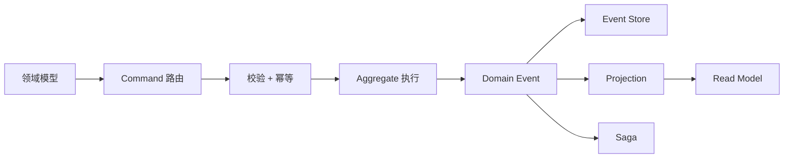

# 传统架构要写一堆胶水代码，Wow 只让你写领域模型


## 模型即服务，正在改变业务系统的开发方式

开发一个订单功能，传统架构通常需要：

```text
Controller
DTO
Service
Repository
SQL
Transaction
Event Listener
Retry
Compensation
Integration Test
```

真正的业务规则可能只有几十行，但外围代码却会不断增加。

开发者还要额外解决：

- 接口参数如何转换？
- 命令如何路由到业务对象？
- 数据如何持久化？
- 状态变化如何通知其他服务？
- 失败后如何重试和补偿？
- 读模型什么时候更新？
- API 文档如何维护？
- 测试如何覆盖状态分支？

Wow 的思路完全不同：

> 不再从 Controller 开始写业务，而是从领域模型开始交付服务。

## 一、传统架构交付接口，Wow 交付模型

传统架构的业务入口通常是 Controller：

```java
@PostMapping("/cart/items")
public void addItem(@RequestBody AddItemRequest request) {
    cartService.addItem(
        request.getCartId(),
        request.getProductId(),
        request.getQuantity()
    );
}
```

接下来还要继续编写 Service、Repository、SQL、DTO 和异常处理。

在 Wow 中，开发者直接定义聚合根和命令处理逻辑：

```kotlin
@AggregateRoot
@AggregateRoute(owner = AggregateRoute.Owner.AGGREGATE_ID)
class Cart(private val state: CartState) {

    @OnCommand(returns = [CartItemAdded::class, CartQuantityChanged::class])
    fun onCommand(command: AddCartItem): Any {
        // 只关注购物车的业务规则
        return CartItemAdded(...)
    }
}
```

这个领域模型不是普通的 Kotlin 类，它同时参与：

- 命令路由
- 聚合处理
- 领域事件生成
- API 元数据生成
- OpenAPI 接口生成
- 事件存储
- 状态恢复
- 投影和 Saga 传播

开发者写的是业务模型，Wow 负责把模型接入运行时。

这就是“模型即服务”。

## 二、少写胶水代码，开发成本自然下降

| 能力 | 传统架构 | Wow |
|---|---|---|
| 接口入口 | 手写 Controller | 由领域模型和元数据驱动 |
| 参数转换 | DTO、Mapper、手工绑定 | 命令模型直接参与处理 |
| 业务分发 | Service 手工判断 | 命令自动路由到聚合 |
| 持久化 | 手写 Repository 和 SQL | 事件存储由框架接管 |
| 状态恢复 | 查询当前表记录 | 快照 + 事件回放 |
| 读模型 | 手工同步和刷新 | Projection 处理事件 |
| 跨服务协作 | Service 中嵌套调用 | Saga 基于事件编排 |
| 最终一致性 | `sleep`、轮询、重试 | `SENT`、`PROCESSED`、`PROJECTED` 等阶段 |
| 领域测试 | 大量集成测试准备 | `AggregateSpec` / `SagaSpec` DSL |

传统架构把基础设施能力分散在每个业务服务里。

Wow 把这些能力沉淀到框架中，让业务代码只保留最有价值的部分：

```text
业务规则
状态转换
领域事件
跨聚合协作
```

## 三、一个模型，自动连接完整业务链路



开发者不需要为每一层重复编写大量适配代码。

例如，命令网关已经承担命令幂等检查和参数校验；事件溯源仓储负责从快照和事件流恢复聚合；命令阶段则明确区分命令被接收、聚合处理完成、读模型更新完成等状态。

这意味着：

```text
模型变化
   ↓
命令处理变化
   ↓
领域事件变化
   ↓
投影、Saga、审计自动进入同一条链路
```

而不是修改一个业务字段后，再手动维护多个外围模块。

## 四、业务越复杂，Wow 的优势越明显

简单 CRUD 业务使用传统架构完全没有问题。

但当业务出现以下情况时，传统架构的开发成本会快速上升：

- 订单存在多个状态和非法转换
- 支付可能重复或超额
- 库存、购物车、订单需要协作
- 业务操作需要审计
- 需要恢复历史状态
- 读写模型存在异步延迟
- 失败后需要自动补偿
- 规则经常变化

在 Wow 中，复杂业务被拆成清晰的模型和事件：

```text
OrderCreated
    ↓
CartSaga
    ↓
RemoveCartItem
```

跨服务流程不再隐藏在 Service 的条件分支里，而是成为可以单独测试的业务规则。

## 五、测试成本也被压缩了

传统架构测试一个订单流程，通常要启动 Spring、准备数据库、构造请求、执行多个接口，最后再查询数据库断言。

Wow 可以直接测试聚合行为：

```kotlin
class CartSpec : AggregateSpec<Cart, CartState>({
    on {
        givenOwnerId(ownerId)

        whenCommand(AddCartItem(productId = "productId", quantity = 1)) {
            expectNoError()
            expectEventType(CartItemAdded::class)
            expectState {
                items.assert().hasSize(1)
            }
        }
    }
})
```

测试表达的是业务语言：

```text
Given：购物车属于某个用户
When：加入一个商品
Expect：产生 CartItemAdded
Expect：购物车包含一个商品
```

删除、恢复、重复支付、非法状态转换，都可以从同一个场景继续分支。

这不仅减少了测试代码，也降低了业务规则遗漏的概率。

## 六、低开发成本，不等于低质量

Wow 降低的不是业务复杂度，而是重复建设成本。

开发者仍然需要认真设计：

- 聚合边界
- 命令和事件
- 事件版本兼容
- 投影模型
- Saga 协作关系
- 最终一致性策略

但这些设计一旦完成，就不需要每个服务重新手写一套 Controller、事务、事件通知、重试和测试基础设施。

Wow 的价值可以概括为：

```text
一次建模
多处复用

一个领域模型
连接命令、事件、存储、查询和协作

少写基础设施
多写业务规则
```

## 结语：从“写接口”转向“交付领域模型”

传统架构的基本单位是接口：

```text
一个接口
一套 Controller
一套 Service
一套 Repository
一套测试
```

Wow 的基本单位是领域模型：

```text
一个聚合
一组命令
一组事件
一套可回放的业务状态
```

传统架构让团队不断重复搭建业务外围设施。

Wow 则把这些通用能力沉淀到框架中，让开发者专注于真正决定产品价值的部分：

> 业务规则，而不是胶水代码。

当系统从简单 CRUD 走向订单、库存、支付、履约和复杂协作时，Wow 的“模型即服务”不仅是一种架构理念，更是一种降低长期开发成本的工程方法。

## 项目依据

- [README.zh-CN.md](../../README.zh-CN.md)
- [Cart.kt](../../example/example-domain/src/main/kotlin/me/ahoo/wow/example/domain/cart/Cart.kt)
- [DefaultCommandGateway.kt](../../wow-core/src/main/kotlin/me/ahoo/wow/command/DefaultCommandGateway.kt)
- [EventSourcingStateAggregateRepository.kt](../../wow-core/src/main/kotlin/me/ahoo/wow/eventsourcing/EventSourcingStateAggregateRepository.kt)
- [CartSpec.kt](../../example/example-domain/src/test/kotlin/me/ahoo/wow/example/domain/cart/CartSpec.kt)
- [CartSagaSpec.kt](../../example/example-domain/src/test/kotlin/me/ahoo/wow/example/domain/cart/CartSagaSpec.kt)
