# 领域模型、命令、事件与协作文档图表 Implementation Plan

> **For agentic workers:** REQUIRED SUB-SKILL: Use superpowers:subagent-driven-development (recommended) or superpowers:executing-plans to implement this plan task-by-task. Steps use checkbox (`- [ ]`) syntax for tracking.

**Goal:** 为中英文“领域模型、命令、事件与协作”20 个页面建立每页一张、职责唯一的 Mermaid 主图，并保证技术事实、双语结构和桌面/窄屏可读性。

**Architecture:** 直接在现有 Markdown 中维护 Mermaid，不增加资产、组件或生成器。按领域区域分批补齐 14 张缺失图，重构快照和事件分发两张现有图；其余 4 张已验证图保持不动。每批都先用覆盖率检查证明缺图，再增加最小图、构建 VitePress 并做代表页视觉检查。

**Tech Stack:** VitePress 1.6.4、vitepress-plugin-mermaid、Markdown、Mermaid、pnpm、本地浏览器视觉检查。

**Spec:** [`document/design/2026-08-28-domain-command-event-diagrams-design.md`](./2026-08-28-domain-command-event-diagrams-design.md)

## Global Constraints

- 最终中英文每个 `domain`、`command`、`event` 页面恰好包含 1 个 `mermaid` fenced block。
- 中文是事实基线；英文使用完全相同的图型、方向、节点 ID、边、条件和 `subgraph`，只本地化显示标签。
- 一张图只回答一个核心问题；普通图不超过 8 个节点，运行时图不超过 12 个节点或参与者。
- 图前保留一句阅读目的；正文继续拥有精确保证、例外、错误边界、表格和代码。
- 不依赖颜色、线宽或空间位置作为唯一语义；不增加 Mermaid 样式类或主题配置。
- 不修改 `guide/query`、`guide/query/**`、`projection`、`data-access`、sidebar、主题、图片目录、依赖、构建配置、源码、API、Schema、CI/CD 或发布行为。
- 不新增 SVG、PNG、图标、脚本、生成器、共享 include、宏或文档组件。
- 不改变页面 URL、frontmatter、章节职责或已经审查通过的运行时承诺。
- 只暂存当前任务列出的文件；不得提交 `node_modules`、构建输出、浏览器截图或本地状态。

---

### Task 1: 补齐领域模型图表

**Files:**
- Modify: `documentation/docs/zh/guide/domain/index.md`
- Modify: `documentation/docs/en/guide/domain/index.md`
- Modify: `documentation/docs/zh/guide/domain/aggregate.md`
- Modify: `documentation/docs/en/guide/domain/aggregate.md`
- Modify: `documentation/docs/zh/guide/domain/event-evolution.md`
- Modify: `documentation/docs/en/guide/domain/event-evolution.md`
- Modify: `documentation/docs/zh/guide/domain/snapshot.md`
- Modify: `documentation/docs/en/guide/domain/snapshot.md`
- Modify: `documentation/docs/zh/guide/domain/lifecycle.md`
- Modify: `documentation/docs/en/guide/domain/lifecycle.md`
- Read only: `documentation/docs/{zh,en}/guide/domain/event-sourcing.md`

**Interfaces:**
- Consumes: 已批准的领域模型六页职责，以及现有 `event-sourcing` 恢复主图。
- Produces: 双语领域模型 6/6 页面每页一张主图；`snapshot` 图不再复制 `event-sourcing` 的恢复主流程。

- [ ] **Step 1: 运行领域图覆盖契约并确认失败**

```bash
for locale in zh en; do
  for page in index aggregate event-sourcing event-evolution snapshot lifecycle; do
    test "$(rg -c '^```mermaid$' "documentation/docs/$locale/guide/domain/$page.md" || true)" = 1
  done
done
```

Expected: exit `1`，因为 `index`、`aggregate`、`event-evolution`、`lifecycle` 尚无 Mermaid 图。

- [ ] **Step 2: 在双语 `domain/index` 增加能力地图**

放在 lead 段落之后、第一个 `##` 之前。中文使用：

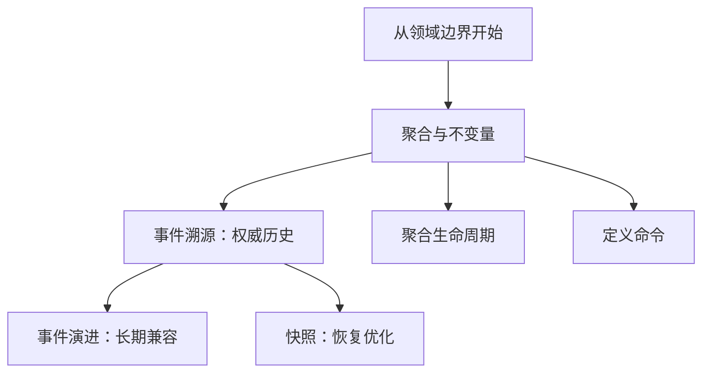

英文保持相同结构，精确标签为：

```text
Start="Start with the domain boundary"
Aggregate="Aggregate and invariants"
History="Event sourcing: authoritative history"
Evolution="Event evolution: long-term compatibility"
Snapshot="Snapshots: recovery optimization"
Lifecycle="Aggregate lifecycle"
Command="Define commands"
```

图前说明句：

```text
下面的能力地图展示领域模型各页怎样从聚合边界展开。
The capability map below shows how the domain-model pages grow from the aggregate boundary.
```

- [ ] **Step 3: 在双语 `domain/aggregate` 增加聚合边界图**

放在 lead 段落之后、第一个 `##` 之前。中文使用：

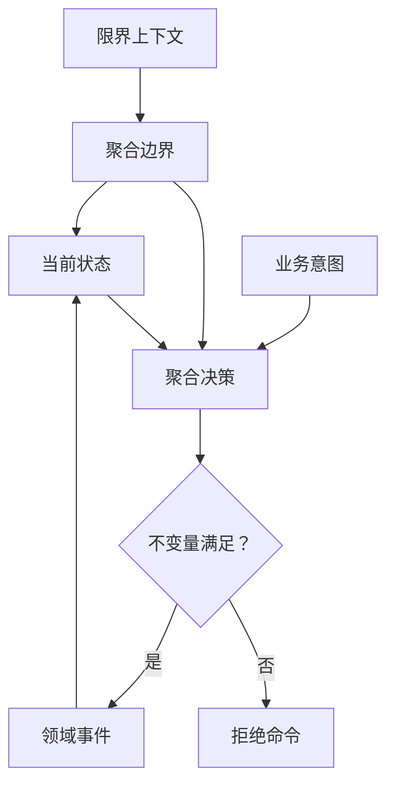

英文标签：

```text
Context="Bounded context"
Aggregate="Aggregate boundary"
Intent="Business intent"
Decision="Aggregate decision"
State="Current state"
Invariant="Invariants satisfied?"
yes edge="Yes"
Event="Domain event"
no edge="No"
Reject="Reject command"
```

图前说明句：

```text
聚合把状态、业务决策和不变量封装在同一个一致性边界中。
An aggregate encloses state, business decisions, and invariants within one consistency boundary.
```

- [ ] **Step 4: 在双语 `domain/event-evolution` 增加升级链图**

放在 lead 段落之后、第一个 `##` 之前。中文使用：

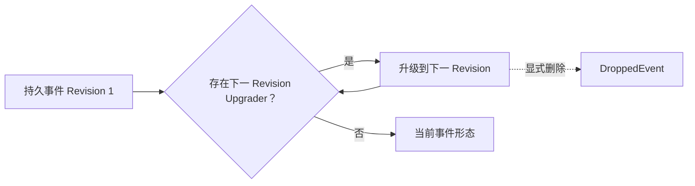

英文标签：

```text
Persisted="Persisted event Revision 1"
Lookup="Next Revision Upgrader exists?"
yes edge="Yes"
Upgrade="Upgrade to the next Revision"
no edge="No"
Current="Current event shape"
dotted edge="Explicitly drop"
Dropped="DroppedEvent"
```

图前说明句：

```text
读取历史事件时，Upgrader 按 Revision 逐步推进，直到得到当前形态或显式丢弃事件。
When historical events are read, Upgraders advance Revision by Revision until the current shape or an explicit drop is reached.
```

- [ ] **Step 5: 重做双语 `domain/snapshot` 主图**

替换现有 Mermaid block，不增加第二张图。中文使用：

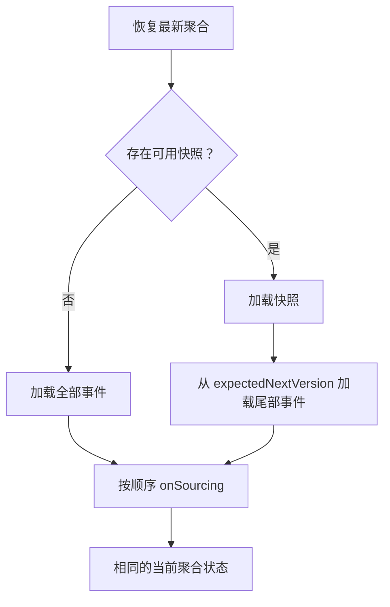

英文标签：

```text
Target="Restore the latest aggregate"
Choice="Usable snapshot exists?"
no edge="No"
All="Load all events"
yes edge="Yes"
Snapshot="Load snapshot"
Tail="Load tail events from expectedNextVersion"
Source="Apply onSourcing in order"
Ready="Same current aggregate state"
```

保留现有图前后的正文，不把 `SNAPSHOT` 等同于一定写入新快照。

- [ ] **Step 6: 在双语 `domain/lifecycle` 增加生命周期状态图**

放在 lead 段落之后、第一个 `##` 之前。中文使用：

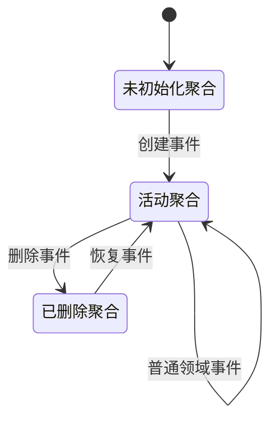

英文标签与边标签：

```text
Empty="Uninitialized aggregate"
Active="Active aggregate"
Deleted="Deleted aggregate"
Empty -> Active="Creation event"
Active -> Active="Regular domain event"
Active -> Deleted="Deletion event"
Deleted -> Active="Recovery event"
```

图前说明句：

```text
生命周期由事件驱动；删除和恢复仍然是聚合状态演进的一部分。
Events drive the lifecycle; deletion and recovery remain part of aggregate state evolution.
```

- [ ] **Step 7: 验证领域图并做代表页视觉检查**

```bash
for locale in zh en; do
  for page in index aggregate event-sourcing event-evolution snapshot lifecycle; do
    test "$(rg -c '^```mermaid$' "documentation/docs/$locale/guide/domain/$page.md")" = 1
  done
done
pnpm --dir documentation docs:build
git diff --check
```

启动本地文档站：

```bash
pnpm --dir documentation docs:dev --host 127.0.0.1
```

Expected: VitePress 输出本地访问地址并保持运行。使用浏览器分别检查：

```text
/guide/domain/lifecycle
/zh/guide/domain/lifecycle
/guide/domain/snapshot
/zh/guide/domain/snapshot
```

每页检查桌面宽度约 1440px 和窄屏约 390px：标签不能截断，状态和两条恢复路径必须无需依赖颜色即可理解。若过宽，只缩短标签或把方向改为 `TB`，不得删除关键状态/分支。

- [ ] **Step 8: 提交领域图表**

```bash
git add -- documentation/docs/{zh,en}/guide/domain/{index,aggregate,event-evolution,snapshot,lifecycle}.md
git diff --cached --check
git commit -m "docs: add domain model diagrams"
```

---
### Task 2: 补齐命令应用页图表

**Files:**
- Modify: `documentation/docs/zh/guide/command/index.md`
- Modify: `documentation/docs/en/guide/command/index.md`
- Modify: `documentation/docs/zh/guide/command/definition.md`
- Modify: `documentation/docs/en/guide/command/definition.md`
- Modify: `documentation/docs/zh/guide/command/sending.md`
- Modify: `documentation/docs/en/guide/command/sending.md`
- Modify: `documentation/docs/zh/guide/command/api-client.md`
- Modify: `documentation/docs/en/guide/command/api-client.md`
- Modify: `documentation/docs/zh/guide/command/reliability.md`
- Modify: `documentation/docs/en/guide/command/reliability.md`
- Read only: `documentation/docs/{zh,en}/guide/command/completion.md`
- Read: `wow-apiclient/src/main/kotlin/me/ahoo/wow/apiclient/command/`

**Interfaces:**
- Consumes: 已有命令页面职责、API Client 当前能力边界和现有 completion 阶段分支图。
- Produces: 命令应用层 6 页均有且仅有一张图；概览、定义、发送、远程客户端、完成和可靠性各自表达不同问题。

- [ ] **Step 1: 运行命令应用图覆盖契约并确认失败**

```bash
for locale in zh en; do
  for page in index definition sending api-client completion reliability; do
    test "$(rg -c '^```mermaid$' "documentation/docs/$locale/guide/command/$page.md" || true)" = 1
  done
done
```

Expected: exit `1`，因为除 `completion` 外其余五页尚无图。

- [ ] **Step 2: 在双语 `command/index` 增加生命周期导航图**

放在 lead 段落之后、第一个 `##` 之前。中文使用：

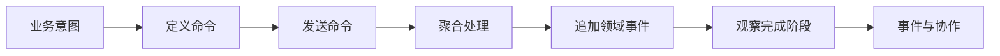

英文标签：

```text
Intent="Business intent"
Definition="Define command"
Send="Send command"
Process="Process in aggregate"
Append="Append domain events"
Completion="Observe completion stages"
Collaboration="Events and collaboration"
```

图前说明句：

```text
命令从业务意图开始，以持久事实和可观察的完成信号连接下游协作。
A command starts as business intent and connects to downstream collaboration through durable facts and observable completion signals.
```

- [ ] **Step 3: 在双语 `command/definition` 增加处理结果边界图**

放在 lead 段落之后、第一个 `##` 之前。中文使用：

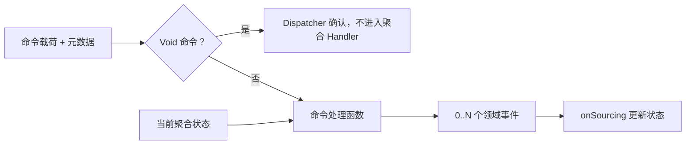

英文标签：

```text
Command="Command payload + metadata"
Void="Void command?"
yes edge="Yes"
Ack="Dispatcher acknowledges without aggregate Handler"
no edge="No"
Handler="Command handler"
State="Current aggregate state"
Events="0..N domain events"
Sourcing="onSourcing updates state"
```

图前说明句：

```text
普通命令由聚合 Handler 根据当前状态产生事件；Void 命令在 Dispatcher 层直接确认。
Regular commands let an aggregate Handler produce events from current state; Void commands are acknowledged at the Dispatcher layer.
```

- [ ] **Step 4: 在双语 `command/sending` 增加入口选择图**

放在 lead 段落之后、第一个 `##` 之前。中文使用：

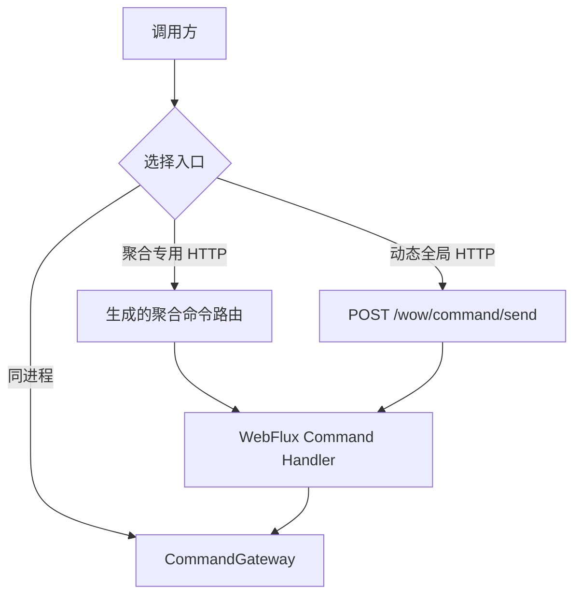

英文标签：

```text
Caller="Caller"
Entry="Choose an entry point"
same-process edge="Same process"
Gateway="CommandGateway"
aggregate HTTP edge="Aggregate-specific HTTP"
AggregateRoute="Generated aggregate command route"
global HTTP edge="Dynamic global HTTP"
Facade="POST /wow/command/send"
WebFlux="WebFlux Command Handler"
```

图前说明句：

```text
三种入口最终进入同一 CommandGateway，但路由发现、协议能力和响应形式不同。
All three entry points reach the same CommandGateway, but route discovery, protocol capabilities, and response forms differ.
```

- [ ] **Step 5: 在双语 `command/api-client` 增加远程调用时序图**

放在 lead 段落之后、第一个 `##` 之前。中文使用：

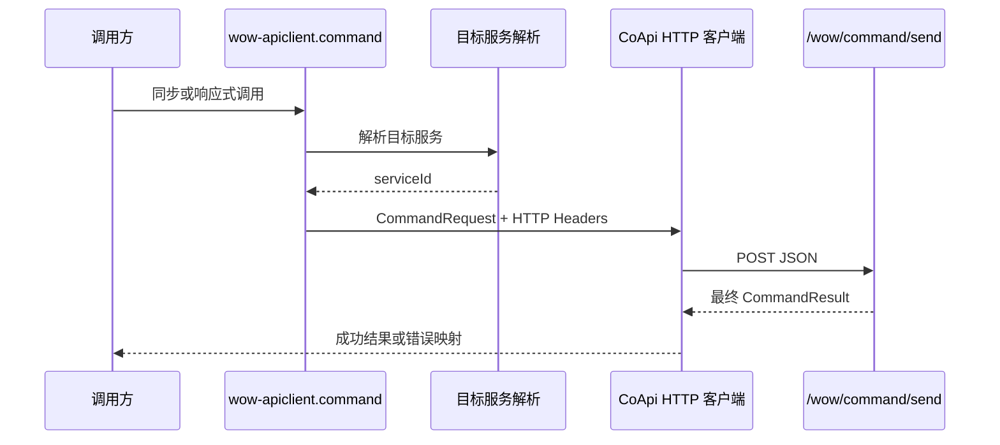

英文参与者标签和消息：

```text
App="Caller"
Client="wow-apiclient.command"
Resolver="Target service resolution"
CoApi="CoApi HTTP client"
Server="/wow/command/send"
App -> Client="Synchronous or reactive call"
Client -> Resolver="Resolve target service"
Resolver -> Client="serviceId"
Client -> CoApi="CommandRequest + HTTP Headers"
CoApi -> Server="POST JSON"
Server -> CoApi="Final CommandResult"
CoApi -> App="Successful result or mapped error"
```

图前说明句：

```text
API Client 是全局 JSON 门面的远程最终结果客户端，不是本地 Gateway 或 SSE 的等价实现。
The API Client is a remote final-result client for the global JSON facade, not an equivalent of the local Gateway or SSE.
```

- [ ] **Step 6: 在双语 `command/reliability` 增加未知结果决策树**

放在 lead 段落之后、第一个 `##` 之前。中文使用：

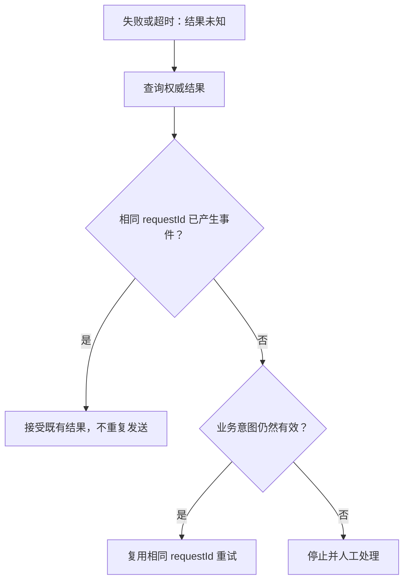

英文标签：

```text
Unknown="Failure or timeout: outcome unknown"
Check="Query the authoritative result"
Exists="Events already exist for this requestId?"
yes edge="Yes"
Keep="Accept the existing result; do not resend"
no edge="No"
Valid="Business intent still valid?"
Retry="Retry with the same requestId"
Stop="Stop and handle manually"
```

图前说明句：

```text
未知结果不能直接重发；先确认权威历史，再决定是否复用稳定 requestId 重试。
Do not resend an unknown outcome immediately; confirm authoritative history before retrying with the stable requestId.
```

- [ ] **Step 7: 验证命令应用图并做代表页视觉检查**

```bash
for locale in zh en; do
  for page in index definition sending api-client completion reliability; do
    test "$(rg -c '^```mermaid$' "documentation/docs/$locale/guide/command/$page.md")" = 1
  done
done
pnpm --dir documentation docs:build
git diff --check
```

启动本地文档站并预览以下页面的桌面与窄屏：

```bash
pnpm --dir documentation docs:dev --host 127.0.0.1
```

Expected: VitePress 输出本地访问地址并保持运行。

```text
/guide/command/api-client
/zh/guide/command/api-client
/guide/command/reliability
/zh/guide/command/reliability
```

时序图参与者和长消息不能截断；决策树的 Yes/No 分支必须无需依赖颜色即可区分。

- [ ] **Step 8: 提交命令应用图表**

```bash
git add -- documentation/docs/{zh,en}/guide/command/{index,definition,sending,api-client,reliability}.md
git diff --cached --check
git commit -m "docs: add command guide diagrams"
```

---

### Task 3: 补齐命令运行时图表

**Files:**
- Modify: `documentation/docs/zh/guide/command/internals/wait-runtime.md`
- Modify: `documentation/docs/en/guide/command/internals/wait-runtime.md`
- Modify: `documentation/docs/zh/guide/command/internals/transport.md`
- Modify: `documentation/docs/en/guide/command/internals/transport.md`
- Read only: `documentation/docs/{zh,en}/guide/command/internals/pipeline.md`
- Read only: `documentation/docs/{zh,en}/guide/command/completion.md`
- Read: `wow-core/src/main/kotlin/me/ahoo/wow/command/wait/`
- Read: `wow-core/src/main/kotlin/me/ahoo/wow/messaging/`
- Read: `wow-kafka/src/main/kotlin/`
- Read: `wow-redis/src/main/kotlin/`

**Interfaces:**
- Consumes: 已有 completion 阶段图和 pipeline 组件图；当前 WaitState、Notifier 与 transport 实现。
- Produces: 命令 9/9 页面每页一张图；等待信号闭环和 transport `SENT` 证据边界互不重复。

- [ ] **Step 1: 运行完整命令区图覆盖契约并确认失败**

```bash
for locale in zh en; do
  for file in $(cd "documentation/docs/$locale/guide" && rg --files command | sort); do
    test "$(rg -c '^```mermaid$' "documentation/docs/$locale/guide/$file" || true)" = 1
  done
done
```

Expected: exit `1`，因为 `wait-runtime` 与 `transport` 尚无图。

- [ ] **Step 2: 在双语 `wait-runtime` 增加信号闭环时序图**

放在 lead 段落之后、第一个 `##` 之前。中文使用：

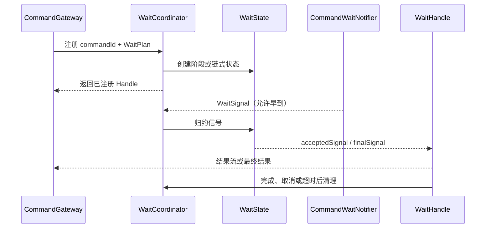

英文参与者标签和消息：

```text
Gateway="CommandGateway"
Coordinator="WaitCoordinator"
State="WaitState"
Notifier="CommandWaitNotifier"
Handle="WaitHandle"
Gateway -> Coordinator="Register commandId + WaitPlan"
Coordinator -> State="Create stage or chain state"
Coordinator -> Gateway="Return registered Handle"
Notifier -> Coordinator="WaitSignal (may arrive early)"
Coordinator -> State="Reduce signal"
State -> Handle="acceptedSignal / finalSignal"
Handle -> Gateway="Result stream or final result"
Handle -> Coordinator="Clean up after completion, cancellation, or timeout"
```

图前说明句：

```text
等待运行时先注册 Handle，再通过 Coordinator 把乱序 WaitSignal 归约到阶段或链式状态。
The wait runtime registers a Handle first, then uses the Coordinator to reduce out-of-order WaitSignals into stage or chain state.
```

- [ ] **Step 3: 在双语 `transport` 增加 SENT 证据对照图**

放在 lead 段落之后、第一个 `##` 之前。中文使用：

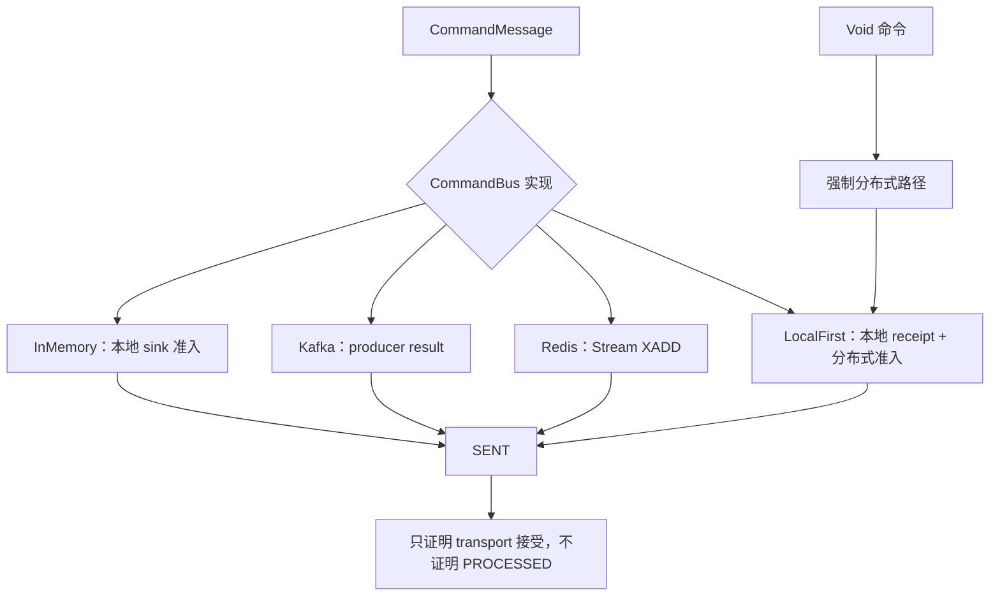

英文标签：

```text
Command="CommandMessage"
Transport="CommandBus implementation"
InMemory="InMemory: local sink admission"
Kafka="Kafka: producer result"
Redis="Redis: Stream XADD"
LocalFirst="LocalFirst: local receipt + distributed admission"
Void="Void command"
Distributed="Force distributed path"
Sent="SENT"
Boundary="Proves transport acceptance, not PROCESSED"
```

图前说明句：

```text
不同传输对 SENT 的证据锚点不同，但都不代表命令已经完成处理。
Each transport anchors SENT to different evidence, but none means the command has finished processing.
```

- [ ] **Step 4: 验证完整命令区并做密集图视觉检查**

```bash
for locale in zh en; do
  test "$(cd "documentation/docs/$locale/guide" && rg --files command | wc -l | tr -d ' ')" = 9
  for file in $(cd "documentation/docs/$locale/guide" && rg --files command | sort); do
    test "$(rg -c '^```mermaid$' "documentation/docs/$locale/guide/$file")" = 1
  done
done
pnpm --dir documentation docs:build
git diff --check
```

启动本地文档站：

```bash
pnpm --dir documentation docs:dev --host 127.0.0.1
```

Expected: VitePress 输出本地访问地址并保持运行。本地预览：

```text
/guide/command/internals/wait-runtime
/zh/guide/command/internals/wait-runtime
/guide/command/internals/transport
/zh/guide/command/internals/transport
```

检查 390px 窄屏下参与者标签与 transport 边界节点；不得通过删除 `Void` 或 `not PROCESSED` 边界来换取更短图。

- [ ] **Step 5: 提交命令运行时图表**

```bash
git add -- documentation/docs/{zh,en}/guide/command/internals/{wait-runtime,transport}.md
git diff --cached --check
git commit -m "docs: add command runtime diagrams"
```

---

### Task 4: 补齐事件与协作图表并完成全局验收

**Files:**
- Modify: `documentation/docs/zh/guide/event/index.md`
- Modify: `documentation/docs/en/guide/event/index.md`
- Modify: `documentation/docs/zh/guide/event/processor.md`
- Modify: `documentation/docs/en/guide/event/processor.md`
- Modify: `documentation/docs/zh/guide/event/saga.md`
- Modify: `documentation/docs/en/guide/event/saga.md`
- Modify: `documentation/docs/zh/guide/event/dispatch.md`
- Modify: `documentation/docs/en/guide/event/dispatch.md`
- Read only: `documentation/docs/{zh,en}/guide/event/compensation.md`
- Read: `wow-core/src/main/kotlin/me/ahoo/wow/event/dispatcher/`
- Read: `wow-core/src/main/kotlin/me/ahoo/wow/saga/stateless/`
- Read: `wow-core/src/main/kotlin/me/ahoo/wow/command/wait/NotifierFilters.kt`
- Read: `compensation/wow-compensation-core/src/main/kotlin/me/ahoo/wow/compensation/core/`

**Interfaces:**
- Consumes: 事件 Processor、Stateless Saga、Dispatcher Filter chain 和已有 Compensation 状态机。
- Produces: 中英文全部 20 个目标页面每页恰好一张图，并通过全局构建、范围和代表页视觉验收。

- [ ] **Step 1: 运行事件区图覆盖契约并确认失败**

```bash
for locale in zh en; do
  for page in index processor saga compensation dispatch; do
    test "$(rg -c '^```mermaid$' "documentation/docs/$locale/guide/event/$page.md" || true)" = 1
  done
done
```

Expected: exit `1`，因为 `index`、`processor`、`saga` 尚无图。

- [ ] **Step 2: 在双语 `event/index` 增加选择流程图**

放在 lead 段落之后、选择矩阵之前。中文使用：

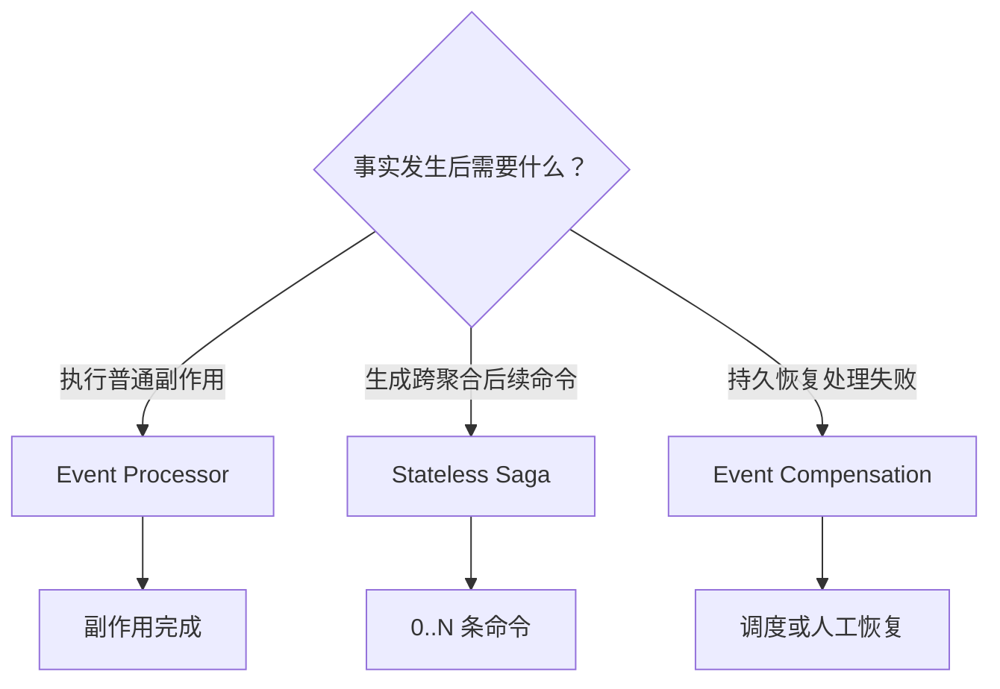

英文标签：

```text
Need="What is needed after the fact occurs?"
processor edge="Run an ordinary side effect"
Processor="Event Processor"
saga edge="Create cross-aggregate follow-up commands"
Saga="Stateless Saga"
compensation edge="Persistently recover handler failure"
Compensation="Event Compensation"
Done="Side effect completed"
Commands="0..N commands"
Recovery="Scheduled or manual recovery"
```

图前说明句：

```text
先按目标选择协作机制，再进入对应页面理解实现和失败边界。
Choose the collaboration mechanism by goal before opening its implementation and failure boundaries.
```

- [ ] **Step 3: 在双语 `event/processor` 增加处理管线图**

放在 lead 段落之后、第一个 `##` 之前。中文使用：

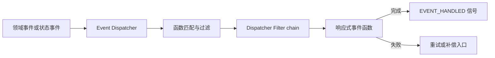

英文标签：

```text
Event="Domain event or state event"
Dispatcher="Event Dispatcher"
Match="Function matching and filtering"
Filters="Dispatcher Filter chain"
Function="Reactive event function"
success edge="Complete"
Signal="EVENT_HANDLED signal"
failure edge="Fail"
Recovery="Retry or compensation entry"
```

图前说明句：

```text
事件处理器只有在匹配函数的响应式工作完成后才产生完成信号；失败进入重试或补偿边界。
An event processor emits completion only after the matched reactive function completes; failures enter retry or compensation boundaries.
```

- [ ] **Step 4: 在双语 `event/saga` 增加跨聚合时序图**

放在 lead 段落之后、第一个 `##` 之前。中文使用：

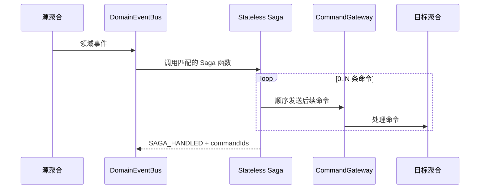

英文参与者标签和消息：

```text
Source="Source aggregate"
EventBus="DomainEventBus"
Saga="Stateless Saga"
Gateway="CommandGateway"
Target="Target aggregate"
Source -> EventBus="Domain event"
EventBus -> Saga="Invoke matching Saga function"
loop="0..N commands"
Saga -> Gateway="Send follow-up command in order"
Gateway -> Target="Process command"
Saga -> EventBus="SAGA_HANDLED + commandIds"
```

图前说明句：

```text
Stateless Saga 把一个已发生的事实转换为 0..N 条顺序发送的后续命令。
A Stateless Saga converts an occurred fact into 0..N follow-up commands sent in order.
```

- [ ] **Step 5: 扩充双语 `event/dispatch` 现有图**

替换现有 Mermaid block，不增加第二张图。中文使用：

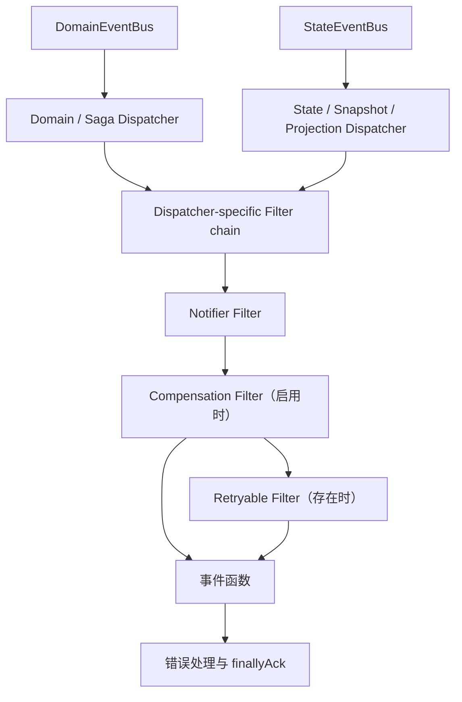

英文标签：

```text
DomainBus="DomainEventBus"
DomainDispatcher="Domain / Saga Dispatcher"
StateBus="StateEventBus"
StateDispatcher="State / Snapshot / Projection Dispatcher"
Chain="Dispatcher-specific Filter chain"
Notifier="Notifier Filter"
Compensation="Compensation Filter (when enabled)"
Retryable="Retryable Filter (when present)"
Function="Event function"
Ack="Error handling and finallyAck"
```

保留图后正文对 Filter 进入/退出方向、失败信号、Snapshot 无即时 Retryable 层和 ACK 边界的精确解释。图中的直接 `Compensation --> Function` 表示某些链没有 Retryable Filter，不表示跳过 Compensation。

- [ ] **Step 6: 运行 20/20 覆盖、双语与范围检查**

```bash
for locale in zh en; do
  test "$(cd "documentation/docs/$locale/guide" && rg --files domain command event | wc -l | tr -d ' ')" = 20
  for file in $(cd "documentation/docs/$locale/guide" && rg --files domain command event | sort); do
    test "$(rg -c '^```mermaid$' "documentation/docs/$locale/guide/$file")" = 1
  done
done
diff \
  <(cd documentation/docs/zh/guide && rg --files domain command event | sort) \
  <(cd documentation/docs/en/guide && rg --files domain command event | sort)
! rg -n 'TO[D]O|TB[D]|^(<<<<<<<|=======|>>>>>>>)' documentation/docs/{zh,en}/guide/{domain,command,event} -g '*.md'
diagram_base=$(git merge-base origin/main HEAD)
test -z "$(git diff --name-only "$diagram_base"..HEAD | rg -v '^(document/design/2026-08-(28-domain-command-event-diagrams-design|29-domain-command-event-diagrams-implementation-plan)\.md|documentation/docs/(zh|en)/guide/(domain|command|event)/)' || true)"
pnpm --dir documentation docs:build
git diff --check
```

Expected: 40 个文件每个恰好 1 个 Mermaid block；query、sidebar、主题、依赖和图片资产不在 diff 中；VitePress 无 Mermaid 解析错误。

- [ ] **Step 7: 做事件图和最终代表页视觉检查**

启动本地文档站：

```bash
pnpm --dir documentation docs:dev --host 127.0.0.1
```

Expected: VitePress 输出本地访问地址并保持运行。本地预览以下中英文页面，桌面约 1440px、窄屏约 390px：

```text
/guide/event/
/zh/guide/event/
/guide/event/dispatch
/zh/guide/event/dispatch
/guide/domain/lifecycle
/zh/guide/domain/lifecycle
/guide/command/api-client
/zh/guide/command/api-client
/guide/command/internals/transport
/zh/guide/command/internals/transport
```

逐页确认：

- 主路径和分支无需依赖颜色即可理解；
- 节点、参与者、边标签不截断；
- 窄屏不因一个超长标签遮挡关键关系；
- event chooser、state diagram、sequence diagram、dense transport/dispatch 五类图均可读；
- 图后正文仍保留错误、失败和阶段边界。

如需调整，只允许缩短显示标签、切换 `LR/TB` 或增加 `subgraph`；不得删除设计规定的节点、参与者或边。

- [ ] **Step 8: 提交事件图和最终验收结果**

```bash
git add -- documentation/docs/{zh,en}/guide/event/{index,processor,saga,dispatch}.md
git diff --cached --check
git commit -m "docs: add event collaboration diagrams"
git status --short
```

Expected: 最终工作树只包含计划/规格提交产生的已跟踪历史，无构建输出、截图或本地临时文件。
