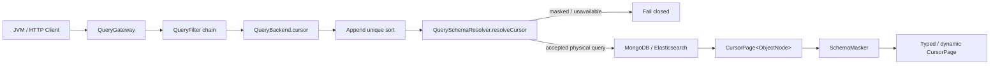

# CursorQuery V9 设计

## 背景

现有 `feat/cursor-query` 基于 V8 `QueryService` 架构实现了 MongoDB keyset 与 Elasticsearch
`search_after` 游标分页，并使用 `wow.query.cursor.encryption-key` 对后端排序值加密。

V9 已将查询主链重构为 `QueryGateway → QueryBackend`，并通过静态 `@Mask` 元数据、
`QuerySchemaResolver` 与 `SchemaMasker` 实现查询字段解析和结果脱敏。本设计在
`agent/static-annotation-mask-v9-main` 的最新远端提交上原生实现 CursorQuery，不移植旧
`QueryService`、旧构造器或加密配置。

## 已确认决策

- 新分支 `feat/cursor-query-v9` 基于 `origin/agent/static-annotation-mask-v9-main`；现有
  `feat/cursor-query` 与 PR #3091 保持不变。
- 保留平行的 `CursorQuery` / `CursorPage` 公共契约、DSL、HTTP、OpenAPI 与 API Client。
- CursorQuery 无状态、只向后翻页、不返回 `total`，也不提供跨请求快照一致性。
- Snapshot 有效排序末尾自动追加 `aggregateId`，EventStream 自动追加 `id`。
- CursorQuery 的全部有效排序字段必须精确解析为已知 SORT binding；masked 排序字段在访问存储前拒绝。
- CursorQuery 获取不到 Query Schema 时 fail-closed，不使用 `COMPATIBLE` fallback。
- 普通 single/list/paged/filter/sort/projection 的 Mask 语义保持不变。
- 删除 `encryption-key`、AES 编解码、Codec 注入及相关配置；token 只做无 padding Base64URL 编码。
- token 是客户端不应解释的后端 continuation 数据，但不是加密或签名数据。
- Cursor 是 V9 Query 的全链路必选能力，不保留 Backend、Gateway、API Client 或 TCK 的 V8 兼容层。

## 目标

- MongoDB 使用 keyset 条件代替深 `skip`，Elasticsearch 使用 `search_after` 代替深 `from`。
- 每页只读取 `size + 1` 条记录判断是否还有下一页，不执行精确 count。
- 防止静态 masked 字段的原始排序值进入 `nextCursor`。
- 每次请求重新应用租户、授权、过滤、Query Schema 校验和结果脱敏。
- 遵循 V9 Gateway/Backend 职责，不保留已废弃架构的兼容桥。

## 非目标

- 不提供 `previousCursor`、随机跳页、`total`、PIT 或跨请求快照一致性。
- 不绑定或签名 filter、sort、租户、用户、过期时间或 Schema 版本。
- 不保证旧 PR #3091 的加密 cursor 与 V9 cursor 互通。
- 不为没有合适复合索引的 MongoDB 查询提供性能保证。
- 不改变普通查询对 masked 字段的 filter、sort 或 projection 规则。

## 公共契约

### CursorQuery

新增 `ICursorQuery` 与不可变 `CursorQuery`：

- `filter`、`projection`、`sort` 与现有 Queryable 语义一致；
- `size` 必须大于 0，并为后端 `size + 1` 预留溢出空间；
- `cursor` 为可空字符串；`null` 表示第一页；
- 用户排序字段不得重复，不得使用 `_score`、`_doc`、`_shard_doc` 等不稳定元数据；
- 用户排序与自动追加唯一键后的有效排序均不得超过 `AggregationQuery.MAX_SORT_FIELDS`。

### CursorPage

新增 `CursorPage<T>(list, nextCursor)`：

- `list` 最多包含 `size` 条结果；
- 多读取的一条 lookahead 记录只用于判断下一页，不进入结果；
- `nextCursor == null` 表示遍历结束；
- cursor 值来自最后一条已返回记录，而不是 lookahead 记录。

### 必选能力

`QueryGateway` 与 `QueryBackend` 的 cursor 方法均为 V9 必须实现的抽象合同，不提供默认
`UnsupportedOperationException`。标准 Snapshot API Client 直接包含 typed、dynamic、state-only cursor 方法，
不再要求调用方额外继承 opt-in cursor 接口。Backend TCK 默认执行 cursor 合同，不提供 capability flag 或整组跳过。

框架内建 NoOp Backend 返回 `CursorPage(emptyList(), null)`；Unavailable Backend 继续返回其既有 unavailable 错误。
MongoDB、Elasticsearch 抽象 Backend 要求子类提供非空唯一排序字段，不再以 nullable 字段作为 unsupported 入口。

## V9 运行链



职责保持为：

- Gateway 执行 QueryFilter chain、错误处理、结果 `SchemaMasker` 与 typed/dynamic 转换；
- 具体 Backend 复用自身 `QueryModelSchemaProvider`，在访问存储前完成逻辑字段到物理字段解析；
- MongoDB/Elasticsearch 抽象 Backend 只负责各自的 continuation 执行与 token 格式；
- HTTP/OpenAPI/API Client 只传递公共 `CursorQuery` / `CursorPage`，不解释 token。

## 静态 Mask 拒绝

### 拒绝范围

V9 现有普通 sort 允许引用 masked 字段，因为最终结果会被 `SchemaMasker` 脱敏；aggregation
会拒绝 masked 引用，避免聚合结果泄露原始值。CursorQuery 采用相同的 fail-closed 原则，但只新增以下限制：

1. 先在逻辑字段层追加 Snapshot `aggregateId` 或 EventStream `id`；
2. 逐个解析有效排序字段的 `QueryCapability.SORT` 绑定；
3. 任一排序字段不是 `EXACT`、不是 `SINGLE`、缺少 SORT binding、其 `QueryFieldSchema.maskRule != null`，
   或其逻辑/物理绑定命中其他 masked 字段的 projection/binding 时，将整个 CursorQuery 判定为
   `QueryCompatibilityLevel.INCOMPATIBLE`；
4. 按 Backend 配置的 validation mode 校验 filter 与 projection 的其他兼容性；
5. CursorQuery 的 Schema 不可用错误直接传播，不允许 `COMPATIBLE` fallback；
6. 全部通过后才允许 Backend 解码 cursor 或访问存储。

filter 值来自调用方，projection 结果会脱敏，二者都不会把后端原始 masked 值写入 cursor，因此不扩大拒绝范围。
普通 single/list/paged 的 sort 行为也不改变。

### 动态字段

若动态子字段继承 masked 祖先的 `maskRule`，`QueryModelSchema.resolve` 返回的派生字段继续携带该规则，
因此 cursor sort 同样拒绝。未知排序字段和缺失 SORT capability 无论 validation mode 如何都拒绝；
Schema 整体不可用也始终阻塞 CursorQuery。

## Token 格式与安全边界

### 编码

- MongoDB 将排序标量列表编码为 BSON bytes，再进行无 padding Base64URL 编码；
- Elasticsearch 将排序标量列表编码为标准 JSON bytes，再进行无 padding Base64URL 编码；
- decode 必须限制字段数量、结构和允许的标量类型；任何 Base64、结构、数量或类型错误统一抛出
  `IllegalArgumentException("Invalid cursor.")`；
- 不新增共享加密抽象、密钥配置、随机 fallback key、签名、key ID 或 key ring。

### 安全保证

- masked 排序值不会进入 token；
- token 篡改只能改变未 masked 排序位置，不能绕过每次请求重新执行的租户、授权和 filter；
- token 不承载授权结论，也不应写入日志；
- 未标记 `@Mask` 的字段不获得保密保证，Base64URL 不能视为加密；
- 无密钥 token 可跨应用重启和同版本多实例使用，但后端格式变化可以使旧 token 失效。

## Backend 行为

### MongoDB

- 使用逻辑有效排序解析后的物理字段构建字典序 keyset filter；
- 每个排序字段按原方向生成比较条件，并以唯一键终结相同前缀；
- 临时补充 projection 中缺失的排序字段，用它们生成 cursor 后再删除；
- 包含型 projection 删除临时嵌套字段后，递归清理仅由 cursor 引入的空父文档；
- 只接受 BSON 可无损往返的标量 cursor 值。

### Elasticsearch

- 使用解析后的 sort 与 `search_after`；
- 请求 `size + 1` 且 `track_total_hits=false`；
- token 数量必须与有效排序字段数一致；
- 拒绝 `_score`、`_doc`、`_shard_doc`，不使用 PIT。

## Gateway、HTTP 与文档

- `QueryType` 只新增一个 `CURSOR`；typed 与 dynamic 共用该类型和过滤链。
- Gateway 对 `CursorPage<ObjectNode>.list` 应用现有 `SchemaMasker`，保留 `nextCursor`，再转换 typed 结果。
- Snapshot 提供 typed、dynamic、state-only cursor；EventStream 提供 typed、dynamic cursor。
- 标准 Snapshot reactive/synchronous API Client 直接发布 cursor 方法，不保留额外 opt-in 接口。
- WebFlux 路由沿用现有查询 guard、body extractor 与错误映射；不新增 SSE cursor。
- OpenAPI、JSON Schema、API Client 和 DSL 暴露与现有 CursorQuery 设计一致的契约。
- 中英文文档明确 masked sort 拒绝、Schema fail-closed、token 非加密，以及不存在
  `wow.query.cursor.encryption-key`。

## 错误合同

| 场景 | 结果 |
| --- | --- |
| masked 字段或其 projection/physical alias 出现在有效排序 | `QuerySchemaValidationException`，存储不被调用 |
| CursorQuery 无法取得 Query Schema | `QuerySchemaUnavailableException`，不 fallback |
| 未知排序字段、非 EXACT/MANY 排序字段或缺失 SORT capability | `QuerySchemaValidationException`，存储不被调用 |
| cursor Base64/结构/数量/类型非法 | `IllegalArgumentException("Invalid cursor.")` / HTTP 400 |
| 无匹配结果 | `CursorPage(emptyList(), null)` |

错误信息不得包含 cursor payload、原始排序值、masked 值或安全上下文。

## 兼容与迁移

- V9 CursorQuery 只基于新 QueryGateway/QueryBackend API，不引入旧 `QueryService` 适配层。
- 自定义 Backend、Gateway、API Client 与 TCK 实现必须迁移到 V9 cursor 合同；不以默认方法、独立 opt-in
  接口或测试 skip 保持 V8 源码兼容。
- 旧 PR #3091 未合并，因此不提供加密 token 的 wire migration 或双格式 decode。
- 删除 `QueryProperties.cursor.encryptionKey`、`CURSOR_ENCRYPTION_KEY` 常量及 Spring Boot codec wiring。
- 不运行或声称 `javap` JVM ABI 验证。

## 测试策略

### 最小 RED→GREEN 回归

- Query Schema：masked/动态 masked/alias/MANY 有效排序拒绝；普通 sort 继续允许；Schema unavailable 不 fallback；
- Gateway：typed/dynamic cursor 结果只 mask 一次，保留 `nextCursor`，错误进入现有 ErrorHandler；
- MongoDB：keyset、唯一键、null/missing、projection 清理、Base64/结构/类型拒绝；
- Elasticsearch：`search_after`、唯一键、`track_total_hits=false`、Base64/arity/type 拒绝；
- HTTP/OpenAPI/API Client/DSL：路由、Schema、序列化与无结果合同；标准 API Client 直接包含 cursor；
- TCK：cursor 用例默认执行，MongoDB/Elasticsearch fixture 显式实现 null/missing 数据准备；
- Spring Boot：不存在 cursor key 配置或 Codec wiring；
- 仓库扫描：生产代码、测试和 `documentation/docs` 均不存在 `encryption-key`、AES cursor 或真实密钥示例；
  本设计文档只保留删除决策记录。

### 验证命令

至少执行：

```bash
./gradlew :wow-api:check :wow-query:check :wow-schema:check
./gradlew :wow-mongo:check :wow-elasticsearch:check
./gradlew :wow-webflux:check :wow-openapi:check :wow-apiclient:check
./gradlew :wow-spring:check :wow-spring-boot-starter:check
git diff --check
```

实现完成后再按最新改动范围决定是否执行集成测试和全仓 `build`；不得以本地模块检查替代 PR CI。

## 验收标准

- CursorQuery 在 V9 QueryGateway/QueryBackend 主链可用于 Snapshot 与 EventStream；
- Cursor 在 Backend、Gateway、标准 API Client 与 TCK 中均为必选合同，不存在 unsupported 默认实现或 opt-in 兼容层；
- MongoDB 不执行 count/skip，Elasticsearch 不执行 total/from；
- masked 有效排序和 Schema unavailable 均在存储访问前失败；
- 普通查询的 masked filter/sort/projection 行为无回归；
- 所有 CursorPage 结果在返回前经过现有 SchemaMasker；
- token 无密钥、无 AES、无签名，非法输入统一失败且不泄露 payload；
- 配置、源码、测试和 `documentation/docs` 不存在 `wow.query.cursor.encryption-key`；
- 现有 `feat/cursor-query` 与 PR #3091 未被改写或合并。
