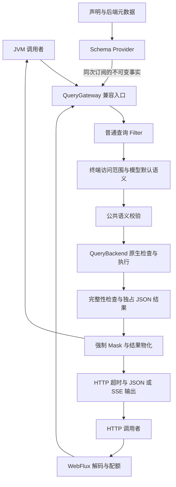

# 查询模块整体架构重构设计

日期：2026-09-08。审查基线：`d82e5175d`，Wow `9.0.10`。

状态：目标架构已在本地生产代码中实现；当前清理范围、验收状态和唯一最新计数见[PR 前深度复核验收](2026-09-08-query-architecture-adversarial-review.md#pr-readiness)。此前整轮重构、F01–F13 修复及配对性能分别保留为历史证据，见[对抗验证报告](2026-09-08-query-architecture-adversarial-review.md)、[性能报告](2026-09-08-query-architecture-performance.md)和[实施计划](2026-09-08-query-architecture-implementation-plan.md)。版本和发布工作流未变更，未提交或发布。

本轮已确认的边界：守护 QueryGateway API 兼容性；具体实现及内部扩展 SPI 不承担兼容义务，可以直接替换和删除。旧 `Condition` 兼容栈按用户约定保留至 10.0.0，不属于本轮待删除的内部实现。目标是提高高内聚、低耦合和可维护性，不能以保留旧内部结构为由留下双轨执行或隐式降级。

设计对象是完整查询子系统：稳定调用入口、逻辑查询表达、模型语义、访问治理、扩展协议、原生执行、结果交付、装配路由和运行生命周期。Schema 是其中的共享数据合同。Schema 优先表示实施时先消除数据合同缺口，不表示架构围绕 Schema 展开，也不表示 Schema 完成就完成了查询模块重构。

## 1. 现实约束与成功标准

查询模块服务 Snapshot 和 EventStream，既有单值、流、分页、游标和聚合，也有模型推断、动态字段、不同存储表示、字段保护和 HTTP 输出。它不是一个数据库无关的字符串转译器。

整体成功标准有五项：

1. 调用者继续使用兼容的 QueryGateway API；合法请求保持返回形状和明确语义。
2. 每次订阅的授权、准备、执行、结果处理和终止形成同一条冷执行链；取消、错误和重试边界可解释。
3. 公共语义只实现一次，后端差异留在原生模块；HTTP 不侵入 JVM 调用路径。
4. 数据定义、操作许可和执行机制分别由明确的所有者维护；扩展遵守协议，不能靠任意 Filter 顺序保证强制治理。
5. 后端或传输规则的变化局限在对应组件；旧实现退出，有正反例和真实执行证据支撑维护。

需要承认三项事实：

1. 模型声明、数据库元数据和实际数据并不总能同时提供完整证明。MongoDB 可以没有 validator；ES 的 source、索引字段、runtime 字段并不重合。模型声明是受信应用的数据合同，不能一律当作未经验证而禁用，也不能伪称为原生观测结果。
2. 构造 BSON/ES 请求不等于语义正确。当前 Mongo 混合类型游标生成合法 BSON 却漏行；投影组合可成功构造、再被服务端拒绝。
3. Schema 发布不是数据库事务。即便一次请求固定一个 Schema，外部映射、数据、权限和资源状态仍可能变化。运行时错误必须继续处理，不能为了保证“准入成功”而吞掉错误。

本设计的保证为：**受管 Gateway 每次订阅在首次执行性 I/O 前，完成本次逻辑查询及其 Schema 所能支持的公共语义检查和原生静态检查；没有证明依据的必要能力明确拒绝，不静默改变请求含义。**执行性 I/O 包括打开 PIT、查 count、find/search、aggregate。加载 Schema 的元数据 I/O 属于准备过程，并受请求等待超时约束。

此保证以受信声明及已知编码持续成立为前提，不包括：预先扫描全部数据、锁定数据库元数据、替代数据库解析器、预先执行 Painless、为任意自定义序列化或存储扩展证明正确性。元数据中的 validator 是存储声明，不是已检查全部历史数据的证明。服务端拒绝、已观测且合同要求拒绝的数据违约、脚本运行失败和部分分片失败仍是执行错误。未返回的数据可能违反声明，框架不保证发现它；依据数值声明授予 Mongo 游标能力时，未观测的跨类型数据仍可能造成漏行。这不属于数据合同成立时的无漏行保证。这里的原生编译指“执行框架负责的静态检查并构造请求”，不是声称在本地完成 ES 服务端编译。

## 2. 架构选择与职责

| 选择 | 结论 |
|---|---|
| Schema 包揽所有规则，Backend 只发送请求 | 拒绝；需要把原生限制和服务端行为不断复制到公共层 |
| Backend 包揽公共语义与执行 | 拒绝；访问范围、脱敏准入、路径解释会分散到后端 |
| Schema 提供依据，Gateway 公共准入，Backend 原生检查与执行 | 采用；用三个已有职责完成完整流程 |



图中的节点表示流程职责，不要求新增同名服务或接口。Gateway 负责组合顺序；它不内联所有校验、授权、脱敏和序列化算法。


| 所有者 | 输入 | 输出及责任 |
|---|---|---|
| Source / 声明合并 | 类型生成、显式字段声明、部署配置 | 一份确定的逻辑定义；不接触查询实例或原生执行 |
| Backend Schema Adapter | 逻辑定义、实际后端元数据 | 有依据的原生能力、物理绑定及后续编译确需的事实；不按 Mask 或用户身份裁剪能力 |
| Schema Provider | 声明源、配对 Adapter | 验证声明和绑定一致性、构建只读结构索引、原子发布完整事实快照；不作操作许可判断 |
| QueryGateway | 逻辑 Query、Schema、调用上下文 | 访问范围、默认语义、公共校验、拦截、强制 Mask、typed 物化 |
| QueryBackend | 最终逻辑 Query、对应 Schema | 原生约束、请求编译、执行、资源清理、标准 JSON 与完整性错误 |
| WebFlux | HTTP 请求、Gateway Publisher | 严格解码、HTTP 配额、等待/闲置超时、JSON/SSE 输出和错误映射；Schema handler 调用公共元数据构造函数展示有效能力 |

Source、Adapter 和字段索引属于已有职责内部的扩展点。没有新的 Preparer、PreparedQuery、通用执行计划或通用规则引擎。

### 2.0 子系统边界与内部组织

| 架构单元 | 高内聚的职责 | 协作边界 |
|---|---|---|
| API / DSL | 表达逻辑查询、六种操作和结果容器；十个 Gateway 方法区分 typed/dynamic | DSL 仅构造 Query，不加载 Schema、授权或执行 I/O；生成助手遵守同一逻辑路径合同 |
| Gateway 运行时 | 建立每次订阅、固定调用上下文、组合必经步骤、选择结果形态 | 复用 mono/flux 生命周期；按方法明确调用六个 Backend 操作，不在属性袋中动态分派结果 |
| 模型专属语义 | Snapshot 删除范围/状态结果；EventStream payload/bodyType 和事件物化 | 沿用两个模型的装配与专属函数；共享执行链，不把模型差异复制到 Mongo/ES |
| 公共查询语义 | 字段、作用域、操作、组合约束及静态保护准入 | 按 filter/projection/sort/cursor/aggregation 分解已有内部函数；不形成六套重复校验器 |
| 请求治理与扩展 | 不可移除的调用范围、当前授权；普通请求变换与终止观察 | 强制步骤由 Gateway 固定；Filter 是受信协议扩展，不是权限总线 |
| Schema 供给 | 声明合并、原生绑定、完整快照发布和只读事实查找 | 不消费 Query，不判断用户许可，不执行 Mask；原生能力与许可派生视图分开 |
| Backend 执行 | 按操作原生编译、执行、分页状态、值转换和资源释放 | 接受逻辑 Query 与配对 Schema，返回标准 JSON；不依赖 HTTP 或重复授权 |
| 交付与集成 | typed/dynamic 交付；HTTP 传输策略；Spring 装配及生成消费者 | 查询语义由 Gateway 统一；HTTP 限额不变成进程内调用的隐式限制 |

Gateway 保持薄编排：复杂性分别留在已有 query/schema/filter/mask/snapshot/event 代码职责中，按职责调整包内归属，不把所有逻辑搬入 AbstractQueryGateway。复用有行为意义的纯函数；只有已有替换需求的 Source、Adapter、Backend、Filter 保留扩展接口，不为每个执行步骤新增接口。

装配继续使用现有 Snapshot/EventStream BackendFactory 与 RoutingFactory：按聚合选择工厂，工厂返回成对 Backend/Provider。应用注册阶段形成 Gateway 的绑定；请求期间不猜测目标后端、不因失败偷偷切库。新增后端要实现既有 SPI 并通过公共 TCK，不改 Gateway 方法。未命中显式路由时使用既有默认工厂；starter 缺少可用工厂时仍可装配 Unavailable 绑定，在订阅取得 Schema 时明确失败。模型数据加载失败按每次订阅及 refresh 合同处理。

日志和观测围绕真实 Publisher 记录操作、阶段、完成/错误/取消；复用现有日志与响应式观察方式，不新增遥测框架。Schema 加载失败也有错误出口，执行完成不能用 Filter 装配完成替代。跨后端联查、自动故障转移、结果缓存、查询优化器和分布式事务没有当前需求，不纳入本次重构。

### 2.1 当前实现到目标设计的逐项对照

本表的“当前”指冻结的重构前基线；已删除文件只保留历史名称。整轮重构的生产路径与测试对应关系保留在验证报告第 16 节，最新验收见[PR 前深度复核验收](2026-09-08-query-architecture-adversarial-review.md#pr-readiness)。证据编号对应配套报告，A 开头编号是实施验收项。

| 编号 / 性质 | 当前入口与具体问题 | 目标机制及唯一所有者 | 证据 / 验收 |
|---|---|---|---|
| A01 / 职责混合 | [QueryModelSchema.resolve](../../wow-query/src/main/kotlin/me/ahoo/wow/query/schema/QueryModelSchema.kt) 调用整条查询解析、追加唯一排序；`QuerySchemaResolver` 同时做许可与改写 | Schema 仅定义与查找；Gateway 完成公共准入；Backend 编译物理路径 | 源码；同一逻辑 Query 在两后端保持逻辑字段，公共层无物理 AST |
| A02 / 信息损失 | [MongoQuerySchemaAdapter](../../wow-mongo/src/main/kotlin/me/ahoo/wow/mongo/query/schema/MongoQuerySchemaAdapter.kt) 用 `types.singleOrNull()` 写入绑定，联合类型与未知落入同一个值 | Adapter 保留后续编译所需类型集合；原生 CURSOR_SORT 依据比较族生成 | M1/M2；跨族拒绝、同族正例、拒绝时零执行性 I/O |
| A03 / 动态值结构不足 | `QueryFieldSchema.resolveDynamic` 把父字段类型/基数复制给子路径；仅有 dynamicChildren 无法描述 Map 值 | Source 保留值结构；Schema 按精确字段和最近动态值模板查找 | M7、E6/E7 支持结构必要性；Map 标量/对象/数组及两层元素作用域均需目标测试 |
| A04 / 语义降级 | `QueryFilterSchemaResolver` 对 COMPATIBLE 的指定搜索字段改为空集合，可能扩大搜索范围 | Gateway 对必要能力缺失明确拒绝；全模型搜索只能显式请求 | 源码；反例指定字段拒绝，显式全模型搜索正例通过 |
| A05 / 绑定耦合 | `QueryFieldSchemaResolver` 在 logical/resolved/physical 多种名称之间反向识别；投影/响应默认依赖 PRESENCE | 删除 resolved 中间名；Backend 按操作绑定编译；独立 projection/response 位置 | E1–E5；keyword/alias/runtime/source-only 的查询与投影分别验证 |
| A06 / 后端细节上浮 | 公共 [CursorQueries](../../wow-query/src/main/kotlin/me/ahoo/wow/query/CursorQueries.kt) 硬编码 ES 特殊字段；通用 SORT 难以表达安全续页 | Gateway 只检查公共唯一性与 CURSOR_SORT；ES 特例留在 ES 原生能力/编译中 | 源码、M1；数组祖先、特殊字段、重复物理 sort 均有拒绝及正例 |
| A07 / 原生静态检查遗漏 | [MongoProjectionCompiler](../../wow-mongo/src/main/kotlin/me/ahoo/wow/mongo/query/MongoProjectionCompiler.kt) 可以构造服务端拒绝的混合投影和父子路径冲突 | Mongo 编译器检查组合并消除同向父子冗余，保留 `_id` 例外 | M3–M6；用 Wow 编译器加实库复现，失败分支零执行性 I/O |
| A08 / 生命周期脱节 | [QueryGateway.invokeBackend](../../wow-query/src/main/kotlin/me/ahoo/wow/query/QueryGateway.kt) 存入 Publisher 后返回 Mono.empty；[QueryContext](../../wow-query/src/main/kotlin/me/ahoo/wow/query/filter/QueryContext.kt) 用保留属性及强转传递 query/result | Filter 只变换请求；固定执行与终止观察；Gateway 最终 Mask/物化 | 旧 P1–P4 仅为历史中间件原型；新请求 SPI、终止信号及空 prepare 需目标合同 |
| A09 / 强制范围可被覆盖的结构风险 | [AbacQueryFilter](../../wow-query/src/main/kotlin/me/ahoo/wow/query/snapshot/filter/AbacQueryPolicy.kt) 作为普通 Filter 改写用户 filter，依赖排序和后续扩展行为 | Gateway 捕获独立可信范围/身份，终端调用专用 ABAC 解析后追加 AND | R6/P7；真实 HTTP 和身份集成验证 withFilter/contextWrite 不清除范围 |
| A10 / 等待边界遗漏 | [HttpQueryGuardFilter](../../wow-webflux/src/main/kotlin/me/ahoo/wow/webflux/route/query/HttpQueryGuard.kt) 在已取得 Schema 的 Filter 内安装超时；关闭超时还会改变缓冲行为 | HTTP 对完整 Gateway 流安装 timeout，再选择 JSON/SSE；配额独立执行 | 前轮当前代码探针、P5；Schema 永不完成和持续产出/闲置分别验证 |
| A11 / 部分成功误报 | [AbstractElasticsearchQueryBackend](../../wow-elasticsearch/src/main/kotlin/me/ahoo/wow/elasticsearch/query/AbstractElasticsearchQueryBackend.kt) 转换结果未统一拒绝 timed_out/失败分片；count 同样须查完整性 | ES 统一响应完整性检查并保留原错误；聚合静态结构在 PIT 前构造 | 前轮当前代码 mock；目标 search/count/聚合失败与 PIT 清理测试 |
| A12 / 视图与许可混淆 | 当前 `QueryModelSchema.toMetadata` 直接复制 capabilities；此前候选方案又尝试在 Provider 裁剪它们 | 原生能力保留；Gateway 与 metadata builder 调用同一个公共静态规则函数 | R7；保护别名拒绝，元数据构造不修改 Schema，身份不进入共享缓存 |
| A13 / 正确机制保留 | [QueryModelSchemaProvider](../../wow-query/src/main/kotlin/me/ahoo/wow/query/schema/QueryModelSchemaProvider.kt) 已有加载共享、刷新原子发布；Gateway 已按订阅读取 Provider | 保留并验证这些约束，删的是执行职责泄露，不重建版本管理系统 | 当前源码；并发 refresh、失败保留旧代、外层重订阅的合同测试 |
| A14 / 正确业务语义保留 | 当前 Mask、EventStream payload/bodyType、默认删除范围、相对时间及结果物化各有约束 | 迁移到明确所有者，保留合法行为；默认语义与时间只确定一次 | P2 仅部分覆盖；Snapshot/EventStream 六形态正例、保护与时间边界测试 |

这张表覆盖本轮已识别的问题，不声称所有既有行为都存在缺陷。A12 同时修正了本轮设计自身的泄露：不能用“后端能力表”替代“框架许可判断”。

### 2.2 用变更影响验证高内聚、低耦合

| 后续需求 | 应修改的位置 | 不应被迫修改的位置 |
|---|---|---|
| 修正 Mongo 类型族/投影限制 | Mongo Adapter、Compiler 与其合同测试 | Gateway、公共 Schema 路径规则、WebFlux |
| 修改静态字段保护准入 | wow-query 公共规则及测试；元数据自动复用 | Provider、两份 Backend 私有许可逻辑 |
| 增加逻辑动态值描述 | 声明归一化及 Schema 数据合同；相关 Adapter 消费 | 每一种 Gateway 方法的独立动态解析 |
| 调整 HTTP 配额/超时/输出 | 查询 HTTP 适配及测试 | JVM Gateway、Schema、数据库 Compiler |
| 修改身份提供方式 | 现有授权集成及专用访问条件解析 | Schema 缓存、字段原生能力 |

具体函数可以拆分以便局部理解；不要求每行职责都建一个接口、服务或模块。公共层只依赖公共类型，原生模块单向依赖 wow-query，wow-query 不导入 Mongo/ES/WebFlux 类型。这个依赖方向和表中的变更局部性是代码评审标准。

## 3. 查询运行时、公共语义与六种执行形态

QueryGateway 的十个方法及 Mono/Flux、PagedList、CursorPage、Long、ObjectNode 返回形状保持。内部 Backend SPI 改为六组 `(query, schema)` 参数：single、list、paged、cursor、count、aggregate；不再将名为 `ResolvedQuery` 的普通配对值当作准入凭证。`QueryBackendBinding` 继续在装配期配对 Backend 与 Provider，不承担执行状态。

Gateway 根据具体方法调用现有解析代码收敛出的内部公共校验函数。Schema 本身只提供字段/绑定查找，不再提供 `resolve(Query)`、兼容模式选择或 QueryType 分派。公共 Query 的等价逻辑归一化可以在 Gateway 内发生；物理路径改写只在 Backend 编译中发生。

| 规则 | 所有者 |
|---|---|
| 合法 DTO、显式字段/动态模板、元素作用域、静态保护、模型唯一排序、EventStream payload/bodyType 依赖 | Gateway 公共校验 |
| 默认 ACTIVE 删除范围 | 仅 Snapshot Gateway，位于最后一次公共校验之前；FilterNormalizer、Backend 和 Compiler 不注入默认条件 |
| HTTP tenant/owner/space 提取及 HTTP 配额 | WebFlux；作用域作为独立 FilterExpression 传给 Gateway，不混为可被普通 Filter 覆盖的用户条件 |
| 当前 Principal ABAC | Gateway 终端访问条件解析；每次 Gateway 外层订阅/重试重新获取 |
| 物理排序字段重复、原生投影限制、游标解码与 native 请求限制 | Backend 编译 |
| 结果完整性、驱动值归一化、PIT/游标资源释放 | Backend 执行 |

顺序固定为：普通 Filter 变换用户查询 → 终端追加不可被前者覆盖的请求作用域和当前授权条件 → 确定默认删除范围 → 最终公共校验。现有 ABAC 条件解析迁为 `AbacQueryPolicy`，复用 getPrincipalTags/resolveFilter 逻辑，不再随普通 Filter 任意排序；这是已有授权职责的收口，不是新的通用策略引擎。

HTTP 继续负责提取 tenant/owner/space，但通过 wow-query 提供的 Reactor Context 辅助函数传入独立 FilterExpression。Gateway 在每次外层订阅开始时捕获它及外层身份 ContextView，终端再追加；不依赖 ServerRequest，也不让普通 Filter 的 withFilter(MatchAll) 或内部 contextWrite 清除已捕获的范围/身份。进程内没有传入请求范围时保持原合同；认证与取得可信身份仍由应用集成负责。专用访问条件只能收窄，不替换用户查询或已确定范围。

请求范围接入固定为 wow-query 中的两个 Reactor Context 扩展，Context key 为文件私有对象；不暴露可任意覆盖的字符串键：

```kotlin
fun Context.withQueryScope(scope: FilterExpression): Context
fun ContextView.queryScope(): FilterExpression
```

读取缺省返回 MatchAllFilter；写入以已有 scope.appendFilter(scope) 合并，重复调用只追加 AND、不替换。Handler 在返回的 Gateway Publisher 上 contextWrite 写入提取的范围；Gateway 最外层 deferContextual 捕获它和完整身份 ContextView。普通 prepare 的内部 contextWrite 只作用于自己的准备 Publisher，终端授权显式使用已捕获 ContextView，不从修改后的局部链重新读取身份。

`QueryPolicy.resolveFilter(contextView: ContextView, context: QueryContext<*>): Mono<FilterExpression>` 是终端合同。`AbacQueryPolicy` 实现该接口，其 getPrincipalTags 接收同样两个参数，返回 `Mono<AbacTags>`；其他访问策略不依赖标签接口。无注册策略保持既有未启用授权行为；ABAC 策略对没有 tags 的 Publisher 或空 tags 集合使用 MatchAll。覆写 resolveFilter 则必须发出一个 FilterExpression，返回 Mono.empty 是协议错误，不能变成放行。策略失败传播错误，不走普通 Filter 恢复。这里的 Context 是 Reactor Context，不引入 HTTP 类型到 wow-query。

通用 AbstractQueryGateway 不依赖 snapshot 包的 ABAC 实现。Snapshot Gateway 与 Spring Registrar 依赖 `QueryPolicy`，Gateway 组合授权 FilterExpression；通用管道的受保护 authorizationFilter 钩子只返回条件，随后由固定流程 AND 合并，不能返回替代 Query 或结果。EventStream 默认没有 Snapshot 的 tags 策略，也不提供无用途的 Snapshot policy 构造参数。`QueryPolicy` 只表达访问条件供给，不新增执行层、可排序中间件或策略注册中心。

不能移动整个 FilterNormalizer 而破坏相对时间语义：时间单位/格式先根据同一 Schema 确定，每次订阅固定一次时间基准，然后按已知编码编译；count/list 的同一次 paged 操作复用同一原生 filter。

| Backend 形态 | 首次执行性 I/O 前必须准备的内容 | 输出 |
|---|---|---|
| single | filter、projection、sort、固定 size=1 | Mono<ObjectNode> |
| list | filter、projection、sort、limit、分页策略 | Flux<ObjectNode> |
| paged | filter、projection、sort、合法 offset/size；同一 filter 用于 count/list | Mono<PagedList<ObjectNode>> |
| cursor | 有效唯一 sort、物理重复检查、token/标量检查、投影补取计划、size+1 | Mono<CursorPage<ObjectNode>> |
| count | 完整 filter | Mono<Long> |
| aggregate | element、group、metric、expression、sort、limit、所有静态原生聚合结构 | Flux<ObjectNode> |

Mongo include/exclude 仅允许后端证明合法的组合：一般不能混用，根 `_id` 的双向开关例外保留：普通 inclusion 可排除 `_id`，普通 exclusion 可显式包含 `_id`。后一种规范化为纯 exclusion，避免游标补取误判投影模式；同一 `_id` 或其子树跨 include/exclude 冲突仍拒绝。父子同向投影按“父节点包含后代”的公共语义，在原生编译时去掉冗余后代；不发送有路径冲突的 BSON。相同物理值的投影别名也需在编译阶段规范化。

ES 分组聚合先完成静态聚合树及脚本内容构造，再打开 PIT。后续页只填充 PIT id、after_key、页大小等运行期参数；在资源持有区仍可能出现的响应/数据错误必须释放资源。不能为了把 SearchRequest 构造提前而预先打开 PIT，或把已有原生聚合 plan 升级为通用计划系统。

Backend 的返回 Publisher 必须冷：每次订阅重新建立所需执行状态和可变结果，首次静态检查失败时执行性调用次数为 0。重复订阅、retry、取消保持独立。原始 Backend 调用是受信 SPI：执行原生检查，但不自动获得 Gateway 的授权、Mask 和公共策略。

### 3.1 每次订阅的数据所有权与错误出口

一次受管订阅按以下单向顺序执行；六种 Backend 形态共用这些边界，不复制六套治理流程：

1. 捕获外层调用范围/身份上下文，取得当前完整 Schema。Schema 失败直接终止，并经过外层错误观察。
2. 建立本次只读 QueryContext，运行普通 Filter。每一步产出的值是下一步的逻辑 Query；不修改共享 Schema。
3. 终端追加强制范围、ABAC、默认语义，完成公共规则和整条查询组合检查。时间基准在该订阅固定。
4. 配对 Backend 完成原生静态检查与请求构造，再进入资源获取和执行。paged 的 count 不能先于 list 所需静态检查；聚合 PIT 不能先于静态聚合检查。
5. Backend 校验响应完整性并归一化独占 JSON 结果；Gateway 随后执行强制 Mask 和 typed 物化，再交付调用者。
6. 任意错误只沿当前 Publisher 传播；资源由创建它的 Backend 清理。HTTP 取消向上传播，不另起订阅执行清理或重试查询。

Schema 索引回答“这个逻辑位置是什么、绑定在哪里”；公共校验回答“这个操作是否允许、组合是否成立”；Compiler 回答“原生请求如何表达、已知原生约束是否成立”。不要为了消除重复调用而把三个不同问题合并进 Schema.resolve，也不要在 Backend 再跑一次授权和 Mask。公共校验通过不是防伪凭证，Backend 仍负责自己那部分原生检查。

## 4. 请求扩展与终止观测：不开放执行所有权

对任意 `next(query): Publisher<T>` 中间件的对抗审查表明，它把执行所有权交给扩展，再迫使 Gateway 添加一次性订阅、不可吞错和结果搬迁检查。这个方案退出。采用更窄的请求扩展合同，保留 QueryFilter 名称；内部 SPI 允许破坏性变更。

当前生产接口的核心签名如下：

```kotlin
interface QueryFilter {
    fun <Q : RewritableFilter<Q>> prepare(context: QueryContext<Q>): Mono<Q> =
        Mono.just(context.query)
}
```

泛型 prepare 的保证范围固定为原样返回、通过 `withFilter` / `appendFilter` 变换条件、准备拒绝；它不承诺任意修改 projection/sort/limit。`RewritableFilter<Q>` 只提供条件重写合同，针对 `is IListQuery` 构造新的 ListQuery 不能证明仍是任意 Q，因此不得以 unchecked cast 实现该能力。需要调整其他查询参数时，由调用方构造完整 Query 后进入 Gateway；本次不新增按操作分派的扩展体系。

QueryContext 只读地提供 query、namedAggregate、schema；下一 Filter 接收上一个产出的 Q 和同一 Schema。每个 prepare 必须返回一个 Q 或错误；Mono.empty 是扩展协议错误，不是拒绝访问或空查询结果。Gateway 先按 FilterType 筛选，再按既有 Order 排序并依次组合准备步骤，之后独立追加请求范围/ABAC、执行公共校验和 Backend。Filter 不接收 next、Backend、可写结果槽或查询结果 Publisher；没有单次委托标记、失败记忆槽、Sinks 或旧新双链。

调用方和扩展遵守输入所有权：不在执行期间修改 Query 的集合/JsonNode，变换交付新 Q；不在每层深复制。prepare 是受信应用代码，允许已有的响应式准备工作，但不能绕开受管入口私自启动业务查询。框架控制通过合同提供的执行入口，不提供恶意插件隔离。

观测复用现有错误处理与响应式终止钩子，和请求变换分开：只观察完成、失败、取消及聚合/操作等上下文，不接收可变结果，不返回替代结果。成功完成在 Backend、Mask、物化完成之后确认；错误保留原始原因；取消不伪装错误或成功。普通观察失败独立记录，不修改原错误或主终止信号，不把已完成的业务重新执行或改为业务失败；JVM 致命异常仍传播。钩子必须非阻塞，不等待外部日志服务；不创建通用观测总线。

请求变换用顺序 flatMap 组合，switchIfEmpty 将无 Q 转成准备错误；不主动 subscribe，不并行执行有顺序依赖的 Filter。取消发生在准备阶段时向准备 Publisher 传播，终端不得启动；外层重新订阅重新执行准备和授权。Filter 可以恢复自身准备错误并返回 Q，但其操作符不包裹随后由 Gateway 创建的终端执行流，因此不能恢复终端错误。

终止观察采用 `QueryObserver` 的三个只读回调：onComplete(namedAggregate, queryType)、onError(namedAggregate, queryType, error)、onCancel(namedAggregate, queryType)，返回 Unit，不接收结果或执行句柄。复用 Reactor 的完成、错误和取消钩子，不为关联错误建立额外状态槽；观察器自身失败独立记录，不能替换主终止信号。默认 QueryLogObserver 只记录错误。

终止观察在固定结果管道之外安装一次，范围包括准备、授权、执行和物化。正常空 single/空流属于完成，prepare 为空属于错误；HTTP 超时使 Gateway 看到取消，由 HTTP 记录 timeout，不能在两层伪造相同错误。只有实际配置的观察器才执行相应工作；默认不为每行或每次成功查询记录日志，不在热路径序列化完整 Query。Schema 尚未取得时不为了观察构造伪 Schema 或 nullable QueryContext。

Schema 获取失败由不要求 Schema 的外层错误观察覆盖。普通 Filter 不参与执行成功/错误恢复，自然无法对未持有的执行流调用 retry、onErrorReturn 或复制原始结果。调用方在 Gateway 已脱敏的返回 Publisher 上可以显式映射或恢复，按其自己的业务合同承担重放及结果形状；QueryGateway 的十种 API 不变。

Mask 与 typed/dynamic 物化属于固定结果管道，只实现一次，不以可排序 Filter 注册。这个收窄主动放弃旧 Filter 对执行与结果的任意改写能力；这是内部扩展的明确迁移，不保留兼容中间件层。

## 5. 结果交付、传输与失败合同

WebFlux 在调用 Gateway 的外层配置首次结果等待与流元素间闲置超时，覆盖 Schema 加载。顺序固定为：Gateway 完成 Mask/物化的元素流 → timeout → JSON collectList 或 SSE 写出。不能把 timeout 放到 collectList 之后，否则正常持续产出元素的查询会被误按缓冲总时长终止。idle timeout 不等于整条 SSE 流总时长；不要对无限正常流设置总时长限制。HTTP timeout 由 HTTP 层观察；Gateway/Backend 收到取消并清理资源。

JSON 缓冲和 SSE 输出由查询 HTTP 响应适配决定，与是否启用超时无关；复用既有响应工具或增加查询专用函数，不全局改变其他 Flux 端点。HTTP 配额在 Handler 解码后对用户查询及提取的请求范围检查，再通过 Reactor Context 传入范围并调用 Gateway；不把授权生成条件算成客户端输入节点。JSON 查询在提交成功响应前收集已受限数量的、完成 Mask/物化的结果；SSE 保持流式输出并传播终止错误。HTTP 默认仍限制列表/页大小，不能在搬迁缓冲时无意放开无界收集。用户显式关闭限制意味着主动选择该资源成本，不由框架另添猜测性限额。

输入配额与输出缓冲限额是两个不同约束。错误的 Backend 或其他受信内部实现可能超量返回，因此不能从入口 Query 的限额推断最终 JSON 一定有界。HTTP 在最终元素流 collectList 前，依据已捕获且启用的列表/聚合输出行上限检查实际交付数量；超限报错并取消，不用 take 静默截断成成功。分页/游标的容器在交付前检查内部行数，不把 total 当作缓冲行数。复用现有大小配置，授权生成节点不计入客户端输入配额。行数限制不等于字节/堆内存硬上限，也不能限制受信 Filter 自行启动的工作；不作这样的保证。

ES query/paged/cursor/list/PIT/grouped aggregation 统一执行完整性合同：原生支持时请求禁止 partial results；收到失败 shard 或 timed_out 仍明确失败。count 检查其 shard 失败状态。已交付的 SSE 行不能回滚，但流最终必须失败；不能把部分页标记为最后一页成功完成。

Backend 对每次订阅交付独占、标准 JSON 树；Mongo `_id` 缺席的合法投影仍可返回，非法已有主键类型维持严格错误；ES source 不含 runtime 值时不凭空补值。保留已有聚合的缺失/null/非有效数值输入语义，禁止用“所有数据违约都报错”改变统计口径；结果溢出或非标准 JSON 仍按原合同拒绝。typed 物化使用现有 Jackson：投影缺少必填目标成员可以失败，Schema 准入不承诺任意目标类型都可由任意投影物化。动态结果用于改变返回形状。

Mask 是最后一项框架控制的原始结果变换，之后才 typed 物化与 HTTP 交付。错误信息包含阶段、逻辑字段、操作与原因，默认不包含原值、游标内容或查询敏感字面量。

### 5.1 完成、清理和交付不是同一个事件

Backend 数据到达不等于 Gateway 成功：Mask 或 typed 物化失败仍必须让 Gateway 终止为错误。终止观察位于这些步骤之外；不得以 Backend 的 doOnSuccess 或第一行到达报告完整查询成功。Gateway 成功也不等于 HTTP 响应已成功写入网络，后者由 HTTP 交付边界观察，不让核心持有 ServerResponse。

Backend 复用驱动与 Reactor 的资源管理合同。Mono 形态的异步清理失败不能报告完整成功；保留 Reactor/驱动提供的错误及原因链。Flux 已交付元素后清理失败，传播终止错误，不回滚已交付元素。取消时未取得资源句柄的竞态依靠既定有界回收，不能让观测回调主动订阅一条新的清理链。清理由资源所有者负责，观测只报告结果。

结果对象的所有权在 Backend 每次订阅时建立，交付后归调用方。独占节点可由固定 Mask 原地处理，避免每阶段 deepCopy；typed 路径只在最终物化。需要多订阅的调用方直接重订阅冷 Gateway；若自行 cache/share 可变动态结果，额外共享语义由调用方承担，框架不因此引入全链路复制。

## 6. Schema 供给与数据合同

### 6.1 两个有不同用途的数据阶段

保留 `LogicalQuerySchema` 作为完成合并后的模型定义，`QueryModelSchema` 作为某个聚合、模型和后端配对后的发布快照。两者用途不同；不再为请求执行构造名称不同但内容相同的 Schema 副本。

`QuerySchemaDeclaration` / `DeclarationValue` 保留在输入合并阶段：当前声明源确实需要区分“未声明”与“显式空值”。它们不进入 Gateway 或 Backend。复用当前 Jackson/JSON Schema 推断，不另写通用 JSON Schema 校验器。

值形状由已有 JSON Schema 的 `properties`、`items`、`additionalProperties`、引用和联合类型推断得到。归一化阶段保留这些结构信息；运行时生成字段索引与动态值模板，不能只保留父字段的 `dynamicChildren: Boolean`。查询未支持的复杂形状保留其源投影能力，拒绝需要无法证明的标量/元素语义的操作。

声明合并保留当前可解释规则：JSON_SCHEMA(100) → CLASSPATH(200) → BEAN(300) → WORKING_DIRECTORY(400)，高优先级只覆盖已显式设置的普通叶子；同优先级同叶子相异则失败；Unset 不覆盖，合法 Set(null) 明确清除。系统保留字段不可覆写，EventStream bodyType 的既有受限枚举补充保留；相异 Mask 声明始终冲突，不能用高优先级移除保护。

新增值结构同样必须确定合并单位：普通说明和约束叶子沿用逐叶合并；显式提供的 items 或 additionalProperties 值结构整体替换该结构，未提供则继承。类型/基数与继承结构不一致时，归一化失败，不能留下标量类型却仍带 items 的矛盾结构；数组的 items 为对象则是合法结构。结构替换不能清除已有路径上的保护声明，保护声明仍独立合并并验证关系。联合分支在归一化阶段保留；需要某字段能力时按该操作语义检查全部可能分支，不任选一个分支。以上是声明一致性规则，不能加入具体 Query、用户身份或 allow/deny。

### 6.1.1 结构字段与查找合同

用单一、非泛型 `QueryValueSchema` 保存不可变递归值结构；`LogicalQuerySchema.root` 在所有后端快照中按对象身份复用。`QueryModelSchema.bindings: Map<QueryPathTemplate, QueryValueBindings>` 单独索引原生事实，避免具体 Map 键的映射例外迫使复制逻辑树。删除扁平 `LogicalQueryFieldSchema` 副本与 `dynamicChildren`，不保留同义桥。声明输入继续使用 DeclarationValue，发布值不携带 Unset。

| 成员 | 目标类型 | 语义 |
|---|---|---|
| kind | QueryValueKind | UNKNOWN、NULL、SCALAR、OBJECT、ARRAY、UNION 明确区分 |
| properties | Map<String, QueryValueSchema> | 对象命名子属性，键为单个路径段 |
| items | QueryValueSchema? | 数组元素；未知元素用 UNKNOWN 节点表示 |
| additionalProperties | QueryValueSchema? | Map 值节点；null 表示无动态子键 |
| alternatives | List<QueryValueSchema> | 联合类型的完整分支 |
| 原生绑定索引 | Map<QueryPathTemplate, QueryValueBindings> | QueryModelSchema 独立保存，精确键优先于通配值；值定义节点不持有后端数据 |

kind 与结构成员的组合只在归一化/发布边界检查一次。容器与值各自保存 nullable，required 只表示命名 property 必需；不把 items 的类型、Mask 或 nullable 折叠到数组本身。UNKNOWN 和混合结构的联合基数保持未知；NULL 是独立单值形状，不等同于未知。未支持的递归引用终止为 UNKNOWN 并保留可证明的 source；不能展开的递归保护仍拒绝发布。

`Map<String,List<Address>>` 沿 additionalProperties → items → properties 到达子字段。每经过一个 Map 消费一个键段，每经过数组记录一次元素边界但不消费键段。精确节点存在但其后缀无法继续时立即返回未知，不退回祖先 Map 的通配能力。

动态位置使用有类型的 `QueryPathTemplate`：`Property(name)` 为固定属性，`Key(slot)` 为该层 Map 键，`Item` 为数组层。动态键 slot 按嵌套顺序分配；物理字段生成时移除 Item，响应 Mask 遍历时保留 Item。操作、投影、响应模板分别声明位置，不通过追加后缀猜测。例如双层 Map 的 EXACT 路径可为 `state.names.Key(0).Key(1).keyword`，响应仍为 `state.names.Key(0).Key(1)`。模板不是公共 QueryField 的新语法，不引入 `*` 特殊字段。

`QueryModelSchema.field(field: QueryField): QueryFieldSchema?` 只提供事实 lookup。静态完整路径使用发布时索引，动态路径只走相关值节点；不缓存用户键、不逐请求扫描全树。结果包含实例化绑定、值定义与 `elementAncestors: List<QueryField>?`：空列表是根作用域，有序列表保留每个数组边界，null 表示联合分支作用域不统一。完整分支只保存在值树，不额外复制到查询结果。该方法不接受 capability、不返回兼容等级或许可，操作绑定由 `binding(capability)` 查找。

联合能力必须对全部可能承载值的分支成立，物理位置与元素作用域一致；缺失分支与未知值分支分别处理。绑定类型取并集，任一未知仍未知；不同位置不自动扩成 OR。投影可以保留共同 source 位置，Mask 按实际对象/数组形状处理保护并集。动态 Mask 遍历所有实际 JSON 键，包含无法用 QueryField 查询的 `odd.key`，不能静默跳过。已知 ES mapping 键可形成精确绑定，不能从某个键有 `.keyword` 推断所有未来键都有。公开 metadata 保持逻辑树：additionalProperties 的能力描述默认模板，具体键的绑定例外仍在准入时精确检查，不虚构逻辑 properties。

公共逻辑路径助手按 `parent == null ? field : parent.append(field)` 的严格相对规则工作；Backend 独立持有对应物理父路径。根绝对路径与元素相对路径在调用处明确，不能反查物理字段猜测逻辑身份。

### 6.2 发布后的字段记录

| 信息 | 必要语义 |
|---|---|
| 逻辑路径 | 公共 Query 中唯一的字段身份；精确匹配优先 |
| 值定义 | 类型集合、nullable、required、局部基数、时间语义、枚举/文案 |
| 元素祖先 | 逻辑值结构中的数组/元素边界；可由定义在构造期派生为只读索引 |
| 动态值模板 | 声明 Map 的值类型、基数和子结构，不能继承 Map 容器的 OBJECT 类型 |
| 操作绑定 | 原生 capability → physicalField；同字段的 search、exact、sort 可以使用不同物理路径；保护禁止该操作时也不删除原生绑定 |
| 编译所需存储事实 | 非空类型集合或明确未知；容器/元素事实在需要时分别保留 |
| projectionField | 实际 source/Document 的投影位置；缺席表示当前返回机制无法投影 |
| responseField | Backend 输出 JSON 的值位置，用于保护与响应处理 |
| 内部 Mask 声明及编译后的策略引用 | 与 Schema 同代发布；携带保护依据但不执行许可判断或 Mask；对外只暴露保护标记 |

`storageTypes = null` 表示未知；`{int,long}` 与 `{int,string}` 都是已知集合，禁止压成同一个 null。空集合不是“没有约束”，构造期必须解释为不可能的约束或拒绝产生该绑定。nullable 单独表达，不利用移除 null 类型掩盖 null-only/无有效值的情况。

存储类型名归 Backend 解释；Gateway 不分支判断 BSON 或 ES kind。不是所有原生元数据都要复制进 Schema：Adapter 必须用完整输入生成能力，只把后续编译确需的信息留下。当前 `MongoStorageSchema.types/itemTypes` 是应复用的事实结构，不为替换单个 nullable 字段发明一套元数据本体。

### 6.3 能力依据与失败粒度

原生能力可依据受信模型声明及已知编码规则产生，也可依据后端元数据产生。数据位置本身区分两种依据：逻辑定义保留应用合同，物理事实记录保留观测；不增加万能 `Evidence<T>` 或来源追踪服务。“原生不支持”和“公共规则禁止”保持可区分，不能都通过删掉 Schema capability 表达。

| 情形 | 处理 |
|---|---|
| 声明自身矛盾、保护规则冲突、目标位置不唯一且无法按明确规则选定 | Schema 构造失败；不发布残缺实例 |
| 已知编码使逻辑类型与物理类型不同，例如 JSON 时间文本与 BSON Date | 按编码语义判断，不做类型名称相等比较 |
| 后端机制不支持某运算、只有 source 缺少该运算所需可查询表示，或 runtime 没有 source | 对应操作不可用；其他操作单独判断 |
| 必要事实未知，但应用声明与已知编码已足以证明该操作 | 可以提供能力，不把依据描述成原生观测 |
| 必要事实未知且无法证明 | 不提供该能力；查询给出字段、操作和缺失依据 |
| 元数据证明应用返回值合同根本无法成立，且不存在明确编码映射 | Schema 构造失败，不将矛盾藏为已支持 |
| 执行中观测到公开合同要求拒绝的非法值或后端失败 | 返回执行错误；未观测数据不作完备检查承诺，聚合明确定义的 null/无效输入处理按其合同执行 |

原生能力表示能否实现约定语义，不表示有性能索引或满足延迟目标。不能因 Mongo 没有加速索引就一律撤销其可执行的 filter/sort 能力；ES 的 source、索引表示及 doc values 则按各操作的真实机制分别判断。慢查询治理由明确的后端运维/应用限制承担，不把成本猜测写入 Schema 能力，不在本次添加优化器或自动建索引。

能力证明覆盖字段的完整声明域，而不只检查本次查询值。ES `ignore_above` 会保留 source 却忽略索引值：没有有限枚举等足以证明所有值均满足限制的依据时，不授予依赖该表示的存在、精确匹配、排序、游标或聚合能力。source 投影不因索引丢值而消失。默认模板中的长度限制也按相同规则处理，不因来自框架默认值而被豁免；本次不自动修改已有 mapping 或重建索引。

ES `null_value` 也会令索引中的存在和精确匹配偏离 source 值，当前原生 Adapter 保守拒绝依赖这种表示的字段操作，保留 source 投影。该限制由 ES 所有，不进入 Schema 值树或 ABAC。显式空字段全文搜索仍采用后端自身的全文检索语义；它不承诺与 source 上的精确谓词等价，也不承诺自动排除上述字段。

发布失败保留上一个完整 Schema 供已开始和后续正常查询使用，并明确报告 refresh 失败；首次加载失败则查询失败。不能假装 refresh 成功。涉及紧急撤销访问权限的机制不依赖 Schema refresh，仍由每请求授权处理。

## 7. 逻辑字段、动态字段与物理绑定

公共 Query 从进入 Gateway 到调用 Backend 都使用逻辑字段。删除运行时 `resolvedField` 和 `QueryRewriteMode`，公共 Query 不承载 `.keyword`、`_id` 等物理改写。需要明确查询物理别名的应用，应把它声明为一个逻辑字段，不能猜测字段字符串并透传。

示例：逻辑 `state.title` 的 SEARCH 绑定 `state.title`，EXACT_MATCH / SORT 绑定 `state.title.keyword`，投影和响应位置均为 `state.title`。Mongo Snapshot 的逻辑 `aggregateId` 编译到 `_id`，输出仍为 `aggregateId`。

嵌套 Query 的字段解释采用唯一规则：根字段使用根逻辑路径；`elementMatch` 的 predicate 和聚合当前 element 内的字段使用当前元素的相对路径。字段索引使用绝对逻辑路径。Gateway 与 Backend 使用同一个纯路径助手，以当前逻辑父路径拼接；Backend 自行持有对应的物理父路径。禁止依靠“字符串看起来带了父前缀”猜测是否绝对路径。旧的双重解释属于明确迁移项。

动态匹配顺序固定：显式字段 → 最近的合法动态值模板 → 未知字段拒绝。显式字段存在但缺能力时立即拒绝，不能再退回宽泛父模板。嵌套 Map 从模板的值结构逐层解析；不从整个父对象复制类型、Mask 或 ELEMENT_SCOPE 能力。数组元素作用域只有经当前 Backend 支持的显式元素操作才能进入。

不允许 `COMPATIBLE` 隐式降级。指定字段全文搜索失败就拒绝；全模型搜索由调用方显式使用空字段集合。为兼容旧输入而进行的离线转换必须列明语义变化，不在新核心加入双轨模式。

## 8. 原生能力、保护声明与公共许可

`CURSOR_SORT` 是原生实现能够提供稳定续页比较的字段能力，独立于普通 SORT。构造时必须考虑局部基数、所有数组祖先、可编码值、比较类型族和后端原生特殊字段；它不等于整条 CursorQuery 已通过校验。

游标能力需要检查事实来源本身：逻辑声明缺少父字段时，Mongo validator 中已知的数组祖先仍必须使根游标不可用；ES alias 必须保留真实目标位置，用目标来源检查数组/nested 约束及物理重复，不能把 alias 名或 source projection 位置当作真实排序身份。

当前公共实现的字段级入口为 `isCursorFieldAllowed(schema, logical, field)`；cursor 准入和有效 metadata 共用它。保护来源分别处于 logical/projection/response/physical 命名空间，旧 resolved 名已删除。无 Mask 时不构建保护来源索引；有 Mask 时每个来源在一次关联遍历中只访问一次，不保存按用户的许可缓存。

Mongo 当前 keyset 算法仅对同一可比较 BSON 类型族及明确支持的空值语义提供 CURSOR_SORT。数值 int/long/double/decimal 可以同族；string 与 numeric 混合不提供。保留已知编码/声明作为依据的规则；运行时发现非法排序值仍拒绝生成 token，但这不能发现被续页谓词排除的违约记录。数值同族的有限值、极值和比较/编码边界必须由后端合同测试覆盖；本次少量正常数值样本不是完整数学证明。需要支持跨族比较时，先实现并验证新的原生算法，再改变能力，不先开启标记。

ES 的特殊元数据字段、runtime 和实际 sort/codec 限制由 ES Adapter/Compiler 处理。Gateway 不再硬编码 ES 字段清单。公共保护规则仍禁止受保护值进入 token，即使 Schema 记录了原生 CURSOR_SORT 能力。

Provider 在全量绑定完成后只验证声明和映射的一致性，可以构建路径、元素祖先、别名和保护声明的只读关系索引。关系索引记录“指向同一值来源”“带何种保护声明”等事实，不存储 allow/deny 结果，不删除原生能力。冲突的 Mask 策略拒绝发布是拒绝矛盾声明，不是判断某个请求能否执行。

公共静态规则由 wow-query 中既有公共校验代码收敛出的纯函数唯一实现，输入是 Schema、逻辑字段/作用域和操作，输出是允许或明确拒绝原因。Gateway 查询准入及公共元数据构造函数都调用它；WebFlux 不自行实现第二份策略。原生能力查找和保护策略判断在该函数中保持独立，Schema 自身不提供许可方法。对 Mask 字段的 group、字段 metric、算术引用和 cursor sort 拒绝；COUNT、普通过滤/搜索/排序保持现有明确合同。

来源反向索引分别区分 logical、projection、response 和 physical 命名空间；字面路径相同不自动代表同一来源。只有明确绑定证明的同一值来源才关联别名。路径祖先/后代是检索关系，不组成等价类：保护 state.secret 不能经父 state 传播成 state.public 也受保护；请求整个父对象时仍须检查其受保护后代。该事实索引随 QueryModelSchema 发布，由公共校验及 Masker 消费，不另建跨 Schema 的许可缓存。

保护判断覆盖同一投影/响应来源、关联的物理绑定及其合法祖先/后代，不能通过另一个未标记 Mask 的逻辑名称绕过。路径关系按段处理；这套关联判断用于实际准入，不能仅用于前端隐藏操作。

公共元数据构造函数按同一 Schema 的原生能力逐项调用公共静态规则，生成字段级有效能力列表。它是按需生成的只读视图，不存入 Schema 或 Provider，也不成为另一个可独立修改、缓存失效的能力注册表。现有直接复制原生 capabilities 的 toMetadata 路径须迁移到此构造函数；HTTP 仍只公开逻辑元数据和有效能力，不公开原生绑定、原生类型和可执行策略。

| 例子 | Schema 原生记录 | 查询准入 | HTTP 有效能力 |
|---|---|---|---|
| 原生支持 cursor，字段及关联值受保护 | 保留 CURSOR_SORT 与物理绑定 | 保护规则拒绝 | 不展示 CURSOR_SORT |
| 原生不支持 cursor，无保护限制 | 没有 CURSOR_SORT | 原生能力不足而拒绝 | 不展示 CURSOR_SORT |
| 原生支持 cursor，无保护限制、作用域合法 | 保留 CURSOR_SORT | 字段级通过，整条查询仍检查组合约束 | 展示 CURSOR_SORT |
| 未标记 Mask 的别名指向受保护值 | 保留别名原生绑定及关联事实 | 与受保护源同样拒绝 | 同样不展示被禁止能力 |

Metadata 只表达不依赖用户身份和具体查询组合的静态可用能力，不表达当前 Principal 的完整权限，也不为跨字段组合背书。能力按字段声明的合法作用域计算并附带必要的作用域信息，不能把仅在元素内成立的能力展示成根查询许可。动态字段只展示可准确表达的模板信息，不枚举或猜测任意动态键；实际动态路径仍由同一公共规则逐次检查。动态 ABAC 始终在每次受管订阅中执行。

## 9. 快照发布、请求隔离与重订阅

Provider 只发布完整快照；第一次并发加载共享工作，失败后后续订阅可重试；refresh 成功才替换当前引用。复用现有 first-load/refresh 的正确并发约束，删除没有证据需要的额外生命周期接口。

一次订阅固定一份 Schema，所有默认规则、绑定、Mask 和原生编译读取该实例。Backend 不临时再获取一份 mapping/validator 来补当前请求的缺口。确需刷新时结束失败请求；从 Gateway 外层重新订阅时重新获取当前发布的 Schema，并固定用于该次订阅。重新订阅不要求重新调用 Gateway 方法，也不保证 Provider 在未刷新时返回不同实例；禁止一个请求内一半使用旧快照、一半使用新快照。

框架默认不增加自动重试。未来任何框架自动恢复都只能发生在尚未交付首个结果元素时；list/aggregation/SSE 已交付一行之后发生错误，必须终止当前流，不能从头自动重发。调用方显式 retry/repeat 是主动选择重放语义，框架不承诺去重或 exactly-once；需要续读时由调用方显式使用游标。请求准备步骤随 Gateway 外层新订阅重新执行。

不可变性采用所有权合同：构造时接收外部可变输入的边界完成必要快照，发布后不再修改；请求路径不防御性深复制 Schema。字段、动态模板及保护声明关系索引按 Schema 实例派生，只保留当前/活跃请求实际引用的代，不建立无界版本历史。原生 Schema 不缓存按用户或请求产生的许可结果。

固定 Schema 不等于跨请求数据快照。Mongo paged 的 count/find 和无 PIT 的 Cursor 不新增强一致性承诺；Schema HTTP 返回的能力也不是未来查询的许可票据。每次执行都重新走受管路径。

## 10. 模块与兼容性范围

模块数量、Gradle feature、第三方依赖保持。责任仍落在已有模块；职责转移、Schema HTTP/OpenAPI 变化必须在实施前得到该设计的明确批准。

| 模块 | 目标改动 |
|---|---|
| wow-api | 能力增加 CURSOR_SORT；调整 Schema metadata 的动态值/作用域表达；QueryGateway 使用的 Query DTO 形状不扩为物理 AST |
| wow-query | 重构纯 Schema 查找、公共校验及复用它的元数据视图构造；移除兼容降级和物理重写、改 Filter/Context、固定 Mask 与错误观察 |
| wow-schema | 复用 Jackson 推断，保留数组/动态值结构，调整声明合并与保护提取 |
| wow-mongo / wow-elasticsearch | Adapter 能力依据、无 resolvedField 的编译、原生静态检查、冷执行与完整性/资源合同 |
| wow-spring / starter | 配对同代 Provider/Backend；迁移 Filter 注册与废弃配置处理 |
| wow-webflux | HTTP 配额/超时与响应缓冲回归 HTTP 边界；Schema handler 仍读配对 Provider |
| wow-openapi / apiclient / compiler / dashboard | 只调整受影响的 Schema 消费、契约生成和客户端；dashboard 修改生成输入再重新生成 |
| wow-tck / 相关测试 / benchmarks | 用新 SPI 迁移夹具；补真实后端合同；保留可比较的 benchmark 输入输出 |

### 10.1 QueryGateway 兼容性硬边界

保留 `QueryGateway<R : Any>` 的包名、类型参数及 `NamedAggregateDecorator` 关系，十个方法的名称、参数名称、参数类型及空值约束、返回类型与 JVM 方法描述符不变。现有 Kotlin/Java 调用方不需要为了新内部流程改用另一个入口、传 Schema 或消费新的结果包装。

| API | 保持的返回形状 |
|---|---|
| single / dynamicSingle | Mono<R> / Mono<ObjectNode> |
| list / dynamicList | Flux<R> / Flux<ObjectNode> |
| paged / dynamicPaged | Mono<PagedList<R>> / Mono<PagedList<ObjectNode>> |
| cursor / dynamicCursor | Mono<CursorPage<R>> / Mono<CursorPage<ObjectNode>> |
| count | Mono<Long> |
| aggregate | Flux<ObjectNode> |

Query 输入 DTO 和上述结果容器的公开形状、序列化字段保持；不向 Query 加入物理路径/Schema 参数。保留冷订阅、空 single、空流、分页/游标容器等正常使用合同。针对已确认错误及隐式降级的拒绝行为可以改变，但须明确列为行为迁移，不称为完全行为兼容。

验收分别检查三件事：现有 Java/Kotlin 调用样例重新编译；以旧 QueryGateway 接口编译的调用样例在新实现上运行；请求/结果 DTO JSON 固定样例保持。第二项仅证明该公开接口调用边界，不能据此承诺旧 AbstractQueryGateway 子类、Filter 或 Backend 插件二进制兼容。Schema metadata 是另一个协议，可按本次破坏性设计迁移；不把它和查询输入输出协议混为一谈。

### 10.2 允许破坏的内部合同与退出路径

| 旧结构 | 重构后的归宿 | 退出验收 |
|---|---|---|
| Schema.resolve、QuerySchemaResolution 的兼容等级执行分支 | Gateway 内部公共校验，明确拒绝原因 | 生产调用不再通过 Schema 执行整条 Query |
| resolvedField、QueryRewriteMode、反向识别物理名称 | 操作绑定与 Backend 编译 | 公共逻辑 Query 无物理改写，旧推断分支删除 |
| COMPATIBLE/validation-mode 静默降级 | 一套明确语义 | 旧配置给迁移错误；无长期兼容开关 |
| ResolvedQuery 配对包装 | Backend 的 query、schema 参数 | 六种执行方法和所有仓库内实现一次迁完 |
| Context.__QUERY__/__RESULT__、Mono<Void> 装配链 | 只读 Context、请求变换 Filter 和固定执行流程 | 无旧新双链、无 Sinks 转接、无保留属性强转 |
| 普通 ABAC Filter、HTTP Guard 承载执行治理 | 终端授权及 HTTP 外层适配 | 普通扩展不能覆盖强制范围；超时覆盖 Schema 等待 |
| Schema.toMetadata 直接复制能力 | 公共规则派生 metadata | 无第二份许可规则、无 Provider 许可缓存 |

构造器、内部 SPI、注册方式可以调整；复用能表达目标职责的现有实现，不为“完全重构”重写已正确的原子刷新、Jackson、驱动资源管理或数据库算法。删除以旧结构为前提的测试，保留并迁移它们证明的用户行为合同。

明确保留 QueryGateway 的十个公开方法及返回形状。Schema 构造器/Provider-Adapter 数据合同、Backend/Filter SPI、Schema HTTP metadata、嵌套路径解释和 COMPATIBLE 行为存在源代码/二进制/行为变更；不声称仅保持 Gateway 签名就整体兼容。

该设计应进入明确的破坏性发布，不在当前补丁版本静默替换。实施时统一迁移仓库内调用者；外部 Source、Adapter、Backend、Filter、Schema UI 消费方按迁移表重编译/调整。发现旧 validation-mode 配置时给出迁移错误，不忽略、不保留双模式。发布版本号和外部消费者范围在发布任务中明确，本次不预设版本、不改工作流。

无数据库存储布局或历史事件格式迁移。回退代码不需要回写数据；涉及 Schema HTTP 的服务端/客户端应按发布包整体回退，不能让新版客户端与不兼容旧元数据随机混用。

## 11. 依赖顺序与验收

| 阶段 | 交付 | 进入下一阶段的条件 |
|---|---|---|
| A：Schema 合同 | 完整输入输出、逻辑路径/动态值/能力/保护规则、迁移决定 | 对抗案例逐项有明确处理及所有者；无信息缺口 |
| B：Schema 与两后端 | 配对快照、公共校验、无 resolvedField 的编译、原生拒绝 | 原生请求检查和真实数据库结果共同通过；拒绝分支零执行性 I/O |
| C：执行与 HTTP | 收窄的请求 Filter/Context、终止观察、Mask、HTTP 超时/响应策略 | 延迟、重复、并发、取消、部分失败、首个结果等待与闲置超时合同通过 |
| D：消费者与发布准备 | Schema API/OpenAPI/生成客户端/文档/旧调用移除 | 消费者编译通过、无旧模式残留、明确破坏性发布及回退清单 |

使用现有 JUnit/MockK/Reactor Test/TCK/Testcontainers。不新建测试框架，不用编译器输出与自己预期字符串相等替代原生结果验证。

核心验收覆盖：逻辑字段不变、capability-specific 物理绑定、动态模板边界、跨别名 Mask、数组祖先、重复物理 sort、EventStream bodyType、未知能力拒绝、数值同族与跨族游标、投影组合、空结果和非法响应、Schema refresh、请求扩展与执行终止生命周期、取消/PIT 清理。

公开方法形状、Source/Backend/Filter 的 JVM 编译合同，Schema HTTP/wire 合同分别验证。真实存储测试必须显式执行 integrationTest，不能以 check 的成功代替。目标实现完成后才测性能，按相同数据与参数比较解析耗时/分配、首个结果延迟、端到端查询和构造成本；没有数据就不宣称性能提升。

### 11.1 重构完成的判定

只有同时满足以下条件，才可报告“整体重构完成”：

- API/DSL 构造、Snapshot/EventStream 模型行为、工厂路由及装配、错误观察和受影响消费者均有迁移验证；整体验收不局限于 Schema 或编译器。
- A01–A14 每项均有迁移后的生产路径和对应测试；报告明确区分单测、TCK、integrationTest，真实后端用例调用 Wow Backend，而非仅手写等价 DSL。
- QueryGateway 的源兼容、接口调用二进制兼容及查询 DTO wire 合同按 10.1 分别验证；所有允许改变的语义在迁移文档有旧/新例子。
- Schema 中没有查询执行、兼容等级决策、身份许可、可变请求状态；Provider 不裁剪原生能力，metadata 与准入共享公共规则。
- 所有可静态拒绝的负例，在驱动查询、count、aggregate 和 PIT 获取入口断言零执行性调用；正例实际返回预期结果，不能以全拒绝满足负例。
- refresh、重订阅、取消、Filter 错误、Mask、typed 物化和部分失败贯通真实执行链；PIT 未取得句柄的取消竞态只承诺有界回收，不虚报即时关闭。
- 10.2 的旧生产路径退出，受影响消费者和生成合同一致；无临时双模式、无未说明的占位实现、无用新增抽象掩盖的旧职责。

阶段 A 的数据合同必须先通过评审，再推进 B；C 与 B 的接口须按同一合同落地，不能把原型直接当生产实现。D 完成是发布准备完成，实际发布仍需单独的版本与发布任务。原生运行反例已经足以支撑本设计方向；不需要反复运行相同脚本来替代目标实现验收。

### 11.2 性能成本与职责边界验收

性能目标首先是限制工作量，不靠层数少或类型名少推断速度。以下约束同时用于检查实现和解释基准成本，测量必须区分阶段变化与端到端结果。

| 路径 | 工作量约束 | 禁止的成本迁移 |
|---|---|---|
| Schema 发布 | 构建一次字段、路径段、动态模板和保护来源索引；按事实保存直接关系 | 不把所有字段对两两展开为全量别名闭包；不把索引构建放到每次请求 |
| 字段准入 | 精确字段查找；动态路径按深度查找；保护按索引访问相关来源 | 每个查询字段扫描整个 Schema；每个字段重新构造 HTTP metadata |
| 六种操作 | 每订阅读取一次 Schema、确定一次时间基准、完成一次最终公共校验 | 为 typed/dynamic、count/list 重复授权或完整公共校验；把整条查询校验塞回 Schema |
| 原生编译 | 公共检查与原生检查各司其职；paged 共用 filter；每次执行拥有自己的可变请求 | 为消除不同职责的遍历而引入跨层 PreparedQuery；跨请求缓存可变请求 |
| 扩展 | 无 Filter 时直接进入终端；有 Filter 时按顺序准备 Q | 每行做每个 Filter 的状态检查；复制结果供插件修改；为防插件吞错维护旁路错误状态 |
| 结果 | Backend 一次原生值归一化，固定 Mask 后至多一次 typed 物化 | dynamic 先转 typed 再转 JSON；整页复制后逐行再复制 |
| 流与 HTTP | JVM list/aggregate 保持背压，原生取页采用有界预取；JSON 仅 HTTP 有界缓冲 | 核心 collectList 再伪装 Flux；不受限的并行取页；用 HTTP 输出检查宣称限制数据库工作量 |

保护关系索引保存共享来源和路径层次等事实，许可仍由公共规则计算。查询按关联集合访问，最坏成本取决于相关别名数量；不承诺任意关系图恒定耗时。没有具体耗时证据前，不加请求解析缓存、规则结果缓存或新索引框架。

实施性能验证复用现有 benchmark：同一硬件/JVM/数据与请求，对照基线和新实现，分别记录小 Schema/大 Schema、动态字段、0/多个请求 Filter、无 Mask/有 Mask、typed/dynamic、分页/流/聚合的吞吐、分配量、首项与尾部延迟。拆开冷加载和热查询，单独记录数据库耗时。性能回归必须定位到阶段及原因，不能靠关闭治理换取通过；没有测量前不宣称“高性能已验证”。

职责验收同时检查变更影响：新增 Mongo 限制只修改 Mongo；新增公共保护规则只修改公共规则及测试；HTTP 配额变化不修改 Gateway；观测后端变化不修改查询编译。若新增一个需求需要多个层实现同一判断，即使测试通过，也要退回修正职责分配。

### 11.3 最终目标与先进性验收

最终交付必须是目标架构在生产路径完整落地。原生类型集合、投影拒绝、响应完整性和 CURSOR_SORT 是已完成的组成部分，不是整体终点。实现层的历史构造器、包装类型、配置模式和旧拦截 SPI 不能作为保留旧流程的理由。

“先进性”只作相对当前实现、可由证据反驳的评价，不宣称未比较过的行业领先：

| 维度 | 必须提供的证明 | 不接受的替代 |
|---|---|---|
| 职责质量 | Schema 不再消费具体 Query/许可；Gateway 无原生类型判断；Backend 无 HTTP/身份依赖；固定流程与扩展分开 | 仅重命名类或把巨型函数搬家 |
| 低耦合与扩展 | 后端规则变化限于原生模块；新增 Backend/Adapter 用现有注册与 TCK 接入；新增请求条件 Filter 不修改执行核心 | 每增一项规则就修改所有模块；开放任意执行流后不断加监管状态 |
| 代码可维护性 | ResolvedQuery、旧 rewrite/compat 分支、保留属性和旧 Filter 链从生产代码退出；每个保留抽象有不同的实际职责 | 新旧双链、同义包装、无调用者的“扩展接口” |
| 正确性与生命周期 | 原生反例经真实 Gateway/Backend/HTTP 通过；静态拒绝零执行 I/O，授权范围不可覆盖，错误/取消/资源信号真实 | BSON/DSL 字符串符合预期或仅测试孤立 Reactor 算子 |
| API 兼容 | 冻结旧调用方执行、Java/Kotlin 编译、QueryGateway JVM 描述符和查询/结果 JSON 对照 | 只看方法名不变；用新实现重新生成旧基线 |
| 性能 | 同条件有效查询的基线/目标 JMH 与实库数据，拆开准备/执行/交付，报告吞吐、分配和延迟；差异有原因 | 以代码行数、删除对象数量或测试耗时推断提速 |

性能对照只比较语义一致的有效查询；错误旧行为的高吞吐不能作为正确实现的性能目标。保留原 HEAD 基线和已确认正确的对照样例，分开冷 Schema 构建与热请求，采用相同数据/参数/预热/测量/fork。重复测量的波动必须报告；没有统计依据的微小差异不宣称提升，持续回归必须定位并解决或明确其必要正确性成本，不能关闭治理换速度。

扩展边界明确支持后端、声明源和受限请求准备；不以任意修改原始结果、吞错、重试或执行分派代表“高扩展性”。完整验收还需一份最终实现到本表的逐项证据，不以累计测试数量代替覆盖关系。

## 12. 整轮重构的历史验证边界

完整 Schema/Filter/Backend SPI、Gateway 固定管道、HTTP、Spring 装配及相关消费者已切换。第 16 节记录的当轮代码通过 1,904 项相关模块单测和 316 项 MongoDB/Elasticsearch 完整集成测试，失败、错误和跳过均为零。冻结 Java/Kotlin 调用方、七个 JVM 描述符、查询/结果及模型 JSON 样例分别验证。

这些证据证明所列本地合同，不等同于全部仓库测试或线上准入。未知存储编码、未观测的历史脏数据、任意第三方插件和所有数据库配置组合不在完备证明范围内。性能按冻结基线配对报告，不能从更清晰的职责推导所有场景更快。

上述历史正反例、生产路径与原始产物见[对抗验证报告](2026-09-08-query-architecture-adversarial-review.md)第 16 节；后续修复与最新状态以[PR 前深度复核验收](2026-09-08-query-architecture-adversarial-review.md#pr-readiness)为准。

## 13. 全面 review 后补充的职责合同

LOAD 的固定路径身份与版本区间由 HTTP 提取到独立 QueryScope；普通 prepare 不能移除它们。LOAD 与普通查询共用配置中的 HttpQueryGuard，JSON 与 SSE 的交付边界保持在 WebFlux。

Schema 的 `fullProjectionAvailable` 只记录 native 是否能完整交付源投影；ES 的 source 过滤模式、disabled 祖先和 normalizer 解析留在 ES 模块。公共投影准入读取事实，原生 Compiler 复用同一规则；Schema 不接收 Query 或执行授权。裁剪 source 的完整性不足时要求显式选择可交付字段，不能借 count 的正常命中静默丢弃缺 source 行。

联合声明的 NULL 分支保留原样；元素作用域的进入不等同于读取被保护值。保护关系按一代 Schema 构建命名空间/路径索引，索引只服务事实交集查找；公共聚合/游标规则与 Mask 交付继续各守职责。不引入查询缓存、调用方 key 缓存或新的执行层。

## 14. 本轮数值合同收口

数值比较保留原生存储精度；EXACT_MATCH 不是 source 任意精度相等。NUMERIC 的直接 FIELD 与算术字段叶子统一为当前记录忽略 null 后恰好一个存储数值贡献，重复数值分别计数，保留已存在的 singleton 数组支持。标量原生聚合与有限 Double 算术保持各自精度，不新增 source 仿真、数组配对或公共 Schema 精度表示；分桶合同不在本轮改写。详细合同、正反例与最新验证见[PR 前深度复核验收](2026-09-08-query-architecture-adversarial-review.md#pr-readiness)。
