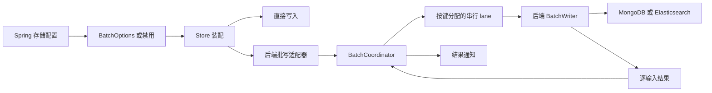

# 批处理存储重构设计

日期：2026-09-09

状态：架构方向与验收维度已确认；详细设计待审阅。

源码基线：`5c76a1cf4`。

## 1. 目标和范围

以架构质量、代码质量、性能、可维护性共同验收。允许破坏公开 API 和配置兼容性，不保留旧类型别名、旧参数重载或迁移桥接。正确性是四项验收的前提。

范围包括 `wow-core/infra/batch`、MongoDB 与 Elasticsearch 的事件及快照批写、Spring 批处理配置，以及相应测试、使用文档和基准调用方。保持现有模块依赖方向，不新增依赖，不调整发布、CI 或存储数据格式。

## 2. 审查依据

- `BatchCoordinator` 已拥有 lane 数量、路由、准入和生命周期；`KeyedBatchCoordinator` 再提供一层键哈希与转发。
- 四套存储 Options 重复尺寸、时间、容量和 lane 校验；核心另有 `BatchOptions`。存储 Options 仅校验 lane 为正，核心另校验 lane 不大于容量。
- 四套后端异常各定义溢出和关闭超时类型；四个批处理适配器重复映射和 CAS 缓存，以保留终止异常的对象身份。
- 两个快照 Writer 都先按键建立列表再归约；多个结果处理路径建立临时 Pair、列表及 Map。
- lane 共用一个窗口调度线程，入队共用生命周期锁。这是结构事实，尚不是已经测得的性能瓶颈。
- `BatchCoordinator.close(timeout)` 处理强制终止，继承的 `GracefullyStoppable.stop(timeout)` 只对等待进行超时限制，需要统一批处理实例的行为。
- 当前基线的核心批处理测试已运行：63 项通过，0 失败、0 跳过。尚未运行本轮存储集成测试及新基准。
- 仓库 7 月基准绑定旧提交，只可用于设计实验。批次摊销时间不作为单请求响应时间分位数。

## 3. 架构选择

采用统一契约、保留现有执行机制的方案。仅优化集合分配无法消除重复接口；直接重写队列、调度和状态机缺乏性能依据。

核心负责容量、分批、同 lane 批次串行、结果结算与生命周期。后端负责序列化、原生请求、快照版本保护和原生错误解释。Spring 只负责装配和外部配置绑定。

不增加通用存储执行层、适配器基类、结果归位框架或自定义队列。保留有明确职责的内部 Admission、Request、Lifecycle、Lane 和 ResultDispatcher；不按文件数量机械合并。

## 4. 公共契约

### 4.1 协调器

仅保留 `BatchCoordinator<T>`，删除 `KeyedBatchCoordinator`。构造参数为名称、`BatchOptions`、`BatchWriter<T>`、键选择器 `(T) -> Any` 和 metrics。键选择器默认返回固定键；多 lane 调用者传入实际排序键。

lane 由 `floorMod(key.hashCode(), laneCount)` 决定。单 lane 不调用键选择器。选择器必须稳定、非阻塞；异常仅拒绝当前请求，并释放已取得容量。哈希碰撞仅降低并发，不改变正确性。

保留 `submit(item)` 和惰性 `submit(itemFactory)`。每次订阅是一项新提交；先获取容量，再构造和序列化。过载或关闭时不执行 factory。

键相同的批次串行，不承诺协议批次内逐项执行顺序，也不承诺并发调用者在进入协调器之前的业务顺序。事件不合并；快照合并由后端负责。

### 4.2 配置

`BatchOptions` 统一包含 `maxSize=128`、`maxDelay=1ms`、`maxPendingItems=4096`、`laneCount=1`。校验集中于此：尺寸大于 1，延迟为正，容量不小于尺寸，lane 在 1 到容量之间。

四个 Store 使用 `batchOptions: BatchOptions? = null`；null 表示直接写入，非 null 表示批写。删除四个后端 Options。

Spring 保留四个有明确存储归属的属性入口与现有前缀，保留 `enabled=false`；统一字段名为 `maxPendingItems`。禁用时转换为 null，启用时构造公共 Options 并执行校验。默认值引用公共常量；绑定注解中的默认字面量由绑定测试验证一致性。旧 `maxPendingAppends`、`maxPendingSaves` 不再作为支持的配置键。

### 4.3 错误

溢出、关闭、关闭超时统一使用核心异常。删除 8 个后端同义异常及四份映射缓存。溢出保留 RecoverableException 标记；共享终止错误直接传播同一个对象。

保留事件版本冲突及后端原生错误信息。Writer 返回与输入数量和次序对应的 `List<BatchItemResult>`；不以一个总成功数替代逐项结果。

## 5. 正确性和生命周期

- 全部 lane 共享容量上限。取消排队请求可以释放调用者容量，但物理占位被消费前仍占队列额度，防止取消风暴使队列无限增长。
- 已被 Writer 领取的请求不会因调用者取消而宣称数据库写入被撤销。
- 每项只结算一次。已经确定的成功或失败，不被后续关闭超时改写。
- 结果回调与窗口处理隔离。隔离线程池有界，不承诺任意数量永久阻塞回调下仍能推进所有通知；必须检验饱和与拒绝路径，不把 caller-runs 等同于无条件隔离。
- `stopGracefully()` 关闭准入、刷新所有剩余窗口，并等到写入与结果通知排空。取消某个关闭观察者不取消共享关闭过程。
- 批处理实例的 `close()`、`stop()`、带超时的同步入口归于同一实现；保留回调内同步关闭的防自等待行为。公共 GracefullyStoppable 接口本身不做全仓语义调整。
- 关闭超时或中断安装唯一终止错误，失败尚未结算的请求，并释放所拥有的调度资源。数据库是否已写入可能不确定，不自动重试。
- Writer 空结果或结果数量不匹配按协议失败处理，当前批全部失败。普通批写失败不自动终止协调器；队列或生命周期基础设施失败终止协调器。

## 6. 后端实现与分配优化

MongoDB 继续按集合发送原生批写，并将每个集合的结果还原到原输入位置。保留跨集合失败隔离和写关注失败语义。结果归位可使用预分配的索引列表，前提是完成前不会读取未填充项，也不引入并行修改非线程安全结构；采用与串行结果消费相容的实现。

MongoDB 和 Elasticsearch 快照按存储位置与 id 合并，保留最高版本；同版本取本批最后一个。使用标准库 `groupingBy().reduce()` 避免每键临时列表。合并后的结果映射回所有被合并请求；跨批、跨实例仍依赖后端版本保护。

移除只用于遍历的 `zip` 和 Pair 分配时，保留长度校验、输入对应和错误完整性。不要为两个短归约函数新增跨模块抽象。

共享入队锁和窗口线程先保留。修改它们必须由当前基线 profile 支持，并重新验证超时窗口、取消、关闭和多 lane 顺序。

## 7. 验证与性能实验

### 7.1 功能验证

复用仓库 JUnit、Reactor Test 和现有 TCK，按行为迁移测试，而非仅替换类名。

| 范围 | 必须覆盖 |
|---|---|
| 核心 | 准入容量、factory 失败、相同键批次串行、不同 lane 并发、取消风暴、部分窗口、逐项失败、协议错误 |
| 生命周期 | 提交与关闭竞态、重复关闭、超时与中断、已结算结果不改写、回调内关闭、通知线程饱和 |
| MongoDB | 多集合、部分失败、写关注失败、事件冲突、快照最高版本和同版本覆盖、跨批版本保护 |
| Elasticsearch | bulk 响应对应关系、部分失败、版本冲突、快照合并和原生版本保护 |
| Spring | 四个入口的默认禁用、启用、统一容量字段、非法启用配置与 Store 装配 |

运行受影响模块的 check，并显式运行 MongoDB/Elasticsearch 相关 integrationTest。变更基准调用方后验证 JMH 编译与发现。运行实际存在的 source set；Docker 不可用时明确记为验收未完成。

### 7.2 性能方法

在实现前保存可执行基线，重构后使用相同负载和测量代码比较。允许基线测量夹具与源码分开保存；记录夹具差异，不能用已失配的旧报告替代基线。

实验覆盖核心协调器和两种存储的事件、快照路径。区分低流量部分窗口、饱和独立键、热点键、多集合或多索引，以及重复快照合并。容量耗尽和慢回调单独报告拒绝率和恢复情况，不混入成功吞吐。

复用现有 JMH 测吞吐和 `gc.alloc.rate.norm`。p95/p99 从每次提交至结果通知独立采样，固定到达率实验从计划提交时间记录延迟，并报告实际发送率、成功率、拒绝率和超时率，避免仅对成功或未排队请求取样。批次的 JMH 平均值或 SampleTime 不冒充单请求分位数。

默认参数固定为 128 / 1ms / 4096，lane 对比 1 和 4；热点场景中的合法事件顺序与非法并发版本冲突分开测量。Mongo 写关注和 ES refresh 策略保持一致。每种代表负载至少做三组独立进程 AB/BA 对比，每次预热至少 5 秒、测量至少 10 秒；尾延迟每侧至少获得 10000 个请求样本，并报告运行间变化。

记录源码提交及 dirty 状态、JVM、硬件、后端版本和容器资源、参数、原始数据以及数据库最终写入或版本校验。测量仅访问专用测试数据。基线与候选采用等价数据状态，不复用累积增长造成偏差的数据集。

## 8. 四项验收

| 维度 | 验收证据 |
|---|---|
| 架构质量 | 一个公共协调器、一套参数与基础设施错误；后端原生语义不进入核心；无新增通用执行层；职责和资源所有权能从代码直接确定 |
| 代码质量 | 重复映射与配置删除；无旧 API 桥接；正确性测试、受影响 check 与存储集成测试通过；没有通过删除关键验证换取短代码 |
| 性能 | 同环境原始结果证明优化收益或等价表现；无未解释退化；吞吐、尾延迟、分配量和失败率同时报告 |
| 可维护性 | 调整公共批处理策略只需修改核心；后端差异只在对应模块；配置文档与测试同步；竞争场景可稳定复现 |

采用以下工程判定阈值：代表负载吞吐下降超过 5%、p95/p99 上升超过 10% 或每成功项分配上升超过 5%，均触发针对性重复测量与归因；它们是退化调查门槛，不是允许静默退化的额度。确认的退化须修复，或将成本及收益交给用户裁决，不能自行宣称验收通过。收益处于噪声内则报告性能持平，不宣称加速。未完成必要实验则性能项未验收。

## 9. 交付与边界

交付包括源码及调用方更新、行为测试、配置文档、当前审查结论、前后性能证据和未解决风险。历史设计、原始基准报告保持其历史身份，不伪改为新 API 或新结果。

先完成本文审阅，再按 writing-plans 形成实施计划。本文不意味着实现或性能验收已经完成；实现过程中若证据否定候选简化，应调整实现并记录理由。
