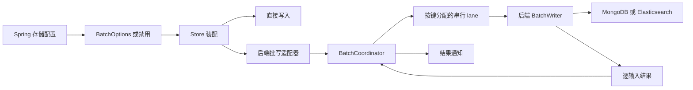

# 批处理存储重构设计

日期：2026-09-09

状态：实现已整理，正确性验证通过；整体性能尚未验收。最终状态见 [交付汇总](storage-batching-review.md)。

源码基线：`5c76a1cf4`。

## 1. 目标和范围

以架构质量、代码质量、性能、可维护性共同验收。允许破坏公开 API 和配置兼容性，不保留旧类型别名、旧参数重载或迁移桥接。正确性是四项验收的前提。

范围包括 `wow-core/infra/batch`、MongoDB 与 Elasticsearch 的事件及快照批写、Spring 批处理配置，以及相应测试、使用文档和基准调用方。保持现有模块依赖方向，不新增依赖，不调整发布、CI 或存储数据格式。

## 2. 重构前的审查依据（历史基线）

- `BatchCoordinator` 已拥有 lane 数量、路由、准入和生命周期；`KeyedBatchCoordinator` 再提供一层键哈希与转发。
- 四套存储 Options 重复尺寸、时间、容量和 lane 校验；核心另有 `BatchOptions`。存储 Options 仅校验 lane 为正，核心另校验 lane 不大于容量。
- 四套后端异常各定义溢出和关闭超时类型；四个批处理适配器重复映射和 CAS 缓存，以保留终止异常的对象身份。
- 两个快照 Writer 都先按键建立列表再归约；多个结果处理路径建立临时 Pair、列表及 Map。
- lane 共用一个窗口调度线程，入队共用生命周期锁。这是结构事实，尚不是已经测得的性能瓶颈。
- `BatchCoordinator.close(timeout)` 处理强制终止，继承的 `GracefullyStoppable.stop(timeout)` 只对等待进行超时限制，需要统一批处理实例的行为。
- 当前基线的批处理单测已运行：核心 63 项、MongoDB 61 项、Elasticsearch 19 项通过，0 失败、0 跳过。尚未运行本轮存储集成测试及新基准。
- 临时运行探针确认：factory 未返回时优雅关闭可完成；继承的 stop 超时不会结算悬挂请求；当前分发器终止后的 dispatch 在调用线程运行。这些是基线行为，不是重构后已修复的证据。
- 仓库 7 月基准绑定旧提交，只可用于设计实验。批次摊销时间不作为单请求响应时间分位数。

## 3. 架构选择

采用统一契约、复用 Reactor 原生按需合批的方案。仅优化集合分配无法消除重复接口；直接重写队列、调度和状态机缺乏性能依据。

核心负责容量、分批、同 lane 批次串行、结果结算与生命周期。后端负责序列化、原生请求、快照版本保护和原生错误解释。Spring 只负责装配和外部配置绑定。

不增加通用存储执行层、适配器基类、结果归位框架或自定义队列。保留有明确职责的内部 Admission、Request、Lifecycle、Lane 和 ResultDispatcher；不按文件数量机械合并。

## 4. 公共契约

### 4.1 协调器

仅保留 `BatchCoordinator<T>`，删除 `KeyedBatchCoordinator`。构造参数为名称、`BatchOptions`、`BatchWriter<T>`、键选择器 `(T) -> Any` 和 metrics。键选择器默认返回固定键；多 lane 调用者传入实际排序键。

lane 由 `floorMod(key.hashCode(), laneCount)` 决定。单 lane 不调用键选择器。选择器必须稳定、非阻塞；异常仅拒绝当前请求，并释放已取得容量。哈希碰撞仅降低并发，不改变正确性。

保留 `submit(item)` 和惰性 `submit(itemFactory)`。每次订阅是一项新提交；先获取容量，再构造和序列化。准入检查已观察到过载或关闭时不执行 factory；通过检查后与关闭竞争的 factory 可能继续执行。

成功入队是请求被接受的线性化点，与关闭准入使用同一闸门。取得容量只是构造阶段的预留，不表示已被接受。factory 在提交线程执行，必须有限、非阻塞，且不执行存储 I/O；关闭不等待、不强制中断它。factory 返回后若入队失败，释放预留并向该提交返回关闭或终止错误，绝不调用 Writer。构造中的预留最多受全局容量限制，返回后必须释放。

键相同的批次串行，不承诺协议批次内逐项执行顺序，也不承诺并发调用者在进入协调器之前的业务顺序。事件不合并；快照合并由后端负责。

### 4.2 配置

`BatchOptions` 统一包含 `maxSize=128`、`maxDelay=1ms`、`maxPendingItems=4096`、`laneCount=1`。校验集中于此：尺寸在 2 到 `Int.MAX_VALUE / 4` 之间（fair 预取位移上限），延迟为正，容量不小于尺寸，lane 在 1 到容量之间。

四个 Store 使用 `batchOptions: BatchOptions? = null`；null 表示直接写入，非 null 表示批写。删除四个后端 Options。

Spring 保留四个有明确存储归属的属性入口与现有前缀，保留 `enabled=false`；统一字段名为 `maxPendingItems`。禁用时转换为 null，启用时构造公共 Options 并执行校验。默认值引用公共常量；绑定注解中的默认字面量由绑定测试验证一致性。旧 `maxPendingAppends`、`maxPendingSaves` 不再作为支持的配置键。

### 4.3 错误

溢出、关闭、关闭超时统一使用核心异常。删除 8 个后端同义异常及四份映射缓存。溢出保留 RecoverableException 标记；共享终止错误直接传播同一个对象。

保留事件版本冲突及后端原生错误信息。Writer 返回与输入数量和次序对应的 `List<BatchItemResult>`；不以一个总成功数替代逐项结果。

## 5. 正确性和生命周期

- 全部 lane 共享容量上限。取消排队请求可以释放调用者容量，但物理占位被消费前仍占队列额度，防止取消风暴使队列无限增长。
- 已被 Writer 领取的请求不会因调用者取消而宣称数据库写入被撤销。
- 每项只结算一次。保障从请求原子转换为 Settled 开始；仅后端已确认、但 Writer 尚未返回或请求尚未完成该转换，不属于已结算。结算与关闭竞争时以状态转换的胜者为准，已经结算的成功或失败不被关闭超时改写。
- 已接受请求的主动结果发射（调用 sink.tryEmitEmpty / tryEmitError）只在所拥有的结果线程池任务中执行，不回退到发布调用栈。不承诺所有下游回调的线程：结果先于订阅握手完成时，终止信号可在订阅线程重放；调用者添加 publishOn 等操作也可以改变线程。准入拒绝、factory 或键选择器错误可以直接在提交线程通知，因其尚未被接受。具体发布和拒绝规则见 5.1。
- `stopGracefully()` 关闭准入、刷新所有剩余窗口，并等到已接受请求的写入与所拥有的通知任务完成。通知任务包括主动发射同步触发的下游调用，但不追踪迟到重放、调用者调度的异步下游工作或关闭观察者自身。构造中、尚未入队的提交不属于关闭等待集合。取消某个关闭观察者不取消共享关闭过程。
- 批处理实例的 `close()`、`stop()`、带超时的同步入口归于同一实现；保留回调内同步关闭的防自等待行为。公共 GracefullyStoppable 接口本身不做全仓语义调整。
- 关闭超时或中断安装唯一终止错误，结算尚未结算的已接受请求，发起调度资源清理并请求结果线程池排空。同步关闭不等待任意阻塞的用户回调退出；已运行的用户代码不能被安全强制终止，因此不能承诺超时返回时所有线程均已退出。数据库是否已写入可能不确定，不自动重试。
- Writer 空结果或结果数量不匹配按协议失败处理，当前批全部失败。普通批写失败不自动终止协调器；队列或生命周期基础设施失败终止协调器。

### 5.1 结果发布与关闭闸门

保留标准 ThreadPoolExecutor 和容量为 maxPendingItems 的 ArrayBlockingQueue，不新增后备线程池或自定义队列。生命周期锁负责准入与生命周期状态，独立的结果锁负责请求结算、一次性通知认领、executor 提交和封口；两把锁绝不嵌套。结果临界区只更新内部状态和入队，绝不运行或等待用户回调。只有任务成功入队才记为通知发布成功；任务认领和未完成计数的失败回滚也在结果闸门内完成。

这一锁范围修正来自实现后的 JFR：共享闸门使提交线程与批次发布线程互相等待。两锁独立可让正常准入与发布推进，不改变请求 CAS 结算胜者。失败安装者在生命周期锁内安装失败并取得已接受请求快照，退出后才获取结果锁结算、发布和封口；已关闭准入保证此后没有新接受的请求。处理器完成若观察到 Failed，不能抢先封口，必须留给失败安装者完成未决通知；若观察到正常 DrainingResults，则所有 lane 已完成有效通知发布，可以正常封口。JFR 只支持锁范围归因，不代表性能验收通过。

正常完成和失败关闭都经过此闸门：失败关闭对所有已接受请求安装未决结果，确保每个需通知请求的唯一任务已提交，再将发布状态封口，并由一个调用者认领锁外关闭动作。退出闸门后才调用 executor.shutdown()。封口至实际 shutdown 之间不再接受有效通知，线程池继续执行先前入队的任务，因此不丢任务。已取消且无需通知的请求单独回收。迟到的 Writer 完成只能观察已有结算或通知认领状态，不得再次提交；封口后此类重复发布返回忽略状态，不产生第二次主动发射。

移除 ThreadPoolExecutor.terminated() 中的业务终止链；不得在该钩子中获取任一业务锁或完成用户可观察的 Future / sink。使用所拥有通知任务的未完成计数判定排空：计数在任务发布时预留，在任务 finally 中、主动发射及其同步下游调用退出后原子归还。仅当计数归零且可见的 shutdownCalled 为真时，任务才获取结果锁并重检、认领一次排空动作，锁外执行该动作；shutdown 路径同样在设置标志后检查计数，因此不会遗漏先归零的任务。所有可触发观察者的 complete、completeExceptionally、sink 发射、metrics 回调和取消操作都放到两把业务锁与线程池内部锁之外。无需等待 ThreadPoolExecutor 的终止钩子来承诺通知排空，通知排空也不等于所有物理线程已经退出。

排空完成信号可能同步运行关闭观察者，因而它必须是相应关闭状态转换的最后一个外部动作；不得让后续必要资源清理依赖观察者返回。成功、失败和 processor 完成信号同样遵守锁外发布规则。超时是同步入口对排空的等待期限，不是对任意用户观察者代码、操作系统调度或资源清理时长的硬实时上界。

通知任务开始执行时才释放该项准入容量，然后发出结果。未执行通知的请求仍持有准入额度；每项最多一个排队通知，所以通知队列最多 N=maxPendingItems 项。运行中的任务最多为线程池工作线程数，不占排队槽。慢回调占满线程后，排队结果占住准入，后续提交以 BatchOverflowException 拒绝；这是有界退压，不触发 caller-runs。

拒绝分为两类：封口后的已结算或已认领请求属于迟到重复，忽略；封口前对唯一有效通知的 RejectedExecutionException 属于内部不变量被破坏，立即报告基础设施故障并停止新准入，不回退到调用线程、不按成功处理。正常协议必须通过容量证明和竞争测试使后一分支不可达；若故障注入导致线程池本身不可用，不承诺继续交付全部通知，关闭必须报告失败，不能报告优雅完成。资源耗尽等基础设施故障不伪装成已满足正常交付保证。

必须用可控暂停点验证：结算至入队之间与关闭竞争；封口后至 shutdown 前收到迟到结果；最后任务完成与 shutdown 竞争；空线程池关闭；全部结果线程暂时阻塞且队列达到容量；释放回调后完成排空。断言每个已接受且未取消请求恰好一次主动发射、结算不改写、封口无有效迟到任务、主动发射不在发布调用栈内联执行，以及无故意阻塞关闭观察者时超时关闭能返回。

另保留订阅握手反例：在 onSubscribe 中等待关闭，然后继续订阅，允许结果在订阅线程重放；关闭不等待这个重放回调。锁边界反例要求关闭观察者等待另一条获取生命周期锁的线程，并能完成，证明观察者没有在该锁或线程池终止钩子中运行。调用者要等待自身的异步下游处理时，应组合对应 Publisher，不能把 stopGracefully 当作任意下游任务的 join。

### 5.2 本轮设计验证及限度

- 已实际复现基线的订阅线程终止重放。它现在属于明确允许的边界，未通过文字修改宣称该行为已从源码消失。
- 临时 Java 组合探针通过：空线程池在锁外 shutdown，关闭观察者等待另一线程获取生命周期锁，能正常完成。探针验证锁外方案的可行性，不代表实际协调器已迁移。
- 两个已接受请求的有限状态模型遍历 35 个可达状态、74 条转换，检查结算发布、失败封口、任务开始和结束、锁外 shutdown 的顺序；未发现提前完成或排空后无法完成的状态。
- 该模型不覆盖动态准入、取消、线程池故障和 JVM 内存可见性，不能替代实施后的竞争测试、真实后端集成测试和性能验收。143 项基线单测也不作为尚未实施方案的测试结果。

## 6. 后端实现与分配优化

MongoDB 继续按集合发送原生批写，并将每个集合的结果还原到原输入位置。保留跨集合失败隔离和写关注失败语义。结果归位可使用预分配的索引列表，前提是完成前不会读取未填充项，也不引入并行修改非线程安全结构；采用与串行结果消费相容的实现。

跨集合失败隔离仅适用于 Writer 收齐集合结果并返回列表的情形。反例合同：同批集合 A 已写成功，B 尚未结束，此时关闭超时，A 与 B 在协调器都未结算，则二者均可收到关闭超时；它表示未能完成协调器确认，不表示 A 的数据库写入回滚。保留 Mono<List<BatchItemResult>>，不新增逐集合提前结算协议。测试必须同时证明 A 确实写入和调用者收到超时，以及后续到达的结果不能再次通知。

MongoDB 和 Elasticsearch 快照按存储位置与 id 合并，保留最高版本；同版本取本批最后一个。使用标准库 `groupingBy().reduce()` 避免每键临时列表。合并后的结果映射回所有被合并请求；跨批、跨实例仍依赖后端版本保护。

移除只用于遍历的 `zip` 和 Pair 分配时，保留长度校验、输入对应和错误完整性。不要为两个短归约函数新增跨模块抽象。

使用 `publishOn → bufferTimeout(..., true) → concatMap → cancelOn`，删除窗口级缓冲；Writer 忙碌时保留单项积压，需求恢复后重新合批，部分批可以立即发出。空结果异常惰性创建，指标按已出现的 lane/window/outcome 惰性复用 Meter，并保留注册失败恢复。

入队锁和窗口线程保留；结果发布不再与入队共享锁。任何进一步调度改动必须由当前 profile 支持，并重新验证超时窗口、取消、关闭和多 lane 顺序。

## 7. 验证与性能实验

### 7.1 功能验证

复用仓库 JUnit、Reactor Test 和现有 TCK，按行为迁移测试，而非仅替换类名。

| 范围 | 必须覆盖 |
|---|---|
| 核心 | 准入容量、factory 失败、相同键批次串行、不同 lane 并发、取消风暴、部分窗口、逐项失败、协议错误 |
| 生命周期 | factory 暂停时关闭先完成且返回后禁止写入、统一同步超时入口、结算与发布竞争、迟到结果、通知线程饱和后恢复、回调内关闭 |
| MongoDB | 多集合结果收齐后的失败隔离、集合 A 已确认而 B 悬挂时关闭超时、写关注失败、事件冲突、快照最高版本和同版本覆盖、跨批版本保护 |
| Elasticsearch | bulk 响应对应关系、部分失败、版本冲突、快照合并和原生版本保护 |
| Spring | 四个入口的默认禁用、启用、统一容量字段、非法启用配置与 Store 装配 |

运行受影响模块的 check，并显式运行 MongoDB/Elasticsearch 相关 integrationTest。变更基准调用方后验证 JMH 编译与发现。运行实际存在的 source set；Docker 不可用时明确记为验收未完成。

### 7.2 性能方法

在实现前保存可执行基线，重构后使用相同负载和测量代码比较。允许基线测量夹具与源码分开保存；记录夹具差异，不能用已失配的旧报告替代基线。

实验覆盖核心协调器和两种存储的事件、快照路径。区分低流量部分窗口、饱和独立键、热点键、多集合或多索引，以及重复快照合并。容量耗尽和慢回调单独报告拒绝率和恢复情况，不混入成功吞吐。

复用现有 JMH 测吞吐和 `gc.alloc.rate.norm`。p95/p99 从每次提交至结果通知独立采样，固定到达率实验从计划提交时间记录延迟，并报告实际发送率、成功率、拒绝率和超时率，避免仅对成功或未排队请求取样。批次的 JMH 平均值或 SampleTime 不冒充单请求分位数。

默认参数固定为 128 / 1ms / 4096，lane 对比 1 和 4；热点场景中的合法事件顺序与非法并发版本冲突分开测量。Mongo 写关注和 ES refresh 策略保持一致。每种代表负载至少做三组独立进程 AB/BA 对比，每次预热至少 5 秒、测量至少 10 秒；尾延迟每侧至少获得 10000 个请求样本，并报告运行间变化。

在候选实现测量前冻结载荷、键分布、并发、速率、超时、持续时间与后端策略。开放流量必须独立按绝对速率校准，不能用闭环吞吐的百分比充作开放容量；两侧使用相同负载。最终可复现协议见 [实验脚本说明](../../wow-benchmarks/experiments/storage-batching/README.md)，历史实验以外部归档为准。

负载最少包括独立键、90% 请求集中到一个热点键、8 个集合或索引均匀分布，以及快照重复键归约。热点事件合法序列每键至多一项未完成；并发版本冲突另列故障场景。所有计划提交都记账：未能发出、被拒绝、超时及成功分别计数；延迟按结果类别报告，超时作为截尾样本保留。正常验收负载存在失败或超时不能仅凭成功请求的低延迟通过。基线达不到某项固定负载时记录容量不足，不能在看到候选结果后删除该场景。

记录源码提交及 dirty 状态、JVM、硬件、后端版本和容器资源、参数、原始数据以及数据库最终写入或版本校验。测量仅访问专用测试数据。基线与候选采用等价数据状态，不复用累积增长造成偏差的数据集。

## 8. 四项验收

| 维度 | 验收证据 |
|---|---|
| 架构质量 | 一个公共协调器、一套参数与基础设施错误；后端原生语义不进入核心；无新增通用执行层；职责和资源所有权能从代码直接确定 |
| 代码质量 | 重复映射与配置删除；无旧 API 桥接；正确性测试、受影响 check 与存储集成测试通过；没有通过删除关键验证换取短代码 |
| 性能 | 同环境原始结果证明优化收益或等价表现；无未解释退化；吞吐、尾延迟、分配量和失败率同时报告 |
| 可维护性 | 调整公共批处理策略只需修改核心；后端差异只在对应模块；配置文档与测试同步；竞争场景可稳定复现 |

对每个冻结负载分别计算候选/基线比值，以独立进程对为统计单位，在 log 比值上使用 Student-t 构造 95% 区间；吞吐、每成功项分配及每轮单请求 p95/p99 分别计算。不把同一进程的请求数当作独立实验重复数，不跨负载平均抵消退化。

预先固定工程等价区间：吞吐和分配为 [0.95, 1.05]，p95/p99 为 [0.90, 1.10]。只有比值的整个 95% 区间落入相应等价区间，才标记该指标工程等价；区间整体越过有利边界才标记明确改善，整体越过不利边界则标记明确退化；其余情况为证据不足。指标改善与等价可以共同支持性能验收，任一代表负载存在退化、证据不足或异常成功率下降则不能自动通过。

实验开始前固定最终进程对数，至少三对。前三对若仅作为估计方差的 pilot，必须从确认性样本中排除，再固定确认性样本数量；不得逐轮检查并在首次通过时停止。最低样本量不是精度保证，10,000 个请求也不自动证明 p99 精确。未取得足够精度时报告无法判定，不把未发现显著差异称为持平。

确认的退化须修复，或将成本及收益交给用户裁决；未完成必要实验则性能项未验收。

## 9. 交付与边界

交付包括源码及调用方更新、行为测试、配置文档、当前审查结论、前后性能证据和未解决风险。历史设计、原始基准报告保持其历史身份，不伪改为新 API 或新结果。

实施记录、历次原始结果及撤回实验已归档；当前唯一验收汇总见 [交付汇总](storage-batching-review.md)。非劣、等价和改善分别报告，历史判定不作追溯改写。
