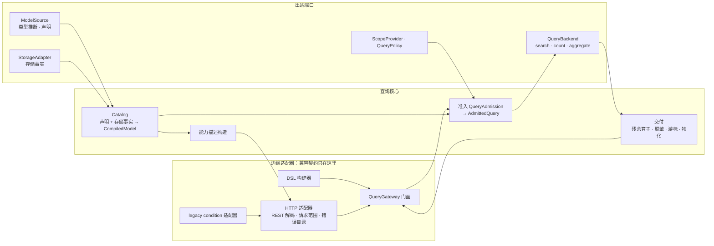
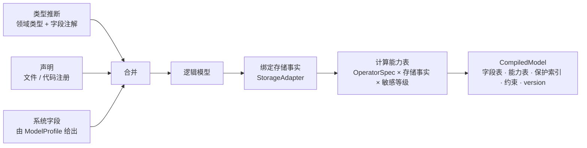
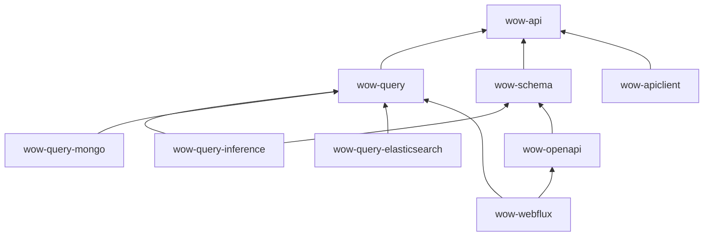

# 查询子系统目标架构

日期：2026-09-24。状态：目标设计，尚未实施。

本文从第一性原理推导查询子系统的目标架构。现有实现不是设计前提：它只在两处出现，一是 §1 的兼容边界，二是附录 A 的迁移起点。其余各章描述的是“应该是什么”，不是“现在是什么”。

## 1. 兼容边界

架构只对下列外部契约负责。它们在架构中以**边缘适配器**的形式存在（§5.9），核心不感知它们。

| 契约 | 约定 |
|---|---|
| QueryGateway API | 保证：十个公开方法及其返回形状不变 |
| RESTful 查询 API | 保证：路由、请求与响应 JSON、状态码、错误码及其 HTTP 状态、错误文案不变 |
| 查询 DSL | 保证源码兼容，不保证二进制兼容 |
| legacy `condition`：REST 请求体与 Kotlin `Condition` API | 9.x 期间保留，只存在于边缘适配器中；10.0 移除 Kotlin API，REST 部分届时按客户端迁移进度决定 |
| 会改变 REST 返回结果的安全修复 | 默认保持旧行为，新行为通过配置启用 |

其余一律不做兼容：SPI、内部类型、装配方式、配置属性名、声明文件格式、字段注解、`/schema` 的响应、游标令牌格式，都按本文直接设计，不保留过渡层、别名或双格式。刚发布、还没有真实消费者的面不做兼容。

## 2. 问题

查询子系统是 CQRS 的读侧。它要做的事情是：

> **在调用方身份的约束下，把针对逻辑模型的查询意图翻译成存储上的执行，并以逻辑模型的形状交付结果；同时如实地告诉消费者，这个模型能被怎样查询。**

参与者：

- **读模型**：Snapshot（每个聚合的最新状态）、EventStream（事件历史）。两者都是封闭集合。
- **调用方**：
  - 进程内的应用代码：saga、投影、缓存、补偿；
  - HTTP 客户端：TS 应用、视图引擎；
  - LLM Agent。
- **存储**：MongoDB、Elasticsearch，以后可能更多。
- **查询形态**：single、list、paged、cursor、count、aggregate。

## 3. 第一性原理与不变量

| # | 原理 | 由此得出的不变量 |
|---|---|---|
| P1 | 语义只定义一次 | 同一查询在任何后端上结果一致；后端只翻译、只做原生检查，不解释语义 |
| P2 | 能力真相只有一处 | 某字段可用哪些运算符、能否排序或聚合，由同一张在模型编译时算好的能力表回答；准入与能力描述都只读这张表 |
| P3 | 只解析一次 | 字段、类型、作用域、时间在准入时解析一次，之后各环节只消费结果 |
| P4 | 安全在构造上成立 | 后端在类型上只能收到已准入的查询；范围、策略、脱敏由固定管道执行，不依赖入口记得调用 |
| P5 | 入口决定信任 | 预算、门控、范围缺失时的处理由入口策略决定；同一个查询从不同入口进来可以有不同的限制 |
| P6 | 契约在边缘 | 兼容契约只存在于边缘适配器中；核心的数据结构与 SPI 不为兼容而扭曲 |
| P7 | 变更局部，由编译器穷尽 | 新增运算符、指标、模型、存储时，改动集中，漏改会导致编译失败 |
| P8 | 热路径不解释 | 模型编译一次；请求路径上不做反射、不重建可复用对象、不重复解析 |
| P9 | 每次订阅独立 | 重订阅、重试、取消互相隔离，结果由本次订阅独占，资源由创建者释放 |

## 4. 架构总览



依赖规则：边缘依赖核心，核心依赖端口，适配器实现端口。核心不依赖任何边缘类型、HTTP 类型或存储驱动。

## 5. 组件

### 5.1 查询协议

查询协议是纯数据，不含运行时，位于 wow-api：

- **查询 AST**：`FilterExpression` 与各查询类型，是 wire 格式与 DSL 的共同产物。
- **`OperatorSpec`**：每个过滤运算符、聚合指标与分组唯一的一份规格（§6.1）。
- **语义规范**：每个运算符在 null、缺失、数组、大小写上的行为，由它生成 TCK 矩阵（§6.2）。
- **协议限额**：对任何入口都成立的上限，例如聚合最多 32 个分组、64 个指标、5 层元素。
- **字段注解**：领域模型用来声明查询元数据（§6.4）。
- **能力描述 DTO**（§7）。

### 5.2 Catalog 与 CompiledModel

Catalog 把“一个聚合的一个读模型”编译成不可变、带版本的 `CompiledModel`：



- **能力表在编译时算好**：每个字段、每个动态字段模板，都有一份有效能力：运算符、排序、游标排序、分组、函数、指标过滤、忽略大小写等。准入检查就是查表，能力描述就是把表序列化（P2）。
- **组合约束**也在编译时整理：平行数组不能同时排序、元素作用域、游标唯一排序等。
- **ModelProfile**：Snapshot 与 EventStream 各有一份，给出身份字段、payload 位置、payload 类型字段、默认范围、投影约束和系统字段。这是一个封闭集合，不对外扩展。
- **发布**：
  - 编译成功后原子替换；编译失败时保留上一个版本，并报告错误；
  - 每次订阅开始时取当前版本，整个订阅期间使用同一个版本。
- **刷新**：
  - 存储事实（索引、mapping、validator）会在部署之外变化，所以 Catalog 定期重新校验，发现变化就重新编译；
  - 部署了 actuator 时，管理端点提供按实例的查看与手动刷新；
  - 数据面不提供刷新接口。

### 5.3 入口与入口策略

每个请求都带着一个**入口**：HTTP 或进程内。入口决定一份**入口策略**：

| 策略项 | HTTP 入口 | 进程内入口 |
|---|---|---|
| 预算：列表大小、页大小、偏移窗口、过滤节点数、取值数 | 按配置 | 默认不限；需要时显式配置 |
| 昂贵运算的门控：元素、算术表达式、指标排序等 | 按配置 | 放开 |
| 范围缺失时的处理 | 默认放行（保持旧行为），可配置为拒绝 | 放行：进程内调用方是受信代码，范围由它自己决定 |
| 空闲超时、结果缓冲 | HTTP 适配器负责 | 无 |

- 入口通过 Reactor context 传入。QueryGateway 的签名不变，没有写入入口时，默认视为进程内入口。
- 预算与门控是**准入的一部分**，不再是 HTTP 层另外的一道检查。准入读取入口策略。
- 能力描述也按入口生成：HTTP 描述中已经去掉被门控关闭的能力，并附上 HTTP 预算（§7）。

### 5.4 准入与 AdmittedQuery

准入回答的问题是：**这一次订阅允许执行的查询是什么**。它是后端之前唯一的关卡。

```kotlin
/** 只能由 QueryAdmission 构造。 */
class AdmittedQuery<Q> internal constructor(
    val query: Q,                                            // 规范化后的查询，仍是原来的 AST
    private val fields: IdentityHashMap<Any, ResolvedField>, // 以节点身份为键的解析结果
    val model: CompiledModel,
    val entry: QueryEntry,
)
```

准入按固定顺序执行：

1. **改写**：普通 `QueryFilter` 改写查询。这是扩展点，按顺序执行。
2. **强制范围**：追加 `ScopeProvider` 给出的调用方范围与 `QueryPolicy` 的条件。这一步在所有扩展之后，普通 Filter 删不掉。
3. **模型默认范围**：例如 Snapshot 默认只查未删除的记录。
4. **操作收尾**：例如游标追加身份字段作为唯一排序。
5. **校验**：查能力表、检查取值规则与组合约束、检查协议限额与入口预算。
6. **规范化与解析**：相对时间统一取一个 `now`，按字段的时间编码换算；降级运算符；解析每个字段引用，产出 `AdmittedQuery`。

设计要点：

- **后端签名只接受 `AdmittedQuery`**，未准入的查询在类型上到不了后端（P4）。
- **解析结果随查询交给后端**，后端不再查找字段（P3）。
- **不另造一棵 IR 树**：仍用原来的 AST 节点，所以新增运算符不会多出一处改动。旁表以节点**身份**为键：AST 节点是 data class，不同元素作用域里写法相同的条件会判为相等。
- **不另造一套命名**：`ResolvedField` 引用 CompiledModel 中的字段记录，后端按所需能力取物理绑定，不产生改写后的字段名。
- **准入通过不等于原生合法**：后端仍然做原生检查，例如 ES 的特殊排序字段。
- **每一次拒绝都产生结构化违规信息**：说明违反了哪条规则、涉及哪个字段、哪个约束。对外的错误码与文案由错误目录决定（§5.9）。
- **低层调用**：TCK、测试与自定义工具先经过 `QueryAdmission` 取得 `AdmittedQuery`，再直接调用后端。

### 5.5 后端

后端只做三件事：**原生检查、翻译、执行**。SPI 收缩为三个原语：

```kotlin
interface QueryBackend {
    /** 检索记录。窗口可以是偏移窗口、keyset 游标，或不限量的流。 */
    fun search(query: AdmittedQuery<out Queryable<*>>, window: SearchWindow): Flux<ObjectNode>
    fun count(query: AdmittedQuery<FilterExpression>): Mono<Long>
    fun aggregate(query: AdmittedQuery<AggregationQuery>): Flux<ObjectNode>
}

sealed interface SearchWindow {
    data class Offset(val offset: Int, val limit: Int) : SearchWindow
    data class Keyset(val after: CursorPosition?, val limit: Int) : SearchWindow
    data class Stream(val limit: Int?) : SearchWindow
}
```

- **single、list、paged、cursor 由核心组合**：
  - single = `search(Offset(0, 1))`；
  - list = `search(Stream)`；
  - paged = `count` + `search(Offset)`，两者使用同一个 `AdmittedQuery`，过滤条件自然一致；
  - cursor = `search(Keyset)`。
  后端不必重复实现这四种形态之间的关系。
- **后端之间共享的逻辑都在核心**：
  - 游标令牌的编解码与指纹（§6.5）；
  - 聚合的逻辑形状：元素作用域、指标过滤、dense 补空的识别；
  - 残余算子：having、top-N、dense 补空，以纯函数提供，后端在原生做不到时调用；
  - 结果的有限数检查与标准 JSON 检查。
- **后端独有的**：翻译成原生请求、原生约束检查、分页资源（PIT 等）、驱动值到标准 JSON 的转换、响应完整性检查。
- **StorageAdapter**：从存储读取事实（索引、mapping、validator），交给 Catalog 计算能力。它与后端成对提供。

### 5.6 交付

交付是固定管道，不对外开放扩展：

1. 调用残余算子，如果后端要求；
2. **强制脱敏**：按字段的敏感等级与遮挡方式处理；
3. 编码下一页的游标令牌；
4. 物化：typed 结果转成领域类型，dynamic 结果保持 `ObjectNode`；
5. 观测：`QueryObserver` 记录完成、错误、取消，以及准入拒绝的原因。观测失败不影响主信号。

### 5.7 执行合同

适用于所有查询形态：

1. **每次订阅独立**：每次订阅都重新取模型版本、重新准入、重新执行，不共享可变状态。
2. **先检查，后 I/O**：准入与后端的原生静态检查都在第一次执行性 I/O 之前完成；任何一项失败时，执行性 I/O 次数为零。
3. **错误只沿当前 Publisher 传播**：不吞错，不改写成空结果。扩展返回空是协议错误。
4. **资源由创建者释放**：PIT、游标等资源在完成、错误、取消时都释放。
5. **取消向上传播**：取消发生在准入阶段时，后端不会启动。

### 5.8 治理

- **ScopeProvider**（入站端口）：由边缘适配器实现，例如从 HTTP 请求取得租户、所有者、空间，或由 CoSec 提供。它把范围写入 context，准入的第 2 步读取。
- **QueryPolicy**：追加 AND 条件，例如 ABAC；只能收窄，不能替换查询。`QueryContext` 带上 `QueryType` 与入口，供策略区分。
- **敏感等级**（§6.4）：
  - `CONFIDENTIAL` 的字段在编译能力表时就去掉过滤、排序、聚合能力，从源头上消除反推原值的可能；
  - `DISPLAY` 的字段只在交付时遮挡。
- **所有读路径都经过准入与交付**：包括按 id 加载、按版本加载、追踪（tracing）等 State 读取。没有绕过范围、策略与脱敏的读路径。旧行为按 §1 默认保持，新行为通过配置启用。
- **缓存**：进程内缓存（例如 cocache）以明确的进程内入口读取数据。缓存键必须包含范围，受限或脱敏的结果不能在不同调用方之间共享。

### 5.9 边缘适配器

| 适配器 | 职责 |
|---|---|
| QueryGateway 门面 | 实现冻结的十个方法：取模型 → 准入 → 组合后端原语 → 交付 |
| HTTP 适配器 | 严格解码 REST 请求体；实现 `ScopeProvider`；写入 HTTP 入口；空闲超时与非 SSE 时的缓冲；能力描述端点（ETag）；通过错误目录映射错误 |
| 错误目录 | 集中定义对外错误码、HTTP 状态与文案模板，由结构化违规信息渲染出冻结的文案，用黄金测试锁住。内部怎么重构都不影响对外文案 |
| DSL | 构建 AST；执行扩展调用 Gateway |
| legacy `condition` 适配器 | REST 请求体中的 `condition` 在解码时转换为 AST，Kotlin `Condition` API 在构造时转换。核心看不到 `Condition` |

## 6. 单一能力真相

### 6.1 OperatorSpec

```kotlin
sealed interface FilterOperatorSpec {
    val operator: FilterOperator
    val target: OperatorTarget          // FIELD，或 MODEL（不指定字段的 SEARCH、ID、TENANT_ID、DELETION 等）
    val arity: Arity                    // 字段数与取值个数
    val valueRule: ValueRule            // 取值对照字段声明域的规则：单值字符串、集合、时间语义……
    fun requiredCapability(value: FilterValue): StorageCapability  // 可随取值变化：EQ null 需要存在性检查能力
    val cost: OperatorCost              // 入口门控与预算据此判断
    val lowering: Lowering?             // 规范化时的降级，例如 IS_EMPTY_STRING
}
sealed interface MetricSpec { /* COUNT、NUMERIC、ANY、DISTINCT_COUNT、PERCENTILE、DERIVED */ }
sealed interface GroupSpec { /* TERMS、HISTOGRAM、DATE_HISTOGRAM */ }
```

- 规格对枚举穷尽，漏写就无法编译（P7）。
- 以下都从这张表派生：
  - 能力表的计算与准入校验；
  - 入口门控；
  - 请求 JSON Schema 与 OpenAPI；
  - TCK 矩阵；
  - TS 客户端的一致性测试基准。
- **新增运算符的改动面**：
  - AST 数据类与 wire 注解；
  - 规格；
  - 每个后端翻译器的一个分支；
  - DSL 函数（DSL 保证源码兼容，所以只能新增）。
  前三项由编译器强制；JSON Schema 与 TS 客户端由生成比对与一致性测试兜底。

### 6.2 语义规范

运算符在 null、缺失、数组元素、大小写上的行为写成一张表，与 `OperatorSpec` 一起维护，并生成 TCK 用例矩阵。所有后端必须全部通过。后端做不到某个运算符时，StorageAdapter 就不授予对应的能力，能力表与描述中也就不会出现它，不允许出现“描述里有、运行时失败”的情况。

### 6.3 字段别名、弃用与版本

| 场景 | 规则 |
|---|---|
| 请求 | 过滤、排序、投影、聚合都可以使用别名，准入时换成规范名 |
| 响应与投影结果 | 只出现规范名 |
| 游标指纹、排序唯一性、保护判断 | 按规范名计算；别名不能绕过规范名上的敏感等级 |
| 能力描述 | 字段以规范名列出，`aliases` 列出其别名 |

- **弃用**：字段仍可查询，但在描述中标记，供视图引擎提示、供 Agent 避开。
- **版本**：见 §7.3。

### 6.4 字段注解

采用细粒度、单一职责的注解，与 Wow 现有注解（`@AggregateId`、`@TenantId`、`@Description`）的风格一致：

| 事实 | 注解 |
|---|---|
| 时间编码 | `@QueryTemporal`：时间戳单位或格式化 pattern。标准时间类型（`Instant`、`LocalDate`、`OffsetDateTime` 等）自动推断，不需要注解 |
| 字段别名 | `@QueryAlias("state.oldName", …)` |
| 字段弃用 | Kotlin 标准的 `@Deprecated` |
| 字段说明 | `@Description` 或 `@Schema(description)`。不读取 KDoc：运行时拿不到，而且公开会泄露实现信息 |
| 敏感等级 | `@Sensitive(level = DISPLAY 或 CONFIDENTIAL, mask = …)` |

- **不用 `QueryField` 作注解名**：它已是 AST 的字段引用类型。
- **不合并成一个装满可选参数的统一注解**。
- **敏感等级只能以字段注解声明**：不允许用声明文件或字符串路径声明，因为字段改名后规则会静默失效，等于数据泄露。
- **遮挡方式可扩展**：内置“全部遮挡”与“保留前后缀”，另可指定策略类。按调用方身份决定是否遮挡，属于后续能力，走 `QueryPolicy` 一类的 SPI。
- **声明文件**只补充推断不出来的结构与语义：类型、可空性、枚举、时间编码、Map 的取值结构。

### 6.5 游标

- **令牌内容**：排序字段的值与查询指纹。
- **指纹**：模型、调用方提交的原始过滤条件（取值与相对时间表达式都保持未解析的原样）、排序字段与方向，规范化后取哈希。服务端追加的范围与策略条件不计入，所以 ABAC 标签变化不会让游标失效。
- **不匹配时**：按无效游标拒绝，不静默返回错误结果。
- **不签名**：指纹只做一致性检查，不是安全措施。游标只包含排序字段的值，伪造它的效果等同于自己写一个范围条件，拿不到额外数据。

## 7. 能力描述

### 7.1 定位与原则

能力描述就是 `GET …/snapshot/schema` 与 `GET …/event/schema` 的响应，回答的问题是：**在这个入口上，这个模型能被怎样查询**。消费者是 LLM Agent（§8）与视图引擎运行时。

1. **发布结论，不发布推导规则**：直接给出每个字段允许的运算符、排序、分组和函数，不暴露存储能力词汇。
2. **必要条件，不是许可票据**：
   - 列出的每一项在孤立使用时一定能被准入，没列出的一定会被拒绝；
   - 组合约束写在 `constraints` 中；
   - 取值是否落在声明域内、身份范围与策略追加的条件，仍可能在运行时导致拒绝，拒绝时附带结构化的违规信息。
3. **全部派生**：CompiledModel 的能力表加上入口策略，与准入同源。
4. **扁平的字段索引**：按逻辑路径列出字段，元素、动态键与事件变体都显式标出。
5. **语义充分**：description、枚举及其说明、时间编码、敏感等级、服务端默认时区。**不提供显示名**：显示名由 Agent 写进视图定义。
6. **不泄露实现**：不暴露物理字段名、原生类型或绑定细节；内容与调用方身份无关，所以可以缓存、可以用版本号标识。
7. **只能在运行时获取**：能力取决于目标环境的存储，同一份代码在不同环境可能得到不同描述。

### 7.2 形态

值为 `null` 的限额表示“不限制”。

```jsonc
{
  "model": "SNAPSHOT",
  "version": "sha256:…",
  "timeZone": "Asia/Shanghai",
  "record": {
    "identity": "aggregateId",
    "paging": ["LIST", "PAGED", "CURSOR"],
    "defaultScope": "ACTIVE",
    "rootOperators": ["ID", "IDS", "AGGREGATE_ID", "AGGREGATE_IDS", "TENANT_ID", "OWNER_ID", "SPACE_ID", "DELETION"],
    "search": { "modes": ["TERMS", "PHRASE"], "fields": ["state.title", "state.remark"] }
  },
  "limits": {
    "protocol": {
      "maxSortFields": 32,
      "aggregation": { "maxGroups": 32, "maxMetrics": 64, "maxElements": 5, "maxLimit": 10000,
                       "maxExpressionDepth": 8, "maxExpressionNodes": 256 }
    },
    "entry": {                              // 当前入口（此处为 HTTP）的预算
      "maxListSize": 1000, "defaultListSize": 100,
      "maxPageSize": 100, "maxPageWindow": 10000,
      "maxFilterNodes": 128, "maxFilterValues": 1000
    }
  },
  "analysis": { "count": true, "expressions": true, "derived": true, "having": true, "dense": true },
  "fields": [
    {
      "path": "state.amount",
      "role": null,                         // 系统字段填角色，例如 TENANT_ID、OWNER_ID、DELETED
      "types": ["DECIMAL"],                 // STRING、INTEGER、DECIMAL、BOOLEAN、OBJECT，可多值
      "kind": "SCALAR",                     // SCALAR、OBJECT、ARRAY、UNION
      "nullable": false,
      "semantic": null,                     // TEMPORAL_EPOCH(timeUnit)、TEMPORAL_DATE、TEMPORAL_FORMATTED(pattern)
      "enum": null,                         // [{ "value": "PAID", "description": "…" }]
      "description": "Order total in CNY.",
      "sensitivity": null,                  // DISPLAY 或 CONFIDENTIAL
      "project": true,
      "filter": { "operators": ["EQ", "NE", "GT", "GTE", "LT", "LTE", "BETWEEN", "IN", "NOT_IN", "IS_NULL", "IS_NOT_NULL"],
                  "caseInsensitive": false },
      "sort": { "paged": true, "cursor": false },
      "aggregate": {
        "groups": ["TERMS", "HISTOGRAM"],   // 时间字段为 DATE_HISTOGRAM，并给出 dateUnits
        "dateUnits": null,
        "missingKey": false,
        "functions": ["SUM", "AVG", "MIN", "MAX", "STDDEV", "VARIANCE"],
        "distinctCount": true, "percentile": true, "any": false,
        "metricFilter": true
      },
      "scope": null,                        // 元素内的字段填元素路径
      "deprecated": null,
      "aliases": []
    }
  ],
  "elements": [ { "path": "state.items", "filter": true, "aggregate": true } ],
  "dynamic": [ { "pattern": "tags.{key}", "types": ["STRING"], "kind": "ARRAY",
                 "filter": { "operators": ["IN", "EXISTS", "NOT_EXISTS"] } } ],
  "constraints": [
    { "type": "PARALLEL_ARRAY_SORT", "fields": ["state.items.sku", "state.tags"] },
    { "type": "CURSOR_UNIQUE_SORT", "appended": "aggregateId" }
  ],
  "variants": null
}
```

EventStream 的 `variants` 是元素内的变体。一条记录的 `body` 是事件数组，按事件类型区分的字段条件必须写在对 `body` 的 `ELEMENT_MATCH` 内，才能作用在同一个事件上：

```jsonc
"variants": {
  "element": "body",
  "discriminator": "bodyType",
  "values": [ { "value": "OrderCreated", "description": "…", "fields": [ /* 相对元素的字段 */ ] } ]
}
```

### 7.3 版本、组装与访问

- **组装**：核心按 CompiledModel 和入口策略生成描述；HTTP 适配器把它交给端点输出。
- **版本**：最终描述 JSON 经规范化序列化（集合与映射按键排序）后的内容哈希，同时作为 ETag，支持 `If-None-Match` 返回 304。内容相同就得到相同的版本，与副本、重启无关；入口配置变化会改变版本。
- **副本不一致**：刷新期间各副本的版本可能不同。消费者把描述当作提示，4xx 仍是必须处理的路径。
- **访问**：描述端点与查询路由使用相同的认证与授权。描述公开的字段、枚举与敏感等级，本来就能通过查询得到；`CONFIDENTIAL` 字段不可过滤，也就不暴露反推原值的能力。

## 8. 消费者：视图定义与 LLM Agent

### 8.1 决定

- 视图定义**不由生成器生成**：生成器只能搬运能力，做不了取舍。
- 视图定义**由 LLM Agent 依据业务场景编写**，由人在 PR 中审查，“定义是代码”的原则不变。
- **显示名由 Agent 写**：中英双语，使用业务受众的词汇。

### 8.2 定义的构成与校验

```
DataViewDefinition = 能力层（描述允许的子集） ⊕ 呈现层（显示名、分组、格式、默认列与排序、系统视图、仪表盘）
```

- **只收窄、不放宽**。
- **开发与 CI 阶段**：视图引擎的定义校验增加 `options.descriptor`，检查：
  - 字段存在，或能经别名映射；
  - 能力是描述允许的子集；
  - 不超过限额；
  - `schemaVersion` 是否漂移。
- **运行时交集**：实际生效的能力 = 定义声明的能力 ∩ 当前描述（按版本缓存）。
  - 被去掉的能力不出现，而不是置灰；
  - 已保存视图中的残留条件给出提示；
  - 别名迁移在读取已保存视图时完成。
- **获取描述**：wow-client 提供描述 DTO 与带 ETag 的获取方法；视图引擎的数据源端口增加获取描述的能力。

### 8.3 Skills

| Skill | 主要交付 | 边界 |
|---|---|---|
| `wow-view-definition` | 依据业务场景与能力描述，编写或修订视图定义及其故事 | 不写运行时客户端代码（属于 `wow-client`），不改视图引擎本身 |
| `wow-data-query` | 读取能力描述，为业务数据问题执行只读查询并解释结果 | 交付的是答案，不是代码；查询报错或结果异常的诊断属于 `wow-debug` |

- **结构**与现有 Skill 一致：`SKILL.md`（激活条件与排除、工作流、完成证据）、`references/`、`agents/openai.yaml`、activation 与 behavior 两类 evals。
- **取得描述的约定**：
  - 只从开发或预发环境拉取，生产环境须经用户明确同意；
  - 凭证由环境注入，不手工输入；
  - 描述文件与定义一起提交，并记录版本；
  - CI 对照已提交的描述文件校验，与真实环境的漂移由定时任务或运行时发现。
- **evals 覆盖的典型失败**：编造字段；放宽能力；把敏感字段用作分组或指标；EventStream 的事件字段条件没有写在元素作用域内；显示名使用技术词汇；使用已弃用字段；在生产环境取描述而未经同意。

## 9. 模块

```
wow-api                  查询协议：AST · OperatorSpec · 语义规范 · 协议限额 · 字段注解 · 描述 DTO · DSL 构建器
wow-query                查询核心：Catalog · 准入 · 交付 · 描述构造 · 端口 · Gateway 门面与执行扩展
wow-query-inference      类型推断：领域类型 + 字段注解 → 逻辑模型声明（ModelSource 实现）
wow-query-mongo          Mongo 的 StorageAdapter 与 QueryBackend
wow-query-elasticsearch  ES 的 StorageAdapter 与 QueryBackend
wow-query-tck            语义矩阵与后端一致性规格
wow-schema               通用 JSON Schema 生成，只依赖 wow-api
wow-openapi              契约生成，只依赖 wow-api 与 wow-schema
wow-webflux              HTTP 适配器：解码 · ScopeProvider · 描述端点 · 错误目录
wow-apiclient            REST 客户端，只依赖 wow-api
wow-mongo、wow-elasticsearch
                         只保留事件存储与快照存储
skills/                  wow-view-definition · wow-data-query
```



- **DSL 构建器放进 wow-api**：它只构造 AST，不需要运行时；包名 `me.ahoo.wow.query.dsl` 保持不变，满足源码兼容。执行扩展 `query(gateway)` 依赖 Gateway，留在 wow-query。这样客户端（wow-apiclient）只依赖协议，不会被带入查询运行时。
- **查询后端从存储模块中拆出**：只用 Mongo 做事件存储的应用不必引入查询运行时；也能自由组合，例如 Mongo 做事件存储、ES 做查询。
- 包名保持不变，依赖这些模块的应用只需调整 Gradle 依赖坐标。

## 10. 质量属性

| 属性 | 架构如何保证 |
|---|---|
| 正确性 | 语义规范加 TCK 矩阵；描述是可验证的必要条件，对每一项生成最小查询验证能被准入 |
| 安全 | 类型化准入；强制范围在所有扩展之后；所有读路径经过交付；`CONFIDENTIAL` 在编译时去掉能力；缓存键包含范围 |
| 性能 | 模型与能力表编译一次；请求路径上是查表与一次遍历；字段只解析一次；后端协作对象按后端复用。关键路径有 JMH 基准，不允许回退 |
| 可演进 | 规格表加穷尽 `when`；后端 SPI 只有三个原语；新增存储只需实现 StorageAdapter 与 QueryBackend，并通过 TCK |
| 可观测 | 准入拒绝按违反的规则分类记录；模型编译耗时、版本变化、刷新失败作为指标输出 |
| 兼容 | 契约只在边缘；错误目录与黄金测试锁住对外文案；OpenAPI 请求 schema 快照；示例应用作为 Gateway 与 DSL 的兼容夹具 |

## 11. 待新增的查询能力

来源：视图引擎（2026-09-25，经 Wow 迁移主会话转达）。视图引擎会先实现前端能独立完成的图表，下列需要后端支持的能力放在这里。它们都是**新增**，不涉及兼容；每一项都经由 `OperatorSpec` / `MetricSpec` / `GroupSpec` 加入，由各后端在 StorageAdapter 中声明是否授予，进入能力表、能力描述与 TCK 矩阵。

| # | 能力 | 需求与证据 | 设计 | 后端 |
|---|---|---|---|---|
| N1 | 每个分组内的 **FIRST / LAST**（最早、最晚一条记录上的取值） | K 线的开盘价与收盘价、“期初值 / 期末值”。现有指标只有 COUNT、SUM、AVG、MIN、MAX、STDDEV、VARIANCE、DISTINCT_COUNT、PERCENTILE、ANY、DERIVED | 新增 `MetricSpec`：`FIRST(field, orderBy)`、`LAST(field, orderBy)`。`orderBy` 缺省为模型的事件时间；必须可排序，且不能是受保护字段 | Mongo：分组前按 `orderBy` 排序，再 `$first` / `$last`，或在支持的版本上用 `$top` / `$bottom`；ES：`top_metrics`，或 `top_hits` 取 1 条。不支持时不授予 |
| N2 | **按日期部分分组**：星期、小时，可能还有月份，按指定时区 | 分析师要看「星期 × 时段」。现在只有 DATE_HISTOGRAM；Storybook 零售场景用读模型派生字段 `placedWeekday`、`placedHour` 绕过（`typescript/storybook/docs/scenarios.md` Q4） | 新增 `GroupSpec`：`DATE_PART(field, part, timeZone)`，`part` 为 `DAY_OF_WEEK`、`HOUR_OF_DAY`、`MONTH_OF_YEAR` 等。取值域固定（7、24、12），dense 补空由核心完成。需要字段具备时间聚合能力 | Mongo：`$dayOfWeek`、`$hour`、`$month` 带 `timezone`；ES：composite 的 terms source 配 runtime 脚本，按时区取日期部分 |
| N3 | **时间差表达式**，例如 `paidAt` 到 `shippedAt` 相隔的小时数，可用于指标、过滤与分组 | 履约 SLA 分析（付款到发货小时数）。现在只能预先算好存进读模型 | `AggregationExpression` 新增 `DATE_DIFF(left, right, unit)`。表达式要能用于过滤和分组，AST 需要两个新节点：“表达式比较”过滤节点（表达式、比较运算符、取值），以及以表达式为输入的 HISTOGRAM / TERMS 分组。字段需具备时间语义，两个字段的时间编码可以不同，按编码换算。表达式无法走索引，计为昂贵运算，受入口门控 | Mongo：`$dateDiff`，或对时间戳做减法再换算；ES：runtime field 脚本 |
| N4 | **元素内字段的全文检索**，例如在 `ELEMENT_MATCH` 内搜索 `state.items.title` | 视图引擎决定 D39（`typescript/wow-view-engine/docs/design/decisions.md`）。Mongo 的 `$text` 只能用集合级的一个文本索引，忽略 `fields`，不能出现在 `$elemMatch` 里；ES 可以用 nested 查询 | 以能力声明解决，不做跨后端的模拟：元素内字段的 `FULL_TEXT_*` 能力由 StorageAdapter 按字段授予，描述中 `record.search.fields` 与元素字段的 `filter.operators` 如实反映。Mongo 不授予，视图引擎据此不提供该选项。不用 CONTAINS 冒充全文检索：两者语义不同 | Mongo：不授予；ES：nested 查询内的 `match` |
| N5 | **向客户端公开服务端的限额与能力**：最大页大小、最大分析行数、支持的聚合与运算符、各存储的检索支持 | 视图引擎的默认值超过了 HTTP 守卫的默认值：页大小 200 对 100，分析行数 10,000 对 1,000。Wow 8.12～9.1.3 拒绝不带 `limit` 的 `listQuery`，9.1.5 才补默认值 | 就是 §7 的能力描述：有效限额、各字段的运算符与聚合、检索能力、`defaultListSize`。视图引擎以描述为准，不再写死默认值（§8.2） | 与后端无关 |
| N6 | **相对“现在”的时间条件**，以及时间戳上的严格小于 / 大于 | compensation 控制台重建需要「已超时」这类队列（`timeoutAt < now`），并要求在保存的视图里一直正确（`compensation/dashboard/docs/design/view-engine-rebuild.md` 的缺口 G1，该文档在待合并的 Ahoo-Wang/Wow#3402 中）。**核实结果**：严格的 `LT` / `GT` 已经存在；现有的相对时间运算符都是按天或更粗的粒度（`TODAY`、`RECENT_DAYS`、`BEFORE_TODAY(time)`、`THIS_WEEK` 等），**没有相对 now 的运算符**。视图引擎目前在浏览器里用客户端的时钟解析相对值，保存的视图不会过期，但结果取决于客户端时钟是否准确；REST、Agent 与服务端保存的查询没有可用的表达方式 | 新增相对时刻运算符：`BEFORE_NOW(offset)`、`AFTER_NOW(offset)`，`offset` 为带单位的时长，可为 0。准入第 6 步用同一个服务端 `now` 解析，并按字段的时间编码换算，所以同一次查询的所有条件使用同一时刻，也不受客户端时钟影响。能力描述中列出，视图引擎可以改为发送这个运算符，而不在客户端解析 | 解析后就是普通的范围条件，与后端无关 |

排期（按附录 A 的步骤名称，而不是编号）：

- N5 随“能力描述”一步交付；
- N6 随“准入与 `AdmittedQuery`”一步交付，因为它在准入的规范化中解析；
- N1～N4 在“后端 SPI 原语”与“语义矩阵”两步完成后作为一批新能力交付。这样每项新能力只从 `OperatorSpec` 这一个入口加入，并同时获得两个后端的 TCK 用例。

不给出日历时间：前面的步骤还在等 §12 的待确认事项。

## 12. 决定与待确认事项

已决定（2026-09-24）：

1. 兼容边界按 §1。
2. `/schema` 重新设计为能力描述；数据面不提供刷新接口。
3. 游标令牌带查询指纹、不签名、不兼容旧格式（§6.5）。
4. 视图定义由 Agent 编写，显示名由 Agent 写；提供两个 Skill。
5. 字段注解按 §6.4；声明文件不做兼容。
6. Spring 配置属性名不属于兼容面。

待确认（本文正文按以下推荐书写）：

| # | 事项 | 推荐 |
|---|---|---|
| D1 | 入口与入口策略（§5.3） | 预算与门控并入准入，HTTP 层不再单独检查 |
| D2 | `AdmittedQuery`（§5.4） | 后端签名只接受它 |
| D3 | 后端 SPI 的三个原语（§5.5） | search、count、aggregate；single、list、paged、cursor 由核心组合 |
| D4 | 错误目录（§5.9） | 对外错误码与文案集中定义，由结构化违规信息渲染 |
| D5 | 所有读路径经过准入与交付（§5.8） | State 与 tracing 路由也经过；旧行为默认保持 |
| D6 | 模块（§9） | DSL 构建器放进 wow-api；查询后端拆成 `wow-query-mongo` 与 `wow-query-elasticsearch`；类型推断拆成 `wow-query-inference` |
| D7 | 纠正错误结果的修复，例如 Mongo 指标过滤比较缺少类型保护 | 直接修复，写进发布说明 |
| D8 | KSP 生成的 `*Properties` 常量与 wow-apiclient | 保证源码兼容，二者都已发布一年以上 |
| D9 | TS 客户端的运算符与限额表 | 保留手写，加一致性测试 |
| D10 | Skills 规则 | 修订 `skills/README.md`，允许视图定义在仓库内激活；Skill 名为 `wow-data-query` |

## 13. 验收

- 能力真相只有一处：视图引擎、Skills、TS 客户端里不再有独立维护的能力规则；TS 协议常量由一致性测试对照规格。
- 描述可靠：描述列出的每一项都能被准入，未列出的都被拒绝；拒绝都带结构化违规信息。
- 后端只接受 `AdmittedQuery`；后端代码中没有字段解析与语义规范化。
- 新增运算符时，漏改由编译器发现。
- 所有后端通过同一份 TCK 语义矩阵。
- 错误文案黄金测试、OpenAPI 请求 schema 快照、示例应用兼容夹具始终通过。
- 关键路径基准不回退。

## 附录 A：从现状出发

目标不受现状约束，但迁移从现状开始。

- **已在本地分支完成的第一批**（尚未合并）：
  - `QueryModelProfile`、Gateway 准备步骤的提取；
  - 后端共享的字段解析辅助函数；
  - 穷尽分派、指标过滤校验前移；
  - HTTP 层 handler 模板合并与类型化检查；
  - 删除若干兼容层。
  这些都与目标方向一致。
- **迁移顺序**：
  0. 护栏：错误文案黄金测试、OpenAPI 快照、示例应用兼容夹具；
  1. 合并第一批，并把 legacy `condition` 收进边缘适配器；
  2. `OperatorSpec`、能力表与能力描述，同时提供 wow-client 获取方法、视图引擎校验与 Skills；
  3. 字段注解、别名与弃用、声明文件格式；
  4. 入口策略、`QueryAdmission` 与 `AdmittedQuery`、错误目录；
  5. 后端 SPI 收缩为三个原语，共享游标、聚合逻辑形状与残余算子；
  6. 语义矩阵与后端对齐；
  7. 模块拆分；
  8. 治理：所有读路径经过准入，敏感等级，缓存键。
- 每一步单独交付、单独回滚，同步更新文档站与 Skills。详细的实施计划另写，不放在本文。
