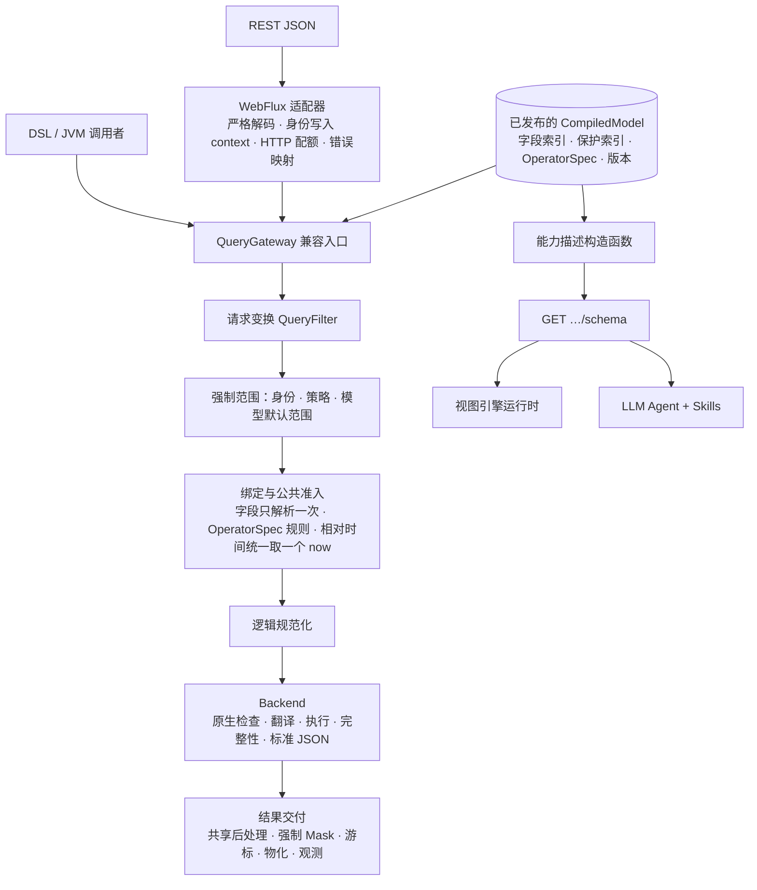

# 查询模块目标架构：单一能力真相、能力描述与 Agent 消费

日期：2026-09-24。基线：`origin/main` `f12ff5037`，Wow `9.1.x`。

状态：目标设计，尚未实施。第一批内部重构（见 [§11](#11-已完成的第一批)）已在本地分支完成，尚未合并。

本文在 [2026-09-08 查询模块整体架构重构设计](2026-09-08-query-architecture-redesign.md)（下称“09-08 设计”）的基础上演进，不推翻它的执行链、数据所有权和失败合同。它回答 09-08 设计没有覆盖的两个问题：

1. 查询能力的真相如何只定义一次，并同时服务后端准入、HTTP 元数据、视图引擎和 LLM Agent。
2. 视图定义由谁编写，如何保证它不越过服务端能力。

## 1. 兼容边界

兼容保证只覆盖下表列出的范围。表外一律不做兼容，以保持架构与代码干净：不保留过渡层、别名类、弃用路径或双格式。

| 范围 | 约定 |
|---|---|
| QueryGateway API | 十个公开方法及其返回形状保持不变 |
| RESTful 查询 API | 查询路由、请求 JSON、响应 JSON、状态码、错误码与错误文案保持不变 |
| legacy `condition`（REST 请求体） | 9.x 期间保留。10.0 是否移除，届时按外部客户端（尤其是 TS 客户端）的迁移进度决定 |
| Kotlin `Condition` API：`Condition`、`Operator`、`condition {}`、接受 `Condition` 的构造器与扩展 | 9.x 期间保留，维持现状：已弃用、只在边界转换为 `FilterExpression`、不进入核心。10.0 移除 |
| 新 DSL（`singleQuery {}` 等查询构建入口、`filter {}`、执行扩展）的源码兼容 | 待确认（§13）；推荐纳入保证 |
| 会改变 REST 返回结果的安全修复（例如取不到范围时由放行改为拒绝、State 路由补脱敏） | 默认保持旧行为，新行为通过显式配置启用 |
| `GET …/snapshot/schema`、`GET …/event/schema` 的响应 | 不属于兼容约定，按本文重新设计 |
| 其他：Backend、Filter、Policy SPI，Schema 内部类型，装配方式，公开的实现类名 | 不做兼容，直接修改或删除 |

## 2. 第一性原理

查询子系统做的事是：**在调用方身份的约束下，把针对逻辑模型的查询意图翻译成存储上的执行，并以逻辑模型的形状交付结果。**

由此推出以下约束：

1. **单一语义**：同一查询在 MongoDB 与 Elasticsearch 上结果一致。语义只定义一次，后端只负责翻译和原生检查。
2. **单一解析**：字段、类型、能力、作用域只解析一次，后续环节消费解析结果，不重复查找。
3. **单一能力真相**：某个字段能用哪些运算符、能否排序或聚合，只由一张表和一个公共规则函数决定。后端准入、HTTP 元数据、视图引擎、Agent 看到的是同一个结论。
4. **安全在构造上成立**：范围、策略、脱敏由 Gateway 固定执行，不依赖某个入口记得调用。
5. **变更局部**：新增运算符、模型、存储或治理规则时，各自只改一个位置，并由编译器强制穷尽。
6. **热路径不解释**：模型只编译一次；请求路径上不做反射，也不重建可复用的对象。

### 2.1 现状证据

- **能力真相被复制**：
  - 视图引擎的 `filter/kinds/*.ts` 手写了一张“字段类型 → 运算符”表。`sortable`、聚合函数、`missingKey` 规则、指标过滤禁止数组字段、限额常量也都是手写的。
  - Storybook 中的定义注释写明，这些定义是对照 `GET /…/snapshot/schema` “converted by hand”。
  - 服务端能力一变，前端只能在运行时收到 4xx。
- **元数据发布的是内部词汇**：现有 `QueryModelSchemaMetadata` 是一棵递归值树，每个节点带 `EXACT_MATCH`、`RANGE`、`AGGREGATE_TERMS` 等能力。消费者只能自己从能力推出运算符，等于复制一遍服务端 `QuerySchemaValidation` 的规则。
- **散弹式修改**：新增一个过滤运算符大约要改 13 个文件、涉及 5 个模块，其中只有 2 处由编译器强制。新增一个聚合指标也要改大约 13 个文件。
- **后端重复**：Mongo 与 ES 各自实现了作用域字段解析、游标排序解析、值转换、游标令牌、数组分支判断等逻辑。第一批重构已收敛其中一部分。

## 3. 与 09-08 设计的关系

| 09-08 结论 | 本文立场 |
|---|---|
| Schema 提供依据，Gateway 负责公共准入，Backend 负责原生检查与执行 | **保留**。原生限制（ES 特殊排序字段、Mongo 平行数组排序、Painless 等）继续由后端负责 |
| 公共 Query 从进入 Gateway 到 Backend 都使用逻辑字段，公共层不产生物理 AST | **保留**。本文的“绑定结果”只携带对已发布字段记录的引用，不改写字段名，也不构造原生结构（§5.2） |
| 元数据由公共规则函数派生出有效能力（A12），不另存一份许可 | **保留并扩展**：从“有效能力”扩展到“有效的运算符、排序、分组、函数和限额”（§6） |
| 元数据只表达与身份无关的静态能力 | **保留**。能力描述是模型级的；与身份相关的限制仍由每次订阅的授权执行 |
| HTTP 限额不成为进程内调用的隐式限制 | **保留**。能力描述中的限额由 HTTP 适配器填写，只描述 HTTP 入口（§6.3） |
| 不新增 Preparer、PreparedQuery、通用执行计划或通用规则引擎 | **大体保留**，有两处需要说明（§13）：<br/>`OperatorSpec` 是公共规则函数读取的数据表，不是可编程的规则引擎；<br/>第一批中的 `QueryPreparer` 是把 Gateway 的固定步骤提取成内部类，不是新的扩展阶段。推荐改为完整的准入单元 `QueryAdmission`（§13） |
| 不做查询优化器，不做结果缓存 | **保留**。除非基准测试证明必要，本文不引入计划缓存 |

## 4. 目标执行链



执行链的顺序、每次订阅的冷执行、取消与错误出口，都沿用 09-08 设计的 §3 至 §5。本文只改变准入之后各环节传递的信息，以及元数据的形态。

## 5. 单一能力真相

### 5.1 OperatorSpec

每个过滤运算符和聚合指标在 wow-query 中只有一份规格：

```kotlin
sealed interface OperatorSpec {
    val operator: FilterOperator
    val arity: Arity                        // 字段数与取值数
    val valueRule: ValueRule                // 取值如何对照字段的声明域检查
    val requiredCapability: QueryCapability // 需要的原生能力
    val cost: OperatorCost                  // 取代 EXPENSIVE_OPERATORS 等散落的判断
    val lowering: Lowering?                 // 规范化时如何降级，例如 IS_EMPTY_STRING
}
```

以下各方都读取这张表：

- 公共准入：取代 `QuerySchemaValidation` 中按运算符逐个手写的分支；
- 能力描述构造函数（§6）；
- HTTP 成本判断：取代 `HttpQueryGuard` 和 `FilterComplexity` 中的运算符清单；
- OpenAPI 与 JSON Schema 生成；
- TCK 语义矩阵（§8）。

新增运算符只需要改三处：AST 数据类（为 wire 格式）、`OperatorSpec`、各后端翻译器中的一个分支。后两处由 sealed 层次加穷尽的 `when` 强制，漏改就编译不过。

### 5.2 绑定结果

准入阶段对每个字段引用只解析一次，得到一个 `FieldRef`，其中包含逻辑路径、作用域，以及对已发布 `QueryFieldSchema` 的引用。后端按所需能力从 `FieldRef` 取绑定并翻译，不再反复调用 `schema.physicalField` 查找。

`FieldRef` 不改写字段名，不产生 `.keyword`、`_id` 之类的物理名称，也不构造原生结构，这与 09-08 设计 §7 一致。过去的“resolved 中间名加反向识别”方案之所以失败，是因为引入了另一套命名；这里的解析结果只是对已发布记录的引用。

### 5.3 模型专属语义

`QueryModelProfile`（第一批已实现）集中描述每个内置模型的记录布局：身份字段、payload 位置、payload 类型字段、默认范围、投影约束、系统字段声明。Gateway、准入、Masker、系统 schema 源和后端都从它读取这些信息，不再各自判断 `schema.model`。

### 5.4 字段别名、弃用与版本

保存的视图和 Agent 编写的定义都引用逻辑字段名，而且会长期存在。Catalog 因此要支持：

- **别名**：旧名映射到新字段，查询和描述都能识别；
- **弃用**：在描述中标记，供视图引擎提示、供 Agent 避开；
- **版本**：已发布的模型带内容哈希，描述以它作为 `version` 和 ETag。

## 6. 能力描述：重新设计的 `GET …/schema`

### 6.1 定位与原则

能力描述回答的问题是：**这份数据在这个入口上能被怎样查询**。它有两类消费者：

- **LLM Agent**：依据它编写视图定义和查询（§7）；
- **视图引擎运行时**：用它校验视图定义，并把视图的实际能力收窄到描述范围内（§7.3）。

设计原则：

1. **发布结论，不发布推导规则**：直接给出每个字段允许的运算符、排序、分组和函数，不对外暴露 `EXACT_MATCH` 这类内部能力词汇。
2. **全部派生**：由已发布模型、`OperatorSpec` 和公共规则函数计算，与准入同源。描述里允许的，准入一定放行；准入拒绝的，描述里一定不列出。
3. **扁平的字段索引**：按逻辑路径列出字段，元素作用域、动态键和事件变体都显式标出。
4. **语义充分**：带上 description、枚举值和时间编码，来源是领域模型的注解与 KDoc。**显示名不由服务端提供**，由 Agent 写进视图定义（§7.1）。
5. **带版本**：`version` 是内容哈希；响应带 ETag，支持 `If-None-Match` 并返回 304。
6. **不泄露实现**：不暴露物理字段名、原生类型或绑定细节；内容与调用方身份无关（09-08 设计 §8）。
7. **能力取决于运行时的存储**：同一份代码在不同环境的 ES mapping 或 Mongo validator 下，可能得到不同的描述。因此描述只能在运行时从目标环境获取，不能在构建期生成。

### 6.2 形态

路径保持 `GET /{aggregate}/snapshot/schema` 与 `GET /{aggregate}/event/schema` 不变，响应体换成下面的结构：

```jsonc
{
  "model": "SNAPSHOT",
  "version": "sha256:…",
  "record": {
    "identity": "aggregateId",
    "paging": ["PAGED", "CURSOR"],
    "maxWindow": 10000,              // 存储的偏移分页窗口，例如 ES 的 from+size；无此限制时为 null
    "search": { "modes": ["TERMS", "PHRASE"] },
    "defaultScope": "ACTIVE"         // Snapshot 默认只查询未删除的记录
  },
  "limits": {                        // 由 HTTP 适配器填写，只描述 HTTP 入口
    "maxPageSize": 1000,
    "maxFilterNodes": 256,
    "maxFilterValues": 1000,
    "aggregation": { "maxGroups": 5, "maxMetrics": 20, "maxElements": 2, "maxLimit": 10000 }
  },
  "fields": [
    {
      "path": "state.amount",
      "type": "DECIMAL",
      "array": false,
      "nullable": false,
      "semantic": null,              // 时间字段示例：{ "temporal": { "epoch": "MILLISECONDS" } }
      "enum": null,                  // 枚举示例：[{ "value": "PAID", "description": "…" }]
      "description": "Order total in CNY.",
      "masked": false,
      "project": true,
      "filter": { "operators": ["EQ", "NE", "GT", "GTE", "LT", "LTE", "BETWEEN", "IN", "NOT_IN", "IS_NULL", "IS_NOT_NULL"] },
      "sort": { "paged": true, "cursor": false },
      "aggregate": {
        "groups": ["TERMS", "HISTOGRAM"],
        "functions": ["SUM", "AVG", "MIN", "MAX", "STDDEV", "VARIANCE", "MEDIAN"],
        "distinctCount": true,
        "percentile": true,
        "any": false
      },
      "scope": null,                 // 元素内的字段填所属元素的路径，例如 "state.items"
      "deprecated": null,            // 示例：{ "replacement": "state.total", "since": "9.2.0" }
      "aliases": []
    }
  ],
  "elements": [
    { "path": "state.items", "filter": true, "aggregate": true }
  ],
  "dynamic": [
    { "pattern": "tags.{key}", "type": "STRING", "array": true, "filter": { "operators": ["IN", "EXISTS", "NOT_EXISTS"] } }
  ],
  "variants": null
}
```

EventStream 模型用 `variants` 按事件类型描述 payload。视图引擎的事件流视图和 Agent 都据此先选事件类型，再给出该类型下的字段：

```jsonc
"variants": {
  "discriminator": "body.bodyType",
  "values": [
    { "value": "OrderCreated", "description": "…", "fields": [ /* body.body.* 在该事件下的字段 */ ] }
  ]
}
```

### 6.3 限额的归属

- `record.maxWindow` 等存储约束，来自后端的原生事实。
- `limits` 来自 HTTP 适配器的配置，只出现在 HTTP 描述中，不会成为进程内 Gateway 调用的隐式限制（09-08 设计 §10）。
- 进程内的调用方如果需要预算，应使用显式配置，不要从描述推断。

### 6.4 `/schema/refresh`

**已决定（2026-09-24）**：刷新移到管理端点，数据面上的 `POST …/snapshot/schema/refresh` 与 `POST …/event/schema/refresh` 直接删除，不保留过渡路由。

- 理由：刷新改的是单个实例内存中的 schema。挂在数据面上时，请求经负载均衡只落到一个副本，其余副本仍使用旧 schema。管理端点按实例访问、有独立的安全配置，能让“逐个实例刷新”这一事实显式化。
- 这两个路由几乎没有消费者，因此不设过渡期。
- 新增 actuator 端点 `wowQuerySchema`：读操作返回各聚合、各模型的描述版本，写操作触发刷新。
- 后续可选：定期校验存储元数据，schema 版本变化时自动刷新。

## 7. 视图定义与 LLM Agent

### 7.1 决定

- 视图定义**不由生成器生成**。生成器只能搬运能力，做不了取舍；它产出的“全部字段平铺”没有人会直接使用。
- 视图定义**由 LLM Agent 依据业务场景编写**。Agent 读取能力描述（事实），结合业务要求（意图），产出定义代码，再由人在 PR 中审查。“定义是代码”这条原则保持不变。
- **显示名由 Agent 写进定义**：中英双语同步，使用业务受众的词汇（例如分析视图用维度、指标、记录数这类分析师的说法）。服务端只提供 description 等语义素材。
- wow-generator 继续生成字段名类型（来自 `x-wow-query-fields`），作为定义的编译期护栏：字段名写错时，TypeScript 会直接报错。

### 7.2 定义的构成

```
DataViewDefinition = 能力层 ⊕ 呈现层
  能力层：Agent 按描述选取的字段、运算符、排序、分组、函数（只能是描述允许的子集）
  呈现层：显示名、字段分组、格式、默认列与排序、系统视图、仪表盘
```

**只收窄、不放宽**：定义可以隐藏字段、减少运算符、缩小页大小，但不能声明描述中没有的能力。

### 7.3 确定性校验：Agent 负责编写，校验器负责兜底

LLM 的输出只能被验证，不能被信任。视图引擎提供两道确定性检查：

1. **`validateDefinition(definition, descriptor)`**，在开发阶段和 CI 中运行，检查：
   - 每个字段都存在，或能经别名映射到现有字段；
   - 运算符、排序、分组、函数都是描述允许的子集；
   - 各项取值不超出描述中的限额；
   - 定义里记录的 `schemaVersion` 与描述不一致时，报告漂移。
2. **运行时交集**：实际生效的能力 = 定义声明的能力 ∩ 当前环境的描述（按 `version` 缓存）。
   - 存储能力随部署变化时，受影响的控件降级提示，而不是等用户操作后收到 4xx。
   - 打开已保存的视图时也对照描述：字段有别名就迁移过去，字段已失效就提示。

### 7.4 Skills

两个 Skill 都放在仓库的 `skills/` 目录下，并配有 evals（参照 `skills/wow-review/evals` 的写法）。按 `skills/README.md` 的规则，每个任务只选一个主 Skill，所以要把边界写清楚：

| Skill | 主要交付 | 边界 |
|---|---|---|
| `wow-view-definition` | 依据业务场景和能力描述，编写或修订视图引擎的视图定义（Record、Analysis、Dashboard、系统视图）及对应故事 | 不写运行时查询客户端代码（属于 `wow-client`）；不改视图引擎本身 |
| `wow-query` | 读取目标服务的能力描述，为业务数据问题编写并执行查询（FilterExpression、分页、游标、聚合），并解释查询结果 | 不写 TypeScript 应用代码（属于 `wow-client`）；不改服务端查询实现（属于 `wow-develop`） |

`wow-view-definition` 的工作流：

1. 从目标环境（开发或预发）拉取能力描述，存成文件，记下 `version`。
2. 明确业务场景：目标用户是谁、要回答什么问题、常用哪些筛选和分析。
3. 选取字段，映射到视图的 FieldKind，写中英显示名，划分字段分组。
4. 设定默认列、排序、分页方式，以及系统视图。
5. 在描述允许的范围内选定分析能力：维度、指标、函数、元素、限额。
6. EventStream 模型按 `variants` 区分各事件类型的字段。
7. 编写故事，运行 `validateDefinition`、typecheck 和故事测试，全部通过后交付。

evals 覆盖以下典型失败：编造字段；放宽能力；把脱敏字段用作分组或指标；EventStream 不区分事件类型；显示名使用技术词汇；使用已弃用的字段。

验收方式：用 `wow-view-definition` 重写 Storybook 中现有的手抄定义（compensation、customer、tradeOrder、productPricing 及其事件流定义），替换后的故事与校验全部通过。

### 7.5 视图引擎侧的相应调整

以下工作由负责视图引擎的会话执行，本文只列出接口：

- 新增 `fromDescriptor` 映射：把服务端的 type 与 semantic 映射成视图的 FieldKind。这属于呈现决策，所以放在视图引擎。同时新增 `validateDefinition` 和运行时交集。
- 删除与描述重复的手写能力：运算符表、`sortable` 规则、`AnalysisCapability.fields/limits`、`RecordCapability.paging/maxWindow` 等声明，以及写死的限额常量。
- 视图引擎设计文档中“定义生成（由 wow-generator 生成 ViewDefinition）”这一后续方向，改为本节描述的 Agent 编写方式。

## 8. 语义规范与一致性

运算符在 null、缺失、数组、大小写等维度上的语义，写成一张规范表，和 `OperatorSpec` 放在一起维护，并由它生成 TCK 用例矩阵。MongoDB 与 Elasticsearch 必须全部通过。

已知的分歧（IS_EMPTY、IS_NULL、IS_NOT_NULL、ENDS_WITH、SEARCH），按 2026-09-23 已确认的决定处理：以现行 MongoDB 行为为准，ES 对齐。能力描述只列出两个后端都满足规范的运算符。某个后端做不到时，就由它的原生能力不授予该运算符，而不是先在描述里出现、到运行时再失败。

## 9. 扩展点

| SPI | 扩展什么 | 说明 |
|---|---|---|
| `QueryModelProfile` | 查询模型 | 目前为 sealed，只有两个内置模型；有真实需求时再开放 |
| `QuerySchemaSource` | 逻辑定义的来源 | 保留 |
| Backend 与 Schema Adapter | 存储 | Backend 接收绑定结果（§5.2），只负责原生检查、翻译与执行 |
| `QueryFilter` / `QueryPolicy` | 请求变换与强制治理 | `QueryContext` 增加 `QueryType`；按模型选择 Filter 改为显式声明，不再依赖 `@FilterType` 反射 |
| `QueryObserver` | 观测 | 保留 |

having、top-N、dense 补空这类针对小结果集的后处理，实现为 wow-query 中的共享纯函数，由需要的后端调用（例如 ES 的客户端求值）。不引入由引擎决定是否下推的计划层。

## 10. 模块布局

```
wow-api             查询 AST 与 wire 格式（冻结）
wow-query-dsl       DSL 构建器，客户端可用，不依赖查询运行时（是否拆分待定）
wow-query           Catalog · 准入 · 治理 · OperatorSpec · 能力描述 · 结果交付 · SPI
wow-tck             语义矩阵与后端一致性规格
wow-mongo、wow-elasticsearch
                    Schema Adapter 与 Backend
wow-webflux         HTTP 适配器，负责填写描述中的 HTTP 限额
wow-openapi         契约由 Catalog 与 OperatorSpec 派生
skills/             wow-view-definition、wow-query
```

## 11. 已完成的第一批

以下改动已在本地分支完成：全仓 `allLocalTest`、`allContractTest` 与 detekt 通过；Mongo/ES 集成测试没有在本地运行，要靠 CI。

- **`claude/query-module-refactor-746705`**：
  - 新增 `QueryModelProfile`；把 Gateway 的准备步骤提取为内部类；
  - 后端共享 `scopedPhysicalField`、`physicalCursorSort`、`hasArrayBranch`，删除 `execute*` 转发层；
  - Mongo/ES 编译器改为穷尽分派，`AggregationExpression` 改为 sealed；
  - 指标过滤校验移入 `validateQuery`；ES 的 pager 每个后端只创建一次；
  - `QueryMaskDefinition` 移入 schema 包，消除 schema 与 mask 之间的包循环。
- **`claude/query-refactor-webflux`**：
  - 合并 handler 模板与工厂基类；
  - `FilterComplexity` 移入 wow-query，改为穷尽分派；
  - ObjectReader 只创建一次；统一 Gateway 的 bean 名；wow-webflux 显式依赖 wow-query。

## 12. 演进顺序

每一步都可以单独交付，并以 TCK 和集成测试把关。

1. **合并第一批**的两条分支（§11）。
   - 解耦 Condition 的两个面：REST 请求体中的 `condition` 改由 `QueryJsonDeserializer` 内部的私有 DTO 解析，不再依赖公开的 `Condition` 类型。这样 REST wire 与 Kotlin API 可以在 10.0 各自决定去留；9.x 期间两者都保留（§1）。
2. **垂直切片：OperatorSpec 与能力描述**
   - 服务端：`OperatorSpec` 表，让准入与描述同源；重做 `/schema` 响应（§6）；把 description 从注解与 KDoc 透传到描述。
   - 视图引擎（由视图引擎会话执行）：`fromDescriptor`、`validateDefinition`、运行时交集。
   - Skills：`wow-view-definition` 与 `wow-query` 及其 evals；用 `wow-view-definition` 重写现有 Storybook 定义，作为验收。
3. **Catalog**：`CompiledModel` 纳入字段别名、弃用与版本。
4. **绑定结果**：准入产出 `FieldRef`，后端改为消费它；过滤条件在 Gateway 中只规范化一次，使用同一个 `now`。
5. **后端收敛**：
   - ES 的身份字段与 nested 路径改由 Schema 绑定表达，并修复写死 `body.` 的嵌套排序疑点（先用失败用例确认）；
   - 游标令牌改为共享实现，并带上查询指纹，不兼容旧格式（§13）；
   - 拆分 `ElasticsearchQuerySchemaAdapter` 与 `ElasticsearchAggregationPager`；
   - 聚合的元素作用域解析与后处理改为共享实现。
6. **语义矩阵**：TCK 由 `OperatorSpec` 生成运算符矩阵，并完成 ES 与 Mongo 的语义对齐。
7. **模块**：根据消费者的需要，决定是否拆出 `wow-query-dsl`，让 wow-apiclient 不再经 wow-openapi 依赖查询运行时。

安全与正确性待办（State 路由脱敏、范围取不到时放行全部数据、严格根过滤、Mongo 指标过滤比较缺少类型保护等），按兼容约定处理：默认保持现行为，新行为通过配置启用。

## 13. 决定与待确认事项

已决定：

1. **`/schema/refresh`**（2026-09-24）：移到管理端点，删除数据面路由，不保留过渡层（§6.4）。
2. **`wow-query-dsl`**（2026-09-24）：暂不拆分，放到第 7 步与 wow-openapi 的依赖清理一起做。客户端依赖查询运行时，是经 `wow-openapi → wow-query` 带入的，只拆 DSL 解决不了问题；契约改为从 Catalog 派生之后，边界才看得清，届时一次拆到位。
3. **游标**（2026-09-24）：
   - 令牌加入查询指纹，覆盖排序字段、方向和过滤结构；指纹不匹配就明确拒绝，不静默返回错误结果。
   - 不加签名。游标只包含排序字段的值，被保护的字段本就不能作为游标排序；伪造游标的效果等同于自己写一个范围过滤条件，拿不到额外数据。签名的收益抵不上多副本密钥管理的成本。
   - 不兼容旧格式：游标 API 刚上线、尚未稳定，直接切换到新格式，旧令牌一律按无效游标拒绝。

推荐方案，待确认：

- **新 DSL 的源码兼容**：推荐纳入保证。DSL 是 Kotlin 用户调用 QueryGateway 的主要入口，查询构建入口、`filter {}` 与执行扩展都直接服务于 Gateway；内部重构基本不会碰到它，保持兼容几乎没有成本。

4. **准入单元**：把第一批中的 `QueryPreparer` 改为内部的 `QueryAdmission`，把最终公共校验（含游标的唯一排序）一并纳入，使“后端只收到已准入的查询”这一不变量只有一个所有者。
   - 内部分为 `rewrite`（普通 Filter，扩展点）与 `enforce`（强制范围与策略，终端，不可覆盖）两个阶段，接着追加模型默认范围，最后执行各操作专属的 `finalize`（校验）。
   - Gateway 只负责取得 schema、准入、调用后端，以及交付结果（脱敏、物化、观测）。
   - 这是对 09-08 设计“不新增 Preparer”一句的明确修订。09-08 反对的是新的扩展阶段或 SPI，以及跨层传递的准入凭证；`QueryAdmission` 两者都不是：它是 `internal` 的，返回普通 Query，不对外开放扩展。改名则是为了与扩展点 `QueryFilter.prepare` 区分开。
   - §5.2 的绑定结果（`FieldRef`）以后也在准入阶段产生。
   - 补充准入不变量的直接测试：普通 Filter 不能移除策略条件；默认范围在策略之后追加；校验在最后执行；`prepare` 返回空是协议错误；准入阶段取消时后端调用次数为零。
5. **Mongo 指标过滤比较缺少类型保护**：作为缺陷直接修复，不加开关。`lt` 会把字段缺失或为 null 的记录计入，结果与语义规范不符，也与 ES 不一致。“新行为放到开关后面”的约定针对的是安全收紧，不适用于纠正错误结果。修复时补充 TCK 用例，并在发布说明中写明。

## 14. 验收标准

- **能力真相只有一处**：视图引擎和 Skills 中不再有手写的运算符表、能力规则或限额常量。描述与准入对同一查询给出一致的结论，并有专门的测试比对。
- **新增运算符的改动面**：除 AST 数据类外，只有 `OperatorSpec` 和各后端翻译器需要修改，漏改会导致编译失败。
- **Agent 产出可验证**：用 `wow-view-definition` 产出的定义全部通过 `validateDefinition`；evals 列出的每类失败都能被校验器或评审发现。
- **兼容性锁定**：QueryGateway 与 REST 查询路由的兼容性测试全部通过，并有错误文案契约测试锁住现有文案。
- **后端一致**：Mongo 与 ES 通过同一份 TCK 语义矩阵。
