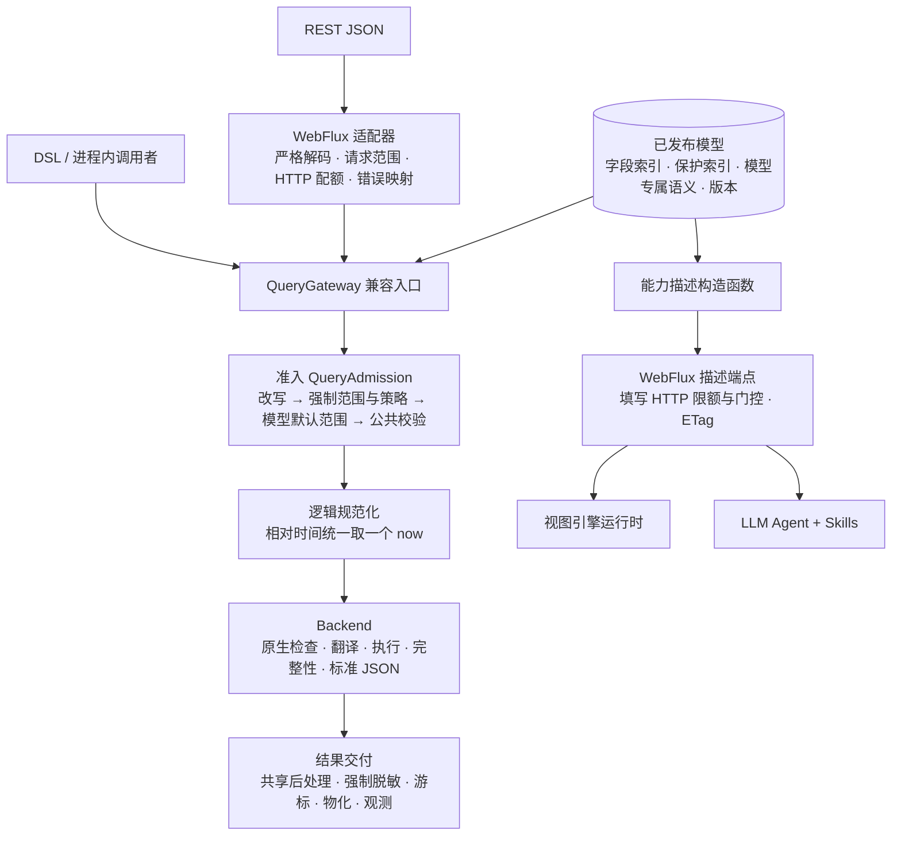
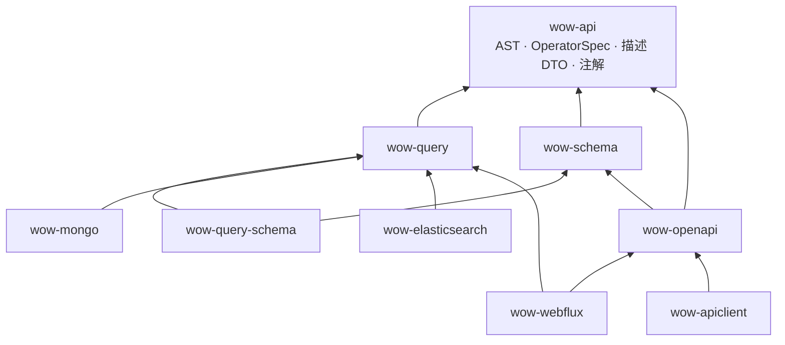

# 查询模块目标架构：单一能力真相、能力描述与 Agent 消费

日期：2026-09-24。基线：`origin/main` `73c8b8c70`，Wow `9.1.x`。

状态：目标设计，尚未实施。第一批内部重构（[§11](#11-已完成的第一批)）已在本地分支完成，尚未合并。[§13](#13-决定与待确认事项) 列出已作的决定与仍待确认的推荐方案；正文按推荐方案书写，凡依赖待确认事项的地方都标注了编号。

本文在 [2026-09-08 查询模块整体架构重构设计](2026-09-08-query-architecture-redesign.md)（下称“09-08 设计”）的基础上演进，不推翻它的执行链、数据所有权和失败合同。它回答 09-08 设计没有覆盖的两个问题：

1. 查询能力的真相如何只定义一次，同时服务后端准入、HTTP 元数据、视图引擎和 LLM Agent。
2. 视图定义由谁编写，如何保证它不越过服务端能力。

## 0. 术语

| 术语 | 含义 |
|---|---|
| Catalog | 一个聚合、一个查询模型的逻辑定义与其发布过程：合并各来源的声明、绑定存储事实、产出不可变的已发布模型 |
| 已发布模型（`CompiledModel`） | 某一时刻发布的完整模型快照：字段索引、保护索引、模型专属语义、内容版本。现有 `QueryModelSchema` 是它的前身 |
| `OperatorSpec` | 每个过滤运算符、聚合指标与分组的唯一规格表（§5.1） |
| 准入（`QueryAdmission`） | Gateway 在调用后端之前决定“这次订阅允许执行的查询是什么”的完整步骤（§13 C1） |
| 能力描述 | 重新设计后的 `GET …/schema` 响应（§6） |
| 协议限额 / HTTP 限额 | 前者是 wow-api 中写死、对任何调用方都成立的上限；后者是 HTTP 入口的可配置上限（§6.3） |
| 进程内可信调用方 | 不经 HTTP、直接调用 QueryGateway 的应用代码，例如 cocache、compensation、saga（§10.2） |

## 1. 兼容边界

原则：**只保证下表中标为“保证”的范围，其余一律不做兼容**，以保持架构与代码干净，不保留过渡层、别名类、弃用路径或双格式。对刚发布、还没有真实消费者的面，不做兼容。

| 范围 | 约定 |
|---|---|
| QueryGateway API | **保证**：十个公开方法及其返回形状不变 |
| RESTful 查询 API | **保证**：查询路由、请求 JSON、响应 JSON、状态码、错误码及其 HTTP 状态映射、错误文案不变。查询相关错误码（`QuerySchema*` 的 `ERROR_CODE`）即使所在类移动也保持取值与映射 |
| 新 DSL：查询构建入口（`singleQuery {}`、`listQuery {}`、`pagedQuery {}`、`cursorQuery {}`、`aggregation {}`）、`filter {}`、`projection {}`、`sort {}`、`pagination {}`、执行扩展（`query(gateway)` 等） | **保证源码兼容**：已有代码升级后无需修改即可编译，构造出的查询含义不变；可以新增函数或带默认值的参数。不保证二进制兼容 |
| legacy `condition`（REST 请求体） | 9.x 期间保留。10.0 是否移除，届时按外部客户端（尤其是 TS 客户端）的迁移进度决定 |
| Kotlin `Condition` API：`Condition`、`Operator`、`condition {}`、接受 `Condition` 的构造器与扩展 | 9.x 期间保留，维持现状：已弃用、只在边界转换为 `FilterExpression`、不进入核心。10.0 移除 |
| 会改变 REST 返回结果的安全修复（例如取不到范围时由放行改为拒绝、State 路由补脱敏） | 默认保持旧行为，新行为通过显式配置启用 |
| 纠正错误结果的修复（例如 Mongo 指标过滤比较，§13 C2） | 待确认：推荐直接修复、写入发布说明 |
| `GET …/snapshot/schema`、`GET …/event/schema` 的响应 | 不兼容，按 §6 重新设计；wow-api 中现有的元数据类型（`api/query/schema/QueryModelSchemaMetadata` 等）随之替换 |
| `POST …/schema/refresh`（两个模型） | 删除，改由管理端点提供（§6.4） |
| 游标令牌格式 | 不兼容：改为带查询指纹的新格式，旧令牌一律按无效游标拒绝（§13 已决定 3） |
| Spring 配置属性名（`wow.webflux.query.*`、`wow.elasticsearch.query.*` 等） | 不兼容，可直接改名或调整 |
| 查询 schema 声明文件（classpath 与工作目录下的 JSON、旧路径 `wow-query-schema/…`） | 不兼容：按新架构重新设计，旧路径直接删除 |
| 脱敏注解（`@Masking`、`@Mask`、`@KeepMask`）与 `@QueryTemporal` | 不兼容，按 §5.5 重新设计。纪律：旧写法必须编译失败，不得保留同名注解承载新语义 |
| KSP 生成的 `*Properties` 字段名常量 | 待确认（§13 C8）：推荐保证源码兼容。它已发布一年以上，是新 DSL 的实际用法 |
| wow-apiclient 查询客户端 | 待确认（§13 C9）：推荐保证源码兼容 |
| 其他：Backend、Filter、Policy SPI，Schema 内部类型，装配方式，公开的实现类名 | 不做兼容，直接修改或删除 |

## 2. 第一性原理

查询子系统做的事是：**在调用方身份的约束下，把针对逻辑模型的查询意图翻译成存储上的执行，并以逻辑模型的形状交付结果。**

由此推出以下约束：

1. **单一语义**：同一查询在 MongoDB 与 Elasticsearch 上结果一致。语义只定义一次，后端只负责翻译和原生检查。
2. **单一解析**：字段、类型、能力、作用域只解析一次，后续环节复用解析结果。
3. **单一能力真相**：某个字段能用哪些运算符、能否排序或聚合，只由一张规格表和一个公共规则函数决定。后端准入、HTTP 元数据、视图引擎、Agent 看到的是同一个结论。
4. **安全在构造上成立**：范围、策略、脱敏由 Gateway 固定执行，不依赖某个入口记得调用。
5. **变更局部**：新增运算符、模型、存储或治理规则时，改动集中且由编译器强制穷尽。
6. **热路径不解释**：模型只编译一次；请求路径上不做反射，也不重建可复用的对象。

### 2.1 现状证据

- **能力真相被复制**：
  - 视图引擎的 `filter/kinds/*.ts` 手写了一张“字段类型 → 运算符”表；`sortable`、聚合函数、`missingKey` 规则、指标过滤禁止数组字段、限额常量也都是手写的。
  - Storybook 中的定义注释写明，这些定义是对照 `GET /…/snapshot/schema` “converted by hand”。
  - TS wow-client 另有一份运算符枚举与聚合限额常量。
  - 服务端能力一变，前端只能在运行时收到 4xx。
- **元数据发布的是内部词汇**：现有 `QueryModelSchemaMetadata` 是一棵递归值树，每个节点带 `EXACT_MATCH`、`RANGE`、`AGGREGATE_TERMS` 等能力。消费者只能自己从能力推出运算符，等于复制一遍服务端 `QuerySchemaValidation` 的规则。
- **散弹式修改**：新增一个过滤运算符要改动的位置包括：
  - wow-api：`FilterOperator`、`QueryProtocol`、过滤数据类与 `@JsonSubTypes`；
  - DSL：`FilterDsl`；
  - wow-query：`FilterNormalizer`、`QuerySchemaValidation`、`MetricFilterValidation`；
  - 两个后端的编译器；
  - HTTP 成本判断；
  - 两份手写的 JSON Schema：`schema/query/v2/filter-expression.schema.json`（286 行，经 wow-schema 成为 OpenAPI 中 `FilterExpression` 的 schema），以及 `schema/query/definitions.schema.json`；
  - TS wow-client 的运算符枚举与多语言文案；视图引擎的运算符表；文档。

  其中只有校验与后端编译器由编译器强制。新增一个聚合指标的情况类似。
- **后端重复**：Mongo 与 ES 各自实现了作用域字段解析、游标排序解析、值转换、游标令牌、数组分支判断等逻辑。第一批重构已收敛其中一部分。

## 3. 与 09-08 设计的关系

| 09-08 结论 | 本文立场 |
|---|---|
| Schema 提供依据，Gateway 负责公共准入，Backend 负责原生检查与执行 | **保留**。原生限制（ES 特殊排序字段、Mongo 平行数组排序、Painless 等）继续由后端负责 |
| 公共 Query 从进入 Gateway 到 Backend 都使用逻辑字段，公共层不产生物理 AST；不引入跨层 PreparedQuery | **保留**。后端仍接收普通 Query；“字段只解析一次”通过按已发布模型缓存解析结果实现，不向后端传递绑定结果（§5.2，§13 C4） |
| 元数据由公共规则函数派生出有效能力（A12），不另存一份许可 | **保留并扩展**：从“有效能力”扩展到“有效的运算符、排序、分组、函数和限额”（§6） |
| 元数据只表达与身份无关的静态能力，“不为跨字段组合背书”，“不是未来查询的许可票据” | **保留**。能力描述是**必要条件**：列出的单项在孤立使用时可被准入，组合约束另行声明，运行时仍可能拒绝（§6.1） |
| HTTP 限额不成为进程内调用的隐式限制 | **保留**。描述中的 HTTP 限额由 HTTP 适配器填写，只描述 HTTP 入口（§6.3） |
| 不新增 Preparer、PreparedQuery、通用执行计划或通用规则引擎 | **大体保留**，有两处说明：<br/>`OperatorSpec` 是公共规则函数读取的数据表，不是可编程的规则引擎；<br/>第一批中的 `QueryPreparer` 推荐改为完整的内部准入单元 `QueryAdmission`（§13 C1）。它不是扩展阶段，也不是跨层凭证 |
| 不做查询优化器，不做结果缓存 | **保留**。除非基准测试证明必要，本文不引入计划缓存 |

## 4. 目标执行链



执行链的顺序、每次订阅的冷执行、取消与错误出口，都沿用 09-08 设计的 §3 至 §5。

## 5. 单一能力真相

### 5.1 OperatorSpec

**位置**：放在 wow-api，与 `FilterOperator`、`QueryCapability` 放在一起（§13 C3）。它是协议元数据，不含运行时逻辑。wow-query、wow-schema、wow-openapi 都能依赖它，而不必依赖查询运行时。

**形态**：过滤运算符、聚合指标和分组各有一类规格，覆盖所有枚举值：

```kotlin
sealed interface FilterOperatorSpec {
    val operator: FilterOperator
    val target: OperatorTarget          // FIELD（针对字段）或 MODEL（模型级，如不指定字段的 SEARCH、ID、TENANT_ID、DELETION）
    val arity: Arity                    // 字段数与取值个数
    val valueRule: ValueRule            // 取值如何对照字段的声明域检查，例如“单值字符串”“集合”“时间语义”
    fun requiredCapability(value: FilterValue): QueryCapability  // 可随取值变化：EQ null 需要 PRESENCE
    val cost: OperatorCost              // 取代 HTTP 成本判断中的运算符清单
    val lowering: Lowering?             // 规范化时如何降级，例如 IS_EMPTY_STRING
}

sealed interface MetricSpec { /* COUNT、NUMERIC、ANY、DISTINCT_COUNT、PERCENTILE、DERIVED */ }
sealed interface GroupSpec { /* TERMS、HISTOGRAM、DATE_HISTOGRAM */ }
```

- **覆盖由编译器保证**：通过对 `FilterOperator`、指标类型与分组类型的穷尽 `when` 取得规格，漏写一个枚举值就无法编译。
- **迁移依据**：实施时附一张对照表，把 `QuerySchemaValidation`、`MetricFilterValidation` 的每一个现有分支映射到规格，以证明规格能表达全部现有规则。已知必须覆盖的规则包括：
  - EQ/NE 取值为 null 时需要 PRESENCE，取值为数组时逐个元素检查；
  - DistinctCount 接受 TERMS 或 NUMERIC 任一能力；
  - 不指定字段的 SEARCH 是模型级能力；
  - ID、TENANT_ID、DELETION 等映射到模型专属的系统字段（§5.3）；
  - IS_EMPTY 要求集合；IS_EMPTY_STRING 与 `missingKey` 要求单值字符串；
  - 相对时间要求时间语义；
  - 被保护字段禁止用于分组、字段指标、算术引用和游标排序。

以下各方都读取这张表：

- 公共准入：取代 `QuerySchemaValidation` 中按运算符逐个手写的分支；
- 能力描述构造函数（§6）；
- HTTP 成本判断：取代 `HttpQueryGuard` 与 `FilterComplexity` 中的运算符清单；
- JSON Schema 生成：`FilterExpression` 的请求 schema 由它生成（§10.1）；
- TCK 语义矩阵（§8）；
- TS 客户端一致性测试的对照基准（§13 C10）。

**新增运算符的改动面**：
- 由编译器强制的：`FilterOperatorSpec`、各后端翻译器；
- 按兼容约定必须新增的：AST 数据类与 wire 注解、DSL 函数（新 DSL 保证源码兼容，新增运算符要新增对应函数）；
- 由测试兜底的：生成的 JSON Schema（CI 比对差异）、TS 客户端（一致性测试）、文档。

### 5.2 字段只解析一次

准入阶段要解析每个字段引用：逻辑路径、作用域、所需能力对应的物理绑定。后端编译时需要同样的结果。

- 做法：已发布模型持有一个**按字段与作用域缓存的解析器**。准入和后端都调用它，同一个字段在同一个已发布模型上只解析一次。
- 后端仍接收普通 Query，不引入新的 SPI 输入类型，也不向后端传递“绑定结果”。这遵守 09-08 设计 §7 与“不引入跨层 PreparedQuery”的约定。
- 不用 AST 节点做缓存键：AST 节点是 data class，不同 `ELEMENT_MATCH` 作用域中写法相同的条件会判为相等。缓存键用“字段路径 + 作用域路径 + 能力”。
- 动态键字段（Map 的任意键）数量不受控，缓存必须有上限。

### 5.3 模型专属语义

`QueryModelProfile`（第一批已实现）集中描述每个内置模型的记录布局：身份字段、payload 位置、payload 类型字段、默认范围、投影约束、系统字段声明。Gateway、准入、Masker、系统 schema 源和后端都从它读取这些信息，不再各自判断 `schema.model`。它是 sealed 的内部类型，不是扩展点。

### 5.4 字段别名、弃用与版本

保存的视图和 Agent 编写的定义都引用逻辑字段名，而且会长期存在。Catalog 因此要支持别名、弃用与版本。

**别名的语义**：

| 场景 | 规则 |
|---|---|
| 请求 | 过滤、排序、投影、聚合中都可以使用别名，准入时换成规范名 |
| 响应与投影结果 | 只出现规范名 |
| 游标指纹、排序唯一性 | 按规范名计算 |
| 保护判断 | 按规范名判断；别名不能绕过规范名上的敏感等级 |
| 能力描述 | 字段以规范名列出，`aliases` 列出其别名 |
| `x-wow-query-fields`（OpenAPI） | 只列规范名 |

**弃用**：在描述中标记，供视图引擎提示、供 Agent 避开；已弃用的字段仍可查询，直到被移除。

**版本**：见 §6.4。

### 5.5 字段注解

字段的查询元数据用细粒度、单一职责的注解表达，与 Wow 现有注解的风格一致（`@AggregateId`、`@TenantId`、`@Description`）。不使用一个装满可选参数的统一注解。名字 `QueryField` 已被查询 AST 的字段引用类型占用（出现在 136 个文件中），不能再用。

| 事实 | 注解 | 说明 |
|---|---|---|
| 时间编码 | `@QueryTemporal` | 保留名字，扩展为同时支持时间戳单位与格式化 pattern（补上 `Temporal.Formatted` 没有注解的缺口）。标准时间类型（`Instant`、`LocalDate`、`OffsetDateTime` 等）自动推断，不需要注解 |
| 字段别名 | `@QueryAlias("state.oldName", …)` | 新增 |
| 字段弃用 | Kotlin 标准的 `@Deprecated` | 字段要被移除时，代码中的引用都会出现警告，这正是期望的效果 |
| 字段说明 | Wow 的 `@Description`，或 `@Schema(description)` | 不新增。**不读取 KDoc**：运行时拿不到，而且 KDoc 面向开发者，公开会泄露实现信息 |
| 敏感等级 | `@Sensitive(level = …, mask = …)` | 新增，取代 `@Masking`、`@Mask`、`@KeepMask` |

`@Sensitive` 把两件事分开：

- **敏感等级**是数据治理的事实，必须以字段注解声明。不允许用声明文件或 DSL 的字符串路径声明，因为字段改名后规则会静默失效，等于数据泄露。等级有两级：
  - `DISPLAY`：结果中遮挡，仍可过滤与排序（现有 `@Mask` 的语义）；
  - `CONFIDENTIAL`：结果中遮挡，并禁止过滤、排序、聚合，以堵住用过滤条件反推原值的漏洞（安全待办 P1-5）。
- **遮挡方式**是展示策略：内置“全部遮挡”与“保留前后缀”，并保留可扩展的 `MaskStrategy`。注解参数只能是常量、枚举、注解或 KClass，具体参数形式在实施时确定。
- 按调用方身份决定是否遮挡，作为后续能力，走 `QueryPolicy` 一类的 SPI。字段注解只描述事实，不描述谁能看。

示意：

```kotlin
data class OrderState(
    @Description("下单时间")
    @QueryTemporal(timeUnit = TimeUnit.MILLISECONDS)
    val createTime: Long,

    @QueryAlias("state.buyerPhone")
    @Sensitive(level = SensitivityLevel.CONFIDENTIAL /* , mask = … */)
    val phone: String,
)
```

仓库内的使用者（compensation 领域）随实施一起迁移。

## 6. 能力描述：重新设计的 `GET …/schema`

### 6.1 定位与原则

能力描述回答的问题是：**这份数据在这个入口上能被怎样查询**。它有两类消费者：

- **LLM Agent**：依据它编写视图定义和查询（§7）；
- **视图引擎运行时**：用它校验视图定义，并把视图的实际能力收窄到描述范围内（§7.3）。

设计原则：

1. **发布结论，不发布推导规则**：直接给出每个字段允许的运算符、排序、分组和函数，不对外暴露 `EXACT_MATCH` 这类内部能力词汇。
2. **必要条件，不是许可票据**：
   - 描述中列出的每一项，在孤立使用时一定能被准入；描述中没有列出的，一定会被拒绝。
   - 组合约束写在描述的 `constraints` 中，例如 Mongo 不能按两个互相独立的数组字段排序、元素作用域、游标唯一排序。
   - 以下情况仍可能在运行时拒绝：取值是否落在声明域内、身份范围与策略追加的条件、HTTP 预算。
   - 每一次拒绝都给出结构化违规信息，指明违反的约束。它以新增字段的形式放进错误响应，原有错误码与文案不变。
3. **全部派生**：由已发布模型、`OperatorSpec`、公共规则函数与 HTTP 配置计算，与准入同源。
4. **扁平的字段索引**：按逻辑路径列出字段，元素作用域、动态键和事件变体都显式标出。
5. **语义充分**：带上 description（来自 `@Description` 或 `@Schema`）、枚举值及其说明、时间编码、敏感等级、服务端默认时区。**显示名不由服务端提供**，由 Agent 写进视图定义（§7.1）；声明中的 `title` 只作为元数据保留。
6. **不泄露实现**：不暴露物理字段名、原生类型或绑定细节；内容与调用方身份无关（09-08 设计 §8）。访问控制见 §6.5。
7. **能力取决于运行时的存储**：同一份代码在不同环境的 ES mapping 或 Mongo validator 下，可能得到不同的描述。描述只能在运行时从目标环境获取。

### 6.2 形态

路径保持 `GET /{aggregate}/snapshot/schema` 与 `GET /{aggregate}/event/schema` 不变，响应体换成下面的结构。值为 `null` 的限额表示“不限制”，对应配置中“0 表示关闭”的约定。

```jsonc
{
  "model": "SNAPSHOT",
  "version": "sha256:…",
  "timeZone": "Asia/Shanghai",            // 服务端解析相对时间使用的默认时区
  "record": {
    "identity": "aggregateId",
    "paging": ["LIST", "PAGED", "CURSOR"],
    "defaultScope": "ACTIVE",             // Snapshot 默认只查询未删除的记录
    "rootOperators": ["ID", "IDS", "AGGREGATE_ID", "AGGREGATE_IDS", "TENANT_ID", "OWNER_ID", "SPACE_ID", "DELETION"],
    "search": { "modes": ["TERMS", "PHRASE"], "fields": ["state.title", "state.remark"] }
  },
  "limits": {
    "protocol": {                         // wow-api 中写死，对任何调用方都成立
      "maxSortFields": 32,
      "aggregation": { "maxGroups": 32, "maxMetrics": 64, "maxElements": 5, "maxLimit": 10000,
                       "maxExpressionDepth": 8, "maxExpressionNodes": 256 }
    },
    "http": {                             // 由 HTTP 适配器按当前配置填写，只描述 HTTP 入口
      "maxListSize": 1000, "defaultListSize": 100,
      "maxPageSize": 100, "maxPageWindow": 10000,
      "maxFilterNodes": 128, "maxFilterValues": 1000,
      "expensiveOperators": true          // 为 false 时，描述中已去掉昂贵运算符、元素、算术表达式与指标排序
    }
  },
  "analysis": { "count": true, "expressions": true, "derived": true, "having": true, "dense": true },
  "fields": [
    {
      "path": "state.amount",
      "role": null,                       // 系统字段填角色，例如 TENANT_ID、OWNER_ID、DELETED
      "types": ["DECIMAL"],               // STRING、INTEGER、DECIMAL、BOOLEAN、OBJECT，可多值
      "kind": "SCALAR",                   // SCALAR、OBJECT、ARRAY、UNION
      "nullable": false,
      "semantic": null,                   // { "type": "TEMPORAL_EPOCH", "timeUnit": "MILLISECONDS" }、TEMPORAL_DATE、TEMPORAL_FORMATTED(pattern)
      "enum": null,                       // [{ "value": "PAID", "description": "…" }]
      "description": "Order total in CNY.",
      "sensitivity": null,                // DISPLAY 或 CONFIDENTIAL
      "project": true,
      "filter": { "operators": ["EQ", "NE", "GT", "GTE", "LT", "LTE", "BETWEEN", "IN", "NOT_IN", "IS_NULL", "IS_NOT_NULL"],
                  "caseInsensitive": false },
      "sort": { "paged": true, "cursor": false },
      "aggregate": {
        "groups": ["TERMS", "HISTOGRAM"],  // 时间字段为 DATE_HISTOGRAM，并给出 dateUnits
        "dateUnits": null,
        "missingKey": false,              // 仅单值字符串字段可为 true
        "functions": ["SUM", "AVG", "MIN", "MAX", "STDDEV", "VARIANCE"],
        "distinctCount": true, "percentile": true, "any": false,
        "metricFilter": true              // 能否出现在指标过滤条件中
      },
      "scope": null,                      // 元素内的字段填所属元素的路径，例如 "state.items"
      "deprecated": null,                 // 示例：{ "replacement": "state.total" }
      "aliases": []
    }
  ],
  "elements": [
    { "path": "state.items", "filter": true, "aggregate": true }
  ],
  "dynamic": [
    { "pattern": "tags.{key}", "types": ["STRING"], "kind": "ARRAY", "filter": { "operators": ["IN", "EXISTS", "NOT_EXISTS"] } }
  ],
  "constraints": [
    { "type": "PARALLEL_ARRAY_SORT", "fields": ["state.items.sku", "state.tags"] },
    { "type": "CURSOR_UNIQUE_SORT", "appended": "aggregateId" }
  ],
  "variants": null
}
```

**EventStream**：一条记录的 `body` 是事件数组，一条记录里可以包含多个不同类型的事件。因此 `variants` 是**元素作用域内**的变体：按事件类型区分的字段条件，必须写在对 `body` 的 `ELEMENT_MATCH` 内，才能保证作用在同一个事件上。

```jsonc
"variants": {
  "element": "body",
  "discriminator": "bodyType",           // 相对元素的路径
  "values": [
    { "value": "OrderCreated", "description": "…", "fields": [ /* 相对 body 元素的字段，例如 body.amount */ ] }
  ]
}
```

### 6.3 限额的归属与组装

- **协议限额**来自 wow-api 的常量，对任何调用方都成立，进程内调用同样受限。
- **HTTP 限额**来自 HTTP 适配器的配置，只出现在 HTTP 描述中，不会成为进程内 Gateway 调用的隐式限制（09-08 设计 §10）。偏移分页窗口 `maxPageWindow` 属于 HTTP 限额；它不是从存储读出的事实。
- **HTTP 门控**（`expensiveOperators` 为 false）直接体现在描述的内容里：被关闭的运算符、元素、算术表达式与指标排序不会列出，从而保持原则 2。
- **组装**：wow-query 提供模型级的描述构造函数，产出与 HTTP 无关的部分；WebFlux 的描述端点填写 HTTP 限额与门控，再计算版本和 ETag。
- 进程内的调用方如果需要预算，应使用显式配置，不要从描述推断。

### 6.4 版本、刷新与副本

**版本**：`version` 是最终描述 JSON（HTTP 适配器填写之后）经规范化序列化（集合与映射按键排序）后的内容哈希，同时作为 ETag。内容相同的副本、重启前后得到相同的版本；HTTP 配置变化也会改变版本，不会误返回 304。

**刷新**（已决定）：数据面上的 `POST …/snapshot/schema/refresh` 与 `POST …/event/schema/refresh` 直接删除，不保留过渡路由。

- 理由：刷新改的是单个实例内存中的模型。挂在数据面上时，请求经负载均衡只落到一个副本，其余副本仍使用旧模型。
- 存储元数据的**定期重新校验**是必需的，不是可选项：starter 并不依赖 actuator，不能让没有 actuator 的部署失去刷新能力。
- 部署了 actuator 时，另提供管理端点 `wowQuerySchema`：读操作返回各聚合、各模型的版本，写操作对本实例触发刷新。
- **副本不一致**：刷新期间各副本的版本可能不同。消费者把描述当作提示而非保证：4xx 仍然是必须处理的路径；视图引擎可以在查询时附带它所依据的描述版本，用于发现漂移。

### 6.5 访问控制与信息暴露

- 描述端点与查询路由使用相同的认证与授权配置，不对匿名调用方开放。
- 描述公开字段列表、枚举值与敏感等级。这些信息本来就能通过查询得到，公开不会扩大可见范围。字段被标为 `CONFIDENTIAL` 时，描述会说明它不可过滤，也就不会暴露可用于反推原值的能力。
- 描述不包含物理字段名、索引、mapping 或 validator 的细节。

## 7. 视图定义与 LLM Agent

### 7.1 决定

- 视图定义**不由生成器生成**。生成器只能搬运能力，做不了取舍，产出的“全部字段平铺”没有人会直接使用。
- 视图定义**由 LLM Agent 依据业务场景编写**：Agent 读取能力描述（事实），结合业务要求（意图），产出定义代码，由人在 PR 中审查。“定义是代码”的原则保持不变。
- **显示名由 Agent 写进定义**：中英双语同步，使用业务受众的词汇（例如分析视图用维度、指标、记录数这类分析师的说法）。服务端只提供 description 等语义素材。视图引擎目前的 `label` 是单个字符串，双语的载体由视图引擎会话决定。
- **字段名的正确性由校验保证**（§7.3），不依赖编译期类型：视图定义的字段名是普通字符串，wow-generator 的字段名枚举也只覆盖 Snapshot，不能充当护栏。

### 7.2 定义的构成

```
DataViewDefinition = 能力层 ⊕ 呈现层
  能力层：Agent 按描述选取的字段、运算符、排序、分组、函数（只能是描述允许的子集）
  呈现层：显示名、字段分组、格式、默认列与排序、系统视图、仪表盘
```

**只收窄、不放宽**：定义可以隐藏字段、减少运算符、缩小页大小，但不能声明描述中没有的能力。

### 7.3 确定性校验：Agent 负责编写，校验器负责兜底

LLM 的输出只能被验证，不能被信任。视图引擎提供两道确定性检查：

1. **定义对照描述的校验**：扩展视图引擎现有的 `validateDefinition(definition, kinds, options)`，增加 `options.descriptor`，不另起一个同名函数。在开发阶段与 CI 中运行，检查：
   - 每个字段都存在，或能经别名映射到现有字段；
   - 运算符、排序、分组、函数都是描述允许的子集；
   - 各项取值不超出描述中的限额；
   - 定义里记录的 `schemaVersion` 与描述不一致时报告漂移。
2. **运行时交集**：实际生效的能力 = 定义声明的能力 ∩ 当前环境的描述（按 `version` 缓存）。
   - 被交集去掉的能力**不出现**，与视图引擎决定 D4“能力决定选项存在”一致，而不是置灰。
   - 已保存视图中残留的、已失效的条件给出提示。
   - 字段别名的迁移放在视图引擎已有的读取边界（读取已保存视图时），打开视图不会因此变成“已修改”。
   - 4xx 仍然是必须处理的路径（§6.4）。

描述的获取：

- wow-client 提供描述 DTO 与带 ETag 的获取方法。这推翻了 wow-client 此前“不调用 `snapshot/schema`”的决定。
- 视图引擎的数据源端口新增获取描述的能力，例如 `ViewSource.describe()`，或独立的 `DescriptorSource`，由视图引擎会话决定。

### 7.4 Skills

两个 Skill 都放在仓库的 `skills/` 目录下，结构与现有 Skill 一致：

- `SKILL.md`：frontmatter 中写明激活与排除条件，正文包括范围判定、工作流与完成证据；
- `references/`、`agents/openai.yaml`；
- `evals/activation.jsonl` 与 `evals/behavior.jsonl`。

| Skill | 主要交付 | 边界 |
|---|---|---|
| `wow-view-definition` | 依据业务场景和能力描述，编写或修订视图引擎的视图定义（Record、Analysis、Dashboard、系统视图）及对应故事 | 不写运行时查询客户端代码（属于 `wow-client`）；不改视图引擎本身 |
| `wow-data-query`（§13 C12） | 读取目标服务的能力描述，为业务数据问题编写并执行只读查询，并解释查询结果 | 交付的是答案而不是代码；不写 TypeScript 应用代码（属于 `wow-client`）；不改服务端查询实现（属于 `wow-develop`）；查询报错或结果异常的诊断属于 `wow-debug` |

**需要同步修改 `skills/` 的既有内容**（§13 C11）：

- `README.md` 的激活规则目前写明“Wow 框架仓库自身一律不激活”，而视图定义的验收在仓库内的 Storybook 进行，需要为视图定义增加例外；
- 激活标记加入 `@ahoo-wang/wow-view-engine`；
- 选择顺序加入“交付答案”这一类；
- `wow-client` 的激活用例 A92（在视图引擎的分析视图里加一个维度）改为激活 `wow-view-definition`；
- 写死 Skill 数量的地方：`README.md`、`plugins.json`、`scripts/validate_wow_skills.py` 的 `EXPECTED_SKILLS`；
- 现有 Skill 的参考文档中涉及 `/schema`、游标与查询 SPI 的内容：`wow-develop/references/query-read-model.md`、`wow-client/references/api.md`、`wow-debug/references/pipeline-map.md`、`wow-migrate/references/migration-risk-map.md`、`wow-review/references/review-rubric.md`。

**Agent 如何取得描述**：

- **环境**：只从开发或预发环境拉取。生产环境必须经用户明确同意。
- **认证**：凭证通过环境变量或客户端配置注入，Agent 不手工输入凭证。
- **地址**：base URL 含限界上下文的网关前缀。聚合清单取自目标服务的 OpenAPI。
- **文件**：描述存成文件，与定义一起提交，文件中记录 `version`。CI 中的校验对照已提交的描述文件；与真实环境的漂移由定时任务或运行时发现。
- **版本判断**：旧版服务端的 `/schema` 响应形状不同，Skill 先判断服务端版本。
- `wow-data-query` 只做只读查询；脱敏字段按描述中的敏感等级处理，不尝试还原。

`wow-view-definition` 的工作流：

1. 按上述约定取得能力描述，记下 `version`。
2. 明确业务场景：目标用户是谁、要回答什么问题、常用哪些筛选和分析。
3. 选取字段，映射到视图的 FieldKind，写中英显示名，划分字段分组。
4. 设定默认列、排序、分页方式，以及系统视图。
5. 在描述允许的范围内选定分析能力：维度、指标、函数、元素、限额。
6. EventStream 模型按 `variants` 区分各事件类型的字段，事件字段条件写在元素作用域内。
7. 编写故事，运行定义校验、typecheck 与故事测试，全部通过后交付。

evals 覆盖以下典型失败：编造字段；放宽能力；把敏感字段用作分组或指标；EventStream 不区分事件类型，或把事件字段条件写在元素作用域之外；显示名使用技术词汇；使用已弃用的字段；在生产环境取描述而未经同意。

验收：用 `wow-view-definition` 重写 Storybook 中现有的手抄定义（compensation、customer、tradeOrder、productPricing 及其事件流定义），替换后的故事与校验全部通过。

### 7.5 视图引擎侧的相应调整

以下工作由负责视图引擎的会话执行，本文只列出接口与约束：

- 新增 `fromDescriptor` 映射：把服务端的 types、kind 与 semantic 映射成视图的 FieldKind，包括系统字段的角色、根运算符、忽略大小写、时间编码。这属于呈现决策，所以放在视图引擎。
- 扩展 `validateDefinition`（§7.3），新增运行时交集与获取描述的端口。
- 删除与描述重复的手写能力：运算符表、`sortable` 规则、`AnalysisCapability.fields/limits`、`RecordCapability.paging/maxWindow` 等声明，以及写死的限额常量。
- **时机**：这些都是视图引擎模型的破坏性改动，应在视图引擎首发前完成。
- 需要更新的视图引擎设计文档：
  - `README.md`：“三个事实”与“后续方向·定义生成”改为 Agent 编写；
  - `decisions.md`：新增一条决定，并修订 D4 的落点；
  - `model.md`：时间映射；
  - `kernels.md`：能力规则的来源；
  - `runtime.md`：数据源端口与交集；
  - `management.md`：打开视图时的字段迁移；
  - `todo.md`、`progress.md`。

## 8. 语义规范与一致性

运算符在 null、缺失、数组、大小写等维度上的语义，写成一张规范表，和 `OperatorSpec` 一起维护，并由它生成 TCK 用例矩阵。MongoDB 与 Elasticsearch 必须全部通过。

已知的分歧（IS_EMPTY、IS_NULL、IS_NOT_NULL、ENDS_WITH、SEARCH），按 2026-09-23 的决定处理：以现行 MongoDB 行为为准，ES 对齐。

- 某个后端做不到规范要求的运算符时，由它的原生能力不授予该运算符，描述中也就不会列出。
- **顺序约束**：ES 的语义对齐完成之前，描述不能先把 ES 当前接受的运算符去掉。否则准入与描述同源，ES 会开始拒绝它现在接受的查询。
- 相对时间使用服务端默认时区，这个时区写进描述（§6.2）。

## 9. 扩展点

| SPI | 扩展什么 | 说明 |
|---|---|---|
| `QuerySchemaSource` | 逻辑定义的来源 | 保留；声明文件格式按 §1 重新设计 |
| Backend 与 Schema Adapter | 存储 | Backend 仍接收普通 Query（§5.2），只负责原生检查、翻译与执行 |
| `QueryFilter` / `QueryPolicy` | 请求变换与强制治理 | `QueryContext` 增加 `QueryType`；按模型选择 Filter 改为显式声明，不再依赖 `@FilterType` 反射 |
| `QueryRequestScope`（wow-webflux） | 从 HTTP 请求得到调用方范围 | 保留在 HTTP 适配器中，CoSec 通过它提供空间范围。它对请求头的信任方式随范围相关的安全修复一起重新评估（§10.2） |
| `MaskStrategy` | 遮挡方式 | 随 `@Sensitive` 重新设计（§5.5） |
| `QueryObserver` | 观测 | 保留，并补充准入拒绝的原因（按违反的约束分类） |

having、top-N、dense 补空这类针对小结果集的后处理，实现为 wow-query 中的共享纯函数，由需要的后端调用（例如 ES 的客户端求值）。不引入由引擎决定是否下推的计划层。

## 10. 模块布局

```
wow-api             查询 AST 与 wire 格式、OperatorSpec、能力描述 DTO、字段注解
wow-query-dsl       DSL 构建器（是否拆分在第 7 步决定）
wow-query           Catalog · 准入 · 治理 · 能力描述构造 · 结果交付 · SPI
wow-tck             语义矩阵与后端一致性规格
wow-mongo、wow-elasticsearch
                    Schema Adapter 与 Backend
wow-schema          通用 JSON Schema 生成（命令、事件、状态、OpenAPI），不依赖查询运行时（目标）
wow-query-schema    从 Kotlin 类型推断逻辑查询定义的 schema 源（是否拆出在第 7 步决定）
wow-webflux         HTTP 适配器：请求范围、HTTP 配额、描述端点
wow-openapi         只依赖 wow-api 的查询协议与 OperatorSpec，不依赖查询运行时（目标）
skills/             wow-view-definition、wow-data-query
```

目标依赖方向：



### 10.1 wow-schema 的职责与改动

wow-schema 不只是通用的 JSON Schema 工具，它在查询链路上承担三个角色：

| 角色 | 现有代码 | 目标 |
|---|---|---|
| ① 逻辑查询定义的主要来源 | `query/`：`JsonQuerySchemaSource`、`JsonSchemaDeclarationWalker`、`QuerySchemaDeclarationMerge`，约 1100 行。从 Kotlin 类型推断字段、类型、`title`/`description`、枚举与脱敏规则，由 starter 默认注册 | Catalog 的输入，也是能力描述中语义素材的来源。Agent 编写定义的质量取决于这一层 |
| ② 查询请求的 JSON Schema | `typed/query/*` 的 DefinitionProvider；`FilterExpression` 的 schema 直接加载手写的 `schema/query/v2/filter-expression.schema.json` | 由 `OperatorSpec` 生成 |
| ③ 查询元数据类型的 schema | `QuerySchemaValueDefinitionProvider`（`QueryCapability`、`QueryModel`、`QueryValueType`） | 由能力描述 DTO 的 schema 取代，对应的 DefinitionProvider 随之移除 |

**依赖方向**：wow-schema 以 `api` 方式依赖 wow-query，通用的 JSON Schema 模块因此依赖了查询运行时；wow-openapi 除了依赖 wow-schema，还直接依赖 wow-query。目标依赖图见 §10：角色 ① 移到 `wow-query-schema`，wow-schema 与 wow-openapi 只依赖 wow-api 中的协议与 `OperatorSpec`。

**需要补足的推断能力**：

- description 覆盖字段与枚举值两级，来源为 `@Description` 与 `@Schema`；
- EventStream 按 `bodyType` 为每个事件类型分别产出元素内的 payload 字段，供描述的 `variants` 使用，而不是把所有事件的字段合并成一个联合类型；
- 读取 §5.5 的字段注解：`@QueryTemporal`（含 pattern）、`@QueryAlias`、`@Deprecated`、`@Sensitive`。

**公开发布的 JSON Schema**：

- `schema/query/v2/` 下的 `count`、`list`、`paged`、`cursor`、`single-query.schema.json` 都通过 `$ref` 引用 `filter-expression.schema.json`，并以 GitHub 上的 `$id` URL 对外公开。
- 推荐（§13 C7）：由 `OperatorSpec` 生成整套 v2 文件并提交进仓库，CI 比对生成结果与已提交文件的差异。不删除这套文件，也不改变 `$id`。
- `schema/query/` 下的 v1 文件描述的是 legacy `condition`，属于 9.x 期间保留的 REST 兼容范围，不改动。

**兼容性**：以上都属于内部实现，按 §1 不做兼容。对外可见的只有 OpenAPI 中的查询请求 schema，它属于 REST 契约的描述，要求生成结果与现在一致，并用快照测试锁住。`/schema` 响应与已删除的 refresh 路由对应的 OpenAPI 部分不在快照范围内。

### 10.2 其他查询相关的面

| 面 | 现状 | 目标 |
|---|---|---|
| 进程内可信调用方：cocache 的 `QueryGatewayCacheSource`、`QueryApiCacheSource`，compensation 的 `SnapshotFindNextRetry`，saga 与投影中的查询 | 不经 HTTP，没有请求范围 | 推荐（§13 C5）：无请求范围的进程内调用保持现有合同（与 09-08 设计一致）；需要拒绝未知范围的新行为只作用于 HTTP 入口。cocache 按 id 缓存经 Gateway 取回的结果，可能把一个租户的受限或脱敏结果共享给其他调用方，列入安全待办 |
| State 与 tracing 路由（`route/state/*`，含 `AggregateTracingHandlerFunction`） | 直接使用 `StateAggregateRepository`，绕过 Gateway 的范围、策略与脱敏 | 推荐（§13 C6）：迁到 Gateway 路径上。按 §1，默认保持旧行为，新行为通过配置启用 |
| `ErrorHttpStatusMapping` | 把查询错误码映射到 HTTP 状态 | 错误码取值与映射冻结（§1） |
| wow-cosec 的 `CoSecQueryRequestScope` | 以请求头作为空间范围的后备来源 | 随范围相关的安全修复一起重新评估对请求头的信任 |
| wow-compiler 的 `QuerySymbolProcessor` | 生成 `*Properties` 字段名常量，供 DSL 使用 | 推荐保证源码兼容（§13 C8）。别名与弃用是否生成对应常量，在第 3 步决定 |
| wow-apiclient 的查询客户端 | 面向用户的 JVM REST 客户端 | 推荐保证源码兼容（§13 C9）；依赖方向在第 7 步理顺 |
| TS wow-client、wow-react 的运算符枚举与聚合限额常量 | 手写 | 推荐（§13 C10）：保留手写，增加一致性测试，对照服务端导出的规格 JSON |
| 影响能力的存储声明：`init-schema.js`（Mongo validator）、ES 索引模板与 mapping | 由部署维护 | 它们改变能力描述的内容；变更后通过定期重新校验或管理端点刷新生效（§6.4） |
| `ElasticsearchPointInTime`、`ElasticsearchResponseIntegrity` | 已有的资源与完整性处理 | 保留 |
| wow-generator 的测试夹具（`compensation.spec.json` 含 refresh 路由与旧元数据 schema） | 快照固定 | 删除路由后重新生成夹具与端到端快照 |
| wow-benchmarks 的查询基准 | 已有 | 第 4、5 步以 `QueryGatewayBackendBenchmark`、`FilterNormalizerBenchmark`、`SchemaMaskGatewayBenchmark`、`AggregationCompilerBenchmark` 把关，不允许回退 |

## 11. 已完成的第一批

以下改动在本地分支完成，基于 `ac24f21d3`：全仓 `allLocalTest`、`allContractTest` 与 detekt 通过；Mongo/ES 集成测试没有在本地运行，依赖 CI。合并前需要 rebase 到最新的 main。

- **`claude/query-module-refactor-746705`**：
  - 新增 `QueryModelProfile`；把 Gateway 的准备步骤提取为内部类 `QueryPreparer`；
  - 后端共享 `scopedPhysicalField`、`physicalCursorSort`、`hasArrayBranch`，删除 `execute*` 转发层；
  - Mongo/ES 编译器改为穷尽分派，`AggregationExpression` 改为 sealed；
  - 指标过滤校验移入 `validateQuery`；ES 的 pager 每个后端只创建一次；
  - `QueryMaskDefinition` 移入 schema 包，消除 schema 与 mask 之间的包循环。
- **`claude/query-refactor-webflux`**：
  - 合并 handler 模板与工厂基类，两个聚合 handler 合并为一个；
  - `FilterComplexity` 移入 wow-query，改为穷尽分派；
  - `HttpQueryGuard` 拆成按查询类型的 `check(...)` 与只负责执行约束的 `mono/flux`，不再接受 `query: Any`；
  - 统一 Load 系列 handler 的参数顺序；ObjectReader 只创建一次；统一 Gateway 的 bean 名；wow-webflux 显式依赖 wow-query。

## 12. 演进顺序

每一步都可以单独交付、单独回滚，并以 TCK 与集成测试把关。每一步同步更新文档站与 Skills 的相关内容（附录 A）。

0. **兼容性护栏**（先于一切改动）：
   - REST 错误文案的黄金测试：覆盖准入、HTTP 配额、反序列化的全部现有文案。用 `OperatorSpec` 重建校验时，这些测试不能变化；部分现有文案由集合的迭代顺序拼成，要先改为确定的顺序；
   - OpenAPI 查询请求 schema 的快照测试；
   - 以示例应用（`OrderQueryController`、`CartQueryClient` 等）作为 QueryGateway 与 DSL 的兼容夹具。
1. **合并第一批**的两条分支（§11），并解耦 Condition 的两个面：REST 请求体中的 `condition` 改由 `QueryJsonDeserializer` 内部的私有 DTO 解析（保留 `ignoreCase`、`datePattern`、`zoneId` 等选项），不再依赖公开的 `Condition` 类型。9.x 期间两者都保留。
2. **垂直切片：OperatorSpec 与能力描述**
   - 服务端：
     - wow-api 中的 `OperatorSpec` 与对照表，准入与描述同源；
     - 按 §6 重做 `/schema` 响应，含版本与 ETag；
     - 删除数据面 refresh 路由，增加定期重新校验与管理端点。
   - wow-schema（§10.1）：
     - 生成 v2 请求 schema 并做快照比对；
     - 补足 description 与 EventStream 元素内的 payload 字段；
     - 替换元数据类型的 DefinitionProvider。
   - wow-client：描述 DTO 与获取方法。
   - 视图引擎（由视图引擎会话执行）：`fromDescriptor`、定义对照描述的校验、运行时交集。
   - Skills：`wow-view-definition` 与 `wow-data-query` 及其 evals，修订 `skills/` 的既有内容（§7.4），并用 `wow-view-definition` 重写现有 Storybook 定义作为验收。
3. **Catalog 与字段注解**：
   - 已发布模型纳入别名与弃用；
   - §5.5 的字段注解替换旧的脱敏注解与 `@QueryTemporal`，描述发布敏感等级；
   - 声明文件格式按新架构重新设计，删除旧路径；
   - 迁移仓库内的使用者。
4. **字段只解析一次**（§5.2），过滤条件在 Gateway 中只规范化一次、使用同一个 `now`。以基准测试把关。
5. **后端收敛**：
   - ES 的身份字段与 nested 路径改由 Schema 绑定表达，并修复写死 `body.` 的嵌套排序疑点（先用失败用例确认）；
   - 游标令牌改为共享实现并加入查询指纹（§13 已决定 3）；
   - 拆分 `ElasticsearchQuerySchemaAdapter` 与 `ElasticsearchAggregationPager`；
   - 聚合的元素作用域解析与后处理改为共享实现。
6. **语义矩阵**：TCK 由 `OperatorSpec` 生成运算符矩阵，并完成 ES 与 Mongo 的语义对齐（§8 的顺序约束）。
7. **模块**：按 §10 的目标依赖图理顺依赖方向，让 wow-apiclient 不再经 wow-openapi 依赖查询运行时：
   - 决定是否拆出 `wow-query-dsl`；
   - 查询 schema 源移到 `wow-query-schema`；
   - wow-schema 与 wow-openapi 不再依赖 wow-query。

**安全待办**（State 路由脱敏、范围取不到时放行全部数据、严格根过滤、cocache 缓存的范围与脱敏等）按 §1 处理：默认保持旧行为，新行为通过配置启用。Mongo 指标过滤比较缺少类型保护属于结果错误，见 §13 C2。

**发布与版本**：各步在 9.x 的小版本中交付。以下不兼容的改动逐条写进发布说明：

- `/schema` 响应形状、refresh 路由删除；
- 游标令牌格式；
- 脱敏与时间注解、声明文件格式、配置属性名；
- 新增的可选安全配置。

能力描述与 wow-client 的获取方法同时发布。

**可观测性**：`QueryObserver` 记录准入拒绝及其违反的约束类别；描述的构造耗时与版本变化作为指标输出。

## 13. 决定与待确认事项

已决定（2026-09-24）：

1. **`/schema/refresh`**：删除数据面路由，不保留过渡层；定期重新校验是必需的，管理端点在部署了 actuator 时提供（§6.4）。
2. **`wow-query-dsl`**：暂不拆分，放到第 7 步与 wow-openapi、wow-schema 的依赖清理一起做。
3. **游标**：
   - 令牌加入查询指纹。指纹是以下内容规范化后的哈希：模型、调用方提交的原始过滤条件（取值与相对时间表达式都保持未解析）、排序字段与方向。
   - 指纹不包含服务端追加的范围与策略条件，因此 ABAC 标签变化不会让游标失效。
   - 不匹配时，按现有的无效游标错误拒绝，不静默返回错误结果。
   - 指纹只做一致性检查，不是安全措施；不加签名。游标只包含排序字段的值，伪造它的效果等同于自己写一个范围过滤条件。
   - 不兼容旧格式：旧令牌一律按无效游标拒绝。目前没有 TS 代码持久化游标，影响仅限于升级那一刻正在翻页的请求。
4. **新 DSL**：保证源码兼容，不保证二进制兼容（§1）。
5. **兼容边界收窄**：只保证 §1 中标为“保证”的范围；刚发布、没有真实消费者的面不做兼容。
6. **两种 Condition** 在 9.x 期间都保留（§1）。
7. **会改变 REST 返回结果的安全修复**：默认保持旧行为，新行为通过配置启用。
8. **Spring 配置属性名**不是兼容面。
9. **声明文件格式**不做兼容，旧路径直接删除。
10. **字段注解**：采用 §5.5 的细粒度注解；脱敏注解与 `@QueryTemporal` 不做兼容；不使用 `QueryField` 这个名字，也不合并成统一注解。

推荐方案，待确认：

- **C1 准入单元**：把第一批中的 `QueryPreparer` 改为内部的 `QueryAdmission`，把最终公共校验（含游标的唯一排序）一并纳入，使“后端只收到已准入的查询”这一不变量只有一个所有者。
  - 内部分为 `rewrite`（普通 Filter，扩展点）与 `enforce`（强制范围与策略，终端，不可覆盖）两个阶段，接着追加模型默认范围，最后执行各操作专属的 `finalize`（校验）。
  - 它是 `internal` 的，返回普通 Query，不对外开放扩展，也不是跨层凭证，符合 09-08 设计的本意。改名是为了与扩展点 `QueryFilter.prepare` 区分开。
  - 补充准入不变量的直接测试：普通 Filter 不能移除策略条件；默认范围在策略之后追加；校验在最后执行；`prepare` 返回空是协议错误；准入阶段取消时后端调用次数为零。
- **C2 Mongo 指标过滤比较缺少类型保护**：作为缺陷直接修复，不加开关，补充 TCK 用例并写入发布说明。`lt` 会把字段缺失或为 null 的记录计入，结果与语义规范不符，也与 ES 不一致。
- **C3 OperatorSpec 的位置**：放在 wow-api（§5.1）。
- **C4 字段解析**：后端仍接收普通 Query，用按已发布模型缓存的解析器消除重复查找，不向后端传递绑定结果（§5.2）。
- **C5 进程内可信调用方**：无请求范围时保持现有合同；拒绝未知范围只作用于 HTTP 入口；cocache 的问题列入安全待办（§10.2）。
- **C6 State 与 tracing 路由**：迁到 Gateway 路径上，默认保持旧行为（§10.2）。
- **C7 公开发布的 v2 JSON Schema**：由 `OperatorSpec` 生成整套文件并提交，CI 比对差异（§10.1）。
- **C8 KSP `*Properties` 常量**：保证源码兼容。
- **C9 wow-apiclient**：保证源码兼容。
- **C10 TS 客户端的运算符与限额表**：保留手写，加一致性测试。
- **C11 Skills 规则**：修订 `skills/README.md` 等既有内容（§7.4）。
- **C12 Skill 名称**：`wow-data-query`，避免与 Kotlin 模块 `wow-query` 同名。

## 14. 验收标准

- **能力真相只有一处**：视图引擎和 Skills 中不再有手写的运算符表、能力规则或限额常量；TS wow-client 的协议常量由一致性测试对照服务端规格。
- **描述是可靠的必要条件**：对描述列出的每一项，自动生成一个只用这一项的最小查询，全部能被准入；描述未列出的项全部被拒绝；每次拒绝都给出指明约束的结构化违规信息。
- **新增运算符的改动面**：与 §5.1 所列一致；由编译器强制的部分漏改会导致编译失败，其余由生成比对与一致性测试兜底。
- **请求 schema 同源**：`FilterExpression` 与 v2 查询请求的 JSON Schema 由 `OperatorSpec` 生成，仓库中没有手写的运算符 schema；OpenAPI 查询请求 schema 的快照与重构前一致。
- **兼容性锁定**：第 0 步建立的错误文案黄金测试、OpenAPI 快照与示例应用夹具始终通过。
- **Agent 产出可验证**：用 `wow-view-definition` 产出的定义全部通过定义校验；evals 列出的每类失败都能被校验器或评审发现。
- **后端一致**：Mongo 与 ES 通过同一份 TCK 语义矩阵。
- **性能不回退**：§10.2 所列基准在第 4、5 步前后对比，不出现回退。

## 附录 A：需要同步更新的文档

文档站的中英文两份都要更新：

- **`/schema` 与 refresh**：`guide/query/query-model-schema.md`、`guide/open-api.md`、`guide/advanced/schema.md`、`guide/data-access.md`、`guide/query.md`、`guide/query/event-stream-query.md`、`guide/query/event-stream-aggregation.md`。
- **旧能力词汇**：`guide/query/query-model-schema.md`、`guide/query/filter-expression.md`、`guide/query/aggregation-query.md`、`guide/query/query-backend.md`。
- **`x-wow-query-fields`**：`guide/typescript/compatibility.md`、`reference/typescript/wow-generator/wow-discovery.md`。
- **游标令牌**：`guide/query/snapshot-query.md`、`guide/query/query-api-client.md`、`guide/query/event-stream-query.md`、`guide/query/masking.md`、`guide/query/v9-query-migration.md`、`reference/typescript/wow-client/cursor-queries.md`。
- **HTTP 配额与配置**：`guide/extensions/webflux.md`、`guide/query/query-gateway.md`、`guide/query/snapshot-aggregation.md`、`reference/config/core.md`、`reference/config/infrastructure.md`。
- **脱敏与时间注解**：`guide/query/masking.md`、`guide/query/query-model-schema.md`。
- **Condition**：`guide/query/filter-expression.md`、`guide/query/v9-query-migration.md`、`guide/typescript/compatibility.md`、`guide/typescript/migration.md`、`reference/typescript/wow-client/filters.md`、`reference/typescript/wow-client/query-options.md`、`reference/typescript/wow-client/operator-locales.md`。

Skills 与视图引擎文档见 §7.4、§7.5。
