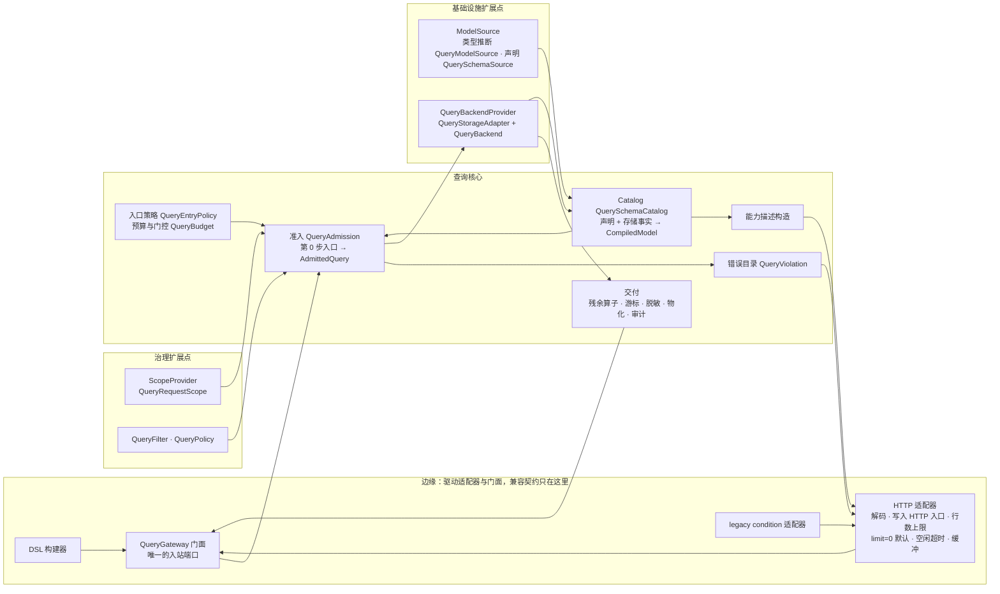
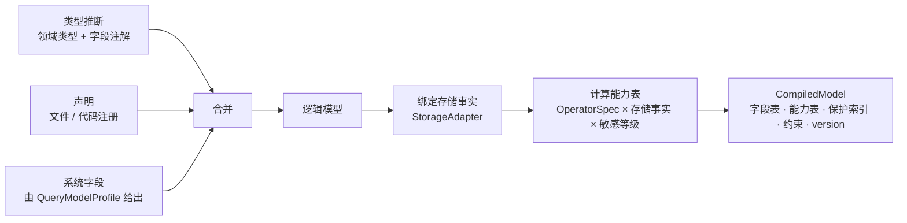

# 查询子系统目标架构

日期：2026-09-24，修订于 2026-09-26。状态：已实施。迁移按附录 A 的步骤 0～9 完成，之后的结构重构与复审修复记在 §12；设计名与代码名的对照见 §4 末尾。

本文从第一性原理推导查询子系统的目标架构。现有实现不是设计前提：它只在两处出现，一是 §1 的兼容边界，二是附录 A 的迁移起点。其余各章描述的是“应该是什么”，不是“现在是什么”。

## 1. 兼容边界

架构只对下列外部契约负责。它们在架构中以**边缘适配器**的形式存在（§5.9），核心不感知它们。

| 契约 | 约定 |
|---|---|
| QueryGateway API | 保证：十个公开方法的签名与返回形状不变。进程内调用方看到的异常类型与文案**不冻结** |
| RESTful 查询 API | 保证：查询路由、请求与响应 JSON 的形状、状态码、错误码及其 HTTP 状态不变。错误文案（`errorMsg`、`bindingErrors`）**不冻结**：它写给人读，可以改得更准确，黄金测试把每次改动变成可审的差异。纠正错误结果的修复会改变返回的取值，不在冻结范围内，写进发布说明 |
| 查询 DSL | 保证源码兼容，不保证二进制兼容 |
| KSP 生成的 `*Properties` 字段名常量、wow-apiclient 查询客户端 | 保证源码兼容：二者都已发布一年以上 |
| legacy `condition`：REST 请求体与 Kotlin `Condition` API | 9.x 期间保留，只存在于边缘适配器中。`condition` 请求体忽略未知属性的现有行为保持不变。10.0 移除 Kotlin API，REST 部分届时按客户端迁移进度决定 |
| 会改变 REST 返回结果的安全修复 | 默认保持旧行为，新行为通过配置启用（§5.8 列出全部开关） |
| Gradle 坐标与 starter 的 feature | 不变：不做模块拆分（§9） |

明确不兼容的 REST 可见变化：

- `GET …/snapshot/schema`、`GET …/event/schema` 的响应改为能力描述（§7）；
- 删除 `POST …/snapshot/schema/refresh` 与 `POST …/event/schema/refresh`，刷新改由 Catalog 定期校验与管理端点完成（§5.2）；
- 游标令牌改为新格式；旧令牌按现有的无效游标错误（错误码与文案 `Invalid cursor.` 不变）拒绝，客户端从第一页重新开始。

其余一律不做兼容：SPI、内部类型、装配方式、配置属性名、声明文件格式、字段注解，都按本文直接设计，不保留过渡层、别名或双格式。刚发布、还没有真实消费者的面不做兼容。

## 2. 问题

查询子系统是 CQRS 的读侧。它要做的事情是：

> **在调用方范围的约束下，把针对逻辑模型的查询意图翻译成存储上的执行，并以逻辑模型的形状交付结果；同时如实地告诉消费者，这个模型能被怎样查询。**

参与者：

- **读模型**：Snapshot（每个聚合的最新状态）、EventStream（事件历史）。二者是封闭集合；投影读模型不在本文范围内，以后可以开放为 ModelProfile 的扩展。
- **调用方**：
  - 进程内的应用代码：saga、投影、缓存、补偿；
  - HTTP 客户端：TS 应用、视图引擎；
  - LLM Agent。
- **存储**：MongoDB、Elasticsearch，以后可能更多。
- **查询形态**：single、list、paged、cursor、count、aggregate。

## 3. 第一性原理与不变量

| # | 原理 | 由此得出的不变量 |
|---|---|---|
| P1 | 语义只定义一次 | 同一查询在任何后端上结果一致；后端只翻译、只做原生检查，不解释语义 |
| P2 | 能力真相只有一处 | 某字段可用哪些运算符、能否排序或聚合，由编译模型时算好的能力表回答；准入与能力描述都读这张表 |
| P3 | 只解析一次 | 字段、类型、作用域、时间在准入时解析一次，之后各环节只消费结果 |
| P4 | 安全在构造上成立 | 后端在类型上只能收到已准入的查询；范围、策略、脱敏由固定管道执行，不依赖入口记得调用 |
| P5 | 入口决定信任，且缺省安全 | 预算、门控、范围缺失时的处理由入口策略决定；入口由边缘构造性地写入，不能靠每个入口记得写 |
| P6 | 契约在边缘 | 兼容契约只存在于边缘适配器中；核心的数据结构与 SPI 不为兼容而扭曲 |
| P7 | 变更局部，由编译器穷尽 | 新增运算符、指标、模型、存储时，改动集中，漏改会导致编译失败 |
| P8 | 热路径不解释 | 模型编译一次；请求路径上不做反射、不重建可复用对象、不重复解析 |
| P9 | 每次订阅独立 | 重订阅、重试、取消互相隔离，结果由本次订阅独占，资源由创建者释放 |

## 4. 架构总览



依赖规则：边缘依赖核心，核心依赖端口，适配器实现端口。核心不依赖任何边缘类型、HTTP 类型或存储驱动。

端口的方向按“谁调用谁”区分：

- **入站端口**只有 QueryGateway API：外部通过它驱动核心。HTTP 适配器、DSL、legacy `condition` 适配器都是驱动它的适配器，兼容契约冻结的正是这个面。
- 其余端口都是**核心在执行中调用、由外部实现的扩展点**，按扩展的内容分为两类：

| 扩展点 | 包含 | 由谁实现 | 何时被调用 |
|---|---|---|---|
| 治理扩展点 | `ScopeProvider`、`QueryFilter`、`QueryPolicy` | `ScopeProvider` 由边缘适配器或 CoSec 实现；`QueryFilter`、`QueryPolicy` 由应用实现 | 每次订阅：范围在订阅开始时读取，第 0 步计入预算，第 2 步强制追加；`QueryFilter` 在第 1 步，`QueryPolicy` 在第 2 步 |
| 基础设施扩展点 | `ModelSource`、`QueryBackendProvider`（StorageAdapter 与 QueryBackend） | 框架内置，或新存储的实现者 | 模型编译时，以及执行时 |

入口预算、门控与错误目录都在核心（wow-query）：预算与门控是准入第 0 步，由 `QueryEntryPolicy` 按入口选出 `QueryBudget` 执行；错误目录是 `QueryViolation`。HTTP 适配器只写入 `HTTP` 入口，并负责返回行数上限、`limit=0` 改写为默认列表大小、空闲超时与非 SSE 时的缓冲；它把结构化违规映射为 HTTP 状态，不自己定义错误。

**设计名与代码名**（实现后的对照；各章沿用设计名时指的就是右列）：

| 设计名 | 代码 |
|---|---|
| Catalog | `QuerySchemaCatalog`（wow-query `schema/`），每个模型经 `QueryModelCompiler` 编译；默认 `QueryModelCompiler.of(sources, sensitivity)`，应用可注册自己的 `QueryModelCompiler` Bean |
| CompiledModel | `QueryModelSchema`；每个字段的编译能力记录为 `QueryFieldCapabilities` |
| StorageAdapter | `QueryStorageAdapter`：`facts()` / `refresh()` 返回 `QueryStorageFacts`（`bindings`、`capabilities`、`storage`）；没有查询后端的模型为 `UnavailableQueryStorageAdapter` |
| ModelSource | 类型推断 `QueryModelSource`（wow-schema 实现）；声明 `QuerySchemaSource` |
| ScopeProvider | `QueryRequestScope`（wow-webflux） |
| `StorageCapability` | `QueryCapability`（wow-api） |
| `OperatorSpec` | `FilterOperatorSpec`、`GroupSpec`、`MetricSpec`（wow-api `api/query/spec`） |
| 入口策略、预算 | `QueryEntryPolicy`、`QueryBudget`（wow-query） |
| 错误目录 | `QueryViolation`（wow-query）；错误码 `QueryErrorCodes`（wow-api） |
| 低层准入 | `QueryAdmission.Trusted`（只执行第 4～6 步） |
| 服务端故障 | `QueryExecutionException`（500 `InternalServerError`） |

## 5. 组件

### 5.1 查询协议

查询协议是纯数据，不含运行时逻辑，位于 wow-api：

- **查询 AST**：`FilterExpression` 与各查询类型，是 wire 格式与 DSL 的共同产物。
- **`OperatorSpec`**：每个过滤运算符、聚合指标与分组唯一的一份规格（§6.1）。
- **存储能力词汇 `StorageCapability`**（代码为 `QueryCapability`）：封闭枚举，StorageAdapter 用它向 Catalog 声明原生能力，规格用它说明需要哪种能力。
- **语义规范**：每个运算符在 null、缺失、数组、大小写上的行为，由它生成 TCK 矩阵（§6.2）。
- **协议限额**：对任何入口都成立的上限，例如聚合最多 32 个分组、64 个指标、5 层元素、32 个排序字段。它们在 AST 构造时检查，属于 wire 不变量。REST 解码时违反，由错误目录按解码错误返回。排序字段数与重复排序字段在准入时再按 `SORT_TOO_MANY`、`SORT_FIELD_DUPLICATE` 检查一次，覆盖不经 REST 解码的查询。
- **字段注解**（§6.4）与**能力描述 DTO**（§7）。

DSL 构建器留在 wow-query（§9）。

### 5.2 Catalog 与 CompiledModel

Catalog（`QuerySchemaCatalog`）把“一个聚合的一个读模型”编译成不可变、带版本的 `CompiledModel`（代码为 `QueryModelSchema`）。编译由 `QueryModelCompiler` 完成：合并模型来源与声明，读取 `QueryStorageAdapter` 报告的 `QueryStorageFacts`，再统一应用与存储无关的规则（游标要求每条记录一个值、时间聚合要求日期或 epoch 编码、元素作用域是对象数组）：



**能力表在编译时算好。**每个字段、每个动态字段模板，都有一份有效能力（编译记录 `QueryFieldCapabilities`）：运算符、排序、游标排序、分组、函数、能否作为表达式输入、能否出现在指标过滤中、是否忽略大小写。准入按字段查表；能力描述把表序列化（P2）。

**编译时能确定的，与只能在准入时判断的，要分开：**

| 编译时（进入能力表或约束） | 准入时（按本次请求判断） |
|---|---|
| 原生能力：ES 的 `ignore_above`、`null_value`、normalizer 规则，Mongo 的 validator 类型族 | 取值是否落在字段的声明域内 |
| 能否做游标排序：单值、无数组祖先、比较类型族一致、非敏感、可做范围过滤 | 需要的能力随取值变化的情况：EQ/NE 取 null 需要存在性检查能力 |
| 敏感等级对能力的裁剪（§5.8） | 动态键：具体键的替换、被排除的具名键、一个路径匹配多个模板时的能力取交集 |
| 组合约束：Mongo 平行数组不能同时排序、元素作用域、游标唯一排序、ES 特殊排序字段 | 运算符开销随取值变化的情况：空前缀、忽略大小写的 STARTS_WITH |
|  | 计数查询不能匹配全部记录（仅在入口门控开启时） |

**QueryModelProfile**：Snapshot 与 EventStream 各有一份，给出身份字段、payload 位置、payload 类型字段、默认范围、投影约束和系统字段。这是一个封闭集合，不对外扩展。

**发布**：
- 编译成功后原子替换；编译失败时保留上一个版本，并报告错误；
- 每次订阅开始时取当前版本，整个订阅期间使用同一个版本。

**刷新**：
- 存储事实（索引、mapping、validator）会在部署之外变化，Catalog **必须定期重新校验**，发现变化就重新编译；
- 部署了 actuator 时，管理端点 `wowQuerySchema` 提供按实例的版本查看与手动刷新；
- 数据面不提供刷新接口。

### 5.3 入口与入口策略

每个请求都带着一个**入口**，取值有三种：`HTTP`、`IN_PROCESS`、`UNSPECIFIED`。入口决定一份入口策略：

| 策略项 | `HTTP` | `IN_PROCESS` 与 `UNSPECIFIED` |
|---|---|---|
| 预算：列表大小、页大小、偏移窗口、过滤节点数、取值数 | 按配置 | 不限，需要时可显式配置 |
| 昂贵运算的门控：元素、算术表达式、指标排序、匹配全部的计数等 | 按配置 | 放开 |
| 范围缺失时的处理 | 默认放行（保持旧行为），可配置为拒绝 | 放行：进程内调用方是受信代码，范围由它自己决定 |
| 返回行数上限、`limit=0` 改写为默认列表大小、空闲超时、非 SSE 时的缓冲 | HTTP 适配器负责 | 无 |

- **缺省安全**：
  - `UNSPECIFIED` 按进程内处理，保证 QueryGateway 的现有行为不变；
  - 另有“必须显式入口”开关，开启后 `UNSPECIFIED` 的查询被拒绝；
  - HTTP 适配器在所有查询路由共用的基类里**构造性地**写入 `HTTP` 入口，不由各 handler 自己写；
  - 路由契约测试遍历全部内置查询路由，断言入口为 `HTTP`。
- **读取一次**：入口与调用方范围只在订阅开始时从 Reactor context 读取一次。之后的扩展即使改写 context，也改变不了它们。
- **不向嵌套调用泄漏**：扩展与策略内部发起的进程内查询、缓存加载器，都在清掉继承来的入口与范围的 context 中执行，入口显式设为 `IN_PROCESS`。
- **预算与门控的归属**：由 wow-query 的 `QueryEntryPolicy` 在准入第 0 步执行，`http` 与 `inProcess` 各一份 `QueryBudget`；HTTP 的能力描述读同一份预算。HTTP 适配器只保留上表最后一行的职责。
- **预算与门控的计量对象**：调用方提交的原样查询，加上边缘给出的调用方范围。这份快照在准入第 1 步之前取得并检查，所以：
  - 路由选择（加载路由的聚合 id 与版本范围）不是调用方写的，不计入预算；
  - 策略追加的条件、默认的删除范围、游标追加的排序都不计入预算；
  - 策略可以使用门控的运算符，不会被门控误拒；
  - 检查顺序不变；预算类违规改用各自专用的 binding code（`SIZE_OUT_OF_RANGE`、`FILTER_TOO_LARGE`、`EXPENSIVE_OPERATOR_DISABLED`、`COUNT_REQUIRES_FILTER`、`RESIDUAL_GROUPS_EXCEEDED`），`errorCode` 仍为 `IllegalArgument`。
- **点读同样经过入口策略**：开启点读准入（§5.8）时，State 与 tracing 读取也执行 `QueryEntryPolicy` 的入口检查与“范围缺失时拒绝”，只是没有查询可计量，不做预算检查。
- 能力描述按入口生成：HTTP 描述中已经去掉被门控关闭的能力，并附上 HTTP 预算（§7）。

### 5.4 准入与 AdmittedQuery

准入回答的问题是：**这一次订阅允许执行的查询是什么**。它是后端之前唯一的关卡。

```kotlin
/** 只能由 QueryAdmission 构造。 */
class AdmittedQuery<out Q : Any> internal constructor(
    val query: Q,                                            // 规范化后的查询，仍是原来的 AST 类型
    internal val schema: QueryModelSchema,                   // 本次订阅的编译模型，只在 wow-query 内部可见
    val entry: QueryEntry,
    private val fields: IdentityHashMap<Any, ResolvedField>, // 以节点身份为键的解析结果
) {
    val model: QueryModel                                    // 读模型；后端看到的是它，不是 schema

    fun field(reference: QueryField): ResolvedField
    fun systemField(filter: FilterExpression): ResolvedField
}
```

后端拿到的是查询、入口、读模型与字段解析结果；编译模型本身留在准入内部，后端需要的窄事实（物理绑定、响应路径、基数、时间编码）都在 `ResolvedField` 上。

准入按固定顺序执行：

0. **入口预算与门控**：`QueryEntryPolicy` 接受入口，并按入口的 `QueryBudget` 检查调用方提交的查询加调用方范围（§5.3）；取得模型后，开关开启时要求已认证的范围。
1. **改写**：普通 `QueryFilter` 改写查询。这是扩展点，按顺序执行。
2. **强制范围**：追加调用方范围与 `QueryPolicy` 的条件。这一步在所有扩展之后，普通 Filter 删不掉。路由选择（加载、点读所指定的聚合 id 与版本范围）也在这里作为操作约束追加，它不是调用方范围。
3. **模型默认范围**：模型为没有声明某类范围的查询补上默认条件。一般规则是：默认范围只看调用方提交的条件与第 1 步的改写结果，不看策略追加的条件，保证策略只收紧、不会因为追加条件而取消默认。
   - **例外：Snapshot 的删除范围**。删除是软删除，对用户而言就是删除了，默认只查未删除的记录。只要前两步产出的条件里已经有删除范围（调用方、`QueryFilter` 或 `QueryPolicy` 写的都算），就遵循它；没有时追加 `DeletionFilter(ACTIVE)`。这样策略可以决定数据生命周期（例如回收站只看已删除的记录）。代价是策略写了 `DeletionFilter(ALL)` 时会放宽到含已删除记录，写策略时需要知道这一点。
4. **操作收尾**：例如游标追加身份字段作为唯一排序。
5. **校验**：查能力表，检查取值规则、组合约束与准入时的规则（§5.2）。
6. **解析、规范化与登记**，产出 `AdmittedQuery`：
   - 先按原查询解析每个字段引用；
   - 再规范化：相对时间统一取一个服务端 `now`，并按字段的时间编码换算；降级运算符；展平逻辑节点；
   - 规范化时为每个带字段的节点**分配新实例**，并在同一次遍历中登记解析结果。

设计要点：

- **后端签名只接受 `AdmittedQuery`**，未准入的查询在类型上到不了后端（P4）。
- **解析结果随查询交给后端**，后端不再查找字段（P3）。
- **旁表以节点身份为键**：
  - 不用相等性做键：AST 节点是 data class，不同元素作用域里写法相同的条件会判为相等；调用方复用的同一个 `QueryField` 实例也可能出现在不同作用域。第 6 步为节点重新分配实例，才让身份在构造上唯一。
  - 覆盖范围：过滤、排序、投影、分组、指标表达式、元素过滤、指标过滤，以及游标追加的排序。
- **不另造一棵 IR 树**：仍用原来的 AST 类型，新增运算符不会多出一处改动。
- **`ResolvedField` 是每次请求的实例**：包含逻辑绝对路径、元素祖先、相对物理父路径、按能力替换好具体键的物理绑定。它引用 CompiledModel 的字段记录，不产生改写后的字段名。
- **准入通过不等于原生合法**：后端仍然做原生检查。
- **每一次拒绝都产生结构化违规信息**：违反的规则、字段、约束。对外的错误码与文案由错误目录决定（§5.9）。
- **低层调用**：TCK、测试、工具与基准经 `QueryAdmission.Trusted` 取得 `AdmittedQuery`：只执行第 4～6 步，不做任何治理，名字就说明了这一点。
- **准入内部的协议错误不是客户端错误**：扩展返回空、节点未登记解析结果等，都报 `QueryExecutionException`（500），文案不带查询取值。

### 5.5 后端

后端只做三件事：**原生检查、翻译、执行**。SPI 由四个原语组成：

```kotlin
interface QueryBackend : NamedAggregateDecorator {
    /** 编解码 page 在 Keyset 窗口下返回的原生位置。 */
    val cursorPositions: CursorPositionCodec

    /** 按查询自身的 limit 流式返回记录。 */
    fun stream(query: AdmittedQuery<IListQuery>): Flux<ObjectNode>

    /** 返回一页：记录、可选的总数，以及每条记录的原生位置（keyset 窗口时）。 */
    fun page(query: AdmittedQuery<Queryable<*>>, window: PageWindow): Mono<BackendPage>

    fun count(query: AdmittedQuery<FilterExpression>): Mono<Long>

    /** 按有效排序流式返回分组：前 limit 个，或残余算子需要时的全部分组。 */
    fun aggregate(query: AdmittedQuery<AggregationQuery>, window: GroupWindow): Flux<ObjectNode>
}

sealed interface PageWindow {
    data class Offset(val offset: Int, val limit: Int, val withTotal: Boolean) : PageWindow
    data class Keyset(val after: CursorPosition?, val limit: Int) : PageWindow
}

sealed interface GroupWindow {
    data class First(val limit: Int) : GroupWindow
    data object All : GroupWindow
}

class BackendPage(val rows: List<ObjectNode>, val total: Long? = null, val positions: List<CursorPosition>? = null)
```

- **窗口只由核心从查询派生**：single 用 `page(Offset(0, 1, withTotal = false))`；list 用 `stream`；paged 用 `page(Offset(…, withTotal = true))`；cursor 用 `page(Keyset)`。后端自己决定用一次还是两次 I/O 满足 `withTotal`：ES 在同一次搜索中取得总数与列表；Mongo 并行执行计数与查找。
- **游标位置是原生值**：ES 取 `hit.sort()`，Mongo 取投影之前的 BSON 值。位置在补投影的字段被剥离、结果被脱敏之前产生；后端每页多取一条作为预读，决定是否还有下一页。游标排序使用字段的游标排序绑定。
- **令牌分工**：后端通过 `cursorPositions` 提供位置值的编解码（`CursorPositionCodec`）；核心负责令牌外壳：指纹、封装、校验（§6.5）。
- **能力声明**：StorageAdapter（`QueryStorageAdapter`）报告的 `QueryStorageFacts` 除了字段的原生能力（`bindings`）与模型级能力（`capabilities`），还在 `storage`（`StorageSupport`）中声明：
  - 分页支持：原生 keyset、不限量流式；
  - 聚合支持：having、top-N、dense 补空、百分位、去重计数，以及 §11 的新能力，各自为 `NATIVE`、`RESIDUAL` 或 `NONE`。
- **残余算子由核心规划与调用**：某项支持方式为 `RESIDUAL` 时，由核心在交付中用共享的纯函数计算，并相应调整下发给后端的查询，例如 having 以残余方式计算时，不向后端下发 limit，以免结果错误。残余计算的开销计入入口门控。
- **共享逻辑都在核心**：游标令牌、聚合的逻辑形状（元素作用域、指标过滤、dense 补空的识别）、残余算子、结果的有限数检查与标准 JSON 检查。
- **后端独有**：翻译成原生请求、原生约束检查、分页资源（PIT 等）、驱动值到标准 JSON 的转换、响应完整性检查。
- **存储失败是服务端故障**：后端抛出的 Wow 错误原样传播；其他存储与驱动异常由核心统一改为 `QueryExecutionException("Query storage failed.")`（500），原异常只作为服务端的 cause，它的消息可能引用查询取值，不返回给客户端，日志观察者也隐去它。
- **注册**：`QueryBackendProvider` 是开放的 SPI，按存储名注册，为每个聚合、每个读模型提供成对的 StorageAdapter 与 QueryBackend（Factory 返回 `QueryBackendBinding(backend, storage)`）。新增存储不需要改动 starter。
- **事件存储不走查询后端**：事件存储需要的原生过滤与排序翻译，由存储模块内部的原生构件提供，只接受框架内部构造的物理条件，不属于 `QueryBackend`，也不经过准入。

### 5.6 交付

交付是固定管道，不对外开放扩展：

1. **残余算子**：按后端声明的聚合支持方式计算（§5.5）。
2. **下一页令牌**：由后端给出的原生位置编码，从不使用结果行里的值，所以不会把遮挡后的值编进令牌。
3. **强制脱敏**：按字段的敏感等级与遮挡方式处理。
4. **物化**：dynamic 结果保持 `ObjectNode`；typed 结果转成领域类型。带投影的 typed 查询只能投影出领域类型可以接受的字段组合，否则物化失败并报告，推荐改用 dynamic 结果。
5. **观测与审计**：
   - `QueryObserver` 记录完成、错误、取消，以及准入拒绝的原因（按违反的规则分类）；观测失败不影响主信号。
   - 审计事件包括主体、入口、模型版本、查询指纹、生效的范围与策略、返回行数、被遮挡的字段。
   - 违规信息与日志中不出现过滤条件的取值，以免个人数据进入日志。

### 5.7 执行合同

适用于所有查询形态：

1. **每次订阅独立**：每次订阅都重新取模型版本、重新准入、重新执行，不共享可变状态。
2. **先检查，后 I/O**：准入与后端的原生静态检查都在第一次执行性 I/O 之前完成；任何一项失败时，执行性 I/O 次数为零。
3. **错误只沿当前 Publisher 传播**：不吞错，不改写成空结果。扩展返回空是协议错误。
4. **资源由创建者释放**：PIT、游标等资源在完成、错误、取消时都释放。
5. **取消向上传播**：取消发生在准入阶段时，后端不会启动。

### 5.8 治理

**范围与信任**：
- `ScopeProvider` 是治理扩展点，由边缘适配器实现：从 HTTP 请求取得租户、所有者、空间，或由 CoSec 提供。
- 它给出的范围带有**来源**：`AUTHENTICATED`（来自凭证，或经 CoSec 校验）或 `DECLARED`（请求自报的路径或请求头）。只有 `AUTHENTICATED` 的范围构成安全边界；`DECLARED` 的范围只作为过滤条件。
- “范围缺失”的含义由 QueryModelProfile 定义，例如 Snapshot 缺少租户范围。开启“范围缺失时拒绝”后，只有 `AUTHENTICATED` 的范围视为已提供：这个开关是为了收紧安全，请求自报的范围不构成安全边界。

**策略**：`QueryPolicy` 追加 AND 条件，只能收窄，不能替换查询。`QueryContext` 带上 `QueryType` 与入口。

**ABAC**（属性访问控制）由资源标签与主体标签两半组成：

- **资源标签**：写入时产生。命令 `ApplyResourceTags` 显式打标签，或者状态实现 `StateAggregateTagsExtractor`，在溯源后从状态推导标签。标签随快照存进系统字段 `tags`（动态键，取值为字符串数组），只有 Snapshot 有。
- **主体标签**：查询时由 `AbacQueryPolicy.getPrincipalTags` 提供。这是框架提供的抽象策略，由应用按自己的身份体系实现，并注册为 `QueryPolicy`。
- **转换**：准入第 2 步把主体标签转换成 AND 条件。对每个标签键：通配值要求资源存在该键；其他值要求资源缺少该键、或该键为空、或取值落在主体的值中。
- **现有的放行语义**：主体没有标签时条件为全部匹配；资源缺少某个标签键时也匹配。两者都保持为默认行为，各自有开关收紧（见下方开关清单）。

**敏感等级**（§6.4）：

| 等级 | 结果 | 过滤、分页排序 | 分组、ANY、字段指标、算术引用、游标排序 |
|---|---|---|---|
| `DISPLAY` | 遮挡 | 允许；描述中标明“遮挡但可比较”。可用开关关闭比较 | 禁止（保持现有保护） |
| `CONFIDENTIAL` | 遮挡 | 禁止 | 禁止 |

- 允许比较的 `DISPLAY` 字段可以被范围条件逐步逼近原值，这是已知的取舍。需要杜绝时，关闭比较，或者使用 `CONFIDENTIAL`。
- 受保护字段在描述中不输出枚举值。
- **同一个值出现在状态与事件 payload 中时，二者的敏感等级必须一致**。一致性由结构保证，不靠推断「哪两条路径是同一个值」：
  - `@Sensitive` 可以标在**值类型**上（例如 `@Sensitive(CONFIDENTIAL) value class PhoneNumber`），凡以该类型声明的属性（状态、事件、命令）都继承它的等级与遮挡方式。只允许标在序列化为字符串的类型上（value class、`@JsonValue` 类型）；标在其他类型上，schema 构建失败。
  - 属性上的 `@Sensitive` 可以与类型上的相同或更严，不能更宽：不能把敏感类型在某处降级。更宽时 schema 构建失败。
  - Catalog 构建时做**启发式告警**：事件 payload 字段与状态中某个受保护字段同名、同值类型，自己却没有敏感等级（或反过来）时，记一条 warn 日志并给出两条路径。只告警，不阻止启动，避免误报挡住服务。
  - 不提供在声明文件里按路径关联（如 `sameAs`）：这违反 §6.4「敏感等级只能以字段注解声明」。没有值对象的模型，在事件字段上同样标注 `@Sensitive`。

**点读准入**（可选开关，默认关闭）：
- 按 id 加载、按版本加载、按时间加载与 tracing 等 State 读取走状态回放，没有查询 AST。
- 开启后，读取先经过 `QueryEntryPolicy`（含“范围缺失时拒绝”），再由 `QueryAdmission.admitRecord` 在内存中对状态判定调用方范围、策略与快照默认范围（已删除的状态视为不存在；tracing 包含已删除的版本），脱敏作用于状态 JSON；tracing 另有版本数上限与所有者校验。
- “范围缺失时拒绝”在这些路由上只有点读准入能执行，所以开启它而不开启点读准入时，starter 启动失败，不留下看似开启、实际不生效的开关。
- 默认关闭时行为不变，而且不依赖 Catalog。已知的风险面是：结果不遮挡、不执行 ABAC、tracing 不校验所有者、不设上限。

**全部可选的安全开关**：
- 范围缺失时拒绝；
- 必须显式入口；
- 主体没有 ABAC 标签时拒绝；
- 资源缺少 ABAC 标签键时不匹配；
- 点读准入；
- tracing 的所有者校验与版本数上限；
- 关闭 `DISPLAY` 的比较。

**缓存**：
- 进程内缓存的加载器在隔离的 context 中执行：清掉继承来的范围与入口，入口显式设为 `IN_PROCESS`；
- 携带调用方范围的读取不经过共享缓存。

### 5.9 边缘适配器

| 适配器 | 职责 |
|---|---|
| QueryGateway 门面 | 实现冻结的十个方法：取模型 → 准入 → 组合后端原语 → 交付 |
| HTTP 适配器 | 解码 REST 请求体（按 wow-api 查询类型定义的 JSON 形态）；构造性写入 `HTTP` 入口；实现 `ScopeProvider`（`QueryRequestScope`）；返回行数上限、`limit=0` 改写、空闲超时、非 SSE 缓冲；能力描述端点（ETag）；把结构化违规映射为 HTTP 状态。入口预算与门控不在这里，在准入第 0 步（`QueryEntryPolicy`、`QueryBudget`，wow-query） |
| 错误目录 | `QueryViolation`（wow-query）：集中定义每条规则的错误码、异常类型（请求类为 `IllegalArgument`，模型类为 `QuerySchemaValidation`）与文案，由结构化违规信息渲染；错误码常量在 wow-api `QueryErrorCodes` |
| DSL | 构建 AST；执行扩展调用 Gateway |
| legacy `condition` 适配器 | 解码时把 `condition` 转换为 AST，Kotlin `Condition` API 在构造时转换，保留 `ignoreCase`、`datePattern`、`zoneId` 等选项。核心看不到 `Condition`。JSON 解码放在 wow-api 查询类型的反序列化器里（私有 DTO；`filter` 严格，`condition` 宽松），因为 JSON 形态属于类型本身：任何 Jackson 解码都接受两种形态，而不只是 HTTP |

**错误目录**的范围：
- 覆盖所有对外文案：解码、入口预算、准入、后端原生检查、结果完整性。
- 后端的原生检查也抛结构化违规，而不是自由文本。
- 现有的对外文案约有 170 条模板，要在第 0 步盘点并全部纳入黄金测试，连同错误的**优先级**：多个违规同时存在时先报哪一个。
- 错误码按异常类型区分的现状保持：预算类为 `IllegalArgument`，能力类为 `QuerySchemaValidation`；每条规则另有专用的 binding code。
- 服务端故障（遮挡失败、游标编码、完整性、存储超时与分片失败、准入内部的协议错误）为 `QueryExecutionException`，500 `InternalServerError`；其他存储与驱动异常统一为 `Query storage failed.`，不向客户端泄露内部信息或查询取值。

## 6. 单一能力真相

### 6.1 OperatorSpec

```kotlin
sealed interface FilterOperatorSpec {
    val operator: FilterOperator
    val target: OperatorTarget          // FIELD，或 MODEL（不指定字段的 SEARCH、ID、TENANT_ID、DELETION 等）
    val arity: Arity                    // 字段数与取值个数
    val valueRule: ValueRule            // 取值对照字段声明域的规则：单值字符串、集合、时间语义……
    fun requiredCapability(value: FilterValue): StorageCapability  // 随取值变化：EQ null 需要存在性检查能力
    fun cost(value: FilterValue): OperatorCost                     // 随取值变化：空前缀、忽略大小写
    val lowering: Lowering?             // 规范化时的降级，例如 IS_EMPTY_STRING
}
sealed interface MetricSpec { /* COUNT、NUMERIC、ANY、DISTINCT_COUNT、PERCENTILE、DERIVED，以及 §11 的 FIRST、LAST */ }
sealed interface GroupSpec { /* TERMS、HISTOGRAM、DATE_HISTOGRAM，以及 §11 的 DATE_PART */ }
```

- 规格对枚举穷尽，漏写就无法编译（P7）。
- 实施时附一张对照表，把现有校验的每一个分支映射到规格，证明规格能表达全部现有规则。
- 以下都从这张表派生：
  - 能力表的计算与准入校验；
  - 入口门控；
  - 请求 JSON Schema 与 OpenAPI；
  - TCK 矩阵；
  - TS 客户端的一致性测试基准。
- **新增运算符的改动面**：
  - AST 数据类与 wire 注解；
  - 规格；
  - 每个后端翻译器的一个分支；
  - DSL 函数（DSL 保证源码兼容，只能新增）。

  前三项由编译器强制；JSON Schema 与 TS 客户端由生成比对与一致性测试兜底。

### 6.2 语义规范

运算符在 null、缺失、数组元素、大小写上的行为写成一张表，与 `OperatorSpec` 一起维护，并生成 TCK 用例矩阵。所有后端必须全部通过。

- 后端做不到某个运算符时，StorageAdapter 就不授予对应的能力，能力表与描述中也就不会出现它。
- 已知分歧以现行 MongoDB 的行为为准，ES 对齐。在对齐完成之前，不能先从描述中去掉 ES 目前接受的运算符。
- **对齐不了的分歧作为存储事实声明**（第 7 步的结论）：ES 不为 `null` 与 `[]` 存可检索的值，描述以约束 `NULL_OR_EMPTY_AS_MISSING`（列出受影响字段）如实说明；以数组为操作数的 `EQ` / `NE` 在 ES 上以 `ARRAY_EQUALITY` 拒绝。
- **精确存在性**暂不实现，触发条件是出现要求在 ES 上区分「清空了」与「从未填写」的具体需求。届时的方案：字段声明中按字段开启 `presence: EXACT`；ES 写入时维护一个隐藏的关键字数组字段（如 `_wow_present`），记录开启了该选项、且取值为 `null` 或空数组的路径；存在性判定改读这个字段。只影响开启的字段，需要对相关索引重建一次，Mongo 不变。

### 6.3 字段别名、弃用与版本

| 场景 | 规则 |
|---|---|
| 请求 | 过滤、排序、投影、聚合都可以使用别名，准入时换成规范名 |
| 响应与投影结果 | 只出现规范名 |
| 排序唯一性、保护判断、游标指纹 | 按规范名计算；别名不能绕过规范名上的敏感等级 |
| 能力描述 | 字段以规范名列出，`aliases` 列出其别名 |

- **弃用**：字段仍可查询，但在描述中标记，供视图引擎提示、供 Agent 避开。
- **版本**：见 §7.3。

### 6.4 字段注解

采用细粒度、单一职责的注解，与 Wow 现有注解（`@AggregateId`、`@TenantId`、`@Description`）的风格一致：

| 事实 | 注解 |
|---|---|
| 时间编码 | `@QueryTemporal`：时间戳单位或格式化 pattern。标准时间类型（`Instant`、`LocalDate`、`OffsetDateTime` 等）自动推断 |
| 字段别名 | `@QueryAlias("state.oldName", …)` |
| 字段弃用 | Kotlin 标准的 `@Deprecated` |
| 字段说明 | `@Description` 或 `@Schema(description)`。不读取 KDoc：运行时拿不到，而且公开会泄露实现信息 |
| 敏感等级 | `@Sensitive(level = DISPLAY 或 CONFIDENTIAL, mask = …)` |

- **不用 `QueryField` 作注解名**：它是 AST 的字段引用类型。
- **不合并成一个装满可选参数的统一注解**。
- **敏感等级只能以字段注解声明**：不允许用声明文件或字符串路径声明，因为字段改名后规则会静默失效，等于数据泄露。
- **遮挡方式可扩展**：内置“全部遮挡”与“保留前后缀”，另可指定策略类。按调用方身份决定是否遮挡，属于后续能力，届时能力描述要按策略区分版本。
- **声明文件**只补充推断不出来的结构与语义：类型、可空性、枚举、时间编码、金额与小数精度、Map 的取值结构。

### 6.5 游标

- **令牌内容**：由后端编码的原生位置值，加上查询指纹。
- **指纹**：模型名、排序字段（规范名）与方向，规范化后取哈希。
  - **不包含过滤条件**：过滤条件变化后，从同一位置继续翻页的结果仍然有明确定义；进程内调用方每翻一页都可能重算时间戳，例如 compensation 的 `SnapshotFindNextRetry`，指纹含取值会让这类代码失败。
  - **不包含模型版本**：否则每次定期刷新都会让所有游标失效。
- **每一页都重新准入**：keyset 条件与完整的准入过滤（含范围与策略）取 AND，令牌不携带任何过滤条件，所以不签名也不会越出范围。
- **不签名**：指纹只做一致性检查，不是安全措施。
- **游标排序字段**必须可做范围过滤，且不是受保护字段（`DISPLAY` 与 `CONFIDENTIAL` 都不行），所以伪造位置值的效果等同于调用方自己写一个范围条件。
- **不匹配或无法解码时**：按现有的无效游标错误拒绝（错误码与文案 `Invalid cursor.` 不变），客户端回到第一页。

### 6.6 金额与小数精度

这是给查询使用方（视图引擎、Agent）看的**展示与合计语义**，不是存储层的计算规则。第一阶段只进入能力描述，不改变任何查询行为。

- **语义类型**：`QuerySemanticType` 新增两种，与时间编码并列，一个字段只有一种语义。
  - `DECIMAL(scale)`：定点小数，`scale` 为小数位数。
  - `MONEY(currency | currencyField, scale?)`：金额。币种二选一：固定币种 `currency`（ISO 4217 代码，如 `CNY`），或取同一对象内的币种字段 `currencyField`（同级属性名）。`scale` 缺省时，固定币种取该币种的标准小数位（`java.util.Currency.defaultFractionDigits`，如 CNY 为 2、JPY 为 0）；使用 `currencyField` 时 `scale` 必填。
- **声明方式**：注解 `@QueryDecimal(scale = 2)`、`@QueryMoney(currency = "CNY")` / `@QueryMoney(currencyField = "currency", scale = 2)`；声明文件中写作 `semantic: {type: DECIMAL, scale: 2}` 或 `{type: MONEY, currency: CNY}`。**不自动推断**：`BigDecimal` 看不出精度，猜错比不声明更糟。
- **构建时校验**（失败即 schema 冲突，不会静默失效）：字段必须是数值；`currencyField` 必须存在，是同一作用域（同一对象或同一元素）内的单值字符串字段；二选一不能同时给出或都不给。
- **能力描述**：字段的 `semantic` 如实输出，视图引擎据此按精度与币种格式化，并在币种不唯一时提示「跨币种合计没有意义」。
- **第二阶段（触发条件：出现实际误用）**：对带 `currencyField` 的金额做 SUM / AVG 时，准入要求按币种分组或以过滤固定币种，否则以结构化违规拒绝。

## 7. 能力描述

### 7.1 定位与原则

能力描述就是 `GET …/snapshot/schema` 与 `GET …/event/schema` 的响应，回答的问题是：**在这个入口上，这个模型能被怎样查询**。消费者是 LLM Agent（§8）与视图引擎运行时。

1. **发布结论，不发布推导规则**：直接给出每个字段允许的运算符、排序、分组和函数，不暴露存储能力词汇。
2. **必要条件，不是许可票据**：
   - 列出的每一项在孤立使用时一定能被准入，没列出的一定会被拒绝；
   - 组合约束写在 `constraints` 中；
   - 取值是否落在声明域内、范围与策略追加的条件，仍可能在运行时导致拒绝，拒绝时附带结构化违规信息。
3. **全部派生**：CompiledModel 的能力表加上入口策略，与准入同源。
4. **扁平的字段索引**：按逻辑路径列出字段，元素、动态键与事件变体都显式标出。
5. **语义充分**：description、枚举及其说明、时间编码、金额与小数精度、敏感等级、服务端默认时区。**不提供显示名**：显示名由 Agent 写进视图定义。
6. **不泄露实现**：不暴露物理字段名、原生类型或绑定细节；内容与调用方身份无关，所以可以缓存、可以用版本号标识。
7. **只能在运行时获取**：能力取决于目标环境的存储。

### 7.2 形态

`limits` 给出当前入口的**有效**值：协议限额、入口预算与 HTTP 适配器的返回行数上限已经取了较小者，例如 HTTP 入口的聚合 `maxLimit` 是 1000，而不是协议上限 10000。值为 `null` 表示不限制；服务端不存在的限额不出现。

```jsonc
{
  "model": "SNAPSHOT",
  "version": "sha256:…",
  "timeZone": "Asia/Shanghai",
  "record": {
    "identity": "aggregateId",
    "paging": ["LIST", "PAGED", "CURSOR"],
    "defaultScope": "ACTIVE",
    "rootOperators": ["ID", "IDS", "AGGREGATE_ID", "AGGREGATE_IDS", "TENANT_ID", "OWNER_ID", "SPACE_ID", "DELETION"],
    "search": { "modes": ["TERMS", "PHRASE"], "fields": ["state.title", "state.remark"] }
  },
  "limits": {
    "maxListSize": 1000, "defaultListSize": 100,
    "maxPageSize": 100, "maxPageWindow": 10000,
    "maxFilterNodes": 128, "maxFilterValues": 1000,
    "maxSortFields": 32,
    "aggregation": { "maxGroups": 32, "maxMetrics": 64, "maxElements": 5, "maxLimit": 1000,
                     "maxExpressionDepth": 8, "maxExpressionNodes": 256 }
  },
  "analysis": {
    "metrics": ["COUNT", "NUMERIC", "ANY", "DISTINCT_COUNT", "PERCENTILE", "DERIVED"],
    "expressions": true,
    "having": { "metrics": ["COUNT", "NUMERIC", "DISTINCT_COUNT", "PERCENTILE", "DERIVED"] },
    "sort": { "groups": true, "metrics": true },     // 指标排序在门控关闭时为 false
    "dense": true
  },
  "fields": [
    {
      "path": "state.amount",
      "role": null,                         // 系统字段填角色，例如 TENANT_ID、OWNER_ID、DELETED
      "types": ["DECIMAL"],                 // STRING、INTEGER、DECIMAL、BOOLEAN、OBJECT，可多值
      "kind": "SCALAR",                     // SCALAR、OBJECT、ARRAY、UNION
      "nullable": false,
      "semantic": null,                     // TEMPORAL_EPOCH(timeUnit)、TEMPORAL_DATE、TEMPORAL_FORMATTED(pattern)、MONEY(amount, currency)、DECIMAL(scale)
      "enum": null,                         // [{ "value": "PAID", "description": "…" }]；受保护字段不输出
      "description": "Order total in CNY.",
      "sensitivity": null,                  // DISPLAY（含 "comparable": true/false）或 CONFIDENTIAL
      "project": true,
      "filter": { "operators": ["EQ", "NE", "GT", "GTE", "LT", "LTE", "BETWEEN", "IN", "NOT_IN", "IS_NULL", "IS_NOT_NULL"],
                  "caseInsensitive": false },
      "sort": { "paged": true, "cursor": false },
      "aggregate": {
        "groups": ["TERMS", "HISTOGRAM"],   // 时间字段为 DATE_HISTOGRAM，并给出 dateUnits
        "dateUnits": null,
        "missingKey": false,
        "functions": ["SUM", "AVG", "MIN", "MAX", "STDDEV", "VARIANCE"],
        "distinctCount": true, "percentile": true, "any": false,
        "expressionInput": true,            // 能否作为算术表达式的输入
        "inMetricFilter": true              // 能否出现在指标的过滤条件中
      },
      "scope": null,                        // 元素内的字段填元素路径
      "deprecated": null,
      "aliases": []
    }
  ],
  "elements": [ { "path": "state.items", "filter": true, "aggregate": true } ],
  "dynamic": [ { "pattern": "tags.{key}", "types": ["STRING"], "kind": "ARRAY",
                 "filter": { "operators": ["IN", "EXISTS", "NOT_EXISTS"] } } ],
  "constraints": [
    { "type": "PARALLEL_ARRAY_SORT", "fields": ["state.items.sku", "state.tags"] },
    { "type": "CURSOR_UNIQUE_SORT", "appended": "aggregateId" },
    { "type": "COUNT_REQUIRES_FILTER" },                      // 入口门控开启时
    { "type": "STARTS_WITH_REQUIRES_PREFIX" },                // 入口门控开启时
    { "type": "DYNAMIC_KEY_EXCLUDED", "pattern": "tags.{key}", "excluded": ["secret"] }
  ],
  "variants": null
}
```

- DATE_HISTOGRAM 分组可以在请求中覆盖时区，并单独开启 dense；HISTOGRAM 的 `interval` 必须为正的有限数。
- `record.paging` 列出可用的分页方式，具体用哪一种由消费者按场景选择。

EventStream 的 `variants` 是元素内的变体。一条记录的 `body` 是事件数组，按事件类型区分的字段条件必须写在对 `body` 的 `ELEMENT_MATCH` 内，才能作用在同一个事件上：

```jsonc
"variants": {
  "element": "body",
  "discriminator": "bodyType",
  "values": [ { "value": "OrderCreated", "description": "…", "fields": [ /* 相对元素的字段 */ ] } ]
}
```

### 7.3 版本、组装与访问

- **组装**：核心按 CompiledModel 与入口策略生成描述，HTTP 适配器负责输出。
- **版本**：最终描述 JSON 经规范化序列化（集合与映射按键排序）后的内容哈希，同时作为 ETag，支持 `If-None-Match` 返回 304。内容相同就得到相同的版本，与副本、重启无关；入口配置变化会改变版本。
- **副本不一致**：刷新期间各副本的版本可能不同。消费者把描述当作提示，4xx 仍是必须处理的路径；视图引擎可以在查询时附带它所依据的版本，用于发现漂移。
- **访问**：
  - 描述端点与查询路由使用相同的认证与授权。
  - 描述公开字段、枚举与敏感等级，但受保护字段不输出枚举值；`CONFIDENTIAL` 字段不可过滤，也就不暴露反推原值的能力。允许比较的 `DISPLAY` 字段仍可被范围条件逐步逼近原值，见 §5.8 的取舍与开关。

## 8. 消费者：视图定义与 LLM Agent

### 8.1 决定

- 视图定义**不由生成器生成**：生成器只能搬运能力，做不了取舍。
- 视图定义**由 LLM Agent 依据业务场景编写**，由人在 PR 中审查，“定义是代码”的原则不变。
- **显示名由 Agent 写**：中英双语，使用业务受众的词汇。视图引擎的 `label` 目前是单个字符串，双语的载体由视图引擎决定。

### 8.2 定义的构成与校验

```
DataViewDefinition = 能力层（描述允许的子集） ⊕ 呈现层（显示名、分组、格式、默认列与排序、系统视图、仪表盘）
```

- **只收窄、不放宽**。
- **开发与 CI 阶段**：视图引擎现有的定义校验增加 `options.descriptor`，检查：
  - 字段存在，或能经别名映射；
  - 能力是描述允许的子集；
  - 不超过限额；
  - 定义记录的描述 `version` 与当前描述是否一致，不一致即报告漂移。
- **运行时交集**：实际生效的能力 = 定义声明的能力 ∩ 当前描述（按版本缓存），限额以描述为准。
  - 被去掉的能力不出现，而不是置灰；
  - 已保存视图中的残留条件给出提示；
  - 别名迁移在读取已保存视图时完成。
- **获取描述**：wow-client 提供描述 DTO 与带 ETag 的获取方法；视图引擎的数据源端口增加获取描述的能力。
- **时机**：视图引擎在首次发布前改用最终版的描述，替换写死的限额与运算符表。

### 8.3 Skills

| Skill | 主要交付 | 边界 |
|---|---|---|
| `wow-view-definition` | 依据业务场景与能力描述，编写或修订视图定义及其故事 | 不写运行时客户端代码（属于 `wow-client`），不改视图引擎本身 |
| `wow-data-query` | 读取能力描述，为业务数据问题执行只读查询并解释结果 | 交付的是答案，不是代码；查询报错或结果异常的诊断属于 `wow-debug` |

- **激活规则**：修订 `skills/README.md`，允许为仓库内的视图定义激活 `wow-view-definition`（D10）；同步更新写死 Skill 数量的 `README.md`、`plugins.json` 与 `scripts/validate_wow_skills.py`。
- **结构**与现有 Skill 一致：
  - `SKILL.md`：激活条件与排除、工作流、完成证据；
  - `references/`、`agents/openai.yaml`；
  - activation 与 behavior 两类 evals。
- **取得描述的约定**：
  - 只从开发或预发环境拉取，生产环境须经用户明确同意；
  - 凭证由环境注入，不手工输入；
  - 描述文件与定义一起提交，并记录版本；
  - CI 对照已提交的描述文件校验，与真实环境的漂移由定时任务或运行时发现。
- **evals 覆盖的典型失败**：
  - 编造字段；放宽能力；
  - 把敏感字段用作分组或指标；
  - EventStream 的事件字段条件没有写在元素作用域内；
  - 显示名使用技术词汇；
  - 使用已弃用的字段；
  - 在生产环境取描述而未经同意。

## 9. 模块

**不做模块拆分**。目标架构通过依赖约束实现，而不是通过新的 Gradle 模块：

| 模块 | 承载 |
|---|---|
| wow-api | 查询协议：AST、`OperatorSpec`（`FilterOperatorSpec`、`GroupSpec`、`MetricSpec`）、`StorageCapability`（`QueryCapability`）、错误码 `QueryErrorCodes`、语义规范、协议限额、字段注解、能力描述 DTO；legacy `Condition` 及其到 AST 的转换，查询类型的 JSON 解码（含 `condition` 的宽松解码；边缘适配器，9.x 保留） |
| wow-query | 查询核心：Catalog、准入（含入口策略与预算）、错误目录、交付、能力描述构造、端口、Gateway 门面，以及 DSL 构建器与执行扩展 |
| wow-mongo、wow-elasticsearch | 事件存储、快照存储，以及各自的 StorageAdapter 与 QueryBackend |
| wow-schema | JSON Schema 生成，以及实现 `ModelSource` 的类型推断。只报告类型事实，不含查询语义（脱敏规则、时间编码含义、模型 Profile 都在 wow-query） |
| wow-webflux | HTTP 适配器 |
| test/wow-tck | 已有的 `tck/query` 承载语义矩阵与后端一致性规格 |
| skills/ | `wow-view-definition`、`wow-data-query` |

依赖约束（由架构测试守护）：

- wow-query 的核心包不依赖 HTTP 类型、存储驱动与边缘适配器；
- 后端实现只依赖 wow-query 的端口，不依赖其他后端；
- 存储模块中的事件存储不调用 `QueryBackend`，也不使用绕过准入的查询翻译；它需要的原生翻译由模块内部的原生构件提供（§5.5）；
- starter 的 `mongo-support`、`elasticsearch-support` 等 feature 与 Gradle 坐标不变。

不拆分的理由：

- **拆不出收益**：存储的自由组合已由现有的存储路由支持；查询运行时只包括 wow-query 与 wow-core，使用存储模块的应用本来就会引入它们。
- **拆分要付出的代价**：
  - ES 事件存储依赖查询翻译，拆分会形成反向依赖；
  - wow-apiclient、wow-schema、wow-openapi 都实际依赖 wow-core，做不到“只依赖协议”；
  - DSL 的字面量转换依赖 wow-core 的序列化配置，搬走会改变 `eq(BigDecimal/Instant/Money)` 生成的节点；
  - 下游的 Gradle 坐标与 starter feature 都会变。

## 10. 质量属性

| 属性 | 架构如何保证 |
|---|---|
| 正确性 | 语义规范加 TCK 矩阵；描述是可验证的必要条件，对每一项生成最小查询验证能被准入；残余算子由核心按后端声明规划 |
| 安全 | 类型化准入；入口构造性写入、缺省安全；强制范围在所有扩展之后；范围区分来源；敏感等级在编译时裁剪能力；游标只能按非敏感、可范围过滤的字段排序；缓存加载器与嵌套调用在隔离的 context 中执行；全部新安全行为有开关 |
| 性能 | 模型与能力表编译一次；请求路径上是查表与一次遍历；字段只解析一次；ES 分页一次请求取得总数与列表；后端协作对象按后端复用。关键路径有 JMH 基准，不允许回退 |
| 可演进 | 规格表加穷尽 `when`；四个后端原语；开放的后端注册 SPI；新增存储只需实现 StorageAdapter、QueryBackend 与位置编解码，并通过 TCK |
| 可观测 | 准入拒绝按违反的规则分类记录；审计事件；模型编译耗时、版本变化、刷新失败作为指标输出 |
| 兼容 | 契约只在边缘；错误目录与黄金测试（含错误优先级）锁住错误码、状态与文案，文案的改动成为可审的差异；OpenAPI 请求与响应 schema 快照；示例应用作为 Gateway 与 DSL 的兼容夹具 |

## 11. 待新增的查询能力

来源：视图引擎（2026-09-25，经 Wow 迁移主会话转达）。视图引擎会先实现前端能独立完成的图表，下列需要后端支持的能力放在这里。它们都是**新增**，不涉及兼容；每一项都经由 `OperatorSpec` / `MetricSpec` / `GroupSpec` 加入，由各后端在 StorageAdapter 中声明是否授予，进入能力表、能力描述与 TCK 矩阵。

| # | 能力 | 需求与证据 | 设计 | 后端 |
|---|---|---|---|---|
| N1 | 每个分组内的 **FIRST / LAST**（最早、最晚一条记录上的取值） | K 线的开盘价与收盘价、“期初值 / 期末值”。现有指标只有 COUNT、SUM、AVG、MIN、MAX、STDDEV、VARIANCE、DISTINCT_COUNT、PERCENTILE、ANY、DERIVED | 新增 `MetricSpec`：`FIRST(field, orderBy)`、`LAST(field, orderBy)`。`orderBy` 缺省为模型的事件时间；必须可排序，且不能是受保护字段 | Mongo：分组前按 `orderBy` 排序，再 `$first` / `$last`，或在支持的版本上用 `$top` / `$bottom`；ES：`top_metrics`，或 `top_hits` 取 1 条。不支持时不授予 |
| N2 | **按日期部分分组**：星期、小时，可能还有月份，按指定时区 | 分析师要看「星期 × 时段」。现在只有 DATE_HISTOGRAM；Storybook 零售场景用读模型派生字段 `placedWeekday`、`placedHour` 绕过（`typescript/storybook/docs/scenarios.md` Q4） | 新增 `GroupSpec`：`DATE_PART(field, part, timeZone)`，`part` 为 `DAY_OF_WEEK`、`HOUR_OF_DAY`、`MONTH_OF_YEAR` 等。取值域固定（7、24、12），dense 补空由核心完成。需要字段具备时间聚合能力 | Mongo：`$dayOfWeek`、`$hour`、`$month` 带 `timezone`；ES：composite 的 terms source 配 runtime 脚本，按时区取日期部分 |
| N3 | **时间差表达式**，例如 `paidAt` 到 `shippedAt` 相隔的小时数，可用于指标、过滤与分组 | 履约 SLA 分析（付款到发货小时数）。现在只能预先算好存进读模型 | `AggregationExpression` 新增 `DATE_DIFF(left, right, unit)`。表达式要能用于过滤和分组，AST 需要两个新节点：“表达式比较”过滤节点（表达式、比较运算符、取值），以及以表达式为输入的 HISTOGRAM / TERMS 分组。字段需具备时间语义，两个字段的时间编码可以不同，按编码换算。表达式无法走索引，计为昂贵运算，受入口门控 | Mongo：`$dateDiff`，或对时间戳做减法再换算；ES：runtime field 脚本 |
| N4 | **元素内字段的全文检索**，例如在 `ELEMENT_MATCH` 内搜索 `state.items.title` | 视图引擎决定 D39（`typescript/wow-view-engine/docs/design/decisions.md`）。Mongo 的 `$text` 只能用集合级的一个文本索引，忽略 `fields`，不能出现在 `$elemMatch` 里；ES 可以用 nested 查询 | 以能力声明解决，不做跨后端的模拟：元素内字段的 `FULL_TEXT_*` 能力由 StorageAdapter 按字段授予，描述中 `record.search.fields` 与元素字段的 `filter.operators` 如实反映。Mongo 不授予，视图引擎据此不提供该选项。不用 CONTAINS 冒充全文检索：两者语义不同 | Mongo：不授予；ES：nested 查询内的 `match` |
| N5 | **向客户端公开服务端的限额与能力**：最大页大小、最大分析行数、支持的聚合与运算符、各存储的检索支持 | 视图引擎的默认值超过了 HTTP 守卫的默认值：页大小 200 对 100，分析行数 10,000 对 1,000。Wow 8.12～9.1.3 拒绝不带 `limit` 的 `listQuery`，9.1.5 才补默认值 | 就是 §7 的能力描述：有效限额、各字段的运算符与聚合、检索能力、`defaultListSize`。视图引擎以描述为准，不再写死默认值（§8.2） | 与后端无关 |
| N6 | **相对“现在”的时间条件**，以及时间戳上的严格小于 / 大于 | compensation 控制台重建需要「已超时」这类队列（`timeoutAt < now`），并要求在保存的视图里一直正确（`compensation/dashboard/docs/design/view-engine-rebuild.md` 的缺口 G1，该文档在待合并的 Ahoo-Wang/Wow#3402 中）。**核实结果**：严格的 `LT` / `GT` 已经存在；现有的相对时间运算符都是按天或更粗的粒度（`TODAY`、`RECENT_DAYS`、`BEFORE_TODAY(time)`、`THIS_WEEK` 等），**没有相对 now 的运算符**。视图引擎目前在浏览器里用客户端的时钟解析相对值，保存的视图不会过期，但结果取决于客户端时钟是否准确；REST、Agent 与服务端保存的查询没有可用的表达方式 | 新增相对时刻运算符：`BEFORE_NOW(offset)`、`AFTER_NOW(offset)`，`offset` 为带单位的时长，可为 0。准入第 6 步用同一个服务端 `now` 解析，并按字段的时间编码换算，所以同一次查询的所有条件使用同一时刻，也不受客户端时钟影响。能力描述中列出，视图引擎可以改为发送这个运算符，而不在客户端解析 | 解析后就是普通的范围条件，与后端无关 |

排期见附录 A：N6 随准入一步交付，解析后是普通的范围条件，自带两个后端的用例；N5 随能力描述一步交付；N1～N4 在后端原语与语义矩阵之后作为一批新能力交付，这样它们只从 `OperatorSpec` 这一个入口加入，并同时获得两个后端的 TCK 用例。

## 12. 决定

| 日期 | 决定 |
|---|---|
| 2026-09-24 | 兼容边界按 §1；只保证标为“保证”的范围 |
| 2026-09-24 | `/schema` 重新设计为能力描述；数据面不提供刷新接口 |
| 2026-09-24 | 视图定义由 Agent 编写，显示名由 Agent 写；提供 `wow-view-definition` 与 `wow-data-query` 两个 Skill |
| 2026-09-24 | 字段注解按 §6.4；声明文件格式与 Spring 配置属性名不属于兼容面 |
| 2026-09-25 | E1：不做模块拆分（§9） |
| 2026-09-25 | E2：游标指纹只包含模型名、排序字段与方向；旧令牌按 `Invalid cursor.` 拒绝（§6.5） |
| 2026-09-25 | E3：`DISPLAY` 保持现有保护（禁止分组与游标排序），允许比较，另有开关关闭比较（§5.8） |
| 2026-09-25 | E4：入口三态，`UNSPECIFIED` 按进程内处理，另有“必须显式入口”开关（§5.3） |
| 2026-09-25 | E5：进程内调用方看到的异常类型与文案不冻结，文案只对 REST 冻结（§1） |
| 2026-09-25 | REST 错误文案也不冻结（用户：「这个不是兼容性要求，基于第一性原理」）。统一策略：客户端写错的请求一律 400 `IllegalArgument`，文案说清哪里错；框架自己写的校验文案原样返回，Jackson 的结构错误按类型与 JSON 路径描述，JDK 与库的原文、类名不外泄。状态码与错误码仍冻结 |
| 2026-09-25 | 迁移顺序调整（用户确认）：第 5 步能力描述提前到 3c-3 之前；3c-3（字段解析旁表）并入第 6 步，与后端原语一起重写编译器。N1～N4 仍在第 9 步，顺序为 N2、N1、N3、N4 |
| 2026-09-25 | wow-schema 纳入重构（用户：「必要时，将 wow-schema 模块纳入重构计划」），随第 4 步进行：只做类型推断与 JSON Schema 生成；查询语义、声明合并收回 wow-query；字段名统一以 Jackson 序列化名为准（含 KSP 常量）；公开的查询 JSON Schema 与运算符规格保持一致 |
| 2026-09-25 | E6：State 与 tracing 的点读准入，作为可选开关（§5.8） |
| 2026-09-25 | D1：入口预算与门控是准入的第 0 步，按调用方提交的查询计量，保持现有的顺序与错误（§5.3） |
| 2026-09-25 | D2：后端签名只接受 `AdmittedQuery`（§5.4） |
| 2026-09-25 | D3：后端 SPI 为四个原语 stream、page、count、aggregate，开放的后端注册 SPI，后端声明分页与聚合的支持方式（§5.5） |
| 2026-09-25 | D4：错误目录集中定义全部对外错误，后端也抛结构化违规（§5.9） |
| 2026-09-25 | D5、D6：已被 E6、E1 取代（D5 为所有读路径经过准入，D6 为模块拆分） |
| 2026-09-25 | D7：纠正错误结果的修复直接做，写进发布说明，例如 Mongo 指标过滤比较缺少类型保护 |
| 2026-09-25 | D8：KSP 生成的 `*Properties` 常量与 wow-apiclient 保证源码兼容（§1） |
| 2026-09-25 | D9：TS 客户端的运算符与限额表保留手写，加一致性测试 |
| 2026-09-25 | D10：修订 `skills/README.md`，允许视图定义在仓库内激活；Skill 名为 `wow-data-query` |
| 2026-09-25 | 第 7 步语义矩阵：ES 的 8 处分歧（7 处存在性、1 处数组相等）作为存储事实在描述中声明，并以 `ARRAY_EQUALITY` 结构化拒绝；精确存在性按 §6.2 的触发条件再做 |
| 2026-09-25 | 默认删除范围是 §5.4 第 3 步一般规则的例外：前两步的条件（含策略追加的）已有删除范围就遵循，没有才追加 `ACTIVE`，保持现有行为（用户确认） |
| 2026-09-25 | 能力优先、保守策略配置化：默认开放全部能力，昂贵运算（含 DATE_PART、FIRST/LAST、稠密补齐）可经 `wow.query.http.allow-expensive-operators=false` 拒绝（用户确认） |
| 2026-09-25 | 服务端故障（遮挡失败、游标编码、未知 bodyType、非有限值、ES 超时/分片/PIT 失败、后端超出行数上限）改报 500 InternalServerError，按缺陷修复（用户确认） |
| 2026-09-25 | R3：每个字段在编译时得到一份能力记录 `QueryFieldCapabilities`，准入、能力描述与入口门控都读它；运算符、分组、指标的取值规则与开销只在这里判定一次（§5.2）（按推荐） |
| 2026-09-25 | R4：存储只经 `QueryStorageAdapter` 报告原生事实（`QueryStorageFacts`），与存储无关的规则由核心 Catalog 统一编译；`QueryModelCompiler` 是 Catalog 的编译接缝，应用可替换；HTTP 预算只有一份，归 `QueryEntryPolicy`，HTTP 适配器与能力描述都读它（§4、§5.3）（按推荐） |
| 2026-09-26 | 默认事件存储与快照存储可以是具名 binding（`wow.eventsourcing.store.binding` / `wow.eventsourcing.snapshot.binding`），与路由层的 `storage` \| `binding` 对称，纯新增（用户确认） |
| 2026-09-26 | 金额与小数精度按 §6.6：第一阶段只是描述中的语义类型，不改变查询行为（用户确认按建议） |
| 2026-09-26 | 状态与事件敏感等级一致按 §5.8：值类型上的 `@Sensitive` 传播、只能更严，加启发式告警；不做「同一个值」的推断，也不提供按路径关联（用户确认按建议） |
| 2026-09-26 | 复审修复 A：开启点读准入时，State 与 tracing 读取也执行 `QueryEntryPolicy`（入口检查与“范围缺失时拒绝”）；路由选择不计入入口预算；存储与驱动失败返回 500 `Query storage failed.`，不带查询取值，准入内部的协议错误同样按 500 处理（§5.3、§5.5、§5.9）（按推荐） |
| 2026-09-26 | 复审修复 B：开启 `require-authenticated-scope` 而未开启 `point-read-admission` 时启动失败，不留下对点读不生效的开关；`QueryPolicy` 与 `QueryFilter` 一样按 `@Order` 顺序执行（§5.8）（启动失败：用户确认；`@Order`：按推荐） |

所有待确认事项都已决定。


## 13. 验收

- **能力真相只有一处**：视图引擎、Skills、TS 客户端里不再有独立维护的能力规则；TS 协议常量由一致性测试对照规格。
- **描述可靠**：描述列出的每一项都能被准入，未列出的都被拒绝；拒绝都带结构化违规信息。
- **后端**：只接受 `AdmittedQuery`，代码中没有字段解析与语义规范化；ES 分页仍是一次请求。
- **变更局部**：新增运算符时，漏改由编译器发现。
- **后端一致**：所有后端通过同一份 TCK 语义矩阵。
- **入口**：路由契约测试断言所有内置查询路由都经过共用的 handler 基类，且入口为 `HTTP`。
- **兼容**：错误文案黄金测试（含错误优先级）、OpenAPI 请求与响应 schema 快照、示例应用兼容夹具始终通过。
- **性能**：关键路径基准不回退。

## 14. 后续待办

目标架构与 2026-09-26 复审的修复都已合入。以下是已知的后续事项，逐项写明做的时机；完成一项就从这里删掉，并在第 12 节记下相关决定。

| 事项 | 内容 | 时机 |
|---|---|---|
| 性能对比 | 用 JMH 对比基线 `e54c6635d` 与当前 main 的关键路径（准入、描述、脱敏、聚合规划），核实第 13 节「关键路径基准不回退」 | 机器空闲时跑，与 CI 和其他会话错开 |
| ES 精确存在性 | 区分「清空了」与「从未填写」，方案见 §6.2 | §6.2 的触发条件：出现具体需求 |
| 金额第二阶段 | 带 `currencyField` 的金额做 SUM / AVG 时要求按币种分组或固定币种，见 §6.6 | §6.6 的触发条件：出现实际误用 |
| DATE_DIFF 混合时间编码 | TCK 补一组夹具：两个时间字段分别是日期与纪元毫秒时，`DATE_DIFF` 在 Mongo 与 ES 上结果一致 | 下次改 TCK 或时间编码时顺带做 |
| 描述层：动态条目的元素范围 | `DynamicFieldDescriptor` 没有 `scope`，元素内的动态 pattern 说不出自己需要 `ELEMENT_MATCH` | 改描述结构，需要与 TS 交接；视图引擎需要时做 |
| 描述层：具体键撞上受保护路径 | 探测键只代表一般的键；某个具体键与受保护的物理或响应路径冲突时，仍在请求时才拒绝 | 同上 |
| 描述层：`unboundedStream` 与元素聚合 | 存储声明 `unboundedStream` 为 `NONE` 时描述里没有对应取值；`elements[].aggregate` 只按 `allowExpensive` 判定，不读存储支持 | 同上 |

## 附录 A：从现状出发

目标不受现状约束，但迁移从现状开始。

**已合并的第一批**（#3429、#3430），都与目标方向一致：
- `QueryModelProfile`、Gateway 准备步骤的提取；
- 后端共享的字段解析辅助函数；
- 穷尽分派、指标过滤校验前移；
- HTTP 层 handler 模板合并与类型化检查；
- 删除若干兼容层。

**迁移顺序**：

0. **护栏**：
   - 盘点约 170 条对外文案，建立错误文案黄金测试（含错误优先级）；
   - OpenAPI 请求与响应 schema 快照；`/schema` 响应与两个 refresh 路由按 §1 是预期变更，在对应步骤更新快照；
   - 示例应用兼容夹具：编译级夹具在本地运行，运行时断言放在 CI 的集成测试中；
   - 路由契约测试：给出全部内置查询路由的清单快照，并断言每条路由都经过共用的 handler 基类。入口为 `HTTP` 的断言在第 3 步加入。
1. **合并第一批**，并把 legacy `condition` 收进边缘适配器。第一批已合并；`condition` 在 main 上已只存在于边缘（核心不引用 `Condition`，REST 经私有 DTO 解码，Kotlin API 构造时转换），本步没有剩余代码改动。
2. **`OperatorSpec`、能力表与违规模型**：现有校验改为读能力表，对外行为不变。
3. **入口策略、`QueryAdmission` 与 `AdmittedQuery`、错误目录**；同时交付 N6。
4. **字段注解、别名与弃用、声明文件格式、敏感等级**，同时收拢 wow-schema 与查询子系统的边界：
   - wow-schema 只做类型推断，实现 `ModelSource`，报告原始的类型事实：路径、类型、可空、枚举、时间格式提示、注解事实。查询语义收回 wow-query 的 Catalog：脱敏规则的编译与校验、时间编码的含义、`QueryModelProfile` 与事件流 body 的拆解；
   - 删除 wow-schema 中重复的声明合并逻辑（`QuerySchemaDeclarationMerge`），只保留 Catalog 的一处合并；
   - 字段名只有一个来源，即 Jackson 的序列化名：KSP 生成的 `*Properties` 常量改按同一规则处理 `@JsonProperty` 重命名与 `@JsonIgnore`（常量名保持源码兼容，只有取值会随之改正）；OpenAPI 请求体 schema 与查询推断共用同一套生成配置，或者由测试断言两者的字段一致；
   - 公开的 `schema/query/v2/*.schema.json` 改为由 `OperatorSpec` 生成，或者由测试断言它与运算符规格一致，新增运算符时不会再漏掉。
5. **能力描述**：wow-client 获取方法、视图引擎的校验与交集、Skills；Catalog 定期校验与 `wowQuerySchema` 管理端点；删除两个 refresh 路由，同步更新 OpenAPI 快照与路由清单；同时交付 N5。视图引擎在首次发布前采用。
6. **后端 SPI 的四个原语**：
   - 后端注册 SPI；
   - 游标位置编解码、共享的聚合逻辑形状与残余算子；
   - 事件存储的原生构件。
7. **语义矩阵与后端对齐**。
8. **治理开关**：点读准入、范围来源、缺省安全开关、缓存隔离、审计。
9. **新能力** N1～N4。

每一步单独交付、单独回滚：

- 每个改动后端的 PR 都要求 CI 的集成测试通过，因为本地没有 Docker。
- 破坏性的内部改动按项目的版本规则进入 9.Y.0 小版本，并写进发布说明。
- 每一步同步更新文档站与 Skills 中过时的内容，至少包括：
  - 文档站：`guide/query/query-model-schema.md`、`query.md`、`query-backend.md`、`query-gateway.md`、`filter-expression.md`、`snapshot-query.md`、`v9-query-migration.md`，以及文档站侧边栏中的「Query Model Schema」；
  - Skills：`skills/README.md`，以及 wow-develop、wow-migrate 中涉及查询 schema 与刷新的参考文档和 evals。

详细的实施计划另写，不放在本文。
