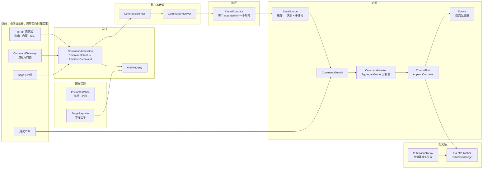

# 命令链路目标架构

日期：2026-09-26。状态：已定稿（D1、D2、D3、D5 已拍板；D4、D6、D7、D8 按推荐执行，实施到对应步骤前再确认）；迁移按附录 A 的步骤执行。

本文从第一性原理推导命令链路（写侧，从命令进入到事件发布与等待结果）的目标架构。现有实现不是设计前提：它只在两处出现，一是 §1 的兼容边界，二是附录 A 的迁移起点。其余各章描述的是“应该是什么”，不是“现在是什么”。审查发现（附录 B）只用来检验推导出的原理是否覆盖了真实的失败模式。

## 1. 兼容边界

Wow 已在 Maven Central 发布到 9.1.5，有真实用户。架构只对下列外部契约负责，它们以边缘适配器的形式存在，核心不为它们扭曲。

| 契约 | 约定 |
|---|---|
| 领域建模 API：聚合与状态类的形状，`@OnCommand`、`@OnSourcing`、`@OnError`、`@AfterCommand`、`@CreateAggregate`、`@AllowCreate`、`@VoidCommand`、`@AggregateId`、`@TenantId`、`@OwnerId`、`@StaticTenantId`、`@CommandRoute` 等注解，命令函数支持的参数与返回类型 | 保证源码兼容。唯一的语义收紧见 §5.6：原来在运行时才暴露的歧义（重复处理器、无法注入的参数）改为启动失败 |
| `CommandGateway` 的发送与等待方法、`CommandWait` 工厂、`CommandResult` | 保证源码兼容。`CommandGateway` 不再继承 `CommandBus`（§5.3），只在 9.2.0 生效 |
| REST 命令 API：路由、请求头、请求与响应 JSON、SSE、错误码及 HTTP 状态 | 保证。例外是安全修复：`Command-Header-*` 不能再写框架保留键，门面只接受已注册且启用的命令（§5.1） |
| 已持久化的事件流与快照 | 永远可读。新写入的事件流不再含传输控制头（§5.2） |
| Kafka 上的命令与事件消息 | 滚动升级期间新旧实例互读：新格式在 9.2.x 内保持对 9.1.x 消息可读 |
| 测试 DSL（`AggregateSpec`、`aggregateVerifier`） | 保证源码兼容；行为改为与生产内核一致（§5.15），原来与生产不一致的断言会变 |
| Gradle 坐标与 starter 的 feature | 不变：不拆模块（§10） |

其余一律不做兼容：`CommandFilter` 与命令侧的 `ExchangeFilter`、`@Order` 约束、`ServerCommandExchange` 的属性方法、`MessageFunction` 模型、`AggregateProcessor` 系列、装配方式、指标与追踪装饰器、内部头键与等待头格式，都按本文直接设计，不保留过渡层。仓库内 `CommandFilter` 的实现者只有 `TraceAggregateFilter` 和 starter 装配，示例与 compensation 都没有；外部用户的过滤器在发布说明里给出到 §5.13 扩展点的映射。

破坏性变化只进 9.2.0（AGENTS.md：破坏性变化只在 x.Y.0 发布）。

## 2. 问题

命令链路是 CQRS 的写侧。它要做的事情是：

> **把一个意图变成恰好一次的状态变更：在唯一的写者上，基于最新已提交状态做出确定的决定，以一次原子追加提交；然后把已提交的事实至少一次地交给所有观察者，并如实告诉发起者结果。**

参与者：

- **发起者**：HTTP 客户端、进程内应用代码、Saga、补偿、测试 DSL。
- **聚合**：用户编写的命令函数（决定）与溯源函数（演化）。
- **事件存储**：Mongo、Redis、内存；以后可能更多。唯一的提交点。
- **观察者**：投影、Saga、快照、事件处理器、等待中的发起者。
- **传输**：进程内、Kafka；以后可能更多。

## 3. 第一性原理与不变量

| # | 原理 | 由此得出的不变量 |
|---|---|---|
| P1 | 提交点唯一 | 事件存储以 `(aggregateId, version)` 与 `requestId` 唯一性完成的追加，是唯一的提交点。之前没有对外可见的副作用；之后的一切都能从已提交的事件流重建 |
| P2 | 结果如实 | 每条命令的结局只有四种：已提交、早已提交（重复请求）、被拒绝、结局未知。“结局未知”必须先查明再行动，绝不把已提交的命令报告为失败，也绝不在未查明时重新执行决定 |
| P3 | 事实只决定一次 | 命令 ID、请求 ID、聚合 ID、租户、所有者、空间、期望版本、创建语义、操作人，在准入时各由一条规则决定一次；下游只读。来源冲突即拒绝，不静默覆盖 |
| P4 | 安全在构造上成立 | 客户端不能写入框架拥有的键；创建语义来自命令类型，不来自请求输入；准入对所有入口相同，不依赖入口记得调用 |
| P5 | 消息不可变 | 消息构造后不再修改。传输控制信息（等待、本地优先）不写进消息头，更不持久化 |
| P6 | 契约在类型上 | 阶段之间的数据用类型传递。没有字符串键的属性包，没有靠排序维持的隐式依赖 |
| P7 | 编译一次，热路径不解释 | 每个聚合类型在启动时编译成模型：分发表、参数解析器、结果适配器、溯源表、守卫。热路径上没有反射、没有重建可复用对象；无法满足的依赖在启动时失败 |
| P8 | 决定是纯的，演化在提交后 | 决定只读已提交状态。事件只在提交成功后应用到状态；应用失败的状态实例立即丢弃，不复用 |
| P9 | 单写者串行，互不阻塞 | 同一 `aggregateId` 严格串行；不同 `aggregateId` 永不互相阻塞，重试与退避也不例外 |
| P10 | 至少一次发布，可恢复 | 发布失败或进程崩溃后，已提交未发布的事件由存储驱动的恢复路径补发，不依赖原进程存活，也不依赖人工 |
| P11 | 资源与模型数无关 | 线程数、传输消费者数由吞吐与分区决定，不随聚合类型数线性增长 |
| P12 | 观察不干预 | 等待、指标、追踪挂在固定接缝上，不改变处理结果，不参与正确性 |
| P13 | 所有者唯一 | 每个资源由创建者释放；生命周期只有一个所有者；停机先关外部入口，再排空派生工作 |
| P14 | 变更局部 | 新增入口、守卫、参数类型、返回类型、发布目标、存储、传输，各是一处注册；漏实现导致编译或启动失败 |

## 4. 架构总览



依赖规则：边缘依赖入口，入口依赖端口，适配器实现端口。内核不依赖传输、HTTP、Spring 或存储驱动。观察接缝由装配根挂在固定位置，内核不感知它们。

一条命令的生命周期：

1. **准入**：入口把意图交给 `CommandAdmission`，得到不可变的 `AdmittedCommand`。如果调用方要等待，等待计划作为独立的值登记到 `WaitRegistry`，不进消息头。
2. **路由**：`CommandSender` 把命令送到聚合当前的唯一处理者，可以是本地邮箱，也可以经分布式传输。
3. **执行**：`KeyedExecutor` 把命令放进该 `aggregateId` 的邮箱，由共享工作线程串行执行。
4. **内核**：取状态 → 守卫 → 决定 → 提交 → 提交后应用。内核返回类型化的 `CommandOutcome`。
5. **发布**：`EventPublisher` 把已提交的事件流交给各发布目标。内联发布只是快路径；失败或崩溃由 `PublicationRelay` 从存储补发。
6. **确认与报告**：传输消息在内核给出最终结局后确认；`StageReporter` 在各阶段报告等待信号。

## 5. 组件

### 5.1 准入：CommandAdmission

所有入口（HTTP 路由、HTTP 门面、进程内网关、Saga、补偿）产出同一个中性输入，交给同一条准入管道。

```kotlin
class CommandIntent(
    val body: Any,
    val hints: IdentityHints,        // 每个事实带来源：ROUTE / AUTH / HEADER / BODY / UPSTREAM
    val principal: CommandPrincipal?, // 已认证的操作人
    val upstream: Message<*, *>?,     // Saga、补偿的上游消息
    val extensions: Map<String, String>, // 只能写 x. 命名空间
)
```

`CommandDescriptor` 在启动时按命令类型编译一次，来自命令元数据与路由元数据：身份规则、创建语义、改写器、校验器、稳定的命令名（供门面使用）、是否启用。

准入步骤，顺序固定：

1. **解析描述符**。门面按注册的命令名查找，不再对客户端给的类名做 `Class.forName`；未注册或 `enabled=false` 即拒绝。
2. **改写**：`CommandRewriter` 对所有入口一视同仁。
3. **校验一次**：JSR 校验加 `CommandValidator`，在改写之后、去重之前。
4. **解析身份**：优先级为 路由 > 认证 > 请求体 > 请求头 > 上游；同一事实的两个来源不一致即拒绝（`IdentityConflict`），不静默覆盖。租户、所有者、空间、聚合 ID 各只有这一条规则。
5. **创建语义**：由命令类型决定（`@CreateAggregate`、`@AllowCreate`）。期望版本为 0 只对这两类命令有意义，见决定 D2。
6. **确定性 ID**：Saga 与补偿发出的命令，`requestId = f(上游事件 ID, 序号)`；创建命令未显式给出聚合 ID 时，`aggregateId = nameUUID(requestId)`，使重试天然幂等。
7. **构造不可变消息**：`AdmittedCommand` 包装不可变的 `CommandMessage`。
8. **请求 ID 预留**：本地布隆过滤器只是优化；持久保证在提交点（P1）。发送失败时释放预留，校验失败不消耗预留。

准入的结果是类型化的：`AdmittedCommand` 或 `CommandRejection`（§7）。拒绝一律渲染为 SENT 阶段的 `CommandResult`，HTTP 只有一个映射器。

HTTP 适配器只负责收集提示：解码请求体（一次解码，路由变量在对象上绑定，不再先转 `ObjectNode`），读取路由与请求头，取认证主体。`Command-Header-*` 只能写入 `x.` 命名空间的扩展键，写框架保留键即拒绝。

### 5.2 消息与头

头分三类，由键注册表区分：

| 类别 | 例子 | 持久化 | 谁能写 |
|---|---|---|---|
| 元数据 | trace、operator、upstream、request context | 是 | 准入与传播策略 |
| 传输控制 | 等待计划、本地优先 | 否 | 网关与路由，只在传输信封上 |
| 扩展 | `x.*` | 按传播策略声明 | 入口（客户端） |

`Header` 是不可变的持久化映射，`with` 返回新实例。总线不再冻结调用方的对象，因为对象本来就不可变。

传播由注入的 `PropagationPolicy` Bean 完成，取代 ServiceLoader 单例与 JVM 系统属性开关。每个策略声明它管理的键、是否持久化、作用于哪些下游消息。请求上下文中的个人数据（`user_agent`、`remote_ip`）是否写进事件头，见决定 D7。

### 5.3 网关：CommandGateway

`CommandGateway` 是进程内入口的门面，由三部分组成：`CommandAdmission`、`CommandSender`、`WaitRegistry`。它不是总线，不接收命令，也不关闭它没有创建的资源。

- `send`：准入 → 发送。
- `sendAndWait` / `sendAndWaitStream`：准入 → 登记等待 → 发送 → 等待。只有一个截止时间实现，在 `WaitRegistry` 内部统一调度。
- SENT 信号只有一条路径：发送成功后由网关直接交给等待句柄。

分发器从 `CommandReceiver` 接收命令，与网关无关。

### 5.4 路由与传输

两个端口：

```kotlin
interface CommandSender { fun send(envelope: CommandEnvelope): Mono<Void> }
interface CommandReceiver { fun receiver(subscription: MessageSubscription): MessageReceiver<CommandDelivery> }
```

`CommandEnvelope` = 不可变消息 + 传输控制（等待、本地优先）。`CommandDelivery` = 消息 + 确认句柄。接收只有一个 API，装饰器不会漏掉运行时准入协议。

**本地优先是路由策略，不是一种总线。** `RoutingCommandSender` 决定走本地邮箱还是分布式传输。本地投递以接收方的处理准入为确认点（沿用现有的投递票据语义）。已本地处理的命令与事件仍发到分布式传输（供外部消费者），但不在发送路径上同步等待：本地投递确认后即完成，分布式副本异步发送，失败只影响外部消费者，记指标（决定 D3）。

**消费者按限界上下文，不按聚合类型。** 每种分发器每个上下文一个接收器，订阅该上下文的全部主题；分区按 `aggregateId` 路由，保证单写者。消费者数量由分区数与吞吐决定（P11）。

### 5.5 执行：KeyedExecutor

- 一个共享的工作线程池，大小按核数配置，所有聚合类型共用（P11）。
- 每个活跃的 `aggregateId` 一个邮箱；邮箱内串行，邮箱之间并行（P9）。空邮箱回收，活跃邮箱数有上限，达到上限时对传输施加背压。
- 重试与退避只推迟本邮箱的下一次执行，不占用工作线程，不阻塞其他邮箱。
- 运行时准入（`RuntimeActivity`）在进入邮箱时取得，命令给出最终结局后释放。
- 确认策略 `AckPolicy`：命令在内核给出最终结局（已提交、早已提交、被拒绝）后确认；结局未知且查明失败时不确认，交给传输重投。

### 5.6 内核：AggregateModel 与 AggregateKernel

**编译模型**。每个聚合类型在启动时编译一次 `AggregateModel<C, S>`：

- `commandTable`：命令类型 → `CommandInvoker`。多态匹配在编译时解析；同一命令类型有多个处理器、找不到处理器、参数无法解析，一律启动失败。
- `CommandInvoker` 是无状态的，接收者作为参数传入：`invoke(root, context)`。它持有：
  - 固定元数的方法句柄；
  - 编译好的 `ParamResolver[]`：请求体、消息、头、聚合 ID、状态、命令聚合、服务（启动时绑定一次）等；
  - 编译时选定的 `ResultAdapter`：同步、Mono、Flux、Publisher、suspend、Flow。所有适配器用同一条异常解包规则，对空结果与 `Unit` 用同一条规则（见 §7）；
  - 预先算好的 after 调用列表与至多一个错误调用。
- `SourcingTable`：事件类型 → 溯源调用，所有状态实例共享。系统事件（删除、恢复、所有者、空间、标签）也是表中的条目。
- `guards`：该聚合的守卫列表（下文）。

扩展点只在编译时查询：`ParamResolverFactory`、`ResultAdapterFactory`。新增可注入类型或返回类型是一次注册（P14）。

**内核流程**：

```kotlin
fun execute(model, command, state): Mono<CommandOutcome>
```

1. **守卫**：`CommandGuard` 返回 `Rejection` 或通过，不抛异常。内置守卫依次为：版本、存在性与创建语义、删除与恢复、所有者、空间。用户守卫经 SPI 注册，排在内置守卫之后。所有者与空间守卫的判据来自准入已确定的事实，不再因为调用方留空就跳过（见决定 D2）。
2. **决定**：调用 `CommandInvoker`，得到 `Decision = Events(list) | NoOp`。命令函数只读状态。
3. **构造提交请求**：`CommitRequest(aggregateId, expectedVersion, events, requestId, header)`。
4. **提交**：`CommitPort.append` 返回 `AppendOutcome`（§5.7）。
5. **提交后应用**：事件应用到状态。应用失败的状态实例丢弃并从缓存驱逐；已提交的事件照常发布（P8）。
6. 返回 `CommandOutcome = Committed(stream, state) | AlreadyCommitted(version) | Rejected(rejection) | NoOp`。

溯源的原子性：`SimpleStateAggregate` 先校验版本连续与事件归属，再执行用户溯源函数，全部成功后才推进版本、事件 ID 等元数据。

**错误函数**：`@OnError` 在最终失败后执行一次，在重试循环之外，收到最后一次已提交的状态与最终错误。它可以把错误替换成另一个错误，原错误作为 suppressed 保留；它的返回值不影响是否重试。

**删除的东西**：`CommandState`、`RetryableAggregateProcessor`、`AggregateProcessorFilter`、每条命令新建的 `SimpleCommandAggregate` / `CommandFunctionResolver` / `CommandFunction`、`ServerCommandExchange` 的属性包契约。

### 5.7 提交：CommitPort

```kotlin
sealed interface AppendOutcome {
    data class Committed(val version: Int) : AppendOutcome
    data class AlreadyCommitted(val requestId: String, val version: Int) : AppendOutcome
    data class Conflict(val currentVersion: Int?) : AppendOutcome
    data class Unknown(val cause: Throwable) : AppendOutcome
}
```

- 存储把冲突与重复请求翻译成值，不再依赖异常类判断可恢复性，也不再按错误文本里的索引名猜测。
- **Conflict**：驱逐缓存，重载，重新决定；有次数上限，退避只推迟本邮箱。
- **Unknown**（超时、网络错误、写关注错误）：先按 `requestId` 查明。已提交则按 `AlreadyCommitted` 继续；未提交才重新执行。查明本身失败时不确认传输消息，等待方得到“结局未知”。
- **AlreadyCommitted**：幂等成功，继续发布已提交的事件流，等待方得到原版本；见决定 D8。
- 重复聚合 ID（创建命令撞到已存在的聚合）是被拒绝，不是冲突。
- 存储不变量一致：各存储都强制版本连续、租户参与唯一键（需要数据迁移，附录 A 第 11 步），`existsRequestId` 必须走索引。

### 5.8 状态来源与缓存

`StateSource` 按顺序取状态：缓存 → 快照 + 事件尾 → 空状态（仅创建语义允许时）。

`AggregateStateCache` 按条目数有界。条目 = 已提交的状态 + 版本。正确性不依赖对聚合的独占：追加有版本乐观锁兜底。Kafka 再平衡或多实例写入导致的冲突，只需驱逐后重载（§5.7）。

缓存在三种情况下驱逐：冲突、结局未知、应用失败。缓存能开启的前提是 P8 已经成立，也就是失败时不会留下被污染的状态实例。默认开启，可以配置关闭，见决定 D4。

### 5.9 发布：EventPublisher 与 PublicationRelay

- `EventPublisher` 按目标顺序发布：先领域事件，再状态事件；同一聚合内保持提交顺序。每个目标实现 `PublicationTarget`，新增目标（如 CDC、Webhook）就是新增一个实现。
- 状态事件由已提交的事件流加上提交后的状态构造。它经过同一条发布管道与恢复路径，不再只打日志了事。
- **内联发布只是快路径**。`PublicationRelay` 从存储读取“已提交未发布”的事件流补发：Mongo 用 change stream 或发布游标，Redis 在追加脚本里同时写入 outbox，内存存储同步发布。至少一次投递，消费者按 `(aggregateId, version)` 去重（它们本来就必须这样做）。实施范围见决定 D5。
- 指标：“已提交未发布”的最大滞留时长。

### 5.10 快照

快照有两个用途，按两件事分别对待：

- **加速重建**：有了状态缓存（§5.8），命令路径上不再读快照，只在缓存未命中时读。
- **查询读模型**：快照集合同时是查询的读模型，它的新鲜度由快照策略决定。

默认策略保持 `ALL`，以免改变查询的新鲜度。快照保存失败不确认对应的状态事件，交给重投或补偿处理。把重建快照与查询读模型拆成两件东西，不在本文范围内，记入 §13。

### 5.11 等待

等待是观察，不是正确性的一部分（P12）。

- **`WaitContext`**：一个值，包含 `waitCommandId`、端点、`WaitTarget` 和角色（根或子）。它由唯一的编解码器 `WaitCodec` 编码到传输信封上，链头与链尾用显式的角色键表达，不再靠键的位置表达含义。每条消息最多解析一次，解析结果缓存在投递上下文里。
- **`WaitPropagationPolicy`**：目标阶段不晚于 PROCESSED 时，不向下游传播。只有后续阶段能满足目标时，才把上下文复制到事件上。只有目标 Saga 函数发出的命令才带链尾。事件在追加前剥离全部等待键（P5）。
- **`StageReporter`**：处理侧唯一的钩子，签名为 `report(delivery, stage, outcome)`。每个阶段提供一个小的 `StageSignalExtractor`，负责给出是否最后一个、子命令列表和结果。新增阶段就是新增一条注册。
- **`WaitSignalRouter`**：按端点路由。端点指向自己就直接登记，否则经 `RemoteWaitTransport` 发送。远程发送有并发上限，远程端点需要认证。配置了分布式传输却没有远程等待传输时，启动失败。
- **`WaitRegistry`**：负责登记、唯一的截止时间，以及一个统一的归约接口；链式等待由多个单阶段归约组合而成。信号在锁外、经调度器发出。链式等待要求 `waitCommandId` 等于根命令 ID，准入时校验。
- 多事件命令的完成语义见决定 D6。

### 5.12 观察：Instrumentation

```kotlin
interface Instrumentation {
    fun <T> around(seam: Seam, descriptor: OperationDescriptor, operation: Mono<T>): Mono<T>
}
```

- 接缝是固定的：发送、接收、执行、决定、提交、发布、等待。
- 指标与追踪是 `Instrumentation` 的两个实现，由装配根按固定顺序挂载。取代两个 BPP 的类型分支，以及分发器与处理器上两个重复的计时器。
- `OperationDescriptor` 按聚合与命令类型预先构造，不在每条消息上构造。

### 5.13 装配与扩展点

wow-core 提供唯一的装配根 `CommandPipelineAssembly`：输入存储、传输、扩展点贡献与 `Instrumentation`，输出网关、分发组件和运行时组件拓扑。Spring、TCK、JMH 都调用它，基准因此测到的就是生产链路。

通用的命令过滤器取消。原来需要过滤器的场景，都映射到类型化的扩展点：

| 需求 | 扩展点 | 位置 |
|---|---|---|
| 改写命令 | `CommandRewriter` | 准入 |
| 业务前置检查、授权 | `CommandGuard` | 内核守卫 |
| 可注入参数、返回类型 | `ParamResolverFactory`、`ResultAdapterFactory` | 模型编译 |
| 提交后的新去向 | `PublicationTarget` | 发布 |
| 指标、追踪、日志 | `Instrumentation` | 固定接缝 |
| 头的传播 | `PropagationPolicy` | 准入与派生消息 |

每个扩展点只在一个位置被调用，调用顺序写在装配根里，不靠 `@Order`。同一扩展点内有多个贡献时，需要显式声明先后；约束出现环或悬空时启动失败。解析后的链路以描述符输出，并有快照测试。

### 5.14 运行时生命周期

保留三个经过验证的决定：启动屏障（全部组件先就绪，再统一开启处理）、全局静默（命令、事件、Saga 构成环，不能逐个停组件）、故障即整体停机。

在此之上的改变：

- **先停持久入口**。停机第一步暂停从持久传输拉取（`RuntimeComponent.suspendDurableIntake`）：持久传输会重投未确认的消息，不拉取不会丢；已经拉到手的消息和它派生的进程内工作继续在静默期内被接纳，直到全局空闲。只有进程内投递会丢消息，全局静默只为它存在。持续有外部流量时，停机不再必然等到超时。准入本身不区分来源，`RuntimeContext` 不变。（附录 A 第 0 步已实施）
- **活动计数**。只在静默阶段维护活动版本号。计数按组件分段，只在静默时汇总判断是否归零，避免全局缓存行热点。
- **生命周期所有者唯一**。运行时的状态迁移由一个串行的生命周期事件循环处理，包括 start、stop、failure、deadline、force。组件改用 `LifecycleSupport` 模板，只实现打开入口、关闭入口、排空三个钩子，不再各自维护状态机。
- **组件拓扑由装配根产出**，取代 starter 里的整数顺序。

### 5.15 测试 DSL

测试 DSL 驱动同一个 `AggregateKernel.execute`，使用相同的守卫、相同的结局规则；存储替换为测试用的 `CommitPort`。给定事件按真实版本逐条追加。每一步之后重新取状态，不复用可能失败过的实例。

## 6. 性能模型

单条命令的 I/O 往返，按默认配置、Kafka 分布式传输计：

| 环节 | 现状 | 目标 |
|---|---|---|
| 读状态 | 快照读 + 事件尾读（2 次） | 缓存命中 0 次；未命中 2 次 |
| 本地优先发送 | 本地投递 + Kafka 同步发送 | 本地投递；Kafka 副本异步（D3） |
| 提交 | 1 次追加 | 1 次追加 |
| 发布 | 领域事件 + 状态事件，各自本地优先双发 | 领域事件 + 状态事件 |
| 快照 | 每个事件 1 次 upsert（`ALL`） | 不变（§5.10） |

CPU 与分配方面，每条命令不再有以下开销：

- 构造处理器、命令聚合、函数解析器、函数对象、after 列表；
- 每次调用、每个参数的服务查找；
- 每次加载都重建溯源表；
- 属性包写入；
- 两个重复的计时器。

线程方面，从“聚合类型数 × 核数”降为一个共享池。Kafka 消费者从“聚合类型数 × 分发器种类数”降为“上下文数 × 分发器种类数”。

每一步以 JMH 生产链路基准加以约束：吞吐不降、`gc.alloc.rate.norm` 不升。

## 7. 错误与结局目录

- 准入拒绝 `CommandRejection`：`Decode`、`NotRoutable`、`Validation`、`IdentityConflict`、`Forbidden`、`Duplicate`、`RewriteNoCommand`。一律渲染为 SENT 阶段的 `CommandResult`，HTTP 只有一个映射器；`REWRITE_NO_COMMAND` 补上映射。
- 内核拒绝：每个守卫一个错误码。恢复前置条件不满足时，不再抛不带错误码的 `IllegalStateException`。
- 可恢复性分三类：`RECOVERABLE`（冲突，可以重新决定）、`UNKNOWN_OUTCOME`（必须先查明）、`UNRECOVERABLE`。只有第一类会直接重新执行决定。
- 空结果：命令函数返回空、`Unit` 或空集合，一律是 `NoOp`。成功，不产生事件，不追加。与是否存在 after 函数无关。

## 8. 线上格式

- 命令与事件消息的元数据头保持现有键名。传输控制键移到传输信封上：Kafka 消息保留一个信封字段，进程内直接是对象字段。
- 9.2.x 的读取端兼容 9.1.x 写入的消息，包括头里的等待键，满足滚动升级；写入端只写新格式。
- 已持久化的事件流在读取时忽略遗留的等待键。

## 9. 包结构

全部在 wow-core 内，不新增模块：

```
me.ahoo.wow.command.admission   CommandIntent、CommandDescriptor、CommandAdmission、身份解析
me.ahoo.wow.command.gateway     CommandGateway 实现
me.ahoo.wow.command.routing     CommandSender/Receiver、RoutingCommandSender
me.ahoo.wow.command.execution   KeyedExecutor、AckPolicy、RetryPolicy
me.ahoo.wow.command.kernel      AggregateModel、编译器、Invoker、Guards、AggregateKernel、Outcome
me.ahoo.wow.command.commit      CommitPort、AppendOutcome
me.ahoo.wow.command.publication EventPublisher、PublicationTarget、PublicationRelay
me.ahoo.wow.command.wait        等待（重写）
me.ahoo.wow.command.assembly    CommandPipelineAssembly
```

wow-webflux 只留 HTTP 适配器；wow-spring-boot-starter 只调用装配根。

## 10. 模块与依赖

不拆模块，不新增依赖。状态缓存用 wow-core 内的有界 LRU；如需引入 Caffeine，届时另行确认。

## 11. 质量属性与验收

- **正确性**：附录 B 的每条正确性问题都有特征测试；先写成失败，修复后转为回归测试。
- **契约**：REST 黄金测试、OpenAPI 快照、TCK（`EventStoreSpec`、`CommandDispatcherSpec` 等）全绿。
- **性能**：JMH 生产链路基准，见 §6。
- **停机**：持续入流下的停机测试，在静默期加一个周期内完成。

## 12. 决定

| # | 问题 | 推荐 | 状态 |
|---|---|---|---|
| D1 | 破坏性变化进入 9.2.0 | 是 | 2026-09-26 定：是 |
| D2 | 非创建命令带期望版本 0，以及所有者、空间留空时守卫是否跳过 | 版本 0 只对 `@CreateAggregate` / `@AllowCreate` 有效，其余命令拒绝；所有者、空间的判据来自准入确定的事实，不因留空跳过 | 2026-09-26 定：按推荐 |
| D3 | 已本地处理的命令与事件，是否仍同步发到 Kafka | 不发。它们在所有接收方都会被过滤后直接确认，既不参与处理也不用于恢复 | 2026-09-26 定：**异步发**，保留副本但不在发送路径上同步等待 |
| D4 | 状态缓存默认开启 | 开启，可配置关闭 | 按推荐；步骤 5 前确认 |
| D5 | 发布恢复路径（relay）的实施范围 | 先上“已提交未发布”检测与指标，再实现 Mongo 与 Redis 的 relay | 2026-09-26 定：按推荐 |
| D6 | 多事件命令的 EVENT_HANDLED / SAGA_HANDLED 何时完成 | 全部事件处理完才完成 | 按推荐；步骤 8 前确认 |
| D7 | `user_agent`、`remote_ip` 等请求上下文是否写进事件头 | 默认不写，可配置开启 | 按推荐；步骤 6 前确认 |
| D8 | 重复的请求 ID | 幂等成功，返回原版本；HTTP 200 | 按推荐；步骤 3 前确认 |

## 13. 后续待办

- 把重建快照与查询读模型拆开，使快照策略只影响重建（§5.10）。
- 批量追加（`infra/batch`）在有了状态缓存与共享执行器之后，按 JMH 与负载测试重新评估，决定保留还是删除。

## 附录 A：从现状出发

每一步是一个或多个可独立合并的 PR。每个 PR 本地只验证改到的模块；改到公开 Kotlin API 形状时，加跑 `:wow-benchmarks:compileJmhJava`。

| 步 | 内容 | 覆盖 |
|---|---|---|
| 0 | **安全与正确性修复**（小 PR，不改架构）：`Command-Header-*` 保留键防护，操作人在 appender 之后确定；门面只接受已注册且启用的命令；追加结局未知时先按请求 ID 查明，不再盲目重跑；`@OnError` 移出重试循环，每次尝试使用新的上下文；等待键不入库，收窄传播，校验链式等待 ID；先校验再去重，发送失败释放预留；持续入流下先停持久入口 | B1–B8 |
| 1 | **护栏**：JMH 改测生产链路；链路描述符与快照测试；为附录 B 中需要拍板的行为写特征测试 | — |
| 2 | **模型编译**：`AggregateModel`、无状态 `CommandInvoker`、`ParamResolver`、`ResultAdapter`、共享的 `SourcingTable`；启动时失败 | B11, B15 |
| 3 | **内核**：守卫管道、`Decision`、`CommitPort` 与 `AppendOutcome`、提交后应用、溯源原子性；删除 `CommandState`、`RetryableAggregateProcessor`、`AggregateProcessorFilter` | B9, B10, B13 |
| 4 | **执行**：`KeyedExecutor`、共享线程池、每个 key 独立重试、按上下文的接收器 | B16, B17, B18 |
| 5 | **状态缓存** | B19 |
| 6 | **准入与消息**：`CommandAdmission`、身份解析、不可变头、`PropagationPolicy`、网关与总线分离、单一接收 API | B12, B14, B20 |
| 7 | **发布**：`EventPublisher`、`PublicationTarget`、未发布检测、relay | B21, B22 |
| 8 | **等待**：`WaitContext`、`WaitCodec`、`StageReporter`、`WaitSignalRouter`、归约合并 | B23 |
| 9 | **观察与装配**：`Instrumentation`、`CommandPipelineAssembly`；删除 BPP 与 `CommandFilter` | B24, B25 |
| 10 | **运行时生命周期**：事件循环状态机、`LifecycleSupport`、分段计数、拓扑由装配根产出 | B26 |
| 11 | **存储卫生**：租户参与唯一键（含数据迁移）、版本连续检查、Redis 用 `Mono.error` | B27 |
| 12 | **测试 DSL** 迁到内核 | B28 |

## 附录 B：审查发现

2026-09-26 分六路审查：主干、等待、装配、入口、内核、提交。关键项已对照源码核实。

**正确性与安全**

- B1【高】客户端可以通过 `Command-Header-command_operator` 冒充操作人。原因是扩展头 appender 在操作人设置之后运行，且没有保留键检查（`CommandRequestExtendHeaderAppender.kt`、`CommandMessageExtractor.kt:42`）。
- B2【高】命令门面对客户端给出的类名做 `Class.forName`，从而绕过 `@CommandRoute(enabled=false)`（`CommandFacadeBodyExtractor.kt`）。
- B3【严重】追加时的超时或网络错误被归为可恢复，于是重新执行“加载、决定、追加”。写入其实已经提交时，事件永远不会发布，调用方收到失败，`@OnError` 还可能对这条成功的命令执行补偿（`MongoRecoverableExceptionProvider.kt`、`RetryableAggregateProcessor.kt`）。
- B4【高】`@OnError` 在重试循环内执行，每次重试都调用一遍；它返回的错误还会反过来决定是否重试（`SimpleCommandAggregate.kt:145-159`）。
- B5【高】重试时交换对象上的状态跨次残留，只清除了错误；等待信号会报告一个从未持久化的版本。
- B6【高】等待头随命令复制到事件流上，被永久写入事件存储（`ExtractedWaitPlan.kt:48`）。链式等待没有校验 `waitCommandId`；链尾头会传播到无关的 Saga。
- B7【高】去重在校验之前执行，发送失败也不释放；没有 `EventStore` 时存在性检查默认回答“已存在”。Saga 的创建命令每次重试都生成新的随机聚合 ID，会造成重复聚合；Saga 直接返回的 `CommandMessage` 没有确定性的请求 ID。
- B8【高】持续有外部流量时，准入一直不关闭，优雅停机必然等到超时（`WowRuntime.kt:515-528`、`DefaultRuntimeContext`）。
- B9【高】事件在追加之前就应用到状态，`@OnError` 看到的是未持久化的状态；溯源先推进版本，再执行用户函数，后者抛异常会留下应用了一半的状态。
- B10【中】命令没有产出事件时是否算成功，取决于有没有无关的 after 函数；Flow 处理器不解包 `InvocationTargetException`（未核实）；suspend 处理器会离开聚合的调度器。
- B11【中】重复的处理器被静默取第一个；按精确类型分发，用接口或父类型声明参数的处理器永远匹配不到；参数无法注入时注入 `null`，到运行时才出错。
- B12【高】期望版本为 0 就被当作创建，绕过 `@CreateAggregate` / `@AllowCreate`（`CommandFactory.kt:127`）；所有者、空间守卫在调用方留空时直接跳过。

**架构**

- B13 阶段之间靠字符串键的属性包传数据；过滤器顺序靠 `@Order`，而且不是拓扑排序，出现环或悬空时静默（`SortedByOrder.kt`）。
- B14 `CommandGateway` 继承 `CommandBus`，分发器从网关接收命令，装配时要捕获循环依赖异常来绕开。
- B15 函数绑定在聚合实例上，每条命令都重新构造函数对象；KSP 只生成命名元数据，处理器发现全部在运行时进行。
- B20 同一个身份事实在四五处被决定，请求体静默覆盖路由；消息与头可变，总线会冻结调用方的对象；传播靠 ServiceLoader 单例和系统属性开关。
- B21 提交后没有恢复路径：发布失败或进程崩溃后，事件存储会一直领先于总线；状态事件发送失败只打日志。
- B22 本地优先投递在入队时即视为成功，而分布式副本被标记为已处理，崩溃会导致本地处理者丢消息。
- B23 等待：同一套头键在不同位置含义不同；链式与单阶段各有一套重复的状态机；按 CosId 的机器号路由，而不是按端点；在锁内发出信号；远程端点没有认证。
- B24 横切关注点有三套机制，BPP 的类型分支需要手工同步；分发器和处理器各有一个计时器，测的是同一段工作。
- B25 Spring、TCK、JMH 各自手工拼装处理链，基准测的不是生产链路。
- B26 生命周期状态机在运行时、主分发器、聚合分发器三层各实现一次。
- B27 各存储的不变量不一致：Mongo 与内存存储不检查版本连续；唯一键不含租户。
- B28 测试 DSL 重新实现了加载和部分守卫，与生产行为不一致。

**性能**

- B16 每种聚合类型各建一个 `newParallel(核数)` 线程池。
- B17 分发按哈希分组串行，组内的重试退避阻塞同组所有聚合。
- B18 Kafka 消费者数 = 聚合类型数 × 分发器种类数。
- B19 没有状态缓存，每条命令两次读 I/O；本地优先对命令和事件都双发，并同步等待 Kafka；本地投递每条命令进一次全局锁。
- 另外：每条命令、每个参数都查一次服务；每次加载都重建溯源表；每个阶段都重复解析等待头；每条消息对运行时全局计数做 3～4 次原子操作。
