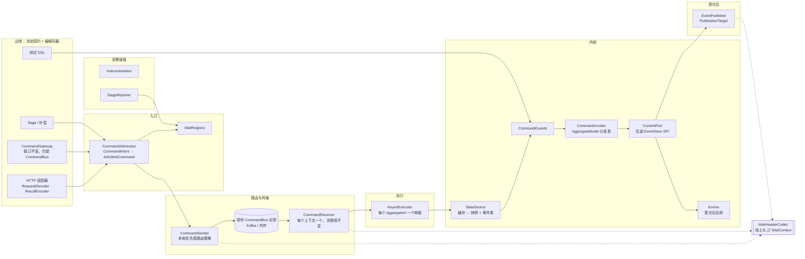

# 命令链路 v9 架构：外壳冻结，内部重构

日期：2026-09-28。状态：由 [Wow 9.3.0 整体重构](2026-10-04-wow-930-refactor-design.md) 接管实施（2026-10-04）。§13 的 V1–V9 已在该文 §8 Q6 拍板：V1 继续写入存储、只收窄传播；V2、V3、V5、V6 按推荐；V7 WARN；V8 可配置默认关闭；V9 不进 9.3.0。实施步骤按该文 §5 重新编排。

本文从第一性原理推导命令链路（写侧，从命令进入到事件发布与等待结果）在 v9 内的架构。原则是：**最外层的公开入口与出口保持兼容，内部实现可以完全重构。** 现有实现只在两处出现：一是 §3 的兼容边界，二是附录 A 的迁移起点。审查发现（附录 B）只用来检验推导出的原理是否覆盖了真实的失败模式。

## 1. 约束

Wow 已在 Maven Central 发布到 9.1.5，有真实用户。两条硬约束：

1. **RESTful API 兼容**：路由、请求头、请求与响应 JSON、SSE、错误码、HTTP 状态都不变。
2. **已存在的存储契约不变**：已持久化的格式、索引和唯一键不变，存储 SPI 也不变。

由第 2 条和“跨版本服务要能协作”还能推出第 3 条：

3. **线上契约双向兼容**：9.1.x 与 9.2.x 混部时，任一方写出的消息、存储记录与等待信号，另一方都要能读懂，并且行为一致。只做到“新版能读旧格式、只写新格式”不满足这一条，因为旧实例读不懂新格式。

**判定规则**：一项改变能不能进 v9，只看一件事：把 9.1.x 与 9.2.x 部署在同一个集群，共用同一套存储、Kafka 和 HTTP 客户端，在任一方向上，调用、读取和行为是否都与 9.1.x 一致。能通过这条检验的内部改变都允许做，通不过的不做。本文只写要做的事；被否决的方案只在解释某个决定时出现，不另列清单。

破坏性变化只进 9.2.0（AGENTS.md：破坏性变化只在 x.Y.0 发布）。本文涉及的破坏性变化只有决定 V5、V6，都在内部 SPI 上。`CommandGateway` 可以破坏，但权衡后保留原形状（§7.3）。

## 2. 问题与原理

### 2.1 问题

命令链路是 CQRS 的写侧。它要做的事情是：

> **把一个意图变成恰好一次的状态变更：在唯一的写者上，基于最新已提交状态做出确定的决定，以一次原子追加提交；然后把已提交的事实至少一次地交给所有观察者，并如实告诉发起者结果。**

参与者：

- **发起者**：HTTP 客户端、进程内应用代码、Saga、补偿、测试 DSL。
- **聚合**：用户编写的命令函数（决定）与溯源函数（演化）。
- **事件存储**：Mongo、Redis、内存；以后可能更多。唯一的提交点。
- **观察者**：投影、Saga、快照、事件处理器、等待中的发起者。
- **传输**：进程内、Kafka；以后可能更多。

### 2.2 第一性原理与不变量

“v9”一列说明该原理在 v9 内成立到什么程度。

| # | 原理 | 由此得出的不变量 | v9 |
|---|---|---|---|
| P1 | 提交点唯一 | 事件存储以 `(aggregateId, version)` 与 `requestId` 唯一性完成的追加，是唯一的提交点。之前没有对外可见的副作用；之后的一切都能从已提交的事件流重建 | 成立 |
| P2 | 结果如实 | 每条命令的结局只有四种：已提交、早已提交（重复请求）、被拒绝、结局未知。“结局未知”必须先查明再行动，绝不把已提交的命令报告为失败，也绝不在未查明时重新执行决定 | 成立；对外报告沿用现有的错误码 |
| P3 | 事实只决定一次 | 命令 ID、请求 ID、聚合 ID、租户、所有者、空间、期望版本、创建语义、操作人，在准入时各由一条规则决定一次，下游只读 | 单一规则成立；来源冲突只在越权场景下拒绝（V3） |
| P4 | 安全在构造上成立 | 客户端不能写入框架拥有的键；创建语义来自命令类型，不来自请求输入；准入对所有入口相同 | 成立 |
| P5 | 消息不可变 | 消息构造后不再修改；传输控制信息不进内部模型的头 | 内部成立；线上仍是头，由编解码器转换（§4） |
| P6 | 契约在类型上 | 阶段之间用类型传递数据，没有字符串键的属性包，没有靠排序维持的隐式依赖 | 成立 |
| P7 | 编译一次，热路径不解释 | 每个聚合类型在启动时编译成模型；热路径上没有反射，也不重建可复用对象 | 成立；无法满足的依赖先打 WARN（V7） |
| P8 | 决定是纯的，演化在提交后 | 决定只读已提交状态；事件只在提交成功后应用到状态；应用失败的状态实例立即丢弃 | 成立 |
| P9 | 单写者串行，互不阻塞 | 同一 `aggregateId` 严格串行；不同 `aggregateId` 永不互相阻塞，重试与退避也不例外 | 成立 |
| P10 | 至少一次发布，可恢复 | 发布失败或进程崩溃后，已提交未发布的事件由存储驱动的恢复路径补发 | 不成立：补发需要新增存储结构，并要求所有写者参与，违反约束 2、3（§7.9）。v9 只加观测 |
| P11 | 资源与模型数无关 | 线程数、传输消费者数由吞吐与分区决定，不随聚合类型数增长 | 成立 |
| P12 | 观察不干预 | 等待、指标、追踪挂在固定接缝上，不改变处理结果 | 成立 |
| P13 | 所有者唯一 | 每个资源由创建者释放；生命周期只有一个所有者；停机先关外部入口，再排空派生工作 | 成立 |
| P14 | 变更局部 | 新增入口、守卫、参数类型、返回类型、发布目标、存储、传输，各是一处注册；漏实现导致编译或启动失败 | 成立 |

## 3. 兼容边界

### 3.1 冻结面

| 面 | 冻结内容 |
|---|---|
| REST 命令 API | 路由、`Command-*` 请求头、请求体与响应体、SSE 事件流、错误码与 HTTP 状态映射、OpenAPI 快照 |
| 进程内入口 | `CommandGateway` 的全部方法，以及它对 `CommandBus` 的继承（这是设计取舍，不是硬约束，见 §7.3）；`CommandWait` 工厂；`CommandResult`；`CommandMessage` 的构造方式 |
| 领域建模 API | 注解（`@OnCommand`、`@OnSourcing`、`@OnError`、`@AfterCommand`、`@CreateAggregate`、`@AllowCreate`、`@VoidCommand`、`@AggregateId`、`@TenantId`、`@OwnerId`、`@StaticTenantId`、`@CommandRoute` 等），命令函数与溯源函数支持的参数和返回类型，以及它们的**可观察语义**（§7.6） |
| 存储格式 | Mongo 事件流与快照文档的字段、类型和索引，包括 `(aggregateId, version)`、`requestId`、`(aggregateId, requestId)` 等唯一键；Redis 的键布局，以及追加与快照 Lua 脚本的输入输出语义；内存存储的行为 |
| 存储 SPI | `EventStore`、`SnapshotRepository` 等接口，以及它们抛出的领域异常（`EventVersionConflictException`、`DuplicateRequestIdException`、`DuplicateAggregateIdException`）。用户可以自定义存储，这些接口就是他们的“出口” |
| 线上格式 | Kafka 上命令、领域事件、状态事件的 JSON 结构与头键，包括 `command_wait_*` 等待键和本地优先标记；主题命名；分区键；消费组 ID（`receiverGroup`）；`WaitSignal` 的 HTTP JSON 与端点语义 |
| 配置 | `wow.*` 配置项；现有 JVM 系统属性开关（如 `CommandRequestHeaderPropagator` 的开关）的含义 |
| 测试 DSL | `AggregateSpec`、`aggregateVerifier` 保持源码兼容（行为见决定 V6） |
| 坐标 | Gradle 坐标、模块、starter feature 都不变 |

安全修复例外：`Command-Header-*` 不能再写框架保留键；门面只接受已注册并启用的命令。合法请求的行为不变，所以两者都在 v9 内。

### 3.2 可自由重构

装配方式、`ServerCommandExchange` 与其属性包、`AggregateProcessor` 系列、`CommandFunction` / `MessageFunction` 模型、`CommandState`、命令侧的 `CommandFilter` 与 `@Order`（决定 V5）、`MessagePropagatorProvider` 的 ServiceLoader 机制、指标与追踪装饰器的实现方式（名字保留，决定 V4）、线程与调度模型、内部的异步表达方式（§6）、生命周期状态机、缓存。

## 4. 核心思路：兼容是编解码问题

冻结的都是**格式与协议**，不是**内部结构**。所以第一性原理的答案是：兼容只存在于边缘的编解码器里；编解码器以内，全部使用类型化的内部模型。

```text
外部格式（冻结）  ⇄  边缘编解码器（唯一懂外部格式的地方）  ⇄  类型化内部模型（自由演进）
```

| 边缘 | 编解码器 | 内部类型 |
|---|---|---|
| HTTP 请求 | `CommandRequestDecoder`：请求体、路由、`Command-*` 头 → `CommandIntent` | `CommandIntent`、`IdentityHints` |
| HTTP 响应 | `CommandResultEncoder`：`CommandOutcome` / `CommandRejection` → 现有的 `CommandResult` 与错误码 | `CommandOutcome` |
| 消息头 | `WaitHeaderCodec`：`command_wait_*` ⇄ `WaitContext`；本地优先标记 ⇄ `DeliveryRoute` | `WaitContext`、`DeliveryRoute` |
| 存储 SPI | `EventStoreCommitPort`：`EventStore.append` 的领域异常 → `AppendOutcome` | `AppendOutcome` |
| 等待信号 | `WaitSignalCodec`：现有的 `WaitSignal` JSON | `WaitSignal` |

这样得到三个性质：

- **兼容只在一处**：每种外部格式由一个编解码器负责，有黄金样本测试（§12）。内核不知道头键叫什么。
- **外部格式的变化只动编解码器**：新增一种传输或存储格式，就是新增一个编解码器，内核不动。
- **P5 与 P6 在内部成立**：内部的消息和头不可变，阶段之间只用类型传递。线上仍然是头，这是编解码器的事，不是内核的事。

## 5. 架构总览



依赖规则：边缘依赖入口，入口依赖端口，适配器实现端口。内核不依赖传输、HTTP、Spring 或存储驱动，也不依赖任何外部格式。观察接缝由装配根挂在固定位置，内核不感知它们。

一条命令的生命周期：

1. **准入**：入口把意图交给 `CommandAdmission`，得到不可变的 `AdmittedCommand`。调用方要等待时，等待计划作为独立的值登记到 `WaitRegistry`；发送时由 `WaitHeaderCodec` 编码成现有的头。
2. **路由**：`CommandSender` 把命令送到聚合当前的唯一处理者，可以是本地邮箱，也可以经分布式传输。
3. **执行**：`KeyedExecutor` 把命令放进该 `aggregateId` 的邮箱，由共享工作线程串行执行。
4. **内核**：取状态 → 守卫 → 决定 → 提交 → 提交后应用。内核返回类型化的 `CommandOutcome`。
5. **发布**：`EventPublisher` 把已提交的事件流交给各发布目标。
6. **确认与报告**：传输消息在内核给出最终结局后确认；`StageReporter` 在各阶段报告等待信号。

## 6. 运行时基座：外壳 Reactor，内部协程

状态：分层规则与扩展点的形态已定（2026-09-28）；内部控制流改用协程，待 spike 验证（决定 V9）。

### 6.1 为什么内部不用 Reactor

Reactor 有两个结构性成本，每次排障、每次修改都要付：

- **堆栈**：异常里满是 `FluxMap`、`MonoFlatMap` 的算子帧，看不到逻辑调用路径；断点基本无法单步。
- **嵌套**：重试、查明、退避只能写成 flatMap 的层层嵌套。

靠编码纪律可以缓解，但纪律会随时间衰减。按本文“在构造上成立”的一贯原则（P4、P6、P13），应当从结构上消除它们。协程能做到这一点：

- 顺序逻辑写成直线代码（`while`、`when`、`try`、`delay`）；
- 异常堆栈的当前段就是内部代码自己的帧，可以断点单步；
- 结构化并发让“生命周期所有者唯一”（P13）在构造上成立。

协程改不了的也要说清楚：驱动内部抛出的异常仍然是 Reactor 风格；生产环境里跨挂起点的调用链同样会丢失（调试模式下有栈追踪恢复）。所以协程改善的是内部逻辑本身。这恰好是最需要的地方：预期内的失败都已经是值（`AppendOutcome`、`Rejection`），真正走到异常的都是缺陷，这时堆栈能不能读懂最要紧。

### 6.2 分层规则

一条原则：**接口的类型跟着它两侧的多数走。**

| 层 | 形态 | 理由 |
|---|---|---|
| 外壳：REST 处理器、`CommandGateway`、存储 SPI（`EventStore`、`SnapshotRepository`）、传输实现（`CommandBus` 与事件总线的 Kafka、内存实现） | `Mono` / `Flux` | 契约冻结；驱动是 Reactive Streams |
| 内部：准入、执行、内核、发布、等待登记、生命周期 | `suspend` / `Flow` | 本节的目的 |
| 内部端口：`CommitPort`、`StateSource`、`CommandSender`、`CommandReceiver`、发布端口 | `suspend` / `Flow` | 由内部定义，只被内部调用 |
| 扩展点 | 运行时可能做 I/O 的是 `suspend`；纯函数与编译期的是普通函数 | 只被内部调用，不需要 Java 实现（§6.4） |

以 `EventStore` 为例说明这条原则。它的下侧是驱动，全部是 Reactor；上侧除了内核，还有补偿（`DomainEventCompensator`、`StateEventCompensator`）、事件流路由（`EventRouteModule`）、查询和 TCK，也全部是 Reactor。所以它保持 `Mono`/`Flux`，只在内核端口的适配器里桥接一次。

把它改成 `suspend` 不会减少运行时的桥接：驱动的底层就是 Reactive Streams，Mongo 与 Lettuce 的协程 API 也只是包装。桥接的次数不变，位置却会扩散到每个实现的每个方法，以及每个非内核的调用方。

### 6.3 桥接只在适配器

Reactor 与协程之间的转换只允许出现在外壳与内部的边界上。每条命令大约 6 次：

| 边界 | 转换 |
|---|---|
| 入口（网关方法、HTTP 处理器） | `mono { … }`；流式等待用 `Flow.asFlux()` |
| 接收 | `Flux.asFlow()` |
| 取状态 | 快照与事件尾各一次 `await` |
| 提交 | `EventStoreCommitPort` 内一次 `await` |
| 发布 | 发布端口内一次 `await` |

内部包不导入 `reactor.core`，由包依赖测试强制。

用户的命令函数靠注解发现，没有接口能固定它的类型，所以各种写法都支持。同步函数与 `suspend` 函数直接调用；`Mono`、`Flux`、`Publisher`、`Flow` 在 `ResultAdapter` 里转换。具体用哪种适配，在编译模型时就选定。

### 6.4 扩展点

扩展点只被内部调用，两侧都是协程，也不需要 Java 实现（2026-09-28 定）。所以它们是 Kotlin 接口：

- 运行时可能做 I/O 的是 `suspend`：`CommandRewriter`、`CommandGuard`、`PublicationTarget`、`Instrumentation`；
- 纯函数与编译期查询的是普通函数：`PropagationPolicy`（纯粹的头变换）、`ParamResolverFactory`、`ResultAdapterFactory`（只在启动时调用）。

给纯函数也加上 `suspend` 没有好处：每次调用都多一个续体参数，还会逼着所有调用方进入协程。

领域建模 API 里用户实现的接口（例如命令类实现的 `CommandValidator`）属于冻结面，不在此列。

### 6.5 上下文

身份（操作人、租户、所有者、空间）在准入时已经固化成类型化事实（§7.1），内部不依赖环境上下文。剩下只有观测相关的上下文，在入口处放一次：

- OpenTelemetry 的 context element；
- 日志用的 `MDCContext`；
- `ReactorContext`：kotlinx-coroutines-reactor 在 `await` 与 `mono {}` 时会自动传递它，所以用户返回 `Mono` 的处理器仍能读到 Reactor Context。

### 6.6 调度与并发

- **调度器**：一个共享的 `CoroutineDispatcher`，由共享工作线程池提供（§7.5）。
- **邮箱**：每个活跃的 `aggregateId` 一个 MPSC 队列，由单个消费者协程串行处理。队列空了，消费者就结束；下次有命令入队，再启动一个新的。同一个 key 的串行性由单消费者保证，不依赖锁。
- **退避**：用 `delay()` 挂起，不占用线程，也不阻塞其他 key（P9）。
- **结构化并发**：运行时 scope → 分发器 scope → 邮箱 job。停机的顺序是：先关入口，再 join，超过期限就 cancel（§7.14）。
- 核心路径上不引入阻塞调用，这条规则不变。

### 6.7 验证与放弃条件

先在附录 A 第 1 步内做一个 spike：

- 用协程实现“邮箱 → 内核 → `EventStoreCommitPort`（内存存储）”这条最小链路；
- 与同一链路的 Reactor 实现比较 JMH 吞吐与 `gc.alloc.rate.norm`；
- 对比一个带异常场景的两份堆栈。

放弃条件：吞吐下降超过噪声，或者分配率上升。

- 如果放弃：内部回到 Reactor，重试与查明写成以 `AppendOutcome` 为状态的显式状态机；扩展点仍然是 `suspend`，由内部在调用处用 `mono {}` 包装。
- 如果采纳：AGENTS.md 中“命令与事件路径保持 Reactor `Mono`/`Flux`”一条，改为“外壳 Reactor、内部协程，不引入阻塞调用”。

## 7. 组件

### 7.1 准入：CommandAdmission

所有入口（HTTP 路由、HTTP 门面、进程内网关、Saga、补偿）产出同一个中性输入，交给同一条准入管道。

```kotlin
class CommandIntent(
    val body: Any,
    val hints: IdentityHints,        // 每个事实带来源：ROUTE / AUTH / HEADER / BODY / UPSTREAM
    val principal: CommandPrincipal?, // 已认证的操作人
    val upstream: Message<*, *>?,     // Saga、补偿的上游消息
    val extensions: Map<String, String>,
)
```

`CommandDescriptor` 在启动时按命令类型编译一次，来自命令元数据与路由元数据：身份规则、创建语义、改写器、校验器、门面使用的命令名、是否启用。

准入步骤，顺序固定：

1. **解析描述符**：门面按已注册的命令名查找，不再对客户端给出的类名做 `Class.forName`；未注册或 `enabled=false` 即拒绝。门面现在接受的合法命令名继续有效。
2. **改写**：`CommandRewriter` 对所有入口一视同仁。
3. **校验一次**：JSR 校验加 `CommandValidator`，在改写之后、去重之前。
4. **解析身份**：每个事实只有一条规则，优先级沿用现状。唯一的例外是租户、所有者、空间：如果它们已由认证或路由确定，而请求体或请求头给出不同的值，就拒绝。原因是现状允许请求体覆盖授权所依据的值，属于越权（决定 V3）。
5. **创建语义**：由命令类型决定（`@CreateAggregate`、`@AllowCreate`）。非创建命令带期望版本 0 时拒绝（决定 V2）。
6. **确定性 ID**：Saga 与补偿发出的命令，`requestId = f(上游事件 ID, 序号)`；创建命令没有显式给出聚合 ID 时，`aggregateId = nameUUID(requestId)`，使重试天然幂等。这只改变 ID 的取值，不改变格式；混部时最坏情况与现状相同。
7. **构造不可变消息**：`AdmittedCommand` 包装不可变的 `CommandMessage`。
8. **请求 ID 预留**：本地布隆过滤器只是优化，持久保证在提交点（P1）。发送失败时释放预留，校验失败不消耗预留。重复请求 ID 的对外响应沿用现有的错误码与 HTTP 状态。

准入的结果是类型化的：`AdmittedCommand` 或 `CommandRejection`（§9），由 `CommandResultEncoder` 映射到现有的响应。

HTTP 适配器只负责收集提示：解码请求体（一次解码，路由变量在对象上绑定，不再先转成 `ObjectNode`），读取路由与请求头，取认证主体。`Command-Header-*` 写框架保留键即拒绝。

### 7.2 消息与头

- 内部的 `Header` 是不可变的持久化映射，`with` 返回新实例。总线不再冻结调用方的对象，因为对象本来就不可变。
- 传播由注入的 `PropagationPolicy` Bean 完成，取代 ServiceLoader 单例。每个策略声明它管理的键、是否持久化、作用于哪些下游消息。默认策略集产生的键集合必须与 9.1.x **逐键相同**，由黄金样本测试保证。现有系统属性开关继续有效，映射到对应的策略。
- `user_agent`、`remote_ip` 等请求上下文继续写进事件头，因为下游消费者可能读取它们。
- 等待键在线上照旧随消息传递，由 `WaitHeaderCodec` 负责读写。它们是否还写进事件存储，见决定 V1。

### 7.3 网关：CommandGateway

**继承关系的取舍**。`CommandGateway` 继承 `CommandBus` 可以破坏，但权衡后保留：

- 现在的问题（B14）不在继承本身，而在装配：网关是 `@Primary` 的 `CommandBus` Bean，它又要按类型取底层总线，于是只能靠捕获 `BeanCurrentlyInCreationException` 绕开循环；分发器也从网关接收命令。这些都能在装配层解决（见下文），不需要改公开类型。
- 继承还有一个正面作用：应用代码和补偿（`CompensationFilter` 构造时注入 `CommandBus`）按 `CommandBus` 类型注入时，拿到的是网关，命令因此必然经过准入。这正是 P4 要求的“准入对所有入口相同”。
- 如果断开继承，这些代码照样能编译，但会静默地改成直接发到传输，绕过校验、去重和等待。这是最坏的一种破坏：没有编译错误，行为却变了。
- 保留继承的代价只有 `receive` 与 `close` 的委托，几行代码。

所以网关的语义定为：**经过准入的 `CommandBus`**，也就是给传输加上准入的装饰器。它的发送走准入，`receive` 委托给底层传输。这个语义是自洽的，不是为兼容而保留的遗留物。

实现改成门面：`CommandAdmission + CommandSender + WaitRegistry`。

- `send`：准入 → 发送。
- `sendAndWait` / `sendAndWaitStream`：准入 → 登记等待 → 发送 → 等待。截止时间只有一个实现，在 `WaitRegistry` 内部统一调度。
- SENT 信号只有一条路径：发送成功后由网关直接交给等待句柄。
- `receive` 委托给底层传输；`close` 不关闭底层传输，它不是底层传输的创建者。

装配时，底层传输以带限定符的 Bean 注册；网关和分发器都显式依赖这个限定符，分发器直接注入底层的 `CommandReceiver`，不再经网关接收命令。这样就消除了循环依赖和“捕获循环依赖异常”的写法（B14）。按 `CommandBus` 类型注入仍然得到网关。

### 7.4 路由与传输

两个内部端口：

```kotlin
interface CommandSender { fun send(envelope: CommandEnvelope): Mono<Void> }
interface CommandReceiver { fun receiver(subscription: MessageSubscription): MessageReceiver<CommandDelivery> }
```

`CommandEnvelope` = 不可变消息 + 传输控制（等待、本地优先）；编码到线上时，传输控制由 `WaitHeaderCodec` 写回现有的头。`CommandDelivery` = 消息 + 确认句柄。接收只有一个 API，装饰器不会漏掉运行时准入协议。

**本地优先是路由策略，不是一种总线。** `RoutingCommandSender` 决定走本地邮箱还是分布式传输。本地投递以接收方的处理准入为确认点。线上的本地优先标记头保持不变，旧实例照旧据此过滤。已本地处理的命令与事件仍发到分布式传输，但不在发送路径上同步等待：本地投递确认后即完成，分布式副本异步发送，失败只影响外部消费者，记指标（决定 D3）。

**消费者按限界上下文，不按聚合类型。** 每种分发器、每个上下文一个接收器，订阅该上下文的全部主题；分区按 `aggregateId` 路由，保证单写者。**消费组 ID 保持不变**（现在就是分发器名，与聚合无关）。Kafka 允许同一个消费组里的成员订阅不同的主题集合，所以旧实例（每个聚合一个消费者）与新实例（每个上下文一个消费者）可以同组混部，分区照常只分配给订阅了它的成员。滚动升级期间的再平衡由集成测试覆盖（§12）。

### 7.5 执行：KeyedExecutor

- 一个共享的工作线程池，大小按核数配置，所有聚合类型共用（P11）；它同时是内部协程的调度器（§6.6）。
- 每个活跃的 `aggregateId` 一个邮箱；邮箱内串行，邮箱之间并行（P9）。空邮箱回收；活跃邮箱数有上限，达到上限时对传输施加背压。
- 重试与退避用 `delay()` 挂起，只推迟本邮箱的下一次执行，不占用工作线程，不阻塞其他邮箱。
- 运行时准入（`RuntimeActivity`）在进入邮箱时取得，命令给出最终结局后释放。
- 确认策略 `AckPolicy`：命令在内核给出最终结局（已提交、早已提交、被拒绝）后确认；结局未知且查明失败时不确认，交给传输重投。

### 7.6 内核：AggregateModel 与 AggregateKernel

**编译模型**。每个聚合类型在启动时编译一次 `AggregateModel<C, S>`：

- `commandTable`：命令类型 → `CommandInvoker`，多态匹配在编译时解析。
- `CommandInvoker` 是无状态的，接收者作为参数传入：`invoke(root, context)`。它持有：
  - 固定元数的方法句柄；
  - 编译好的 `ParamResolver[]`：请求体、消息、头、聚合 ID、状态、命令聚合、服务（启动时绑定一次）等；
  - 编译时选定的 `ResultAdapter`：同步与 `suspend` 直接调用，`Mono`、`Flux`、`Publisher`、`Flow` 在适配器内转换（§6.3）；所有适配器用同一条异常解包规则和同一条空结果规则；
  - 预先算好的 after 调用列表，以及至多一个错误调用。
- `SourcingTable`：事件类型 → 溯源调用，所有状态实例共享。系统事件（删除、恢复、所有者、空间、标签）也是表中的条目。
- `guards`：该聚合的守卫列表。

扩展点只在编译时查询：`ParamResolverFactory`、`ResultAdapterFactory`。新增可注入类型或返回类型是一次注册（P14）。

**内核流程**：

```kotlin
suspend fun execute(model, command, state): CommandOutcome
```

1. **守卫**：`CommandGuard` 是 `suspend` 函数，返回 `Rejection` 或通过，不抛异常。内置守卫依次为：版本、存在性与创建语义、删除与恢复、所有者、空间。用户守卫经 SPI 注册，排在内置守卫之后。
2. **决定**：调用 `CommandInvoker`，得到 `Decision = Events(list) | NoOp`。命令函数只读状态。
3. **构造提交请求**：`CommitRequest(aggregateId, expectedVersion, events, requestId, header)`。
4. **提交**：`CommitPort.append` 返回 `AppendOutcome`（§7.7）。
5. **提交后应用**：事件应用到状态。应用失败的状态实例丢弃并从缓存驱逐；已提交的事件照常发布（P8）。
6. 返回 `CommandOutcome = Committed(stream, state) | AlreadyCommitted(version) | Rejected(rejection) | NoOp`。

溯源的原子性：`SimpleStateAggregate` 先校验版本连续与事件归属，再执行用户溯源函数，全部成功后才推进版本、事件 ID 等元数据。

**错误函数**：`@OnError` 移出重试循环，在最终失败后执行一次，收到最后一次已提交的状态与最终错误。它可以把错误替换成另一个错误，原错误作为 suppressed 保留；它的返回值不影响是否重试。

**对外可观察的语义保持 9.1.x**：

| 行为 | v9 的规则 |
|---|---|
| 同一命令类型有多个处理器 | 沿用现状的选择规则，启动时打 WARN（V7） |
| 参数无法解析 | 沿用现状（注入 `null`），启动时打 WARN（V7） |
| 以接口或父类型声明的处理器 | 可以匹配。现状下永远匹配不到，所以这是只增不减的改变 |
| 命令函数返回空、`Unit` 或空集合 | 沿用现状的成功或失败判定，由唯一的 `ResultAdapter` 规则实现，并由特征测试锁定 |
| 所有者、空间留空 | 沿用现状，跳过守卫；V3 的越权场景除外 |
| 恢复前置条件不满足 | 沿用现有的错误码与 HTTP 状态 |

**删除的东西**：`CommandState`、`RetryableAggregateProcessor`、`AggregateProcessorFilter`、每条命令都新建一遍的 `SimpleCommandAggregate` / `CommandFunctionResolver` / `CommandFunction`，以及 `ServerCommandExchange` 的属性包契约。

### 7.7 提交：CommitPort 包装 EventStore

```kotlin
sealed interface AppendOutcome {
    data class Committed(val version: Int) : AppendOutcome
    data class AlreadyCommitted(val requestId: String, val version: Int) : AppendOutcome
    data class Conflict(val currentVersion: Int?) : AppendOutcome
    data class Unknown(val cause: Throwable) : AppendOutcome
}

interface CommitPort {
    suspend fun append(request: CommitRequest): AppendOutcome
}

// 唯一的桥接点：EventStore SPI 保持 Mono（§6.2）
class EventStoreCommitPort(private val eventStore: EventStore) : CommitPort {
    override suspend fun append(request: CommitRequest): AppendOutcome = try {
        eventStore.append(request.stream).awaitSingleOrNull()
        AppendOutcome.Committed(request.version)
    } catch (e: EventVersionConflictException) {
        AppendOutcome.Conflict(currentVersion = null) // 现有异常不带当前版本，重载时再取
    } // 其余异常的翻译见下文
}
```

内核的提交循环：

```kotlin
while (true) {
    when (val outcome = commit.append(request)) {
        is Committed -> return evolveAndPublish(outcome)
        is AlreadyCommitted -> return alreadyCommitted(outcome)
        is Unknown -> return resolve(outcome)            // 先查版本槽
        is Conflict -> {
            cache.evict(aggregateId)
            delay(retry.nextBackoff() ?: return exhausted(outcome))
            request = redecide()
        }
    }
}
```

- `EventStore` SPI 不变。适配器把现有的领域异常翻译成值：版本冲突 → `Conflict`；`DuplicateAggregateIdException` → 拒绝；`DuplicateRequestIdException` → 查明后得到 `AlreadyCommitted`；超时、网络错误、写关注错误等其余错误 → `Unknown`。不再依赖异常类判断可恢复性，也不再按错误文本里的索引名猜测。
- **Conflict**：驱逐缓存，重载，重新决定；有次数上限，退避只推迟本邮箱。
- **Unknown**：先查版本槽，用 SPI 上已有的 `load(aggregateId, version, version)` 读取该流的版本槽。`(aggregateId, version)` 在所有存储里都唯一，占住这个槽的流就是最终结果，不会再变：
  - 占住它的是本流：已提交，按 `AlreadyCommitted` 继续；
  - 占住它的是别的流：本流永远不会提交，可以重新执行决定；
  - 槽为空，且失败可恢复：用同一个流重写一次。重写与仍在途中的原写入之间由唯一键裁决，之后再读一次槽；
  - 槽仍为空、失败不可恢复，或者存储读不到：结局未知。查明失败时不确认传输消息，等待方得到“结局未知”。

  它用的是 `(aggregateId, version)` 唯一键，不是 `requestId`：同一个请求可能已经在另一个版本上提交过（例如重投后基于更新的状态重新决定），那不能说明本流已经提交。第 0 步已在 `EventStore.appendResolvingOutcome` 中实现。
- **AlreadyCommitted**：只在“同一请求的上一次尝试其实已经提交”时出现。它把命令报告为成功，并发布已提交的事件流。它与准入时的重复请求 ID 不是一回事，后者的对外响应不变（§7.1）。
- 重复聚合 ID（创建命令撞到已存在的聚合）是被拒绝，不是冲突。
- 存储的唯一键与索引不变。Redis 的错误改用 `Mono.error` 返回，属于内部修复。

### 7.8 状态来源与缓存

`StateSource` 按顺序取状态：缓存 → 快照 + 事件尾 → 空状态（仅在创建语义允许时）。

`AggregateStateCache` 按条目数有界，条目 = 已提交的状态 + 版本。正确性不依赖对聚合的独占，追加有版本乐观锁兜底。Kafka 再平衡、多实例写入、新旧版本混部导致的冲突，只需驱逐后重载（§7.7）。

缓存在三种情况下驱逐：冲突、结局未知、应用失败。缓存能开启的前提是 P8 已经成立，也就是失败时不会留下被污染的状态实例。默认开启，可以配置关闭（决定 D4）。

### 7.9 发布：EventPublisher

- `EventPublisher` 按目标顺序发布：先领域事件，再状态事件；同一聚合内保持提交顺序。每个目标实现 `PublicationTarget`，新增目标（如 CDC、Webhook）就是新增一个实现。发布的消息格式不变。
- 状态事件由已提交的事件流加上提交后的状态构造，经过同一条发布管道，不再发送失败时只打日志。
- **不做存储驱动的补发**。outbox、发布游标或变更流补发，要么需要新增存储结构，要么要求所有写者参与；混部时旧写者不参与，补发就不完整。
- v9 只加观测：“已提交、发布失败”的计数，以及带 `aggregateId`、`version`、`requestId` 的日志，用于告警和人工处置。发布失败时对调用方的报告保持现状。

### 7.10 快照

不变。快照集合同时是查询的读模型，默认策略保持 `ALL`。有了状态缓存以后，命令路径只在缓存未命中时读快照。

### 7.11 等待

等待是观察，不是正确性的一部分（P12）。

- **`WaitContext`**：一个值，包含 `waitCommandId`、端点、`WaitTarget` 和角色（根或子）。`WaitHeaderCodec` 是唯一读写 `command_wait_*` 的地方，**键名与各位置的含义保持现状**。每条消息最多解析一次，结果缓存在投递上下文里。
- **`WaitPropagationPolicy`**：目标阶段不晚于 PROCESSED 时，不向事件传播；链尾只传给目标 Saga 发出的命令。这种收窄在混部时是安全的：旧实例收不到这些键，只意味着少发一些本来就无人等待的信号。
- **`StageReporter`**：处理侧唯一的钩子，签名为 `report(delivery, stage, outcome)`。每个阶段提供一个小的 `StageSignalExtractor`，负责给出是否最后一个、子命令列表和结果。新增阶段就是新增一条注册。
- **`WaitSignalRouter`**：按端点路由，端点指向自己就直接登记，否则经 HTTP 发送现有的 `WaitSignal` JSON。接收端照旧接受旧实例的信号。远程发送有并发上限。远程端点认证是可选配置，默认关闭（决定 V8）：如果默认开启，旧实例发来的未认证信号会被拒绝。
- **`WaitRegistry`**：负责登记、唯一的截止时间，以及统一的归约接口；链式等待由多个单阶段归约组合而成。信号在锁外、经调度器发出。链式等待要求 `waitCommandId` 等于根命令 ID，在准入时校验。
- 多事件命令的完成语义保持现状，因为它决定了 `sendAndWait` 与 SSE 何时返回。

### 7.12 观察：Instrumentation

```kotlin
interface Instrumentation {
    suspend fun <T> around(seam: Seam, descriptor: OperationDescriptor, block: suspend () -> T): T
}
```

- 接缝是固定的：发送、接收、执行、决定、提交、发布、等待。
- 指标与追踪是 `Instrumentation` 的两个实现，由装配根按固定顺序挂载，取代两个 BPP 里的类型分支。
- **指标名、标签与 span 名保持 9.1.x**（决定 V4）。分发器与处理器原来各有一个计时器，测的是同一段工作；现在合并成一次测量，用原来的两个名字各报告一次。
- `OperationDescriptor` 按聚合与命令类型预先构造，不在每条消息上构造。

### 7.13 装配与扩展点

wow-core 提供唯一的装配根 `CommandPipelineAssembly`：输入存储、传输、扩展点贡献与 `Instrumentation`，输出网关、分发组件和运行时组件拓扑。Spring、TCK、JMH 都调用它，基准因此测到的就是生产链路。Spring 中公开类型的 Bean（`CommandGateway`、`CommandBus`、`EventStore`、`SnapshotRepository`、事件总线）仍可按类型注入，并保留 `@ConditionalOnMissingBean` 覆盖。

命令侧的通用过滤器取消（决定 V5）。原来需要过滤器的场景，都映射到类型化的扩展点：

| 需求 | 扩展点 | 形态（§6.4） | 位置 |
|---|---|---|---|
| 改写命令 | `CommandRewriter` | `suspend` | 准入 |
| 业务前置检查、授权 | `CommandGuard` | `suspend` | 内核守卫 |
| 可注入参数、返回类型 | `ParamResolverFactory`、`ResultAdapterFactory` | 普通函数，只在启动时调用 | 模型编译 |
| 提交后的新去向 | `PublicationTarget` | `suspend` | 发布 |
| 指标、追踪、日志 | `Instrumentation` | `suspend` | 固定接缝 |
| 头的传播 | `PropagationPolicy` | 普通函数，纯粹的头变换 | 准入与派生消息 |

每个扩展点只在一个位置被调用，调用顺序写在装配根里，不靠 `@Order`。同一扩展点内有多个贡献时，需要显式声明先后；约束出现环或悬空时启动失败。解析后的链路以描述符输出，并有快照测试。

### 7.14 运行时生命周期

保留三个经过验证的决定：启动屏障（全部组件先就绪，再统一开启处理）；全局静默（命令、事件、Saga 构成环，不能逐个停组件）；故障即整体停机。

在此之上的改变：

- **两级准入**：先关闭外部入口，即传输消费与 HTTP 入口；派生工作（Saga 发出的命令、事件处理）在静默期内继续被接纳，直到全局空闲。持续有外部流量时，停机不再必然等到超时。（B8 已按此实施，不需要 `RuntimeContext.tryAcquire` 区分来源：停机第一步暂停持久入口 `RuntimeComponent.suspendDurableIntake`，只停止向 `TransportReceiver.durable` 的接收器请求，未拉取的记录留在中间件、不提交；已拉取的记录与进程内工作照常准入直到全局空闲，9.2 的进程内语义不变；HTTP 入口由 Spring 的 Web 服务器在更早的生命周期阶段关闭。）
- **活动计数**：只在静默阶段维护活动版本号；计数按组件分段，只在静默时汇总判断是否归零，避免全局缓存行热点。
- **生命周期所有者唯一**：运行时的状态迁移由一个串行的生命周期事件循环处理，包括 start、stop、failure、deadline、force。组件改用 `LifecycleSupport` 模板，只实现打开入口、关闭入口、排空三个钩子。
- **结构化并发**：组件的工作挂在运行时 scope 之下（§6.6）。排空就是 join，超过期限就 cancel；不再手写 dispose 的记账。
- **组件拓扑由装配根产出**，取代 starter 里的整数顺序。

### 7.15 测试 DSL

公开 API 不变。行为按决定 V6：DSL 驱动同一个 `AggregateKernel.execute`，使用相同的守卫和相同的结局规则，存储替换为测试用的 `CommitPort`；给定事件按真实版本逐条追加；每一步之后重新取状态，不复用可能失败过的实例。

## 8. 性能模型

单条命令的 I/O 往返，按默认配置、Kafka 分布式传输计：

| 环节 | 现状 | v9 |
|---|---|---|
| 读状态 | 快照读 + 事件尾读（2 次） | 缓存命中 0 次；未命中 2 次 |
| 本地优先发送 | 本地投递 + Kafka 同步发送 | 本地投递；Kafka 副本异步（D3） |
| 提交 | 1 次追加 | 1 次追加（结局未知时多 1 次查明） |
| 发布 | 领域事件 + 状态事件，各自本地优先双发 | 领域事件 + 状态事件 |
| 快照 | 每个事件 1 次 upsert（`ALL`） | 不变 |

CPU 与分配方面，每条命令不再有以下开销：

- 构造处理器、命令聚合、函数解析器、函数对象、after 列表；
- 每次调用、每个参数的服务查找；
- 每次加载都重建溯源表；
- 属性包写入；
- 每个阶段重复解析等待头；
- 两次重复计时（改为测一次、报告两次）。

线程方面，从“聚合类型数 × 核数”降为一个共享池。Kafka 消费者从“聚合类型数 × 分发器种类数”降为“上下文数 × 分发器种类数”，消费组不变。

内部使用协程之后，每条命令约有 6 次外壳与内部之间的桥接（§6.3），它们的开销由 V9 的 spike 实测。

每一步都用 JMH 生产链路基准约束：吞吐不降，`gc.alloc.rate.norm` 不升。

## 9. 错误与结局

- 准入拒绝 `CommandRejection`：`Decode`、`NotRoutable`、`Validation`、`IdentityConflict`、`Forbidden`、`Duplicate`、`RewriteNoCommand`。
- 可恢复性分三类：`RECOVERABLE`（冲突，可以重新决定）、`UNKNOWN_OUTCOME`（必须先查明）、`UNRECOVERABLE`。只有第一类会直接重新执行决定。
- 对外由 `CommandResultEncoder` 统一映射到**现有的**错误码与 HTTP 状态，HTTP 只有一个映射器，映射表由黄金测试锁定。
- 唯一允许的对外变化：现状没有映射、落到通用 500 的情况，例如 `REWRITE_NO_COMMAND`，补上明确的映射。这类变化逐条列进发布说明。

## 10. 线上格式

与 9.1.x 完全相同，双向兼容：9.2.x 读写的都是 9.1.x 格式。已持久化的事件流与快照永远可读。

## 11. 包与模块

全部在 wow-core 内，不新增模块，不新增依赖：

```
me.ahoo.wow.command.admission   CommandIntent、CommandDescriptor、CommandAdmission、身份解析
me.ahoo.wow.command.routing     CommandSender/Receiver、RoutingCommandSender
me.ahoo.wow.command.execution   KeyedExecutor、AckPolicy、RetryPolicy
me.ahoo.wow.command.kernel      AggregateModel、编译器、Invoker、Guards、AggregateKernel、Outcome
me.ahoo.wow.command.commit      CommitPort、AppendOutcome、EventStoreCommitPort
me.ahoo.wow.command.publication EventPublisher、PublicationTarget
me.ahoo.wow.command.wait        等待（重写），含 WaitHeaderCodec
me.ahoo.wow.command.assembly    CommandPipelineAssembly
```

`DefaultCommandGateway` 留在原包内，作为门面。wow-webflux 只留 HTTP 适配器；wow-spring-boot-starter 只调用装配根。状态缓存用 wow-core 内的有界 LRU；如果需要引入 Caffeine，届时另行确认。

## 12. 验收

- **正确性**：附录 B 中 v9 覆盖的每一条问题都有特征测试，先写成失败，修复后转为回归测试。
- **黄金样本**：用 9.1.5 生成并提交以下样本：Mongo 事件流与快照文档、Redis 中的值、Kafka 上的命令与事件记录（含等待键与本地优先标记）、`WaitSignal` JSON、REST 响应与 SSE 帧、错误码与 HTTP 状态表。9.2.x 必须能读取，并且写出结构等价的样本（字段顺序无关）。
- **混部集成测试**：一个 9.1.5 的 `wow-example-server` 镜像与一个当前构建的实例，共用 Mongo、Redis 与 Kafka。覆盖：两边交替处理同一聚合的命令；跨实例的 `sendAndWait` 在两个方向上都能等到 PROCESSED 与 SNAPSHOT；滚动升级时 Kafka 再平衡不丢消息，也不重复处理。
- **契约**：OpenAPI 快照不变；REST 黄金测试与 TCK（`EventStoreSpec`、`CommandDispatcherSpec` 等）全绿；默认 `PropagationPolicy` 产生的头键集合与 9.1.x 逐键相同。
- **性能**：JMH 生产链路基准，见 §8。
- **停机**：持续入流下的停机测试，在静默期加一个周期内完成。

## 13. 决定

| # | 问题 | 推荐 | 状态 |
|---|---|---|---|
| V1 | 等待键（`command_wait_*`）是否继续写进事件存储 | **不再写入**：只在存储编码时剔除，发布到总线的消息照常携带。文档结构、字段与索引都不变；旧版读取时本来就不用这些键。事件流查询 API 返回的头里会少掉这些键（它们现在泄露的是内部端点）。如果把“头的内容”也算作存储契约，就改为保持写入 | 待定 |
| V2 | 非创建命令带期望版本 0 | 拒绝，作为安全修复进入 9.2.0；合法请求不受影响 | 待定 |
| V3 | 身份来源冲突 | 只对租户、所有者、空间在“认证或路由已给出值”时拒绝冲突；其余保持现状的优先级 | 待定 |
| V4 | 指标名与 span 名 | 保持 9.1.x 的名字与标签 | 待定 |
| V5 | 命令侧 `CommandFilter` | 在 9.2.0 删除（`!`），发布说明给出到 §7.13 扩展点的映射。理由：它是管道内部的 SPI，不是外层入口；仓库内只有 `TraceAggregateFilter` 在用。保留它就要保留属性包与 `@Order`，内核无法清洁 | 待定 |
| V6 | 测试 DSL 的行为 | 在 9.2.0 改为驱动同一个内核（`!`）。理由：DSL 依赖的 `SimpleCommandAggregate` 等类会被删除，维持两套内核违背可维护性；原来与生产不一致的断言本来就是错的。发布说明逐条列出差异 | 待定 |
| V7 | 启动严格度（重复处理器、无法解析的参数） | 打 WARN，不让启动失败 | 待定 |
| V8 | 远程等待端点认证 | 可配置，默认关闭 | 待定 |
| V9 | 内部控制流用协程（§6） | 用协程；外壳与 SPI 保持 Reactor，只在适配器里桥接 | 待 spike 验证（§6.7） |
| V10 | 扩展点的形态 | 运行时可能做 I/O 的是 `suspend`，纯函数与编译期的是普通函数；不提供 Java 形态 | 2026-09-28 定 |
| D3 | 本地优先的分布式副本 | 异步发送 | 2026-09-26 已定 |
| D4 | 状态缓存默认开启 | 开启，可配置关闭 | 步骤 5 前确认 |

## 附录 A：实施步骤

每一步是一个或多个可独立合并的 PR。每个 PR 本地只验证改到的模块；改到公开 Kotlin API 形状时，加跑 `:wow-benchmarks:compileJmhJava`。

| 步 | 内容 | 覆盖 |
|---|---|---|
| 0 | **安全与正确性修复**（小 PR，不改架构）：`Command-Header-*` 保留键防护，操作人在 appender 之后确定；门面只接受已注册且启用的命令；追加失败后先查版本槽，确认是否其实已经提交，不再盲目重跑（已完成：`appendResolvingOutcome`）；`@OnError` 移出重试循环，每次尝试使用新的上下文；等待键按 V1 处理，收窄传播，校验链式等待 ID；先校验再去重，发送失败释放预留；持续入流停机测试与两级准入 | B1–B8 |
| 1 | **护栏**：§12 的黄金样本与混部集成测试，先于其他所有步骤合并；协程内核的 spike（§6.7），结论出来之后才开始第 2 步；JMH 改测生产链路；链路描述符与快照测试；为现有可观察语义写特征测试 | — |
| 2 | **模型编译**：`AggregateModel`、无状态 `CommandInvoker`、`ParamResolver`、`ResultAdapter`、共享的 `SourcingTable`；严格度按 V7 | B11, B15 |
| 3 | **内核**：守卫管道、`Decision`、`EventStoreCommitPort` 与 `AppendOutcome`、提交后应用、溯源原子性；删除 `CommandState`、`RetryableAggregateProcessor`、`AggregateProcessorFilter` | B9, B10, B13 |
| 4 | **执行**：`KeyedExecutor`、共享线程池、每个 key 独立重试、按上下文的接收器（消费组不变） | B16, B17, B18 |
| 5 | **状态缓存**；有了状态缓存和共享执行器之后，用 JMH 与负载测试评估批量追加（`infra/batch`），在本步内决定保留还是删除 | B19 |
| 6 | **准入与消息**：`CommandAdmission`、身份解析、不可变头、`PropagationPolicy`、网关改为门面、分发器直接注入接收器、单一接收 API | B12, B14, B20 |
| 7 | **发布**：`EventPublisher`、`PublicationTarget`、发布失败的观测 | B21（部分）, B22 |
| 8 | **等待**：`WaitContext`、`WaitHeaderCodec`、`StageReporter`、`WaitSignalRouter`、归约合并；线上格式不变 | B23 |
| 9 | **观察与装配**：`Instrumentation`、`CommandPipelineAssembly`；删除 BPP；`CommandFilter` 按 V5 | B24, B25 |
| 10 | **运行时生命周期**：事件循环状态机、`LifecycleSupport`、分段计数、拓扑由装配根产出 | B26 |
| 11 | **存储卫生**：Redis 用 `Mono.error` | B27（部分） |
| 12 | **测试 DSL**：按 V6 | B28 |

## 附录 B：审查发现

2026-09-26 分六路审查：主干、等待、装配、入口、内核、提交。关键项已对照源码核实。“v9”一列标出本文的覆盖程度。

**正确性与安全**

| # | 发现 | v9 |
|---|---|---|
| B1【高】 | 客户端可以通过 `Command-Header-command_operator` 冒充操作人。原因是扩展头 appender 在操作人设置之后运行，且没有保留键检查（`CommandRequestExtendHeaderAppender.kt`、`CommandMessageExtractor.kt:42`） | 修复 |
| B2【高】 | 命令门面对客户端给出的类名做 `Class.forName`，从而绕过 `@CommandRoute(enabled=false)`（`CommandFacadeBodyExtractor.kt`） | 修复 |
| B3【严重】 | 追加时的超时或网络错误被归为可恢复，于是重新执行“加载、决定、追加”。写入其实已经提交时，事件永远不会发布，调用方收到失败，`@OnError` 还可能对这条成功的命令执行补偿（`MongoRecoverableExceptionProvider.kt`、`RetryableAggregateProcessor.kt`） | 修复 |
| B4【高】 | `@OnError` 在重试循环内执行，每次重试都调用一遍；它返回的错误还会反过来决定是否重试（`SimpleCommandAggregate.kt:145-159`） | 修复 |
| B5【高】 | 重试时交换对象上的状态跨次残留，只清除了错误；等待信号会报告一个从未持久化的版本 | 修复 |
| B6【高】 | 等待头随命令复制到事件流上，被永久写入事件存储（`ExtractedWaitPlan.kt:48`）；链式等待没有校验 `waitCommandId`；链尾头会传播到无关的 Saga | 传播与校验修复；入库按 V1 |
| B7【高】 | 去重在校验之前执行，发送失败也不释放；没有 `EventStore` 时存在性检查默认回答“已存在”；Saga 的创建命令每次重试都生成新的随机聚合 ID，会造成重复聚合；Saga 直接返回的 `CommandMessage` 没有确定性的请求 ID | 修复 |
| B8【高】 | 持续有外部流量时，准入一直不关闭，优雅停机必然等到超时（`WowRuntime.kt:515-528`、`DefaultRuntimeContext`） | 修复 |
| B9【高】 | 事件在追加之前就应用到状态，`@OnError` 看到的是未持久化的状态；溯源先推进版本，再执行用户函数，后者抛异常会留下应用了一半的状态 | 修复 |
| B10【中】 | 命令没有产出事件时是否算成功，取决于有没有无关的 after 函数；Flow 处理器不解包 `InvocationTargetException`（未核实）；suspend 处理器会离开聚合的调度器 | 实现统一；空结果语义沿用现状 |
| B11【中】 | 重复的处理器被静默取第一个；按精确类型分发，用接口或父类型声明参数的处理器永远匹配不到；参数无法注入时注入 `null`，到运行时才出错 | 多态匹配修复；其余改为启动 WARN（V7） |
| B12【高】 | 期望版本为 0 就被当作创建，绕过 `@CreateAggregate` / `@AllowCreate`（`CommandFactory.kt:127`）；所有者、空间守卫在调用方留空时直接跳过 | 版本 0 修复（V2）；留空跳过是 REST 可观察行为，不改 |

**架构**

| # | 发现 | v9 |
|---|---|---|
| B13 | 阶段之间靠字符串键的属性包传数据；过滤器顺序靠 `@Order`，而且不是拓扑排序，出现环或悬空时静默（`SortedByOrder.kt`） | 修复 |
| B14 | `CommandGateway` 继承 `CommandBus`，分发器从网关接收命令，装配时要捕获循环依赖异常来绕开 | 循环依赖在装配层修复；继承保留，理由见 §7.3 |
| B15 | 函数绑定在聚合实例上，每条命令都重新构造函数对象；KSP 只生成命名元数据，处理器发现全部在运行时进行 | 修复 |
| B20 | 同一个身份事实在四五处被决定，请求体静默覆盖路由；消息与头可变，总线会冻结调用方的对象；传播靠 ServiceLoader 单例和系统属性开关 | 修复；冲突拒绝只覆盖 V3 |
| B21 | 提交后没有恢复路径：发布失败或进程崩溃后，事件存储会一直领先于总线；状态事件发送失败只打日志 | 部分：观测与状态事件管道统一；不做补发（§7.9） |
| B22 | 本地优先投递在入队时即视为成功，而分布式副本被标记为已处理，崩溃会导致本地处理者丢消息 | 确认点改为处理准入；副本异步（D3） |
| B23 | 等待：同一套头键在不同位置含义不同；链式与单阶段各有一套重复的状态机；按 CosId 的机器号路由，而不是按端点；在锁内发出信号；远程端点没有认证 | 键的含义由编解码器封装、不改；其余修复，认证按 V8 |
| B24 | 横切关注点有三套机制，BPP 的类型分支需要手工同步；分发器和处理器各有一个计时器，测的是同一段工作 | 修复；指标名保留 |
| B25 | Spring、TCK、JMH 各自手工拼装处理链，基准测的不是生产链路 | 修复 |
| B26 | 生命周期状态机在运行时、主分发器、聚合分发器三层各实现一次 | 修复 |
| B27 | 各存储的不变量不一致：Mongo 与内存存储不检查版本连续；唯一键不含租户 | 只修 Redis 的错误返回；唯一键与版本检查属于存储契约，不改 |
| B28 | 测试 DSL 重新实现了加载和部分守卫，与生产行为不一致 | 按 V6 |

**性能**

| # | 发现 | v9 |
|---|---|---|
| B16 | 每种聚合类型各建一个 `newParallel(核数)` 线程池 | 修复 |
| B17 | 分发按哈希分组串行，组内的重试退避阻塞同组所有聚合 | 修复 |
| B18 | Kafka 消费者数 = 聚合类型数 × 分发器种类数 | 修复（消费组不变） |
| B19 | 没有状态缓存，每条命令两次读 I/O；本地优先对命令和事件都双发，并同步等待 Kafka；本地投递每条命令进一次全局锁 | 修复 |
| — | 每条命令、每个参数都查一次服务；每次加载都重建溯源表；每个阶段都重复解析等待头；每条消息对运行时全局计数做 3～4 次原子操作 | 修复 |
