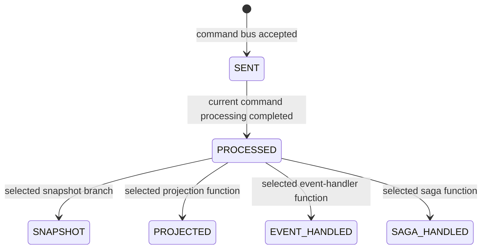

# HTTP 200 but the Query Is Empty: Stop Sleeping and Model Completion

A user submits an order, receives HTTP 200, and immediately gets 404 from the details page. Adding `sleep(1000)` may hide the problem temporarily, but it does not answer the real question: **what did the system promise to complete before returning?**

This article's argument is that success in an asynchronous read/write path must name the completion boundary required by the product, not a guessed delay.

## Separate Four Kinds of Statements

- **Opinion:** a fixed delay is not a completion contract; callers should wait for the result they consume.
- **Current Wow behavior:** the request's wait plan selects the stage the command response must observe.
- **Repository evidence:** current implementation and tests cover wait registration, stage signals, timeout cleanup, and example-domain behavior.
- **External research:** this article needs no external performance or productivity evidence, so it does not use historical TPS to justify the design.

The exact stages, function matching, and chained waits are governed by [Completion Semantics](../guide/command/completion.md); [Failures and Idempotency](../guide/command/reliability.md) owns the idempotency boundary. This article only explains how to choose a promise.

## HTTP 200 Means the Selected Response Contract Finished

At a Wow WebFlux command endpoint, the wait policy extracts a wait plan and the gateway registers a wait handle before sending the command. The same HTTP status can therefore represent different completion boundaries:

- `SENT` fits “the system accepted the request and may continue asynchronously”; it does not prove aggregate execution.
- `PROCESSED` fits “the domain decision and current command chain completed”; it does not prove a query projection is current.
- function-targeted `PROJECTED` proves only that the matching projection function's returned reactive chain completed. It does not prove that the query path, cache, or replica can already return the change, nor that unrelated consumers completed.

`SNAPSHOT`, `EVENT_HANDLED`, `SAGA_HANDLED`, and chained waits have different boundaries. Do not infer them from names; use [Completion Semantics](../guide/command/completion.md).

The post-processing stages are branches, not one mandatory pipeline.

This is an article-level mental model, not the complete API reference; the canonical guide remains authoritative.

## Why a Fixed Delay Is Not a Contract

`sleep(1s)` has two immediate defects:

1. if the target completes in 100 ms, the remaining 900 ms adds no correctness;
2. if the target still has not completed after one second, the read remains stale.

More importantly, a delay cannot identify which projection, function, or command completed. A targeted wait associates completion with a command and consumer; a deadline bounds that wait.

Ask “what result is required?” before asking “how long should we wait?”

| Product need | Completion boundary | Claim to avoid |
| --- | --- | --- |
| accept work and continue later | `SENT` | business rules already ran |
| confirm the domain decision before returning | `PROCESSED` | the query model is current |
| open a page backed by one projection | targeted `PROJECTED` plus an actual query/read-model visibility check | the query is visible because the processor signal arrived |

If the product reads sourced aggregate state rather than a projection, identify that actual read path before choosing a snapshot policy or wait stage. The canonical distinction is in [Read Paths](../guide/advanced/data-flow.md#read-paths).

## Timeout Means “Target Not Observed,” Not “Command Failed”

Missing the target signal before the deadline proves only that this wait timed out. The command may still be pending, its events may already be appended, or a notification or downstream consumer may be delayed.

Before retrying, retain the same logical `requestId`, query the command result or authoritative state, and record the last observed stage. Retrying with a new request ID can turn an unknown outcome into a duplicate business action. See [Failures and Idempotency](../guide/command/reliability.md) for Wow's scope and backend responsibilities.

## What the Current Repository Proves

The repository provides three kinds of evidence:

- [`CommandStage.kt`](https://github.com/Ahoo-Wang/Wow/blob/main/wow-core/src/main/kotlin/me/ahoo/wow/command/wait/CommandStage.kt) and the wait implementation define and enforce stage relationships;
- `wow-core` wait tests cover registration, signaling, and timeout cleanup;
- [Kotlin Order and Cart](../reference/example/order.md) proves the example command, event, state, and saga behavior; `./gradlew :example-domain:check` is its focused gate.

That evidence has a limit. The example `OrderProjector` mainly logs events; it demonstrates registration and dispatch, not a production read model. This article therefore does not claim production query consistency from example tests. Applications still need their own real projection store, fault injection, and HTTP-flow evidence.

## Adoption Checklist

1. Write down what the user does immediately after the response.
2. Identify the authoritative state or projection that action actually reads.
3. Select the weakest stage that scopes the required function; when the user consumes a query, execute that query as a separate visibility check.
4. Define the deadline and an explicit “outcome unknown” response.
5. Verify timeout, retry, and duplicate signals with the same request ID.
6. Test delay, failure, and recovery with real adapters, not only a happy path.

## Conclusion

“The endpoint succeeded but the query is empty” is not resolved by saying “eventual consistency.” Product and engineering must define which result, at which boundary, is complete for which caller.

Wow supplies declarative waits; it does not choose the correct promise for the application. A targeted `PROJECTED` wait can bound the matching projection function's returned chain, but actual query visibility remains a separate product acceptance check. That explicit pair is more reliable—and more honest—than `sleep(1s)`.

Continue with [Core Concepts](../guide/core-concepts.md), [Completion Semantics](../guide/command/completion.md), [Application Testing](../guide/application-testing.md), and [Troubleshooting](../guide/troubleshooting.md).
